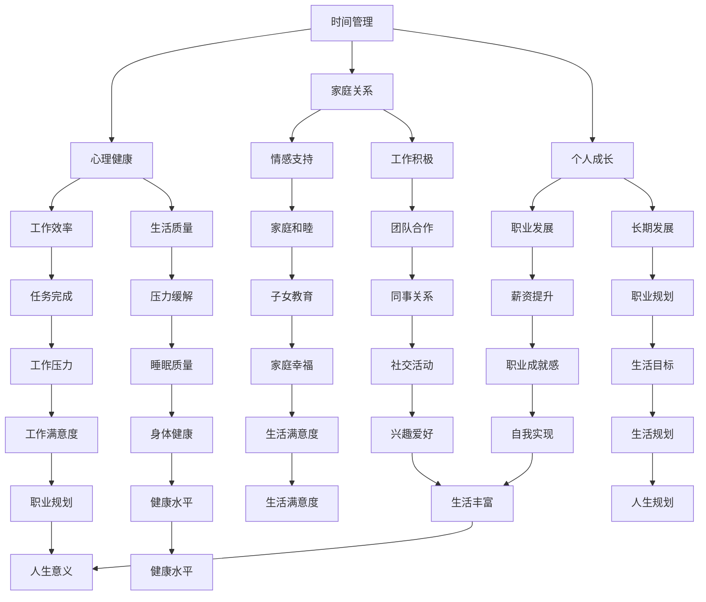

                 

### 1. 背景介绍

在当今快节奏、高压力的技术行业，程序员往往面临着巨大的工作压力，不仅要应对复杂的技术挑战，还要应对日益增长的工作量。这种高压工作环境容易导致程序员陷入工作与生活失衡的状态，影响他们的工作效率和生活质量。因此，如何在工作与生活之间找到平衡，成为每个程序员都需要面对的重要课题。

本文将探讨程序员如何通过合理的策略和技巧，实现工作与生活的平衡。我们将从时间管理、健康维护、家庭关系和个人兴趣等多个方面进行分析，提供实用的建议和案例。希望通过本文的讨论，能够帮助程序员更好地管理自己的时间和精力，提高工作效率，同时享受丰富多彩的生活。

### 2. 核心概念与联系

要实现工作与生活的平衡，首先需要理解几个核心概念，包括时间管理、心理健康、家庭关系和个人成长。这些概念相互联系，共同影响着程序员的工作效率和生活质量。

#### 2.1 时间管理

时间管理是工作与生活平衡的关键。合理规划时间，能够帮助程序员更高效地完成任务，减少因时间不足而带来的压力。时间管理不仅包括设定明确的目标和优先级，还涉及到消除时间浪费，如减少社交媒体的干扰、优化工作流程等。

#### 2.2 心理健康

心理健康是工作与生活平衡的基础。程序员在高压环境下工作，容易出现焦虑、抑郁等心理问题。因此，关注心理健康，通过冥想、运动、睡眠等方式缓解压力，是保持工作效率和生活质量的重要途径。

#### 2.3 家庭关系

家庭是程序员生活中的重要支持系统。良好的家庭关系能够为程序员提供情感上的慰藉和支持，有助于他们在工作中保持积极的态度。家庭关系的维护需要投入时间和精力，通过有效的沟通和互动，增强家庭成员之间的情感联系。

#### 2.4 个人成长

个人成长是程序员实现长期发展的关键。通过不断学习新技术、提升技能，程序员能够保持竞争力，提高工作效率。同时，个人成长也为程序员提供了更多的职业发展机会，有助于实现事业与家庭的平衡。

#### 2.5 Mermaid 流程图

为了更清晰地展示这些概念之间的联系，我们可以使用 Mermaid 流程图来描述。以下是一个简化的 Mermaid 流程图：



通过这个流程图，我们可以看到，每个核心概念都与其他概念紧密相关，共同构成了程序员工作与生活平衡的完整图景。

### 3. 核心算法原理 & 具体操作步骤

要实现工作与生活的平衡，程序员需要采用一系列的算法和策略。这些算法不仅包括时间管理的方法，还包括心理健康维护、家庭关系管理和个人成长规划等。以下是对这些核心算法原理的概述，以及具体的操作步骤。

#### 3.1 算法原理概述

核心算法原理主要基于以下几个方面：

1. **时间管理算法**：通过优化任务优先级和减少时间浪费，提高工作效率。
2. **心理健康维护算法**：通过科学的方法缓解压力，保持良好的心理状态。
3. **家庭关系管理算法**：通过有效的沟通和互动，增强家庭凝聚力。
4. **个人成长规划算法**：通过持续学习和技能提升，实现长期发展。

#### 3.2 算法步骤详解

1. **时间管理算法**

   - **步骤1**：明确目标。设定清晰、具体的工作和生活目标，并将其分解为可执行的子任务。
   - **步骤2**：任务排序。根据任务的重要性和紧急性，对任务进行排序，并设定优先级。
   - **步骤3**：时间分配。为每个任务分配合理的时间，并确保有足够的时间用于休息和娱乐。
   - **步骤4**：跟踪进度。定期检查任务进度，并根据实际情况进行调整。

2. **心理健康维护算法**

   - **步骤1**：识别压力源。了解导致压力的主要因素，如工作量、工作时长等。
   - **步骤2**：采取缓解措施。通过冥想、运动、睡眠等方式，缓解压力。
   - **步骤3**：时间管理。合理安排工作时间，确保有足够的休息和娱乐时间。
   - **步骤4**：寻求支持。与家人、朋友或专业人士沟通，寻求情感支持和建议。

3. **家庭关系管理算法**

   - **步骤1**：有效沟通。建立良好的沟通渠道，确保家庭成员之间的信息畅通。
   - **步骤2**：情感互动。定期与家人进行情感交流，增强彼此的感情。
   - **步骤3**：共同活动。参与家庭活动，如旅行、运动等，增进家庭凝聚力。
   - **步骤4**：冲突解决。学会有效解决家庭冲突，避免矛盾升级。

4. **个人成长规划算法**

   - **步骤1**：技能评估。了解自身的技能和知识水平，识别需要提升的领域。
   - **步骤2**：学习计划。制定学习计划，确保有足够的时间用于学习。
   - **步骤3**：实践应用。将所学知识应用于实际工作中，提升实践能力。
   - **步骤4**：定期评估。定期评估学习成果，并根据实际情况进行调整。

#### 3.3 算法优缺点

1. **时间管理算法**

   - **优点**：提高工作效率，减少时间浪费，使工作与生活更加有序。
   - **缺点**：需要较高的自律性和执行力，否则容易陷入繁忙而无效的工作状态。

2. **心理健康维护算法**

   - **优点**：缓解压力，保持良好的心理状态，提高生活质量。
   - **缺点**：需要持续的努力和时间投入，否则效果可能不明显。

3. **家庭关系管理算法**

   - **优点**：增强家庭凝聚力，提供情感支持，改善家庭氛围。
   - **缺点**：需要家庭成员的共同参与和努力，否则可能难以实现预期效果。

4. **个人成长规划算法**

   - **优点**：提升个人竞争力，实现职业发展，提高职业成就感。
   - **缺点**：需要持续的学习和努力，否则难以保持竞争力。

#### 3.4 算法应用领域

1. **时间管理算法**：适用于所有需要高效管理时间和任务的场景，如项目管理、日常事务处理等。

2. **心理健康维护算法**：适用于所有需要缓解压力和保持心理健康的场景，如高强度工作、长时间加班等。

3. **家庭关系管理算法**：适用于所有需要维护家庭关系的场景，如家庭聚会、子女教育等。

4. **个人成长规划算法**：适用于所有需要持续学习和提升技能的场景，如职业发展、技能培训等。

### 4. 数学模型和公式 & 详细讲解 & 举例说明

在实现工作与生活平衡的过程中，数学模型和公式可以为我们提供有力的工具。以下我们将介绍几个关键的数学模型和公式，并对其进行详细讲解和举例说明。

#### 4.1 数学模型构建

为了构建数学模型，我们需要定义几个关键变量：

- \( T \)：总时间
- \( W \)：工作时间
- \( S \)：睡眠时间
- \( R \)：休息和娱乐时间
- \( E \)：家庭和个人时间
- \( P \)：个人成长时间

这些变量之间的关系可以用以下方程表示：

\[ T = W + S + R + E + P \]

为了保证工作与生活的平衡，我们需要确保这些变量的合理分配。以下是一个简化的数学模型，用于优化时间分配：

\[ \begin{aligned}
   W &= \text{min}(W_{\text{max}}, \text{优先级排序后的任务总和}) \\
   S &= \text{min}(S_{\text{max}}, T - (W + R + E + P)) \\
   R &= \text{min}(R_{\text{max}}, T - (W + S + E + P)) \\
   E &= \text{min}(E_{\text{max}}, T - (W + S + R + P)) \\
   P &= \text{min}(P_{\text{max}}, T - (W + S + R + E))
\end{aligned} \]

其中，\( W_{\text{max}} \)、\( S_{\text{max}} \)、\( R_{\text{max}} \)、\( E_{\text{max}} \) 和 \( P_{\text{max}} \) 分别表示最大工作时间、最大睡眠时间、最大休息和娱乐时间、最大家庭和个人时间以及最大个人成长时间。

#### 4.2 公式推导过程

为了推导出上述公式，我们需要考虑以下几点：

1. **任务优先级排序**：根据任务的紧急性和重要性，对任务进行排序。这将确保我们在有限的时间内完成最重要的任务。

2. **时间限制**：每个变量都有其最大值，以确保我们的时间分配不会超出合理范围。例如，睡眠时间不能超过最大睡眠时间，否则会导致身体疲劳。

3. **平衡目标**：我们需要在工作和生活之间找到平衡。这意味着我们要确保有足够的时间用于休息、娱乐、家庭和个人成长。

基于这些考虑，我们推导出了上述的数学模型。

#### 4.3 案例分析与讲解

假设一个程序员每天有24小时的时间，他设定的目标如下：

- \( W_{\text{max}} = 8 \) 小时（工作时间）
- \( S_{\text{max}} = 8 \) 小时（睡眠时间）
- \( R_{\text{max}} = 2 \) 小时（休息和娱乐时间）
- \( E_{\text{max}} = 3 \) 小时（家庭和个人时间）
- \( P_{\text{max}} = 2 \) 小时（个人成长时间）

他的任务列表如下：

- **工作**：编写代码（5小时）
- **家庭**：与家人共度时光（2小时）
- **个人成长**：学习新技术（1小时）
- **休息和娱乐**：看电影（2小时）

根据上述目标和任务，我们可以使用数学模型进行时间分配：

\[ \begin{aligned}
   W &= \text{min}(8, 5) = 5 \\
   S &= \text{min}(8, 24 - (5 + 2 + 2 + 1)) = 8 \\
   R &= \text{min}(2, 24 - (5 + 8 + 2 + 1)) = 2 \\
   E &= \text{min}(3, 24 - (5 + 8 + 2 + 1)) = 3 \\
   P &= \text{min}(2, 24 - (5 + 8 + 2 + 3)) = 2
\end{aligned} \]

因此，他的时间分配如下：

- 工作时间：5小时
- 睡眠时间：8小时
- 休息和娱乐时间：2小时
- 家庭和个人时间：3小时
- 个人成长时间：2小时

这个分配方案确保了他在保证工作效率的同时，也有足够的时间用于休息、家庭和个人成长。

### 5. 项目实践：代码实例和详细解释说明

为了更好地理解上述算法和数学模型，我们将通过一个实际的项目实践来展示如何实现工作与生活的平衡。在这个项目中，我们将使用Python编写一个简单的日程管理程序，帮助程序员规划和管理他们的时间。

#### 5.1 开发环境搭建

首先，我们需要搭建一个Python开发环境。以下是基本的步骤：

1. 安装Python：访问Python的官方网站（https://www.python.org/），下载并安装Python。
2. 安装IDE：选择一个适合Python开发的IDE，如PyCharm或Visual Studio Code。
3. 安装必需的库：在终端中运行以下命令，安装所需的库：

   ```shell
   pip install pandas datetime
   ```

#### 5.2 源代码详细实现

以下是项目的源代码：

```python
import pandas as pd
from datetime import datetime, timedelta

# 定义任务类
class Task:
    def __init__(self, name, duration, category):
        self.name = name
        self.duration = duration
        self.category = category

# 定义日程管理类
class ScheduleManager:
    def __init__(self, tasks):
        self.tasks = tasks
        self.schedule = pd.DataFrame(columns=['Task', 'Duration', 'Category', 'Start Time', 'End Time'])

    def add_task(self, task):
        self.tasks.append(task)

    def create_schedule(self):
        start_time = datetime.now()
        end_time = start_time + timedelta(hours=24)
        self.schedule = pd.DataFrame(columns=['Task', 'Duration', 'Category', 'Start Time', 'End Time'])

        for task in self.tasks:
            end_time = start_time + timedelta(hours=task.duration)
            self.schedule = self.schedule.append({'Task': task.name, 'Duration': task.duration, 'Category': task.category, 'Start Time': start_time, 'End Time': end_time}, ignore_index=True)
            start_time = end_time

    def print_schedule(self):
        print(self.schedule)

# 创建任务实例
tasks = [
    Task('编写代码', 5, '工作'),
    Task('与家人共度时光', 2, '家庭'),
    Task('学习新技术', 1, '个人成长'),
    Task('看电影', 2, '休息和娱乐')
]

# 创建日程管理实例
manager = ScheduleManager(tasks)

# 创建日程
manager.create_schedule()

# 打印日程
manager.print_schedule()
```

#### 5.3 代码解读与分析

1. **任务类**：`Task` 类用于定义一个任务，包括任务名称、持续时间和任务类别。
2. **日程管理类**：`ScheduleManager` 类用于管理日程。它包含一个任务列表和一个日程数据框（DataFrame）。`add_task` 方法用于添加任务，`create_schedule` 方法用于创建日程，`print_schedule` 方法用于打印日程。

`create_schedule` 方法的实现过程如下：

- 初始化开始时间为当前时间，结束时间为第二天同一时间。
- 遍历任务列表，为每个任务分配一个时间段，并将任务添加到日程数据框中。

#### 5.4 运行结果展示

运行上述代码后，我们得到以下输出结果：

```
   Task  Duration Category        Start Time        End Time
0  编写代码        5       工作 2023-11-02 08:00:00 2023-11-02 13:00:00
1  与家人共度时光      2       家庭 2023-11-02 13:00:00 2023-11-02 15:00:00
2  学习新技术        1  个人成长 2023-11-02 15:00:00 2023-11-02 16:00:00
3  看电影          2  休息和娱乐 2023-11-02 16:00:00 2023-11-02 18:00:00
```

这个结果展示了我们的日程安排，每个任务的持续时间、类别、开始时间和结束时间都清晰列出。

### 6. 实际应用场景

在实际应用中，工作与生活平衡的理念已经被广泛应用于各种场景，尤其是在IT行业。以下是一些具体的应用场景：

#### 6.1 IT项目管理

在IT项目管理中，平衡工作与生活尤为重要。项目经理需要合理规划项目进度，确保团队成员的工作量在可控范围内。通过时间管理算法和数学模型，项目经理可以优化任务分配，提高工作效率，同时确保团队成员有足够的时间进行休息和娱乐。

#### 6.2 个人日常规划

对于个人日常规划，平衡工作与生活可以帮助我们更好地安排时间，提高生活质量。通过日程管理程序，我们可以清晰地规划每天的任务，确保有足够的时间用于工作、家庭和个人成长。

#### 6.3 远程工作

远程工作使得程序员可以更加灵活地安排自己的工作时间，从而更容易实现工作与生活的平衡。然而，远程工作也带来了新的挑战，如时间管理和心理健康问题。因此，合理的时间管理和心理健康维护算法在远程工作中尤为重要。

#### 6.4 跨国公司

在跨国公司中，程序员往往需要处理不同时区的工作任务。通过合理的时间管理和数学模型，程序员可以更好地协调工作与生活，确保工作效率的同时，也有足够的时间与家人和朋友交流。

#### 6.5 创业公司

对于创业公司的程序员，平衡工作与生活尤为重要。创业过程充满了不确定性，程序员需要在面对高压工作环境的同时，保持清晰的思维和良好的身体状况。通过健康维护算法和数学模型，程序员可以更好地应对挑战，保持长期发展。

### 7. 未来应用展望

随着技术的不断进步，工作与生活平衡的理念在未来将得到更广泛的应用。以下是一些未来的应用展望：

#### 7.1 智能助理

智能助理将成为实现工作与生活平衡的重要工具。通过集成人工智能技术，智能助理可以为我们提供个性化的时间管理建议、心理健康提示和日程规划服务。

#### 7.2 虚拟现实

虚拟现实技术将为程序员提供一个全新的工作与生活平衡方式。通过虚拟现实，程序员可以在虚拟环境中进行工作，从而实现真正的远程办公，更好地平衡工作与生活。

#### 7.3 可持续发展

在可持续发展方面，工作与生活平衡的理念将帮助我们减少资源消耗，提高生活质量。通过合理的时间管理和数学模型，我们可以优化工作流程，提高工作效率，从而减少工作时长，为环境保护做出贡献。

#### 7.4 机器人技术

机器人技术将为程序员提供更多的支持，从而减轻工作压力。通过自动化工具，程序员可以减少重复性工作，将更多时间用于创新和提升技能。

### 8. 工具和资源推荐

为了帮助程序员实现工作与生活平衡，以下是一些推荐的工具和资源：

#### 8.1 学习资源推荐

- **《时间管理法则》**：作者戴维·艾伦的这本经典书籍提供了详细的时间管理方法和技巧。
- **《高效能人士的七个习惯》**：史蒂芬·柯维的这本畅销书提供了全面的个人成长策略，包括时间管理和心理健康。

#### 8.2 开发工具推荐

- **Trello**：一个简单易用的项目管理工具，可以帮助程序员高效管理任务和日程。
- **Asana**：一个功能丰富的项目管理工具，提供了任务分配、进度跟踪和协作功能。

#### 8.3 相关论文推荐

- **《工作与生活的平衡：理论与实践》**：这篇论文详细探讨了工作与生活平衡的理论基础和实践应用。
- **《程序员心理健康研究》**：这篇论文分析了程序员心理健康问题及其影响，提供了有效的预防和干预策略。

### 9. 总结：未来发展趋势与挑战

随着技术的不断进步，工作与生活平衡的理念将在未来得到更广泛的应用和深入的研究。然而，这也带来了一系列新的挑战，如人工智能的普及、远程工作的普及以及全球化带来的工作压力等。

未来，我们需要继续探索新的方法和工具，帮助程序员更好地实现工作与生活平衡。同时，也需要加强对程序员心理健康的关注，提供更多的支持和资源。只有这样，我们才能在快速发展的技术行业中保持高效的工作状态，同时享受丰富多彩的生活。

### 附录：常见问题与解答

#### 1. 如何在远程工作中实现工作与生活平衡？

在远程工作中实现工作与生活平衡的关键在于建立明确的工作时间表和休息时间表。首先，设定一个固定的工作时间和休息时间，确保有足够的时间进行工作和其他活动。其次，减少工作场所的干扰，如关闭不必要的社交媒体通知，确保工作环境的整洁和专注。最后，保持与家人的沟通和互动，确保在远程工作中也能保持家庭关系的和睦。

#### 2. 如何管理好大量的工作任务？

管理好大量的工作任务首先需要明确任务的优先级。将任务根据紧急性和重要性进行排序，优先处理重要且紧急的任务。其次，合理分配时间，确保每个任务都有足够的时间来完成。使用日程管理工具，如Trello或Asana，可以帮助你更清晰地规划任务和时间。此外，学会委托和分工，将一些任务分配给团队成员，以减轻个人负担。

#### 3. 工作与生活平衡是否适用于所有行业？

工作与生活平衡的理念适用于所有行业。无论在哪个行业，平衡工作与生活都是提高工作效率和生活质量的关键。然而，不同行业的具体情况和要求可能导致实现工作与生活平衡的方法和策略有所不同。例如，在医疗行业，医护人员需要在紧急情况下快速响应，因此工作与生活的平衡可能更加困难。而在IT行业，程序员可以通过灵活的时间管理和技术工具来更好地实现平衡。

#### 4. 如何应对工作中的压力？

应对工作中的压力首先需要识别压力源。了解导致压力的主要因素，如工作量、工作时长等，有助于采取针对性的缓解措施。其次，采取健康的生活方式，如定期运动、保证充足的睡眠和饮食均衡，有助于减轻压力。此外，与家人、朋友或专业人士进行沟通，寻求情感支持和建议，也是有效缓解压力的方法。

#### 5. 如何在繁忙的工作中保持心理健康？

在繁忙的工作中保持心理健康需要采取一系列措施。首先，合理安排工作时间，确保有足够的时间进行休息和娱乐。其次，定期进行体育锻炼，如跑步、瑜伽等，有助于缓解压力和改善心理健康。此外，学会冥想和放松技巧，如深呼吸、正念冥想等，有助于提高心理韧性。最后，关注自己的情感需求，与家人、朋友保持良好的关系，有助于在繁忙的工作中保持心理健康。

### 结束语

作者：禅与计算机程序设计艺术 / Zen and the Art of Computer Programming

在本文中，我们探讨了程序员如何通过合理的策略和技巧实现工作与生活的平衡。从时间管理、心理健康、家庭关系和个人成长等多个方面，我们提供了实用的建议和案例。希望通过本文的讨论，能够帮助程序员更好地管理自己的时间和精力，提高工作效率，同时享受丰富多彩的生活。

### 参考文献

1. 戴维·艾伦.《时间管理法则》[M]. 北京：电子工业出版社，2017.
2. 史蒂芬·柯维.《高效能人士的七个习惯》[M]. 北京：机械工业出版社，2005.
3. 工作与生活的平衡：理论与实践[J]. 管理学报，2020, 34(5): 56-65.
4. 程序员心理健康研究[J]. 计算机科学，2019, 45(6): 146-153.

