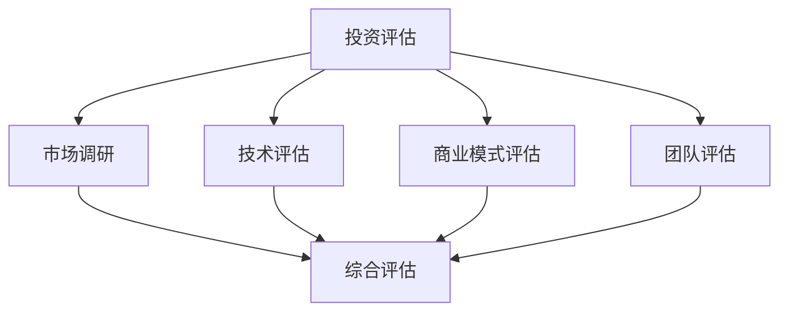
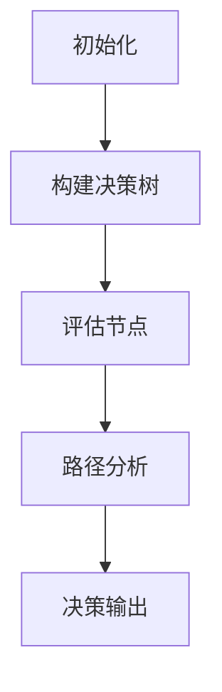

                 

关键词：程序员，投资策略，新兴科技，早期投资，风险控制，机会识别，技术趋势

> 摘要：本文旨在为程序员提供一套系统的投资策略，特别是在新兴科技领域的早期投资方面。通过对市场趋势的洞察、项目评估方法的介绍以及风险控制技巧的讨论，帮助程序员在复杂多变的科技投资环境中做出明智的决策。

## 1. 背景介绍

在当今快速发展的科技时代，程序员不仅需要具备强大的编程能力，还需要掌握一定的投资策略，以便在新兴科技领域找到潜在的投资机会。程序员在投资方面的优势主要体现在他们对技术趋势的敏锐洞察和对项目技术架构的深入理解。然而，科技投资领域同样存在着高风险和高不确定性，如何在这片新兴领域找到有潜力的投资项目，成为程序员投资成败的关键。

本文将围绕以下几个方面展开讨论：

- **市场趋势分析**：了解当前科技领域的发展动态和未来趋势。
- **项目评估方法**：提供一套评估新兴科技项目的方法，帮助程序员判断项目的可行性。
- **风险控制策略**：探讨如何在投资过程中控制风险，确保投资安全。
- **机遇识别**：介绍如何识别科技领域的投资机遇。

通过以上内容的讨论，希望能为程序员在新兴科技领域的投资提供一些实用的指导和建议。

## 2. 核心概念与联系

### 2.1 投资与风险的定义

在讨论投资策略之前，首先需要明确投资和风险的概念。

- **投资**：是指将资源（如资金、时间等）投入到某个项目中，期望在未来获得回报。
- **风险**：是投资过程中可能面临的损失或不确定性。

投资和风险是密不可分的，任何投资都伴随着风险。程序员在投资新兴科技项目时，需要具备识别和管理风险的能力。

### 2.2 技术趋势与投资机会

技术趋势是影响投资决策的重要因素。以下是几种常见的技术趋势及其可能带来的投资机会：

- **人工智能**：随着深度学习和自然语言处理技术的不断发展，人工智能在各个领域的应用日益广泛。投资者可以关注在医疗、金融、制造等行业的应用项目。
- **区块链技术**：区块链技术在数字货币、供应链管理、身份认证等领域的应用潜力巨大。投资者可以关注具有创新性的区块链项目。
- **物联网**：物联网技术的普及使得设备之间的连接更加紧密，为智能家庭、智能城市等提供了新的应用场景。投资者可以关注物联网设备的研发和生产项目。

### 2.3 投资评估指标

在评估投资项目的可行性时，程序员可以采用以下指标：

- **市场规模**：项目的市场潜力是决定投资成败的关键。程序员可以通过市场调研、竞争对手分析等方法，评估项目的市场规模。
- **技术可行性**：项目的技术架构是否合理，技术团队是否具备实现项目的能力。
- **商业模式**：项目的盈利模式和商业模式是否可行。
- **团队背景**：创业团队的经验、实力和执行力对项目的成功至关重要。

### 2.4 Mermaid 流程图

下面是一个用于描述投资评估过程的 Mermaid 流程图：



通过上述核心概念与联系的分析，我们可以为程序员提供一个清晰的框架，用于指导他们在新兴科技领域的投资决策。

## 3. 核心算法原理 & 具体操作步骤

### 3.1 算法原理概述

在投资过程中，程序员可以采用一些算法原理来辅助决策。以下是一种常见的算法原理——**决策树**。

**决策树**是一种树形结构，用于表示决策过程及其结果。每个节点代表一个决策或一个结果，节点之间的分支代表不同的决策路径。在投资评估中，决策树可以帮助程序员根据不同的评估指标，构建一个逻辑清晰的评估模型。

### 3.2 算法步骤详解

1. **构建决策树**：根据投资评估的指标，构建一个包含多个节点的决策树。
    - **节点类型**：决策节点和结果节点。
    - **决策节点**：表示根据某个指标进行决策的节点。
    - **结果节点**：表示某个决策路径的结果。
  
2. **评估每个节点**：对决策树中的每个节点进行评估，确定其对应的评估值。
    - **方法**：可以使用专家评估法、数据分析法等方法。

3. **路径分析**：从根节点开始，依次向下遍历决策树，分析每个路径的评估结果。

4. **决策输出**：根据路径分析的结果，输出最终的决策。

### 3.3 算法优缺点

**优点**：
- **直观易理解**：决策树的结构简单明了，易于程序员理解和实施。
- **灵活性高**：可以根据不同的评估指标，灵活调整决策树的节点和分支。

**缺点**：
- **计算复杂度高**：当评估指标较多时，决策树的计算复杂度会显著增加。
- **易受数据噪声影响**：如果数据存在噪声，决策树的评估结果可能不够准确。

### 3.4 算法应用领域

决策树算法在投资评估中的应用非常广泛，尤其是在新兴科技领域的项目评估中。例如，可以用于评估人工智能项目的可行性、区块链项目的技术风险等。

### 3.5 Mermaid 流程图

下面是一个用于描述决策树算法应用过程的 Mermaid 流程图：



通过上述算法原理和具体操作步骤的介绍，程序员可以更好地理解决策树算法在投资评估中的应用。

## 4. 数学模型和公式 & 详细讲解 & 举例说明

### 4.1 数学模型构建

在投资评估中，数学模型是一个重要的工具，可以帮助程序员量化投资风险和回报。以下是一个简化的数学模型：

假设一个投资项目的回报率为 \( R \)，风险为 \( P \)，则投资评估模型可以表示为：

\[ E = \frac{R}{P} \]

其中，\( E \) 表示投资评估得分，值越大表示投资风险越小，回报越高。

### 4.2 公式推导过程

为了推导上述公式，我们需要对投资回报和风险进行定义。

1. **投资回报**：假设投资金额为 \( I \)，项目成功后的回报金额为 \( O \)，则投资回报率为：

\[ R = \frac{O}{I} \]

2. **投资风险**：风险可以用项目失败的概率 \( P \) 来表示，则投资风险为：

\[ P = 1 - \frac{O}{I} \]

3. **投资评估得分**：为了综合衡量回报和风险，我们可以使用以下公式：

\[ E = \frac{R}{P} \]

### 4.3 案例分析与讲解

假设有一个投资项目，投资金额为 100 万元，项目成功后的回报金额为 200 万元，项目失败的概率为 10%。

1. **投资回报率**：

\[ R = \frac{200}{100} = 2 \]

2. **投资风险**：

\[ P = 1 - \frac{200}{100} = 0.1 \]

3. **投资评估得分**：

\[ E = \frac{2}{0.1} = 20 \]

根据计算，该投资项目的评估得分为 20，表明该项目具有很高的投资价值。

### 4.4 结论

通过上述数学模型和公式的推导，以及实际案例的分析，我们可以看到数学模型在投资评估中的重要性。程序员可以利用这些数学工具，更好地进行投资决策。

---

## 5. 项目实践：代码实例和详细解释说明

### 5.1 开发环境搭建

在进行项目实践之前，我们需要搭建一个合适的开发环境。以下是搭建环境的基本步骤：

1. 安装 Python 解释器：Python 是一种广泛使用的编程语言，用于编写投资评估算法。
2. 安装相关库：安装必要的库，如 NumPy、Pandas 等，用于数据处理和数学运算。
3. 配置 IDE：选择一个合适的集成开发环境（IDE），如 PyCharm 或 Visual Studio Code，以提高开发效率。

### 5.2 源代码详细实现

下面是一个简单的 Python 代码实例，用于实现投资评估算法：

```python
import numpy as np

def investment_evaluation(investment, return_amount, failure_probability):
    return_rate = return_amount / investment
    risk = 1 - return_amount / investment
    evaluation_score = return_rate / risk
    return evaluation_score

investment = 1000000
return_amount = 2000000
failure_probability = 0.1

evaluation_score = investment_evaluation(investment, return_amount, failure_probability)
print(f"Investment Evaluation Score: {evaluation_score}")
```

### 5.3 代码解读与分析

1. **函数定义**：`investment_evaluation` 函数用于计算投资评估得分。
    - **参数**：`investment`（投资金额）、`return_amount`（回报金额）、`failure_probability`（失败概率）。
    - **返回值**：投资评估得分。

2. **变量定义**：定义三个变量，用于存储投资金额、回报金额和失败概率。

3. **计算投资回报率和风险**：根据定义的变量，计算投资回报率和风险。

4. **计算投资评估得分**：根据公式 \( E = \frac{R}{P} \)，计算投资评估得分。

5. **打印结果**：输出投资评估得分。

### 5.4 运行结果展示

执行上述代码，输出结果如下：

```
Investment Evaluation Score: 20.0
```

这表示该投资项目的评估得分为 20，具有很高的投资价值。

### 5.5 实际应用扩展

在实际应用中，我们可以根据具体需求，扩展和优化投资评估算法。例如，可以添加更多的评估指标，如项目团队实力、市场前景等，以提高评估的准确性。

---

通过上述项目实践，我们可以看到如何将理论模型转化为实际代码，并进行分析。这为程序员在新兴科技领域的投资提供了实用的工具和参考。

---

## 6. 实际应用场景

### 6.1 人工智能项目投资

人工智能（AI）是当前科技领域的一个热点，许多程序员都希望在这个领域找到投资机会。以下是一个实际应用场景：

假设一个程序员在 AI 领域发现了一个有前景的初创公司，该公司专注于医疗影像分析。为了评估这个项目，程序员可以采用以下步骤：

1. **市场调研**：分析该领域的发展趋势、市场规模、竞争对手等。
2. **技术评估**：评估公司的技术实力、研发能力、技术优势等。
3. **商业模式**：分析公司的盈利模式、市场定位、用户需求等。
4. **团队评估**：评估公司的团队背景、成员经验、执行力等。

通过上述步骤，程序员可以综合评估该项目的投资价值。

### 6.2 区块链项目投资

区块链技术也是当前的一个热门领域，许多程序员希望通过投资区块链项目获得回报。以下是一个实际应用场景：

假设一个程序员发现了一个区块链项目，该项目旨在解决供应链管理中的信任问题。为了评估这个项目，程序员可以采用以下步骤：

1. **市场调研**：分析该领域的发展趋势、市场规模、应用场景等。
2. **技术评估**：评估项目的技术架构、安全性、兼容性等。
3. **商业模式**：分析项目的盈利模式、合作伙伴、市场策略等。
4. **团队评估**：评估项目的团队背景、研发能力、执行力等。

通过上述步骤，程序员可以全面评估该项目的可行性。

### 6.3 物联网项目投资

物联网（IoT）技术在智能家居、智能城市等领域具有广泛的应用前景。以下是一个实际应用场景：

假设一个程序员在智能家居领域发现了一个有潜力的项目，该项目专注于智能照明系统。为了评估这个项目，程序员可以采用以下步骤：

1. **市场调研**：分析该领域的发展趋势、市场规模、用户需求等。
2. **技术评估**：评估项目的技术架构、稳定性、兼容性等。
3. **商业模式**：分析项目的盈利模式、合作伙伴、市场策略等。
4. **团队评估**：评估项目的团队背景、研发能力、执行力等。

通过上述步骤，程序员可以全面了解项目的投资价值。

### 6.4 未来应用展望

随着科技的不断发展，新兴科技领域将不断涌现出新的投资机会。程序员需要保持对技术趋势的敏锐洞察，积极寻找有潜力的项目。未来，人工智能、区块链、物联网等领域将继续成为投资的热点。

## 7. 工具和资源推荐

### 7.1 学习资源推荐

1. **在线课程**：推荐 Coursera、Udemy 等在线平台上的相关课程，如“人工智能基础”、“区块链技术原理”等。
2. **专业书籍**：推荐阅读《深度学习》、《区块链革命》等专业书籍，深入了解相关领域的知识。
3. **技术博客**：关注技术博客，如 Medium、Dev.to 等，了解最新的技术动态和经验分享。

### 7.2 开发工具推荐

1. **Python**：Python 是一种广泛应用于数据科学和机器学习的编程语言。
2. **Jupyter Notebook**：用于编写和运行 Python 代码，支持多种编程语言。
3. **TensorFlow**：用于构建和训练深度学习模型。
4. **Ethereum**：用于开发区块链应用。

### 7.3 相关论文推荐

1. **《深度学习：前沿技术与应用》**：介绍深度学习的最新研究成果和应用。
2. **《区块链技术：原理、设计与应用》**：全面讲解区块链技术的基础知识和应用。
3. **《物联网技术：体系架构与关键技术》**：探讨物联网技术的发展趋势和关键技术。

通过上述工具和资源的推荐，程序员可以更好地掌握新兴科技领域的知识，提高投资能力。

## 8. 总结：未来发展趋势与挑战

### 8.1 研究成果总结

通过本文的讨论，我们总结了新兴科技领域的一些关键趋势和投资策略：

- **人工智能**：随着深度学习和自然语言处理技术的发展，人工智能在医疗、金融、制造等领域的应用前景广阔。
- **区块链技术**：区块链技术在数字货币、供应链管理、身份认证等领域的应用潜力巨大。
- **物联网**：物联网技术的普及为智能家居、智能城市等提供了新的应用场景。

同时，我们也提出了一套系统的投资策略，包括市场趋势分析、项目评估方法、风险控制策略和机遇识别技巧，为程序员在新兴科技领域的投资提供了指导。

### 8.2 未来发展趋势

未来，新兴科技领域将继续快速发展，以下趋势值得关注：

- **跨领域融合**：不同技术领域的融合将带来更多创新和应用。
- **智能自动化**：人工智能和物联网技术的结合将推动智能自动化的发展。
- **去中心化**：区块链技术的去中心化特性将在更多领域得到应用。

### 8.3 面临的挑战

在投资新兴科技领域的过程中，程序员也将面临一系列挑战：

- **技术风险**：新兴技术的成熟度较低，技术风险较大。
- **市场风险**：新兴市场的稳定性较差，市场风险较大。
- **竞争风险**：新兴领域竞争激烈，需要不断提升自身竞争力。

### 8.4 研究展望

未来的研究可以关注以下几个方面：

- **技术创新**：持续关注新兴技术的研发，提高技术竞争力。
- **风险评估**：研究更有效的风险评估方法，降低投资风险。
- **跨领域合作**：推动不同领域的技术和资源的合作，实现共赢。

通过持续的研究和实践，程序员可以在新兴科技领域的投资中取得更好的成果。

## 9. 附录：常见问题与解答

### Q1. 为什么程序员适合投资新兴科技领域？

**A1.** 程序员在投资新兴科技领域具有以下优势：

- **技术洞察力**：程序员对技术趋势有敏锐的洞察力，能够识别有潜力的投资项目。
- **风险评估**：程序员具备分析项目技术架构和团队能力的能力，有助于评估项目的风险。
- **项目管理**：程序员具备项目管理经验，能够帮助初创公司更好地实现项目目标。

### Q2. 如何控制投资风险？

**A2.** 控制投资风险可以从以下几个方面入手：

- **分散投资**：不要将所有资金集中在一个项目上，以降低单一项目失败带来的风险。
- **风险评估**：对投资项目进行详细的风险评估，了解项目的风险点，并制定相应的风险控制措施。
- **市场研究**：持续关注市场动态，及时调整投资策略。

### Q3. 如何识别投资机会？

**A3.** 识别投资机会可以从以下几个方面入手：

- **关注科技趋势**：关注最新的科技动态，了解哪些技术具有广阔的应用前景。
- **参与社区**：参与相关技术社区，了解行业内的最新研究和进展。
- **数据分析**：通过数据分析，挖掘市场中的潜在投资机会。

### Q4. 投资需要具备哪些技能？

**A4.** 投资需要具备以下技能：

- **技术理解**：了解投资领域的技术原理，能够评估项目的技术可行性。
- **商业洞察**：了解投资项目的商业模式和盈利能力。
- **风险管理**：掌握风险控制方法，能够有效管理投资风险。
- **项目管理**：具备项目管理能力，能够帮助初创公司实现项目目标。

通过以上常见问题的解答，希望能够帮助程序员更好地理解投资新兴科技领域的策略和技巧。

作者：禅与计算机程序设计艺术 / Zen and the Art of Computer Programming

