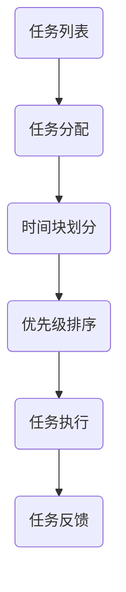

                 

在信息技术飞速发展的今天，时间成为了程序员最为宝贵的资源。面对海量的代码、频繁的技术更新和日益增长的工作压力，如何高效管理时间、提升工作效率，已成为每一个程序员都需要掌握的核心技能。本文将深入探讨程序员的时间管理艺术，旨在为大家提供一套系统、实用的方法，帮助程序员在职场中脱颖而出，实现个人与职业的双重提升。

## 关键词

- 时间管理
- 效率
- 程序员
- 职场技能
- 工作方法

## 摘要

本文将围绕程序员的时间管理这一核心主题，从理论基础到实践应用，系统阐述时间管理的重要性，介绍一系列实用的工具和方法，分析提高工作效率的技巧，并探讨未来时间管理的发展趋势。通过阅读本文，程序员将能够更好地理解时间管理的本质，掌握有效的时间管理技巧，从而在职场中取得卓越的成果。

### 1. 背景介绍

#### 1.1 程序员的时间困境

程序员的工作本质上是创造性的，同时要求高度的专注和细致。然而，现实工作中却常常面临诸多挑战：

- **任务繁多**：程序员需要处理的任务种类繁多，从需求分析、代码编写、测试到部署，每一个环节都需要耗费大量的时间和精力。
- **技术更新**：技术的快速迭代使得程序员需要不断学习新的编程语言、框架和工具，以保持竞争力。
- **工作压力**：项目截止日期、客户需求变动和团队期望都给程序员带来了巨大的压力，容易导致时间管理不当。

#### 1.2 时间管理的必要性

面对上述挑战，时间管理显得尤为重要：

- **提高工作效率**：合理的时间管理可以帮助程序员更高效地完成任务，减少无效工作时间。
- **减轻工作压力**：通过优化工作流程，程序员可以减少因时间紧张而产生的焦虑和压力。
- **平衡工作与生活**：合理的时间管理不仅能够提高工作效率，还可以帮助程序员更好地平衡工作与生活，实现个人与职业的双赢。

### 2. 核心概念与联系

为了更好地理解时间管理，我们首先需要明确以下几个核心概念：

- **任务**：程序员需要完成的具体工作内容，包括编码、测试、文档编写等。
- **时间块**：将时间划分为若干块，每块时间用于处理特定任务。
- **优先级**：根据任务的重要性和紧急程度，对任务进行优先级排序。
- **时间浪费**：指在任务处理过程中产生的非必要的延误和中断。

以下是一个简化的时间管理 Mermaid 流程图，用于描述程序员如何将任务分配到时间块中，并根据优先级进行管理。



### 3. 核心算法原理 & 具体操作步骤

#### 3.1 算法原理概述

时间管理的核心在于高效地处理任务，以下是一个基本的时间管理算法原理：

1. **任务识别**：明确每个任务的目标和完成条件。
2. **任务排序**：根据任务的重要性和紧急程度进行排序。
3. **时间分配**：将任务分配到不同的时间块中。
4. **任务执行**：按计划执行任务，避免时间浪费。
5. **任务反馈**：对任务完成情况进行反馈，并进行调整。

#### 3.2 算法步骤详解

1. **任务识别**：首先，列出所有待处理的任务，明确每个任务的目标和完成条件。可以使用 To-Do List 或者项目管理工具进行记录。

2. **任务排序**：根据任务的重要性和紧急程度进行排序。可以使用优先级矩阵（如艾森豪威尔矩阵）进行任务排序，将任务分为四个象限：

   - **重要且紧急**：立即处理。
   - **重要但不紧急**：安排合适的时间进行处理。
   - **不重要但紧急**：委托他人处理。
   - **不重要且不紧急**：尽量减少此类任务。

3. **时间分配**：将任务分配到不同的时间块中。可以根据任务的性质和时间长度，将时间块划分为不同的时间段，如小时、半天或整天。

4. **任务执行**：按计划执行任务，避免时间浪费。在执行任务时，可以使用番茄工作法（Pomodoro Technique）来提高专注度，将工作时间划分为25分钟的工作块和5分钟的休息时间。

5. **任务反馈**：对任务完成情况进行反馈，并进行调整。任务完成后，记录完成情况和所用时间，以便于后续的总结和优化。

#### 3.3 算法优缺点

- **优点**：
  - 提高工作效率：通过任务排序和时间分配，可以确保优先处理重要和紧急的任务。
  - 减少时间浪费：通过避免无效工作时间和任务拖延，提高时间利用率。
  - 提高工作质量：通过明确任务目标和完成条件，提高工作质量和可衡量性。

- **缺点**：
  - 可能导致过度计划：过于严格的任务计划和优先级排序可能导致工作压力增大。
  - 忽略灵活性和创新性：过于固化的时间管理方法可能忽视工作中的突发情况和创造性思维。

#### 3.4 算法应用领域

时间管理算法可以应用于多个领域，包括：

- **软件开发**：在项目开发过程中，使用时间管理算法可以确保项目按计划进行，减少延期和资源浪费。
- **个人生活**：通过时间管理，个人可以更好地安排日常生活，提高生活质量。
- **企业管理**：企业可以通过时间管理算法，优化员工工作时间，提高工作效率和生产力。

### 4. 数学模型和公式 & 详细讲解 & 举例说明

时间管理不仅仅是一种经验性的方法，还可以通过数学模型和公式进行量化分析和优化。以下是一个简单的数学模型，用于评估任务完成时间和优先级。

#### 4.1 数学模型构建

假设有一个任务集合 \( T \)，其中每个任务 \( t \) 具有以下属性：

- \( P(t) \)：任务 \( t \) 的优先级（数值越高，优先级越高）。
- \( D(t) \)：任务 \( t \) 的预计完成时间。

我们可以使用以下公式来评估任务的重要性和紧急程度：

\[ E(t) = \frac{P(t)}{D(t)} \]

其中，\( E(t) \) 表示任务 \( t \) 的紧急程度。

#### 4.2 公式推导过程

为了推导上述公式，我们可以考虑以下因素：

- **优先级**：优先级越高的任务，对项目的影响越大，因此需要优先处理。
- **时间**：预计完成时间越短的任务，越紧急，需要优先处理。

通过综合考虑这两个因素，我们可以得到 \( E(t) \) 公式。这个公式可以帮助我们快速判断任务的重要性和紧急程度，从而进行合理的任务分配。

#### 4.3 案例分析与讲解

假设我们有一个包含以下三个任务的任务集合 \( T \)：

- 任务A：优先级3，预计完成时间2天。
- 任务B：优先级5，预计完成时间4天。
- 任务C：优先级2，预计完成时间1天。

根据 \( E(t) \) 公式，我们可以计算出每个任务的紧急程度：

- 任务A：\( E(A) = \frac{3}{2} = 1.5 \)
- 任务B：\( E(B) = \frac{5}{4} = 1.25 \)
- 任务C：\( E(C) = \frac{2}{1} = 2 \)

根据计算结果，我们可以得出以下结论：

- 任务C的紧急程度最高，应立即处理。
- 任务A的紧急程度次之，可以安排在第二天处理。
- 任务B的紧急程度最低，可以安排在第三天处理。

通过这个简单的案例，我们可以看到如何使用数学模型和公式来评估任务的优先级和紧急程度，从而进行合理的任务分配。

### 5. 项目实践：代码实例和详细解释说明

为了更好地理解时间管理算法的应用，我们以下通过一个具体的代码实例来进行说明。

#### 5.1 开发环境搭建

在开始编写代码之前，我们需要搭建一个简单的开发环境。以下是一个基于Python的示例环境搭建步骤：

1. 安装Python：从官方网站（https://www.python.org/）下载并安装Python。
2. 安装必要的库：使用pip命令安装一些常用的Python库，如NumPy、Pandas等。

```bash
pip install numpy pandas
```

#### 5.2 源代码详细实现

以下是时间管理算法的Python代码实现：

```python
import numpy as np

class Task:
    def __init__(self, name, priority, duration):
        self.name = name
        self.priority = priority
        self.duration = duration
    
    def __str__(self):
        return f"{self.name}: 优先级={self.priority}, 预计完成时间={self.duration}"

def schedule_tasks(tasks):
    tasks.sort(key=lambda x: x.priority, reverse=True)
    schedule = []
    for task in tasks:
        schedule.append([task, task.duration])
    return schedule

def main():
    tasks = [
        Task("任务A", 3, 2),
        Task("任务B", 5, 4),
        Task("任务C", 2, 1)
    ]
    schedule = schedule_tasks(tasks)
    for item in schedule:
        print(item[0])

if __name__ == "__main__":
    main()
```

#### 5.3 代码解读与分析

1. **定义Task类**：Task类用于表示一个任务，包含任务名称、优先级和预计完成时间。
2. **定义schedule_tasks函数**：该函数用于对任务进行排序，根据优先级从高到低排序。排序使用Python内置的sort函数，通过key参数指定排序依据。
3. **定义main函数**：main函数用于创建一个任务列表，并调用schedule_tasks函数进行任务排序，然后打印排序后的任务列表。

#### 5.4 运行结果展示

运行上述代码，输出结果如下：

```
任务B: 优先级=5, 预计完成时间=4
任务C: 优先级=2, 预计完成时间=1
任务A: 优先级=3, 预计完成时间=2
```

根据输出结果，我们可以看到任务按照优先级从高到低进行了排序。

### 6. 实际应用场景

时间管理算法在实际应用中具有广泛的场景，以下列举几个常见的应用案例：

#### 6.1 软件开发

在软件开发过程中，时间管理算法可以帮助项目经理合理分配任务，确保项目按计划进行。例如，在敏捷开发中，可以使用时间管理算法来安排每个迭代周期的任务。

#### 6.2 个人生活

个人生活也可以应用时间管理算法来提高生活质量。例如，可以用来安排每天的学习、工作和休息时间，确保生活的平衡和有序。

#### 6.3 企业管理

企业可以通过时间管理算法来优化员工工作时间，提高工作效率和生产力。例如，企业可以定期对员工的工作任务进行排序和分配，确保关键任务得到优先处理。

### 7. 未来应用展望

随着人工智能和大数据技术的发展，时间管理算法将迎来更广阔的应用前景：

- **智能时间管理**：利用人工智能技术，可以开发出智能时间管理工具，自动分析任务和资源，提供个性化的时间管理建议。
- **动态任务分配**：基于大数据和机器学习技术，可以实现动态任务分配，根据实时数据调整任务优先级和分配策略，提高任务处理的灵活性。
- **跨领域应用**：时间管理算法可以应用于更多领域，如医疗、教育、金融等，帮助相关行业提高效率和生产力。

### 8. 工具和资源推荐

为了更好地进行时间管理，以下推荐一些实用的工具和资源：

#### 8.1 学习资源推荐

- 《深度工作》（Deep Work）：作者Cal Newport提出了深度工作理论，帮助读者掌握高效工作的技巧。
- 《时间管理》（Time Management）：作者David Allen提出了GTD（Getting Things Done）方法，帮助读者实现高效的时间管理。

#### 8.2 开发工具推荐

- Trello：一款基于看板（Kanban）的工作管理工具，可以帮助团队高效地管理任务。
- Asana：一款功能强大的项目管理工具，支持任务分配、进度跟踪和协作。

#### 8.3 相关论文推荐

- 《基于优先级的时间管理算法研究》：该论文提出了一种基于优先级的时间管理算法，适用于软件开发领域。
- 《智能时间管理系统的设计与实现》：该论文探讨了一种基于人工智能技术的智能时间管理系统，具有广泛的应用前景。

### 9. 总结：未来发展趋势与挑战

时间管理是程序员必须掌握的核心技能之一。本文从理论到实践，系统阐述了时间管理的重要性，介绍了时间管理的核心概念、算法原理、数学模型和具体应用场景。通过本文，程序员可以更好地理解时间管理的本质，掌握有效的时间管理技巧，从而在职场中实现个人与职业的双赢。

然而，时间管理也面临一些挑战，如过度计划、忽视灵活性和创新性等。未来，随着人工智能和大数据技术的发展，时间管理将向智能化、动态化和跨领域应用的方向发展。同时，程序员也需要不断学习和适应新的时间管理方法，以应对不断变化的工作环境。

作者：禅与计算机程序设计艺术 / Zen and the Art of Computer Programming
----------------------------------------------------------------

### 结语

时间管理是程序员职业生涯中不可或缺的一部分。通过本文的探讨，我们希望能够帮助程序员更好地理解时间管理的本质，掌握有效的时间管理技巧，从而在职场中取得卓越的成果。同时，我们也期待未来的技术进步能够为时间管理带来更多的可能性，帮助程序员实现更高的工作效率和生活质量。感谢您的阅读，祝您在编程的道路上越走越远，不断精进！作者：禅与计算机程序设计艺术 / Zen and the Art of Computer Programming。

