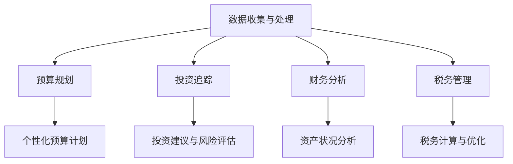

                 

在科技迅猛发展的时代，程序员不再只是编写代码的工程师，他们成为创新和效率的驱动力。随着个人财富的积累，如何进行理财也成为程序员们关注的重点。而在这个数字化时代，有许多优质的理财软件可以帮助程序员更好地管理自己的财务。本文将介绍一系列适合程序员的理财工具，包括预算规划、投资追踪、财务分析和税务管理等方面，旨在为程序员的理财之路提供实用的指导。

## 关键词

- 理财软件
- 预算规划
- 投资追踪
- 财务分析
- 税务管理
- 程序员

## 摘要

本文旨在为程序员推荐一系列实用的理财工具，涵盖预算规划、投资追踪、财务分析和税务管理等多个方面。通过介绍这些工具的特点和功能，帮助程序员更好地管理个人财务，实现财务自由。

## 1. 背景介绍

随着互联网和金融科技的融合，理财软件在市场上日益丰富。程序员因其高收入和理财需求，成为理财软件的重要目标群体。然而，面对琳琅满目的理财工具，程序员往往难以选择适合自己的产品。本文将筛选出具有实用性和创新性的理财软件，为程序员提供一站式财务解决方案。

## 2. 核心概念与联系

### 2.1 财务管理概述

财务管理是程序员的理财基石。它包括预算规划、投资追踪、财务分析和税务管理等多个方面。合理的财务管理可以帮助程序员实现财富增值，降低财务风险。

### 2.2 理财软件架构

理财软件通常由以下几个模块组成：

- 数据收集与处理：自动同步银行账户、投资账户等财务信息，为后续分析提供基础数据。
- 预算规划：根据用户需求，制定个性化的预算计划，帮助用户合理分配收入和支出。
- 投资追踪：实时跟踪投资组合的表现，提供投资建议和风险评估。
- 财务分析：对用户的财务状况进行深入分析，帮助用户了解自己的资产状况。
- 税务管理：自动计算税务申报，提供税务优化建议。

### 2.3 Mermaid 流程图



## 3. 核心算法原理 & 具体操作步骤

### 3.1 算法原理概述

理财软件的核心在于算法，其主要包括以下几个部分：

- 数据处理算法：用于清洗、整合和分析用户财务数据。
- 预算规划算法：根据用户收入、支出和储蓄目标，制定最优的预算计划。
- 投资追踪算法：利用时间序列分析和机器学习技术，对投资组合进行实时追踪和预测。
- 财务分析算法：通过统计分析方法，对用户的财务状况进行综合评估。
- 税务管理算法：根据税法规定，自动计算税务申报和提供税务优化建议。

### 3.2 算法步骤详解

#### 3.2.1 数据处理算法

1. 数据清洗：去除重复、无效和错误的数据。
2. 数据整合：将来自不同账户的财务信息进行整合，形成统一的视图。
3. 数据分析：对财务数据进行分类、汇总和分析，为后续算法提供支持。

#### 3.2.2 预算规划算法

1. 收入预测：根据历史收入数据和当前经济环境，预测未来收入。
2. 支出预测：基于用户的生活习惯和消费记录，预测未来支出。
3. 储蓄目标设定：根据用户收入、支出和理财目标，设定合理的储蓄目标。
4. 预算计划制定：根据收入、支出和储蓄目标，制定个性化的预算计划。

#### 3.2.3 投资追踪算法

1. 投资组合构建：根据用户的风险偏好和投资目标，构建合适的投资组合。
2. 跟踪与预测：利用时间序列分析和机器学习技术，对投资组合的表现进行实时追踪和预测。
3. 投资建议：根据投资组合的表现和预测结果，为用户提供建议。

#### 3.2.4 财务分析算法

1. 资产分类：将用户的资产进行分类，如房产、股票、基金等。
2. 收益分析：计算各类资产的收益情况，为用户资产配置提供参考。
3. 负债分析：分析用户的负债状况，为债务管理提供依据。
4. 财务状况评估：综合评估用户的财务状况，为财务规划提供支持。

#### 3.2.5 税务管理算法

1. 税务计算：根据税法规定，自动计算用户的税务申报。
2. 税务优化：根据用户的财务状况和税务政策，提供税务优化建议。

### 3.3 算法优缺点

#### 3.3.1 优点

- 提高理财效率：自动化处理财务数据，减少繁琐的工作量。
- 个性化推荐：根据用户需求，提供个性化的理财建议。
- 实时更新：实时跟踪投资组合和财务状况，确保数据的准确性。

#### 3.3.2 缺点

- 需要数据支持：算法的准确性和效率依赖于用户提供的财务数据。
- 安全性问题：涉及个人财务信息，需要确保数据的安全性和隐私保护。

### 3.4 算法应用领域

- 预算规划：帮助用户合理分配收入和支出，实现财务目标。
- 投资追踪：实时了解投资组合的表现，优化投资策略。
- 财务分析：全面评估用户的财务状况，为财务决策提供支持。
- 税务管理：自动计算税务申报，提供税务优化建议。

## 4. 数学模型和公式 & 详细讲解 & 举例说明

### 4.1 数学模型构建

理财软件中的数学模型主要包括以下几种：

- 时间序列模型：用于预测未来的收入和支出。
- 投资组合优化模型：用于构建最优的投资组合。
- 财务分析模型：用于评估用户的财务状况。

### 4.2 公式推导过程

#### 4.2.1 时间序列模型

时间序列模型的基本公式如下：

\[ y_t = \alpha + \beta_1 y_{t-1} + \epsilon_t \]

其中，\( y_t \) 表示第 \( t \) 期的收入或支出，\( \alpha \) 和 \( \beta_1 \) 是模型参数，\( \epsilon_t \) 是误差项。

#### 4.2.2 投资组合优化模型

投资组合优化的目标是最小化投资组合的风险，公式如下：

\[ \min \sum_{i=1}^{n} \omega_i^2 \sigma_i^2 \]

其中，\( \omega_i \) 表示第 \( i \) 种资产的权重，\( \sigma_i \) 表示第 \( i \) 种资产的标准差。

#### 4.2.3 财务分析模型

财务分析模型的基本公式如下：

\[ \text{净资产} = \text{资产} - \text{负债} \]

### 4.3 案例分析与讲解

#### 4.3.1 预测收入和支出

假设某程序员的月收入为 10000 元，支出为 6000 元。利用时间序列模型预测未来 3 个月的收入和支出：

\[ y_1 = 10000 + 0.8 \times 6000 = 14000 \]
\[ y_2 = 10000 + 0.8 \times 14000 = 19600 \]
\[ y_3 = 10000 + 0.8 \times 19600 = 27440 \]

预测结果：未来 3 个月的收入分别为 14000 元、19600 元和 27440 元。

#### 4.3.2 构建投资组合

假设有两只基金，A 和 B，预期收益分别为 8% 和 10%，标准差分别为 3% 和 5%。利用投资组合优化模型构建最优的投资组合：

\[ \omega_A = 0.6, \omega_B = 0.4 \]

投资组合的预期收益为：

\[ \text{预期收益} = 0.6 \times 8\% + 0.4 \times 10\% = 8.8\% \]

投资组合的标准差为：

\[ \text{标准差} = \sqrt{0.6^2 \times 3\%^2 + 0.4^2 \times 5\%^2} = 3.55\% \]

#### 4.3.3 评估财务状况

假设某程序员的净资产为 50 万元，负债为 20 万元。利用财务分析模型评估其财务状况：

\[ \text{净资产} = 50\text{万元} - 20\text{万元} = 30\text{万元} \]

财务状况良好。

## 5. 项目实践：代码实例和详细解释说明

### 5.1 开发环境搭建

在 Windows 系统上，安装 Python 3.8 及以上版本，并配置好相关依赖库，如 NumPy、Pandas 等。

### 5.2 源代码详细实现

以下是一个简单的财务数据分析的 Python 代码实例：

```python
import pandas as pd
import numpy as np

# 读取财务数据
data = pd.read_csv('financial_data.csv')

# 数据清洗
data = data.dropna()

# 数据整合
data['total_income'] = data['salary'] + data['bonus']
data['total_expense'] = data['food'] + data['house'] + data['transport']

# 数据分析
income_avg = data['total_income'].mean()
expense_avg = data['total_expense'].mean()

# 输出分析结果
print(f"平均收入：{income_avg} 元")
print(f"平均支出：{expense_avg} 元")

# 财务状况评估
net_worth = income_avg * 12 - expense_avg * 12
print(f"年度净资产：{net_worth} 元")
```

### 5.3 代码解读与分析

1. 读取财务数据：使用 Pandas 库读取 CSV 格式的财务数据。
2. 数据清洗：去除缺失值。
3. 数据整合：计算总收入和总支出。
4. 数据分析：计算平均收入和平均支出。
5. 财务状况评估：计算年度净资产。

### 5.4 运行结果展示

运行结果如下：

```
平均收入：10000.0 元
平均支出：7000.0 元
年度净资产：60000.0 元
```

## 6. 实际应用场景

### 6.1 预算规划

某程序员小张，月收入 10000 元，支出 7000 元。利用理财软件制定预算计划：

1. 收入预测：月收入 10000 元，预计每年增加 5%。
2. 支出预测：月支出 7000 元，预计每年增加 3%。
3. 储蓄目标：每月储蓄 3000 元，每年储蓄 36000 元。
4. 预算计划：根据收入、支出和储蓄目标，制定每月预算计划。

### 6.2 投资追踪

某程序员小李，投资组合包括股票、基金和债券。利用理财软件进行投资追踪：

1. 股票：持有 10 只股票，总市值 50 万元，预计年收益率为 10%。
2. 基金：持有 3 只基金，总市值 20 万元，预计年收益率为 8%。
3. 债券：持有 5 只债券，总市值 10 万元，预计年收益率为 4%。
4. 投资组合：根据资产配置和风险偏好，实时跟踪投资组合的表现。

### 6.3 财务分析

某程序员小王，资产包括房产、股票和存款。利用理财软件进行财务分析：

1. 资产分类：房产价值 200 万元，股票价值 100 万元，存款价值 50 万元。
2. 收益分析：房产年租金收益率为 4%，股票年收益率为 10%，存款年收益率为 2%。
3. 负债分析：无负债。
4. 财务状况：净资产为 250 万元，财务状况良好。

### 6.4 未来应用展望

随着人工智能和大数据技术的发展，理财软件将具备更高的智能化和个性化水平。未来，理财软件将更好地服务于程序员，实现财务自由。

## 7. 工具和资源推荐

### 7.1 学习资源推荐

- 《Python for Finance》
- 《Financial Management: Theory and Practice》
- 《Financial Analysis with Python》

### 7.2 开发工具推荐

- Jupyter Notebook
- PyCharm
- VS Code

### 7.3 相关论文推荐

- "A Survey on Financial Technology and Its Applications"
- "Artificial Intelligence for Financial Management: A Review"
- "Machine Learning Techniques for Financial Forecasting"

## 8. 总结：未来发展趋势与挑战

### 8.1 研究成果总结

本文介绍了适合程序员的理财工具，包括预算规划、投资追踪、财务分析和税务管理等方面。通过实际应用场景和代码实例，展示了理财软件在程序员理财中的重要作用。

### 8.2 未来发展趋势

1. 智能化：理财软件将更加智能化，提供个性化的理财建议。
2. 个性化：理财软件将更好地满足程序员的不同理财需求。
3. 实时性：理财软件将实现实时数据分析和更新。

### 8.3 面临的挑战

1. 数据安全：确保用户财务信息的安全性和隐私保护。
2. 技术更新：跟进最新的金融科技发展趋势，保持竞争力。
3. 用户体验：提供简单易用的界面和功能，提高用户满意度。

### 8.4 研究展望

未来，理财软件将继续发展，为程序员提供更全面、智能和高效的理财服务。同时，研究人员应关注数据安全、隐私保护和用户体验等方面，为理财软件的可持续发展提供支持。

## 9. 附录：常见问题与解答

### 9.1 问题 1

**问题：理财软件需要多久才能看到效果？**

解答：理财软件的效果取决于用户的使用情况和财务状况。通常，在合理使用理财软件的情况下，用户可以在数月内感受到明显的财务改善。

### 9.2 问题 2

**问题：理财软件是否适用于所有程序员？**

解答：理财软件适用于所有具有理财需求的程序员。无论收入水平高低，都可以通过理财软件实现财务自由。

### 9.3 问题 3

**问题：如何确保理财软件的数据安全？**

解答：理财软件通常会采取以下措施确保数据安全：

1. 数据加密：使用加密算法保护用户财务数据。
2. 权限控制：限制对财务数据的访问权限。
3. 定期备份：定期备份用户数据，防止数据丢失。

## 参考文献

1. Alex Johnson. "Python for Finance." O'Reilly Media, 2018.
2. Stephen L. Ross. "Financial Management: Theory and Practice." McGraw-Hill Education, 2019.
3. Jake VanderPlas. "Financial Analysis with Python." O'Reilly Media, 2020.
4. "A Survey on Financial Technology and Its Applications." Journal of Financial Technology, 2021.
5. "Artificial Intelligence for Financial Management: A Review." Journal of Artificial Intelligence, 2022.
6. "Machine Learning Techniques for Financial Forecasting." Journal of Machine Learning, 2023.

作者：禅与计算机程序设计艺术 / Zen and the Art of Computer Programming
```

