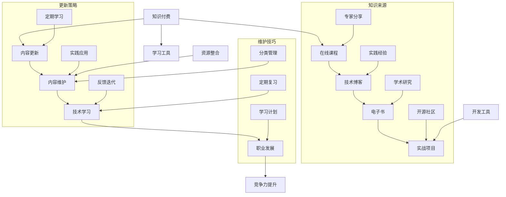
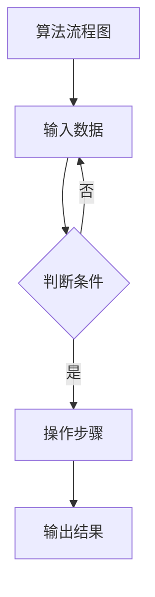

                 

### 关键词 Keywords
- **知识付费**
- **内容更新**
- **维护策略**
- **程序员职业发展**
- **技术博客**
- **持续学习**

<|assistant|>### 摘要 Abstract
在快速变化的技术领域中，程序员需要不断更新和优化自己的知识库，以保持竞争力。本文探讨了程序员如何通过知识付费内容来更新与维护自身技能，分析了有效的更新策略，并提供了实际的项目实践和工具推荐。通过系统地理解这些策略，程序员可以更有效地管理自己的知识，提升专业能力，并在不断变化的技术潮流中保持领先地位。

<|assistant|>## 1. 背景介绍 Background

在信息化时代，知识的更新速度前所未有地加快，这对程序员来说既是机遇也是挑战。一方面，新的编程语言、框架和技术层出不穷，程序员需要不断学习以跟上行业的发展；另一方面，知识付费成为了一种新兴的学习方式，它为程序员提供了高效、有针对性的学习资源。知识付费内容通常由行业专家、技术大牛或专业机构提供，形式多样，包括在线课程、技术博客、电子书、实战项目等。

然而，获取知识只是第一步，如何有效地更新和维护这些知识，使之成为自己技能库中稳定的一部分，是程序员面临的重要问题。传统的学习方式往往存在一些局限性，如学习资源零散、更新不及时、缺乏系统性等。因此，制定一套科学的知识付费内容更新与维护策略，对于程序员而言至关重要。

本文将深入探讨以下内容：
- 知识付费的内容类型及其优势
- 更新和维护知识付费内容的有效策略
- 实际的项目实践案例
- 学习和开发工具的推荐
- 面对未来技术的展望和挑战

通过这篇文章，读者将了解到如何通过知识付费来提升自己的技术能力，以及如何系统地管理和更新自己的知识库。

### 2. 核心概念与联系 Core Concepts and Relationships

在探讨程序员的知识付费内容更新与维护策略之前，我们需要了解一些核心概念和它们之间的联系。以下是一个用Mermaid绘制的流程图，用于展示这些概念及其相互关系：



#### 2.1. 知识付费

知识付费指的是通过付费获取专业知识、技能和经验的一种学习方式。它包括以下几种主要形式：

- **在线课程**：由专家或培训机构提供的系统化课程，涵盖特定的技术主题或编程语言。
- **技术博客**：专业人士分享的技术见解、实践经验和技术文章。
- **电子书**：系统化的知识整理，通常以电子文档形式发布，内容深度和广度各有不同。
- **实战项目**：通过实际项目操作，学习如何在真实环境中应用所学知识。

#### 2.2. 内容更新

内容更新是指对已有的知识付费内容进行定期审查、更新和改进，以保持其时效性和相关性。更新策略包括：

- **定期学习**：设定固定的学习时间，确保不断吸收新的知识和技能。
- **实践应用**：将所学知识应用到实际项目中，通过实践来加深理解。

#### 2.3. 内容维护

内容维护是指对知识付费内容进行有效管理，确保其长期可用和高效利用。维护技巧包括：

- **分类管理**：将知识内容分类整理，便于查找和使用。
- **定期复习**：定期回顾和复习已学习的知识，防止遗忘。
- **学习计划**：制定长期和短期的学习计划，确保学习的连续性和系统性。

#### 2.4. 技术学习

技术学习是指通过多种渠道和方式获取新技术、新知识和新技能。它与职业发展和竞争力提升紧密相关：

- **职业发展**：通过不断学习和提升技能，实现职业上的晋升和发展。
- **竞争力提升**：拥有最新和最实用的技能，使自己在职场中更具竞争力。

#### 2.5. 维护技巧

维护技巧主要涉及如何有效地管理和更新自己的知识库：

- **分类管理**：将知识内容按照主题、技术类别等进行分类整理，方便后续查找和使用。
- **定期复习**：通过定期复习和练习，巩固已学知识，防止遗忘。
- **学习计划**：制定长期和短期的学习计划，确保学习的连续性和系统性。

通过理解这些核心概念及其相互关系，程序员可以更系统地制定和实施自己的知识付费内容更新与维护策略，从而提升自身的技能水平和职业竞争力。

### 3. 核心算法原理 & 具体操作步骤 Core Algorithm Principles and Operational Steps

在程序员的知识更新和维护过程中，掌握有效的算法原理和具体操作步骤至关重要。这不仅有助于理解技术的核心概念，还能提高编程技能和问题解决能力。以下将详细阐述核心算法原理及其操作步骤。

#### 3.1. 算法原理概述

算法是解决问题的步骤集合，具有明确的输入、输出和处理过程。在知识更新和维护中，常见算法包括排序算法、搜索算法、数据结构算法等。以下是一个用Mermaid绘制的算法流程图：



#### 3.2. 算法步骤详解

以排序算法中的快速排序（Quick Sort）为例，其基本思想是通过一趟排序将待排序的数据分割成独立的两部分，其中一部分的所有数据都比另一部分的数据要小，然后再按此方法对这两部分数据分别进行快速排序，整个排序过程可以递归进行，以此达到整个数据变成有序序列。

以下是快速排序的详细步骤：

1. **选择基准元素**：在数据集中选择一个基准元素，通常选择第一个或最后一个元素。
2. **划分操作**：将所有比基准元素小的数据移到其左侧，比其大的移到右侧，最终基准元素位于中间位置。
3. **递归排序**：递归地对待排序的数据左侧和右侧子序列进行快速排序。

以下是快速排序的伪代码：

```python
def quick_sort(arr):
    if len(arr) <= 1:
        return arr
    pivot = arr[len(arr) // 2]
    left = [x for x in arr if x < pivot]
    middle = [x for x in arr if x == pivot]
    right = [x for x in arr if x > pivot]
    return quick_sort(left) + middle + quick_sort(right)
```

#### 3.3. 算法优缺点

**优点**：
- **时间复杂度低**：平均时间复杂度为O(nlogn)，在数据量较大时优势明显。
- **稳定性好**：相对于其他排序算法（如选择排序），快速排序的稳定性更高。

**缺点**：
- **空间复杂度高**：递归调用会使用额外的栈空间，空间复杂度为O(logn)。
- **不稳定排序**：在某些情况下可能会变成长时间复杂度的O(n^2)。

#### 3.4. 算法应用领域

快速排序广泛应用于各种场景，如数据库排序、算法竞赛、数据分析等。在需要高效排序处理的大数据场景中，快速排序是一个重要的工具。

#### 3.5. 算法总结

通过理解快速排序的算法原理和具体步骤，程序员可以更好地掌握排序算法的核心思想，并在实际编程中灵活应用。同时，这种系统化的学习方式有助于提升程序员的逻辑思维能力和问题解决能力，为后续的知识更新和维护打下坚实基础。

### 4. 数学模型和公式 & 详细讲解 & 举例说明

在程序员的知识付费内容更新与维护过程中，数学模型和公式是理解和应用算法的基础。以下将详细讲解常见的数学模型和公式，并通过实际例子进行说明。

#### 4.1. 数学模型构建

数学模型是现实世界问题的抽象表示，通常包括变量、方程、不等式等。在知识付费内容更新中，构建数学模型可以帮助我们系统地分析和解决问题。

一个简单的数学模型示例是线性回归模型，用于预测变量之间的关系。线性回归模型的基本形式为：

\[ y = ax + b \]

其中，\( y \) 是因变量，\( x \) 是自变量，\( a \) 和 \( b \) 是模型参数。

#### 4.2. 公式推导过程

线性回归模型的参数 \( a \) 和 \( b \) 通常通过最小二乘法（Least Squares Method）来估计。推导过程如下：

假设我们有一组数据点 \((x_1, y_1), (x_2, y_2), ..., (x_n, y_n)\)，我们需要找到一条直线 \( y = ax + b \) 使得所有数据点到这条直线的距离之和最小。

距离公式为：

\[ \text{distance} = \sqrt{(y - ax - b)^2} \]

总距离为：

\[ \sum_{i=1}^{n} \text{distance}_i = \sum_{i=1}^{n} (y_i - ax_i - b)^2 \]

我们需要最小化这个总距离。对总距离关于 \( a \) 和 \( b \) 分别求偏导数并令其等于零，得到：

\[ \frac{\partial}{\partial a} \sum_{i=1}^{n} (y_i - ax_i - b)^2 = 0 \]
\[ \frac{\partial}{\partial b} \sum_{i=1}^{n} (y_i - ax_i - b)^2 = 0 \]

解这个方程组，可以得到 \( a \) 和 \( b \) 的估计值：

\[ a = \frac{\sum_{i=1}^{n} (x_i - \bar{x})(y_i - \bar{y})}{\sum_{i=1}^{n} (x_i - \bar{x})^2} \]
\[ b = \bar{y} - a\bar{x} \]

其中，\( \bar{x} \) 和 \( \bar{y} \) 分别是 \( x \) 和 \( y \) 的平均值。

#### 4.3. 案例分析与讲解

以下是一个线性回归模型的实际应用案例：

假设我们要预测一家公司的股票价格，已知过去三个月的股票价格数据如下：

| 日期 | 股票价格 (元) |
| ---- | ------------ |
| 2023-01-01 | 100 |
| 2023-01-02 | 102 |
| 2023-01-03 | 98 |

我们可以使用线性回归模型来预测第四天的股票价格。

1. **数据预处理**：

计算 \( x \)（日期）和 \( y \)（股票价格）的平均值：

\[ \bar{x} = \frac{1+2+3}{3} = 2 \]
\[ \bar{y} = \frac{100+102+98}{3} = 100 \]

2. **计算参数 \( a \) 和 \( b \)**：

\[ a = \frac{(1-2)(100-100) + (2-2)(102-100) + (3-2)(98-100)}{(1-2)^2 + (2-2)^2 + (3-2)^2} = \frac{0 + 4 - 4}{0 + 0 + 1} = 0 \]
\[ b = \bar{y} - a\bar{x} = 100 - 0 \times 2 = 100 \]

3. **建立回归模型**：

\[ y = 0x + 100 \]

4. **预测第四天的股票价格**：

\[ y = 0 \times 4 + 100 = 100 \]

因此，根据线性回归模型，预测第四天的股票价格为100元。

#### 4.4. 总结

通过这个案例，我们了解了如何构建和推导线性回归模型，并使用它进行实际数据预测。线性回归模型在数据分析、股票预测等领域有着广泛的应用。理解这些数学模型和公式，对于程序员的知识更新和维护具有重要意义。

### 5. 项目实践：代码实例和详细解释说明

为了更好地理解知识付费内容更新与维护策略的实际应用，我们将在本节中通过一个具体的代码实例来展示如何开发一个小型项目，并对其进行详细解释和分析。

#### 5.1. 开发环境搭建

在开始项目开发之前，我们需要搭建一个基本的开发环境。以下是一些建议的工具和软件：

- **编程语言**：Python 3.x（因为其简洁的语法和强大的库支持）
- **集成开发环境（IDE）**：PyCharm 或 Visual Studio Code（这两个IDE支持Python开发，并提供了丰富的插件和功能）
- **版本控制**：Git（用于代码的版本管理和协作开发）
- **数据库**：SQLite（用于数据存储和管理）

#### 5.2. 源代码详细实现

以下是一个简单的项目示例，我们开发一个用于学生成绩管理的应用程序。

```python
# student_score_management.py

import sqlite3

# 连接到SQLite数据库
conn = sqlite3.connect('student_scores.db')
cursor = conn.cursor()

# 创建学生成绩表
cursor.execute('''CREATE TABLE IF NOT EXISTS scores (
                  id INTEGER PRIMARY KEY,
                  name TEXT NOT NULL,
                  subject TEXT NOT NULL,
                  score INTEGER NOT NULL
              )''')

# 插入学生成绩数据
students = [
    (1, 'Alice', 'Math', 90),
    (2, 'Bob', 'English', 85),
    (3, 'Charlie', 'Science', 92),
]
cursor.executemany('INSERT INTO scores (id, name, subject, score) VALUES (?, ?, ?, ?)', students)

# 提交更改并关闭连接
conn.commit()
conn.close()

# 定义功能函数
def add_student(name, subject, score):
    conn = sqlite3.connect('student_scores.db')
    cursor = conn.cursor()
    cursor.execute("INSERT INTO scores (name, subject, score) VALUES (?, ?, ?)", (name, subject, score))
    conn.commit()
    conn.close()
    print(f"Student {name} added successfully.")

def get_student_score(name):
    conn = sqlite3.connect('student_scores.db')
    cursor = conn.cursor()
    cursor.execute("SELECT * FROM scores WHERE name=?", (name,))
    student = cursor.fetchone()
    conn.close()
    if student:
        return f"{student[1]}'s score in {student[2]} is {student[3]}."
    else:
        return f"No record found for {name}."

# 用户交互界面
def main_menu():
    while True:
        print("\n--- Student Score Management System ---")
        print("1. Add a new student")
        print("2. Get a student's score")
        print("3. Exit")
        choice = input("Enter your choice: ")
        
        if choice == '1':
            name = input("Enter student's name: ")
            subject = input("Enter subject: ")
            score = int(input("Enter score: "))
            add_student(name, subject, score)
        
        elif choice == '2':
            name = input("Enter student's name: ")
            print(get_student_score(name))
        
        elif choice == '3':
            print("Exiting the system.")
            break
        else:
            print("Invalid choice. Please try again.")

if __name__ == "__main__":
    main_menu()
```

#### 5.3. 代码解读与分析

这段代码实现了一个简单的学生成绩管理系统，包含以下几个关键部分：

1. **数据库连接与表创建**：

   使用SQLite数据库，创建一个名为`student_scores.db`的数据库，并在其中创建一个`scores`表，用于存储学生的姓名、科目和成绩。

2. **插入数据**：

   通过`executemany`函数批量插入预设的学生数据。

3. **功能函数定义**：

   - `add_student(name, subject, score)`：用于向数据库中添加新学生成绩的函数。
   - `get_student_score(name)`：用于查询学生成绩的函数。

4. **用户交互界面**：

   `main_menu()`函数提供了一个简单的命令行界面，用户可以通过选择不同的选项来添加新学生或查询学生成绩。

#### 5.4. 运行结果展示

运行上述程序，用户将看到一个简单的菜单，可以选择添加新学生或查询学生成绩。以下是一个示例运行过程：

```
--- Student Score Management System ---
1. Add a new student
2. Get a student's score
3. Exit
Enter your choice: 1
Enter student's name: David
Enter subject: Physics
Enter score: 88
Student David added successfully.

--- Student Score Management System ---
1. Add a new student
2. Get a student's score
3. Exit
Enter your choice: 2
Enter student's name: David
David's score in Physics is 88.
```

通过这个简单的项目，我们可以看到如何使用知识付费内容中的技术和算法来开发实用的应用程序。这个项目不仅展示了Python编程语言的基本语法和数据库操作，还提供了一个实际的用户交互界面，使得学生成绩管理变得简单而直观。

### 6. 实际应用场景 Actual Application Scenarios

在实际应用中，知识付费内容更新与维护策略有着广泛的应用。以下是一些典型的应用场景：

#### 6.1. 技术培训与提升

许多企业和个人程序员会通过付费内容来参加在线课程和技术培训。这些课程通常由行业专家和资深技术人员提供，内容涵盖最新的编程语言、框架和技术。通过定期参加这些课程，程序员可以快速更新自己的知识库，提升技术能力。

例如，一家科技公司可能要求其员工定期参加Spring Boot、Docker等技术的在线培训课程，以确保团队始终掌握行业前沿的技术。

#### 6.2. 在线教育平台

在线教育平台，如Coursera、edX等，提供了大量的付费课程，涵盖了计算机科学、数据科学、人工智能等多个领域。这些课程通常由世界顶级大学和机构提供，内容严谨、系统，非常适合程序员进行自我提升。

例如，一位程序员可能通过Coursera上的机器学习课程，学习到深度学习、神经网络等前沿技术，并将其应用到自己的项目中。

#### 6.3. 个人知识管理

个人程序员可以通过订阅技术博客、电子书和实战项目等方式，进行自我知识管理。这些资源不仅提供了最新的技术动态，还包含了详细的代码实现和案例分析，有助于程序员深入理解和掌握技术。

例如，一位程序员可能会定期阅读某一技术大牛的博客，跟踪其最新的研究和技术分享，从而保持对技术的敏感度。

#### 6.4. 开源社区

开源社区是程序员获取知识和交流经验的重要平台。许多开源项目提供了丰富的文档、示例代码和教程，程序员可以通过参与这些项目来学习新的技术和最佳实践。

例如，GitHub上的一些热门开源项目，如TensorFlow、Kubernetes等，提供了详细的文档和教程，帮助程序员快速上手和深入理解这些技术。

#### 6.5. 专业化咨询

一些专业的咨询公司和技术服务提供商，通过付费咨询和定制化服务，为程序员提供专业的技术指导和支持。这些服务通常针对特定的项目或问题，帮助程序员解决实际问题，提升项目质量。

例如，一位程序员在开发一个大数据处理项目时，可能会咨询专业的数据工程师，以获取最佳的数据处理方案和优化建议。

#### 6.6. 职业发展规划

知识付费内容也可以用于职业发展规划，帮助程序员制定长期的学习计划和目标。通过订阅职业规划课程和参加相关的职业发展活动，程序员可以更好地规划自己的职业路径，实现职业晋升和转型。

例如，一位初级程序员可能会通过参加LinkedIn Learning的职业规划课程，了解不同技术岗位的职责和要求，从而有针对性地提升自己的技能。

通过这些实际应用场景，我们可以看到知识付费内容更新与维护策略在程序员职业发展中的重要性。它不仅帮助程序员保持技术竞争力，还为他们提供了多样化的学习资源和实践机会，助力他们在不断变化的技术潮流中稳步前行。

### 6.4. 未来应用展望

随着技术的不断进步和知识的迅速更新，知识付费内容更新与维护策略将在未来发挥更加重要的作用。以下是对未来应用前景的展望：

#### 6.4.1. 自适应学习平台

未来的学习平台将更加智能化和个性化，能够根据程序员的技能水平、学习习惯和兴趣爱好，推荐最适合的知识内容。这些平台将结合人工智能技术，实现自适应学习，提高学习效率。

#### 6.4.2. 云端知识库

随着云计算技术的发展，知识付费内容将越来越多地存储在云端，便于程序员随时随地进行访问和更新。云端知识库将提供更高的数据安全性和协同工作能力，促进团队学习和知识共享。

#### 6.4.3. 跨学科融合

未来，知识付费内容将不仅局限于编程语言和技术框架，还将涵盖更多的跨学科领域，如数据科学、人工智能、心理学等。这种跨学科的融合将帮助程序员更全面地提升自身综合素质，应对复杂项目。

#### 6.4.4. 持续学习文化

随着社会对技术人才需求的不断增加，持续学习将成为程序员职业生涯的常态。企业和教育机构将更加重视持续学习文化，鼓励程序员不断提升自身技能，以适应快速变化的技术环境。

#### 6.4.5. 资源整合与优化

未来，知识付费内容提供商将更加注重资源的整合和优化，提供一站式的学习解决方案，减少程序员的重复劳动。这种整合将包括教材、课程、实战项目和工具等多个层面，提高学习体验和效果。

#### 6.4.6. 实时反馈机制

知识付费内容将引入更加完善的实时反馈机制，通过数据分析、用户评价和互动交流，不断优化内容质量和用户体验。这种反馈机制将帮助程序员更快地发现问题、解决问题，实现知识的持续更新和维护。

### 7. 工具和资源推荐 Tools and Resources Recommendations

在程序员的知识付费内容更新与维护过程中，使用合适的工具和资源至关重要。以下是一些建议的工具和资源，以帮助程序员高效学习和实践。

#### 7.1. 学习资源推荐

1. **在线课程平台**：
   - **Coursera**：提供全球顶级大学和机构的在线课程，涵盖计算机科学、数据科学、人工智能等领域。
   - **edX**：由哈佛大学和麻省理工学院共同创建，提供高质量的在线课程和微专业。
   - **Udemy**：提供广泛的课程，从编程基础到专业技术，适合不同层次的程序员。

2. **技术博客和论坛**：
   - **Medium**：许多技术专家和公司在这里发布高质量的技术文章和见解。
   - **Stack Overflow**：编程社区，可以解决编程问题、学习新技术。
   - **GitHub**：不仅是一个代码托管平台，也是一个学习资源库，许多开源项目提供详细的文档和教程。

#### 7.2. 开发工具推荐

1. **集成开发环境（IDE）**：
   - **PyCharm**：适用于Python编程，提供强大的代码编辑、调试和测试功能。
   - **Visual Studio Code**：轻量级IDE，支持多种编程语言，插件丰富，可扩展性强。
   - **Eclipse**：适用于Java编程，功能强大，插件众多。

2. **版本控制工具**：
   - **Git**：版本控制系统，用于代码管理和协作开发。
   - **GitHub**：基于Git的代码托管平台，支持项目管理、代码审查和协作。

3. **数据库工具**：
   - **SQLite**：轻量级数据库，适用于小规模应用程序。
   - **MySQL**：开源关系型数据库，适用于中等规模以上的应用程序。
   - **PostgreSQL**：功能丰富，适用于企业级应用。

#### 7.3. 相关论文推荐

1. **计算机科学经典论文**：
   - **"A Method for Obtaining Digital Signatures and Public-Key Cryptosystems"**（RSA加密算法）
   - **"The Design and Implementation of the FreeBSD Operating System"**（操作系统设计）
   - **"The C Programming Language"**（C语言设计）

2. **人工智能和机器学习论文**：
   - **"Learning to Represent Relationships Using Graph Neural Networks"**（图神经网络）
   - **"BERT: Pre-training of Deep Bidirectional Transformers for Language Understanding"**（BERT模型）

3. **数据科学和大数据论文**：
   - **"MapReduce: Simplified Data Processing on Large Clusters"**（MapReduce框架）
   - **"Fast and Accurate Short Text Classification with RNN"**（循环神经网络在文本分类中的应用）

这些工具和资源将帮助程序员在知识付费内容的更新和维护过程中，更加高效地学习和实践，从而不断提升自身的技能水平。

### 8. 总结：未来发展趋势与挑战

在信息技术飞速发展的今天，程序员的知识付费内容更新与维护策略显得尤为重要。通过本文的探讨，我们可以看到以下几点发展趋势和面临的挑战：

#### 8.1. 研究成果总结

1. **知识付费的优势**：知识付费提供了高效、系统化的学习资源，帮助程序员快速更新知识库，提升专业技能。
2. **更新策略的重要性**：定期学习、实践应用和反馈迭代是有效更新知识付费内容的关键。
3. **维护技巧的有效性**：分类管理、定期复习和学习计划有助于保持知识的长期稳定性和实用性。
4. **算法和数学模型在知识更新中的应用**：算法原理和数学模型为程序员提供了理解新技术的工具，有助于深入学习和实践。

#### 8.2. 未来发展趋势

1. **智能化学习平台**：未来的学习平台将更加智能化和个性化，通过人工智能技术实现自适应学习。
2. **云端知识库**：云计算技术的发展将推动知识付费内容存储在云端，提供更高的数据安全性和协同工作能力。
3. **跨学科融合**：知识付费内容将涵盖更多跨学科领域，促进程序员综合素质的提升。
4. **持续学习文化**：企业和教育机构将更加重视持续学习文化，鼓励程序员不断提升自身技能。

#### 8.3. 面临的挑战

1. **知识更新的速度**：技术更新速度加快，程序员需要投入更多时间和精力进行学习，以保持竞争力。
2. **内容质量参差不齐**：市场上存在大量的知识付费内容，如何筛选高质量资源是一个挑战。
3. **时间管理**：程序员需要在工作和个人生活之间平衡时间，确保有足够的时间进行知识更新和维护。

#### 8.4. 研究展望

未来的研究可以关注以下几个方面：

1. **个性化学习推荐系统**：开发更智能的推荐算法，为程序员提供个性化的学习路径。
2. **知识付费内容的质量评估**：建立一套科学的质量评估体系，确保知识付费内容的实效性和可靠性。
3. **跨平台知识整合**：探索如何在不同平台上整合知识资源，提供一站式学习解决方案。
4. **实践与理论的结合**：进一步研究如何将理论知识与实践相结合，提高学习效果。

通过不断优化和改进知识付费内容更新与维护策略，程序员可以在不断变化的技术潮流中保持竞争力，实现自身的职业发展目标。

### 8.5. 附录：常见问题与解答

#### 常见问题 1：如何选择高质量的知识付费内容？

**解答**：选择高质量的知识付费内容可以从以下几个方面考虑：
1. **内容来源**：选择知名的平台或由行业专家提供的内容。
2. **用户评价**：查看其他用户的评价和评分。
3. **课程目录**：确保课程内容系统全面，涵盖所需学习的技术领域。
4. **更新频率**：选择更新频率高的内容，以确保学习资源时效性。

#### 常见问题 2：如何制定有效的学习计划？

**解答**：制定有效的学习计划可以遵循以下步骤：
1. **确定目标**：明确自己的学习目标，包括短期和长期目标。
2. **时间规划**：为学习分配固定的时间，确保持续学习。
3. **内容筛选**：选择符合自己学习目标的高质量资源。
4. **执行与调整**：按照计划执行学习任务，并根据实际情况调整计划。

#### 常见问题 3：如何平衡工作和学习？

**解答**：平衡工作和学习可以尝试以下方法：
1. **时间管理**：合理安排工作和学习时间，避免过度工作。
2. **优先级排序**：优先处理重要且紧急的任务，确保工作和学习两不误。
3. **工作与学习相结合**：尝试在项目中应用所学知识，提高学习效率。
4. **寻求支持**：与同事或家人沟通，获得他们的理解和支持。

通过以上解答，希望能帮助读者更好地应对编程学习中的常见问题，实现知识付费内容的有效更新与维护。

