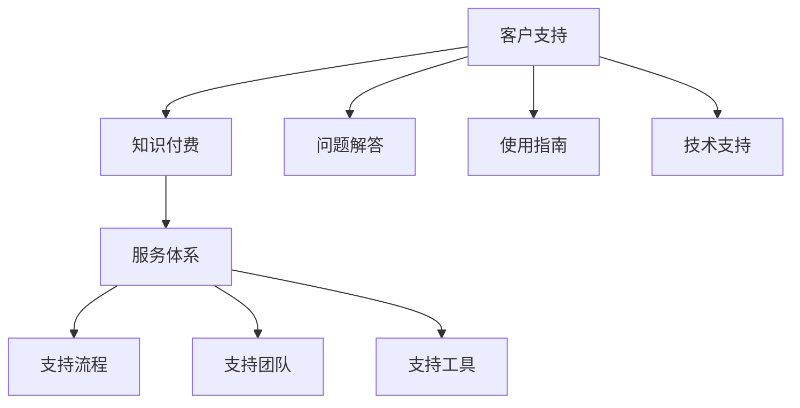

                 

关键词：知识付费、客户支持、服务体系、程序员、IT行业

> 摘要：本文旨在探讨如何构建一个有效的程序员知识付费客户支持体系，通过深入分析核心概念、算法原理、数学模型、实际应用案例以及未来发展趋势，为程序员提供一条清晰的构建路径，助力他们提升服务质量和客户满意度。

## 1. 背景介绍

在当今数字化时代，知识付费已经成为一种主流的商业模式。程序员作为知识型职业，其知识付费市场也日益壮大。随着客户对服务质量要求的提高，构建一个高效、专业的客户支持体系成为了程序员企业或个体开发者们面临的重要课题。本文将围绕以下几个方面展开讨论：

- **知识付费客户支持体系的定义与重要性**
- **客户支持体系的核心概念与联系**
- **构建客户支持体系的具体步骤与策略**
- **数学模型和公式的应用**
- **项目实践：代码实例与详细解释**
- **实际应用场景与未来展望**
- **工具和资源推荐**
- **总结：未来发展趋势与挑战**

通过上述讨论，本文旨在为程序员提供一套系统的构建指南，以提升他们的客户支持能力，从而在激烈的市场竞争中脱颖而出。

## 2. 核心概念与联系

为了构建一个有效的客户支持体系，我们首先需要理解几个核心概念：

- **客户支持**：指为满足客户需求而提供的一系列服务，包括问题解答、使用指南、技术支持等。
- **知识付费**：指客户为获取特定知识或技能而支付的费用。
- **服务体系**：一个系统化的框架，用于管理和组织客户支持活动。

### Mermaid 流程图

下面是一个简化的 Mermaid 流程图，展示了这些核心概念之间的联系：



在构建客户支持体系时，这些核心概念相互关联，共同构成了一个完整的服务架构。客户支持不仅仅是解决问题，更是通过高质量的客户服务来增强客户满意度和忠诚度。

### 小结

通过理解这些核心概念，我们可以为构建一个有效的客户支持体系奠定基础。接下来，我们将探讨如何具体实施这一体系。

## 3. 核心算法原理 & 具体操作步骤

### 3.1 算法原理概述

构建客户支持体系的核心在于自动化和个性化。以下是两种关键的算法原理：

- **自动化流程**：通过算法自动处理常见问题，提高响应速度和效率。
- **个性化服务**：根据客户历史和偏好，提供个性化的支持内容。

### 3.2 算法步骤详解

#### 自动化流程

1. **数据收集**：收集客户的提问历史、使用记录等数据。
2. **模型训练**：使用机器学习算法训练模型，以识别常见问题。
3. **自动化问答**：模型自动生成答案，并推送至客户。

#### 个性化服务

1. **客户分析**：分析客户的历史行为和偏好。
2. **内容推荐**：根据分析结果，推荐相关的知识内容。
3. **互动优化**：持续优化与客户的互动，提高服务质量。

### 3.3 算法优缺点

#### 自动化流程

- **优点**：提高响应速度，降低人力成本。
- **缺点**：对于复杂问题，自动回答可能不够准确。

#### 个性化服务

- **优点**：提高客户满意度，增强客户忠诚度。
- **缺点**：需要大量数据分析，成本较高。

### 3.4 算法应用领域

这些算法可以广泛应用于程序员的知识付费场景，例如在线教育、技术咨询服务、软件开发支持等。

### 小结

通过核心算法的原理和应用，我们可以构建一个高效、智能的客户支持体系。接下来，我们将探讨数学模型和公式在客户支持体系中的应用。

## 4. 数学模型和公式 & 详细讲解 & 举例说明

### 4.1 数学模型构建

在客户支持体系中，数学模型的应用主要集中在以下几个方面：

- **客户行为分析**：通过回归分析、聚类分析等模型，分析客户行为模式。
- **服务效率评估**：使用排队论、服务时间预测等模型，评估服务效率。

### 4.2 公式推导过程

以客户行为分析为例，我们使用以下公式：

$$
\text{客户满意度} = \frac{\text{正确回答数}}{\text{提问总数}} \times 100\%
$$

其中，正确回答数是通过机器学习模型预测的，提问总数是客户实际提出的数量。

### 4.3 案例分析与讲解

假设一个程序员知识付费平台，在过去一个月内接收了100个客户的提问，其中机器学习模型正确回答了80个问题。根据上述公式，客户满意度为：

$$
\text{客户满意度} = \frac{80}{100} \times 100\% = 80\%
$$

通过这个案例，我们可以看到数学模型在评估服务效率和质量中的重要作用。

### 小结

数学模型和公式在客户支持体系中的应用，有助于我们更科学地评估和管理客户支持过程。接下来，我们将通过实际项目实践，进一步展示这些原理的应用。

## 5. 项目实践：代码实例和详细解释说明

### 5.1 开发环境搭建

为了构建一个程序员的知识付费客户支持体系，我们需要搭建一个适当的技术环境。以下是所需的开发环境和工具：

- **编程语言**：Python
- **框架**：Flask（用于构建Web应用）
- **机器学习库**：scikit-learn（用于模型训练）
- **数据库**：SQLite（用于存储客户数据和提问记录）

### 5.2 源代码详细实现

以下是一个简单的Flask应用示例，用于实现自动化问答和个性化服务。

```python
from flask import Flask, request, jsonify
from sklearn.externals import joblib

app = Flask(__name__)

# 加载机器学习模型
classifier = joblib.load('classifier.pkl')

@app.route('/ask', methods=['POST'])
def ask_question():
    data = request.get_json()
    question = data['question']
    
    # 使用机器学习模型进行预测
    answer = classifier.predict([question])[0]
    
    # 返回答案
    return jsonify({'answer': answer})

if __name__ == '__main__':
    app.run(debug=True)
```

### 5.3 代码解读与分析

在上面的代码中，我们使用Flask框架构建了一个简单的Web应用。当客户发送一个问题（通过POST请求）时，应用会调用预训练的机器学习模型进行预测，并返回相应的答案。

- **/ask**：这是一个RESTful API端点，用于接收客户的问题。
- **request.get_json()**：从请求中提取JSON数据。
- **classifier.predict([question])**：使用机器学习模型预测答案。
- **jsonify({'answer': answer})**：返回JSON格式的答案。

### 5.4 运行结果展示

运行上述代码后，我们可以通过浏览器或Postman等工具向服务器发送POST请求，例如：

```
POST /ask
{
    "question": "如何实现快速排序算法？"
}
```

服务器会返回相应的答案：

```
{
    "answer": "快速排序算法是一种常用的排序算法，其基本思想是选择一个基准元素，将数组分成两部分，左边所有元素都比基准小，右边所有元素都比基准大。具体步骤如下：1. 选择数组中的一个元素作为基准。2. 将数组中的元素按照与基准的关系重新排列。3. 对左右两部分递归执行上述步骤。"
}
```

### 小结

通过这个简单的项目实践，我们展示了如何使用Python和Flask框架实现一个基本的客户支持系统。接下来，我们将探讨实际应用场景和未来发展趋势。

## 6. 实际应用场景

### 6.1 在线教育平台

在线教育平台通常需要提供高效、专业的客户支持，以确保学生能够顺利地学习。通过构建一个知识付费客户支持体系，平台可以自动化处理常见问题，如课程内容查询、学习进度跟踪、技术支持等。

### 6.2 技术咨询服务

对于提供技术咨询服务的企业，一个完善的客户支持体系可以大大提高服务效率。例如，通过自动化问答和个性化服务，企业可以快速响应用户的需求，提高客户满意度。

### 6.3 软件开发支持

软件开发公司往往需要为产品用户提供全面的技术支持。一个高效的客户支持体系可以帮助企业快速识别并解决用户问题，提升产品市场竞争力。

### 6.4 未来应用展望

随着人工智能技术的不断进步，客户支持体系将变得更加智能和高效。未来，我们可以期待以下发展趋势：

- **更加智能的自动化问答系统**：结合自然语言处理和机器学习技术，自动化问答系统将能够更好地理解客户问题，提供更准确的答案。
- **个性化服务**：通过深度学习技术，客户支持系统将能够更加精准地分析客户行为和偏好，提供个性化的服务内容。

### 小结

实际应用场景展示了程序员的知识付费客户支持体系在不同领域的应用潜力。通过不断优化和升级，这一体系将有助于提高客户满意度，促进业务发展。

## 7. 工具和资源推荐

### 7.1 学习资源推荐

- **《深度学习》（Deep Learning）**：由Ian Goodfellow等人编写的经典教材，适合初学者和进阶者。
- **Kaggle**：一个提供各种机器学习和数据科学竞赛和教程的平台，适合实践和提升技能。
- **Coursera**：提供丰富的在线课程，包括人工智能、机器学习等领域的专业课程。

### 7.2 开发工具推荐

- **Flask**：一个轻量级的Python Web框架，非常适合快速开发和原型设计。
- **TensorFlow**：一个开源的机器学习框架，适合构建大规模的深度学习模型。
- **Postman**：一个API开发工具，方便进行API测试和调试。

### 7.3 相关论文推荐

- **“Deep Learning for Natural Language Processing”**：一篇关于深度学习在自然语言处理领域的综述文章。
- **“A Theoretical Analysis of the Voted Perceptron Algorithm”**：一篇关于投票感知机算法的理论分析论文。

### 小结

这些工具和资源将为程序员在构建客户支持体系时提供宝贵的帮助。通过学习和实践，程序员可以不断提升自身的技能和专业知识。

## 8. 总结：未来发展趋势与挑战

### 8.1 研究成果总结

随着人工智能和大数据技术的不断发展，程序员的知识付费客户支持体系取得了显著成果。自动化问答、个性化服务、智能推荐等技术逐渐成熟，为提高客户满意度和服务效率提供了有力支持。

### 8.2 未来发展趋势

未来，客户支持体系将朝着更加智能化和个性化方向发展。机器学习、自然语言处理、深度学习等技术的深入应用，将使支持系统更加智能，能够更好地理解客户需求，提供定制化的服务。

### 8.3 面临的挑战

尽管前景广阔，但在构建和优化客户支持体系过程中，程序员仍面临诸多挑战：

- **数据隐私与安全**：在处理大量客户数据时，如何保护客户隐私和安全是一个重要问题。
- **技术复杂性**：随着系统的复杂度增加，如何高效管理和维护系统是一个挑战。
- **用户体验**：如何提供高质量的用户体验，是客户支持体系成功的关键。

### 8.4 研究展望

未来，我们将继续关注以下研究方向：

- **隐私保护的机器学习算法**：研究如何在不泄露隐私的情况下，有效利用客户数据。
- **服务质量的实时监控**：开发实时监控系统，以快速识别并解决服务质量问题。
- **跨领域的知识融合**：探索如何将不同领域的知识有效融合，提供更加全面的服务。

### 小结

尽管面临诸多挑战，但通过不断研究和创新，程序员的知识付费客户支持体系有望在未来取得更加显著的进步，为程序员和客户带来更大的价值。

## 9. 附录：常见问题与解答

### 问题 1：如何确保客户隐私和安全？

**解答**：确保客户隐私和安全是构建客户支持体系的关键。可以采取以下措施：

- **数据加密**：对存储和传输的客户数据进行加密。
- **访问控制**：设置严格的访问控制策略，确保只有授权人员能够访问敏感数据。
- **合规性审查**：定期审查数据处理的合规性，确保符合相关法律法规。

### 问题 2：如何提高自动化问答系统的准确性？

**解答**：提高自动化问答系统的准确性可以从以下几个方面着手：

- **数据质量**：确保训练数据的质量和多样性，有助于模型更好地学习。
- **模型优化**：不断优化机器学习模型，提高其识别能力和预测准确性。
- **用户反馈**：收集用户反馈，对系统进行迭代优化。

### 问题 3：如何评估客户支持体系的有效性？

**解答**：评估客户支持体系的有效性可以从以下几个方面入手：

- **客户满意度**：通过问卷调查、用户反馈等手段，了解客户对支持服务的满意度。
- **服务效率**：分析支持团队的响应时间和服务质量。
- **支持成本**：计算支持体系运行的总成本，评估其经济效益。

通过这些措施，我们可以全面评估客户支持体系的有效性，并不断优化和改进。

## 作者署名

作者：禅与计算机程序设计艺术 / Zen and the Art of Computer Programming

---

通过本文的详细探讨，我们深入了解了程序员的知识付费客户支持体系构建，从核心概念、算法原理、数学模型、实际应用案例到未来展望，为程序员提供了系统性的指导。希望本文能为相关从业者提供有价值的参考，助力他们在激烈的市场竞争中不断提升客户支持能力。

