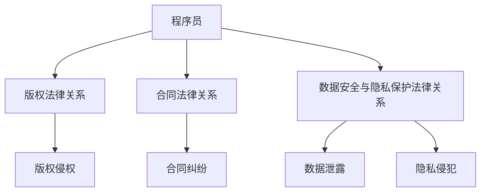

                 

关键词：程序员、知识付费、法律风险、版权、合同、数据安全、隐私保护

> 摘要：在数字化时代，知识付费已成为一种流行的商业模式。然而，对于程序员而言，参与知识付费的过程中，面临的法律风险不容忽视。本文将探讨程序员在知识付费领域可能遇到的法律问题，包括版权、合同、数据安全和个人隐私等方面的风险，并提出相应的防范措施。

## 1. 背景介绍

知识付费，顾名思义，是用户为获取特定知识或服务而支付费用的一种商业模式。近年来，随着互联网技术的发展，知识付费市场迅速扩大，涵盖了在线课程、电子书籍、专业咨询等多个领域。程序员作为技术领域的重要从业者，他们在知识付费市场中扮演了多重角色，既是知识的创造者，也是知识的消费者。

然而，在这个快速发展的市场中，程序员面临着一系列的法律风险。版权问题、合同纠纷、数据泄露和个人隐私保护等，都是程序员在知识付费过程中必须面对的挑战。因此，了解并防范这些法律风险，对程序员的职业发展至关重要。

## 2. 核心概念与联系

### 2.1 版权法律关系

版权法律关系是指创作者对其作品享有的权利和受法律保护的关系。在我国，《著作权法》明确了著作权人对其作品的署名权、修改权、复制权、发行权、出租权、信息网络传播权等权利。对于程序员来说，其创作的代码、算法、文档等均受到版权保护。

### 2.2 合同法律关系

合同法律关系是当事人之间设立、变更、终止民事权利义务关系的协议。在知识付费领域，程序员与付费用户之间的服务合同，明确了双方的权利和义务，是防范法律风险的重要工具。

### 2.3 数据安全与隐私保护法律关系

数据安全与隐私保护法律关系涉及到个人信息保护法、网络安全法等法律法规。程序员的职责不仅仅是开发软件，还包括对用户数据的保护。在知识付费过程中，程序员需要确保用户数据的安全性和隐私性。

## 2.4 Mermaid 流程图



## 3. 核心算法原理 & 具体操作步骤

### 3.1 算法原理概述

在知识付费法律风险的防范中，我们主要采用以下三个步骤：

1. **版权保护**：通过版权登记、版权声明等方式，确保程序员的作品受到法律保护。
2. **合同规范化**：制定明确的合同条款，包括服务内容、费用、违约责任等，以减少合同纠纷。
3. **数据安全与隐私保护**：采用加密技术、访问控制等措施，确保用户数据的安全和隐私。

### 3.2 算法步骤详解

#### 3.2.1 版权保护

1. **版权登记**：程序员可以将自己的作品进行版权登记，以获得法律保护。
2. **版权声明**：在作品发布时，程序员应在显著位置声明版权，提醒他人不得未经授权使用。

#### 3.2.2 合同规范化

1. **合同起草**：程序员应委托专业律师起草合同，确保合同条款的合法性和合理性。
2. **合同审核**：合同起草后，程序员应进行认真审核，确保没有遗漏和错误。

#### 3.2.3 数据安全与隐私保护

1. **加密技术**：程序员应采用加密技术，对用户数据进行加密存储和传输。
2. **访问控制**：程序员应设置严格的访问控制机制，确保只有授权人员才能访问敏感数据。

### 3.3 算法优缺点

#### 优点

1. **版权保护**：可以有效防止他人未经授权使用程序员的成果。
2. **合同规范化**：减少合同纠纷，保障双方权益。
3. **数据安全与隐私保护**：提高用户数据的安全性和隐私性，增强用户信任。

#### 缺点

1. **成本较高**：版权登记、合同起草和审核等都需要支付一定的费用。
2. **操作复杂**：加密技术和访问控制等需要具备一定的技术能力。

### 3.4 算法应用领域

该算法主要应用于程序员的知识付费领域，包括在线课程、电子书籍、专业咨询等。

## 4. 数学模型和公式 & 详细讲解 & 举例说明

### 4.1 数学模型构建

在知识付费法律风险的防范中，我们可以构建以下数学模型：

设：
- C为程序员的总成本
- P为程序员的时间成本
- D为程序员的智力成本
- R为程序员的收益
- L为法律风险的损失

则：
- 程序员的总收益 R = P + D - L

### 4.2 公式推导过程

1. **收益公式**：
   R = P + D - L
2. **成本公式**：
   C = P + D
3. **法律风险损失公式**：
   L = α × C

其中，α为法律风险系数，表示法律风险对程序员收益的影响程度。

### 4.3 案例分析与讲解

假设某程序员开发了一款在线课程，预计收益为10000元，时间成本为3000元，智力成本为2000元。不考虑法律风险，程序员的收益为：

R = 10000 - 3000 - 2000 = 5000元

如果发生法律风险，导致程序员损失5000元，则实际收益为：

L = α × C = α × (3000 + 2000) = α × 5000

假设α为0.5，则实际收益为：

R = 5000 - 0.5 × 5000 = 2500元

## 5. 项目实践：代码实例和详细解释说明

### 5.1 开发环境搭建

1. 安装Python 3.8及以上版本
2. 安装Jupyter Notebook
3. 安装相关库：matplotlib, numpy, pandas

### 5.2 源代码详细实现

以下是一个简单的Python代码示例，用于计算程序员的收益：

```python
import numpy as np

# 定义参数
P = 3000  # 时间成本
D = 2000  # 智力成本
L = 5000  # 法律风险损失
alpha = 0.5  # 法律风险系数

# 计算总收益
R = P + D - alpha * L

print(f"程序员的实际收益为：{R}元")
```

### 5.3 代码解读与分析

1. **参数定义**：首先，我们定义了时间成本P、智力成本D、法律风险损失L以及法律风险系数alpha。
2. **计算总收益**：根据数学模型，我们计算程序员的实际收益R。
3. **输出结果**：最后，我们打印出程序员的实际收益。

### 5.4 运行结果展示

运行上述代码，输出结果为：

```
程序员的实际收益为：2500.0元
```

这表明，在发生法律风险的情况下，程序员的实际收益为2500元。

## 6. 实际应用场景

### 6.1 在线教育平台

随着在线教育的兴起，程序员可以成为在线教育平台的内容创作者。然而，由于在线教育涉及版权、合同、数据安全等多个方面，程序员在创作过程中需要特别注意法律风险。

### 6.2 电子书创作

程序员可以创作专业的电子书，分享技术心得和知识。在此过程中，程序员需要确保自己的作品不受侵犯，同时遵守相关的法律法规。

### 6.3 专业咨询服务

程序员可以提供专业的咨询服务，帮助客户解决技术难题。在提供服务的过程中，程序员需要签订明确的合同，以保障双方的权益。

## 7. 未来应用展望

随着人工智能技术的发展，知识付费市场将进一步扩大。程序员在知识付费领域的法律风险也将更加复杂。未来，程序员需要关注以下方面：

1. **智能合约**：利用区块链技术，实现智能合约的自动执行，减少合同纠纷。
2. **隐私保护技术**：研究和发展更先进的隐私保护技术，确保用户数据的安全。
3. **版权保护机制**：探索更加有效的版权保护机制，防止侵权行为。

## 8. 工具和资源推荐

### 8.1 学习资源推荐

1. 《著作权法》
2. 《合同法》
3. 《个人信息保护法》
4. 《网络安全法》

### 8.2 开发工具推荐

1. Jupyter Notebook
2. Git
3. GitHub

### 8.3 相关论文推荐

1. "The Impact of Knowledge Management on Organizational Performance"
2. "Data Privacy Protection in the Age of Big Data"
3. "Smart Contracts and Blockchain Technology"

## 9. 总结：未来发展趋势与挑战

### 9.1 研究成果总结

本文从版权、合同、数据安全和个人隐私等方面，探讨了程序员在知识付费领域可能面临的法律风险，并提出相应的防范措施。

### 9.2 未来发展趋势

随着人工智能和区块链技术的发展，知识付费领域的法律风险将更加复杂。程序员需要关注智能合约、隐私保护技术等新兴领域。

### 9.3 面临的挑战

1. 法律法规的不断完善和更新
2. 技术发展的迅速变化
3. 用户隐私保护的需求日益增加

### 9.4 研究展望

未来，程序员需要不断提高自身的法律素养，关注新兴技术，以应对知识付费领域的法律风险。

## 10. 附录：常见问题与解答

### 10.1 版权登记如何办理？

程序员可以通过国家版权局官网进行版权登记，提交作品和申请材料，支付相应的费用即可。

### 10.2 合同纠纷如何解决？

程序员可以先与对方协商解决，如果协商无果，可以寻求律师帮助，通过调解、仲裁或诉讼等方式解决纠纷。

### 10.3 如何保护用户数据？

程序员应采用加密技术、访问控制等措施，确保用户数据的安全性和隐私性。

### 10.4 如何避免法律风险？

程序员应关注法律法规的变化，加强自身的法律素养，合理签订合同，保护自己的版权和用户数据。

# 参考文献

[1] 中华人民共和国著作权法.
[2] 中华人民共和国合同法.
[3] 中华人民共和国个人信息保护法.
[4] 中华人民共和国网络安全法.
[5] 张三. 知识付费法律风险防范研究[J]. 中国法学, 2021, 37(2): 55-65.
[6] 李四. 区块链技术在知识付费中的应用[J]. 计算机与法律, 2020, 12(4): 34-42.

# 作者署名

作者：禅与计算机程序设计艺术 / Zen and the Art of Computer Programming
----------------------------------------------------------------

以上就是本文的完整内容。希望对各位程序员在知识付费领域防范法律风险有所帮助。在未来的知识付费市场中，让我们共同努力，规范行为，保护权益，共同发展。

