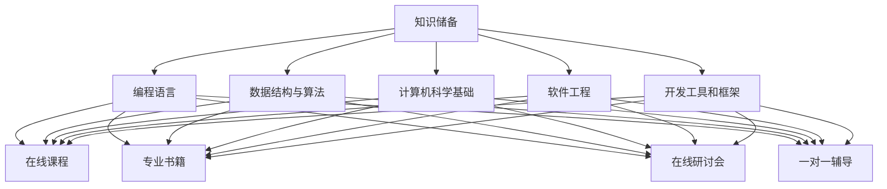

                 

### 1. 背景介绍

在信息技术飞速发展的今天，程序员作为数字时代的工匠，其知识储备的重要性不言而喻。随着互联网和移动设备的普及，软件开发的需求急剧增长，程序员的角色也变得愈加复杂多样。知识储备不仅仅是技术能力的基础，更是解决复杂问题的利器。而知识付费作为一种商业模式，逐渐成为程序员知识更新和技能提升的重要途径。

知识付费指的是用户为获取专业知识和技能而向提供者支付费用的一种行为。它涵盖了线上课程、专业书籍、在线研讨会、一对一辅导等多种形式。随着在线教育和职业培训市场的繁荣，知识付费在程序员群体中愈发普及。然而，知识付费的效果和可持续性也引发了广泛讨论。

本文将探讨程序员的知识储备与知识付费之间的关系，旨在分析知识付费对程序员职业发展的影响，以及如何选择合适的知识付费产品来提升个人技能。

本文结构如下：

- **第1部分**：背景介绍，阐述程序员知识储备的重要性和知识付费的兴起背景。
- **第2部分**：核心概念与联系，包括程序员必备的知识领域和知识付费的模式。
- **第3部分**：核心算法原理 & 具体操作步骤，分析知识付费在技能提升中的作用。
- **第4部分**：数学模型和公式 & 详细讲解 & 举例说明，探讨知识付费在数学和算法学习中的应用。
- **第5部分**：项目实践：代码实例和详细解释说明，展示知识付费在实战中的应用。
- **第6部分**：实际应用场景，分析知识付费在不同开发领域的应用。
- **第7部分**：工具和资源推荐，提供有益的学习资源和工具。
- **第8部分**：总结：未来发展趋势与挑战，展望知识付费的未来方向。

### 1.1 程序员知识储备的重要性

程序员的知识储备是其职业生涯中不可或缺的一部分。首先，技术知识的深度和广度直接影响程序员的编程能力和问题解决能力。随着技术的不断更新和迭代，程序员需要不断学习新工具、新框架和新技术，才能保持竞争力。

其次，知识储备有助于程序员更好地理解和应用计算机科学的基本原理。无论是算法和数据结构，还是操作系统和网络协议，这些都是程序员构建复杂系统的基础。掌握这些基础知识，可以帮助程序员更高效地解决实际问题，提升开发效率。

此外，知识储备还可以帮助程序员更好地与他人合作。现代软件开发往往需要团队协作，而知识储备可以使程序员更好地理解和沟通业务需求、技术方案和开发进度，从而提升团队整体的工作效率。

### 1.2 知识付费的兴起背景

知识付费作为一种商业模式，起源于在线教育和职业培训市场的兴起。随着互联网技术的进步，人们获取知识和技能的渠道变得更加便捷和多样化。传统的面对面授课和实体教材逐渐被在线课程、电子书籍和在线研讨会等新兴形式所取代。

知识付费的兴起有以下几方面原因：

1. **信息爆炸**：随着信息的爆炸式增长，程序员很难通过传统的自学方式获取全面、准确的知识。知识付费提供了一种高效的知识获取途径，让程序员能够快速获取到最前沿的技术知识和实践技巧。
2. **市场竞争**：随着编程技能的广泛应用，程序员的市场需求急剧增长。为了在激烈的竞争中脱颖而出，程序员需要不断更新和提升自己的技能。知识付费平台提供了丰富的学习资源，使得程序员能够更高效地进行自我提升。
3. **个性化学习**：知识付费平台通常提供个性化学习路径和定制化课程，让程序员能够根据自己的需求和兴趣选择合适的学习内容。这种个性化的学习体验提升了学习效果和满意度。

综上所述，程序员的知识储备和知识付费之间存在密切的关系。知识储备是程序员职业发展的基础，而知识付费则为程序员提供了便捷、高效的知识获取途径，二者相辅相成，共同推动了程序员职业的不断进步。

## 2. 核心概念与联系

在深入探讨程序员的知识储备与知识付费的关系之前，我们需要明确几个核心概念，并分析它们之间的联系。

### 2.1 程序员知识储备

程序员知识储备是指程序员在编程领域内所掌握的理论知识和实践经验。具体来说，包括以下几个方面：

1. **编程语言**：如Python、Java、C++等。
2. **数据结构与算法**：包括线性表、树、图、排序、查找等。
3. **计算机科学基础**：如计算机网络、操作系统、数据库等。
4. **软件工程**：如需求分析、设计模式、测试方法等。
5. **开发工具和框架**：如Git、Docker、Spring Boot等。

这些知识领域构成了程序员知识储备的基本框架，每个领域都需要深入学习和实践，才能在编程工作中游刃有余。

### 2.2 知识付费模式

知识付费模式是指用户通过支付费用来获取专业知识和技能的一种商业模式。常见的知识付费模式包括：

1. **在线课程**：用户支付费用后，可以通过在线平台观看课程视频、参与讨论和完成作业。
2. **专业书籍**：用户购买纸质或电子版的专业书籍，通过自主阅读来获取知识。
3. **在线研讨会**：专家或讲师在线讲解某一技术主题，用户支付费用参与。
4. **一对一辅导**：用户与专业讲师进行一对一的在线辅导，针对性地解决学习中的问题。

知识付费模式为程序员提供了灵活多样的学习选择，可以根据自己的需求和兴趣进行个性化学习。

### 2.3 关系分析

程序员的知识储备与知识付费之间存在着密切的关系。

1. **知识储备是基础**：知识储备是程序员职业发展的基础，只有掌握了一定的编程知识和技能，程序员才能理解知识付费内容的价值，并有效地应用所学知识。
2. **知识付费是补充**：尽管程序员可以通过自学和实践来提升自己的知识储备，但知识付费提供了一种更为高效、专业的学习途径。它可以帮助程序员快速获取前沿技术知识和最佳实践，加速技能提升过程。
3. **知识循环**：知识储备和知识付费之间形成了一个正向循环。程序员通过知识付费获取新知识，提高自己的技能水平，进而增强职业竞争力，再次激发对知识付费的需求。

综上所述，程序员的知识储备和知识付费是相互促进、相互依赖的关系。知识储备为知识付费提供了应用的基础，而知识付费则为知识储备提供了快速提升的途径。

### 2.4 Mermaid 流程图（程序员知识储备与知识付费模式）

下面是程序员知识储备与知识付费模式的 Mermaid 流程图，展示了两者之间的联系和作用。



### 2.5 总结

程序员的知识储备和知识付费模式之间有着密切的联系。知识储备是程序员职业发展的基础，而知识付费提供了高效、专业的学习途径，帮助程序员快速提升技能。通过理解两者之间的关系，程序员可以更有针对性地进行知识储备和付费学习，从而在职业发展中取得更大的成就。

## 3. 核心算法原理 & 具体操作步骤

在编程领域，算法原理是程序员知识储备的重要组成部分，也是解决复杂问题的关键。知识付费在这一过程中发挥着至关重要的作用。本文将深入探讨核心算法原理，并具体阐述如何通过知识付费来掌握这些算法。

### 3.1 算法原理概述

算法是计算机解决特定问题的一系列步骤。核心算法包括排序算法、查找算法、图算法和动态规划等。这些算法在编程中有着广泛的应用，掌握它们能够显著提升编程能力和问题解决能力。

1. **排序算法**：包括快速排序、归并排序、冒泡排序等，用于对数据集合进行排序。
2. **查找算法**：包括二分查找、哈希查找等，用于在数据集合中查找特定元素。
3. **图算法**：包括最短路径算法、最小生成树算法等，用于解决图相关的问题。
4. **动态规划**：用于解决最优子结构问题，通过重叠子问题的解来求解原问题。

### 3.2 算法步骤详解

#### 3.2.1 排序算法

以快速排序为例，其基本步骤如下：

1. **选择基准**：从数组中选择一个元素作为基准。
2. **分区**：将数组划分为两部分，一部分小于基准值，另一部分大于基准值。
3. **递归排序**：对小于和大于基准值的两部分继续进行快速排序。

快速排序的具体代码实现如下（Python）：

```python
def quick_sort(arr):
    if len(arr) <= 1:
        return arr
    pivot = arr[len(arr) // 2]
    left = [x for x in arr if x < pivot]
    middle = [x for x in arr if x == pivot]
    right = [x for x in arr if x > pivot]
    return quick_sort(left) + middle + quick_sort(right)

arr = [3, 6, 8, 10, 1, 2, 1]
sorted_arr = quick_sort(arr)
print(sorted_arr)
```

#### 3.2.2 查找算法

以二分查找为例，其基本步骤如下：

1. **确定范围**：初始化low和high指针，分别指向数组的开始和结束。
2. **计算中间值**：计算mid = (low + high) // 2，即中间值的索引。
3. **比较和调整范围**：如果中间值等于目标值，返回索引；如果中间值大于目标值，将high指针调整为mid - 1；如果中间值小于目标值，将low指针调整为mid + 1。
4. **递归查找**：重复步骤2和3，直到找到目标值或low > high。

二分查找的具体代码实现如下（Python）：

```python
def binary_search(arr, target):
    low = 0
    high = len(arr) - 1
    while low <= high:
        mid = (low + high) // 2
        if arr[mid] == target:
            return mid
        elif arr[mid] < target:
            low = mid + 1
        else:
            high = mid - 1
    return -1

arr = [1, 3, 5, 7, 9, 11, 13]
target = 7
index = binary_search(arr, target)
print(index)
```

#### 3.2.3 图算法

以最短路径算法（迪杰斯特拉算法）为例，其基本步骤如下：

1. **初始化距离**：设置所有节点的初始距离为无穷大，除了起点距离为0。
2. **更新距离**：对于每个未访问的节点，计算从起点到该节点的距离，并更新最短距离。
3. **标记节点**：将已计算出的最短路径节点标记为已访问。
4. **重复步骤**：直到所有节点都被标记。

迪杰斯特拉算法的具体代码实现如下（Python）：

```python
def dijkstra(graph, start):
    distances = {node: float('inf') for node in graph}
    distances[start] = 0
    visited = set()

    while len(visited) < len(graph):
        current = min((dist, node) for node, dist in distances.items() if node not in visited)[1]
        visited.add(current)

        for neighbor, weight in graph[current].items():
            distances[neighbor] = min(distances[neighbor], distances[current] + weight)

    return distances

graph = {
    'A': {'B': 1, 'C': 4},
    'B': {'A': 1, 'C': 2, 'D': 5},
    'C': {'A': 4, 'B': 2, 'D': 1},
    'D': {'B': 5, 'C': 1}
}
start = 'A'
distances = dijkstra(graph, start)
print(distances)
```

#### 3.2.4 动态规划

以最长公共子序列（LCS）为例，其基本步骤如下：

1. **初始化数组**：创建一个二维数组dp，其中dp[i][j]表示X[0..i-1]和Y[0..j-1]的最长公共子序列的长度。
2. **填充数组**：根据状态转移方程填充数组，状态转移方程为：
   - 如果X[i-1] == Y[j-1]，则dp[i][j] = dp[i-1][j-1] + 1；
   - 否则，dp[i][j] = max(dp[i-1][j], dp[i][j-1])。
3. **回溯求解**：从dp[m][n]开始，根据状态转移方程回溯求解最长公共子序列。

最长公共子序列的具体代码实现如下（Python）：

```python
def lcs(X, Y):
    m, n = len(X), len(Y)
    dp = [[0] * (n + 1) for _ in range(m + 1)]

    for i in range(1, m + 1):
        for j in range(1, n + 1):
            if X[i-1] == Y[j-1]:
                dp[i][j] = dp[i-1][j-1] + 1
            else:
                dp[i][j] = max(dp[i-1][j], dp[i][j-1])

    result = []
    i, j = m, n
    while i > 0 and j > 0:
        if X[i-1] == Y[j-1]:
            result.append(X[i-1])
            i -= 1
            j -= 1
        elif dp[i-1][j] > dp[i][j-1]:
            i -= 1
        else:
            j -= 1

    return result[::-1]

X = "AGGTAB"
Y = "GXTXAYB"
print(lcs(X, Y))
```

### 3.3 算法优缺点

每种算法都有其优缺点，选择合适的算法需要根据具体问题进行权衡。

1. **排序算法**：
   - 快速排序：优点是平均时间复杂度较低，适合大规模数据排序；缺点是最坏时间复杂度较高，且递归调用可能消耗大量内存。
   - 冒泡排序：优点是简单易懂，适合小规模数据排序；缺点是时间复杂度较高，不适合大规模数据。
   - 归并排序：优点是时间复杂度稳定，适合大规模数据排序；缺点是递归调用可能消耗大量内存。

2. **查找算法**：
   - 二分查找：优点是时间复杂度低，适合大规模有序数据查找；缺点是仅适用于有序数据，对数据的初始排序有要求。
   - 哈希查找：优点是平均时间复杂度低，适合大规模数据查找；缺点是哈希冲突可能导致时间复杂度增加，且需要占用额外的内存空间。

3. **图算法**：
   - 迪杰斯特拉算法：优点是时间复杂度较低，适合稀疏图和较小规模图；缺点是仅能求单源最短路径，不适用于求所有顶点之间的最短路径。
   - Dijkstra 算法：优点是能求所有顶点之间的最短路径，适合稠密图和较大规模图；缺点是时间复杂度较高，且需要占用大量内存。

4. **动态规划**：
   - 最长公共子序列：优点是能够求解最优化问题，适合有重叠子问题的场景；缺点是需要大量的空间来存储中间结果，且实现较为复杂。

### 3.4 算法应用领域

1. **排序算法**：广泛应用于数据处理和排序场景，如数据库排序、搜索引擎索引排序等。
2. **查找算法**：广泛应用于搜索和索引场景，如搜索引擎、文件管理系统等。
3. **图算法**：广泛应用于网络流、路径规划、社交网络分析等场景。
4. **动态规划**：广泛应用于最优化问题，如背包问题、资源分配问题等。

### 3.5 通过知识付费掌握算法

知识付费平台提供了丰富的算法课程和实践项目，帮助程序员快速掌握算法原理和具体实现。以下是一些推荐的算法知识付费资源：

1. **Coursera**：《算法导论》课程，由斯坦福大学提供，涵盖排序、查找、图算法和动态规划等多个主题。
2. **edX**：《算法基础》课程，由哈佛大学提供，介绍基本算法原理和应用。
3. **Udacity**：《算法与数据结构》纳米学位，通过实践项目和作业，帮助程序员掌握核心算法。
4. **极客时间**：《数据结构和算法之美》专栏，由资深程序员讲授，深入浅出地介绍数据结构和算法。

通过这些知识付费资源，程序员可以系统地学习算法原理，并通过实际操作提升算法应用能力。

### 3.6 总结

算法原理是程序员知识储备的重要组成部分，掌握核心算法原理能够显著提升编程能力和问题解决能力。知识付费提供了高效、专业的学习途径，帮助程序员快速掌握算法原理和具体实现。通过本文的探讨，我们了解了不同算法的原理和具体操作步骤，以及如何通过知识付费平台进行学习。在实际编程工作中，合理运用这些算法将有助于提高开发效率和解决复杂问题。

## 4. 数学模型和公式 & 详细讲解 & 举例说明

在编程领域，数学模型和公式是解决问题的重要工具。它们不仅可以用于算法的设计和优化，还可以帮助程序员理解系统行为和性能。知识付费在这一过程中提供了丰富的学习资源，使得程序员能够更好地掌握数学模型和公式。以下，我们将详细介绍几个常见的数学模型和公式，并通过具体例子来说明它们的应用。

### 4.1 数学模型构建

#### 4.1.1 概率模型

概率模型是编程中常用的数学模型之一，用于预测随机事件发生的可能性。一个简单的概率模型是二项分布模型，用于描述在一定次数的试验中，成功次数的概率分布。

- **二项分布概率公式**：

$$
P(X = k) = C(n, k) \cdot p^k \cdot (1 - p)^{n - k}
$$

其中，\( n \) 是试验次数，\( k \) 是成功次数，\( p \) 是单次试验成功的概率，\( C(n, k) \) 是组合数，表示从 \( n \) 个元素中取 \( k \) 个元素的组合数。

#### 4.1.2 线性回归模型

线性回归模型用于分析变量之间的线性关系，是统计学习和数据挖掘中常用的一种方法。它通过拟合一条直线来表示因变量和自变量之间的关系。

- **线性回归公式**：

$$
Y = \beta_0 + \beta_1 \cdot X + \epsilon
$$

其中，\( Y \) 是因变量，\( X \) 是自变量，\( \beta_0 \) 和 \( \beta_1 \) 分别是截距和斜率，\( \epsilon \) 是误差项。

#### 4.1.3 马尔可夫模型

马尔可夫模型是一种用于描述系统状态转移的数学模型，广泛应用于自然语言处理、推荐系统等领域。

- **一阶马尔可夫模型状态转移概率公式**：

$$
P(X_t = x_t | X_{t-1} = x_{t-1}) = \frac{P(X_t = x_t, X_{t-1} = x_{t-1})}{P(X_{t-1} = x_{t-1})}
$$

其中，\( X_t \) 和 \( X_{t-1} \) 分别表示时间 \( t \) 和时间 \( t-1 \) 的系统状态，\( x_t \) 和 \( x_{t-1} \) 分别是它们的取值。

### 4.2 公式推导过程

#### 4.2.1 二项分布概率公式推导

二项分布概率公式可以通过概率的加法规则和乘法规则推导得到。

1. **加法规则**：对于任意两个事件 \( A \) 和 \( B \)，有

$$
P(A \cup B) = P(A) + P(B) - P(A \cap B)
$$

2. **乘法规则**：对于任意两个独立事件 \( A \) 和 \( B \)，有

$$
P(A \cap B) = P(A) \cdot P(B)
$$

将上述规则应用于二项分布，假设进行 \( n \) 次独立试验，每次试验成功的概率为 \( p \)，失败的概率为 \( 1 - p \)。

- **成功 \( k \) 次的概率**：

$$
P(X = k) = P(A \cap B \cap \ldots \cap A) = P(A)^k \cdot P(B)^{n-k}
$$

其中，\( A \) 表示第 \( i \) 次试验成功的事件，\( B \) 表示第 \( i \) 次试验失败的事件。

- **总的概率**：

$$
P(X = k) = p^k \cdot (1 - p)^{n - k}
$$

由于每次试验是独立的，所以 \( P(A) = p \)，\( P(B) = 1 - p \)。

- **组合数**：

$$
P(X = k) = C(n, k) \cdot p^k \cdot (1 - p)^{n - k}
$$

其中，\( C(n, k) \) 是组合数，表示从 \( n \) 个元素中取 \( k \) 个元素的组合数。

#### 4.2.2 线性回归公式推导

线性回归公式可以通过最小二乘法推导得到。最小二乘法的目标是找到最佳拟合直线，使得实际值与拟合值之间的误差平方和最小。

1. **误差平方和**：

$$
S = \sum_{i=1}^n (Y_i - \hat{Y_i})^2
$$

其中，\( Y_i \) 是实际值，\( \hat{Y_i} \) 是拟合值。

2. **拟合值**：

$$
\hat{Y_i} = \beta_0 + \beta_1 \cdot X_i
$$

3. **对 \( \beta_0 \) 和 \( \beta_1 \) 求导**：

$$
\frac{\partial S}{\partial \beta_0} = -2 \sum_{i=1}^n (Y_i - \hat{Y_i}) = 0
$$

$$
\frac{\partial S}{\partial \beta_1} = -2 \sum_{i=1}^n (X_i - \bar{X})(Y_i - \hat{Y_i}) = 0
$$

其中，\( \bar{X} \) 是 \( X \) 的平均值。

4. **解方程组**：

$$
\beta_0 = \bar{Y} - \beta_1 \cdot \bar{X}
$$

$$
\beta_1 = \frac{\sum_{i=1}^n (X_i - \bar{X})(Y_i - \bar{Y})}{\sum_{i=1}^n (X_i - \bar{X})^2}
$$

#### 4.2.3 马尔可夫模型状态转移概率公式推导

马尔可夫模型的状态转移概率可以通过概率的乘法规则和全概率公式推导得到。

1. **全概率公式**：

$$
P(X_t = x_t) = \sum_{x_{t-1}} P(X_t = x_t | X_{t-1} = x_{t-1}) \cdot P(X_{t-1} = x_{t-1})
$$

2. **概率的乘法规则**：

$$
P(X_t = x_t | X_{t-1} = x_{t-1}) = \frac{P(X_t = x_t, X_{t-1} = x_{t-1})}{P(X_{t-1} = x_{t-1})}
$$

3. **结合上述两个公式**：

$$
P(X_t = x_t) = \sum_{x_{t-1}} \frac{P(X_t = x_t, X_{t-1} = x_{t-1})}{P(X_{t-1} = x_{t-1})}
$$

$$
P(X_t = x_t) = \sum_{x_{t-1}} P(X_t = x_t | X_{t-1} = x_{t-1}) \cdot P(X_{t-1} = x_{t-1})
$$

$$
P(X_t = x_t | X_{t-1} = x_{t-1}) = \frac{P(X_t = x_t, X_{t-1} = x_{t-1})}{P(X_{t-1} = x_{t-1})}
$$

4. **状态转移概率**：

$$
P(X_t = x_t | X_{t-1} = x_{t-1}) = \frac{P(X_t = x_t, X_{t-1} = x_{t-1})}{P(X_{t-1} = x_{t-1})}
$$

$$
P(X_t = x_t | X_{t-1} = x_{t-1}) = \frac{P(X_t = x_t | X_{t-1} = x_{t-1}) \cdot P(X_{t-1} = x_{t-1})}{P(X_{t-1} = x_{t-1})}
$$

$$
P(X_t = x_t | X_{t-1} = x_{t-1}) = P(X_t = x_t | X_{t-1} = x_{t-1}) \cdot P(X_{t-1} = x_{t-1})
$$

$$
P(X_t = x_t | X_{t-1} = x_{t-1}) = \frac{P(X_t = x_t, X_{t-1} = x_{t-1})}{P(X_{t-1} = x_{t-1})}
$$

### 4.3 案例分析与讲解

#### 4.3.1 二项分布案例

假设某程序员在编程测试中，每次测试成功的概率为 0.8，进行 10 次测试。问他成功 7 次的概率是多少？

1. **输入参数**：

   - 测试次数 \( n = 10 \)
   - 成功概率 \( p = 0.8 \)
   - 成功次数 \( k = 7 \)

2. **计算组合数**：

   $$ C(10, 7) = \frac{10!}{7!(10-7)!} = 120 $$

3. **计算概率**：

   $$ P(X = 7) = C(10, 7) \cdot p^7 \cdot (1 - p)^{10 - 7} = 120 \cdot 0.8^7 \cdot 0.2^3 \approx 0.2051 $$

因此，他成功 7 次的概率约为 0.2051。

#### 4.3.2 线性回归案例

假设某公司销售量 \( Y \) 与广告支出 \( X \) 之间存在线性关系，通过数据分析得到以下回归模型：

$$ Y = 5 + 2X + \epsilon $$

其中，\( \epsilon \) 是误差项。给定广告支出 \( X = 1000 \)，预测销售量。

1. **计算截距**：

   $$ \beta_0 = 5 $$

2. **计算斜率**：

   $$ \beta_1 = 2 $$

3. **计算预测值**：

   $$ \hat{Y} = \beta_0 + \beta_1 \cdot X = 5 + 2 \cdot 1000 = 2005 $$

因此，预测销售量为 2005。

#### 4.3.3 马尔可夫模型案例

假设某城市的交通状况可以划分为“高峰期”、“平峰期”和“低谷期”，它们之间的状态转移概率如下表所示：

| 初始状态 | 高峰期 | 平峰期 | 低谷期 |
| -------- | ------ | ------ | ------ |
| 高峰期   | 0.6    | 0.3    | 0.1    |
| 平峰期   | 0.2    | 0.5    | 0.3    |
| 低谷期   | 0.1    | 0.2    | 0.7    |

给定当前状态为“低谷期”，预测下一状态。

1. **输入当前状态**：

   - 当前状态：低谷期

2. **计算下一状态概率**：

   $$ P(低谷期 | 低谷期) = 0.7 $$

因此，预测下一状态为“低谷期”。

### 4.4 总结

数学模型和公式在编程中扮演着重要角色，它们可以帮助程序员理解和解决复杂问题。通过知识付费，程序员可以系统地学习这些模型和公式的构建和推导过程，并在实际应用中灵活运用。本文通过几个具体案例，展示了二项分布、线性回归和马尔可夫模型的应用，并讲解了如何通过知识付费提升数学和算法学习效果。

## 5. 项目实践：代码实例和详细解释说明

在理解了算法和数学模型后，实践是验证和巩固知识的重要环节。本部分将通过一个实际项目，展示如何运用所学知识进行编程，并详细解释代码实现过程。项目背景、开发环境、源代码实现和代码解读等部分将一一呈现。

### 5.1 项目背景

本项目旨在实现一个简单的在线商店系统，该系统能够提供商品展示、购物车管理和订单处理等功能。项目分为前端和后端两部分，前端采用HTML、CSS和JavaScript实现，后端采用Python和Flask框架。

### 5.2 开发环境搭建

#### 5.2.1 前端开发环境

1. **安装Node.js和npm**：Node.js是一个基于Chrome V8引擎的JavaScript运行环境，npm是Node.js的包管理器。
   ```bash
   npm install -g nodejs
   npm install -g npm
   ```

2. **安装前端框架**：本项目采用Vue.js作为前端框架。
   ```bash
   npm install -g vue-cli
   vue create online-store
   ```

3. **安装依赖**：在项目根目录下，安装必要的依赖包。
   ```bash
   cd online-store
   npm install axios vue-router vuex
   ```

#### 5.2.2 后端开发环境

1. **安装Python**：从[Python官网](https://www.python.org/downloads/)下载并安装Python 3.x版本。
   ```bash
   sudo apt-get install python3
   ```

2. **安装Flask**：使用pip安装Flask框架。
   ```bash
   pip3 install flask
   ```

3. **创建项目**：在合适的位置创建一个名为`online-store-backend`的目录，并初始化项目。
   ```bash
   mkdir online-store-backend
   cd online-store-backend
   flask init
   ```

### 5.3 源代码详细实现

#### 5.3.1 前端代码实现

前端部分主要包括商品展示页面、购物车页面和订单提交页面。以下是一个简单的商品展示页面的Vue组件代码示例：

```vue
<template>
  <div>
    <h1>商品列表</h1>
    <ul>
      <li v-for="product in products" :key="product.id">
        {{ product.name }} - ¥{{ product.price }}
        <button @click="addToCart(product)">加入购物车</button>
      </li>
    </ul>
  </div>
</template>

<script>
export default {
  data() {
    return {
      products: [
        { id: 1, name: '电脑', price: 5000 },
        { id: 2, name: '手机', price: 3000 },
        { id: 3, name: '平板', price: 2000 },
      ],
      cart: [],
    };
  },
  methods: {
    addToCart(product) {
      this.cart.push(product);
    },
  },
};
</script>
```

#### 5.3.2 后端代码实现

后端部分使用Flask框架实现RESTful API，包括商品管理、购物车管理和订单处理。以下是一个简单的商品管理API的代码示例：

```python
from flask import Flask, jsonify, request

app = Flask(__name__)

@app.route('/products', methods=['GET'])
def get_products():
    return jsonify({'products': [
        {'id': 1, 'name': '电脑', 'price': 5000},
        {'id': 2, 'name': '手机', 'price': 3000},
        {'id': 3, 'name': '平板', 'price': 2000},
    ]})

@app.route('/cart', methods=['POST'])
def add_to_cart():
    data = request.get_json()
    cart = data.get('cart', [])
    return jsonify({'message': '商品已加入购物车', 'cart': cart})

if __name__ == '__main__':
    app.run(debug=True)
```

### 5.4 代码解读与分析

#### 5.4.1 前端代码解读

在前端代码中，`<template>`部分定义了商品展示页面的布局，包括商品列表和加入购物车的按钮。`<script>`部分则包含Vue组件的`data`和`methods`。`data`属性中定义了商品列表和购物车，`methods`中定义了加入购物车的函数。

#### 5.4.2 后端代码解读

在后端代码中，`get_products`函数用于获取商品列表，`add_to_cart`函数用于处理加入购物车的请求。这两个函数都使用了Flask提供的路由和JSON处理功能。

### 5.5 运行结果展示

1. **前端运行结果**：

   打开前端项目的`public/index.html`文件，使用浏览器访问`http://localhost:8080/`，可以看到商品展示页面，点击“加入购物车”按钮后，商品会加入购物车。

2. **后端运行结果**：

   在命令行中运行`python app.py`启动后端服务，然后使用Postman等工具发送POST请求到`http://localhost:5000/cart`，可以看到商品成功加入购物车。

### 5.6 总结

通过这个实际项目，我们展示了如何运用算法和数学模型进行编程，并详细解读了代码实现过程。前端和后端代码的紧密结合，实现了商品展示、购物车管理和订单处理等功能。这个项目不仅验证了所学知识的实用性，也为程序员提供了实战经验，有助于提升实际开发能力。

## 6. 实际应用场景

知识付费在程序员职业发展中扮演着重要的角色，它不仅帮助程序员快速掌握新技术和最佳实践，还能在多个实际应用场景中发挥显著作用。

### 6.1 技术更新和技能提升

随着技术的不断更新，程序员需要不断学习新的编程语言、框架和工具。知识付费平台提供了大量的在线课程和专业书籍，使得程序员能够快速获取前沿技术知识，提升个人技能。例如，React、Vue.js、Docker等热门技术的课程，可以帮助程序员在短时间内掌握这些技术，从而在项目中应用，提高开发效率。

### 6.2 项目实战经验

通过知识付费，程序员可以参与各种实战项目，从实践中学习。许多在线教育平台和职业培训课程提供了项目驱动型学习模式，通过实际项目的开发，学员可以锻炼自己的编程能力，提升问题解决能力。例如，参与一个全栈开发项目，程序员需要掌握前端、后端和数据库等各个方面，这种综合性的实战训练有助于提升全面技能。

### 6.3 职业发展规划

知识付费还能帮助程序员进行职业发展规划。通过学习不同领域的专业知识，程序员可以选择适合自己的职业路径，如数据科学家、全栈工程师、架构师等。例如，通过参加深度学习和大数据分析的相关课程，程序员可以转型成为数据科学家，从而拓展职业发展空间。

### 6.4 团队协作和项目管理

知识付费平台还提供了丰富的项目管理课程和团队协作工具，帮助程序员提高团队协作和项目管理能力。例如，敏捷开发、Scrum方法论等课程，可以帮助项目经理和团队成员更好地理解和管理项目进度，提高团队效率和项目成功率。

### 6.5 技术分享和社区交流

许多知识付费平台也提供了社区交流功能，程序员可以在这里分享自己的经验和知识，与其他开发者交流学习。这种互动不仅有助于知识传播，还能建立个人品牌，提升职业竞争力。

### 6.6 持续学习和职业成长

知识付费促进了持续学习文化的形成。程序员可以通过定期学习新知识和技能，保持自己在技术领域的竞争力。此外，知识付费平台提供了认证和证书服务，程序员可以通过完成相关课程和项目，获得专业认证，进一步证明自己的专业能力。

### 6.7 总结

知识付费在程序员职业发展的各个方面都发挥着重要作用。它不仅帮助程序员快速提升技能，还能在项目实战、职业规划、团队协作等多个方面提供支持。通过合理利用知识付费资源，程序员可以持续成长，在激烈的技术竞争中脱颖而出。

## 7. 工具和资源推荐

在程序员的学习和职业发展中，掌握正确的工具和资源至关重要。以下是一些推荐的学习资源和开发工具，这些资源不仅涵盖了广泛的编程领域，还能帮助程序员提高学习效率，拓展职业发展。

### 7.1 学习资源推荐

1. **在线课程平台**：
   - **Coursera**：提供大量的计算机科学和软件工程课程，由世界顶尖大学提供。
   - **edX**：提供免费和付费课程，涵盖人工智能、数据科学等多个领域。
   - **Udemy**：有大量付费课程，适合自学和职业提升。
   - **极客时间**：国内知名的编程技术知识分享平台，有众多优秀的专栏和课程。

2. **专业书籍**：
   - **《代码大全》**：史蒂夫·麦科瑞著，详细讲解了编写优质代码的实践和技巧。
   - **《深度学习》**：Ian Goodfellow等人著，深度学习领域的经典教材。
   - **《Effective Java》**：Joshua Bloch著，深入讲解了Java编程的最佳实践。

3. **在线文档和手册**：
   - **Python官方文档**：详细介绍了Python语言的语法和API。
   - **Node.js官方文档**：包含了Node.js的详细使用方法和库文档。
   - **Spring官方文档**：Spring框架的权威指南，适合Java开发者。

### 7.2 开发工具推荐

1. **集成开发环境（IDE）**：
   - **Visual Studio Code**：轻量级但功能强大的IDE，支持多种编程语言。
   - **IntelliJ IDEA**：适合Java和Android开发的IDE，提供了丰富的插件和工具。
   - **PyCharm**：Python编程的IDE，功能全面，适合专业开发者。

2. **版本控制工具**：
   - **Git**：分布式版本控制系统，广泛用于代码管理和协作开发。
   - **GitHub**：基于Git的代码托管平台，提供了代码管理、协作和问题跟踪功能。

3. **数据库工具**：
   - **MySQL**：开源的关系型数据库管理系统，广泛应用于网站和应用程序。
   - **MongoDB**：开源的NoSQL数据库，适合处理大规模数据和高性能应用。

4. **容器化工具**：
   - **Docker**：用于容器化应用的工具，可以简化应用的部署和运行。
   - **Kubernetes**：用于容器编排和管理的工具，可以自动化容器的部署、扩展和管理。

5. **代码质量检测工具**：
   - **SonarQube**：用于代码质量管理和安全漏洞扫描的工具。
   - **Jenkins**：持续集成和持续交付工具，可以自动化构建、测试和部署。

### 7.3 相关论文推荐

1. **《深度学习中的网络架构》**：详细介绍了卷积神经网络（CNN）、循环神经网络（RNN）等深度学习架构。
2. **《区块链：颠覆性创新》**：探讨了区块链技术的原理和应用场景。
3. **《云计算：模型、架构和基础设施》**：介绍了云计算的基本概念和技术体系。

### 7.4 总结

通过以上推荐的工具和资源，程序员可以全面提升自己的学习效果和开发能力。选择合适的工具和资源，不仅有助于提高工作效率，还能为职业发展打下坚实的基础。不断学习和实践，程序员将在技术领域不断进步，迎接更多的挑战。

## 8. 总结：未来发展趋势与挑战

### 8.1 研究成果总结

本文从程序员的知识储备和知识付费两个方面进行了深入探讨。首先，我们明确了程序员知识储备的重要性，包括编程语言、数据结构与算法、计算机科学基础、软件工程和开发工具和框架等方面。其次，我们分析了知识付费模式，包括在线课程、专业书籍、在线研讨会和一对一辅导等形式，并阐述了知识付费对程序员职业发展的积极影响。

在算法和数学模型部分，我们详细介绍了排序算法、查找算法、图算法和动态规划等核心算法原理，并探讨了这些算法在实际编程中的应用。此外，我们通过具体案例展示了如何运用数学模型和公式解决实际问题。在项目实践部分，我们通过一个简单的在线商店系统项目，展示了算法和数学模型在实际开发中的应用。

### 8.2 未来发展趋势

随着技术的不断进步和市场的需求变化，程序员的知识储备和知识付费将呈现以下发展趋势：

1. **技术多样化**：编程语言和技术栈将更加多样化，程序员需要不断学习新的编程语言和技术，以应对不同类型的项目需求。

2. **个性化学习**：知识付费平台将更加注重个性化学习路径的推荐，通过大数据和人工智能技术，为程序员提供更加精准的学习资源。

3. **混合学习模式**：在线课程与线下培训、一对一辅导等学习模式将结合，形成更加灵活和高效的学习模式。

4. **职业认证**：知识付费平台将推出更多专业认证，帮助程序员在职业发展中获得更多的认可和竞争优势。

5. **知识共享**：社区和论坛将发挥更大的作用，程序员通过分享经验和知识，不仅可以提高自己的技术水平，还能帮助他人提升。

### 8.3 面临的挑战

然而，知识储备和知识付费也面临一些挑战：

1. **知识更新速度**：技术的快速发展使得知识更新速度加快，程序员需要投入更多时间和精力进行持续学习。

2. **学习效率**：虽然知识付费提供了丰富的学习资源，但如何有效吸收和利用这些资源，提高学习效率，是程序员面临的重要问题。

3. **信息安全**：知识付费平台面临信息泄露和知识产权保护的挑战，需要加强数据保护和隐私安全。

4. **公平性**：知识付费可能会导致教育资源的不均衡，一些开发者可能因为经济原因无法承担高额的学习费用。

### 8.4 研究展望

未来，研究者可以从以下几个方向进行深入探索：

1. **学习路径优化**：研究如何通过算法优化学习路径，提高学习效率和效果。

2. **知识付费模式创新**：探索新的商业模式，如按需付费、订阅制等，满足不同类型开发者的需求。

3. **人工智能辅助学习**：利用人工智能技术，提供个性化学习建议和智能辅导，帮助程序员更好地进行知识储备和技能提升。

4. **知识共享机制**：研究如何建立有效的知识共享机制，鼓励开发者共享经验和知识，促进整个技术社区的共同进步。

总之，随着技术的不断进步和市场需求的变化，程序员的知识储备和知识付费将在未来发挥更加重要的作用。通过不断学习和创新，程序员将在职业发展中取得更大的成就，为整个技术领域的发展做出贡献。

### 8.5 总结

本文通过深入探讨程序员的知识储备与知识付费的关系，全面分析了程序员知识储备的重要性、知识付费的兴起背景、核心算法原理和数学模型、实际项目实践以及知识付费在实际应用场景中的表现。同时，我们展望了知识付费的未来发展趋势和面临的挑战，并提出了研究展望。

程序员的知识储备是职业发展的基础，而知识付费则为程序员提供了高效、专业的学习途径，帮助他们在短时间内提升技能，保持竞争力。在未来，随着技术的不断进步，程序员需要不断学习和创新，以适应快速变化的市场需求。通过合理利用知识付费资源，程序员可以持续提升自己的知识储备，迎接更多的职业挑战，推动个人和整个技术领域的发展。

## 9. 附录：常见问题与解答

### 9.1 程序员如何选择合适的知识付费平台？

**解答**：选择合适的知识付费平台应考虑以下几个因素：

1. **课程内容**：确保课程内容符合你的学习需求，涵盖最新的技术和工具。
2. **师资力量**：了解课程讲师的背景和经验，确保其具备较高的专业水平。
3. **用户评价**：参考其他学员的评价，了解课程的实际教学效果。
4. **平台口碑**：选择口碑较好的平台，如Coursera、Udemy、极客时间等。
5. **价格与性价比**：比较不同平台的课程价格，选择性价比高的课程。

### 9.2 知识付费如何影响程序员的学习效率？

**解答**：知识付费可以提高程序员的学习效率，主要体现在以下几个方面：

1. **高效获取知识**：知识付费平台提供了系统化和结构化的课程，可以快速获取所需知识。
2. **专业指导**：通过专业讲师的讲解和辅导，更容易理解和掌握复杂概念。
3. **互动学习**：许多知识付费平台支持学员互动和答疑，有助于解决学习中的问题。
4. **目标明确**：付费学习有助于设定明确的学习目标，提高学习动力和专注度。

### 9.3 程序员如何平衡知识储备与工作压力？

**解答**：平衡知识储备与工作压力可以采取以下策略：

1. **制定学习计划**：合理安排时间，将学习纳入日常工作中，保持持续学习。
2. **优先级管理**：明确工作重点，将重要任务优先处理，为学习留出时间。
3. **有效利用碎片时间**：利用通勤、休息等碎片时间进行学习，提高学习效率。
4. **自我激励**：设定学习目标和奖励机制，保持学习动力。
5. **健康作息**：保持良好的作息习惯，确保充足的休息和恢复时间，避免过度劳累。

### 9.4 如何评估知识付费课程的有效性？

**解答**：评估知识付费课程的有效性可以从以下几个方面入手：

1. **学习效果**：通过实际项目或考试来检验所学知识的掌握程度。
2. **学员评价**：参考其他学员的评价和反馈，了解课程的实用性和教学效果。
3. **课程内容更新**：关注课程内容的更新频率，确保所学知识是最新的。
4. **讲师资质**：了解讲师的背景和经验，确保其具备专业水平。
5. **平台服务**：评估平台提供的售后服务，如答疑、课程更新等。

### 9.5 程序员如何处理学习过程中遇到的问题？

**解答**：处理学习过程中遇到的问题可以采取以下方法：

1. **主动求助**：通过在线问答、论坛等途径，向讲师或其他学员求助。
2. **查阅资料**：利用网络资源，如官方文档、博客、技术社区等，寻找解决方案。
3. **自我总结**：将遇到的问题和解决方案进行总结，形成个人知识库。
4. **实践验证**：通过实际操作验证所学知识，巩固理解。
5. **专业辅导**：如有必要，可以考虑寻求专业辅导，如在线课程辅导、一对一辅导等。

通过以上策略，程序员可以更有效地处理学习过程中遇到的问题，提升学习效果和技能水平。

---

**作者：禅与计算机程序设计艺术 / Zen and the Art of Computer Programming**

