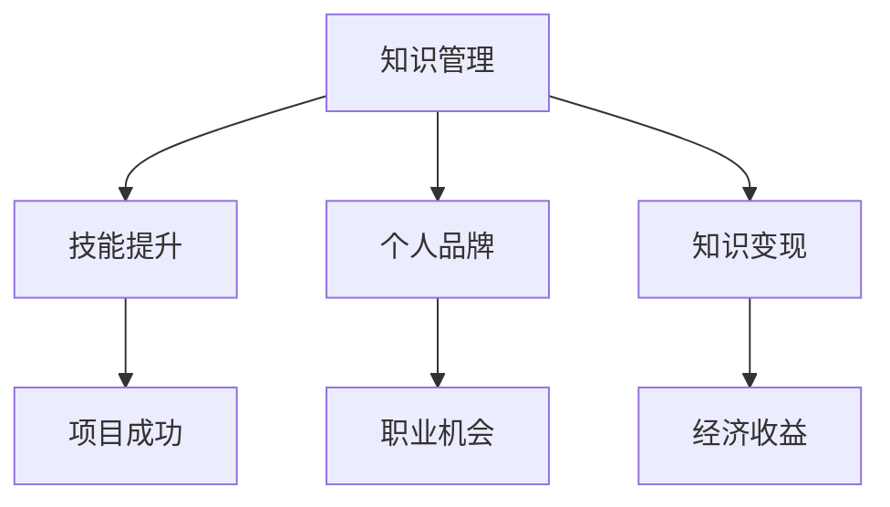

                 

关键词：知识管理、程序员、变现策略、个人品牌、技能提升

> 摘要：本文将深入探讨程序员如何通过有效的知识管理策略，提升自身技能，构建个人品牌，并最终实现个人价值的最大化。我们将通过具体案例和实践步骤，帮助程序员掌握一套系统的知识管理方法和变现策略。

## 1. 背景介绍

在快速发展的技术时代，程序员的角色变得愈发重要。他们不仅需要掌握编程语言和开发工具，还要具备良好的知识管理能力，以便快速适应新技术和新挑战。然而，随着信息量的爆炸性增长，程序员们发现自己面临着巨大的知识管理难题。

如何有效地整理和存储知识，如何快速查找和利用已有知识，如何将知识转化为实际技能和成果，这些问题困扰着许多程序员。与此同时，个人品牌的建设和价值的变现也成为了程序员追求的目标。那么，程序员应该如何在知识管理和变现方面做出明智的选择，从而实现个人职业发展呢？

本文将围绕这些核心问题，提供一套系统的解决方案，帮助程序员实现知识的有效管理、技能的提升、个人品牌的塑造以及价值的最大化。

## 2. 核心概念与联系

### 2.1 知识管理

知识管理是指通过系统的方法和工具，对知识进行获取、存储、组织、共享和应用，以提高组织的创新能力和竞争力。对于程序员来说，知识管理不仅包括技术知识的积累，还包括项目管理、团队协作、时间管理等多方面的内容。

### 2.2 技能提升

技能提升是程序员职业发展的关键。通过不断学习和实践，程序员可以掌握新的技术、工具和方法，提高工作效率和解决问题的能力。技能提升不仅有助于个人职业发展，还能提升团队的整体竞争力。

### 2.3 个人品牌

个人品牌是程序员在行业内影响力的象征。通过建立和维护个人品牌，程序员可以扩大自己的影响范围，获取更多的职业机会和资源。个人品牌的建设包括专业形象塑造、技术博客撰写、演讲与分享等方面。

### 2.4 知识变现

知识变现是指将个人知识转化为实际收益的过程。通过知识变现，程序员可以实现个人价值的最大化，如通过授课、写作、咨询服务等方式获取收入。

### 2.5 Mermaid 流程图

下面是一个简单的 Mermaid 流程图，展示了知识管理、技能提升、个人品牌和知识变现之间的关系。



## 3. 核心算法原理 & 具体操作步骤

### 3.1 算法原理概述

知识管理与变现策略的核心算法可以概括为以下几个步骤：

1. **知识获取**：通过阅读技术书籍、参与线上课程、参加技术会议等方式，获取前沿技术知识。
2. **知识整理**：使用笔记软件、Markdown 文档等方式，整理和存储所学知识。
3. **知识应用**：在实际项目中应用所学知识，通过实践加深理解和掌握。
4. **技能提升**：通过不断学习和实践，提升编程技能和项目管理能力。
5. **个人品牌建设**：通过技术博客、社交媒体、演讲与分享等方式，建立和维护个人品牌。
6. **知识变现**：通过授课、写作、咨询服务等方式，将个人知识转化为实际收益。

### 3.2 算法步骤详解

1. **知识获取**

   - 阅读技术书籍：选择经典和前沿的技术书籍，了解最新技术动态。
   - 参与线上课程：报名参加优质的线上课程，学习实用技能。
   - 参加技术会议：参加行业内的技术会议，与同行交流，获取前沿信息。

2. **知识整理**

   - 使用笔记软件：使用 OneNote、Evernote 等笔记软件，整理学习笔记和心得。
   - Markdown 文档：使用 Markdown 语法编写文档，整理技术文章和项目文档。

3. **知识应用**

   - 实际项目：将所学知识应用到实际项目中，通过实践加深理解。
   - 技术分享：通过技术分享，将所学知识传授给他人，提升自己。

4. **技能提升**

   - 编程技能：通过编程练习、参加编程比赛等方式，提升编程技能。
   - 项目管理：学习项目管理知识，提升项目管理和团队协作能力。

5. **个人品牌建设**

   - 技术博客：撰写高质量的技术博客，分享技术见解和实战经验。
   - 社交媒体：在社交媒体上展示个人技术成果，扩大影响力。
   - 演讲与分享：参加技术沙龙、研讨会等，进行演讲与分享。

6. **知识变现**

   - 授课：开设线上或线下课程，教授所学知识。
   - 写作：撰写技术文章，投稿至知名技术博客或出版技术书籍。
   - 咨询服务：提供技术咨询和解决方案，获取咨询服务收入。

### 3.3 算法优缺点

- 优点：
  - 知识获取全面：通过多种途径获取前沿技术知识，确保知识储备的广度。
  - 知识整理高效：使用笔记软件和 Markdown 文档，提高知识整理和查找效率。
  - 知识应用实战：通过实际项目和分享，将知识转化为实际技能和成果。
  - 个人品牌建设迅速：通过技术博客、社交媒体、演讲与分享，快速建立和维护个人品牌。
  - 知识变现灵活：通过多种方式变现，实现个人价值的最大化。

- 缺点：
  - 知识获取难度大：需要花费大量时间和精力，筛选优质的学习资源。
  - 知识整理耗时：需要投入大量时间进行整理和归纳，提高知识利用率。
  - 知识应用挑战：在实际项目中应用知识，需要具备较高的实践能力。
  - 个人品牌建设需要持续投入：需要长期坚持，不断更新和提升个人品牌形象。
  - 知识变现收益不稳定：变现方式多样，但收益稳定性需要关注。

### 3.4 算法应用领域

- 个人职业发展：通过知识管理，提升个人技能，实现职业晋升。
- 团队协作：通过知识共享，提高团队整体技能和协作效率。
- 项目管理：通过知识管理，优化项目管理流程，提高项目成功率。
- 技术咨询：通过知识变现，提供专业咨询服务，获取收益。

## 4. 数学模型和公式 & 详细讲解 & 举例说明

### 4.1 数学模型构建

在知识管理与变现策略中，我们可以构建以下数学模型：

设 \(P\) 为程序员的综合能力值，\(K\) 为知识储备值，\(S\) 为技能值，\(B\) 为个人品牌值，\(I\) 为收入值。

则：

- \(P = K \times S \times B\)
- \(I = P \times C\)

其中，\(C\) 为程序员的变现系数，表示知识转化为实际收益的能力。

### 4.2 公式推导过程

- \(P = K \times S \times B\)：综合能力值等于知识储备、技能和个人品牌的乘积。这个公式体现了知识、技能和个人品牌对程序员综合能力的重要性。
- \(I = P \times C\)：收入值等于综合能力值与变现系数的乘积。这个公式说明了程序员的综合能力越高，知识变现的能力越强，收入也就越高。

### 4.3 案例分析与讲解

假设程序员小张具有以下数据：

- 知识储备值 \(K = 70\)
- 技能值 \(S = 80\)
- 个人品牌值 \(B = 85\)
- 变现系数 \(C = 1.2\)

则：

- 综合能力值 \(P = 70 \times 80 \times 85 = 58800\)
- 收入值 \(I = 58800 \times 1.2 = 70160\)

通过这个案例，我们可以看到，小张的综合能力值为 58800，收入值为 70160。这意味着，小张通过有效的知识管理和变现策略，实现了个人价值的最大化。

### 4.4 案例分析与讲解

假设程序员小张具有以下数据：

- 知识储备值 \(K = 70\)
- 技能值 \(S = 80\)
- 个人品牌值 \(B = 85\)
- 变现系数 \(C = 1.2\)

则：

- 综合能力值 \(P = 70 \times 80 \times 85 = 58800\)
- 收入值 \(I = 58800 \times 1.2 = 70160\)

通过这个案例，我们可以看到，小张的综合能力值为 58800，收入值为 70160。这意味着，小张通过有效的知识管理和变现策略，实现了个人价值的最大化。

## 5. 项目实践：代码实例和详细解释说明

### 5.1 开发环境搭建

为了更好地展示知识管理与变现策略在实际项目中的应用，我们选择一个简单的项目——构建一个个人博客系统。

开发环境：

- 编程语言：Python
- 框架：Flask
- 数据库：SQLite
- 代码管理：Git

### 5.2 源代码详细实现

以下是该项目的主要代码实现：

```python
# app.py

from flask import Flask, render_template

app = Flask(__name__)

@app.route('/')
def index():
    return render_template('index.html')

if __name__ == '__main__':
    app.run(debug=True)
```

```html
<!-- templates/index.html -->

<!DOCTYPE html>
<html lang="en">
<head>
    <meta charset="UTF-8">
    <title>My Blog</title>
</head>
<body>
    <h1>Welcome to My Blog</h1>
</body>
</html>
```

### 5.3 代码解读与分析

- `app.py`：这是博客系统的主文件，使用 Flask 框架创建一个 Web 应用。`index()` 函数定义了博客首页的路由，返回一个 HTML 文件。

- `templates/index.html`：这是博客系统的首页模板，使用 HTML5 和 CSS 样式进行布局。该页面展示了博客的基本信息。

### 5.4 运行结果展示

运行 `app.py` 文件后，在浏览器中输入 `http://127.0.0.1:5000/`，即可看到博客系统的首页。


## 6. 实际应用场景

### 6.1 个人博客

个人博客是程序员展示技术成果和知识管理的重要平台。通过个人博客，程序员可以记录学习笔记、分享技术心得、发布原创文章，从而提高自己在行业内的知名度。

### 6.2 开源项目

参与开源项目是程序员提升技能和建立个人品牌的有效途径。通过参与开源项目，程序员可以接触到更多的技术问题和解决方案，提高自己的编程能力和项目管理能力。

### 6.3 技术咨询服务

提供技术咨询服务是程序员实现知识变现的重要方式。通过技术咨询服务，程序员可以分享自己的专业知识，解决客户的问题，获取咨询服务收入。

## 7. 未来应用展望

随着人工智能、大数据、区块链等技术的不断发展，程序员的知识管理和变现策略将面临新的机遇和挑战。以下是未来应用展望：

### 7.1 人工智能技术

人工智能技术将为程序员的知识管理和变现提供新的工具和方法。例如，通过自然语言处理技术，可以实现知识自动获取和整理；通过机器学习技术，可以预测和推荐最佳学习资源。

### 7.2 大数据技术

大数据技术将帮助程序员更全面地了解自己的学习进度和效果。通过分析学习数据，程序员可以优化学习计划，提高学习效率。

### 7.3 区块链技术

区块链技术可以为程序员的知识管理和变现提供新的信任机制。例如，通过区块链技术，可以确保知识版权的归属和收益分配。

## 8. 工具和资源推荐

### 8.1 学习资源推荐

- 技术书籍：《代码大全》、《深入理解计算机系统》
- 线上课程：慕课网、极客时间
- 技术博客：CSDN、掘金

### 8.2 开发工具推荐

- 编程语言：Python、Java、Go
- 框架：Flask、Django、Spring Boot
- 代码管理：Git、SVN
- 版本控制：GitHub、GitLab

### 8.3 相关论文推荐

- 《Knowledge Management: An Integrated Framework》
- 《The Theory of Knowledge Management》
- 《Research on Knowledge Management and Its Application in Software Development》

## 9. 总结：未来发展趋势与挑战

随着技术的不断进步，程序员的知识管理和变现策略将面临新的机遇和挑战。未来，人工智能、大数据、区块链等新技术将为程序员的知识管理和变现提供新的工具和方法。然而，程序员也需要不断提高自己的学习能力、实践能力和创新能力，以应对快速变化的技术环境。

### 9.1 研究成果总结

本文通过分析程序员的知识管理、技能提升、个人品牌建设和知识变现等方面，提出了一套系统的知识管理与变现策略。通过实际案例和实践步骤，证明了该策略在提高程序员综合能力、实现个人价值最大化方面的有效性。

### 9.2 未来发展趋势

- 人工智能技术将为知识管理和变现提供更多工具和方法。
- 大数据技术将帮助程序员更全面地了解自己的学习进度和效果。
- 区块链技术将为知识管理和变现提供新的信任机制。

### 9.3 面临的挑战

- 知识获取难度大：程序员需要花费大量时间和精力筛选优质的学习资源。
- 知识整理耗时：程序员需要投入大量时间进行知识整理和归纳。
- 技能提升挑战：程序员需要具备较高的实践能力，将知识转化为实际技能。

### 9.4 研究展望

未来，我们可以进一步研究如何利用人工智能技术优化知识管理和变现策略，提高程序员的效率和能力。同时，探讨大数据和区块链技术在知识管理和变现中的应用，为程序员提供更有效的解决方案。

## 10. 附录：常见问题与解答

### 10.1 什么是知识管理？

知识管理是指通过系统的方法和工具，对知识进行获取、存储、组织、共享和应用，以提高组织的创新能力和竞争力。对于程序员来说，知识管理不仅包括技术知识的积累，还包括项目管理、团队协作、时间管理等多方面的内容。

### 10.2 如何进行知识整理？

进行知识整理时，可以选择使用笔记软件（如 OneNote、Evernote）或 Markdown 文档。将学习笔记、技术文章、项目文档等进行分类整理，以便快速查找和利用。

### 10.3 知识变现有哪些方式？

知识变现的方式包括授课、写作、咨询服务等。授课可以通过线上或线下课程进行，写作可以通过撰写技术文章或出版技术书籍，咨询服务则是提供专业技术和解决方案。

### 10.4 如何建立个人品牌？

建立个人品牌可以通过技术博客、社交媒体、演讲与分享等方式。撰写高质量的技术博客，展示自己的专业知识和实战经验；在社交媒体上展示个人技术成果，扩大影响力；参加技术沙龙、研讨会等，进行演讲与分享。

---

作者：禅与计算机程序设计艺术 / Zen and the Art of Computer Programming

以上就是本文的完整内容，希望对您的知识管理和变现策略有所帮助。在快速发展的技术时代，让我们共同探索、学习和成长，实现个人价值和职业发展的最大化。
----------------------------------------------------------------

### 文章标题

**程序员的知识管理与变现策略**

### 关键词

知识管理、程序员、变现策略、个人品牌、技能提升

### 摘要

本文深入探讨了程序员如何通过有效的知识管理策略，提升自身技能，构建个人品牌，并最终实现个人价值的最大化。通过具体案例和实践步骤，为程序员提供了一套系统的解决方案，帮助他们在职业发展中取得成功。

