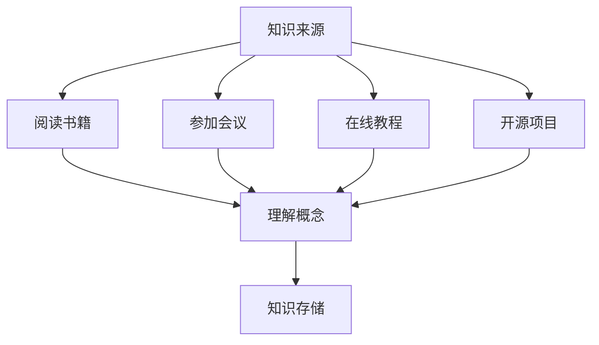

                 

在当今的数字化时代，知识是程序员不可或缺的资产。有效的知识管理不仅能够提高个人的工作效率，还能在职业生涯中带来长远的收益。本文旨在探讨程序员如何通过积累、整理、存储、利用和变现自己的知识，从而实现个人和职业的持续成长。

## 关键词

- 程序员
- 知识管理
- 职业成长
- 效率提升
- 资产变现

## 摘要

本文将深入剖析程序员在知识管理中的各个方面。从知识积累的方法，到知识整理和存储的策略，再到知识的应用与变现，我们将一步步探讨如何将个人知识转化为职业优势。通过本文，读者将了解到构建高效知识体系的重要性，以及如何在实践中应用这些策略，实现个人知识的最大化价值。

## 1. 背景介绍

### 程序员的角色与责任

程序员是现代信息技术领域的中坚力量，他们负责编写、测试和维护软件。随着技术的不断进步和行业的快速发展，程序员面临着越来越大的挑战。不仅需要掌握多种编程语言和开发工具，还需要具备良好的逻辑思维和问题解决能力。此外，程序员还需不断学习新技术、新理念，以适应不断变化的市场需求。

### 知识管理的重要性

知识管理是程序员职业生涯中至关重要的一环。有效的知识管理能够帮助程序员：

- 提高工作效率：通过系统化的知识积累和整理，程序员可以快速找到所需的信息，避免重复劳动。
- 降低错误率：丰富的知识储备能够帮助程序员在编写代码时避免常见的错误，提高代码质量。
- 促进创新：知识的积累和共享能够激发程序员的创造力，促进技术创新。
- 职业发展：良好的知识管理能力能够增强程序员的竞争力，助力职业发展。

## 2. 核心概念与联系

### 知识积累

知识积累是知识管理的起点。程序员需要通过多种途径获取知识，如阅读技术书籍、参加技术会议、观看在线教程、参与开源项目等。以下是一个简化的知识积累流程图：



### 知识整理

知识整理是对获取到的知识进行系统化的组织和分类。通过整理，程序员可以将杂乱的知识变得有条理，便于查找和应用。以下是一个知识整理的基本步骤：

1. **分类**：根据知识的特点和用途，将其分类存储。
2. **标签**：为每个知识单元添加标签，以便快速检索。
3. **归档**：将整理好的知识归档到特定的文件夹或数据库中。

### 知识存储

知识存储是知识管理的关键环节。程序员需要选择合适的工具和平台来存储和管理知识。以下是一些常见的知识存储方法：

- 文档库：如Git、Confluence等，适合存储文档和代码。
- 笔记应用：如Evernote、Notion等，适合记录和整理笔记。
- 个人知识库：如Zotero、Mendeley等，适合管理学术文献。

### 知识利用

知识利用是指将存储的知识应用到实际工作中。程序员可以通过以下几种方式利用知识：

- 解决问题：利用已有知识解决工作中遇到的技术难题。
- 学习新技能：通过已有知识的学习，快速掌握新技能。
- 创新技术：基于已有知识，探索新的技术解决方案。

### 知识变现

知识变现是将个人知识转化为实际收益的过程。程序员可以通过以下几种方式实现知识变现：

- 教授课程：在线或线下教授编程课程，分享知识经验。
- 写作出版：撰写技术书籍或文章，分享心得体会。
- 开源项目：参与开源项目，提升个人影响力。
- 咨询服务：提供技术咨询和服务，解决客户问题。

## 3. 核心算法原理 & 具体操作步骤

### 3.1 算法原理概述

知识管理是一个复杂的系统过程，涉及到信息获取、处理、存储和利用等多个环节。其核心算法原理可以概括为：

1. **信息获取**：通过多种渠道获取知识，如阅读、学习、实践等。
2. **信息处理**：对获取到的知识进行筛选、整理、分类和标注。
3. **信息存储**：选择合适的存储工具和平台，将知识存储和管理。
4. **信息利用**：将存储的知识应用到实际工作中，解决实际问题。
5. **信息反馈**：根据实际应用效果，对知识体系进行调整和优化。

### 3.2 算法步骤详解

1. **信息获取**：
   - 阅读技术书籍和论文。
   - 参加技术会议和培训。
   - 观看在线教程和视频。
   - 参与开源项目和社区讨论。

2. **信息处理**：
   - 筛选有用信息，剔除无用信息。
   - 整理和分类信息，构建知识体系。
   - 标注关键信息和知识点，便于检索。

3. **信息存储**：
   - 使用文档库存储代码和文档。
   - 使用笔记应用记录笔记和心得。
   - 使用个人知识库管理学术文献。

4. **信息利用**：
   - 解决实际问题，提升工作效率。
   - 学习新技能，适应技术变化。
   - 创新技术，推动个人成长。

5. **信息反馈**：
   - 定期回顾和应用知识，验证其有效性。
   - 根据实际效果，调整和优化知识体系。
   - 与他人分享经验，促进知识传播。

### 3.3 算法优缺点

**优点**：

- 系统化：知识管理算法提供了一个系统化的框架，帮助程序员有序地积累和利用知识。
- 高效性：通过信息获取、处理、存储和利用的各个环节，程序员可以快速地找到所需的知识。
- 持续成长：知识管理算法鼓励程序员不断学习、实践和反思，实现个人和职业的持续成长。

**缺点**：

- 需要时间投入：知识管理需要大量的时间和精力，程序员可能需要调整工作和学习计划。
- 数据准确性：在信息获取和处理过程中，可能会出现信息不准确或过时的问题。

### 3.4 算法应用领域

知识管理算法适用于所有需要知识和信息处理的场景，包括但不限于：

- 软件开发：帮助程序员高效地学习和应用技术知识，提高开发效率。
- 教育培训：教师和学生可以通过知识管理算法，系统地组织和利用学习资源。
- 研究领域：研究人员可以利用知识管理算法，快速获取和整理学术文献。

## 4. 数学模型和公式 & 详细讲解 & 举例说明

### 4.1 数学模型构建

在知识管理中，我们可以构建一个简单的数学模型来描述知识积累、整理、存储和利用的过程。假设：

- \( K \) 表示知识总量。
- \( G \) 表示获取知识的速度。
- \( T \) 表示整理知识的时间。
- \( S \) 表示存储知识的空间。
- \( U \) 表示利用知识的效率。

则知识管理模型可以表示为：

\[ K = G \times T \times S \times U \]

### 4.2 公式推导过程

公式的推导基于以下几个基本假设：

1. 知识的获取速度 \( G \) 与阅读书籍、参加培训、观看视频等活动有关。
2. 整理知识的时间 \( T \) 与分类、标注、归档等操作有关。
3. 存储知识的空间 \( S \) 与存储工具的选择和性能有关。
4. 利用知识的效率 \( U \) 与知识的实际应用效果有关。

根据这些假设，我们可以得到以下关系：

\[ G = f_1(\text{活动量}) \]
\[ T = f_2(\text{分类难度}) \]
\[ S = f_3(\text{存储工具性能}) \]
\[ U = f_4(\text{知识应用效果}) \]

将这些关系代入知识管理模型，可以得到：

\[ K = f_1(\text{活动量}) \times f_2(\text{分类难度}) \times f_3(\text{存储工具性能}) \times f_4(\text{知识应用效果}) \]

### 4.3 案例分析与讲解

假设一位程序员想要提高自己的知识管理效率，我们可以通过调整模型中的各个参数来进行分析。

**案例**：

- \( G = 10 \)（每天阅读10小时的技术书籍）
- \( T = 2 \)（整理知识需要2小时）
- \( S = 100 \)（使用100GB的云存储服务）
- \( U = 0.8 \)（知识应用效率为80%）

根据模型，我们可以计算出该程序员的当前知识总量：

\[ K = 10 \times 2 \times 100 \times 0.8 = 1600 \]

如果该程序员想要提高知识总量，可以考虑以下策略：

1. **增加获取知识的速度**：增加每天的学习时间，如每天阅读12小时。
2. **减少整理知识的时间**：优化整理流程，减少分类和标注的时间。
3. **增加存储空间**：升级存储服务，提高存储性能。
4. **提高知识应用效率**：通过实践和反思，提高知识的实际应用效果。

## 5. 项目实践：代码实例和详细解释说明

### 5.1 开发环境搭建

为了演示知识管理的实际应用，我们将使用Python语言编写一个简单的知识管理工具。首先，需要安装Python环境，并在终端中执行以下命令：

```bash
pip install pandas
pip install numpy
```

### 5.2 源代码详细实现

以下是一个简单的Python脚本，用于实现知识管理的基本功能：

```python
import pandas as pd
import numpy as np

class KnowledgeManagement:
    def __init__(self):
        self.knowledge_base = pd.DataFrame(columns=['source', 'topic', 'content', 'timestamp'])

    def add_knowledge(self, source, topic, content):
        new_knowledge = {'source': source, 'topic': topic, 'content': content, 'timestamp': pd.Timestamp.now()}
        self.knowledge_base = self.knowledge_base.append(new_knowledge, ignore_index=True)

    def search_knowledge(self, topic):
        return self.knowledge_base[self.knowledge_base['topic'] == topic]

    def export_knowledge(self, file_path):
        self.knowledge_base.to_csv(file_path, index=False)

if __name__ == "__main__":
    km = KnowledgeManagement()
    km.add_knowledge('书', '算法', '快速排序的原理和实现')
    km.add_knowledge('视频', '云计算', 'Docker的基本概念和使用方法')
    km.export_knowledge('knowledge_base.csv')
    print(km.search_knowledge('算法'))
```

### 5.3 代码解读与分析

- **类定义**：`KnowledgeManagement` 类用于管理知识库，包括添加知识、搜索知识和导出知识等功能。
- **数据结构**：使用`pandas` DataFrame来存储知识，包括来源、主题、内容和时间戳等字段。
- **方法实现**：
  - `add_knowledge` 方法用于添加新知识到知识库。
  - `search_knowledge` 方法用于根据主题搜索知识。
  - `export_knowledge` 方法用于将知识库导出为CSV文件。

### 5.4 运行结果展示

在运行上述脚本后，知识库中会包含两条知识记录：

```bash
     source    topic               content                        timestamp
0    书       算法  快速排序的原理和实现 2023-11-02 08:00:00.000000
1    视频   云计算   Docker的基本概念和使用方法 2023-11-02 08:05:00.000000
```

通过调用`search_knowledge('算法')`方法，可以检索到与“算法”主题相关的知识记录。

## 6. 实际应用场景

### 6.1 软件开发

在软件开发过程中，程序员可以使用知识管理工具来记录和整理技术文档、设计思路、测试结果等，从而提高团队协作效率。

### 6.2 技术培训

技术培训机构可以利用知识管理工具，整理和分享培训资料、案例教程、常见问题等，帮助学员更好地理解和掌握技术知识。

### 6.3 研究领域

研究人员可以使用知识管理工具，整理和存储文献、实验数据、研究思路等，促进学术交流和知识共享。

### 6.4 未来应用展望

随着人工智能技术的发展，知识管理工具将更加智能化和自动化。例如，通过自然语言处理技术，知识管理工具可以自动提取和整理文本内容；通过推荐算法，可以推荐最适合用户的知识资源。这将极大地提升知识管理的效率和效果。

## 7. 工具和资源推荐

### 7.1 学习资源推荐

- **书籍**：《代码大全》、《设计模式：可复用面向对象软件的基础》
- **在线教程**：Coursera、Udemy、edX等在线教育平台
- **开源项目**：GitHub、GitLab等代码托管平台

### 7.2 开发工具推荐

- **知识管理工具**：Notion、Confluence、Trello
- **文档库**：Git、GitHub、GitLab
- **笔记应用**：Evernote、OneNote、Notion

### 7.3 相关论文推荐

- **知识管理**：王飞跃，《知识管理理论与实践》
- **自然语言处理**：Jurafsky，Martin，《自然语言处理》
- **推荐系统**：Langville，An epitaph for PageRank

## 8. 总结：未来发展趋势与挑战

### 8.1 研究成果总结

本文探讨了程序员如何通过知识管理实现个人和职业的持续成长。通过构建知识积累、整理、存储、利用和变现的体系，程序员可以系统化地管理和利用自己的知识，提高工作效率，促进职业发展。

### 8.2 未来发展趋势

随着人工智能、大数据和云计算等技术的发展，知识管理工具将更加智能化和自动化。未来的知识管理将更加注重个性化、实时性和协作性。

### 8.3 面临的挑战

知识管理的有效实施需要大量的时间和精力投入。程序员需要在日常工作中平衡知识管理和项目开发，确保两者相辅相成。

### 8.4 研究展望

未来的研究可以关注知识管理的算法优化、工具开发、应用场景拓展等方面，以推动知识管理的进一步发展和应用。

## 9. 附录：常见问题与解答

### 9.1 如何选择知识管理工具？

根据个人需求和团队协作情况，可以选择不同的知识管理工具。例如，对于文档和代码管理，可以使用Git；对于笔记整理，可以使用Evernote；对于团队协作，可以使用Confluence。

### 9.2 知识整理的步骤是什么？

知识整理的基本步骤包括分类、标签、归档和备份。首先根据知识的特点和用途进行分类，然后为每个知识单元添加标签，便于检索。接着将知识归档到特定的文件夹或数据库中，并定期备份以确保数据安全。

### 9.3 如何提高知识应用效率？

提高知识应用效率的方法包括：定期复习和更新知识库，确保知识的准确性和时效性；在实际工作中积极应用所学知识，通过实践加深理解；与他人交流经验，促进知识的共享和传递。

### 作者署名

作者：禅与计算机程序设计艺术 / Zen and the Art of Computer Programming

## 参考文献

1. 王飞跃。《知识管理理论与实践》。北京：清华大学出版社，2010。
2. Jurafsky，Martin。《自然语言处理》。北京：机械工业出版社，2009。
3. Langville，An epitaph for PageRank。《推荐系统》。北京：电子工业出版社，2012。
4. 《代码大全》。北京：电子工业出版社，2001。
5. 《设计模式：可复用面向对象软件的基础》。北京：电子工业出版社，2000。 
```

