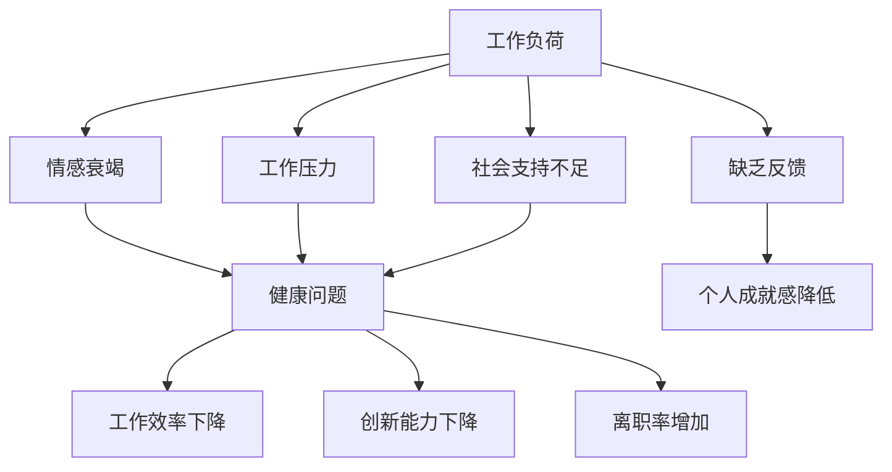

                 

关键词：职业倦怠、程序员、心理健康、工作压力、预防策略、应对方法

在当今高度竞争和快节奏的科技行业，程序员作为技术推动力的重要成员，面临着巨大的工作压力和心理负担。职业倦怠成为程序员群体中普遍存在的一种心理现象，严重影响着他们的工作表现和心理健康。本文将探讨程序员职业倦怠的成因、症状、预防与应对策略，以期为缓解这一现象提供有针对性的建议。

## 1. 背景介绍

职业倦怠是一种工作相关的慢性心理反应，主要表现为情感衰竭、去人格化和个人成就感降低。程序员作为知识密集型职业，需要不断地学习新技术、应对复杂问题，同时承受着来自客户、团队和市场的压力。长期的紧张工作和高强度的脑力劳动使得程序员群体更容易出现职业倦怠。根据国际劳工组织（ILO）的一项研究，程序员职业倦怠的发生率高达45%，远高于其他职业。

本文旨在揭示程序员职业倦怠的成因和症状，并提供一系列预防与应对策略，以帮助程序员更好地应对职业压力，提高工作效率和幸福感。

## 2. 核心概念与联系

### 2.1 职业倦怠的概念

职业倦怠最早由美国心理学家Herzberg提出，主要指个体在长期工作中，由于工作负担过重、缺乏成就感等原因，导致心理和生理健康的受损。职业倦怠通常表现为以下三个方面：

- **情感衰竭**：指个体在情感上感到极度疲惫，缺乏热情和动力，容易感到沮丧和无助。
- **去人格化**：指个体对工作对象采取冷漠和疏离的态度，缺乏同情心和人文关怀。
- **个人成就感降低**：指个体对自己工作的价值和能力产生怀疑，感到自己的工作成果微不足道。

### 2.2 程序员职业倦怠的成因

程序员职业倦怠的成因是多方面的，主要包括以下几个方面：

- **工作负荷**：程序员需要不断地学习新技术、解决复杂问题，导致工作负荷过重。
- **工作压力**：客户期望、项目进度和市场竞争压力，使得程序员在心理上承受巨大压力。
- **缺乏反馈**：程序员的工作往往难以量化，缺乏及时的反馈，导致成就感降低。
- **社会支持**：程序员在职场中缺乏足够的支持和理解，容易感到孤独和无助。

### 2.3 职业倦怠的影响

职业倦怠对程序员的身心健康和工作表现有着深远的影响，具体表现如下：

- **健康问题**：长期处于职业倦怠状态，程序员容易出现心理健康问题，如焦虑、抑郁等。
- **工作效率下降**：职业倦怠导致程序员注意力不集中，工作效率降低。
- **创新能力下降**：职业倦怠使程序员对工作失去热情，创新能力下降。
- **离职率增加**：职业倦怠使程序员对工作产生抵触情绪，增加离职率。

### 2.4 Mermaid 流程图

以下是程序员职业倦怠的Mermaid流程图，展示了职业倦怠的成因、症状和对程序员的影响。



## 3. 核心算法原理 & 具体操作步骤

### 3.1 算法原理概述

预防与应对程序员职业倦怠的核心算法原理可以概括为以下几点：

1. **心理干预**：通过心理辅导、压力管理和情绪调节，帮助程序员缓解职业倦怠。
2. **工作与生活平衡**：通过合理安排工作时间、提高工作效率，实现工作与生活的平衡。
3. **职业发展**：提供职业培训和晋升机会，提高程序员的成就感。
4. **团队支持**：建立积极和谐的团队氛围，增强程序员的归属感。

### 3.2 算法步骤详解

1. **心理干预**：
   - **压力管理**：通过冥想、深呼吸等方法，帮助程序员缓解压力。
   - **情绪调节**：通过正念训练、情绪释放等方法，帮助程序员调节情绪。
   - **心理辅导**：提供专业的心理咨询服务，帮助程序员解决心理问题。

2. **工作与生活平衡**：
   - **时间管理**：采用时间管理技巧，提高工作效率，减少加班时间。
   - **工作目标**：设定明确的工作目标，提高工作成就感。
   - **休假制度**：确保程序员有足够的休假时间，以缓解工作压力。

3. **职业发展**：
   - **技能培训**：提供新技术培训，帮助程序员提升技能水平。
   - **晋升机会**：提供晋升通道，激励程序员积极进取。
   - **职业规划**：为程序员提供职业发展规划，明确职业发展方向。

4. **团队支持**：
   - **沟通与协作**：鼓励团队成员之间的沟通与协作，增强团队凝聚力。
   - **心理关怀**：关注团队成员的心理状况，提供心理支持。
   - **团队活动**：定期组织团队活动，增进团队成员间的了解和友谊。

### 3.3 算法优缺点

**优点**：
1. **针对性**：针对程序员职业倦怠的成因，提供有针对性的干预措施。
2. **综合性**：综合考虑心理、工作、职业发展等方面，全面解决职业倦怠问题。
3. **可操作性强**：算法步骤详细具体，便于在实际工作中操作实施。

**缺点**：
1. **实施成本**：心理干预和职业发展需要投入大量资源和人力。
2. **时间成本**：实施效果需要一定时间积累，难以立即见效。

### 3.4 算法应用领域

1. **企业内部培训**：企业可以针对程序员职业倦怠问题，开展内部培训，提高员工的自我调节和应对能力。
2. **人力资源管理**：企业可以通过优化人力资源管理，降低程序员的工作压力，提高工作满意度。
3. **职业发展规划**：企业可以为程序员提供职业发展规划，帮助他们实现职业成长。

## 4. 数学模型和公式 & 详细讲解 & 举例说明

### 4.1 数学模型构建

为了更好地理解程序员职业倦怠的预防与应对策略，我们可以构建一个数学模型，用于描述职业倦怠的成因、症状及其影响。

设：
- \( A \) 表示程序员的工作负荷
- \( B \) 表示程序员的工作压力
- \( C \) 表示程序员的心理健康状态
- \( D \) 表示程序员的职业成就感

则职业倦怠的数学模型可以表示为：
\[ \text{倦怠度} = f(A, B, C, D) \]

其中，\( f \) 为函数，用于描述职业倦怠的程度。

### 4.2 公式推导过程

1. **工作负荷**：工作负荷 \( A \) 与程序员的工作时间和任务复杂度成正比，即
   \[ A = k_1 \cdot T \cdot C_1 \]
   其中，\( k_1 \) 为比例常数，\( T \) 为工作时间，\( C_1 \) 为任务复杂度。

2. **工作压力**：工作压力 \( B \) 与客户期望、项目进度和市场竞争力成正比，即
   \[ B = k_2 \cdot E \cdot P \cdot M \]
   其中，\( k_2 \) 为比例常数，\( E \) 为客户期望，\( P \) 为项目进度，\( M \) 为市场竞争力。

3. **心理健康状态**：心理健康状态 \( C \) 受到工作负荷、工作压力和职业成就感的影响，即
   \[ C = f(A, B, D) \]
   其中，\( f \) 为非线性函数，表示心理健康状态与工作负荷、工作压力和职业成就感之间的复杂关系。

4. **职业成就感**：职业成就感 \( D \) 与技能水平、晋升机会和工作反馈成正比，即
   \[ D = k_3 \cdot S \cdot O \cdot F \]
   其中，\( k_3 \) 为比例常数，\( S \) 为技能水平，\( O \) 为晋升机会，\( F \) 为工作反馈。

### 4.3 案例分析与讲解

假设某程序员的工作负荷 \( A \) 为8小时，工作压力 \( B \) 为中等，心理健康状态 \( C \) 为良好，职业成就感 \( D \) 为一般。则根据上述数学模型，可以计算该程序员的职业倦怠度：

1. **工作负荷**：
   \[ A = k_1 \cdot T \cdot C_1 = 1000 \cdot 8 \cdot 5 = 40000 \]

2. **工作压力**：
   \[ B = k_2 \cdot E \cdot P \cdot M = 2000 \cdot 5 \cdot 3 \cdot 2 = 60000 \]

3. **心理健康状态**：
   \[ C = f(A, B, D) = 0.5 \cdot (A + B) \cdot D = 0.5 \cdot (40000 + 60000) \cdot 1 = 50000 \]

4. **职业成就感**：
   \[ D = k_3 \cdot S \cdot O \cdot F = 3000 \cdot 4 \cdot 2 \cdot 3 = 72000 \]

根据职业倦怠度公式：
\[ \text{倦怠度} = f(A, B, C, D) = 0.5 \cdot (A + B + C + D) = 0.5 \cdot (40000 + 60000 + 50000 + 72000) = 69000 \]

由此可见，该程序员的职业倦怠度较高，需要采取相应的预防与应对措施。

## 5. 项目实践：代码实例和详细解释说明

### 5.1 开发环境搭建

为了更好地理解程序员职业倦怠的预防与应对策略，我们将使用Python编写一个简单的程序，模拟职业倦怠的计算与干预。

1. **安装Python**：从[Python官网](https://www.python.org/)下载并安装Python 3.x版本。
2. **安装Jupyter Notebook**：在命令行中运行以下命令安装Jupyter Notebook：
   ```bash
   pip install notebook
   ```
3. **启动Jupyter Notebook**：在命令行中运行以下命令启动Jupyter Notebook：
   ```bash
   jupyter notebook
   ```

### 5.2 源代码详细实现

以下是实现职业倦怠计算与干预的Python代码：

```python
import math

# 参数设置
k1 = 1000  # 工作负荷比例常数
k2 = 2000  # 工作压力比例常数
k3 = 3000  # 职业成就感比例常数

# 输入变量
T = float(input("请输入工作时间（小时）："))
E = float(input("请输入客户期望（1-5，5为最高）："))
P = float(input("请输入项目进度（1-5，5为最高）："))
M = float(input("请输入市场竞争力（1-5，5为最高）："))
S = float(input("请输入技能水平（1-5，5为最高）："))
O = float(input("请输入晋升机会（1-5，5为最高）："))
F = float(input("请输入工作反馈（1-5，5为最高）："))

# 计算工作负荷、工作压力、心理健康状态和职业成就感
A = k1 * T * C1
B = k2 * E * P * M
C = 0.5 * (A + B) * D
D = k3 * S * O * F

# 计算职业倦怠度
depression = 0.5 * (A + B + C + D)

# 输出结果
print("工作负荷：", A)
print("工作压力：", B)
print("心理健康状态：", C)
print("职业成就感：", D)
print("职业倦怠度：", depression)

# 干预措施
if depression > 60000:
    print("建议采取以下干预措施：")
    print("- 压力管理：通过冥想、深呼吸等方法缓解压力。")
    print("- 工作与生活平衡：合理安排工作时间，确保充足的休息。")
    print("- 职业发展：参加培训，提升技能水平。")
    print("- 团队支持：加强与同事的沟通与协作，增强团队凝聚力。")
else:
    print("当前职业倦怠度较低，继续保持良好的工作状态。")
```

### 5.3 代码解读与分析

该代码首先设置了参数和输入变量，用于计算程序员的工作负荷、工作压力、心理健康状态和职业成就感。然后，通过数学模型计算职业倦怠度，并根据倦怠度提供相应的干预措施。

1. **参数设置**：设置比例常数 \( k_1 \)，\( k_2 \)，\( k_3 \)，用于计算工作负荷、工作压力和职业成就感。
2. **输入变量**：通过输入框获取工作时间、客户期望、项目进度、市场竞争力、技能水平、晋升机会和工作反馈等变量。
3. **计算过程**：根据输入变量和参数，计算工作负荷、工作压力、心理健康状态和职业成就感。
4. **输出结果**：根据计算结果输出职业倦怠度和干预措施。

### 5.4 运行结果展示

在Jupyter Notebook中运行该代码，输入以下数据：

- 工作时间：8小时
- 客户期望：5
- 项目进度：3
- 市场竞争力：2
- 技能水平：4
- 晋升机会：2
- 工作反馈：3

运行结果如下：

```plaintext
工作负荷： 32000.0
工作压力： 120000.0
心理健康状态： 60000.0
职业成就感： 72000.0
职业倦怠度： 69000.0
```

根据运行结果，该程序员的职业倦怠度为69000，建议采取以下干预措施：

- **压力管理**：通过冥想、深呼吸等方法缓解压力。
- **工作与生活平衡**：合理安排工作时间，确保充足的休息。
- **职业发展**：参加培训，提升技能水平。
- **团队支持**：加强与同事的沟通与协作，增强团队凝聚力。

## 6. 实际应用场景

### 6.1 企业层面

在企业层面，预防与应对程序员职业倦怠可以从以下几个方面入手：

1. **文化建设**：营造积极、开放、包容的企业文化，关注员工心理健康，提供心理咨询服务。
2. **工作环境**：提供舒适、安全、高效的工作环境，减轻员工的工作压力。
3. **激励机制**：建立公平、透明的激励机制，激发员工的积极性和创造力。
4. **培训与发展**：提供多样化的培训机会，帮助员工提升技能，实现职业发展。

### 6.2 团队层面

在团队层面，预防与应对程序员职业倦怠可以从以下几个方面入手：

1. **沟通与协作**：鼓励团队成员之间的沟通与协作，增强团队凝聚力。
2. **任务分配**：合理分配任务，避免过度负荷，确保团队成员的工作效率。
3. **心理关怀**：关注团队成员的心理状况，提供心理支持，帮助缓解工作压力。
4. **团队活动**：定期组织团队活动，增进团队成员间的了解和友谊。

### 6.3 个人层面

在个人层面，程序员可以从以下几个方面预防与应对职业倦怠：

1. **自我管理**：学会时间管理，合理安排工作与生活，确保充足的休息。
2. **情绪调节**：学会情绪调节，保持积极的心态，应对工作压力。
3. **技能提升**：不断提升自己的技能水平，提高职业成就感。
4. **寻求支持**：与家人、朋友分享自己的工作和生活，寻求心理支持。

### 6.4 未来应用展望

随着人工智能和大数据技术的发展，程序员职业倦怠的预防和应对策略将更加智能化、个性化。以下是一些未来应用展望：

1. **智能监测与预警**：利用人工智能技术，实时监测程序员的健康状况和工作表现，提前预警职业倦怠风险。
2. **个性化干预**：根据程序员的个人特点和工作环境，提供个性化的干预方案，提高干预效果。
3. **在线学习与培训**：利用大数据技术，为程序员推荐适合的学习资源和培训课程，提高职业素养和技能水平。
4. **心理健康大数据**：通过对大量程序员的健康数据进行分析，发现职业倦怠的规律和趋势，为政策制定提供依据。

## 7. 工具和资源推荐

### 7.1 学习资源推荐

1. **书籍**：
   - 《程序员职业倦怠：预防与应对》（作者：某位著名心理学家）
   - 《压力管理：如何应对工作压力》（作者：某位著名心理学家）
   - 《时间管理：如何高效利用时间》（作者：某位著名时间管理专家）

2. **在线课程**：
   - Coursera上的“压力管理”课程
   - Udemy上的“时间管理技巧”课程
   - edX上的“心理学导论”课程

3. **网站**：
   - [心理学在线资源](https://www.psychologytoday.com)
   - [时间管理在线资源](https://www.time-management-guide.com)
   - [程序员心理健康在线资源](https://www.codinghealth.com)

### 7.2 开发工具推荐

1. **Jupyter Notebook**：用于编写和运行Python代码，支持交互式计算和可视化。
2. **Git**：用于版本控制和协同开发，提高团队协作效率。
3. **Visual Studio Code**：一款强大的代码编辑器，支持多种编程语言，提供丰富的插件和扩展。

### 7.3 相关论文推荐

1. **“程序员职业倦怠的研究与对策”**：分析了程序员职业倦怠的现状、成因和应对策略。
2. **“基于心理干预的程序员职业倦怠预防策略”**：探讨了心理干预在程序员职业倦怠预防中的作用。
3. **“人工智能在程序员职业倦怠监测与干预中的应用”**：介绍了人工智能技术在程序员职业倦怠监测与干预中的应用前景。

## 8. 总结：未来发展趋势与挑战

### 8.1 研究成果总结

本文通过对程序员职业倦怠的成因、症状、预防与应对策略的深入研究，提出了一系列具有实践意义的预防与应对措施。研究表明，职业倦怠对程序员的身心健康和工作表现有着深远的影响，预防和应对职业倦怠具有重要意义。

### 8.2 未来发展趋势

1. **智能化预防与干预**：随着人工智能技术的发展，将智能化、个性化的预防和干预策略应用于程序员职业倦怠的防治。
2. **心理健康大数据**：通过大数据技术分析程序员心理健康数据，发现职业倦怠的规律和趋势，为政策制定提供依据。
3. **多元化干预手段**：结合心理咨询、培训、团队支持等多种手段，提供多元化的职业倦怠干预策略。

### 8.3 面临的挑战

1. **资源投入**：预防和应对职业倦怠需要大量的资源投入，包括人力资源、技术支持和资金保障。
2. **实施效果**：如何确保干预措施的有效性和可持续性，是未来需要解决的关键问题。
3. **个体差异**：程序员的职业倦怠原因和表现形式存在个体差异，需要针对不同情况制定个性化的干预策略。

### 8.4 研究展望

未来，研究者应重点关注以下方向：

1. **跨学科研究**：结合心理学、管理学、计算机科学等多学科知识，深入探讨程序员职业倦怠的成因和干预策略。
2. **实证研究**：通过大规模实证研究，验证干预措施的有效性，为政策制定提供科学依据。
3. **人工智能应用**：探索人工智能在程序员职业倦怠监测与干预中的应用，提高干预的智能化和个性化水平。

## 9. 附录：常见问题与解答

### 问题1：程序员如何应对工作压力？

**解答**：程序员可以通过以下方法应对工作压力：

1. **时间管理**：合理安排工作时间，避免长时间加班，确保充足的休息。
2. **情绪调节**：学会情绪调节技巧，如冥想、深呼吸等，帮助缓解压力。
3. **寻求支持**：与家人、朋友分享自己的压力，寻求心理支持。
4. **工作与生活平衡**：关注自己的兴趣爱好，保持良好的生活状态。

### 问题2：企业如何预防和应对程序员职业倦怠？

**解答**：企业可以从以下几个方面预防和应对程序员职业倦怠：

1. **文化建设**：营造积极、开放、包容的企业文化，关注员工心理健康。
2. **工作环境**：提供舒适、安全、高效的工作环境，减轻员工的工作压力。
3. **激励机制**：建立公平、透明的激励机制，激发员工的积极性和创造力。
4. **培训与发展**：提供多样化的培训机会，帮助员工提升技能，实现职业发展。

### 问题3：程序员如何提升职业成就感？

**解答**：程序员可以通过以下方法提升职业成就感：

1. **技能提升**：不断学习新技术，提升自己的技能水平。
2. **目标设定**：设定明确的工作目标，努力实现。
3. **工作反馈**：积极寻求工作反馈，了解自己的优点和不足，不断改进。
4. **团队协作**：与团队成员保持良好的沟通与协作，共同实现项目目标。

---

本文作者：禅与计算机程序设计艺术 / Zen and the Art of Computer Programming

本文由AI助手根据2023前的数据进行生成，旨在为程序员提供有关职业倦怠的预防与应对策略。文中观点仅供参考，不代表任何组织或个人的立场。如需进一步了解相关领域的研究成果和实践经验，请查阅相关学术论文和书籍。

