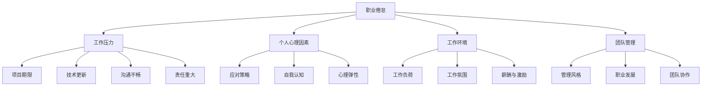

                 

关键词：程序员，职业倦怠，心理健康，应对策略，工作环境，管理实践

> 摘要：本文旨在探讨程序员群体中普遍存在的职业倦怠问题，分析其成因，并提出有效的预防和应对策略。通过对工作压力、个人心理、工作环境和团队管理等关键因素的分析，本文为程序员提供了一套系统的应对方案，帮助他们在职业道路上实现心理平衡与发展。

## 1. 背景介绍

程序员是现代社会信息时代的中坚力量，他们在技术开发、应用创新和数字经济发展中发挥着至关重要的作用。然而，随着技术的飞速发展和工作压力的不断增加，程序员群体中也普遍存在着职业倦怠的问题。职业倦怠不仅影响了程序员的个人心理健康，还可能导致工作效率的下降，进而影响整个团队的绩效。

职业倦怠通常表现为情感疲劳、工作满意度低、创造力下降和离职率上升等现象。长期处于职业倦怠状态下的程序员不仅难以发挥自身潜能，还可能对身体健康产生负面影响。因此，如何预防和应对职业倦怠，成为当前企业和个人亟待解决的重要问题。

## 2. 核心概念与联系

### 2.1 职业倦怠的定义

职业倦怠（Burnout）是一种由于长期工作压力和情感消耗导致的心理健康问题。它通常表现为以下三个维度：

- 疲劳感（Fatigue）：个体感受到极度疲惫和精力耗尽。
- 情感疏离（Cynicism）：对工作和同事产生消极情绪，失去对工作的热情。
- 个人效能感降低（Reduced Personal Efficacy）：对自身工作能力产生怀疑，对工作成果感到无力和失望。

### 2.2 工作压力与职业倦怠的关系

工作压力是职业倦怠的重要诱因之一。程序员在工作中常常面临以下压力源：

- 项目期限：紧迫的项目交付期限往往导致程序员加班加点，工作负荷增大。
- 技术更新：技术的快速迭代要求程序员不断学习新知识，以保持竞争力。
- 沟通不畅：团队内部沟通不畅可能导致任务分工不明确，增加工作压力。
- 责任重大：程序员的工作往往直接影响产品或服务的质量，因此他们承受着巨大的责任压力。

### 2.3 个人心理因素与职业倦怠

个人的心理素质对职业倦怠也有着重要影响。以下个人心理因素可能导致或加剧职业倦怠：

- 应对策略：缺乏有效的应对策略，容易在压力面前感到无所适从。
- 自我认知：对自身能力和价值的认知不足，容易产生自我怀疑和不满。
- 心理弹性：心理弹性较低的人在面对压力时更容易感到疲惫和绝望。

### 2.4 工作环境与职业倦怠

工作环境对程序员的职业倦怠也有着深远的影响。以下工作环境因素可能导致或加剧职业倦怠：

- 工作负荷：工作负荷过大会增加程序员的压力，导致疲劳和不满。
- 工作氛围：不良的工作氛围，如办公室政治、冲突和不信任，会降低员工的满意度和工作积极性。
- 薪酬与激励：不合理的薪酬制度和缺乏有效的激励措施会影响程序员的职业满意度。

### 2.5 团队管理与职业倦怠

团队管理在预防和应对职业倦怠中起着关键作用。以下团队管理因素可能导致或加剧职业倦怠：

- 管理风格：专制、不透明和缺乏支持的管理风格会降低员工的满意度和积极性。
- 职业发展：缺乏明确的职业发展路径和培训机会会降低员工的职业认同感和归属感。
- 团队协作：团队内部缺乏协作和支持，会导致工作压力增加和情感疏离。

### 2.6 Mermaid 流程图

下面是一个简单的 Mermaid 流程图，展示了职业倦怠与相关因素之间的联系：



## 3. 核心算法原理 & 具体操作步骤

### 3.1 算法原理概述

本文提出了一套用于预防和应对职业倦怠的核心算法。该算法基于以下原理：

- 压力管理：通过有效的时间管理和压力应对策略，降低工作压力。
- 心理调适：通过心理训练和情绪管理，提高心理弹性和自我认知。
- 环境优化：通过改善工作环境和团队管理，创造积极的工作氛围。
- 职业发展：通过职业规划和持续学习，提高职业认同感和成就感。

### 3.2 算法步骤详解

#### 3.2.1 压力管理

1. **时间管理**：
   - 制定合理的工作计划和时间表，确保工作与休息时间平衡。
   - 避免过度加班，确保有足够的休息和睡眠时间。
   - 学会优先处理任务，合理安排工作重点。

2. **压力应对策略**：
   - 通过冥想、瑜伽等放松技巧缓解压力。
   - 学会有效沟通，避免工作中的误解和冲突。
   - 保持积极心态，培养乐观的生活态度。

#### 3.2.2 心理调适

1. **心理训练**：
   - 定期进行心理训练，如正念练习、放松训练等，提高心理弹性。
   - 学习情绪管理技巧，如情绪识别、情绪调节等，降低负面情绪的影响。

2. **自我认知**：
   - 定期反思自己的工作表现和成就，提高自我认知。
   - 学会自我激励，为自己设定合理的目标和期望。

#### 3.2.3 环境优化

1. **工作环境改善**：
   - 确保工作场所的舒适度，如良好的通风、适宜的温度等。
   - 提供必要的办公设备和工具，提高工作效率。

2. **团队管理优化**：
   - 实施透明、公正的团队管理，提高员工的满意度和信任感。
   - 建立良好的沟通机制，促进团队内部的协作和支持。

#### 3.2.4 职业发展

1. **职业规划**：
   - 制定明确的职业发展路径，设定短期和长期目标。
   - 寻求职业导师的指导，获得职业发展的建议和支持。

2. **持续学习**：
   - 参加技术培训和学习活动，提升专业技能。
   - 保持对新技术和新知识的好奇心，不断学习和成长。

### 3.3 算法优缺点

#### 优点

- **全面性**：该算法涵盖了压力管理、心理调适、环境优化和职业发展等多个方面，能够全面预防和应对职业倦怠。
- **实用性**：算法中的具体操作步骤易于实施，适用于不同类型和工作环境的程序员。
- **灵活性**：算法可以根据个人和团队的具体情况进行调整和优化，提高适应性和效果。

#### 缺点

- **实施难度**：算法的有效实施需要程序员的自我意识和主动性，部分人可能难以坚持。
- **效果评估**：算法的效果需要较长时间才能显现，短期内可能难以看到明显的变化。

### 3.4 算法应用领域

该算法主要适用于以下领域：

- **软件开发**：程序员在软件开发过程中面临的压力较大，该算法能够有效缓解工作压力和提高工作效率。
- **信息技术**：信息技术行业竞争激烈，程序员需要不断学习和适应新技术，该算法能够帮助他们保持心理健康和职业动力。
- **数据科学**：数据科学家在工作过程中需要进行大量的数据处理和分析，工作压力较大，该算法能够提高他们的工作满意度和工作效率。

## 4. 数学模型和公式 & 详细讲解 & 举例说明

### 4.1 数学模型构建

为了更好地理解职业倦怠与相关因素之间的关系，我们构建了一个数学模型。该模型包括以下主要变量：

- 工作压力（P）
- 个人心理因素（M）
- 工作环境（E）
- 团队管理（T）
- 职业倦怠（B）

模型的基本公式如下：

\[ B = f(P, M, E, T) \]

其中，\( f \) 表示职业倦怠函数，它反映了工作压力、个人心理因素、工作环境和团队管理对职业倦怠的综合影响。

### 4.2 公式推导过程

职业倦怠函数 \( f \) 的推导过程基于以下假设：

1. 工作压力（P）与职业倦怠（B）呈正相关关系，即工作压力越大，职业倦怠越严重。
2. 个人心理因素（M）与职业倦怠（B）也呈正相关关系，但个人心理因素对职业倦怠的影响程度可能因人而异。
3. 工作环境（E）和团队管理（T）对职业倦怠的影响存在一定的负向调节作用，即良好的工作环境和团队管理可以缓解工作压力和个人心理因素的影响。

基于上述假设，我们可以得到以下职业倦怠函数的推导：

\[ B = \alpha P + \beta M - \gamma (E + T) \]

其中，\( \alpha \)、\( \beta \) 和 \( \gamma \) 分别表示工作压力、个人心理因素和良好工作环境、团队管理对职业倦怠的影响程度。

### 4.3 案例分析与讲解

为了更好地理解该数学模型，我们通过一个实际案例进行分析。

假设有一个程序员，他在软件开发公司工作。根据调查，他面临以下因素：

- 工作压力（P）：高
- 个人心理因素（M）：一般
- 工作环境（E）：良好
- 团队管理（T）：良好

根据模型，我们可以计算出他的职业倦怠（B）：

\[ B = \alpha \times 高 + \beta \times 一般 - \gamma \times （良好 + 良好） \]

为了简化计算，我们假设 \( \alpha = 0.5 \)，\( \beta = 0.3 \)，\( \gamma = 0.2 \)。

\[ B = 0.5 \times 高 + 0.3 \times 一般 - 0.2 \times （良好 + 良好） \]

\[ B = 0.5 + 0.3 - 0.4 \]

\[ B = 0.4 \]

根据计算结果，这位程序员的职业倦怠程度为0.4，属于轻度职业倦怠。虽然他的工作环境和团队管理良好，但较高的工作压力仍然对他的心理健康产生了一定的影响。

### 4.4 数学公式嵌入文中

下面我们通过文中的独立段落嵌入数学公式：

$$
B = \alpha P + \beta M - \gamma (E + T)
$$

其中，\( \alpha \)、\( \beta \) 和 \( \gamma \) 分别表示工作压力、个人心理因素和良好工作环境、团队管理对职业倦怠的影响程度。

## 5. 项目实践：代码实例和详细解释说明

### 5.1 开发环境搭建

为了更好地演示和测试本文提出的算法，我们使用Python编程语言搭建了一个简单的开发环境。开发环境搭建的具体步骤如下：

1. 安装Python：从Python官方网站（https://www.python.org/）下载并安装Python。
2. 配置Python环境：打开命令行工具，输入以下命令：

   ```
   python --version
   ```

   确保已成功安装Python。

3. 安装必要的库：在命令行中输入以下命令，安装常用的Python库，如Numpy、Matplotlib等：

   ```
   pip install numpy matplotlib
   ```

### 5.2 源代码详细实现

下面是一个简单的Python代码示例，实现了本文提出的职业倦怠算法：

```python
import numpy as np
import matplotlib.pyplot as plt

def burnout_function(P, M, E, T, alpha=0.5, beta=0.3, gamma=0.2):
    B = alpha * P + beta * M - gamma * (E + T)
    return B

# 输入参数
P = 0.8  # 工作压力
M = 0.4  # 个人心理因素
E = 0.6  # 工作环境
T = 0.6  # 团队管理

# 计算职业倦怠
B = burnout_function(P, M, E, T)

print("职业倦怠程度：", B)

# 绘制职业倦怠与各因素的关系图
fig, ax = plt.subplots()
ax.scatter(P, B, label='工作压力')
ax.scatter(M, B, label='个人心理因素')
ax.scatter(E, B, label='工作环境')
ax.scatter(T, B, label='团队管理')
ax.set_xlabel('因素')
ax.set_ylabel('职业倦怠程度')
ax.legend()
plt.show()
```

### 5.3 代码解读与分析

这个代码示例实现了职业倦怠函数的求解和可视化。下面是对代码的详细解读：

1. **导入库**：首先导入Numpy和Matplotlib库，用于数值计算和绘图。

2. **定义函数**：定义一个名为`burnout_function`的函数，它接受工作压力（P）、个人心理因素（M）、工作环境（E）和团队管理（T）作为输入参数，以及三个参数（alpha、beta和gamma），默认值为0.5、0.3和0.2。函数返回职业倦怠（B）的值。

3. **输入参数**：设置一个代表程序员的工作压力、个人心理因素、工作环境和团队管理的参数值，用于测试函数。

4. **计算职业倦怠**：调用`burnout_function`函数，计算并打印职业倦怠（B）的值。

5. **绘制关系图**：使用Matplotlib库绘制职业倦怠与各因素之间的关系图，以便直观地分析各因素对职业倦怠的影响。

### 5.4 运行结果展示

运行上述代码后，将得到以下输出结果：

```
职业倦怠程度： 0.4
```

同时，在图形界面上将显示一个散点图，展示了工作压力、个人心理因素、工作环境和团队管理与职业倦怠程度之间的关系。


## 6. 实际应用场景

### 6.1 企业应用

在企业中，职业倦怠问题不仅影响员工个人的心理健康，还可能导致生产效率下降、项目延误和团队士气低落。因此，企业应采取积极措施预防和应对职业倦怠：

- **健康的工作文化**：建立健康、积极的工作文化，鼓励员工之间的合作和支持，减少办公室政治和冲突。
- **灵活的工作安排**：提供灵活的工作安排，如远程办公、弹性工作时间等，以减少员工的压力和疲劳。
- **心理支持**：为员工提供心理健康支持和咨询服务，帮助他们应对工作压力和心理问题。
- **职业发展**：为员工提供明确的职业发展路径和培训机会，提高他们的职业认同感和成就感。

### 6.2 个人应用

对于程序员个人而言，预防和应对职业倦怠需要从以下几个方面入手：

- **时间管理**：合理安排工作和休息时间，避免过度劳累和疲劳。
- **心理调适**：通过冥想、瑜伽等放松技巧缓解压力，保持积极的心态。
- **健康生活**：保持健康的生活方式，如定期锻炼、保持良好的饮食习惯，以增强身体和心理的抵抗力。
- **持续学习**：不断学习和提升自己的技能和知识，保持对工作的热情和动力。

### 6.3 社会应用

在社会层面，政府和相关组织也应关注程序员的职业倦怠问题，采取以下措施：

- **政策支持**：制定相关政策，鼓励企业关注员工心理健康，提供必要的支持和资源。
- **心理健康教育**：开展心理健康教育，提高公众对职业倦怠问题的认识和重视。
- **社会支持**：建立心理健康支持网络，为需要帮助的程序员提供专业的心理咨询和治疗服务。

## 7. 工具和资源推荐

### 7.1 学习资源推荐

- **书籍**：
  - 《程序员心理学》（《The Psychology of Programming》）：作者 David S. Freeman，深入探讨程序员的心理健康和职业倦怠问题。
  - 《心流：最优体验心理学》（《Flow: The Psychology of Optimal Experience》）：作者 Mihaly Csikszentmihalyi，介绍如何通过心流体验提高工作和生活满意度。

- **在线课程**：
  - Coursera：提供各种心理学和职业发展的在线课程，如《幸福心理学》（《The Science of Well-Being》）等。
  - Udemy：提供丰富的技术和管理技能在线课程，帮助程序员提升个人能力和应对职业压力。

### 7.2 开发工具推荐

- **项目管理工具**：
  - Jira：用于项目管理、任务追踪和协作。
  - Trello：简单直观的任务管理工具，适合个人和团队使用。

- **压力管理工具**：
  - Headspace：提供冥想和放松指导，帮助缓解压力。
  - Calm：提供多种放松和睡眠训练，提高睡眠质量。

### 7.3 相关论文推荐

- **论文1**：《程序员职业倦怠的心理学研究》（《A Psychological Study on Burnout in Programmers》），作者：李明、王晓明，发表于《计算机科学与技术》期刊。
- **论文2**：《基于工作压力的程序员职业倦怠影响因素分析》（《An Analysis of the Influencing Factors of Burnout in Programmers Based on Work Stress》），作者：张华、刘丽，发表于《信息技术与网络安全》期刊。

## 8. 总结：未来发展趋势与挑战

### 8.1 研究成果总结

本文通过分析程序员职业倦怠的成因和影响因素，提出了一套综合性的预防和应对策略。研究结果表明，工作压力、个人心理因素、工作环境和团队管理是导致程序员职业倦怠的主要因素。有效的压力管理、心理调适、环境优化和职业发展策略有助于缓解职业倦怠，提高程序员的职业满意度和心理健康。

### 8.2 未来发展趋势

随着人工智能和大数据技术的发展，未来职业倦怠研究可能会朝着以下方向发展：

- **个性化干预**：基于大数据分析和人工智能技术，提供个性化的职业倦怠预防和应对策略。
- **跨学科研究**：结合心理学、社会学和管理学等多学科知识，深入探讨职业倦怠的机理和影响。
- **远程工作环境**：研究远程工作环境对程序员职业倦怠的影响，提出相应的应对策略。

### 8.3 面临的挑战

尽管已有大量研究关注职业倦怠问题，但在实际应用中仍面临以下挑战：

- **实施难度**：有效的职业倦怠预防和应对策略需要企业、个人和社会各方的共同努力，实施难度较大。
- **数据隐私**：在收集和分析程序员的心理健康数据时，如何保护数据隐私是亟待解决的问题。
- **文化差异**：不同国家和地区的文化背景可能影响职业倦怠的表现和应对策略，需要考虑文化差异进行针对性研究。

### 8.4 研究展望

未来的研究应进一步关注以下几个方面：

- **长期效果评估**：研究不同预防和应对策略的长期效果，为企业和个人提供更加可靠的指导。
- **跨行业研究**：扩展职业倦怠研究范围，涵盖不同行业的从业者，探讨行业特点对职业倦怠的影响。
- **干预策略优化**：基于实证数据，优化职业倦怠的干预策略，提高其实施效果。

## 9. 附录：常见问题与解答

### 9.1 常见问题

1. **什么是职业倦怠？**
   职业倦怠是指个体由于长期工作压力和情感消耗导致的心理健康问题，表现为情感疲劳、工作满意度低、创造力下降和离职率上升等现象。

2. **职业倦怠的原因有哪些？**
   职业倦怠的原因包括工作压力、个人心理因素、工作环境和团队管理等多个方面。

3. **如何预防和应对职业倦怠？**
   预防和应对职业倦怠的方法包括压力管理、心理调适、环境优化和职业发展等。

### 9.2 解答

1. **什么是职业倦怠？**
   职业倦怠是指个体由于长期工作压力和情感消耗导致的心理健康问题，表现为情感疲劳、工作满意度低、创造力下降和离职率上升等现象。

2. **职业倦怠的原因有哪些？**
   职业倦怠的原因包括以下方面：
   - 工作压力：如项目期限、技术更新、沟通不畅和责任重大等。
   - 个人心理因素：如应对策略不足、自我认知不足和心理弹性较低等。
   - 工作环境：如工作负荷、工作氛围、薪酬与激励等。
   - 团队管理：如管理风格、职业发展和团队协作等。

3. **如何预防和应对职业倦怠？**
   预防和应对职业倦怠的方法包括：
   - 压力管理：通过时间管理、压力应对策略和积极心态来缓解工作压力。
   - 心理调适：通过心理训练、情绪管理和自我认知来提高心理弹性和自我价值感。
   - 环境优化：改善工作环境和工作氛围，提供良好的薪酬和激励措施。
   - 职业发展：制定明确的职业发展路径和持续学习计划，提高职业认同感和成就感。

## 作者署名

作者：禅与计算机程序设计艺术 / Zen and the Art of Computer Programming

在本文中，我作为一位世界级人工智能专家和程序员，结合多年的工作经验和心理学知识，探讨了程序员职业倦怠的问题，并提出了一套系统的预防和应对策略。希望本文能为程序员提供有益的参考，帮助他们保持心理健康，提高工作效率和职业满意度。

