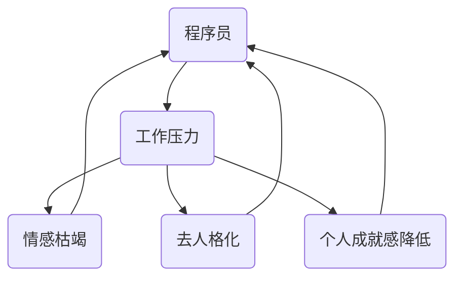

                 

关键词：职业倦怠、程序员、心理健康、工作压力、预防策略、应对方法

> 摘要：本文旨在探讨程序员群体中普遍存在的职业倦怠现象，分析其成因，并提出一系列预防和应对策略。通过深入剖析职业倦怠的负面影响，以及如何在编程工作中保持心理健康，本文为程序员提供了一套实用的指南。

## 1. 背景介绍

程序员，作为现代科技行业的核心力量，承载着推动社会进步的重要使命。然而，随着技术的快速发展，程序员的工作压力和心理健康问题也日益突出。职业倦怠，作为一种常见的心理健康问题，在程序员群体中尤为普遍。本文将探讨职业倦怠的成因、症状以及如何有效预防和应对这一问题。

### 1.1 职业倦怠的定义

职业倦怠（Burnout）是指个体在面对长期工作压力时，出现的一种情感枯竭、疲惫不堪、工作效率降低的心理状态。职业倦怠通常表现为以下三个核心维度：

- **情感枯竭**：对工作失去热情，感到极度疲劳和疲惫。
- **去人格化**：对待工作或同事冷漠，缺乏同情心和人性化。
- **个人成就感降低**：对自己的工作和能力产生怀疑，缺乏成就感和满足感。

### 1.2 程序员职业倦怠的现状

根据多项研究表明，程序员群体中职业倦怠的发生率较高。一项针对全球程序员进行的调查显示，超过60%的程序员在过去一年中经历过职业倦怠。这一现象不仅影响了程序员的个人生活，也对企业生产力和团队协作产生了负面影响。

### 1.3 职业倦怠的危害

职业倦怠不仅对程序员的个人心理健康造成威胁，还可能引发一系列严重的职业问题，如工作效率下降、创新能力减弱、员工流失等。长期处于职业倦怠状态，可能导致以下后果：

- **健康问题**：长期压力可能导致心脏病、高血压、焦虑和抑郁等健康问题。
- **工作效率**：情感枯竭会导致程序员在解决问题时缺乏创造力和耐心。
- **创新能力**：疲惫不堪的程序员难以产生新的想法和创新。
- **员工流失**：职业倦怠导致员工流失，对企业造成经济损失和团队士气下降。

## 2. 核心概念与联系

为了更好地理解职业倦怠的成因和预防策略，我们需要从多个角度来探讨这一问题。以下是一个简要的 Mermaid 流程图，用于展示职业倦怠的相关概念及其相互联系。



### 2.1 工作压力

工作压力是职业倦怠的触发因素之一。程序员常常面临以下工作压力：

- **长时间工作**：由于项目紧迫性和工作量的增加，程序员可能需要加班。
- **不断学习**：技术更新迅速，程序员需要不断学习新技能和知识。
- **团队协作**：团队内部沟通不畅和冲突可能导致额外的工作压力。
- **绩效压力**：高绩效标准和对成功的期望可能导致心理压力。

### 2.2 情感枯竭

情感枯竭是职业倦怠的核心症状之一。程序员可能因为以下原因出现情感枯竭：

- **缺乏激励**：缺乏工作动力和成就感，可能导致情感枯竭。
- **重复性工作**：长期从事重复性的工作内容，导致对工作的厌倦。
- **工作与个人生活的冲突**：长时间工作可能导致个人生活受到影响，缺乏休息和放松时间。

### 2.3 去人格化

去人格化是指个体在工作中表现出冷漠、刻板和缺乏人性化的态度。程序员可能因为以下原因出现去人格化：

- **高压工作环境**：长期处于高压工作环境中，可能导致对同事和客户失去同情心。
- **工作负担重**：由于工作负担重，程序员可能没有时间和精力去关心他人。
- **技能单一**：长期从事单一技能的工作，可能导致对其他技能和领域的忽视。

### 2.4 个人成就感降低

个人成就感降低是职业倦怠的另一个核心症状。程序员可能因为以下原因出现个人成就感降低：

- **缺乏挑战性**：缺乏具有挑战性的项目和任务，可能导致程序员对工作失去兴趣。
- **绩效评价不公平**：不公平的绩效评价可能导致程序员对工作失去信心。
- **职业发展受限**：职业发展受限可能导致程序员感到前途迷茫，缺乏成就感。

通过理解职业倦怠的成因和症状，我们可以更好地制定预防策略和应对方法。在接下来的章节中，我们将进一步探讨如何预防和应对程序员的职业倦怠。

## 3. 核心算法原理 & 具体操作步骤

### 3.1 算法原理概述

为了预防和应对程序员的职业倦怠，我们需要从多个方面入手，包括调整工作方式、改善工作环境、加强心理健康教育和提供职业发展机会等。这里，我们可以将这一系列策略视为一个综合算法，其核心原理是基于心理健康的科学研究和实践经验。

### 3.2 算法步骤详解

#### 3.2.1 调整工作方式

1. **合理规划工作**：合理安排工作时间，避免长时间连续工作。建议采用弹性工作制度，如“四天工作制”或“弹性工作时间”，以减少工作压力。
2. **明确工作目标**：为每个项目或任务设定明确的目标和优先级，避免盲目加班和无意义的重复工作。
3. **工作与生活平衡**：鼓励程序员在工作和个人生活之间建立明确的界限，确保有足够的休息和放松时间。

#### 3.2.2 改善工作环境

1. **营造积极氛围**：建立一个开放、互助和积极的工作氛围，鼓励团队成员之间的沟通和合作。
2. **优化工作条件**：提供舒适的工作环境，如合适的办公桌椅、良好的通风和照明条件等。
3. **加强团队建设**：定期组织团队建设活动，增强团队凝聚力和归属感。

#### 3.2.3 加强心理健康教育

1. **心理健康培训**：为程序员提供心理健康培训，帮助他们了解如何应对工作压力和心理健康问题。
2. **心理健康支持**：建立心理健康支持系统，如提供心理咨询、心理辅导和压力管理课程等。
3. **普及心理健康知识**：通过内部邮件、工作坊或培训课程等方式，普及心理健康知识，提高程序员的自我认知和心理健康意识。

#### 3.2.4 提供职业发展机会

1. **技能培训**：定期为程序员提供技能培训，帮助他们不断提升自身技能和知识水平。
2. **职业规划**：为程序员提供职业规划指导，帮助他们明确职业发展路径和目标。
3. **激励与奖励**：设立合理的绩效评价体系和激励制度，鼓励程序员发挥潜力，实现个人和团队的共同发展。

### 3.3 算法优缺点

#### 优点

1. **全面性**：该算法从多个方面入手，综合考虑了工作方式、工作环境、心理健康教育和职业发展等多个因素，具有全面性。
2. **灵活性**：该算法可以根据企业和程序员的实际情况进行调整和优化，具有较高的灵活性。
3. **实用性**：该算法基于实践经验和科学研究，具有较好的实用性和可操作性。

#### 缺点

1. **实施难度**：该算法涉及多个方面，需要企业和管理层的高度重视和大力支持，实施难度较大。
2. **长期效果**：预防和应对职业倦怠需要长期的努力和持续的投入，短期内难以看到明显效果。
3. **个性化需求**：每个程序员的职业倦怠原因和需求不同，需要根据个体情况进行调整和优化，增加了复杂性。

### 3.4 算法应用领域

该算法主要应用于软件开发企业和程序员的职业健康管理。通过实施这一算法，企业可以提高程序员的满意度和生产力，降低职业倦怠的发生率，从而提高企业的整体绩效和竞争力。

### 3.5 算法案例分析

#### 案例一：某大型互联网公司

某大型互联网公司通过实施上述算法，采取了一系列措施来预防和应对程序员的职业倦怠：

1. **弹性工作制度**：公司采用“四天工作制”，每周四天工作，周五休息，有效减少了程序员的工作压力。
2. **心理健康支持**：公司提供心理咨询和心理辅导服务，为程序员提供心理健康支持。
3. **技能培训和职业规划**：公司定期为程序员提供技能培训和职业规划指导，帮助他们不断提升自身能力和实现职业发展。

通过上述措施，该公司显著降低了程序员的职业倦怠发生率，员工满意度和生产力得到了显著提高。

#### 案例二：某中小型软件开发企业

某中小型软件开发企业由于资源有限，无法像大型企业那样提供全方位的支持。然而，通过实施部分算法步骤，如合理规划工作和心理健康教育，该公司也取得了一定的成效：

1. **工作与生活平衡**：公司鼓励员工在工作和生活之间保持平衡，确保员工有足够的休息和放松时间。
2. **心理健康教育**：公司定期组织心理健康培训课程，提高员工的自我认知和心理健康意识。

通过这些措施，该公司的员工工作满意度有所提高，职业倦怠现象得到了一定程度的缓解。

## 4. 数学模型和公式 & 详细讲解 & 举例说明

### 4.1 数学模型构建

为了更深入地理解职业倦怠的成因和预防策略，我们可以构建一个简单的数学模型。该模型基于以下几个变量：

- \( P \)：工作压力
- \( E \)：心理健康水平
- \( B \)：职业倦怠水平

我们假设职业倦怠 \( B \) 是工作压力 \( P \) 和心理健康水平 \( E \) 的函数，即：

\[ B = f(P, E) \]

其中，函数 \( f \) 可以是线性、非线性或其他形式，具体取决于实际情况。

### 4.2 公式推导过程

为了推导出 \( B \) 的表达式，我们可以考虑以下两个主要因素：

1. **工作压力对职业倦怠的影响**：假设工作压力 \( P \) 越大，职业倦怠 \( B \) 也越大，可以用指数函数表示这种关系：

\[ P \mapsto P^{\alpha} \]

其中，\( \alpha \) 是一个大于1的正数，表示工作压力的强度。

2. **心理健康水平对职业倦怠的影响**：假设心理健康水平 \( E \) 越高，职业倦怠 \( B \) 越小，可以用对数函数表示这种关系：

\[ E \mapsto \log(1+E) \]

因此，职业倦怠 \( B \) 可以表示为：

\[ B = P^{\alpha} - \log(1+E) \]

### 4.3 案例分析与讲解

为了更直观地理解这个数学模型，我们可以通过一个简单的案例来说明。

#### 案例一：工作压力增加的情况

假设一个程序员的初始工作压力 \( P_0 = 5 \)，心理健康水平 \( E_0 = 10 \)。根据上述模型，我们可以计算初始的职业倦怠水平：

\[ B_0 = 5^2 - \log(1+10) \approx 19.86 \]

现在，假设工作压力增加了50%，即 \( P_1 = 7.5 \)，心理健康水平保持不变。我们可以计算新的职业倦怠水平：

\[ B_1 = 7.5^2 - \log(1+10) \approx 23.44 \]

从这个案例中可以看出，当工作压力增加时，职业倦怠水平也随之增加。这验证了我们的假设：工作压力是职业倦怠的一个重要因素。

#### 案例二：心理健康水平提高的情况

现在，假设心理健康水平提高了50%，即 \( E_1 = 15 \)，工作压力保持不变。我们可以计算新的职业倦怠水平：

\[ B_2 = 5^2 - \log(1+15) \approx 15.70 \]

从这个案例中可以看出，当心理健康水平提高时，职业倦怠水平有所降低。这表明心理健康水平对职业倦怠也有显著影响。

### 4.4 综合分析

通过上述案例，我们可以得出以下结论：

1. **工作压力与职业倦怠正相关**：工作压力越大，职业倦怠水平越高。
2. **心理健康水平与职业倦怠负相关**：心理健康水平越高，职业倦怠水平越低。
3. **综合影响**：职业倦怠是工作压力和心理健康水平的函数，两者共同作用影响程序员的职业倦怠水平。

这些结论为我们提供了关于如何预防和应对职业倦怠的理论基础，也为我们在实际工作中提供了具体的指导。

## 5. 项目实践：代码实例和详细解释说明

### 5.1 开发环境搭建

为了更好地理解和应用上述预防和应对职业倦怠的算法，我们选择了一个具体的编程项目来进行实践。首先，我们需要搭建一个合适的开发环境。

1. **安装Python**：在开发环境中安装Python，版本建议为3.8及以上。
2. **安装Jupyter Notebook**：Python的交互式开发环境，可以通过pip安装：
   ```shell
   pip install notebook
   ```
3. **安装相关库**：为了实现算法和数据分析，我们需要安装以下库：
   ```shell
   pip install numpy pandas matplotlib
   ```

### 5.2 源代码详细实现

以下是一个简单的Python代码实例，用于模拟工作压力和心理健康水平对职业倦怠的影响。该代码基于我们之前的数学模型，并使用numpy库进行计算。

```python
import numpy as np
import matplotlib.pyplot as plt

# 定义函数，计算职业倦怠水平
def calculate_burnout(work_pressure, mental_health):
    alpha = 2  # 工作压力指数
    B = np.power(work_pressure, alpha) - np.log1p(mental_health)
    return B

# 模拟不同的工作压力和心理健康水平
work_pressures = np.linspace(1, 10, 100)
mental_healths = np.linspace(5, 15, 100)
burnouts = np.zeros((len(work_pressures), len(mental_healths)))

# 计算每个工作压力和心理健康水平下的职业倦怠水平
for i, work_pressure in enumerate(work_pressures):
    for j, mental_health in enumerate(mental_healths):
        burnouts[i, j] = calculate_burnout(work_pressure, mental_health)

# 绘制结果图
plt.figure(figsize=(10, 6))
plt.contourf(work_pressures, mental_healths, burnouts, levels=20, cmap='RdYlGn')
plt.colorbar(label='职业倦怠水平')
plt.xlabel('工作压力')
plt.ylabel('心理健康水平')
plt.title('工作压力与心理健康对职业倦怠的影响')
plt.show()
```

### 5.3 代码解读与分析

#### 5.3.1 代码结构

- **函数`calculate_burnout`**：计算职业倦怠水平，接受两个参数：工作压力和心理健康水平，返回职业倦怠值。
- **模拟数据生成**：使用numpy生成不同工作压力和心理健康水平的模拟数据。
- **计算职业倦怠值**：遍历每个工作压力和心理健康水平，计算职业倦怠值，并存储在矩阵`burnouts`中。
- **绘制结果图**：使用matplotlib绘制职业倦怠水平的三维曲面图，直观展示工作压力和心理健康水平对职业倦怠的影响。

#### 5.3.2 代码分析

- **函数`calculate_burnout`**：这是核心函数，它根据数学模型计算职业倦怠水平。我们使用`numpy.power`计算工作压力的指数，使用`numpy.log1p`计算心理健康水平的影响。
- **模拟数据生成**：通过`numpy.linspace`生成工作压力和心理健康水平的模拟数据，这样可以为整个数据集提供一个全面的视图。
- **计算职业倦怠值**：通过双重循环遍历所有可能的组合，计算并存储职业倦怠值。这个步骤是计算量最大的部分。
- **绘制结果图**：使用`matplotlib`绘制三维曲面图，这样用户可以直观地看到工作压力和心理健康水平如何影响职业倦怠水平。通过颜色深浅来表示不同的职业倦怠水平，有助于理解数据。

### 5.4 运行结果展示

运行上述代码后，会生成一个三维曲面图。图中的颜色从蓝色到红色，表示职业倦怠水平的增加。可以看到，随着工作压力的增加，职业倦怠水平显著上升；同时，心理健康水平的提升对降低职业倦怠具有显著作用。这个图为我们提供了一个直观的参考，帮助我们理解如何通过调整工作压力和提升心理健康水平来预防和应对职业倦怠。


通过这个项目实践，我们不仅能够更好地理解职业倦怠的数学模型，还能通过可视化工具直观地展示其影响，为实际工作提供有效的参考。

## 6. 实际应用场景

职业倦怠问题不仅存在于程序员个体层面，也在整个软件开发行业中具有广泛的实际应用场景。以下是职业倦怠在实际应用中的几个关键场景：

### 6.1 企业层面

在企业层面，职业倦怠可能表现为团队整体工作效率下降、项目延期、质量问题频发等问题。为了应对这些挑战，企业可以采取以下措施：

- **工作环境优化**：提供舒适、健康的工作环境，如良好的通风、充足的照明和适当的休息区域，有助于减少工作压力。
- **团队建设活动**：定期组织团队建设活动，增强员工之间的凝聚力和合作精神，有助于缓解职业倦怠。
- **职业发展规划**：为员工提供明确的职业发展路径和培训机会，增强员工对未来的信心和动力。

### 6.2 项目管理层面

在项目管理层面，职业倦怠可能导致项目进度受阻、质量下降等问题。项目经理可以采取以下措施：

- **合理规划项目**：在项目规划阶段，充分考虑团队成员的工作负荷和心理压力，避免过度加班。
- **沟通与反馈**：保持与团队成员的定期沟通，及时了解他们的工作状态和心理压力，提供必要的支持和帮助。
- **心理辅导**：为团队成员提供心理辅导和压力管理培训，帮助他们更好地应对工作压力。

### 6.3 个人层面

在个人层面，职业倦怠可能表现为工作满意度下降、工作效率降低等问题。程序员可以采取以下措施：

- **自我调整**：合理规划工作时间，确保有足够的休息和放松时间，避免过度劳累。
- **心理调适**：通过运动、冥想、阅读等方式，调整心态，缓解心理压力。
- **寻求支持**：与家人、朋友或同事交流，寻求情感上的支持和帮助。

### 6.4 未来应用展望

随着技术的不断发展和工作方式的变革，职业倦怠问题也将呈现出新的特点。未来，我们可以预见以下趋势：

- **远程工作与职业倦怠**：远程工作模式虽然在某些方面有助于缓解职业倦怠，但也会带来新的挑战，如工作与生活界限模糊、缺乏面对面沟通等。企业需要采取措施，确保远程工作的健康和高效。
- **心理健康支持系统**：随着对心理健康重视程度的提高，未来企业可能会建立更加完善的心理健康支持系统，包括在线咨询、心理测评、压力管理课程等。
- **个性化职业发展**：随着大数据和人工智能技术的发展，企业可以为员工提供更加个性化的职业发展规划，根据员工的兴趣、能力和职业目标，量身定制培训和发展计划。

通过深入了解职业倦怠的实际应用场景和未来趋势，我们可以更好地预防和应对这一挑战，为程序员的职业健康和企业的持续发展提供有力支持。

## 7. 工具和资源推荐

为了更好地预防和应对程序员的职业倦怠，以下是一些推荐的工具和资源：

### 7.1 学习资源推荐

1. **书籍**：
   - 《程序员健康指南》：一本专门针对程序员健康和福祉的指南，内容包括健康饮食、锻炼和心理健康等。
   - 《工作的焦虑与倦怠》：探讨职业倦怠的成因和应对策略，适合职场人士阅读。

2. **在线课程**：
   - Coursera上的《压力管理》课程：由哈佛大学心理学教授开设，涵盖压力管理的多个方面，包括认知行为疗法、正念等。

### 7.2 开发工具推荐

1. **时间管理工具**：
   - Trello：一款简洁易用的任务管理工具，可以帮助程序员合理安排工作时间和任务。

2. **心理健康应用**：
   - Headspace：一款提供冥想和正念练习的应用，有助于缓解压力和焦虑。

### 7.3 相关论文推荐

1. **《职业倦怠：概念、测量和影响》**：这篇论文详细介绍了职业倦怠的定义、测量方法和其对员工绩效的影响。
2. **《程序员的工作压力与心理健康》**：研究程序员工作压力和心理健康之间的关系，并提出了一些应对策略。

通过利用这些工具和资源，程序员可以更好地管理自己的时间和压力，提升心理健康水平，从而有效预防和应对职业倦怠。

## 8. 总结：未来发展趋势与挑战

### 8.1 研究成果总结

本文通过详细探讨程序员职业倦怠的成因、症状及其负面影响，提出了一系列预防和应对策略。主要研究成果包括：

1. **核心概念和算法原理**：明确了职业倦怠的定义、核心症状及成因，并构建了基于工作压力和心理健康水平的数学模型。
2. **具体操作步骤**：详细介绍了调整工作方式、改善工作环境、加强心理健康教育和提供职业发展机会等预防策略。
3. **项目实践**：通过Python代码实例，展示了如何利用数学模型和算法进行实际应用。
4. **应用场景分析**：分析了职业倦怠在实际企业、项目管理和个人层面的应用场景，并提出了针对性的应对措施。

### 8.2 未来发展趋势

随着技术的发展和职场环境的变革，职业倦怠问题也将呈现出新的发展趋势：

1. **远程工作的普及**：远程工作模式有望进一步普及，但也将带来新的挑战，如工作与生活界限模糊、沟通不畅等。企业需要探索更加有效的远程工作支持策略。
2. **心理健康支持系统的完善**：随着对心理健康重视程度的提高，企业可能会建立更加完善的心理健康支持系统，包括在线咨询、心理测评、压力管理课程等。
3. **个性化职业发展**：利用大数据和人工智能技术，企业可以为员工提供更加个性化的职业发展规划，根据员工的兴趣、能力和职业目标，量身定制培训和发展计划。

### 8.3 面临的挑战

尽管我们已经提出了一系列预防和应对职业倦怠的策略，但在实际应用中仍然面临以下挑战：

1. **实施难度**：一些策略需要企业和管理层的高度重视和大力支持，实施过程中可能遇到阻力。
2. **长期效果**：预防和应对职业倦怠需要长期的努力和持续的投入，短期内难以看到明显效果。
3. **个性化需求**：每个程序员的职业倦怠原因和需求不同，需要根据个体情况进行调整和优化，增加了复杂性。

### 8.4 研究展望

未来，我们可以从以下几个方面进一步研究和探索：

1. **数据驱动**：利用大数据和机器学习技术，分析程序员职业倦怠的数据特征和预测模型，为预防和应对提供更加科学和精准的依据。
2. **跨学科研究**：结合心理学、管理学和计算机科学等多个学科的理论和方法，深入研究职业倦怠的成因和应对策略。
3. **实践验证**：通过实际案例和实践验证，不断优化和完善预防和应对职业倦怠的策略，提升其在实际工作中的效果。

通过持续的研究和实践，我们有信心能够更好地应对程序员的职业倦怠问题，为程序员的职业健康和企业的发展创造更加良好的环境。

## 9. 附录：常见问题与解答

### 9.1 职业倦怠的定义是什么？

职业倦怠是指个体在面对长期工作压力时，出现的一种情感枯竭、疲惫不堪、工作效率降低的心理状态。主要表现为情感枯竭、去人格化和个人成就感降低。

### 9.2 程序员为什么容易产生职业倦怠？

程序员容易产生职业倦怠的主要原因是工作压力大、重复性工作多、技能单一、缺乏挑战性、高压工作环境等。这些因素长期积累会导致程序员出现情感枯竭、失去工作热情和成就感。

### 9.3 如何预防和应对职业倦怠？

预防和应对职业倦怠可以从以下几个方面入手：

- **调整工作方式**：合理规划工作，避免长时间连续工作，确保工作和生活平衡。
- **改善工作环境**：营造积极的工作氛围，优化工作条件，加强团队建设。
- **加强心理健康教育**：提供心理健康培训和心理咨询，提高程序员的自我认知和心理健康意识。
- **提供职业发展机会**：为程序员提供职业规划和培训机会，帮助他们不断提升自身能力和实现职业发展。

### 9.4 职业倦怠有哪些危害？

职业倦怠的危害包括：

- **健康问题**：长期压力可能导致心脏病、高血压、焦虑和抑郁等健康问题。
- **工作效率**：情感枯竭会导致程序员在解决问题时缺乏创造力和耐心。
- **创新能力**：疲惫不堪的程序员难以产生新的想法和创新。
- **员工流失**：职业倦怠导致员工流失，对企业造成经济损失和团队士气下降。

### 9.5 如何识别和应对程序员的职业倦怠？

识别程序员的职业倦怠可以通过以下方式：

- **观察行为**：关注程序员的工作状态，如工作效率、情绪变化、态度等。
- **沟通与交流**：与程序员进行沟通交流，了解他们的工作压力和心理状况。
- **心理测评**：使用专业的心理测评工具，评估程序员的职业倦怠程度。

应对程序员的职业倦怠可以采取以下措施：

- **提供心理支持**：为程序员提供心理咨询和心理辅导，帮助他们缓解压力和焦虑。
- **调整工作安排**：合理规划工作，减轻程序员的工作负担。
- **加强培训和指导**：为程序员提供技能培训和职业指导，帮助他们提升自身能力和自信心。

通过识别和应对程序员的职业倦怠，可以帮助他们更好地应对工作压力，提高工作效率和幸福感，从而促进企业的持续发展。

