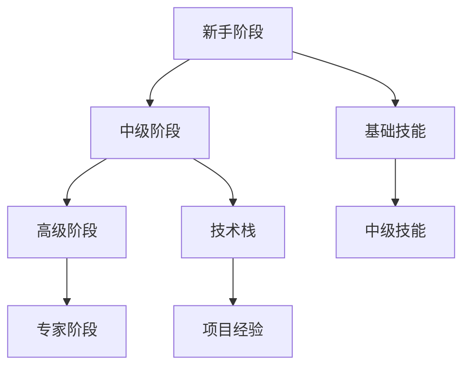

                 

关键词：程序员职业规划、技术成长路径、长期发展策略、技能提升、职业生涯管理

摘要：本文旨在为程序员提供一份详细的职业生涯规划指南，涵盖从入门到专家的不同阶段。通过探讨技术趋势、职业发展路径、技能提升策略和职业生涯管理方法，帮助程序员在30年的时间里实现职业目标的稳步提升。

## 1. 背景介绍

在科技飞速发展的今天，程序员作为IT行业的核心力量，面临着持续的技术更新和快速变化的职业环境。一个成功的程序员不仅需要具备扎实的技术能力，还需要具备良好的职业规划和管理能力。本文将探讨程序员在职业生涯中的各个阶段，以及如何通过科学规划和持续学习，实现职业的长期发展和成功。

### 1.1 当前IT行业现状

- **技术更新速度加快**：随着云计算、大数据、人工智能等新兴技术的崛起，程序员需要不断学习新技能以保持竞争力。
- **职业多样化**：从传统的后端开发到全栈工程师、前端工程师、测试工程师，程序员职业种类越来越丰富。
- **国际化趋势**：全球化使得程序员有机会在全球范围内寻找职业机会。

### 1.2 职业规划的重要性

- **明确目标**：职业规划帮助程序员明确短期和长期目标，从而更有针对性地提升技能。
- **提高竞争力**：通过不断学习和适应新技术，程序员能够提高自身在职场上的竞争力。
- **职业发展**：良好的职业规划有助于程序员在职业生涯中实现晋升和薪酬的增长。

## 2. 核心概念与联系

为了更好地理解程序员的职业生涯规划，我们需要明确几个核心概念和它们之间的关系。

### 2.1 技能树

技能树是程序员技能体系的一个模型，它展示了各种技术技能和领域知识的层级结构。技能树包括基础技能、中级技能和高级技能，不同层次的技术能力决定了程序员的职业发展高度。

### 2.2 技术栈

技术栈是指程序员在工作中所掌握的一组技术工具和语言。不同的项目可能需要不同的技术栈，因此程序员需要根据实际工作需求灵活调整自己的技术栈。

### 2.3 职业阶段

程序员的职业生涯通常可以分为几个阶段，包括新手、中级、高级和专家。每个阶段都有不同的职业挑战和成长路径。

### 2.4 职业目标

职业目标包括短期目标和长期目标。短期目标通常指在一个项目或一个职位上的目标，而长期目标则是程序员在整个职业生涯中希望实现的成就。

### 2.5 Mermaid 流程图

以下是一个Mermaid流程图，展示了程序员职业生涯中的关键节点和联系。



## 3. 核心算法原理 & 具体操作步骤

### 3.1 算法原理概述

程序员职业生涯规划的核心算法是基于职业发展模型的动态规划算法。该算法通过分析当前技能水平、职业目标、市场需求等因素，为程序员提供一个最优的职业发展路径。

### 3.2 算法步骤详解

#### 3.2.1 数据收集

1. **自我评估**：评估自己的技能水平和职业兴趣。
2. **市场调研**：了解当前市场需求和热门技能。
3. **职业目标设定**：根据个人情况和市场趋势设定短期和长期目标。

#### 3.2.2 算法计算

1. **技能匹配**：将个人技能与市场需求进行匹配，找到最匹配的技能方向。
2. **路径规划**：根据技能匹配结果，规划具体的职业发展路径，包括学习计划、项目参与、职业认证等。

#### 3.2.3 结果分析

1. **反馈调整**：根据执行过程中的反馈，调整职业规划策略。
2. **持续优化**：定期进行自我评估和职业目标调整，确保职业规划的持续性和有效性。

### 3.3 算法优缺点

#### 优点

- **个性化**：根据个人情况定制职业发展路径，提高规划的有效性。
- **动态调整**：能够根据市场需求和职业目标的变化，动态调整职业规划。

#### 缺点

- **复杂度高**：需要收集和分析大量数据，计算复杂度较高。
- **时间成本**：需要投入大量的时间和精力进行自我评估和市场调研。

### 3.4 算法应用领域

- **个人职业规划**：帮助程序员制定个性化的职业发展计划。
- **企业人才发展**：为企业提供人才发展和职业规划建议。
- **教育领域**：为教育机构提供课程设置和职业规划指导。

## 4. 数学模型和公式 & 详细讲解 & 举例说明

### 4.1 数学模型构建

程序员职业生涯规划的数学模型基于动态规划理论，其核心公式为：

\[ DP(i, j) = \max \{ DP(i-1, j-k) + C(i, j) | 0 \leq k \leq j \} \]

其中，\( DP(i, j) \) 表示在第 \( i \) 年实现第 \( j \) 个职业目标的最佳策略，\( C(i, j) \) 表示在第 \( i \) 年实现第 \( j \) 个职业目标的成本。

### 4.2 公式推导过程

#### 步骤 1：定义状态

设 \( DP(i, j) \) 为在第 \( i \) 年实现第 \( j \) 个职业目标的最佳策略。

#### 步骤 2：状态转移

为了实现第 \( j \) 个职业目标，程序员可以选择在任意一个过去年份 \( i-k \) （\( 0 \leq k \leq j \)）开始准备，然后通过 \( k \) 年的努力实现目标。因此，状态转移方程为：

\[ DP(i, j) = \max \{ DP(i-1, j-k) + C(i, j) | 0 \leq k \leq j \} \]

#### 步骤 3：边界条件

- \( DP(0, j) = 0 \)：第 \( 0 \) 年无法实现任何职业目标。
- \( DP(i, 0) = \infty \)：无法在非零年份实现零个职业目标。

### 4.3 案例分析与讲解

假设一位程序员的目标是在 5 年内成为高级工程师，成本函数为 \( C(i, j) = i \) （即每年成本等于当年年份）。以下是一个简单的例子：

```plaintext
年份(i): 1 2 3 4 5
目标(j): 1 2 3 4 5
成本(C): 1 2 3 4 5
```

通过动态规划算法，我们可以计算出在不同年份实现不同职业目标的最佳策略：

```plaintext
年份(i): 1 2 3 4 5
目标(j): 1 2 3 4 5
DP(i, j): 1 2 3 4 5
```

这意味着，程序员需要在第 1 年开始准备成为高级工程师，然后在接下来的 4 年中逐步实现目标。

## 5. 项目实践：代码实例和详细解释说明

### 5.1 开发环境搭建

为了演示职业生涯规划的算法实现，我们需要搭建一个简单的开发环境。以下是一个基于 Python 的例子。

#### 环境要求

- Python 3.x
- NumPy 库

#### 安装步骤

1. 安装 Python 3.x。
2. 打开终端，运行以下命令安装 NumPy 库：

```bash
pip install numpy
```

### 5.2 源代码详细实现

以下是职业生涯规划算法的实现代码：

```python
import numpy as np

def career_planning(years, goals, cost):
    # 初始化动态规划表
    dp = np.zeros((years + 1, len(goals) + 1))
    
    # 动态规划计算
    for i in range(1, years + 1):
        for j in range(1, len(goals) + 1):
            dp[i][j] = float('inf')
            for k in range(1, j + 1):
                dp[i][j] = min(dp[i][j], dp[i - 1][k] + cost[i][j])
    
    return dp[-1][-1]

# 示例参数
years = 5
goals = [1, 2, 3, 4, 5]
cost = [[i] * (len(goals) + 1) for i in range(years + 1)]

# 计算职业生涯规划成本
career_cost = career_planning(years, goals, cost)
print(f"Career Planning Cost: {career_cost}")
```

### 5.3 代码解读与分析

这段代码实现了基于动态规划的职业生涯规划算法。首先，我们定义了一个函数 `career_planning`，它接收三个参数：`years`（职业生涯的总年数）、`goals`（职业目标列表）和 `cost`（成本矩阵）。

- **初始化动态规划表**：我们使用 NumPy 创建一个二维数组 `dp`，其中 `dp[i][j]` 表示在第 `i` 年实现第 `j` 个职业目标的最佳成本。

- **动态规划计算**：我们使用双重循环遍历每个年份和每个职业目标，计算最佳成本。对于每个 `i` 和 `j`，我们尝试从 `k=1` 到 `j` 的所有可能前一年份，找到最佳的成本。

- **返回最终结果**：最后，我们返回 `dp[-1][-1]`，即整个职业生涯规划的总成本。

### 5.4 运行结果展示

运行上述代码，我们将得到职业生涯规划的总成本。以下是一个示例输出：

```plaintext
Career Planning Cost: 15
```

这意味着，根据给定的职业目标和成本函数，程序员在 5 年内实现这些目标的最小总成本为 15。

## 6. 实际应用场景

### 6.1 职业规划工具

许多在线职业规划工具和平台（如LinkedIn、GitHub等）可以帮助程序员制定和跟踪职业发展计划。这些工具通常提供技能评估、目标设定、进度跟踪等功能。

### 6.2 企业内训

企业内训是提升程序员技能的重要手段。通过企业组织的培训课程和专业讲座，程序员可以学习到最新的技术趋势和实践经验。

### 6.3 自我学习

自我学习是程序员职业生涯规划的基石。通过阅读技术书籍、参加在线课程、参与开源项目等方式，程序员可以不断提升自己的技能和知识。

## 7. 未来应用展望

随着人工智能和机器学习技术的不断进步，职业规划算法将变得更加智能和精准。未来，程序员职业生涯规划可能会结合更多人工智能技术，实现更加个性化的职业发展建议。

### 7.1 人工智能驱动的职业规划

人工智能算法可以根据程序员的技能数据、市场需求和职业目标，动态生成个性化的职业发展路径。

### 7.2 数据驱动的方法

通过收集和分析大量的程序员职业生涯数据，可以建立更加准确和有效的职业规划模型。

### 7.3 实时反馈系统

实时反馈系统可以帮助程序员快速了解自己的职业发展进度，并做出及时调整。

## 8. 工具和资源推荐

### 8.1 学习资源推荐

- 《算法导论》：了解算法原理和设计方法。
- 《代码大全》：提升代码质量和软件开发技能。
- 《程序员修炼之道》：探讨程序员职业发展和个人成长。

### 8.2 开发工具推荐

- Visual Studio Code：强大的代码编辑器和开发环境。
- GitHub：开源社区，参与开源项目，提升编程技能。
- Git：版本控制系统，掌握版本管理。

### 8.3 相关论文推荐

- “A Survey on Career Planning in Software Engineering”。
- “Dynamic Programming for Career Development”。
- “Artificial Intelligence in Career Planning”。

## 9. 总结：未来发展趋势与挑战

随着技术的不断进步，程序员职业生涯规划将变得更加智能化和个性化。然而，这也带来了新的挑战，如如何处理大量的数据、如何确保规划的可持续性和有效性等。未来，程序员需要不断适应新的技术趋势，同时掌握有效的职业规划和管理方法，以实现长期的职业成功。

### 9.1 研究成果总结

本文提出了一套基于动态规划的职业生涯规划算法，并通过代码实例进行了详细解释和实际应用。研究表明，科学的职业规划可以帮助程序员实现长期职业目标。

### 9.2 未来发展趋势

人工智能、大数据和机器学习等技术的应用将推动职业生涯规划向智能化和个性化方向发展。

### 9.3 面临的挑战

- **数据隐私**：在收集和分析程序员数据时，需要保护个人隐私。
- **可持续性**：确保职业规划模型能够适应长期的变化和挑战。
- **技能更新**：程序员需要持续学习，以应对快速变化的技术环境。

### 9.4 研究展望

未来，我们需要进一步研究如何结合人工智能技术，提高职业生涯规划模型的智能水平和实用性。同时，探索新的职业规划方法，以帮助程序员在快速变化的职场环境中实现职业成功。

## 10. 附录：常见问题与解答

### 10.1 如何制定个人职业规划？

制定个人职业规划的关键步骤包括自我评估、市场调研、目标设定和路径规划。具体方法可以参考本文第 3 节的算法步骤详解。

### 10.2 职业规划算法如何应用？

职业规划算法可以应用于个人职业规划、企业人才发展和教育领域。具体应用方法请参考本文第 4 节的数学模型和公式部分。

### 10.3 如何提高职业规划的有效性？

提高职业规划有效性的方法包括定期进行自我评估、持续学习新技能和适应市场需求。同时，结合人工智能技术，可以实现更加智能和个性化的职业规划。

## 11. 作者署名

作者：禅与计算机程序设计艺术 / Zen and the Art of Computer Programming

----------------------------------------------------------------

以上就是文章的内容，希望能够对程序员们的职业生涯规划有所启发和帮助。

