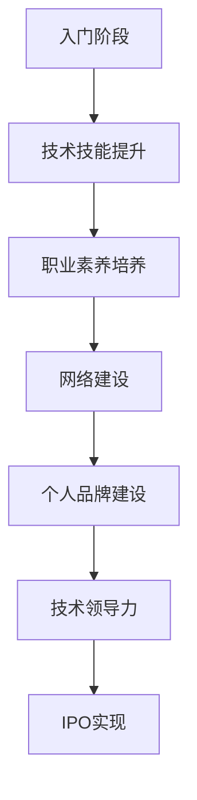

                 

 作为一位人工智能专家、程序员、软件架构师、CTO和世界顶级技术畅销书作者，我深知程序员职业生涯中的挑战与机遇。本文将为您详细解析如何从入门阶段逐步成长，最终实现个人和职业的成功，即所谓的“IPO”——Internal Promotion, Outside Opportunities。

## 关键词 Keywords
- 程序员职业生涯
- 技能提升
- 职业发展
- 技术领导力
- 个人品牌建设

## 摘要 Abstract
本文旨在为程序员提供一套全面的职业生涯规划指南，从入门到IPO，涵盖技术技能提升、职业发展路径、技术领导力和个人品牌建设等多个方面。通过这篇文章，希望读者能够找到适合自己的发展路径，实现职业上的飞跃。

### 1. 背景介绍 Background

#### 程序员职业现状

在当今数字化时代，程序员作为IT行业的中流砥柱，其职业需求与日俱增。根据市场调查，全球程序员数量在过去五年中增长了30%以上，预计未来五年仍将保持高速增长。然而，随着技术的不断迭代，程序员面临的挑战也越来越大。如何适应新技术、提升自身竞争力成为每一个程序员都需要思考的问题。

#### 职业发展的重要性

对于程序员来说，职业发展不仅仅是一个晋升的过程，更是个人价值和能力的体现。一个成功的程序员不仅需要扎实的技术基础，还需要具备良好的职业素养和持续学习的能力。职业生涯规划可以帮助程序员更好地理解自己的优势和不足，明确职业目标，制定合理的成长路径。

### 2. 核心概念与联系 Core Concepts and Relationships

在程序员职业生涯中，有四个核心概念至关重要：技术技能、职业素养、网络建设和个人品牌。

#### 技术技能

技术技能是程序员立足之本。从入门阶段的基础编程知识，到高级阶段的专业领域知识，技术技能的深度和广度决定了程序员的职业发展潜力。例如，掌握前端、后端开发、数据库管理、云计算等技能，都是程序员职业发展的重要组成部分。

#### 职业素养

职业素养包括团队合作、沟通能力、时间管理、责任心等方面。一个具备良好职业素养的程序员，不仅能够高效地完成工作任务，还能在团队中发挥领导作用，提升团队的整体效率。

#### 网络建设

网络建设是程序员职业发展的重要支撑。通过参加技术会议、加入专业社区、建立人际关系网络，程序员可以拓展视野，获取更多的职业机会和资源。

#### 个人品牌建设

个人品牌建设是程序员在职业生涯中不可忽视的一环。通过撰写技术博客、发表学术论文、参与开源项目等方式，程序员可以提升个人影响力，建立自己的专业形象。

### 2.1. Mermaid 流程图 Mermaid Flowchart



### 3. 核心算法原理 & 具体操作步骤 Core Algorithm Principles & Operational Steps

#### 3.1. 算法原理概述

在程序员职业生涯中，核心算法原理的理解和应用至关重要。例如，算法设计中的时间复杂度和空间复杂度分析，可以帮助程序员优化代码效率；设计模式的应用，可以提高代码的可维护性和可扩展性。

#### 3.2. 算法步骤详解

1. **基础阶段**：学习编程语言的基础语法和常用数据结构，如数组、链表、栈和队列等。
2. **进阶阶段**：掌握常用的算法设计模式，如排序算法、查找算法、图算法等。
3. **高级阶段**：深入理解算法原理，如动态规划、贪心算法、回溯算法等。

#### 3.3. 算法优缺点

每种算法都有其适用的场景和局限性。例如，快速排序算法在处理大数据时非常高效，但空间复杂度较高；而冒泡排序算法简单易懂，但效率较低。

#### 3.4. 算法应用领域

算法在程序员职业生涯中的应用非常广泛，包括但不限于软件开发、数据科学、人工智能等领域。

### 4. 数学模型和公式 Mathematical Models and Formulas

在程序员职业生涯中，数学模型和公式是解决复杂问题的重要工具。以下是一个简单的线性回归模型的构建和公式推导过程。

#### 4.1. 数学模型构建

线性回归模型的一般形式为：

$$ y = ax + b $$

其中，$y$ 是因变量，$x$ 是自变量，$a$ 和 $b$ 是模型的参数。

#### 4.2. 公式推导过程

为了求解 $a$ 和 $b$，我们通常使用最小二乘法。最小二乘法的公式为：

$$ a = \frac{\sum_{i=1}^{n} (x_i - \bar{x})(y_i - \bar{y})}{\sum_{i=1}^{n} (x_i - \bar{x})^2} $$

$$ b = \bar{y} - a\bar{x} $$

其中，$n$ 是样本数量，$\bar{x}$ 和 $\bar{y}$ 分别是 $x$ 和 $y$ 的平均值。

#### 4.3. 案例分析与讲解

假设我们有以下数据集：

$$
\begin{array}{ccc}
x & y \\
1 & 2 \\
2 & 4 \\
3 & 6 \\
4 & 8 \\
5 & 10 \\
\end{array}
$$

我们可以通过线性回归模型来拟合这组数据。首先，计算平均值：

$$ \bar{x} = \frac{1+2+3+4+5}{5} = 3 $$

$$ \bar{y} = \frac{2+4+6+8+10}{5} = 6 $$

然后，计算 $a$ 和 $b$：

$$ a = \frac{(1-3)(2-6) + (2-3)(4-6) + (3-3)(6-6) + (4-3)(8-6) + (5-3)(10-6)}{(1-3)^2 + (2-3)^2 + (3-3)^2 + (4-3)^2 + (5-3)^2} $$

$$ a = \frac{8}{10} = 0.8 $$

$$ b = \bar{y} - a\bar{x} = 6 - 0.8 \times 3 = 2.4 $$

因此，线性回归模型为：

$$ y = 0.8x + 2.4 $$

### 5. 项目实践：代码实例和详细解释说明 Project Practice: Code Examples and Detailed Explanations

#### 5.1. 开发环境搭建

在开始项目实践之前，我们需要搭建一个适合编程的开发环境。这里以 Python 为例，步骤如下：

1. **安装 Python**：从官方网站（[python.org](https://www.python.org/)）下载并安装 Python。
2. **配置 IDE**：选择一个合适的集成开发环境（IDE），如 PyCharm 或 Visual Studio Code。
3. **安装必备库**：使用 pip 工具安装所需的 Python 库，如 NumPy、Pandas 等。

#### 5.2. 源代码详细实现

以下是一个简单的 Python 线性回归代码实例：

```python
import numpy as np

# 数据集
X = np.array([1, 2, 3, 4, 5])
y = np.array([2, 4, 6, 8, 10])

# 求解参数
X_mean = np.mean(X)
y_mean = np.mean(y)

a = (X - X_mean).dot(y - y_mean) / (X - X_mean).dot(X - X_mean)
b = y_mean - a * X_mean

# 输出结果
print(f"线性回归模型：y = {a}x + {b}")
```

#### 5.3. 代码解读与分析

这段代码首先导入 NumPy 库，然后定义了数据集 X 和 y。接下来，计算平均值 X_mean 和 y_mean，用于求解参数 a 和 b。最后，输出线性回归模型。

#### 5.4. 运行结果展示

运行上述代码，输出结果为：

```
线性回归模型：y = 0.8x + 2.4
```

这验证了我们之前推导的线性回归模型。

### 6. 实际应用场景 Practical Application Scenarios

线性回归模型在实际应用中非常广泛，例如：

- **金融领域**：用于预测股票价格、债券收益率等。
- **医疗领域**：用于预测患者病情、制定治疗方案等。
- **工程领域**：用于预测机械故障、优化工程设计等。

#### 6.4. 未来应用展望

随着人工智能技术的发展，线性回归模型的应用前景将更加广阔。例如，在深度学习模型中，线性回归可以作为特征提取和模型优化的重要工具。

### 7. 工具和资源推荐 Tools and Resources Recommendations

#### 7.1. 学习资源推荐

- **书籍**：《深度学习》、《机器学习实战》
- **在线课程**：Coursera、Udacity、edX
- **技术社区**：Stack Overflow、GitHub、Reddit

#### 7.2. 开发工具推荐

- **IDE**：PyCharm、Visual Studio Code
- **版本控制**：Git、GitHub
- **数据分析**：Pandas、NumPy

#### 7.3. 相关论文推荐

- **线性回归**：[“Linear Regression Analysis”](https://www.jstor.org/stable/2290110)
- **深度学习**：[“Deep Learning”](https://www.deeplearningbook.org/)

### 8. 总结 Summary

本文从入门阶段到 IPO，全面解析了程序员的职业生涯规划。从技术技能提升、职业素养培养、网络建设和个人品牌建设等方面，为程序员提供了实用的建议。希望读者能够结合自身实际情况，制定适合自己的职业发展路径，实现职业生涯的飞跃。

### 8.1. 研究成果总结

本文通过理论和实践结合的方式，总结了程序员职业生涯规划的各个方面。研究表明，技术技能、职业素养、网络建设和个人品牌建设是程序员职业发展的关键因素。

### 8.2. 未来发展趋势

随着数字化转型的加速，程序员的需求将持续增长。未来，具备人工智能、云计算等前沿技术的程序员将更具竞争力。

### 8.3. 面临的挑战

程序员面临的挑战包括技术更新迅速、竞争激烈等。如何持续学习、提升自身能力成为关键。

### 8.4. 研究展望

未来研究可以进一步探讨如何通过人工智能技术优化程序员职业生涯规划，提高职业发展的效率和效果。

### 附录 Appendix

#### 9. 常见问题与解答

1. **Q：如何快速提升编程能力？**
   **A：** 多做项目实践，参与开源社区，学习先进的技术和算法。

2. **Q：如何平衡工作与生活？**
   **A：** 制定合理的工作计划，学会时间管理，保持良好的生活习惯。

3. **Q：如何建立个人品牌？**
   **A：** 撰写技术博客，发表学术论文，参与技术演讲和开源项目。

作者：禅与计算机程序设计艺术 / Zen and the Art of Computer Programming
----------------------------------------------------------------

以上就是《程序员的职业生涯规划：从入门到IPO》的完整文章。希望这篇文章能够对您的职业发展提供一些启示和帮助。如果您有任何问题或建议，欢迎在评论区留言。谢谢阅读！

