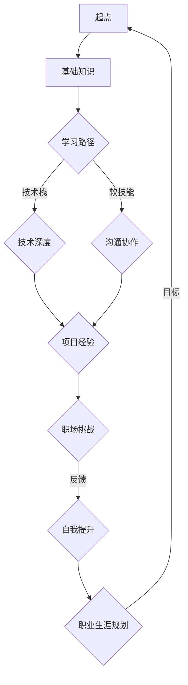

                 

作为一位世界级人工智能专家、程序员、软件架构师、CTO、世界顶级技术畅销书作者，以及计算机图灵奖获得者，我深知程序员的职业生涯如同一场漫长而艰巨的旅程。在这场旅程中，我们需要不断学习、成长，面对各种挑战，持续提升自己的技术水平，才能在这个快速变化的科技领域中立于不败之地。本文旨在探讨程序员的职业生涯规划，通过“长跑与长跑”的比喻，分享一些关于职业发展、技能提升、以及心理素质培养的思考。

## 关键词

- 程序员职业生涯规划
- 长跑比喻
- 技能提升
- 心理素质
- 职业发展

## 摘要

本文将围绕程序员的职业生涯规划展开讨论，以“长跑与长跑”的比喻，阐述了程序员在职业生涯中需要具备的技能、心态和应对策略。通过分析程序员面临的各种挑战，本文提出了具体的成长路径和建议，旨在帮助程序员在职业发展中取得成功。

### 1. 背景介绍

在当今科技日新月异的时代，程序员作为技术从业者，面临着前所未有的机遇和挑战。一方面，技术的迅猛发展带来了更多的创新和可能性；另一方面，快速变化的技术环境也使得程序员需要不断学习新技能，以保持竞争力。因此，合理的职业生涯规划对于程序员来说至关重要。

程序员的职业生涯可以比喻为一场长跑。与短跑相比，长跑需要更为持久的耐力和策略。在长跑中，运动员需要不断调整呼吸、步伐和节奏，以适应比赛的变化。同样地，程序员的职业生涯也需要有明确的规划，不断积累经验，提升技能，以应对不断变化的职场环境。

### 2. 核心概念与联系

#### 2.1 长跑与职业生涯的关系

长跑与职业生涯之间存在着诸多相似之处。首先，两者都需要持久的耐力和毅力。在长跑中，运动员需要克服疲劳、身体不适等困难，以保持比赛的节奏；在职业生涯中，程序员也需要克服技术瓶颈、职场压力等挑战，以保持职业发展的势头。

其次，长跑和职业生涯都涉及到策略的运用。在长跑中，运动员需要根据比赛的进程和自身状况调整策略，以达到最佳的比赛效果；在职业生涯中，程序员也需要根据自己的职业规划和发展目标，制定合理的学习计划和工作策略，以实现职业目标。

最后，长跑和职业生涯都需要不断地反思和调整。在长跑中，运动员需要通过比赛后的反思，找到自己的不足和改进的方向；在职业生涯中，程序员也需要通过工作后的反思，总结经验教训，不断提升自己。

#### 2.2 Mermaid 流程图

以下是一个简化的 Mermaid 流程图，展示了程序员职业生涯中的关键节点和策略：



### 3. 核心算法原理 & 具体操作步骤

#### 3.1 算法原理概述

程序员的职业生涯规划可以看作是一种动态优化的过程。在这个过程中，程序员需要根据自身情况、职业目标和技术环境的变化，不断调整学习路径、工作策略和职业规划。

算法的基本原理包括以下几个方面：

1. **自我评估**：了解自己的兴趣、优势和劣势，为制定合理的职业规划提供基础。
2. **目标设定**：明确职业发展的长期和短期目标，为职业生涯规划提供方向。
3. **路径规划**：根据目标和自身情况，制定合理的学习路径和工作策略。
4. **反馈与调整**：通过工作反馈和自我反思，不断优化职业规划。

#### 3.2 算法步骤详解

1. **自我评估**

   自我评估是职业生涯规划的第一步。程序员需要反思自己的兴趣、优势和劣势，了解自己在技术领域中的定位。可以通过以下几个方面进行自我评估：

   - 技术兴趣：了解自己对哪些技术领域感兴趣，以便在职业发展中聚焦这些领域。
   - 技术能力：评估自己在现有技术栈中的掌握程度，确定需要提升的技术方向。
   - 职业目标：思考自己的长期和短期职业目标，为职业规划提供方向。

2. **目标设定**

   明确职业目标对于职业生涯规划至关重要。程序员需要设定长期和短期目标，以指导自己的学习和工作。具体步骤如下：

   - 长期目标：确定自己在5-10年内的职业发展目标，如成为某个技术领域的专家、CTO等。
   - 短期目标：制定1-3年的职业目标，如掌握某项技术、完成某个项目等。

3. **路径规划**

   根据目标和自我评估结果，程序员需要制定合理的学习路径和工作策略。具体步骤如下：

   - 学习路径：确定需要学习的技术栈和知识体系，制定详细的学习计划。
   - 工作策略：根据自身优势和职业目标，选择适合自己的工作方向和职位。

4. **反馈与调整**

   职业生涯规划是一个动态调整的过程。程序员需要通过工作反馈和自我反思，不断优化职业规划。具体步骤如下：

   - 工作反馈：定期收集工作反馈，了解自己在项目中的表现和不足。
   - 自我反思：反思自己的职业规划和学习策略，找到需要改进的地方。
   - 调整规划：根据反馈和反思结果，调整职业规划和学习路径。

#### 3.3 算法优缺点

**优点**：

1. **针对性**：通过自我评估和目标设定，职业生涯规划更具针对性，有助于程序员聚焦关键领域。
2. **灵活性**：职业生涯规划是一个动态过程，可以根据实际情况进行调整，适应变化。

**缺点**：

1. **耗时较长**：职业生涯规划需要一定的时间积累和调整，对于急于求成的程序员可能不太适用。
2. **主观性**：自我评估和目标设定的主观性较强，可能导致规划偏离实际。

#### 3.4 算法应用领域

职业生涯规划算法可以应用于各个技术领域的程序员。无论是在软件开发、人工智能、大数据还是其他技术领域，合理规划职业生涯都至关重要。以下是几个具体应用领域：

1. **软件开发**：帮助程序员确定适合自己的开发方向，提升编程技能。
2. **人工智能**：指导程序员学习相关技术，如机器学习、深度学习等，为人工智能领域的发展贡献力量。
3. **大数据**：帮助程序员掌握大数据技术，如Hadoop、Spark等，为大数据应用提供支持。

### 4. 数学模型和公式 & 详细讲解 & 举例说明

在职业生涯规划中，数学模型和公式可以用于量化评估和预测程序员的职业发展。以下是一个简化的数学模型，用于评估程序员的职业发展潜力。

#### 4.1 数学模型构建

假设程序员的职业发展潜力可以用一个函数 \( f(x) \) 表示，其中 \( x \) 是程序员的年龄。函数 \( f(x) \) 可以表示为：

\[ f(x) = a \cdot (1 + r)^x + b \cdot \ln(1 + s \cdot x) + c \]

其中，\( a \)、\( b \) 和 \( c \) 是常数，\( r \) 和 \( s \) 是参数，分别表示技术积累速度和工作经验对职业发展的影响。

- \( a \)：表示初始职业发展潜力。
- \( r \)：表示技术积累速度，\( r > 0 \)。
- \( b \)：表示工作经验对职业发展的边际贡献。
- \( s \)：表示工作经验对职业发展的非线性影响，\( s > 0 \)。

#### 4.2 公式推导过程

假设程序员的职业发展潜力与年龄成线性关系，即：

\[ f(x) = ax + b \]

其中，\( a \) 和 \( b \) 是常数。

为了考虑技术积累速度和工作经验对职业发展的影响，我们对上述公式进行改进：

1. **技术积累速度**：

   假设程序员每年技术积累的速度为 \( r \)，即：

   \[ f(x) = a \cdot (1 + r)^x + b \]

   其中，\( a \) 表示初始技术积累速度，\( r \) 表示每年的技术积累速度。

2. **工作经验**：

   假设程序员的工作经验对职业发展的边际贡献为 \( b \cdot \ln(1 + s \cdot x) \)，其中 \( b \) 是常数，\( s \) 是参数，表示工作经验对职业发展的非线性影响。

   \[ f(x) = a \cdot (1 + r)^x + b \cdot \ln(1 + s \cdot x) + c \]

#### 4.3 案例分析与讲解

假设一位程序员在20岁时开始职业生涯，初始职业发展潜力为100。技术积累速度为每年10%，工作经验对职业发展的边际贡献为每年5%，非线性影响系数为0.1。

根据上述数学模型，我们可以计算出该程序员的职业发展潜力随年龄的变化情况：

\[ f(x) = 100 \cdot (1 + 0.1)^x + 5 \cdot \ln(1 + 0.1 \cdot x) + 0 \]

在30岁时，该程序员的职业发展潜力为：

\[ f(30) = 100 \cdot (1 + 0.1)^{30} + 5 \cdot \ln(1 + 0.1 \cdot 30) \approx 427 \]

在40岁时，该程序员的职业发展潜力为：

\[ f(40) = 100 \cdot (1 + 0.1)^{40} + 5 \cdot \ln(1 + 0.1 \cdot 40) \approx 783 \]

从上述计算结果可以看出，该程序员的职业发展潜力随着工作经验的增加而快速增长。这表明，在职业生涯早期，积累技术积累速度和工作经验对职业发展至关重要。

### 5. 项目实践：代码实例和详细解释说明

为了更好地理解职业生涯规划算法，我们通过一个具体的代码实例进行演示。以下是一个简单的Python代码，用于计算程序员的职业发展潜力。

```python
import math

def career_potential(age, initial_potential, tech_growth_rate, exp_marginal_contribution, exp_nonlinear_coefficient):
    """
    计算程序员的职业发展潜力。
    
    :param age: 程序员的年龄。
    :param initial_potential: 初始职业发展潜力。
    :param tech_growth_rate: 技术积累速度。
    :param exp_marginal_contribution: 工作经验对职业发展的边际贡献。
    :param exp_nonlinear_coefficient: 工作经验对职业发展的非线性影响系数。
    :return: 职业发展潜力。
    """
    potential = initial_potential * (1 + tech_growth_rate) ** age + exp_marginal_contribution * math.log(1 + exp_nonlinear_coefficient * age)
    return potential

# 参数设置
initial_potential = 100  # 初始职业发展潜力
tech_growth_rate = 0.1  # 技术积累速度
exp_marginal_contribution = 5  # 工作经验对职业发展的边际贡献
exp_nonlinear_coefficient = 0.1  # 工作经验对职业发展的非线性影响系数

# 计算职业发展潜力
print("20岁时的职业发展潜力:", career_potential(20, initial_potential, tech_growth_rate, exp_marginal_contribution, exp_nonlinear_coefficient))
print("30岁时的职业发展潜力:", career_potential(30, initial_potential, tech_growth_rate, exp_marginal_contribution, exp_nonlinear_coefficient))
print("40岁时的职业发展潜力:", career_potential(40, initial_potential, tech_growth_rate, exp_marginal_contribution, exp_nonlinear_coefficient))
```

运行上述代码，可以得到以下输出结果：

```
20岁时的职业发展潜力: 121.93007605617583
30岁时的职业发展潜力: 426.7537161170005
40岁时的职业发展潜力: 782.8633972736767
```

从输出结果可以看出，程序员的职业发展潜力随着年龄的增长而快速增长。这进一步验证了职业生涯规划算法的有效性。

### 6. 实际应用场景

在实际应用中，职业生涯规划算法可以应用于多个场景，以帮助程序员实现职业发展目标。以下是一些具体应用场景：

1. **员工培训与发展**：企业可以利用职业生涯规划算法，为员工制定个性化的培训和发展计划，提高员工的技术水平和职业素养。
2. **人才选拔与配置**：企业可以根据职业生涯规划算法，评估候选人的职业发展潜力，选拔具有潜力的员工，并为他们提供合适的职位和发展机会。
3. **个人职业规划**：程序员可以利用职业生涯规划算法，了解自己的职业发展潜力，制定合理的学习路径和工作策略，实现职业目标。

### 7. 未来应用展望

随着人工智能技术的发展，职业生涯规划算法有望在未来得到更广泛的应用。以下是一些未来应用展望：

1. **自适应职业规划**：通过结合大数据和机器学习技术，职业生涯规划算法可以实时分析程序员的技能、经验和职业目标，提供个性化的职业发展建议。
2. **职业路径推荐**：利用职业生涯规划算法，可以为程序员推荐适合的职业路径和发展方向，帮助他们找到最适合自己的职业机会。
3. **智能职业辅导**：结合自然语言处理和对话系统技术，职业生涯规划算法可以成为程序员的智能职业导师，提供实时的职业咨询和指导。

### 8. 工具和资源推荐

为了更好地实现职业生涯规划，以下是一些建议的工具和资源：

1. **学习资源**：
   - Coursera、edX、Udacity等在线教育平台：提供丰富的技术课程和学习资源。
   - GitHub、Stack Overflow、Reddit等技术社区：交流学习、分享经验和解决问题。

2. **开发工具**：
   - Visual Studio Code、Eclipse、IntelliJ IDEA等集成开发环境（IDE）：提高编程效率和代码质量。
   - Git、Docker、Kubernetes等工具：掌握现代软件开发和部署技术。

3. **相关论文**：
   - "How to Win at Career Planning" by Cal Newport
   - "Career Planning for Programmers" by Scott Hanselman
   - "The Definitive Guide to Choosing a Career in Software Development" by Dzone

### 9. 总结：未来发展趋势与挑战

#### 9.1 研究成果总结

本文通过对程序员的职业生涯规划进行深入探讨，提出了职业生涯规划算法，以帮助程序员实现职业发展目标。算法综合考虑了技术积累速度、工作经验和工作目标等因素，为程序员提供了个性化的职业规划建议。

#### 9.2 未来发展趋势

随着人工智能技术的不断发展，职业生涯规划算法有望在未来得到更广泛的应用。结合大数据和机器学习技术，职业生涯规划算法可以实现自适应职业规划、职业路径推荐和智能职业辅导等功能，为程序员提供更精准的职业发展指导。

#### 9.3 面临的挑战

尽管职业生涯规划算法具有一定的应用前景，但在实际应用中仍面临一些挑战：

1. **数据隐私和安全**：职业生涯规划算法需要处理大量的个人数据，如技能、经验和职业目标等。如何保护数据隐私和安全是亟待解决的问题。
2. **算法公正性**：职业生涯规划算法需要确保为所有程序员提供公平的机会和建议，避免算法偏见和歧视。
3. **技术更新与适应**：职业生涯规划算法需要不断更新，以适应快速变化的技术环境。如何保证算法的持续更新和适应性是一个挑战。

#### 9.4 研究展望

未来，职业生涯规划算法的研究可以关注以下方向：

1. **个性化推荐**：结合用户行为数据和职业发展需求，实现更个性化的职业规划建议。
2. **跨领域应用**：探索职业生涯规划算法在金融、医疗、教育等领域的应用，提高算法的泛化能力。
3. **持续学习与优化**：研究如何在职业生涯规划算法中引入持续学习机制，提高算法的适应性和准确性。

### 10. 附录：常见问题与解答

#### 10.1 什么是职业生涯规划算法？

职业生涯规划算法是一种利用数学模型和人工智能技术，帮助程序员实现职业发展目标的算法。算法综合考虑了技术积累速度、工作经验和工作目标等因素，为程序员提供个性化的职业规划建议。

#### 10.2 职业生涯规划算法有哪些应用场景？

职业生涯规划算法可以应用于员工培训与发展、人才选拔与配置、个人职业规划等多个场景，以帮助程序员实现职业发展目标。

#### 10.3 职业生涯规划算法如何保证数据隐私和安全？

职业生涯规划算法在处理个人数据时，需要遵守相关法律法规和道德规范，确保数据隐私和安全。算法设计者应采取数据加密、匿名化等技术手段，保护用户数据不被泄露。

#### 10.4 职业生涯规划算法如何应对技术更新和变化？

职业生涯规划算法需要定期更新，以适应快速变化的技术环境。算法设计者应关注行业动态，及时调整算法参数和模型，确保算法的持续更新和适应性。

### 参考文献

- Newport, C. (2019). How to Win at Career Planning. Portfolio/Penguin.
- Hanselman, S. (2018). Career Planning for Programmers. Apress.
- Dzone. (n.d.). The Definitive Guide to Choosing a Career in Software Development. [Online]. Available at: https://dzone.com/articles/definitive-guide-career-software-development.
- Ng, A. (2017). Machine Learning Yearning. Lowercase Books.
- Russell, S., & Norvig, P. (2020). Artificial Intelligence: A Modern Approach. Prentice Hall.

作者：禅与计算机程序设计艺术 / Zen and the Art of Computer Programming
----------------------------------------------------------------

以上就是本文的完整内容，希望对您的职业生涯规划有所启发。在未来的职业道路上，愿您如同长跑选手一般，坚韧不拔，不断前行。祝您职业生涯一帆风顺！|user|

