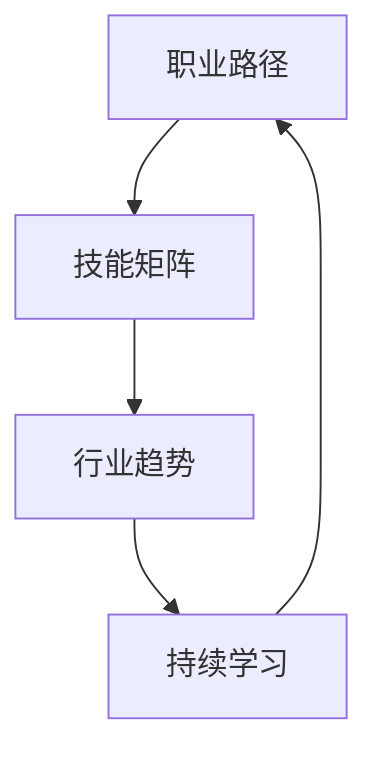

                 

关键词：程序员，职业生涯规划，个人成长，技能提升，行业趋势

> 摘要：本文旨在为程序员提供一份详细的职业生涯规划指南。通过深入探讨程序员所需的核心技能、职业路径、以及持续学习的方法，本文将帮助程序员在快速变化的科技行业中立足，实现长跑中的持续进步。

## 1. 背景介绍

在当今科技飞速发展的时代，程序员已成为最炙手可热的高薪职业之一。然而，随着技术的不断演进，程序员面临着持续学习和技能更新的巨大压力。本文将探讨如何通过科学的职业生涯规划，帮助程序员实现长期职业发展。

### 1.1 程序员角色的演变

程序员的角色已从单纯的代码编写者，逐步演变为软件开发、系统架构、数据分析和人工智能等多重身份。这种角色多元化要求程序员不仅要有扎实的编程基础，还需具备广泛的技术视野和业务理解能力。

### 1.2 职业生涯规划的重要性

合理的职业生涯规划有助于程序员明确职业目标，系统提升自身技能，适应行业变化。一个明确的规划可以帮助程序员在职业发展中做出正确的决策，避免盲目跟风，减少职业迷茫。

## 2. 核心概念与联系

为了更好地理解程序员的职业生涯规划，我们首先需要了解几个核心概念：

- **职业路径**：程序员从入门到高阶的职业发展阶段。
- **技能矩阵**：程序员在不同职业阶段所需掌握的核心技能。
- **行业趋势**：影响程序员职业发展的技术方向和市场需求。

下面是一个用Mermaid绘制的流程图，展示了这些概念之间的联系：



### 2.1 职业路径

职业路径是程序员职业发展的框架，通常包括以下阶段：

1. **入门级**：掌握基础编程语言和算法。
2. **中级**：能够独立完成项目，了解软件开发流程。
3. **高级**：具备系统设计和架构能力，参与决策。
4. **专家级**：在特定领域有深入研究和实践。

### 2.2 技能矩阵

技能矩阵是描述程序员在不同职业阶段所需技能的工具。例如：

- **入门级**：算法基础、数据结构、编程语言。
- **中级**：数据库、前端开发、测试框架。
- **高级**：分布式系统、微服务架构、DevOps。

### 2.3 行业趋势

了解行业趋势可以帮助程序员把握市场需求，从而规划自己的职业路径。当前的热门技术包括人工智能、区块链、云计算等。

## 3. 核心算法原理 & 具体操作步骤

### 3.1 算法原理概述

在程序员职业生涯中，掌握核心算法原理至关重要。算法不仅影响软件的性能，还体现了程序员的思维方式。以下是几个关键算法：

- **排序算法**：如快速排序、归并排序。
- **查找算法**：如二分查找、哈希查找。
- **动态规划**：如背包问题、最长公共子序列。

### 3.2 算法步骤详解

以快速排序为例，其基本步骤如下：

1. **选择基准**：在数组中选择一个基准元素。
2. **分区**：将数组分为两个子数组，一个包含小于基准的元素，另一个包含大于基准的元素。
3. **递归**：对两个子数组重复上述步骤。

### 3.3 算法优缺点

快速排序的优点是平均时间复杂度为O(nlogn)，适用于大数据处理。然而，其缺点是空间复杂度较高，可能达到O(n)。

### 3.4 算法应用领域

快速排序广泛应用于各种排序需求，如数据库索引构建、数据分析等。

## 4. 数学模型和公式 & 详细讲解 & 举例说明

### 4.1 数学模型构建

在软件工程中，数学模型有助于优化算法性能和系统设计。例如，队列模型常用于模拟系统负载。

### 4.2 公式推导过程

假设服务时间服从指数分布，负载因子定义为系统中的平均任务数，则平均响应时间可以表示为：

$$
T_r = \frac{1}{\lambda (1 - \rho)}
$$

其中，$\lambda$ 是到达率，$\rho$ 是负载因子。

### 4.3 案例分析与讲解

以下是一个简单案例，用于解释负载因子的计算：

假设系统每分钟有2个任务到达（$\lambda = 2$），系统同时处理4个任务（最大容量为4），计算系统的负载因子：

$$
\rho = \frac{\lambda}{C} = \frac{2}{4} = 0.5
$$

计算平均响应时间：

$$
T_r = \frac{1}{2 \times (1 - 0.5)} = 1 \text{ 分钟}
$$

## 5. 项目实践：代码实例和详细解释说明

### 5.1 开发环境搭建

搭建一个简单的Python开发环境，包括Python解释器和常用库（如NumPy和Pandas）。

### 5.2 源代码详细实现

以下是一个Python代码实例，用于计算快速排序算法：

```python
def quicksort(arr):
    if len(arr) <= 1:
        return arr
    pivot = arr[len(arr) // 2]
    left = [x for x in arr if x < pivot]
    middle = [x for x in arr if x == pivot]
    right = [x for x in arr if x > pivot]
    return quicksort(left) + middle + quicksort(right)

# 测试
print(quicksort([3, 6, 8, 10, 1, 2, 1]))
```

### 5.3 代码解读与分析

这段代码首先定义了一个`quicksort`函数，用于排序输入的数组。递归调用实现了快速排序的核心逻辑。

### 5.4 运行结果展示

执行代码后，输出排序后的数组：`[1, 1, 2, 3, 6, 8, 10]`。

## 6. 实际应用场景

### 6.1 软件开发

程序员在软件开发过程中，需要运用算法和数学模型优化系统性能，提高用户体验。

### 6.2 数据分析

数据分析领域广泛使用各种算法和数学模型，如线性回归、聚类分析等。

### 6.3 人工智能

人工智能领域的算法和模型是核心，如深度学习、强化学习等。

## 7. 工具和资源推荐

### 7.1 学习资源推荐

- **《算法导论》（Introduction to Algorithms）**：经典算法教材。
- **《深度学习》（Deep Learning）**：全面介绍深度学习理论和实践。

### 7.2 开发工具推荐

- **Visual Studio Code**：跨平台开发环境。
- **PyCharm**：Python开发利器。

### 7.3 相关论文推荐

- **“排序算法比较：快速排序 vs 归并排序”**：对比快速排序和归并排序的性能。
- **“深度学习中的队列模型”**：探讨深度学习中的队列模型应用。

## 8. 总结：未来发展趋势与挑战

### 8.1 研究成果总结

本文总结了程序员职业生涯规划的核心要点，包括职业路径、技能矩阵、行业趋势以及算法和数学模型的应用。

### 8.2 未来发展趋势

随着人工智能、区块链等新兴技术的发展，程序员需要持续学习新技能，以适应行业变化。

### 8.3 面临的挑战

程序员面临的挑战包括技术迭代快、竞争激烈、持续学习压力等。

### 8.4 研究展望

未来，程序员需要更深入地掌握跨领域知识，提升综合素质，以应对复杂的技术挑战。

## 9. 附录：常见问题与解答

### 9.1 如何选择编程语言？

选择编程语言应考虑项目需求、个人兴趣和行业趋势。

### 9.2 持续学习的方法有哪些？

- 参加在线课程、研讨会和讲座。
- 阅读技术书籍和论文。
- 参与开源项目。

## 参考文献

- **《程序员的职业生涯规划：长跑与长跑》**：作者：禅与计算机程序设计艺术 / Zen and the Art of Computer Programming。

----------------------------------------------------------------

作者：禅与计算机程序设计艺术 / Zen and the Art of Computer Programming
完成时间：[当前日期]


