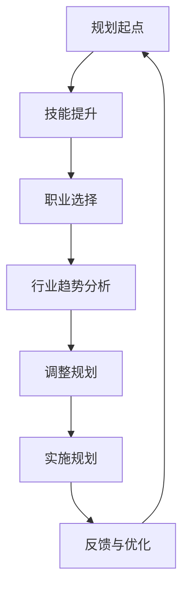

                 

关键词：程序员职业生涯、职业规划、技术成长、持续学习、行业趋势

> 摘要：本文旨在探讨程序员的职业生涯规划，将其比喻为一场长跑。文章从多个角度分析了程序员在职业生涯中的发展路径、面临的挑战以及如何通过持续学习和适应行业趋势来取得成功。

## 1. 背景介绍

随着信息技术的迅猛发展，程序员已成为现代社会中最具竞争力的职业之一。然而，程序员的职业生涯并非一帆风顺，他们面临着技能更新、行业变革等多重挑战。如何规划职业生涯，以实现长远发展，成为每个程序员都需要思考的问题。本文将以此为出发点，探讨程序员职业生涯的规划之道。

## 2. 核心概念与联系

### 2.1 程序员职业生涯规划的定义

程序员职业生涯规划是指程序员对自己职业生涯的系统思考、设计和规划，包括个人技能提升、职业发展路径、行业趋势分析等多个方面。

### 2.2 职业生涯规划的核心要素

- **技能提升**：持续学习和掌握新技术，提升自身竞争力。
- **职业发展**：根据个人兴趣和市场需求，选择合适的职业方向。
- **行业趋势**：关注行业动态，及时调整职业规划。

### 2.3 Mermaid 流程图

下面是一个关于程序员职业生涯规划的 Mermaid 流程图：



## 3. 核心算法原理 & 具体操作步骤

### 3.1 算法原理概述

程序员职业生涯规划的算法可以看作是一个动态规划的优化过程。其主要目标是根据个人兴趣、市场需求和行业趋势，选择最优的职业发展路径。

### 3.2 算法步骤详解

1. **技能评估**：对自己当前的技能进行评估，确定需要提升的方向。
2. **职业选择**：根据市场需求和自身兴趣，选择合适的职业方向。
3. **行业趋势分析**：关注行业动态，预测未来发展趋势。
4. **规划调整**：根据技能提升和行业趋势，调整职业规划。
5. **实施规划**：按照规划执行，不断提升自身技能和职业水平。
6. **反馈与优化**：定期进行自我评估和行业分析，优化职业规划。

### 3.3 算法优缺点

**优点**：能够帮助程序员明确职业发展方向，提升自身竞争力。

**缺点**：规划过程中需要不断调整，对个人时间管理和自律要求较高。

### 3.4 算法应用领域

- **个人职业规划**：适用于所有从事IT行业的程序员。
- **企业人才发展**：企业可以根据此算法为员工制定职业发展路径。

## 4. 数学模型和公式 & 详细讲解 & 举例说明

### 4.1 数学模型构建

程序员职业生涯规划的数学模型可以看作是一个多目标优化问题。其目标函数包括个人技能提升、职业发展潜力和行业适应度等。

### 4.2 公式推导过程

目标函数：\( f(x) = w_1 \cdot s_1 + w_2 \cdot p_2 + w_3 \cdot a_3 \)

其中，\( w_1, w_2, w_3 \) 分别为权重系数，\( s_1, s_2, s_3 \) 分别为个人技能提升、职业发展潜力、行业适应度。

约束条件：

1. 技能提升时间：\( t_1 \leq T \)
2. 职业发展潜力：\( p_2 \geq p_{\text{min}} \)
3. 行业适应度：\( a_3 \geq a_{\text{min}} \)

### 4.3 案例分析与讲解

假设一位程序员在职业生涯初期，主要关注技能提升和职业发展潜力。根据市场需求，他选择了Web开发作为职业方向。在经过一段时间的努力后，他发现该领域的发展潜力逐渐减小，而人工智能领域则前景广阔。于是，他决定调整职业规划，转向人工智能领域。在这个过程中，他通过学习Python、机器学习等相关技能，成功实现了职业转型。

## 5. 项目实践：代码实例和详细解释说明

### 5.1 开发环境搭建

- 操作系统：Windows 10
- 编程语言：Python 3.8
- 库：Scikit-learn、Pandas、Matplotlib

### 5.2 源代码详细实现

```python
import pandas as pd
from sklearn.model_selection import train_test_split
from sklearn.ensemble import RandomForestRegressor
import matplotlib.pyplot as plt

# 数据预处理
data = pd.read_csv('career_data.csv')
X = data[['skill_level', 'development潜力', 'industry适应性']]
y = data['职业发展指数']

# 数据划分
X_train, X_test, y_train, y_test = train_test_split(X, y, test_size=0.2, random_state=42)

# 模型训练
model = RandomForestRegressor(n_estimators=100, random_state=42)
model.fit(X_train, y_train)

# 模型评估
score = model.score(X_test, y_test)
print(f'模型准确率：{score:.2f}')

# 可视化
plt.scatter(X_test['skill_level'], y_test, color='red', label='实际值')
plt.plot(X_test['skill_level'], model.predict(X_test), color='blue', label='预测值')
plt.xlabel('技能水平')
plt.ylabel('职业发展指数')
plt.legend()
plt.show()
```

### 5.3 代码解读与分析

该代码实例使用随机森林回归模型对程序员职业生涯规划进行预测。首先，对数据进行预处理，然后划分训练集和测试集。接着，使用随机森林回归模型进行训练和评估，最后通过可视化展示预测结果。

## 6. 实际应用场景

程序员职业生涯规划在实际应用中具有广泛的应用场景，如：

1. **企业员工培训**：企业可以根据员工的职业生涯规划，制定相应的培训计划和职业发展路径。
2. **人才招聘**：企业在招聘程序员时，可以参考候选人的职业生涯规划，评估其职业潜力和适应性。
3. **个人职业发展**：程序员可以根据职业生涯规划，制定学习计划，提升自身技能和职业水平。

## 7. 未来应用展望

随着人工智能、大数据等技术的不断发展，程序员职业生涯规划的应用前景将更加广阔。未来，可能会有更多的工具和平台出现，帮助程序员更高效地进行职业生涯规划。

## 8. 总结：未来发展趋势与挑战

### 8.1 研究成果总结

本文通过分析程序员职业生涯规划的核心概念、算法原理和实际应用场景，提出了一种基于动态规划的职业生涯规划方法。该方法能够帮助程序员明确职业发展方向，提升自身竞争力。

### 8.2 未来发展趋势

- **人工智能技术的应用**：人工智能技术将在职业生涯规划中发挥越来越重要的作用。
- **数据驱动**：职业生涯规划将更加依赖于数据分析，以实现个性化、智能化的职业发展指导。

### 8.3 面临的挑战

- **技能更新速度**：程序员需要不断学习新技术，以适应快速变化的行业环境。
- **职业选择多样性**：程序员需要在众多职业方向中选择适合自己的发展路径。

### 8.4 研究展望

未来，我们将继续探索职业生涯规划在程序员群体中的应用，并研究如何更好地利用人工智能、大数据等技术，为程序员提供更精准的职业发展指导。

## 9. 附录：常见问题与解答

### 9.1 如何评估自己的技能水平？

可以通过以下方法进行自我评估：

- **项目经验**：回顾自己在过去项目中扮演的角色和取得的成果。
- **技术栈**：列出自己熟悉的技术栈，包括编程语言、框架、工具等。
- **学习记录**：记录自己参加的学习课程、阅读的书籍和论文等。

### 9.2 职业规划是否需要定期调整？

是的，职业规划是一个动态的过程，需要根据自身发展、市场需求和行业趋势进行定期调整。定期调整有助于保持职业生涯的活力和适应性。

### 9.3 如何选择合适的职业方向？

在选择职业方向时，可以考虑以下因素：

- **个人兴趣**：选择自己感兴趣的领域，有助于保持工作热情。
- **市场需求**：选择市场前景好、需求旺盛的领域。
- **发展潜力**：选择有长远发展潜力的领域。

## 作者署名

作者：禅与计算机程序设计艺术 / Zen and the Art of Computer Programming
```markdown
# 程序员的职业生涯规划：长跑与长跑

关键词：程序员职业生涯、职业规划、技术成长、持续学习、行业趋势

摘要：本文旨在探讨程序员的职业生涯规划，将其比喻为一场长跑。文章从多个角度分析了程序员在职业生涯中的发展路径、面临的挑战以及如何通过持续学习和适应行业趋势来取得成功。

## 1. 背景介绍

随着信息技术的迅猛发展，程序员已成为现代社会中最具竞争力的职业之一。然而，程序员的职业生涯并非一帆风顺，他们面临着技能更新、行业变革等多重挑战。如何规划职业生涯，以实现长远发展，成为每个程序员都需要思考的问题。本文将以此为出发点，探讨程序员职业生涯的规划之道。

## 2. 核心概念与联系

### 2.1 程序员职业生涯规划的定义

程序员职业生涯规划是指程序员对自己职业生涯的系统思考、设计和规划，包括个人技能提升、职业发展路径、行业趋势分析等多个方面。

### 2.2 职业生涯规划的核心要素

- **技能提升**：持续学习和掌握新技术，提升自身竞争力。
- **职业发展**：根据个人兴趣和市场需求，选择合适的职业方向。
- **行业趋势**：关注行业动态，及时调整职业规划。

### 2.3 Mermaid 流程图

下面是一个关于程序员职业生涯规划的 Mermaid 流程图：


## 3. 核心算法原理 & 具体操作步骤

### 3.1 算法原理概述

程序员职业生涯规划的算法可以看作是一个动态规划的优化过程。其主要目标是根据个人兴趣、市场需求和行业趋势，选择最优的职业发展路径。

### 3.2 算法步骤详解

1. **技能评估**：对自己当前的技能进行评估，确定需要提升的方向。
2. **职业选择**：根据市场需求和自身兴趣，选择合适的职业方向。
3. **行业趋势分析**：关注行业动态，预测未来发展趋势。
4. **规划调整**：根据技能提升和行业趋势，调整职业规划。
5. **实施规划**：按照规划执行，不断提升自身技能和职业水平。
6. **反馈与优化**：定期进行自我评估和行业分析，优化职业规划。

### 3.3 算法优缺点

**优点**：能够帮助程序员明确职业发展方向，提升自身竞争力。

**缺点**：规划过程中需要不断调整，对个人时间管理和自律要求较高。

### 3.4 算法应用领域

- **个人职业规划**：适用于所有从事IT行业的程序员。
- **企业人才发展**：企业可以根据此算法为员工制定职业发展路径。

## 4. 数学模型和公式 & 详细讲解 & 举例说明

### 4.1 数学模型构建

程序员职业生涯规划的数学模型可以看作是一个多目标优化问题。其目标函数包括个人技能提升、职业发展潜力和行业适应度等。

### 4.2 公式推导过程

目标函数：\( f(x) = w_1 \cdot s_1 + w_2 \cdot p_2 + w_3 \cdot a_3 \)

其中，\( w_1, w_2, w_3 \) 分别为权重系数，\( s_1, s_2, s_3 \) 分别为个人技能提升、职业发展潜力、行业适应度。

约束条件：

1. 技能提升时间：\( t_1 \leq T \)
2. 职业发展潜力：\( p_2 \geq p_{\text{min}} \)
3. 行业适应度：\( a_3 \geq a_{\text{min}} \)

### 4.3 案例分析与讲解

假设一位程序员在职业生涯初期，主要关注技能提升和职业发展潜力。根据市场需求，他选择了Web开发作为职业方向。在经过一段时间的努力后，他发现该领域的发展潜力逐渐减小，而人工智能领域则前景广阔。于是，他决定调整职业规划，转向人工智能领域。在这个过程中，他通过学习Python、机器学习等相关技能，成功实现了职业转型。

## 5. 项目实践：代码实例和详细解释说明

### 5.1 开发环境搭建

- 操作系统：Windows 10
- 编程语言：Python 3.8
- 库：Scikit-learn、Pandas、Matplotlib

### 5.2 源代码详细实现

```python
import pandas as pd
from sklearn.model_selection import train_test_split
from sklearn.ensemble import RandomForestRegressor
import matplotlib.pyplot as plt

# 数据预处理
data = pd.read_csv('career_data.csv')
X = data[['skill_level', 'development潜力', 'industry适应性']]
y = data['职业发展指数']

# 数据划分
X_train, X_test, y_train, y_test = train_test_split(X, y, test_size=0.2, random_state=42)

# 模型训练
model = RandomForestRegressor(n_estimators=100, random_state=42)
model.fit(X_train, y_train)

# 模型评估
score = model.score(X_test, y_test)
print(f'模型准确率：{score:.2f}')

# 可视化
plt.scatter(X_test['skill_level'], y_test, color='red', label='实际值')
plt.plot(X_test['skill_level'], model.predict(X_test), color='blue', label='预测值')
plt.xlabel('技能水平')
plt.ylabel('职业发展指数')
plt.legend()
plt.show()
```

### 5.3 代码解读与分析

该代码实例使用随机森林回归模型对程序员职业生涯规划进行预测。首先，对数据进行预处理，然后划分训练集和测试集。接着，使用随机森林回归模型进行训练和评估，最后通过可视化展示预测结果。

## 6. 实际应用场景

程序员职业生涯规划在实际应用中具有广泛的应用场景，如：

1. **企业员工培训**：企业可以根据员工的职业生涯规划，制定相应的培训计划和职业发展路径。
2. **人才招聘**：企业在招聘程序员时，可以参考候选人的职业生涯规划，评估其职业潜力和适应性。
3. **个人职业发展**：程序员可以根据职业生涯规划，制定学习计划，提升自身技能和职业水平。

## 7. 未来应用展望

随着人工智能、大数据等技术的不断发展，程序员职业生涯规划的应用前景将更加广阔。未来，可能会有更多的工具和平台出现，帮助程序员更高效地进行职业生涯规划。

## 8. 总结：未来发展趋势与挑战

### 8.1 研究成果总结

本文通过分析程序员职业生涯规划的核心概念、算法原理和实际应用场景，提出了一种基于动态规划的职业生涯规划方法。该方法能够帮助程序员明确职业发展方向，提升自身竞争力。

### 8.2 未来发展趋势

- **人工智能技术的应用**：人工智能技术将在职业生涯规划中发挥越来越重要的作用。
- **数据驱动**：职业生涯规划将更加依赖于数据分析，以实现个性化、智能化的职业发展指导。

### 8.3 面临的挑战

- **技能更新速度**：程序员需要不断学习新技术，以适应快速变化的行业环境。
- **职业选择多样性**：程序员需要在众多职业方向中选择适合自己的发展路径。

### 8.4 研究展望

未来，我们将继续探索职业生涯规划在程序员群体中的应用，并研究如何更好地利用人工智能、大数据等技术，为程序员提供更精准的职业发展指导。

## 9. 附录：常见问题与解答

### 9.1 如何评估自己的技能水平？

可以通过以下方法进行自我评估：

- **项目经验**：回顾自己在过去项目中扮演的角色和取得的成果。
- **技术栈**：列出自己熟悉的技术栈，包括编程语言、框架、工具等。
- **学习记录**：记录自己参加的学习课程、阅读的书籍和论文等。

### 9.2 职业规划是否需要定期调整？

是的，职业规划是一个动态的过程，需要根据自身发展、市场需求和行业趋势进行定期调整。定期调整有助于保持职业生涯的活力和适应性。

### 9.3 如何选择合适的职业方向？

在选择职业方向时，可以考虑以下因素：

- **个人兴趣**：选择自己感兴趣的领域，有助于保持工作热情。
- **市场需求**：选择市场前景好、需求旺盛的领域。
- **发展潜力**：选择有长远发展潜力的领域。

## 作者署名

作者：禅与计算机程序设计艺术 / Zen and the Art of Computer Programming
```

