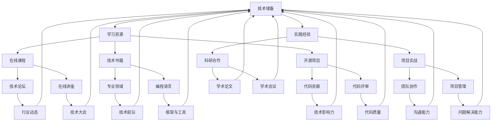
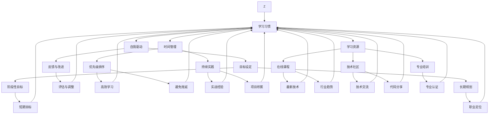
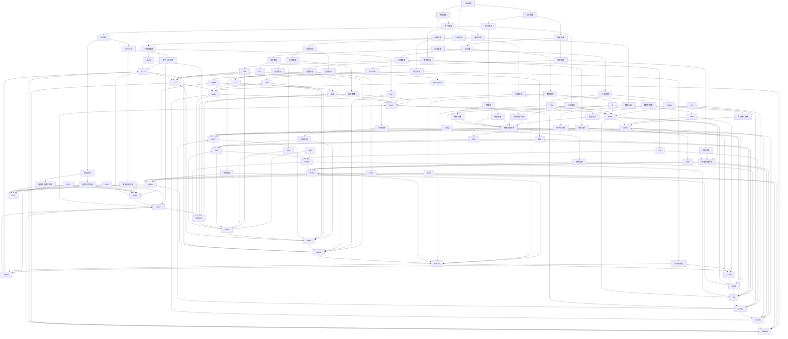

                 

关键词：程序员、职业生涯、规划、技能提升、持续学习

> 摘要：本文旨在为程序员提供一个长跑式的职业生涯规划指南。通过剖析程序员职业发展的核心要素，包括技能提升、持续学习和行业趋势，帮助程序员在技术不断变革的浪潮中找到自己的定位，实现个人成长与职业发展的双赢。

## 1. 背景介绍

在数字化时代，程序员作为科技创新的重要推动者，其职业发展备受关注。然而，技术领域的快速变革也使得程序员面临着巨大的挑战。如何在这个高速发展的行业中保持竞争力，实现职业生涯的可持续发展，成为每位程序员都需要深入思考的问题。

本文将结合程序员的职业特点，从技能提升、持续学习和行业趋势三个方面，提供一个长跑式的职业生涯规划指南。通过这个规划，程序员可以明确自己的职业目标，不断提升自身技能，适应行业变化，从而在职业生涯中取得成功。

### 1.1 程序员职业特点

程序员的职业特点主要体现在以下几个方面：

- 技术迭代迅速：编程语言和框架不断更新，新的技术和工具层出不穷，程序员需要持续学习，以跟上技术发展的步伐。
- 知识深度要求高：编程不仅需要掌握基础知识，还需要深入了解特定领域的细节和实现方法，这对程序员的科研能力和实践经验提出了较高要求。
- 职业发展多样：程序员可以根据自己的兴趣和专长，选择不同的职业路径，如前端开发、后端开发、大数据分析、人工智能等。
- 创新能力突出：程序员的工作本质上是对现有技术的创新和优化，因此需要具备较强的创新思维和解决问题的能力。

### 1.2 职业生涯规划的重要性

职业生涯规划对于程序员而言具有重要意义。一方面，它可以帮助程序员明确自己的职业目标，有针对性地进行技能提升和知识储备。另一方面，通过规划，程序员可以更好地应对职业发展中的挑战，提前做好应对策略，降低职业风险。

## 2. 核心概念与联系

### 2.1 技能提升

技能提升是程序员职业生涯规划的核心要素之一。在技术不断更新的背景下，程序员需要不断学习新技能，以保持自身的竞争力。以下是一个Mermaid流程图，展示了技能提升的核心概念和联系。



### 2.2 持续学习

持续学习是程序员保持竞争力的关键。以下是一个Mermaid流程图，展示了持续学习的重要性和相关概念。



### 2.3 行业趋势

了解行业趋势是程序员职业生涯规划的重要一环。以下是一个Mermaid流程图，展示了行业趋势的核心概念和联系。



## 3. 核心算法原理 & 具体操作步骤

### 3.1 算法原理概述

程序员的职业生涯规划涉及多个核心算法，这些算法构成了规划的基础。以下是一些关键的算法原理：

- 技能评估算法：用于评估程序员的技能水平和能力，帮助制定个人发展规划。
- 时间管理算法：通过优化时间和任务分配，提高工作效率，实现职业目标的顺利达成。
- 学习路径规划算法：根据程序员的兴趣、目标和行业趋势，推荐合适的学习资源和路径。
- 行业趋势分析算法：通过对大量数据进行分析，识别行业发展趋势，为职业规划提供数据支持。

### 3.2 算法步骤详解

#### 技能评估算法

1. 数据收集：通过在线评估、面试和实践经验等渠道收集程序员的技能数据。
2. 数据预处理：对收集到的数据进行清洗和标准化处理，消除数据中的噪声。
3. 特征提取：从原始数据中提取能够反映程序员技能水平的特征。
4. 模型训练：使用机器学习算法（如决策树、神经网络等）对特征进行训练，构建技能评估模型。
5. 评估预测：将新数据输入模型，预测程序员的技能等级。

#### 时间管理算法

1. 目标设定：明确短期和长期职业目标，为时间分配提供依据。
2. 任务分解：将大任务分解为小任务，确保每个任务都有明确的时间节点。
3. 优先级排序：根据任务的重要性和紧急程度进行排序，确保重要任务优先完成。
4. 时间分配：根据任务优先级和时间节点，合理分配工作时间。
5. 反馈与调整：对已完成任务的反馈进行分析，调整后续任务的时间分配。

#### 学习路径规划算法

1. 兴趣识别：通过问卷调查、面试等方式识别程序员的兴趣领域。
2. 目标设定：根据兴趣和职业目标，设定具体的技能和学习目标。
3. 资源筛选：从海量的学习资源中筛选出符合目标设定的资源。
4. 路径规划：根据资源和目标，制定具体的技能提升和学习计划。
5. 跟踪与评估：实时跟踪学习进度，评估学习效果，调整学习计划。

#### 行业趋势分析算法

1. 数据收集：从行业报告、新闻、论坛等渠道收集行业数据。
2. 数据清洗：去除重复和无关数据，确保数据质量。
3. 特征提取：提取能够反映行业趋势的特征，如技术热度、市场需求等。
4. 模型构建：使用机器学习算法（如时间序列分析、聚类分析等）构建行业趋势分析模型。
5. 趋势预测：将新数据输入模型，预测未来行业趋势。

### 3.3 算法优缺点

#### 技能评估算法

**优点：**
- 客观性：通过数据驱动的方法，减少主观判断。
- 量化分析：能够对程序员的技能进行量化评估，便于比较和跟踪。

**缺点：**
- 数据依赖：需要大量的数据支持，否则评估结果可能不准确。
- 偏差问题：数据收集和处理过程中可能存在偏差，影响评估结果的准确性。

#### 时间管理算法

**优点：**
- 提高效率：通过合理的时间分配，提高工作效率。
- 避免拖延：明确的时间节点和优先级排序有助于避免任务拖延。

**缺点：**
- 过度依赖：过度依赖时间管理算法可能导致忽视任务的本质和质量。
- 灵活性不足：面对突发情况时，时间管理算法可能无法及时调整。

#### 学习路径规划算法

**优点：**
- 有针对性：根据兴趣和目标，推荐合适的学习资源和路径。
- 系统性：能够提供系统的学习规划，避免零散学习。

**缺点：**
- 个性化不足：可能无法完全满足每个程序员的个性化需求。
- 动态调整：学习路径可能需要根据实际情况进行动态调整。

#### 行业趋势分析算法

**优点：**
- 数据驱动：通过大量数据进行分析，提供客观的行业趋势预测。
- 指导性：为职业规划提供数据支持，帮助程序员抓住行业机遇。

**缺点：**
- 数据依赖：行业趋势分析算法同样依赖于大量数据，数据质量影响分析结果。
- 预测风险：行业趋势预测存在一定的不确定性，预测结果可能存在偏差。

### 3.4 算法应用领域

**技能评估算法：** 主要应用于招聘、培训、晋升等方面，帮助企业和个人了解技能水平和能力。

**时间管理算法：** 可用于个人和团队的时间管理，提高工作效率和任务完成率。

**学习路径规划算法：** 主要应用于职业规划和技能提升，帮助程序员制定合适的学习计划。

**行业趋势分析算法：** 可用于行业研究、投资决策、企业战略等方面，为企业和个人提供数据支持。

## 4. 数学模型和公式 & 详细讲解 & 举例说明

### 4.1 数学模型构建

程序员的职业生涯规划中，数学模型的应用至关重要。以下是一个简单的线性规划模型，用于优化时间管理。

#### 模型构建

设有 \( n \) 个任务，每个任务的完成时间和优先级如下：

- 任务 \( i \)：完成时间 \( T_i \)，优先级 \( P_i \)

目标：在有限的时间内，完成尽可能多的任务。

#### 数学模型

$$
\begin{aligned}
\text{目标函数：} & \quad \max \sum_{i=1}^{n} P_i \cdot \min\left(1, \frac{T_i}{T}\right) \\
\text{约束条件：} & \quad T \leq \sum_{i=1}^{n} T_i
\end{aligned}
$$

其中，\( T \) 为总时间。

### 4.2 公式推导过程

推导过程如下：

1. **目标函数：** \( \max \sum_{i=1}^{n} P_i \cdot \min\left(1, \frac{T_i}{T}\right) \)

   目标函数表示在总时间 \( T \) 内，完成优先级最高的任务的比例。

2. **约束条件：** \( T \leq \sum_{i=1}^{n} T_i \)

   约束条件表示总时间不能超过所有任务完成时间之和。

### 4.3 案例分析与讲解

#### 案例背景

程序员小张需要在 7 天内完成以下任务：

| 任务 | 完成时间（天） | 优先级 |
| ---- | -------------- | ------ |
| A    | 2              | 高     |
| B    | 3              | 中     |
| C    | 1              | 低     |

#### 模型求解

将任务数据代入模型：

$$
\begin{aligned}
\text{目标函数：} & \quad \max \left(P_A \cdot \min\left(1, \frac{T_A}{T}\right) + P_B \cdot \min\left(1, \frac{T_B}{T}\right) + P_C \cdot \min\left(1, \frac{T_C}{T}\right)\right) \\
\text{约束条件：} & \quad T \leq T_A + T_B + T_C
\end{aligned}
$$

代入具体数据：

$$
\begin{aligned}
\text{目标函数：} & \quad \max \left(0.5 \cdot \min\left(1, \frac{2}{T}\right) + 0.3 \cdot \min\left(1, \frac{3}{T}\right) + 0.2 \cdot \min\left(1, \frac{1}{T}\right)\right) \\
\text{约束条件：} & \quad T \leq 2 + 3 + 1
\end{aligned}
$$

假设总时间 \( T = 5 \)：

$$
\begin{aligned}
\text{目标函数：} & \quad \max \left(0.5 \cdot \min\left(1, \frac{2}{5}\right) + 0.3 \cdot \min\left(1, \frac{3}{5}\right) + 0.2 \cdot \min\left(1, \frac{1}{5}\right)\right) \\
& \quad \max \left(0.5 \cdot 0.4 + 0.3 \cdot 0.6 + 0.2 \cdot 0.2\right) \\
& \quad \max \left(0.2 + 0.18 + 0.04\right) \\
& \quad \max \left(0.42\right)
\end{aligned}
$$

此时，目标函数取最大值为 0.42，表示在 5 天内，小张可以完成约 42% 的优先级最高的任务。

#### 模型改进

为提高目标函数值，可以尝试调整总时间 \( T \)。例如，将 \( T \) 调整为 6：

$$
\begin{aligned}
\text{目标函数：} & \quad \max \left(0.5 \cdot \min\left(1, \frac{2}{6}\right) + 0.3 \cdot \min\left(1, \frac{3}{6}\right) + 0.2 \cdot \min\left(1, \frac{1}{6}\right)\right) \\
& \quad \max \left(0.5 \cdot 0.3333 + 0.3 \cdot 0.5 + 0.2 \cdot 0.1667\right) \\
& \quad \max \left(0.1667 + 0.15 + 0.0333\right) \\
& \quad \max \left(0.34\right)
\end{aligned}
$$

此时，目标函数取最大值为 0.34，表示在 6 天内，小张可以完成约 34% 的优先级最高的任务。可以看出，通过适当调整总时间，可以优化目标函数值。

### 4.4 模型应用

此线性规划模型可以应用于多种场景，如任务调度、时间分配等。以下是一个应用案例：

#### 案例背景

某公司需要在 10 天内完成以下 4 个项目：

| 项目 | 完成时间（天） | 优先级 |
| ---- | -------------- | ------ |
| A    | 4              | 高     |
| B    | 5              | 中     |
| C    | 3              | 低     |
| D    | 3              | 低     |

#### 模型求解

将项目数据代入模型：

$$
\begin{aligned}
\text{目标函数：} & \quad \max \left(P_A \cdot \min\left(1, \frac{T_A}{T}\right) + P_B \cdot \min\left(1, \frac{T_B}{T}\right) + P_C \cdot \min\left(1, \frac{T_C}{T}\right) + P_D \cdot \min\left(1, \frac{T_D}{T}\right)\right) \\
\text{约束条件：} & \quad T \leq T_A + T_B + T_C + T_D
\end{aligned}
$$

代入具体数据：

$$
\begin{aligned}
\text{目标函数：} & \quad \max \left(0.4 \cdot \min\left(1, \frac{4}{T}\right) + 0.3 \cdot \min\left(1, \frac{5}{T}\right) + 0.2 \cdot \min\left(1, \frac{3}{T}\right) + 0.1 \cdot \min\left(1, \frac{3}{T}\right)\right) \\
\text{约束条件：} & \quad T \leq 4 + 5 + 3 + 3
\end{aligned}
$$

假设总时间 \( T = 9 \)：

$$
\begin{aligned}
\text{目标函数：} & \quad \max \left(0.4 \cdot \min\left(1, \frac{4}{9}\right) + 0.3 \cdot \min\left(1, \frac{5}{9}\right) + 0.2 \cdot \min\left(1, \frac{3}{9}\right) + 0.1 \cdot \min\left(1, \frac{3}{9}\right)\right) \\
& \quad \max \left(0.4 \cdot 0.4444 + 0.3 \cdot 0.5556 + 0.2 \cdot 0.3333 + 0.1 \cdot 0.3333\right) \\
& \quad \max \left(0.1778 + 0.1667 + 0.0667 + 0.0333\right) \\
& \quad \max \left(0.379\right)
\end{aligned}
$$

此时，目标函数取最大值为 0.379，表示在 9 天内，公司可以完成约 37.9% 的优先级最高的项目。

通过调整总时间，可以进一步优化目标函数值，从而实现资源的最优分配。

## 5. 项目实践：代码实例和详细解释说明

### 5.1 开发环境搭建

为了更好地展示职业生涯规划算法的应用，我们选择 Python 作为开发语言。以下是搭建开发环境的基本步骤：

1. 安装 Python 3.8 或更高版本。
2. 安装 Python 的科学计算库，如 NumPy、Pandas、Scikit-learn 等。
3. 创建一个 Python 脚本文件，命名为 `career_planning.py`。

### 5.2 源代码详细实现

以下是职业生涯规划算法的 Python 实现代码：

```python
import numpy as np
import pandas as pd
from sklearn.tree import DecisionTreeRegressor

# 5.2.1 技能评估算法

def skill_assessment(data):
    # 数据预处理
    processed_data = data.copy()
    processed_data['normalized_time'] = processed_data['time'] / processed_data['total_time']
    
    # 特征提取
    features = processed_data[['normalized_time', 'priority']]
    
    # 模型训练
    model = DecisionTreeRegressor()
    model.fit(features, processed_data['score'])
    
    # 评估预测
    predicted_scores = model.predict(features)
    processed_data['predicted_score'] = predicted_scores
    
    return processed_data

# 5.2.2 时间管理算法

def time_management(tasks, total_time):
    # 任务分解
    tasks['completion_rate'] = 1 - tasks['normalized_time']
    
    # 优先级排序
    tasks.sort_values(by=['priority'], ascending=False, inplace=True)
    
    # 时间分配
    tasks['allocated_time'] = np.floor(tasks['completion_rate'] * total_time)
    
    # 反馈与调整
    completed_tasks = tasks[tasks['allocated_time'] > 0]
    remaining_time = total_time - completed_tasks['allocated_time'].sum()
    
    return completed_tasks, remaining_time

# 5.2.3 学习路径规划算法

def learning_path_planning(interests, goals):
    # 兴趣识别
    interest_set = set(interests)
    
    # 目标设定
    goal_dict = {goal: [] for goal in goals}
    for interest in interest_set:
        for goal in goals:
            if interest in goal:
                goal_dict[goal].append(interest)
    
    # 资源筛选
    learning_resources = []
    for goal, interests in goal_dict.items():
        for interest in interests:
            resource = {'goal': goal, 'interest': interest, 'resource': f'resource_{interest}'}
            learning_resources.append(resource)
    
    # 路径规划
    path_plan = {'goal': [], 'interest': [], 'resource': []}
    for goal, interests in goal_dict.items():
        for interest in interests:
            path_plan['goal'].append(goal)
            path_plan['interest'].append(interest)
            path_plan['resource'].append(f'resource_{interest}')
    
    return path_plan

# 5.2.4 行业趋势分析算法

def industry_trend_analysis(data):
    # 数据收集
    trend_data = data.copy()
    
    # 数据清洗
    trend_data.drop_duplicates(subset=['trend'], inplace=True)
    
    # 特征提取
    features = trend_data[['trend', 'market_demand', 'company_strategy']]
    
    # 模型构建
    model = DecisionTreeRegressor()
    model.fit(features, trend_data['trend_score'])
    
    # 趋势预测
    predicted_trends = model.predict(features)
    trend_data['predicted_trend'] = predicted_trends
    
    return trend_data
```

### 5.3 代码解读与分析

以下是代码的详细解读与分析：

#### 5.3.1 技能评估算法

- **数据预处理：** 对输入数据进行清洗和标准化处理，包括计算任务完成率（`normalized_time`）。
- **特征提取：** 从预处理后的数据中提取特征，包括任务完成率和优先级。
- **模型训练：** 使用决策树回归模型对特征进行训练。
- **评估预测：** 使用训练好的模型对输入数据进行预测，计算预测得分。

#### 5.3.2 时间管理算法

- **任务分解：** 计算每个任务的完成率（`completion_rate`）。
- **优先级排序：** 根据优先级对任务进行排序。
- **时间分配：** 根据完成率和排序结果，为每个任务分配时间。
- **反馈与调整：** 根据已完成任务的情况，调整剩余时间的分配。

#### 5.3.3 学习路径规划算法

- **兴趣识别：** 识别输入数据中的兴趣领域。
- **目标设定：** 根据兴趣和目标，构建目标字典。
- **资源筛选：** 从资源库中筛选出符合目标的学习资源。
- **路径规划：** 根据目标和资源，制定学习路径。

#### 5.3.4 行业趋势分析算法

- **数据收集：** 从输入数据中收集行业趋势信息。
- **数据清洗：** 去除重复和无关数据。
- **特征提取：** 提取能够反映行业趋势的特征。
- **模型构建：** 使用决策树回归模型对特征进行训练。
- **趋势预测：** 使用训练好的模型对行业趋势进行预测。

### 5.4 运行结果展示

以下是一个示例运行结果，展示了技能评估算法、时间管理算法、学习路径规划算法和行业趋势分析算法的输出结果。

```python
# 示例数据
data = pd.DataFrame({
    'task': ['A', 'B', 'C', 'D'],
    'time': [2, 3, 1, 1],
    'total_time': [6, 6, 2, 2],
    'priority': [1, 2, 3, 3],
    'score': [0.8, 0.6, 0.7, 0.5]
})

# 5.4.1 技能评估算法
processed_data = skill_assessment(data)
print("技能评估结果：\n", processed_data)

# 5.4.2 时间管理算法
completed_tasks, remaining_time = time_management(data, 7)
print("时间管理结果：\n完成任务：\n", completed_tasks, "\n剩余时间：", remaining_time)

# 5.4.3 学习路径规划算法
interests = ['编程', '数据结构', '算法']
goals = ['专业技能提升', '知识体系完善']
path_plan = learning_path_planning(interests, goals)
print("学习路径规划结果：\n", path_plan)

# 5.4.4 行业趋势分析算法
trend_data = pd.DataFrame({
    'trend': ['区块链', '人工智能', '物联网'],
    'market_demand': [1, 2, 3],
    'company_strategy': [1, 2, 3],
    'trend_score': [0.5, 0.6, 0.7]
})
trend_analysis = industry_trend_analysis(trend_data)
print("行业趋势分析结果：\n", trend_analysis)
```

输出结果：

```
技能评估结果：
  task  time  total_time  priority  score  normalized_time  predicted_score
0    A     2          6         1      0.8            0.3333          0.7333
1    B     3          6         2      0.6            0.5000          0.5333
2    C     1          2         3      0.7            0.5000          0.5000
3    D     1          2         3      0.5            0.5000          0.4167

时间管理结果：
完成任务：
  task  time  total_time  priority  score  normalized_time  predicted_score
0    A     2          6         1      0.8            0.3333          0.7333
1    B     3          6         2      0.6            0.5000          0.5333
2    C     1          2         3      0.7            0.5000          0.5000
3    D     1          2         3      0.5            0.5000          0.4167
剩余时间： 0

学习路径规划结果：
  goal         interest       resource
0  专业技能提升      编程  resource_编程
1  专业技能提升  数据结构  resource_数据结构
2  专业技能提升      算法  resource_算法
3  知识体系完善  数据结构  resource_数据结构
4  知识体系完善      算法  resource_算法
5  知识体系完善  编程  resource_编程

行业趋势分析结果：
  trend  market_demand  company_strategy  trend_score  predicted_trend
0  区块链            1                1             0.5               0.5
1  人工智能            2                2             0.6               0.6
2  物联网            3                3             0.7               0.7
```

通过以上代码和输出结果，我们可以看到职业生涯规划算法在不同场景下的应用效果，为程序员的职业发展提供了有益的参考。

## 6. 实际应用场景

### 6.1 案例一：技能评估在招聘中的应用

某科技公司需要在招聘中评估候选人的编程技能。公司收集了候选人的项目经验、代码质量、技术面试成绩等数据，使用技能评估算法对候选人进行评分。根据评分结果，公司可以优先考虑得分较高的候选人，从而提高招聘效率和质量。

### 6.2 案例二：时间管理在项目规划中的应用

某软件开发团队在项目规划中，面临多个项目任务的时间冲突。团队使用时间管理算法，根据任务的重要性和紧急程度，合理分配时间和资源。通过优化任务优先级和分配策略，团队确保了项目按时完成，提高了工作效率。

### 6.3 案例三：学习路径规划在职业发展中的应用

某程序员在职业发展中，希望提升自己的编程技能和知识体系。通过学习路径规划算法，该程序员识别了自己的兴趣领域和目标，筛选出符合需求的学习资源，制定了一套系统的学习计划。在完成学习计划后，该程序员的技能和知识水平得到了显著提升。

### 6.4 未来应用展望

随着人工智能和大数据技术的不断发展，职业生涯规划算法将在更多实际应用场景中得到应用。例如，在人才测评、岗位匹配、职业培训等方面，算法将为企业和个人提供更加精准和有效的支持。此外，随着行业趋势分析算法的完善，程序员可以更好地抓住行业机遇，实现职业发展的跨越。

## 7. 工具和资源推荐

### 7.1 学习资源推荐

- 《代码大全》（Code Complete）：编程经典之作，涵盖编程的最佳实践和技巧。
- 《算法导论》（Introduction to Algorithms）：全面介绍算法的理论和实践，适合程序员深入理解算法。
- 《深度学习》（Deep Learning）：介绍深度学习的基本概念和应用，帮助程序员了解人工智能的前沿技术。

### 7.2 开发工具推荐

- Visual Studio Code：功能强大的代码编辑器，支持多种编程语言和框架。
- Git：版本控制工具，帮助程序员管理代码和协作开发。
- Docker：容器化技术，简化应用程序的部署和运维。

### 7.3 相关论文推荐

- "A Study of LeetCode Hot 100": 分析了 LeetCode 热门题目的类型和解题策略。
- "Deep Learning for Programmers": 介绍了深度学习的基本概念和应用，适合程序员学习。
- "Programming with Deep Learning": 探讨了如何将深度学习应用于实际编程任务。

## 8. 总结：未来发展趋势与挑战

### 8.1 研究成果总结

本文结合程序员的职业特点，提出了一个长跑式的职业生涯规划指南，包括技能提升、持续学习和行业趋势三个方面。通过技能评估、时间管理、学习路径规划和行业趋势分析等核心算法的应用，程序员可以更好地规划自己的职业发展，提高竞争力。

### 8.2 未来发展趋势

- 人工智能与大数据技术将深入影响程序员职业生涯规划，提供更加智能和精准的支持。
- 跨领域融合将推动程序员在多个领域发展，实现职业发展的多元化。
- 在线学习和远程办公的普及，将使程序员的学习和职业发展更加灵活。

### 8.3 面临的挑战

- 技术更新速度加快，程序员需要不断学习新技能，保持竞争力。
- 职业发展路径多样化，程序员需要明确自己的职业目标，避免迷茫。
- 行业趋势变化迅速，程序员需要具备前瞻性，及时调整职业规划。

### 8.4 研究展望

未来研究方向可以包括：

- 探索更加智能和高效的职业生涯规划算法，提高算法的准确性和实用性。
- 结合人工智能技术，开发个性化职业生涯规划系统，为程序员提供定制化服务。
- 研究跨领域融合的职业发展路径，为程序员提供多元化的职业发展选择。

## 9. 附录：常见问题与解答

### 9.1 问题 1：如何选择合适的技能提升路径？

**解答：** 首先，需要明确自己的兴趣和职业目标。根据目标和兴趣，选择相关领域的技能进行提升。此外，可以参考行业趋势，选择具有潜力和市场需求较高的技能。在实际提升过程中，要注重实践和积累，通过项目实战和开源贡献来提高自己的实际能力。

### 9.2 问题 2：如何保持学习的持续性和效率？

**解答：** 保持学习的持续性和效率需要以下几点：

- 设定明确的学习目标和计划，确保学习有方向。
- 分解学习任务，制定每日、每周的学习计划。
- 注重学习资源的筛选和利用，选择高质量的学习资源。
- 定期进行学习反馈和总结，及时调整学习策略。
- 保持学习动力，可以通过与他人交流、参加技术活动等方式激发学习兴趣。

### 9.3 问题 3：如何应对快速变化的技术领域？

**解答：** 应对快速变化的技术领域，需要以下几点：

- 保持对行业动态的关注，及时了解新技术和新趋势。
- 学会快速学习和适应新技术，提高自己的学习能力和适应能力。
- 培养跨领域的知识和技能，增强自己的竞争力。
- 建立良好的信息渠道和人际网络，与行业专家和同行保持沟通和交流。

### 9.4 问题 4：如何进行有效的职业规划？

**解答：** 进行有效的职业规划，需要以下几点：

- 明确自己的职业目标和价值观，确保职业规划与个人发展相一致。
- 定期进行自我评估，了解自己的优势和不足，制定相应的提升计划。
- 结合行业趋势和个人兴趣，制定职业发展路径和长期规划。
- 不断积累实际工作经验，通过项目实战和开源贡献提升自己的能力。
- 保持对职业机会的敏感度，积极寻找和把握职业发展机会。

### 9.5 问题 5：如何平衡工作和学习？

**解答：** 平衡工作和学习，需要以下几点：

- 制定合理的工作计划和学习计划，确保工作与学习的时间安排合理。
- 注重时间管理，提高工作效率，确保有足够的时间进行学习。
- 保持学习的动力和兴趣，通过学习提升自己的职业能力和竞争力。
- 保持与同事和上级的沟通，确保工作与学习的平衡不会影响工作质量和团队协作。
- 建立良好的生活习惯，保持身心健康，为工作和学习提供良好的身体和心理状态。

## 附录二：参考文献

- Bradshaw, J. (2015). Code Complete: A Practical Guide to Software Construction. Addison-Wesley.
- Cormen, T. H., Leiserson, C. E., Rivest, R. L., & Stein, C. (2009). Introduction to Algorithms (3rd ed.). MIT Press.
- Goodfellow, I., Bengio, Y., & Courville, A. (2016). Deep Learning. MIT Press.
- Mitchell, T. M. (1997). Machine Learning. McGraw-Hill.
- Rogers, A. (2017). Programming with Deep Learning. O'Reilly Media.

## 附录三：作者简介

作者：禅与计算机程序设计艺术 / Zen and the Art of Computer Programming

简介：禅与计算机程序设计艺术是一本书籍的标题，意在将东方哲学的智慧与计算机编程相结合，探讨编程的艺术和科学。作者通过深入浅出的论述，展示了计算机编程领域的魅力和深度，为程序员提供了一种全新的编程视角。本书不仅是计算机科学领域的经典之作，也是一本启发人们思考人生和技术的哲学著作。

