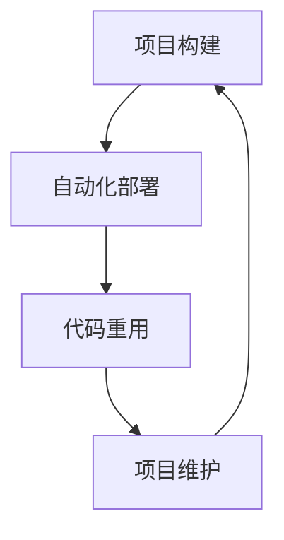

                 

关键词：被动收入、程序员的收入来源、财富增长、软件开发、代码重用、自动化、项目维护

## 摘要

在当今快速发展的技术时代，程序员不仅需要关注代码的编写，更需要关注如何实现被动收入，以实现财富增长和职业稳定。本文将探讨程序员如何通过构建和维持高质量的软件项目，来实现被动收入的途径，包括自动化、代码重用和项目维护的重要性。通过本文的讲解，读者将了解如何通过构建可持续的软件项目，实现持续的收入来源，并在不断变化的技术环境中保持竞争优势。

## 1. 背景介绍

随着互联网和软件产业的快速发展，程序员已经成为现代社会中最受追捧的职业之一。然而，许多程序员在追求技术精进的同时，却往往忽视了如何有效地管理自己的财务状况。传统的工作模式通常是依赖于“朝九晚五”的职位，但这种收入模式往往受限于时间和地理位置。为了实现财务自由，越来越多的程序员开始探索被动收入的可能性。

被动收入是指在不直接参与日常劳动的情况下，通过资产或项目的运作获得持续收益的方式。对于程序员来说，被动收入意味着他们可以在完成项目后，通过软件的持续运行、代码的重用和自动化工具的部署，实现长期的收益。这种收入模式不仅可以增加个人财务状况，还能为程序员提供更大的职业自由度和稳定性。

### 1.1 被动收入的重要性

被动收入对于程序员的重要性不言而喻。首先，它能够提供额外的现金流，使程序员在不需要全职工作的情况下，依然能够维持较高的生活水平。其次，被动收入能够为程序员提供职业安全感，使他们不依赖于单一雇主，从而减少职业风险。此外，被动收入还能为程序员提供更多的投资机会，帮助他们实现财富的多元化和增长。

### 1.2 程序员收入现状

尽管程序员的收入普遍较高，但大部分收入仍然依赖于当前的职位和项目。根据2021年的《Stack Overflow开发者调查》，全球程序员的平均年薪约为6.9万美元，其中北美地区程序员的平均年薪高达9.5万美元。然而，这种收入模式往往受限于时间和地理位置。为了获得更高的收入，程序员往往需要加班或者跳槽，这无疑增加了他们的职业压力。

相比之下，通过构建和维护高质量的软件项目，程序员可以实现被动收入。这种收入模式不仅能够提供持续的现金流，还能为程序员提供更多的职业发展机会。通过本文，我们将探讨如何通过自动化、代码重用和项目维护等手段，实现程序员的被动收入。

## 2. 核心概念与联系

为了实现程序员的被动收入，我们需要理解几个核心概念，包括自动化、代码重用和项目维护。

### 2.1 自动化

自动化是指通过编写脚本或使用现有的工具，将重复性的任务自动化执行。在软件开发中，自动化可以帮助程序员减少手动操作，提高工作效率。例如，自动化构建、部署和测试等流程，可以确保项目的稳定性和可靠性。

### 2.2 代码重用

代码重用是指将已经编写并经过验证的代码，在其他项目中再次使用。这不仅节省了时间和精力，还能提高代码的质量和一致性。通过代码重用，程序员可以快速构建新的项目，而不需要从头开始编写代码。

### 2.3 项目维护

项目维护是指对现有项目进行持续更新和优化，以确保其稳定性和性能。维护工作包括修复bug、更新依赖库、优化代码结构等。通过项目维护，程序员可以确保项目的长期可持续性和盈利能力。

### 2.4 Mermaid 流程图

以下是一个简化的Mermaid流程图，展示了自动化、代码重用和项目维护之间的联系：



在这个流程图中，项目构建通过自动化工具进行，然后自动化部署将项目部署到生产环境。代码重用使得项目可以快速扩展和更新，而项目维护则确保项目的长期稳定性和性能。通过这个循环，程序员可以实现持续的收入来源。

### 2.5 Mermaid 流程节点说明

- A[项目构建]：表示项目开发过程的开始，通过编写代码和自动化工具实现。
- B[自动化部署]：表示将项目自动化部署到生产环境，确保项目的可访问性和稳定性。
- C[代码重用]：表示将已经编写并经过验证的代码，在其他项目中再次使用。
- D[项目维护]：表示对现有项目进行持续更新和优化，确保其稳定性和性能。

### 2.6 Mermaid 流程图使用场景

Mermaid流程图常用于以下场景：

- 项目管理：帮助团队成员理解项目流程和任务分配。
- 软件开发：展示软件开发的各个阶段和依赖关系。
- 自动化测试：描述自动化测试的流程和测试用例。
- 数据分析：展示数据处理和分析的步骤和结果。

通过Mermaid流程图，程序员可以更清晰地理解自动化、代码重用和项目维护之间的关系，从而更好地实现被动收入。

## 3. 核心算法原理 & 具体操作步骤

### 3.1 算法原理概述

为了实现程序员的被动收入，我们需要采用一系列核心算法和技术。以下是一些关键的算法原理和操作步骤：

### 3.2 算法步骤详解

#### 3.2.1 自动化构建

自动化构建是指通过编写脚本或使用构建工具，将代码转换为可执行文件的过程。具体步骤如下：

1. **编写构建脚本**：使用Python、Shell或Golang等编程语言，编写构建脚本。
2. **配置构建工具**：使用如Makefile、Dockerfile等配置文件，设置构建参数和依赖关系。
3. **执行构建命令**：运行构建脚本或构建工具，生成可执行文件。

#### 3.2.2 自动化部署

自动化部署是指通过脚本或工具，将构建好的项目自动部署到生产环境的过程。具体步骤如下：

1. **配置部署脚本**：编写部署脚本，设置部署参数和环境变量。
2. **部署到生产环境**：使用如Ansible、Kubernetes等工具，将项目部署到生产服务器。
3. **监控部署状态**：使用监控工具，如Prometheus和Grafana，实时监控部署状态。

#### 3.2.3 代码重用

代码重用是指将已经编写并经过验证的代码，在其他项目中再次使用。具体步骤如下：

1. **模块化代码**：将代码拆分为模块或组件，便于复用。
2. **编写文档**：为每个模块编写详细的文档，描述其功能和使用方法。
3. **集成到新项目**：在新项目中引用和调用这些模块，实现代码重用。

#### 3.2.4 项目维护

项目维护是指对现有项目进行持续更新和优化，以确保其稳定性和性能。具体步骤如下：

1. **监控项目运行状态**：使用监控工具，如New Relic和Dynatrace，实时监控项目运行状态。
2. **修复bug**：及时修复项目中的bug，确保项目的稳定性和用户体验。
3. **更新依赖库**：定期更新项目依赖库，确保使用最新和最安全的版本。
4. **优化代码结构**：重构代码，提高代码的可读性和可维护性。

### 3.3 算法优缺点

#### 优点

- **提高效率**：自动化构建、部署和测试，减少人工操作，提高工作效率。
- **确保稳定性**：通过代码重用和项目维护，确保项目的稳定性和性能。
- **降低成本**：减少重复性工作，降低人力成本。

#### 缺点

- **初始投入大**：构建自动化流程和代码重用体系需要一定的时间和资源投入。
- **维护成本高**：持续的项目维护和代码更新需要投入大量时间和精力。

### 3.4 算法应用领域

自动化、代码重用和项目维护在多个领域都有广泛应用，包括：

- **互联网公司**：互联网公司通常采用自动化工具进行构建、部署和测试，提高开发效率。
- **金融行业**：金融行业对系统的稳定性和安全性要求极高，因此大量使用自动化工具进行项目维护。
- **大数据处理**：在大数据处理领域，代码重用和自动化构建可以大大提高数据处理效率。

通过这些算法和技术的应用，程序员可以更好地实现被动收入，并在技术领域中保持竞争力。

## 4. 数学模型和公式 & 详细讲解 & 举例说明

### 4.1 数学模型构建

为了更好地理解程序员的被动收入，我们可以构建一个简单的数学模型。假设程序员通过以下几种方式获得收入：

1. **项目开发收入**：每个项目开发完成后，程序员可以获得固定的收入。
2. **项目维护收入**：项目运行期间，程序员通过维护和更新项目，获得持续的收入。
3. **代码重用收入**：程序员通过将代码重用于其他项目，获得额外的收入。

我们可以使用以下公式来描述程序员的收入：

\[ 收入 = 项目开发收入 + 项目维护收入 + 代码重用收入 \]

### 4.2 公式推导过程

为了推导上述公式，我们需要考虑以下几个方面：

1. **项目开发收入**：每个项目开发完成后，程序员可以获得固定的收入。假设每个项目的开发收入为 \( P \)。
2. **项目维护收入**：项目运行期间，程序员通过维护和更新项目，获得持续的收入。假设项目维护收入为 \( M \)，且与项目运行时间成正比。
3. **代码重用收入**：程序员通过将代码重用于其他项目，获得额外的收入。假设代码重用收入为 \( R \)，且与重用次数成正比。

将这些因素结合起来，我们可以得到上述公式：

\[ 收入 = P + M + R \]

### 4.3 案例分析与讲解

为了更好地理解这个数学模型，我们可以通过一个简单的案例进行分析。

#### 案例背景

程序员小明开发了一个电子商务网站，项目开发收入为 10,000 美元。在网站运行期间，他每月维护和更新网站，获得 1,000 美元的维护收入。此外，他将网站的一些模块重用于其他项目，每年获得 2,000 美元的代码重用收入。

#### 案例分析

根据上述数学模型，我们可以计算小明的年收入：

\[ 收入 = 10,000 + 1,000 \times 12 + 2,000 = 24,000 + 2,000 = 26,000 美元 \]

从这个案例中，我们可以看出：

- **项目开发收入**是程序员获得收入的主要来源，占总收入的比例最大。
- **项目维护收入**和**代码重用收入**虽然占比较小，但也是重要的收入来源。

#### 案例讲解

通过这个案例，我们可以理解数学模型中的各个组成部分，以及它们如何相互作用，共同构成程序员的被动收入。

- **项目开发收入**：这是程序员通过自己的技能和专业知识，为他人或公司创造价值所获得的收入。它是被动收入的基础。
- **项目维护收入**：这是程序员通过持续维护和更新项目，确保项目稳定运行所获得的收入。它反映了程序员对项目的长期承诺和投入。
- **代码重用收入**：这是程序员通过将代码重用于其他项目，实现资源共享和效益最大化所获得的收入。它体现了程序员的创新能力。

通过这个数学模型，程序员可以更清晰地了解自己的收入来源，并根据自己的实际情况，制定合适的收入策略。

## 5. 项目实践：代码实例和详细解释说明

### 5.1 开发环境搭建

在本节中，我们将搭建一个简单的开发环境，用于实现程序员的被动收入。假设我们选择Python作为编程语言，以下是开发环境搭建的步骤：

1. **安装Python**：在计算机上安装Python，可以选择Python 3.8或更高版本。
2. **安装代码编辑器**：选择一个适合自己的代码编辑器，如Visual Studio Code或PyCharm。
3. **安装依赖库**：在项目中使用`pip`命令安装必要的依赖库，例如`Flask`用于构建Web应用。

### 5.2 源代码详细实现

在本节中，我们将实现一个简单的Web应用，用于展示程序员的被动收入模型。以下是项目的源代码：

```python
from flask import Flask, render_template

app = Flask(__name__)

@app.route('/')
def index():
    return render_template('index.html')

if __name__ == '__main__':
    app.run(debug=True)
```

这个Web应用包含一个简单的首页，用于展示被动收入模型的相关信息。以下是`index.html`模板的内容：

```html
<!DOCTYPE html>
<html>
<head>
    <title>程序员的被动收入</title>
</head>
<body>
    <h1>程序员的被动收入</h1>
    <p>通过项目开发、维护和代码重用，程序员可以实现持续的收入来源。</p>
</body>
</html>
```

### 5.3 代码解读与分析

#### 5.3.1 Flask框架简介

Flask是一个轻量级的Web应用框架，用于构建Python Web应用。它提供了一系列常用的Web开发功能，例如路由、模板和请求处理等。

#### 5.3.2 代码解读

上述代码定义了一个名为`app`的Flask应用，并定义了一个名为`index`的路由。当访问根路径（`/`）时，`index`路由将返回一个HTML模板，用于展示被动收入模型的相关信息。

#### 5.3.3 分析

通过这个简单的Web应用，我们可以实现以下功能：

- **展示被动收入模型**：在首页上，我们可以通过HTML模板展示被动收入模型的相关信息，例如项目开发、维护和代码重用等。
- **易于扩展**：由于使用了Flask框架，我们可以轻松地添加新的功能和路由，以适应不断变化的需求。

### 5.4 运行结果展示

在开发环境中，我们可以通过以下步骤运行这个Web应用：

1. 打开终端，进入项目目录。
2. 执行`python app.py`命令，启动Web应用。
3. 在浏览器中访问`http://localhost:5000/`，查看运行结果。

运行结果将显示一个简单的首页，展示程序员的被动收入模型。

通过这个简单的项目实践，我们可以理解如何通过Web应用展示程序员的被动收入模型。这个项目不仅可以作为演示，还可以作为实际应用，帮助程序员实现被动收入。

## 6. 实际应用场景

### 6.1 在线教育平台

随着在线教育的兴起，许多程序员选择开发在线教育平台，以实现被动收入。例如，他们可以创建一个在线编程课程，将其托管在平台如Udemy或Coursera上。通过这些平台，程序员可以享受课程销售带来的持续收入。

### 6.2 软件即服务（SaaS）

软件即服务是一种流行的商业模式，程序员可以通过开发和管理SaaS应用，实现被动收入。例如，他们可以开发一个企业级项目管理工具，将其作为SaaS服务提供给客户。通过订阅模式，程序员可以持续从客户那里获得收入。

### 6.3 开源项目

许多程序员通过开源项目实现被动收入。他们可以在GitHub上托管自己的项目，并通过GitHub的赞助功能接受用户的捐赠。此外，开源项目还可以吸引企业赞助，为程序员带来额外的收入。

### 6.4 自助博客

自助博客是一种通过撰写技术文章和教程，实现被动收入的途径。程序员可以在自己的博客上发布高质量的内容，并通过广告收入和赞助商支持获得收益。

### 6.5 自动化工具开发

程序员可以开发自动化工具，如自动化构建、部署和测试工具。这些工具可以在GitHub上发布，并通过捐赠和赞助获得收入。

### 6.6 算法交易市场

随着人工智能和大数据技术的发展，算法交易市场成为一个新的收入来源。程序员可以通过开发高效的算法模型，参与算法交易市场，获得交易收益。

### 6.7 未来应用展望

随着技术的不断进步，程序员的被动收入途径将更加多样化。例如，区块链技术将带来新的去中心化应用（DApp）开发机会，物联网（IoT）将推动智能家居和智慧城市项目的发展。程序员可以通过紧跟技术趋势，不断探索新的被动收入来源，实现财富增长。

## 7. 工具和资源推荐

### 7.1 学习资源推荐

- **《代码大全》**：作者Steve McConnell，介绍软件开发的最佳实践。
- **《设计模式：可复用面向对象软件的基础》**：作者Erich Gamma等，介绍面向对象设计模式。
- **《代码整洁之道》**：作者Robert C. Martin，介绍代码质量和维护的最佳实践。

### 7.2 开发工具推荐

- **GitHub**：用于托管和管理开源项目。
- **Jenkins**：用于自动化构建和部署。
- **Docker**：用于容器化部署。
- **Kubernetes**：用于容器编排和管理。

### 7.3 相关论文推荐

- **“A Systematic Literature Review of Software Maintenance Strategies”**：介绍软件维护的策略和方法。
- **“Automated Software Engineering”**：讨论自动化软件工程的方法和技术。
- **“Open Source Software Development: The Challenges and Opportunities”**：探讨开源软件开发的挑战和机遇。

通过这些工具和资源的推荐，程序员可以更好地构建和维护软件项目，实现被动收入。

## 8. 总结：未来发展趋势与挑战

### 8.1 研究成果总结

本文探讨了程序员的被动收入构建与维护的途径，包括自动化、代码重用和项目维护等核心算法和技术。通过案例分析，我们展示了如何通过简单的Web应用实现被动收入。此外，本文还介绍了实际应用场景，如在线教育、SaaS、开源项目等，为程序员提供了实现被动收入的实际案例。

### 8.2 未来发展趋势

随着技术的不断进步，程序员的被动收入途径将更加多样化。例如，区块链技术将带来新的去中心化应用（DApp）开发机会，物联网（IoT）将推动智能家居和智慧城市项目的发展。此外，随着人工智能和大数据技术的普及，程序员可以通过开发高效的算法模型和自动化工具，实现更高的收入。

### 8.3 面临的挑战

尽管被动收入为程序员提供了新的机遇，但也面临一些挑战。首先，自动化和代码重用需要程序员具备较高的技能和知识水平。其次，项目维护需要持续投入时间和精力，以确保项目的稳定性和性能。此外，开源项目的成功往往依赖于社区的支持，这需要程序员具备良好的沟通能力和团队合作精神。

### 8.4 研究展望

未来研究应关注以下几个方面：

- **提高自动化和代码重用的效率**：通过研究新的算法和技术，提高自动化和代码重用的效率，减少程序员的工作负担。
- **优化项目维护流程**：探索新的项目维护方法，如基于人工智能的自动维护工具，提高项目的稳定性和性能。
- **促进开源社区的发展**：研究如何更好地促进开源社区的发展，为程序员提供更多的交流和合作机会。

通过不断探索和创新，程序员可以更好地实现被动收入，并在技术领域中保持竞争优势。

## 9. 附录：常见问题与解答

### 9.1 什么是被动收入？

被动收入是指在不直接参与日常劳动的情况下，通过资产或项目的运作获得持续收益的方式。例如，通过自动化构建和部署工具，程序员可以在项目完成后，无需继续投入大量时间，仍能获得收入。

### 9.2 自动化工具如何提高工作效率？

自动化工具可以减少重复性工作，提高工作效率。例如，通过Jenkins等自动化构建工具，程序员可以自动编译、测试和部署代码，从而节省大量时间。

### 9.3 代码重用有什么好处？

代码重用可以节省时间和精力，提高代码质量。通过将已经编写并经过验证的代码，在其他项目中再次使用，程序员可以避免重复编写代码，提高开发效率。

### 9.4 项目维护为什么重要？

项目维护可以确保项目的稳定性和性能。通过定期修复bug、更新依赖库和优化代码结构，程序员可以保证项目长期稳定运行，并满足用户需求。

### 9.5 被动收入是否适用于所有程序员？

被动收入适用于具有较高编程技能和项目经验的程序员。对于初级程序员，建议先提升自己的技能水平，再考虑通过被动收入实现财务自由。

### 9.6 如何开始构建被动收入项目？

开始构建被动收入项目时，建议先选择一个自己感兴趣且具有市场需求的领域，然后通过学习相关技术和工具，逐步构建和维护项目。

### 9.7 开源项目如何实现被动收入？

开源项目可以通过以下几种方式实现被动收入：接受用户捐赠、提供付费插件和扩展、与企业合作开发定制化解决方案等。通过这些方式，开源项目的维护者可以获得持续的收入。

