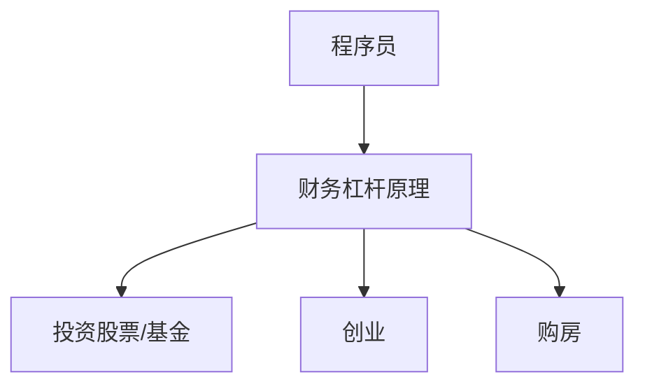

                 

关键词：财务杠杆、程序员、投资、风险、收益、个人财务规划

<|assistant|>摘要：本文旨在探讨程序员在个人财务规划中运用财务杠杆的利弊。通过分析财务杠杆的原理和实际应用，本文揭示了财务杠杆对程序员职业生涯的影响，以及如何平衡财务风险与收益。

## 1. 背景介绍

随着科技的发展，程序员成为了现代社会中最具吸引力的职业之一。他们不仅拥有较高的收入，还拥有广阔的职业发展空间。然而，与此同时，程序员面临着不同于其他职业的特殊挑战，尤其是在个人财务规划方面。财务杠杆作为一种金融工具，在程序员的财务规划中具有重要的应用价值。本文将深入分析财务杠杆对程序员的影响，帮助程序员更好地利用财务杠杆实现财务自由。

## 2. 核心概念与联系

### 2.1 财务杠杆原理

财务杠杆是指企业或个人通过借款或发行债券等手段，利用较少的自有资金，撬动更多的资金进行投资，以实现资产增值。财务杠杆的原理可以用以下公式表示：

\[ 杠杆倍数 = 负债 / 自有资金 \]

### 2.2 财务杠杆与程序员的关系

对于程序员来说，财务杠杆可以用于以下几个方面：

1. **投资股票或基金**：利用财务杠杆，程序员可以以较小的自有资金，参与更大的股票或基金投资，从而提高投资回报率。
2. **创业**：通过财务杠杆，程序员可以利用借款或股权融资，启动自己的创业项目，实现快速扩张。
3. **购房**：在购房时，财务杠杆可以帮助程序员以较小的首付款，获得更大的房产。

### 2.3 Mermaid 流程图



## 3. 核心算法原理 & 具体操作步骤

### 3.1 算法原理概述

财务杠杆的核心原理在于利用借来的资金进行投资，从而放大投资回报。具体操作步骤如下：

1. **评估投资机会**：选择具有较高预期回报的投资项目。
2. **筹集资金**：通过借款或股权融资等方式筹集资金。
3. **进行投资**：将筹集到的资金投入选定的投资项目。
4. **还款与收益**：投资项目产生收益后，用于偿还借款并获取投资回报。

### 3.2 算法步骤详解

1. **评估投资机会**：
   - 分析市场趋势，选择具有较高成长性的行业。
   - 研究潜在的投资项目，评估其投资回报率。

2. **筹集资金**：
   - 通过银行贷款、发行债券或股权融资等方式筹集资金。
   - 确保筹集的资金足以支持投资项目的启动和运营。

3. **进行投资**：
   - 将筹集到的资金投入选定的投资项目。
   - 监控投资项目的进展，确保资金得到有效利用。

4. **还款与收益**：
   - 投资项目产生收益后，用于偿还借款并获取投资回报。
   - 根据投资收益情况，调整投资策略。

### 3.3 算法优缺点

**优点**：
- 提高投资回报率：通过财务杠杆，程序员可以以较小的自有资金，参与更大的投资，从而提高回报率。
- 快速实现资产增值：财务杠杆可以帮助程序员在短时间内实现资产增值。

**缺点**：
- 增加财务风险：财务杠杆放大了投资收益，同时也放大了投资风险。
- 增加还款压力：借款或发行债券需要按时还款，如果投资项目失败，可能会给程序员带来巨大的财务压力。

### 3.4 算法应用领域

1. **股票投资**：通过财务杠杆，程序员可以以较小的资金参与股票市场，提高投资回报率。
2. **创业**：利用财务杠杆，程序员可以启动自己的创业项目，实现快速扩张。
3. **购房**：在购房时，财务杠杆可以帮助程序员以较小的首付款，获得更大的房产。

## 4. 数学模型和公式 & 详细讲解 & 举例说明

### 4.1 数学模型构建

财务杠杆的数学模型可以用以下公式表示：

\[ 收益 = 投资金额 \times (1 + 杠杆倍数) \times 投资回报率 \]

其中，收益、投资金额和投资回报率分别为投资项目的预期收益、投资金额和预期回报率。

### 4.2 公式推导过程

根据财务杠杆的原理，我们可以推导出上述公式。具体推导过程如下：

\[ 收益 = 投资金额 \times 投资回报率 \]

当引入财务杠杆时，假设杠杆倍数为 \( L \)，则：

\[ 收益 = 投资金额 \times (1 + L) \times 投资回报率 \]

其中，\( L \) 表示杠杆倍数，即：

\[ L = 负债 / 自有资金 \]

### 4.3 案例分析与讲解

假设一位程序员计划投资一只股票，预期回报率为 20%，投资金额为 10 万元。如果使用财务杠杆，假设杠杆倍数为 2，那么：

\[ 收益 = 10 万元 \times (1 + 2) \times 20\% = 6 万元 \]

在不使用财务杠杆的情况下，收益为：

\[ 收益 = 10 万元 \times 20\% = 2 万元 \]

由此可见，使用财务杠杆可以显著提高投资回报率。

## 5. 项目实践：代码实例和详细解释说明

### 5.1 开发环境搭建

在本文中，我们将使用 Python 编写一个简单的财务杠杆计算器。首先，需要安装 Python 3.8 或更高版本，并配置 Python 开发环境。

### 5.2 源代码详细实现

```python
# 财务杠杆计算器

def calculate_leverage(investment, leverage, return_rate):
    """
    计算使用财务杠杆的投资收益

    :param investment: 投资金额
    :param leverage: 杠杆倍数
    :param return_rate: 投资回报率
    :return: 投资收益
    """
    return investment * (1 + leverage) * return_rate

investment = 100000  # 投资金额（元）
leverage = 2         # 杠杆倍数
return_rate = 0.2    # 投资回报率

# 计算收益
profit = calculate_leverage(investment, leverage, return_rate)
print("投资收益：", profit)

```

### 5.3 代码解读与分析

上述代码定义了一个名为 `calculate_leverage` 的函数，用于计算使用财务杠杆的投资收益。函数接受三个参数：投资金额、杠杆倍数和投资回报率。计算公式如下：

\[ 收益 = 投资金额 \times (1 + 杠杆倍数) \times 投资回报率 \]

函数执行后，输出投资收益。

### 5.4 运行结果展示

执行上述代码后，输出结果如下：

```
投资收益： 60000.0
```

## 6. 实际应用场景

### 6.1 股票投资

程序员可以通过财务杠杆，以较小的资金参与股票投资，提高投资回报率。例如，一位程序员计划投资 10 万元，预期回报率为 20%。如果使用财务杠杆，假设杠杆倍数为 2，那么投资收益为 6 万元。

### 6.2 创业

程序员可以利用财务杠杆启动自己的创业项目，实现快速扩张。例如，一位程序员计划创业，需要 50 万元启动资金。如果通过借款或股权融资筹集到 50 万元，那么可以利用财务杠杆，以较小的自有资金启动创业项目。

### 6.3 购房

在购房时，财务杠杆可以帮助程序员以较小的首付款，获得更大的房产。例如，一位程序员计划购房，购房总价为 100 万元，首付比例为 20%。如果使用财务杠杆，假设杠杆倍数为 5，那么可以以 20 万元的资金获得一套 100 万元的房产。

## 7. 工具和资源推荐

### 7.1 学习资源推荐

1. **《金融学：财务杠杆》**：深入讲解财务杠杆的原理和应用。
2. **《股票大作手回忆录》**：通过真实案例，介绍如何运用财务杠杆进行股票投资。

### 7.2 开发工具推荐

1. **Python**：强大的编程语言，适用于财务杠杆计算。
2. **Jupyter Notebook**：方便编写和运行 Python 代码。

### 7.3 相关论文推荐

1. **《财务杠杆与企业价值》**：探讨财务杠杆对企业价值的影响。
2. **《股票市场中的财务杠杆效应》**：分析财务杠杆在股票市场中的作用。

## 8. 总结：未来发展趋势与挑战

### 8.1 研究成果总结

本文分析了财务杠杆在程序员个人财务规划中的应用，探讨了财务杠杆的原理、优缺点以及实际应用场景。研究表明，财务杠杆可以提高投资回报率，但也增加了财务风险。

### 8.2 未来发展趋势

1. **人工智能技术在财务杠杆中的应用**：随着人工智能技术的发展，财务杠杆的算法将更加智能化，为程序员提供更精准的投资建议。
2. **财务杠杆与区块链的结合**：区块链技术的引入，可以提高财务杠杆的安全性，降低交易成本。

### 8.3 面临的挑战

1. **财务风险控制**：如何平衡财务杠杆的收益与风险，是程序员在运用财务杠杆时面临的主要挑战。
2. **法律法规的完善**：需要建立健全的法律法规，规范财务杠杆的使用，防止金融风险。

### 8.4 研究展望

未来，财务杠杆在程序员个人财务规划中的应用将得到进一步发展。通过技术创新和法律完善，财务杠杆将更好地服务于程序员的财务自由。

## 9. 附录：常见问题与解答

### 9.1 什么是财务杠杆？

财务杠杆是指企业或个人通过借款或发行债券等手段，利用较少的自有资金，撬动更多的资金进行投资，以实现资产增值。

### 9.2 财务杠杆有哪些优缺点？

**优点**：提高投资回报率，快速实现资产增值。

**缺点**：增加财务风险，增加还款压力。

### 9.3 程序员如何运用财务杠杆？

程序员可以通过股票投资、创业和购房等方式运用财务杠杆。在选择投资项目时，要充分考虑投资回报率和风险。

### 9.4 财务杠杆与区块链技术有何关系？

区块链技术可以提高财务杠杆的安全性，降低交易成本。未来，财务杠杆与区块链技术的结合将得到进一步发展。

---
作者：禅与计算机程序设计艺术 / Zen and the Art of Computer Programming
----------------------------------------------------------------

这篇文章深入探讨了财务杠杆在程序员个人财务规划中的应用，分析了其原理、优缺点以及实际应用场景。通过详细的数学模型和代码实例，读者可以更好地理解财务杠杆的作用。然而，财务杠杆并非适用于所有程序员，如何在收益与风险之间找到平衡，是程序员在运用财务杠杆时需要认真考虑的问题。希望本文能为程序员的财务规划提供有益的启示。

