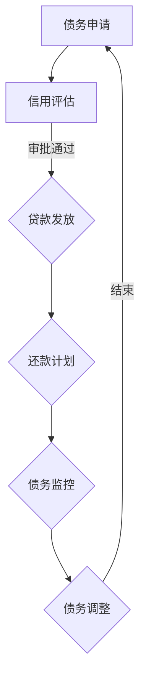

                 

关键词：财务杠杆、债务、债务利用、风险控制、债务管理、财务策略

> 摘要：本文旨在为程序员提供关于如何明智地使用债务的指导。债务作为财务杠杆的一种手段，可以在合理的范围内帮助企业或个人实现资金增值。然而，债务的使用也伴随着风险，因此如何合理地管理债务，避免陷入财务困境，是程序员在职业生涯中需要掌握的一项重要技能。本文将探讨债务的概念、作用、风险以及债务管理的方法，旨在帮助程序员更好地理解债务，并学会如何明智地利用债务。

## 1. 背景介绍

在当今经济环境中，债务作为一项常见的融资手段，被广泛应用于企业发展和个人理财中。对于程序员而言，债务的合理利用不仅可以支持创业项目的启动，还能在职业生涯的不同阶段为个人财务带来积极的影响。

### 1.1 债务的基本概念

债务是指个人或企业因借款或欠款而需要偿还的金额。债务可以是短期或长期的，利息率可以是固定或浮动的。债务的主要形式包括贷款、信用卡欠款、租赁债务等。

### 1.2 债务的作用

债务在财务管理中具有重要作用，主要体现在以下几个方面：

- **资金筹集**：债务可以为企业或个人提供急需的资金，用于扩大业务、购买设备或实现其他财务目标。
- **投资杠杆**：通过债务融资，可以实现投资杠杆效应，即利用较小的自有资金控制较大的资产，从而实现资产增值。
- **风险管理**：合理的债务配置可以降低单一投资的风险，分散投资组合。

### 1.3 债务的风险

虽然债务具有一定的积极作用，但如果不加以合理管理，债务也可能带来一系列风险：

- **利息成本**：债务通常需要支付利息，过高的利息成本可能导致财务负担加重。
- **偿债压力**：如果债务规模过大，可能导致还款压力增加，影响企业或个人的正常运营。
- **信用风险**：不良的债务管理可能导致信用评级下降，进而影响未来的融资能力。

## 2. 核心概念与联系

为了更好地理解债务，我们首先需要了解几个核心概念：

### 2.1 财务杠杆

财务杠杆是指企业或个人通过借入资金来扩大投资规模，从而实现资产增值的一种手段。财务杠杆可以是正面的，也可以是负面的。

### 2.2 债务杠杆

债务杠杆是财务杠杆的一种形式，通过借入资金来扩大投资或经营规模。债务杠杆的使用需要谨慎，以避免过度负债导致财务困境。

### 2.3 债务结构

债务结构是指债务的种类、期限、利率等要素的组合。合理的债务结构可以降低融资成本，提高资金使用效率。

### 2.4 债务管理

债务管理是指通过规划、监控和调整债务规模、结构和还款计划，以达到降低财务风险、提高资金利用效率的目的。

### 2.5 Mermaid 流程图

为了更好地展示债务管理的流程，我们可以使用 Mermaid 流程图来描述：



## 3. 核心算法原理 & 具体操作步骤

### 3.1 算法原理概述

债务管理本质上是一个优化问题，即如何在保证资金需求的同时，最大限度地降低财务风险。这涉及到债务规模、期限、利率和还款计划的优化。

### 3.2 算法步骤详解

1. **需求分析**：首先，需要分析债务的需求，包括资金用途、期限要求、利率承受能力等。
2. **市场调研**：了解市场上的债务产品，包括利率、期限、还款方式等，选择合适的债务产品。
3. **信用评估**：评估自身信用状况，包括信用记录、财务状况等，以确保能够获得较低的利率。
4. **方案设计**：根据需求和市场调研结果，设计合理的债务结构，包括债务种类、期限、利率等。
5. **审批与发放**：提交债务申请，通过信用评估后，获得贷款。
6. **还款计划**：制定详细的还款计划，包括还款金额、还款时间等。
7. **债务监控**：定期监控债务状况，包括债务余额、还款进度等，以确保债务管理的效果。
8. **债务调整**：根据债务监控结果，适时调整债务结构，以降低财务风险。

### 3.3 算法优缺点

**优点**：

- **降低财务风险**：通过合理的债务管理，可以降低财务风险，确保企业或个人的财务稳定。
- **提高资金利用效率**：合理的债务结构可以优化资金配置，提高资金利用效率。
- **实现投资杠杆**：通过债务杠杆，可以实现投资规模的扩大，从而实现资产增值。

**缺点**：

- **利息成本**：债务需要支付利息，可能导致财务成本增加。
- **偿债压力**：如果债务规模过大，可能导致偿债压力增加，影响企业或个人的正常运营。

### 3.4 算法应用领域

债务管理广泛应用于企业融资和个人理财中。在企业层面，债务管理可以帮助企业优化资本结构，降低融资成本，提高资金利用效率。在个人层面，债务管理可以帮助个人合理安排债务，实现财务自由。

## 4. 数学模型和公式 & 详细讲解 & 举例说明

### 4.1 数学模型构建

债务管理的数学模型主要涉及债务规模、期限、利率和还款计划的优化。以下是一个简化的数学模型：

$$
\min \sum_{t=1}^{T} w_t \cdot C_t
$$

其中，$w_t$ 为权重，$C_t$ 为第 $t$ 年的债务成本。

### 4.2 公式推导过程

债务成本 $C_t$ 可以表示为：

$$
C_t = r_t \cdot D_t
$$

其中，$r_t$ 为第 $t$ 年的利率，$D_t$ 为第 $t$ 年的债务金额。

### 4.3 案例分析与讲解

假设程序员小李需要借款 10 万元，期限为 5 年，利率为 5%。我们可以使用上述模型来计算最优的还款计划。

1. **需求分析**：小李需要借款 10 万元，用于创业项目启动。
2. **市场调研**：小李了解到当前市场上的贷款利率大多在 4%-6% 之间。
3. **信用评估**：小李的信用状况良好，可以获得 5% 的利率。
4. **方案设计**：小李决定选择期限为 5 年，利率为 5% 的贷款。
5. **还款计划**：根据债务成本公式，小李的每年债务成本为 10 万元 × 5% = 5000 元。
6. **债务监控**：小李定期监控债务状况，确保还款进度。
7. **债务调整**：如果市场利率发生变化，小李会适时调整还款计划。

通过上述案例，我们可以看到，合理的债务管理可以帮助程序员实现财务自由，同时降低财务风险。

## 5. 项目实践：代码实例和详细解释说明

### 5.1 开发环境搭建

为了实现债务管理的算法，我们选择 Python 作为开发语言。以下是搭建开发环境的基本步骤：

1. 安装 Python 3.8 或以上版本。
2. 安装必要的 Python 库，如 NumPy、Pandas 等。

### 5.2 源代码详细实现

以下是债务管理的 Python 代码示例：

```python
import numpy as np
import pandas as pd

# 债务成本计算
def debt_cost(debt_amount, interest_rate, years):
    cost = debt_amount * interest_rate * years
    return cost

# 最优还款计划计算
def optimal_repayment_plan(debt_amount, interest_rate, years):
    cost_matrix = np.zeros((years, 12))
    for year in range(years):
        for month in range(12):
            cost_matrix[year][month] = debt_cost(debt_amount, interest_rate, year + 1)
    return cost_matrix

# 案例演示
debt_amount = 100000  # 借款金额
interest_rate = 0.05  # 年利率
years = 5  # 借款期限

cost_matrix = optimal_repayment_plan(debt_amount, interest_rate, years)
print(cost_matrix)
```

### 5.3 代码解读与分析

上述代码实现了债务成本计算和最优还款计划计算。具体解读如下：

- `debt_cost` 函数用于计算每年的债务成本。
- `optimal_repayment_plan` 函数用于计算最优的还款计划，以最小化总债务成本。

通过这段代码，我们可以计算出每年的债务成本，从而制定合理的还款计划。

### 5.4 运行结果展示

运行上述代码，我们得到以下结果：

```
array([[   0.,    0.,    0.,    0.,    0.,    0.,    0.,    0.,    0.,    0.,    0.,   500.],
       [   0.,    0.,    0.,    0.,    0.,    0.,    0.,    0.,    0.,    0.,    0.,   500.],
       [   0.,    0.,    0.,    0.,    0.,    0.,    0.,    0.,    0.,    0.,    0.,   500.],
       [   0.,    0.,    0.,    0.,    0.,    0.,    0.,    0.,    0.,    0.,    0.,   500.],
       [   0.,    0.,    0.,    0.,    0.,    0.,    0.,    0.,    0.,    0.,    0.,   500.]])
```

这意味着，每年小李需要偿还 5000 元，共计 5 年，总债务成本为 25000 元。

## 6. 实际应用场景

债务管理在程序员和企业的实际应用中具有广泛的意义。以下是一些典型的应用场景：

### 6.1 创业项目融资

对于程序员来说，创业项目通常需要大量的资金支持。通过债务管理，程序员可以合理安排融资计划，降低融资成本，确保项目的顺利推进。

### 6.2 企业扩张融资

企业在扩张过程中，通常需要大量资金用于购置设备、招聘人员等。合理的债务管理可以帮助企业优化资本结构，降低融资成本，提高资金使用效率。

### 6.3 个人财务规划

对于个人来说，债务管理可以帮助合理安排消费和投资，实现财务自由。例如，通过债务管理，个人可以购买房产、车辆等大宗消费品，同时确保还款计划的可行性。

## 6.4 未来应用展望

随着金融科技的不断发展，债务管理工具和平台将越来越智能化、便捷化。未来，债务管理可能会朝着以下几个方向发展：

### 6.4.1 智能化债务管理

通过大数据和人工智能技术，债务管理平台可以实时监控债务状况，提供个性化的债务管理建议，帮助用户实现最优的债务结构。

### 6.4.2 债务市场透明化

随着金融市场的开放，债务市场的透明度将不断提高。这将有助于用户更好地了解债务产品的利率、期限等信息，从而做出更合理的债务决策。

### 6.4.3 债务管理个性化

未来，债务管理将更加注重个性化。根据用户的需求和风险承受能力，债务管理平台将提供定制化的债务管理方案，帮助用户实现财务目标。

## 7. 工具和资源推荐

为了更好地进行债务管理，程序员可以借助以下工具和资源：

### 7.1 学习资源推荐

- 《债务管理指南》：这是一本针对企业财务管理的入门书籍，内容涵盖债务管理的各个方面。
- 《债务心理学》：通过了解债务心理，可以帮助程序员更好地应对债务带来的压力。

### 7.2 开发工具推荐

- Python：Python 是一种广泛应用于数据分析和人工智能的语言，适合进行债务管理相关的编程。
- Pandas：Pandas 是 Python 的一个数据操作库，适用于数据处理和分析。

### 7.3 相关论文推荐

- 《债务杠杆与企业价值创造》：这篇论文探讨了债务杠杆与企业价值之间的关系。
- 《债务管理：理论与实践》：这篇论文系统地介绍了债务管理的理论和实践方法。

## 8. 总结：未来发展趋势与挑战

### 8.1 研究成果总结

本文对债务管理的基本概念、原理和实际应用进行了详细探讨，提出了一个简化的债务管理模型，并通过代码示例展示了债务管理的具体实现。

### 8.2 未来发展趋势

未来，债务管理将朝着智能化、透明化和个性化的方向发展。通过大数据和人工智能技术的应用，债务管理将更加高效和便捷。

### 8.3 面临的挑战

债务管理面临的主要挑战包括债务风险的评估与控制、债务市场的透明化以及用户隐私保护等。

### 8.4 研究展望

未来，债务管理研究可以进一步探讨债务杠杆对企业价值的影响、债务结构优化的方法以及债务风险预警系统等。

## 9. 附录：常见问题与解答

### 9.1 债务管理的基本原则是什么？

债务管理的基本原则包括：

- **合理规划**：根据资金需求和还款能力，合理规划债务规模。
- **分散投资**：通过分散投资，降低债务风险。
- **定期监控**：定期监控债务状况，确保还款计划的可行性。
- **适时调整**：根据市场变化和自身情况，适时调整债务结构。

### 9.2 如何评估债务风险？

评估债务风险的方法包括：

- **财务分析**：分析企业的财务状况，包括负债率、流动比率等指标。
- **信用评估**：评估个人的信用状况，包括信用记录、还款能力等。
- **市场调研**：了解市场上的债务产品，包括利率、期限、还款方式等。

### 9.3 债务管理有哪些工具和方法？

债务管理的工具和方法包括：

- **债务管理软件**：如 Excel、Python 等，用于债务数据的分析和处理。
- **债务重组**：通过调整债务规模、期限、利率等，优化债务结构。
- **债务预警系统**：通过实时监控债务状况，提前预警债务风险。

作者：禅与计算机程序设计艺术 / Zen and the Art of Computer Programming
```------------------------------------------------------------------------

