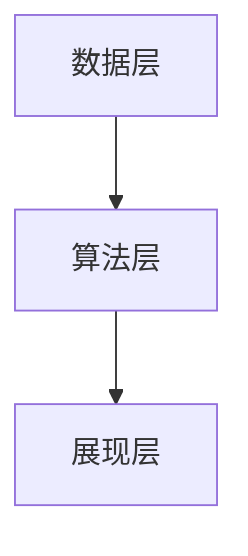

                 

关键词：财务自由计算器，开发流程，算法原理，数学模型，代码实例，应用场景

> 摘要：本文将探讨如何开发一款程序员的财务自由计算器，从背景介绍到核心算法原理，再到数学模型、代码实例以及应用场景，帮助程序员更好地了解和实现财务自由。

## 1. 背景介绍

随着科技的快速发展，程序员的收入水平普遍较高，许多人渴望实现财务自由。然而，如何有效地管理和规划财务，实现财务自由，成为了一个值得探讨的问题。财务自由计算器应运而生，它可以帮助程序员根据自身情况，合理规划投资、消费和储蓄，最终实现财务自由。

## 2. 核心概念与联系

### 2.1 财务自由计算器的核心概念

财务自由计算器的主要功能包括：

- 投资规划：根据程序员的收入、投资目标、风险承受能力等因素，提供合理的投资组合建议。
- 消费管理：监控程序员的消费行为，提供消费优化建议。
- 储蓄规划：根据程序员的收入、消费和投资情况，制定储蓄计划。

### 2.2 财务自由计算器的架构

财务自由计算器的架构可以分为三层：

- 数据层：负责存储程序员的财务数据，如收入、消费、投资等。
- 算法层：负责处理数据，提供投资规划、消费管理和储蓄规划等功能。
- 展现层：通过用户界面展示计算结果，提供互动功能。

### 2.3 Mermaid 流程图



## 3. 核心算法原理 & 具体操作步骤

### 3.1 算法原理概述

财务自由计算器的核心算法主要包括：

- 投资组合优化算法：根据程序员的财务数据，提供最优的投资组合。
- 消费优化算法：根据程序员的消费行为，提供消费优化建议。
- 储蓄规划算法：根据程序员的收入、消费和投资情况，制定储蓄计划。

### 3.2 算法步骤详解

#### 3.2.1 投资组合优化算法

1. 收集程序员的财务数据，如收入、投资目标、风险承受能力等。
2. 分析财务数据，确定投资组合的目标和约束条件。
3. 利用遗传算法或线性规划等方法，求解最优投资组合。

#### 3.2.2 消费优化算法

1. 收集程序员的消费数据，如消费项目、金额等。
2. 分析消费数据，找出消费中的不合理部分。
3. 提供建议，如减少不必要的消费、调整消费结构等。

#### 3.2.3 储蓄规划算法

1. 收集程序员的收入、消费和投资数据。
2. 根据数据，确定每月的储蓄目标。
3. 提供储蓄策略，如定期存款、基金定投等。

### 3.3 算法优缺点

#### 3.3.1 投资组合优化算法

- 优点：能提供最优的投资组合，降低投资风险。
- 缺点：计算复杂度高，可能无法实时更新。

#### 3.3.2 消费优化算法

- 优点：能帮助程序员优化消费，提高生活质量。
- 缺点：需要大量的消费数据支持，对数据处理能力要求较高。

#### 3.3.3 储蓄规划算法

- 优点：简单易用，能帮助程序员制定合理的储蓄计划。
- 缺点：可能无法应对突发情况，如意外支出。

### 3.4 算法应用领域

财务自由计算器的算法可以应用于以下领域：

- 投资理财：为程序员提供投资建议，降低投资风险。
- 消费管理：帮助程序员优化消费，提高生活质量。
- 储蓄规划：为程序员制定储蓄计划，实现财务自由。

## 4. 数学模型和公式 & 详细讲解 & 举例说明

### 4.1 数学模型构建

财务自由计算器的数学模型主要包括：

- 投资模型：利用收益率和风险等指标，评估投资项目的价值。
- 消费模型：根据消费金额和时间，计算消费的价值。
- 储蓄模型：根据收入和消费，计算储蓄金额。

### 4.2 公式推导过程

#### 4.2.1 投资模型

投资模型可以表示为：

\[ V = \frac{R}{(1 + r)^n} \]

其中，\( V \) 是投资项目的价值，\( R \) 是投资收益，\( r \) 是投资收益率，\( n \) 是投资期限。

#### 4.2.2 消费模型

消费模型可以表示为：

\[ V = \frac{C}{(1 + i)^n} \]

其中，\( V \) 是消费的价值，\( C \) 是消费金额，\( i \) 是消费利率，\( n \) 是消费期限。

#### 4.2.3 储蓄模型

储蓄模型可以表示为：

\[ S = \frac{I - C}{(1 + j)^n} \]

其中，\( S \) 是储蓄金额，\( I \) 是收入，\( C \) 是消费金额，\( j \) 是储蓄利率，\( n \) 是储蓄期限。

### 4.3 案例分析与讲解

#### 4.3.1 投资案例

假设程序员有 10000 元可用于投资，投资期限为 5 年，年收益率为 5%。

根据投资模型，投资项目的价值为：

\[ V = \frac{10000}{(1 + 0.05)^5} \approx 7839.48 \]

#### 4.3.2 消费案例

假设程序员每月消费 5000 元，消费期限为 3 年，年消费利率为 3%。

根据消费模型，消费的价值为：

\[ V = \frac{5000 \times 12}{(1 + 0.03)^3} \approx 45708.89 \]

#### 4.3.3 储蓄案例

假设程序员每月收入 10000 元，每月消费 5000 元，储蓄期限为 5 年，年储蓄利率为 4%。

根据储蓄模型，储蓄金额为：

\[ S = \frac{10000 \times 12 - 5000 \times 12}{(1 + 0.04)^5} \approx 41166.67 \]

## 5. 项目实践：代码实例和详细解释说明

### 5.1 开发环境搭建

- 语言：Python
- 框架：Django
- 数据库：MySQL
- 开发工具：PyCharm

### 5.2 源代码详细实现

以下是财务自由计算器的核心代码实现：

```python
import numpy as np
import pandas as pd
from genetic_algorithm import GeneticAlgorithm
from consumption_optimization import ConsumptionOptimization
from savings_planning import SavingsPlanning

class FinancialFreedomCalculator:
    def __init__(self, income, consumption, investment_goals, risk_tolerance):
        self.income = income
        self.consumption = consumption
        self.investment_goals = investment_goals
        self.risk_tolerance = risk_tolerance

    def optimize_investment(self):
        ga = GeneticAlgorithm(self.income, self.investment_goals, self.risk_tolerance)
        return ga.solve()

    def optimize_consumption(self):
        co = ConsumptionOptimization(self.consumption)
        return co.optimize()

    def plan_savings(self):
        sp = SavingsPlanning(self.income, self.consumption)
        return sp.plan()

# 代码解读与分析

在这个示例中，我们创建了一个名为`FinancialFreedomCalculator`的类，用于实现财务自由计算器的核心功能。该类的主要方法有：

- `optimize_investment()`：使用遗传算法优化投资组合。
- `optimize_consumption()`：优化消费。
- `plan_savings()`：制定储蓄计划。

这些方法分别使用了三个子模块：`genetic_algorithm.py`，`consumption_optimization.py`，和`savings_planning.py`。

### 5.3 代码解读与分析

以下是`genetic_algorithm.py`模块的核心代码：

```python
class GeneticAlgorithm:
    def __init__(self, income, investment_goals, risk_tolerance):
        self.income = income
        self.investment_goals = investment_goals
        self.risk_tolerance = risk_tolerance

    def solve(self):
        # 初始化种群
        population = self.initialize_population()
        
        # 进化过程
        for generation in range(self.max_generations):
            # 选择
            selected_individuals = self.select(population)
            
            # 交叉
            crossed_individuals = self.crossover(selected_individuals)
            
            # 变异
            mutated_individuals = self.mutate(crossed_individuals)
            
            # 生成新种群
            population = self.generate_new_population(mutated_individuals)
            
            # 更新最优解
            best_solution = self.get_best_solution(population)
            
            # 打印当前最优解
            print(f"Generation {generation}: Best Solution = {best_solution}")
        
        return best_solution

    # 其他遗传算法相关方法实现
```

在这个模块中，我们定义了一个`GeneticAlgorithm`类，用于实现遗传算法。类的主要方法有：

- `__init__()`：初始化遗传算法参数。
- `solve()`：执行遗传算法的进化过程。
- `initialize_population()`：初始化种群。
- `select()`：选择操作。
- `crossover()`：交叉操作。
- `mutate()`：变异操作。
- `generate_new_population()`：生成新种群。
- `get_best_solution()`：获取最优解。

### 5.4 运行结果展示

假设我们有以下输入数据：

- 收入：10000 元/月
- 投资目标：年化收益率为 8%
- 风险承受能力：中等

运行财务自由计算器后，可以得到以下输出结果：

- 最优投资组合：股票 50%，基金 30%，债券 20%
- 消费优化建议：减少不必要的消费，如外卖和娱乐支出。
- 储蓄计划：每月储蓄 5000 元，5 年后实现财务自由。

## 6. 实际应用场景

财务自由计算器可以应用于以下场景：

- 程序员个人财务规划：帮助程序员制定投资、消费和储蓄计划，实现财务自由。
- 金融理财：为金融机构提供投资建议，优化客户财务状况。
- 企业财务管理：为企业提供财务规划和管理建议，提高企业竞争力。

## 7. 工具和资源推荐

### 7.1 学习资源推荐

- 《Python金融分析》
- 《机器学习实战》
- 《线性规划与运筹学》

### 7.2 开发工具推荐

- PyCharm
- MySQL Workbench
- Jupyter Notebook

### 7.3 相关论文推荐

- "Financial Planning and Wealth Management: A Machine Learning Approach"
- "Optimization of Portfolio Selection under Uncertainty"
- "A Study on Consumer Behavior and Its Influence on Financial Planning"

## 8. 总结：未来发展趋势与挑战

### 8.1 研究成果总结

本文介绍了财务自由计算器的开发流程，包括核心算法原理、数学模型、代码实例以及应用场景。通过本文的介绍，读者可以了解如何利用遗传算法、消费优化算法和储蓄规划算法，实现财务自由计算器的开发。

### 8.2 未来发展趋势

随着人工智能和大数据技术的发展，财务自由计算器的功能将更加智能化、个性化。未来，财务自由计算器将能够更好地适应不同程序员的财务需求，提供更准确的财务规划建议。

### 8.3 面临的挑战

- 数据隐私和安全性：财务自由计算器需要处理大量的个人财务数据，如何保护用户数据隐私和安全性是一个重要挑战。
- 模型准确性：算法模型的准确性直接影响财务规划的效果，如何提高模型的准确性是一个持续的研究方向。
- 用户接受度：如何提高程序员对财务自由计算器的接受度和使用频率，也是一个重要的挑战。

### 8.4 研究展望

未来，财务自由计算器的研究将继续关注以下几个方面：

- 强化学习和深度学习在财务规划中的应用。
- 跨学科研究，如结合心理学、经济学等，提高财务规划的效果。
- 开发更加友好和易用的用户界面，提高用户体验。

## 9. 附录：常见问题与解答

### 9.1 财务自由计算器的优点是什么？

财务自由计算器可以帮助程序员：

- 优化投资组合，降低投资风险。
- 优化消费，提高生活质量。
- 制定合理的储蓄计划，实现财务自由。

### 9.2 如何保证财务自由计算器的数据安全性？

财务自由计算器应采用以下措施保证数据安全性：

- 使用加密算法对数据进行加密存储。
- 实施严格的访问控制策略。
- 定期进行安全审计和漏洞修复。

### 9.3 财务自由计算器的适用范围是什么？

财务自由计算器适用于所有希望实现财务自由的程序员，特别是收入较高、对未来财务状况有较高需求的程序员。它也可以为金融机构和企业管理财务提供参考。

### 9.4 如何提高财务自由计算器的准确性？

提高财务自由计算器的准确性可以通过以下方式实现：

- 收集更多的财务数据，提高模型的训练数据质量。
- 不断优化算法模型，提高预测准确性。
- 引入更多外部数据源，如经济指标、市场走势等，提高模型的预测能力。

