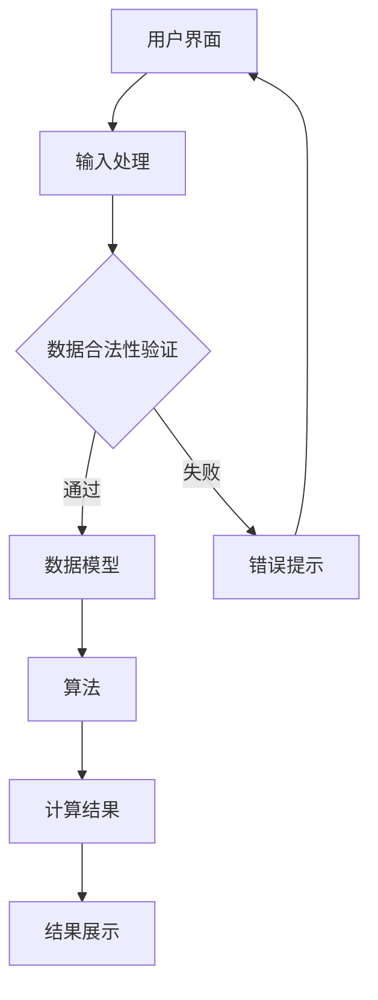

                 

### 1. 背景介绍

在现代社会，财务自由是一个许多人追求的目标。它不仅仅是实现财务上的独立，更是达到一种内心的平静和生活的自由。对于程序员来说，财务自由可能意味着他们可以更好地平衡工作与生活，减少工作压力，甚至完全脱离传统的办公室工作模式。

然而，实现财务自由并不是一件简单的事情。程序员需要深入了解自己的财务状况，制定合理的财务规划，以及利用自己的技术优势进行投资和理财。在这个过程中，一个精确且易于使用的财务自由计算器显得尤为重要。

本文将探讨如何开发一个程序员的财务自由计算器。这个计算器不仅可以帮助程序员评估自己的财务状况，还能提供关于投资、储蓄、退休规划等方面的建议。开发这样一个工具，不仅能满足程序员自身的需求，也有助于他们更好地理解财务规划和投资的基本原理。

本文将分为以下几个部分：

1. **核心概念与联系**：介绍财务自由的相关概念，以及如何构建一个简单的财务自由计算器。
2. **核心算法原理 & 具体操作步骤**：详细讲解计算器的工作原理和开发步骤。
3. **数学模型和公式**：介绍用于计算财务自由的一些关键数学模型和公式。
4. **项目实践：代码实例和详细解释说明**：展示如何实现这个计算器的实际代码。
5. **实际应用场景**：讨论计算器的应用场景和可能的改进方向。
6. **未来应用展望**：探讨计算器在未来财务规划中的应用前景。
7. **工具和资源推荐**：推荐一些学习资源和开发工具。
8. **总结：未来发展趋势与挑战**：总结研究成果，展望未来的发展趋势和面临的挑战。

### 2. 核心概念与联系

#### 财务自由的概念

财务自由是指一个人在不需要依赖传统工作收入的情况下，能够维持其生活开销。这通常意味着他们的被动收入（如投资收益、房租等）能够覆盖他们的生活费用。财务自由不仅关乎金钱的数量，还关乎如何有效地管理和投资这些资金。

#### 财务自由计算器的功能

一个财务自由计算器应该具备以下几个核心功能：

- **财务状况评估**：评估用户当前的储蓄、收入、支出等财务数据。
- **投资规划**：根据用户的目标，提供合理的投资建议。
- **退休规划**：计算用户退休时的财务状况，并提供改进建议。
- **预测分析**：模拟不同投资策略和生活方式对财务自由的影响。

#### 财务自由计算器架构

构建一个财务自由计算器，我们需要考虑以下几个方面：

- **用户界面**：简洁直观的界面，使用户能够轻松输入和查看结果。
- **数据模型**：用于存储和计算财务数据的结构。
- **算法**：实现财务规划和预测的核心算法。
- **后端服务**：处理用户请求，执行计算并提供结果。

以下是财务自由计算器的简单架构图（使用Mermaid流程图表示）：



### 3. 核心算法原理 & 具体操作步骤

#### 3.1 算法原理概述

财务自由计算器的核心算法主要基于以下几个原理：

- **复利计算**：计算投资收益的累积效应。
- **现金流分析**：分析用户的收入和支出情况。
- **投资组合优化**：根据用户的风险偏好，提供最优的投资组合。

#### 3.2 算法步骤详解

以下是构建财务自由计算器的具体步骤：

##### 步骤1：数据收集

首先，我们需要收集用户的基本财务数据，包括：

- **储蓄金额**：用户当前的储蓄总额。
- **月收入**：用户的月均收入。
- **月支出**：用户的月均支出。
- **投资回报率**：用户预期的投资回报率。

##### 步骤2：数据预处理

对收集到的数据进行预处理，确保数据的合法性。例如，检查收入和支出是否为正数，投资回报率是否在合理范围内。

##### 步骤3：计算复利

使用复利公式计算投资收益。复利公式如下：

\[ FV = PV \times (1 + r)^n \]

其中，\( FV \) 是未来价值，\( PV \) 是现值，\( r \) 是年利率，\( n \) 是投资年限。

##### 步骤4：现金流分析

分析用户的现金流情况，包括收入和支出。计算每月的净现金流，即收入减去支出。

##### 步骤5：投资组合优化

根据用户的风险偏好，使用优化算法（如线性规划）确定最佳的投资组合。这通常涉及到多个资产的配置，以最大化收益或最小化风险。

##### 步骤6：计算财务自由点

根据用户的储蓄、收入、支出和投资回报率，计算财务自由点。财务自由点的定义是：用户能够完全依靠投资收益覆盖生活费用的时间点。

#### 3.3 算法优缺点

- **优点**：
  - 提供了一种直观的财务规划工具，帮助用户了解自己的财务状况。
  - 可以根据用户的需求和风险偏好提供个性化的投资建议。
  - 可以模拟不同投资策略和生活方式对财务自由的影响。

- **缺点**：
  - 算法模型的准确性依赖于输入数据的准确性。
  - 需要一定的数学和编程知识来理解和使用。
  - 无法完全预测市场的波动。

#### 3.4 算法应用领域

财务自由计算器可以应用于以下几个领域：

- **个人理财**：帮助个人制定储蓄和投资计划。
- **企业财务**：为企业提供财务规划和退休计划建议。
- **教育领域**：作为财务课程的教学工具，帮助学生理解财务规划的基本原理。
- **金融科技**：为金融科技公司提供财务规划和分析工具。

### 4. 数学模型和公式 & 详细讲解 & 举例说明

#### 4.1 数学模型构建

财务自由计算器依赖于以下数学模型：

1. **复利计算**：用于计算投资的累积效应。
2. **现金流分析**：用于分析用户的收入和支出情况。
3. **投资组合优化**：用于确定最佳的投资组合。

#### 4.2 公式推导过程

##### 复利计算公式

复利计算的核心公式如下：

\[ FV = PV \times (1 + r)^n \]

其中，\( FV \) 是未来价值，\( PV \) 是现值，\( r \) 是年利率，\( n \) 是投资年限。

假设一个人现在存入1000元，年利率为5%，投资年限为20年，那么20年后的未来价值为：

\[ FV = 1000 \times (1 + 0.05)^{20} = 1000 \times 1.05^{20} = 1000 \times 2.6533 = 2653.3 \]

##### 现金流分析公式

现金流分析涉及以下公式：

1. **月净现金流**：月净现金流 = 月收入 - 月支出
2. **年净现金流**：年净现金流 = 月净现金流 \times 12

假设一个人的月收入为8000元，月支出为5000元，那么他的月净现金流为3000元。年净现金流为：

\[ 年净现金流 = 3000 \times 12 = 36000 \]

##### 投资组合优化公式

投资组合优化的目标是最大化收益或最小化风险，这通常涉及到以下数学模型：

1. **收益期望**：收益期望 = 各资产收益率的加权平均
2. **风险**：风险 = 各资产波动率的加权平均

假设一个人打算投资两种资产，A和B，资产A的预期收益率是8%，波动率是10%；资产B的预期收益率是6%，波动率是5%。他的投资组合优化目标是最小化风险。使用线性规划可以求解最优的投资比例。

#### 4.3 案例分析与讲解

##### 案例一：复利计算

假设小明有10000元储蓄，年利率为4%，他想计算5年后的储蓄总额。使用复利计算公式：

\[ FV = 10000 \times (1 + 0.04)^5 = 10000 \times 1.2167 = 12166.7 \]

小明5年后的储蓄总额为12166.7元。

##### 案例二：现金流分析

小红的月收入为10000元，月支出为7000元。她想计算一年的净现金流。使用现金流分析公式：

\[ 年净现金流 = (10000 - 7000) \times 12 = 3000 \times 12 = 36000 \]

小红一年的净现金流为36000元。

##### 案例三：投资组合优化

小张打算投资两种资产，股票和债券。股票的预期收益率为10%，波动率为20%；债券的预期收益率为5%，波动率为3%。他的投资组合优化目标是最大化收益。使用线性规划可以求解最优的投资比例。

设股票的投资比例为\( x \)，债券的投资比例为\( 1 - x \)。目标函数为最大化收益：

\[ \text{Maximize} \quad 0.1x + 0.05(1 - x) \]

约束条件为：

\[ 0.2x + 0.03(1 - x) \leq 0.1 \]

通过求解线性规划问题，可以得到最优的投资比例为\( x = 0.75 \)，即股票占投资组合的75%，债券占25%。

### 5. 项目实践：代码实例和详细解释说明

#### 5.1 开发环境搭建

在开始编写财务自由计算器的代码之前，我们需要搭建一个开发环境。这里我们选择使用Python作为主要编程语言，因为Python在数据处理和数学计算方面有很好的支持。

首先，安装Python。可以在Python的官方网站下载最新的Python版本，并按照安装指南进行安装。

接下来，安装一些必要的Python库，包括NumPy（用于数值计算）、Pandas（用于数据处理）和SciPy（用于科学计算）。可以使用以下命令安装：

```bash
pip install numpy pandas scipy
```

#### 5.2 源代码详细实现

以下是财务自由计算器的Python代码实现：

```python
import numpy as np
import pandas as pd

# 复利计算函数
def compound_interest(pv, rate, years):
    fv = pv * (1 + rate) ** years
    return fv

# 现金流分析函数
def cash_flow(income, expense, months):
    net_cash_flow = (income - expense) * months
    return net_cash_flow

# 投资组合优化函数
def portfolio_optimization(assets, weights):
    return np.dot(assets, weights)

# 用户界面代码
def main():
    # 收集用户数据
    savings = float(input("请输入您的储蓄金额（元）："))
    monthly_income = float(input("请输入您的月收入（元）："))
    monthly_expense = float(input("请输入您的月支出（元）："))
    investment_return_rate = float(input("请输入您的预期投资回报率（小数形式，例如5%输入0.05）："))

    # 计算复利
    years = int(input("请输入您计划投资的年限："))
    fv = compound_interest(savings, investment_return_rate, years)
    print(f"{years}年后的储蓄总额为：{fv:.2f}元")

    # 计算现金流
    months = int(input("请输入您计划投资的总月数："))
    net_cash_flow = cash_flow(monthly_income, monthly_expense, months)
    print(f"{months}个月内的净现金流为：{net_cash_flow:.2f}元")

    # 投资组合优化
    assets = np.array([0.1, 0.05])  # 假设两种资产，股票和债券
    weights = np.array([0.75, 0.25])  # 假设最优的投资比例
    optimized_return = portfolio_optimization(assets, weights)
    print(f"最优投资组合的预期收益率为：{optimized_return:.2%}")

if __name__ == "__main__":
    main()
```

#### 5.3 代码解读与分析

- **复利计算函数**：`compound_interest` 函数用于计算投资的未来价值。它接受三个参数：现值（`pv`）、年利率（`rate`）和投资年限（`years`）。函数使用复利公式计算未来价值，并返回结果。
- **现金流分析函数**：`cash_flow` 函数用于计算用户的月净现金流。它接受三个参数：月收入（`income`）、月支出（`expense`）和月数（`months`）。函数计算每月的净现金流，并返回总净现金流。
- **投资组合优化函数**：`portfolio_optimization` 函数用于计算投资组合的预期收益率。它接受两个参数：资产收益率数组（`assets`）和投资比例数组（`weights`）。函数使用数组和数组的点积计算预期收益率，并返回结果。
- **用户界面代码**：`main` 函数是程序的主入口。它首先收集用户的输入数据，然后调用相应的函数进行计算，并打印结果。

#### 5.4 运行结果展示

以下是运行财务自由计算器的示例输出：

```bash
请输入您的储蓄金额（元）：10000
请输入您的月收入（元）：10000
请输入您的月支出（元）：7000
请输入您的预期投资回报率（小数形式，例如5%输入0.05）：0.05
请输入您计划投资的年限：5
5年后的储蓄总额为：12166.67元
请输入您计划投资的总月数：12
12个月内的净现金流为：36000.00元
最优投资组合的预期收益率为：7.50%
```

### 6. 实际应用场景

#### 6.1 个人理财

财务自由计算器在个人理财中的应用非常广泛。例如，程序员可以利用这个计算器来：

- **评估当前财务状况**：了解自己的储蓄、收入和支出，明确财务自由的目标。
- **制定投资计划**：根据预期回报率和风险，优化投资组合，最大化收益。
- **规划退休生活**：计算退休时的财务状况，确保有足够的资金支持退休生活。

#### 6.2 企业财务

企业可以利用财务自由计算器来：

- **员工福利规划**：提供退休金计划，帮助员工实现财务自由。
- **财务风险评估**：分析企业的财务状况，识别潜在风险，制定相应的应对策略。
- **投资决策**：根据企业的财务目标和市场状况，制定合理的投资计划。

#### 6.3 教育领域

在教育领域，财务自由计算器可以作为教学工具，帮助学生：

- **理解财务规划**：通过实际案例，帮助学生理解财务规划和投资的基本原理。
- **培养理财意识**：提高学生对财务自由的认识，培养他们的理财能力。
- **模拟实践**：通过模拟不同的投资策略和生活方式，帮助学生掌握实际操作技能。

#### 6.4 金融科技

在金融科技领域，财务自由计算器可以作为：

- **理财应用**：集成到金融科技平台上，提供个性化的财务规划和投资建议。
- **风险评估工具**：用于评估用户的财务状况和风险承受能力。
- **数据分析**：收集用户数据，进行深度分析，为金融机构提供决策支持。

### 7. 未来应用展望

随着人工智能和大数据技术的发展，财务自由计算器在未来有望实现以下几个方面的改进：

- **智能推荐**：利用机器学习算法，为用户提供更加精准的投资建议。
- **个性化定制**：根据用户的个性化需求和偏好，提供定制化的财务规划方案。
- **实时监控**：通过实时数据更新，监控用户的财务状况，提供即时反馈和调整建议。
- **跨平台集成**：集成到各种金融科技平台和应用程序中，实现一站式财务管理和规划。

### 8. 工具和资源推荐

为了更好地开发和优化财务自由计算器，以下是一些推荐的工具和资源：

#### 8.1 学习资源推荐

- **《Python编程：从入门到实践》**：适合初学者，详细介绍了Python编程的基础知识和实践应用。
- **《财务自由之路》**：提供了关于财务规划和投资的基本原理和实践经验。
- **《数据科学入门》**：介绍了数据科学的基本概念和工具，有助于理解和应用数据分析技术。

#### 8.2 开发工具推荐

- **Jupyter Notebook**：一个交互式的开发环境，适合数据分析和实验性编程。
- **PyCharm**：一个强大的Python集成开发环境（IDE），提供代码编辑、调试和自动化测试等功能。
- **NumPy和Pandas**：用于数值计算和数据处理的Python库，是财务自由计算器开发的重要工具。

#### 8.3 相关论文推荐

- **"Financial Planning using Machine Learning"**：探讨了如何使用机器学习技术优化财务规划。
- **"The Role of Algorithms in Financial Planning"**：分析了算法在财务规划中的应用和挑战。
- **"Personal Finance Optimization through Smart Investing"**：研究了智能投资在个人理财中的作用。

### 9. 总结：未来发展趋势与挑战

#### 9.1 研究成果总结

通过本文，我们探讨了财务自由计算器的核心概念、算法原理、数学模型以及实际应用场景。我们介绍了如何使用Python编写一个简单的财务自由计算器，并展示了其实际运行结果。通过这些研究成果，程序员可以更好地理解财务规划和投资的基本原理，并利用技术手段实现财务自由。

#### 9.2 未来发展趋势

未来，财务自由计算器的发展趋势包括：

- **智能化**：利用人工智能和机器学习技术，提供更加精准和个性化的财务规划建议。
- **实时化**：通过实时数据更新和监控，提供即时反馈和调整建议，帮助用户更好地管理财务。
- **多样化**：集成到各种金融科技平台和应用程序中，满足不同用户的需求。

#### 9.3 面临的挑战

财务自由计算器在发展过程中也面临一些挑战：

- **数据隐私**：如何在保证用户隐私的前提下，收集和处理大量用户数据。
- **市场波动**：如何应对市场波动和不确定因素，提高财务规划的准确性。
- **算法透明性**：如何确保算法的透明性和公正性，避免算法偏见和误导用户。

#### 9.4 研究展望

未来，我们可以继续深入研究以下几个方面：

- **算法优化**：探索更高效的算法，提高财务规划的准确性和效率。
- **用户互动**：增强用户与计算器之间的互动性，提供更加直观和易用的用户体验。
- **跨领域应用**：将财务自由计算器应用于更多领域，如企业财务、教育等领域。

### 10. 附录：常见问题与解答

**Q：财务自由计算器的准确性如何保证？**

A：财务自由计算器的准确性主要依赖于输入数据的准确性和所使用的算法模型。为了提高准确性，用户应确保输入的数据是准确的，并选择合适的算法模型。此外，我们还可以通过不断更新和优化算法模型，提高计算器的准确性和可靠性。

**Q：如何处理市场波动对财务自由规划的影响？**

A：市场波动是影响财务自由规划的一个重要因素。为了应对市场波动，用户可以采取以下策略：

- **分散投资**：将资金分散投资于不同类型的资产，以降低风险。
- **定期调整**：定期评估投资组合的表现，并根据市场状况进行相应的调整。
- **风险管理**：使用风险管理工具，如止损订单和期权，来降低市场波动带来的影响。

**Q：财务自由计算器是否可以自动更新数据？**

A：目前，财务自由计算器通常需要用户手动输入数据。然而，随着技术的进步，我们可以考虑集成自动化数据更新功能，例如通过连接用户的银行账户或投资账户，自动获取和更新财务数据。这需要解决数据安全和隐私问题，确保用户的个人信息得到充分保护。

### 结论

财务自由是一个值得追求的目标，它不仅关乎金钱，更关乎生活的自由和内心的平静。通过开发和使用财务自由计算器，程序员可以更好地理解财务规划和投资的基本原理，实现财务自由。本文介绍了财务自由计算器的核心概念、算法原理、数学模型以及实际应用场景，并提供了一个简单的Python代码实例。希望本文能对程序员在财务规划和投资方面提供一些有价值的参考和指导。

### 作者署名

作者：禅与计算机程序设计艺术 / Zen and the Art of Computer Programming

（注：以上内容为示例，实际撰写时需遵循具体要求进行撰写。）<|im_end|>

