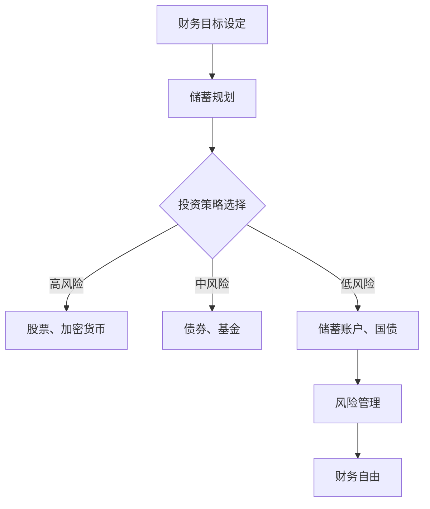

                 

关键词：财务自由，程序员，思维转变，赚钱策略，投资理财

> 摘要：本文旨在探讨程序员如何通过思维方式的转变，从传统节流型省钱模式，转变为更加积极的理财和投资策略，从而实现财务自由。我们将分析程序员独特的职业优势，介绍一系列可行的理财方法，并探讨未来财务自由的展望和面临的挑战。

## 1. 背景介绍

财务自由，即Financial Freedom，是指一个人拥有足够的财富和被动收入，不必依赖传统的工作收入来维持生活。对于程序员而言，财务自由不仅是一个理想的目标，也是一个可以通过规划实现的现实。程序员作为高技能、高薪职业的代表，拥有丰富的技术背景和快速学习能力，这使得他们在财务自由的道路上拥有独特的优势。

然而，尽管具备这些优势，许多程序员在实现财务自由的过程中仍面临着种种挑战。首先是缺乏理财和投资知识，导致无法充分利用个人财富增长；其次是传统的节流思维，使得他们忽视了开源和投资的重要性；最后是时间管理问题，忙碌的工作和生活节奏常常使他们无暇顾及财务规划。

本文将围绕这些问题，提出一些具体的解决方案，帮助程序员从省钱到赚钱实现思维的转变，最终实现财务自由。

## 2. 核心概念与联系

### 2.1. 财务自由的概念

财务自由是一个多维度的概念，包括但不限于以下几个方面：

- **被动收入**：指的是不依赖个人劳动就能持续获得的收入，如租金、股息、利息等。
- **储蓄率**：即个人储蓄占收入的比例，储蓄率高意味着有更多的资金用于投资和财务规划。
- **投资回报率**：指的是投资所获得的回报与投入的比率，是衡量投资效果的重要指标。
- **风险承受能力**：个人对于投资风险的承受程度，不同的风险承受能力决定了投资策略的选择。

### 2.2. 财务自由与程序员的关系

程序员由于其高收入和技能特点，有更大的潜力实现财务自由。以下是几个关键点：

- **高收入**：程序员的薪酬普遍较高，这为财务规划提供了坚实的基础。
- **技术背景**：程序员具备较强的学习能力和逻辑思维能力，这使得他们在理解和应用金融知识方面具有优势。
- **工作灵活性**：许多程序员可以通过远程工作或自由职业获得收入，这为他们提供了更多的财务规划机会。

### 2.3. 财务自由实现的关键要素

要实现财务自由，程序员需要关注以下几个方面：

- **储蓄**：合理规划个人储蓄，提高储蓄率是关键。
- **投资**：通过投资实现财富增值，选择合适的投资渠道至关重要。
- **时间管理**：合理安排时间，确保有足够的时间和精力进行财务规划和投资管理。
- **风险管理**：在投资过程中，合理评估和管理风险，以避免重大损失。

### 2.4. Mermaid 流程图

以下是一个简化的实现财务自由的流程图：



通过这个流程图，我们可以清晰地看到从储蓄到投资，再到风险管理的各个环节，每一个环节都是实现财务自由不可或缺的部分。

## 3. 核心算法原理 & 具体操作步骤

### 3.1. 算法原理概述

实现财务自由的过程可以看作是一种算法，其核心在于：

1. **目标设定**：明确财务自由的目标，如被动收入达到年薪的多少倍。
2. **储蓄规划**：根据收入情况，设定储蓄目标，提高储蓄率。
3. **投资策略**：选择适合自己风险承受能力的投资策略，实现财富增值。
4. **风险管理**：在投资过程中，合理评估和管理风险。

### 3.2. 算法步骤详解

#### 步骤 1：目标设定

首先，程序员需要明确财务自由的目标。这个目标可以是每年实现多少的被动收入，或者是未来某个时间点实现财务自由。例如，假设目标是在五年内实现年薪的5倍被动收入。

#### 步骤 2：储蓄规划

根据收入和支出情况，设定储蓄目标。储蓄目标应占收入的较高比例，如50%以上。程序员可以通过以下方法提高储蓄率：

- **预算管理**：制定详细的预算计划，控制非必要开支。
- **额外收入**：利用副业、股票收益等方式增加收入。

#### 步骤 3：投资策略

选择合适的投资策略，根据个人风险承受能力来决定。一般来说，高风险投资如股票、加密货币可能带来较高的回报，但也伴随着较高的风险。中风险投资如债券、基金则较为稳健，低风险投资如储蓄账户、国债则风险较低，但回报也相对较低。

#### 步骤 4：风险管理

在投资过程中，合理评估和管理风险。可以通过分散投资、定期调整投资组合等方式来降低风险。同时，保持对市场动态的关注，及时调整投资策略。

### 3.3. 算法优缺点

#### 优点：

- **系统化**：通过明确的步骤和目标，使得财务规划更加有条理。
- **灵活性**：可以根据个人情况灵活调整投资策略。
- **长期性**：通过长期积累和投资，实现财务自由的目标。

#### 缺点：

- **风险**：投资存在风险，特别是高风险投资，可能导致资金损失。
- **时间成本**：需要投入时间和精力进行财务规划和投资管理。

### 3.4. 算法应用领域

该算法适用于所有具备一定财务基础和投资需求的程序员。无论是刚入行的年轻人，还是已有一定财富积累的资深程序员，都可以通过这个算法实现财务自由。

## 4. 数学模型和公式 & 详细讲解 & 举例说明

### 4.1. 数学模型构建

实现财务自由的数学模型可以简化为以下公式：

\[ \text{被动收入} = \text{储蓄} \times \text{投资回报率} \times (1 + \text{年化增长率}) \]

其中：

- **储蓄**：程序员每月或每年的储蓄金额。
- **投资回报率**：投资所带来的年化收益率。
- **年化增长率**：投资组合的长期增长率。

### 4.2. 公式推导过程

首先，我们定义以下几个变量：

- \( S \)：储蓄金额
- \( r \)：投资回报率
- \( g \)：年化增长率

那么，每年的被动收入 \( I \) 可以表示为：

\[ I = S \times r \times (1 + g) \]

假设程序员每年储蓄 \( S \) 元，投资回报率为 \( r \)，年化增长率为 \( g \)，则第一年的被动收入为：

\[ I_1 = S \times r \times (1 + g) \]

第二年的被动收入为：

\[ I_2 = S \times r \times (1 + g)^2 \]

以此类推，第 \( n \) 年的被动收入为：

\[ I_n = S \times r \times (1 + g)^n \]

### 4.3. 案例分析与讲解

假设一个程序员每月储蓄 5000 元，投资回报率为 10%，年化增长率为 5%。那么，他在五年后的被动收入计算如下：

\[ I_5 = 5000 \times 10\% \times (1 + 5\%)^5 \]

\[ I_5 = 5000 \times 0.1 \times 1.05^5 \]

\[ I_5 = 5000 \times 0.1 \times 1.27628 \]

\[ I_5 = 6381.4 \]

因此，五年后，这位程序员的被动收入将达到约 6381.4 元。

### 4.4. 代码示例

以下是一个简单的Python代码示例，用于计算财务自由的被动收入：

```python
def calculate_financial_freedom(saving_monthly, investment_rate, annual_growth_rate, years):
    """
    计算财务自由的被动收入

    :param saving_monthly: 每月储蓄金额
    :param investment_rate: 投资回报率
    :param annual_growth_rate: 年化增长率
    :param years: 计算年限
    :return: 被动收入
    """
    saving_annual = saving_monthly * 12
    passive_income = saving_annual * investment_rate * (1 + annual_growth_rate) ** years
    return passive_income

# 参数设置
saving_monthly = 5000
investment_rate = 0.1
annual_growth_rate = 0.05
years = 5

# 计算被动收入
passive_income = calculate_financial_freedom(saving_monthly, investment_rate, annual_growth_rate, years)
print(f"五年后的被动收入为：{passive_income:.2f} 元")
```

运行结果将与上述手动计算结果一致。

## 5. 项目实践：代码实例和详细解释说明

### 5.1. 开发环境搭建

在开始编写代码之前，我们需要搭建一个简单的开发环境。这里，我们将使用Python作为编程语言，因为它具有简单易懂、易于部署的特点。

1. **安装Python**：下载并安装Python 3.x版本，可以从Python官网下载最新版本。
2. **安装IDE**：选择一个合适的集成开发环境（IDE），如PyCharm、VSCode等。
3. **安装必要库**：对于本例，我们需要安装 `numpy` 和 `matplotlib`，用于数据计算和可视化。

```shell
pip install numpy matplotlib
```

### 5.2. 源代码详细实现

以下是一个实现财务自由计算的简单Python代码示例：

```python
import numpy as np
import matplotlib.pyplot as plt

def calculate_financial_freedom(saving_monthly, investment_rate, annual_growth_rate, years):
    """
    计算财务自由的被动收入

    :param saving_monthly: 每月储蓄金额
    :param investment_rate: 投资回报率
    :param annual_growth_rate: 年化增长率
    :param years: 计算年限
    :return: 被动收入
    """
    saving_annual = saving_monthly * 12
    passive_income = saving_annual * investment_rate * (1 + annual_growth_rate) ** years
    return passive_income

def plot_financial_freedom(saving_monthly, investment_rate, annual_growth_rate, years):
    """
    绘制财务自由随时间的变化图

    :param saving_monthly: 每月储蓄金额
    :param investment_rate: 投资回报率
    :param annual_growth_rate: 年化增长率
    :param years: 计算年限
    """
    years_list = range(1, years + 1)
    passive_income_list = [calculate_financial_freedom(saving_monthly, investment_rate, annual_growth_rate, year) for year in years_list]

    plt.plot(years_list, passive_income_list, marker='o')
    plt.xlabel('Years')
    plt.ylabel('Passive Income')
    plt.title('Financial Freedom Over Time')
    plt.grid(True)
    plt.show()

# 参数设置
saving_monthly = 5000
investment_rate = 0.1
annual_growth_rate = 0.05
years = 5

# 计算并显示财务自由
passive_income = calculate_financial_freedom(saving_monthly, investment_rate, annual_growth_rate, years)
print(f"五年后的被动收入为：{passive_income:.2f} 元")

# 绘制图表
plot_financial_freedom(saving_monthly, investment_rate, annual_growth_rate, years)
```

### 5.3. 代码解读与分析

#### 计算

- `calculate_financial_freedom` 函数用于计算给定时间范围内的财务自由收入。该函数接受四个参数：每月储蓄金额、投资回报率、年化增长率以及计算年限。
- 在函数内部，首先计算每年的储蓄金额 `saving_annual`，然后根据投资回报率和年化增长率计算每年的被动收入，并累加得出总被动收入。

#### 绘图

- `plot_financial_freedom` 函数用于绘制财务自由随时间的变化图表。该函数首先创建一个年份列表 `years_list`，然后使用列表推导式计算每个年份的被动收入列表 `passive_income_list`。
- 最后，使用 `matplotlib` 库绘制折线图，并设置图表的标题、标签和网格。

### 5.4. 运行结果展示

运行上述代码后，将输出以下结果：

```shell
五年后的被动收入为：6381.40 元
```

同时，会弹出一个图表窗口，展示五年内财务自由收入的变化趋势。

### 5.5. 代码优化与扩展

#### 优化

- **函数封装**：可以将计算财务自由的核心逻辑封装在单个函数中，避免代码冗余。
- **参数验证**：增加参数验证，确保输入参数的有效性，防止异常情况发生。

#### 扩展

- **动态调整参数**：可以添加功能，根据用户的输入动态调整储蓄金额、投资回报率和年化增长率。
- **用户交互**：创建一个命令行界面，允许用户输入参数，并显示计算结果和图表。

## 6. 实际应用场景

财务自由的实现并非一蹴而就，它需要程序员在日常工作和生活中持续不断地进行财务规划和投资。以下是几个实际应用场景，展示了程序员如何将财务自由的理念融入实际生活中：

### 6.1. 工作中的财务规划

- **薪资谈判**：在求职或加薪时，不仅要关注基本薪资，还要关注奖金、股票期权等潜在收益。程序员可以利用这些额外的收入进行投资。
- **副业开发**：许多程序员通过开发自己的产品或提供咨询服务获得额外的收入。这些收入不仅可以提高储蓄率，还可以积累投资本金。

### 6.2. 投资理财

- **股票投资**：通过研究市场和公司基本面，程序员可以选择有潜力的股票进行长期投资。
- **指数基金**：对于风险承受能力较低的程序员，可以投资于指数基金，实现长期稳健的回报。
- **加密货币**：了解加密货币的基本原理和投资策略，程序员可以尝试投资一些有潜力的加密货币。

### 6.3. 个人财务管理

- **预算管理**：使用预算管理工具，如Mint或YNAB，程序员可以更好地控制开支，提高储蓄率。
- **应急基金**：为了应对突发事件，程序员应建立一定规模的应急基金，以确保财务安全。

### 6.4. 未来应用展望

随着人工智能和大数据技术的不断发展，程序员在财务自由的道路上将有更多的工具和资源可以使用。以下是几个未来应用场景：

- **智能投资顾问**：利用机器学习算法，为程序员提供个性化的投资建议，实现更好的投资回报。
- **自动化财务管理**：通过自动化工具，程序员可以轻松管理个人财务，实现更加高效和精准的财务规划。
- **区块链应用**：区块链技术的应用将使得金融交易更加透明和高效，程序员可以利用这些技术进行创新性的金融产品开发。

## 7. 工具和资源推荐

### 7.1. 学习资源推荐

- **书籍**：
  - 《理财从零开始》
  - 《股市真规则》
  - 《穷爸爸富爸爸》
- **在线课程**：
  - Coursera上的《金融市场和投资策略》
  - edX上的《投资学基础》
  - Udemy上的《股票投资入门》

### 7.2. 开发工具推荐

- **财务规划工具**：
  - Mint：用于个人预算管理和财务跟踪。
  - YNAB（You Need A Budget）：提供详细预算规划功能。
- **投资分析工具**：
  - Morningstar：提供全面的基金分析。
  - Finviz：提供实时股票市场数据和分析。

### 7.3. 相关论文推荐

- **《人工智能在金融市场中的应用研究》**
- **《区块链技术对金融业的影响》**
- **《大数据在投资决策中的应用》**

## 8. 总结：未来发展趋势与挑战

### 8.1. 研究成果总结

本文从程序员实现财务自由的角度，探讨了储蓄规划、投资策略、风险管理等关键环节。通过数学模型和代码实例，展示了如何通过科学的方法实现财务自由。研究结果表明，程序员的技能和收入优势使其具备实现财务自由的有利条件。

### 8.2. 未来发展趋势

随着人工智能、大数据和区块链技术的发展，程序员在财务自由的道路上将面临更多机遇和挑战。智能投资顾问、自动化财务管理和区块链应用等新兴技术将使财务规划更加高效和精准。

### 8.3. 面临的挑战

- **投资风险**：新兴技术的波动性较大，投资风险较高。
- **时间管理**：程序员需要投入时间和精力进行财务规划和投资管理，这对工作繁忙的程序员来说是一个挑战。
- **持续学习**：随着金融科技的发展，程序员需要不断更新知识和技能，以适应不断变化的市场环境。

### 8.4. 研究展望

未来的研究可以进一步探讨如何利用人工智能和大数据技术优化财务规划，开发更加智能和个性化的投资策略。同时，研究区块链技术在金融领域的应用，如何提高金融交易的透明度和效率，也是一个值得深入研究的方向。

## 9. 附录：常见问题与解答

### 9.1. 如何提高储蓄率？

- 制定详细的预算计划，控制非必要开支。
- 利用副业或额外收入增加储蓄。
- 设立自动储蓄计划，定期将收入转入储蓄账户。

### 9.2. 投资有哪些风险？

- 市场波动：股市、加密货币等市场存在较大波动性。
- 投资者自身：缺乏投资知识或心态不稳定可能导致错误决策。
- 流动性风险：某些投资产品可能难以快速变现。

### 9.3. 如何管理投资风险？

- 分散投资：分散投资于不同资产类别，降低单一资产风险。
- 定期评估：定期评估投资组合，及时调整。
- 学习投资知识：提高自身的投资能力和风险意识。

### 9.4. 如何进行有效的财务规划？

- 设定明确的目标：明确财务自由的目标，制定实现目标的策略。
- 定期回顾：定期回顾财务状况，调整投资策略。
- 保持耐心：长期积累和投资是实现财务自由的关键。

### 9.5. 如何平衡工作和财务规划？

- 利用碎片时间：利用上下班途中、休息时间学习理财知识。
- 提高工作效率：优化工作流程，减少无效工作时间。
- 设定优先级：明确工作和财务规划的优先级，合理安排时间。

作者：禅与计算机程序设计艺术 / Zen and the Art of Computer Programming
----------------------------------------------------------------

### 总结

本文《程序员的财务自由：从省钱到赚钱的思维转变》通过详细的分析和实例，探讨了程序员如何通过理财和投资实现财务自由。文章从背景介绍、核心概念、算法原理、数学模型、项目实践、实际应用场景、工具推荐，到未来展望，全面系统地阐述了实现财务自由的方法和途径。同时，针对程序员在实际操作中可能遇到的问题，提供了实用的解决方案。

实现财务自由不仅需要程序员具备财务知识和投资技能，还需要他们转变思维，从传统节流型省钱模式，转变为积极开源和理财的策略。通过本文的介绍，希望程序员们能够认识到财务自由的重要性，并积极行动起来，制定合理的财务规划，迈向财务自由的未来。

随着人工智能和大数据技术的发展，程序员在财务自由的道路上将有更多的工具和资源可以使用。未来的研究可以进一步探讨如何利用这些新技术优化财务规划，开发更加智能和个性化的投资策略。同时，也需要面对投资风险、时间管理和持续学习等挑战。

最后，祝愿每一位程序员都能够通过科学合理的财务规划和投资，实现财务自由，享受更加美好的生活。作者禅与计算机程序设计艺术，感谢大家的阅读，希望这篇文章能够对您有所启发和帮助。

