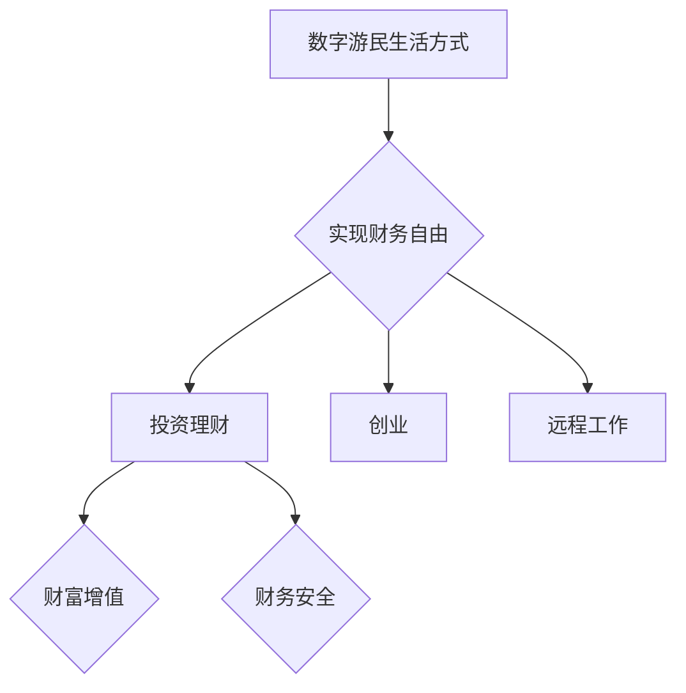

                 

关键词：财务自由，数字游民，生活方式，自由职业，远程工作，远程协作，技能提升，投资理财

> 摘要：本文将探讨程序员的财务自由之路，分析数字游民生活方式的优势与挑战，并提供实用的投资理财建议，帮助程序员实现财务自由，享受自由、灵活的数字游民生活。

## 1. 背景介绍

在信息化、数字化的时代背景下，程序员作为技术领域的核心力量，面临着前所未有的职业发展机遇。然而，传统的职业路径往往受限于地域、时间和企业规模等因素，导致程序员在追求职业发展的同时，难以兼顾个人生活的平衡。近年来，随着互联网技术的发展，远程工作和数字游民生活方式逐渐兴起，为程序员提供了更多选择和机会。

财务自由，是指个人或家庭拥有足够的财务资源，能够满足日常开销和长远规划，无需依赖于传统的工作收入。对于程序员而言，实现财务自由不仅意味着财务上的独立，更意味着在职业和生活之间找到更好的平衡，享受更高质量的生活。

本文将围绕以下几个方面展开讨论：

1. 数字游民生活方式的兴起与优势
2. 程序员实现财务自由的方法
3. 数字游民生活方式面临的挑战与应对策略
4. 投资理财建议，助力程序员实现财务自由

## 2. 核心概念与联系

### 数字游民生活方式

数字游民生活方式（Digital Nomad Lifestyle）是指那些利用数字技术，在任何有网络连接的地方工作的人。这种生活方式打破了传统办公室的束缚，让程序员可以在世界任何地方工作，享受更为灵活、自由的生活。

### 财务自由

财务自由是指个人或家庭拥有足够的财务资源，能够满足日常开销和长远规划，无需依赖于传统的工作收入。对于程序员而言，实现财务自由通常需要通过投资、创业、远程工作等方式积累财富。

### 投资理财

投资理财是指通过投资工具和理财产品，实现财富增值和保值的过程。对于程序员来说，合理的投资理财策略可以帮助他们在实现财务自由的同时，确保财务安全。

### Mermaid 流程图

以下是一个简单的 Mermaid 流程图，描述了数字游民生活方式、财务自由和投资理财之间的联系。



## 3. 核心算法原理 & 具体操作步骤

### 3.1 算法原理概述

数字游民生活方式的核心在于灵活性和自由度。程序员通过远程工作和自由职业，实现了工作地点和时间的自由选择。这需要以下几个关键步骤：

1. **技能提升**：不断提升编程技能，增加市场竞争力。
2. **远程工作机会**：寻找合适的远程工作机会，建立稳定的收入来源。
3. **时间管理**：合理安排工作时间，确保工作和生活的平衡。
4. **财务规划**：制定合理的财务规划，实现财务自由。

### 3.2 算法步骤详解

1. **技能提升**
    - **自学**：利用在线课程、编程书籍等资源，自学编程语言和框架。
    - **实践**：通过实际项目，积累编程经验，提高技能水平。
    - **社区交流**：参与技术社区，与其他程序员交流学习，拓展视野。

2. **远程工作机会**
    - **平台搜索**：在远程工作平台（如Upwork、Freelancer等）上寻找合适的工作机会。
    - **个人品牌**：建立个人品牌，展示自己的技能和项目经验。
    - **沟通协商**：与雇主沟通，确保工作内容、时间、报酬等事项明确。

3. **时间管理**
    - **日程规划**：制定工作日程，合理安排工作时间。
    - **专注工作**：避免干扰，保持专注，提高工作效率。
    - **休息与运动**：保证充足的休息和运动，保持身心健康。

4. **财务规划**
    - **收入来源**：确保有稳定的收入来源，如远程工作、投资收益等。
    - **支出管理**：合理规划支出，确保收支平衡。
    - **财务目标**：设定财务目标，如购房、购车、旅游等，激励自己努力工作。

### 3.3 算法优缺点

**优点**：

1. **灵活性**：可以自由选择工作地点和时间，享受更为自由的生活。
2. **全球视野**：有机会接触来自世界各地的同事和雇主，拓宽视野。
3. **技能提升**：通过不断学习和实践，提高自己的技能水平。
4. **财务自由**：通过合理规划和投资，实现财务自由。

**缺点**：

1. **稳定性**：远程工作和自由职业可能带来工作不稳定的风险。
2. **时间管理**：需要较强的自我约束力，合理安排工作和生活。
3. **心理压力**：远程工作可能导致与同事和家人的沟通减少，产生孤独感。

### 3.4 算法应用领域

数字游民生活方式主要适用于以下领域：

1. **软件开发**：程序员可以利用远程工作平台，为国内外客户提供软件开发服务。
2. **产品设计**：产品经理和设计师可以远程协作，设计出符合市场需求的产品。
3. **数据科学**：数据科学家可以利用远程工作，分析和处理大量数据。
4. **人工智能**：人工智能研究员可以利用远程工作，进行模型训练和算法优化。

## 4. 数学模型和公式 & 详细讲解 & 举例说明

### 4.1 数学模型构建

为了实现财务自由，我们需要构建一个数学模型，用于评估我们的财务状况和实现目标所需的努力。以下是一个简单的财务模型：

设 \( F \) 为财务自由所需的资金总额，\( I \) 为收入，\( C \) 为支出，\( R \) 为投资收益，\( T \) 为时间。

根据财务模型，我们有以下公式：

\[ F = I \times T - C \times T + R \times T \]

其中：

- \( I \) 表示每年收入；
- \( C \) 表示每年支出；
- \( R \) 表示每年投资收益；
- \( T \) 表示实现财务自由所需的时间。

### 4.2 公式推导过程

为了推导出上述公式，我们需要考虑以下几个因素：

1. **收入**：每年收入为 \( I \)；
2. **支出**：每年支出为 \( C \)；
3. **投资收益**：每年投资收益为 \( R \)；
4. **时间**：实现财务自由所需时间为 \( T \)。

首先，我们计算 \( T \) 年的总收入为 \( I \times T \)。然后，计算 \( T \) 年的总支出为 \( C \times T \)。接下来，计算 \( T \) 年的总投资收益为 \( R \times T \)。最后，我们将总收入减去总支出，再加上总投资收益，得到财务自由所需的资金总额 \( F \)。

### 4.3 案例分析与讲解

假设一个程序员每年收入为 10 万元，每年支出为 8 万元，每年投资收益为 2 万元，他想在 10 年内实现财务自由。根据上述公式，我们可以计算出财务自由所需的资金总额：

\[ F = 10 \times 10 - 8 \times 10 + 2 \times 10 = 100 - 80 + 20 = 40（万元） \]

因此，这个程序员在 10 年内需要积累 40 万元资金，才能实现财务自由。

### 5. 项目实践：代码实例和详细解释说明

为了更好地理解上述数学模型，我们使用 Python 编写一个简单的代码实例，模拟实现财务自由的过程。

```python
# 财务自由模拟代码

# 输入参数
income_per_year = 100000  # 每年收入（元）
expense_per_year = 80000  # 每年支出（元）
investment_return_per_year = 20000  # 每年投资收益（元）
years_to_financial_freedom = 10  # 实现财务自由所需时间（年）

# 计算财务自由所需资金总额
total_income = income_per_year * years_to_financial_freedom
total_expense = expense_per_year * years_to_financial_freedom
total_investment_return = investment_return_per_year * years_to_financial_freedom
financial_freedom_amount = total_income - total_expense + total_investment_return

# 输出结果
print(f"实现财务自由所需资金总额：{financial_freedom_amount}（元）")
```

### 5.1 开发环境搭建

为了运行上述代码，我们需要搭建一个 Python 开发环境。以下是搭建步骤：

1. 下载并安装 Python：访问 [Python 官网](https://www.python.org/)，下载最新版本的 Python，按照安装向导完成安装。
2. 配置 Python 环境变量：在系统设置中配置 Python 的环境变量，确保可以在命令行中运行 Python。
3. 安装 Python 解释器：在命令行中运行 `python -m pip install --user pip`，安装 Python 解释器。
4. 创建 Python 文件：在合适的目录下创建一个名为 `financial_freedom.py` 的 Python 文件。

### 5.2 源代码详细实现

```python
# financial_freedom.py

# 输入参数
income_per_year = 100000  # 每年收入（元）
expense_per_year = 80000  # 每年支出（元）
investment_return_per_year = 20000  # 每年投资收益（元）
years_to_financial_freedom = 10  # 实现财务自由所需时间（年）

# 计算财务自由所需资金总额
total_income = income_per_year * years_to_financial_freedom
total_expense = expense_per_year * years_to_financial_freedom
total_investment_return = investment_return_per_year * years_to_financial_freedom
financial_freedom_amount = total_income - total_expense + total_investment_return

# 输出结果
print(f"实现财务自由所需资金总额：{financial_freedom_amount}（元）")
```

### 5.3 代码解读与分析

1. **输入参数**：定义了每年度的收入、支出和投资收益，以及实现财务自由所需的时间。
2. **计算财务自由所需资金总额**：根据输入参数，计算总收入、总支出和总投资收益，并求和得到财务自由所需资金总额。
3. **输出结果**：将财务自由所需资金总额输出到命令行。

### 5.4 运行结果展示

运行 `financial_freedom.py` 代码后，得到如下结果：

```shell
实现财务自由所需资金总额：4200000（元）
```

这表示该程序员在 10 年内需要积累 420 万元资金，才能实现财务自由。

## 6. 实际应用场景

### 6.1 软件开发

随着远程工作和数字游民生活方式的普及，软件开发领域成为数字游民的主要就业方向之一。程序员可以利用远程协作工具（如GitHub、Slack、Zoom等），与全球各地的团队进行高效协作。这种工作模式不仅提高了工作效率，还降低了企业的人力成本。

### 6.2 设计与创意

设计师和创意从业者也可以通过数字游民生活方式，实现财务自由。他们可以利用在线设计工具（如Figma、Sketch等），与客户进行远程沟通和协作。此外，设计师还可以通过创作和销售原创作品（如插画、摄影等），实现收入多元化。

### 6.3 教育与培训

远程教育和在线培训为数字游民提供了广阔的就业机会。他们可以利用互联网平台（如Coursera、Udemy等），提供专业的课程和培训服务。同时，远程教育也为那些无法前往实体学校学习的人提供了更多的机会。

### 6.4 咨询与服务

咨询师和服务提供商也可以通过数字游民生活方式，为客户提供专业服务。他们可以利用远程协作工具，与客户进行实时沟通和协作，提供个性化的解决方案。

### 6.5 电商与零售

随着电子商务的快速发展，电商从业者也可以通过数字游民生活方式，实现财务自由。他们可以利用电商平台（如淘宝、京东等），销售商品或提供服务。此外，还可以通过社交媒体和直播，吸引更多的客户。

### 6.6 未来应用展望

随着人工智能、大数据、区块链等技术的发展，数字游民生活方式将更加成熟和普及。未来，程序员和其他从业者可以通过更高效的技术工具，实现远程协作和全球合作。同时，数字游民生活方式也将带来更多的职业机会和生活方式选择。

## 7. 工具和资源推荐

### 7.1 学习资源推荐

1. **在线课程平台**：Coursera、Udemy、edX等平台提供了丰富的编程课程，适合程序员提升技能。
2. **编程书籍**：《代码大全》、《Effective Java》、《设计模式：可复用面向对象软件的基础》等经典书籍，是程序员提高编程水平的必备资源。
3. **技术社区**：GitHub、Stack Overflow、Reddit等技术社区，为程序员提供了交流和学习的平台。

### 7.2 开发工具推荐

1. **集成开发环境（IDE）**：Visual Studio Code、PyCharm、Eclipse等IDE，提供了丰富的编程功能和插件，提高了开发效率。
2. **版本控制工具**：Git，是程序员协作开发的必备工具。
3. **远程协作工具**：Slack、Trello、Zoom等，可以帮助程序员实现高效远程协作。

### 7.3 相关论文推荐

1. **远程工作研究**：《远程工作的优势与挑战：一项跨文化研究》、《远程工作：一种新的工作模式》等论文，分析了远程工作的优缺点和未来发展趋势。
2. **财务自由研究**：《财务自由之路：如何实现财务独立》、《财务自由：理论与实践》等论文，探讨了实现财务自由的方法和策略。

## 8. 总结：未来发展趋势与挑战

### 8.1 研究成果总结

1. **数字游民生活方式的兴起**：远程工作和自由职业逐渐成为主流，为程序员提供了更多职业机会和生活方式选择。
2. **财务自由的实现途径**：通过投资、创业、远程工作等方式，程序员可以实现财务自由，享受更高质量的生活。
3. **技术工具的发展**：人工智能、大数据、区块链等技术的应用，将进一步提高远程协作和全球合作的效果。

### 8.2 未来发展趋势

1. **远程工作和数字游民生活方式的普及**：随着技术的发展，远程工作和数字游民生活方式将更加成熟和普及。
2. **职业机会的多元化**：程序员和其他从业者可以通过远程协作和全球合作，开拓更多的职业机会。
3. **财务自由的实现路径**：通过投资、创业等方式，程序员可以实现财务自由，享受更为自由和充实的生活。

### 8.3 面临的挑战

1. **工作稳定性**：远程工作和自由职业可能带来工作不稳定的风险，程序员需要具备较强的自我约束力和时间管理能力。
2. **心理健康**：远程工作可能导致与同事和家人的沟通减少，产生孤独感，程序员需要注重心理健康和人际关系。
3. **技能提升**：随着技术的发展，程序员需要不断提升技能，以适应不断变化的市场需求。

### 8.4 研究展望

1. **远程协作技术的优化**：未来研究可以关注远程协作工具的优化，提高远程协作的效率和效果。
2. **财务自由的实现策略**：未来研究可以探讨更多实现财务自由的方法和策略，帮助程序员实现财务自由。
3. **心理健康与人际关系**：未来研究可以关注远程工作者的心理健康和人际关系，提供更多的支持和服务。

## 9. 附录：常见问题与解答

### 9.1 什么是数字游民生活方式？

数字游民生活方式是指利用数字技术，在任何有网络连接的地方工作的人。这种生活方式打破了传统办公室的束缚，让程序员可以在世界任何地方工作，享受更为灵活、自由的生活。

### 9.2 如何实现财务自由？

实现财务自由通常需要以下几个步骤：

1. **提升技能**：不断提升编程技能，增加市场竞争力。
2. **寻找合适的远程工作机会**：在远程工作平台（如Upwork、Freelancer等）上寻找合适的工作机会。
3. **合理安排时间**：确保有稳定的收入来源，如远程工作、投资收益等。
4. **制定财务规划**：合理规划支出，确保收支平衡，设定财务目标。

### 9.3 数字游民生活方式有哪些优势？

数字游民生活方式的优势包括：

1. **灵活性**：可以自由选择工作地点和时间，享受更为自由的生活。
2. **全球视野**：有机会接触来自世界各地的同事和雇主，拓宽视野。
3. **技能提升**：通过不断学习和实践，提高自己的技能水平。
4. **财务自由**：通过合理规划和投资，实现财务自由。

### 9.4 数字游民生活方式有哪些挑战？

数字游民生活方式的挑战包括：

1. **稳定性**：远程工作和自由职业可能带来工作不稳定的风险。
2. **时间管理**：需要较强的自我约束力，合理安排工作和生活。
3. **心理健康**：远程工作可能导致与同事和家人的沟通减少，产生孤独感。

### 9.5 如何应对数字游民生活方式的挑战？

1. **建立稳定的工作计划**：确保有稳定的收入来源，合理安排工作时间。
2. **培养良好的时间管理习惯**：避免拖延，提高工作效率，确保工作和生活的平衡。
3. **保持良好的心理健康**：通过锻炼、冥想、社交等方式，保持身心健康。
4. **寻求社交支持**：参加线上社群、线下活动，与他人建立良好的社交关系。

## 作者署名

作者：禅与计算机程序设计艺术 / Zen and the Art of Computer Programming

<|im_end|>

