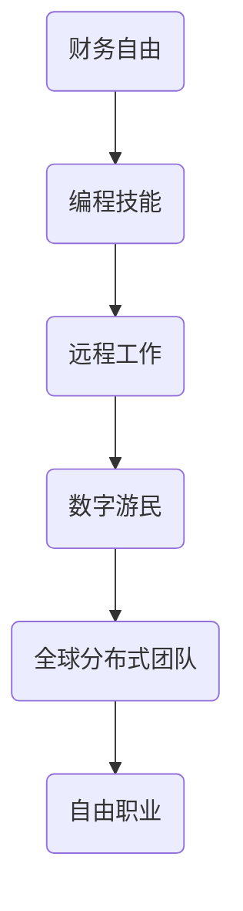

                 

关键词：财务自由，数字游民，生活方式，远程工作，编程技能，自由职业，国际远程合作，全球分布式团队

> 摘要：本文将探讨如何在现代信息技术背景下，通过编程技能实现财务自由，并介绍数字游民的生活方式。我们将分析数字游民的崛起、远程工作的优势、财务自由的定义和实现路径，以及所需的技能和资源。此外，还将讨论未来趋势、面临挑战以及推荐的工具和资源。

## 1. 背景介绍

在过去的几十年中，计算机技术的发展和互联网的普及彻底改变了我们的工作和生活方式。远程工作逐渐成为常态，尤其是对于程序员和IT专业人士来说，这种工作方式提供了前所未有的灵活性和自由度。数字游民（Digital Nomad）这一概念也应运而生，指的是那些利用互联网在全球范围内远程工作的人群。他们的生活不再是传统的朝九晚五模式，而是在全球各地旅行，同时保持专业的工作状态。

### 1.1 数字游民的崛起

数字游民的崛起得益于以下几个因素：

- **远程工作技术的成熟**：视频会议、即时通讯、项目管理工具和云存储的普及，使得远程协作变得更加容易。
- **自由职业市场的兴起**：越来越多的企业接受自由职业者的工作方式，为数字游民提供了丰富的就业机会。
- **互联网连接的普及**：全球范围内的互联网连接日益普及，使得数字游民可以随时随地工作。
- **生活方式的变革**：人们越来越追求自由、灵活和有意义的生活方式，数字游民的生活方式正满足了这一需求。

### 1.2 远程工作的优势

远程工作不仅为个人提供了灵活性，还为企业带来了许多好处：

- **全球人才池**：企业可以雇佣来自全球的顶尖人才，而不受地理位置限制。
- **成本节约**：远程工作可以减少办公场所的租赁和运营成本。
- **员工满意度和生产力提升**：远程工作使得员工可以更好地平衡工作和生活，提高工作效率和满意度。
- **环境友好**：减少通勤，降低碳排放，有助于环境保护。

## 2. 核心概念与联系

在探讨如何实现财务自由之前，我们需要明确几个核心概念和它们之间的关系。以下是一个简单的Mermaid流程图，用于说明这些概念之间的联系：



### 2.1 财务自由

财务自由是指个人拥有足够的资产和收入，能够不必依赖传统工作来维持生活。这通常意味着被动收入超过生活开支，从而实现生活自由和经济独立。

### 2.2 编程技能

编程技能是实现财务自由的关键。随着技术的进步，编程技能的需求不断增加，特别是在IT行业和自由职业市场中。

### 2.3 远程工作

远程工作为程序员提供了一个灵活的工作环境，可以自由选择工作时间和地点，这为财务自由的实现提供了可能。

### 2.4 数字游民

数字游民生活方式的核心是工作与旅行的结合，这种生活方式可以带来更多的自由和灵活性。

### 2.5 全球分布式团队

全球分布式团队为数字游民提供了工作机会，同时也为个人创造了多元化的职业发展空间。

## 3. 核心算法原理 & 具体操作步骤

### 3.1 算法原理概述

在实现财务自由的过程中，我们需要掌握一种核心算法，即“财务规划算法”。这个算法包括以下几个步骤：

1. **收入分析**：分析当前收入来源和收入结构。
2. **支出规划**：制定合理的支出计划，包括日常开支、储蓄和投资。
3. **投资规划**：根据风险承受能力和投资目标，制定投资策略。
4. **财务监控**：定期检查财务状况，调整规划和策略。

### 3.2 算法步骤详解

1. **收入分析**

   收入分析是财务规划的第一步。我们需要详细记录所有收入来源，包括工资、兼职、投资回报等。然后分析收入结构，确定哪些收入是最稳定的。

2. **支出规划**

   支出规划是控制开支的重要环节。我们需要列出所有固定开支（如房租、水电费）和可变开支（如饮食、交通）。然后根据收入情况，设定每月的支出预算，并严格执行。

3. **投资规划**

   投资规划是为了实现财务自由的长远目标。我们需要根据自己的风险承受能力和投资目标，选择合适的投资方式，如股票、债券、房地产等。同时，需要定期监控投资组合的表现，并进行必要的调整。

4. **财务监控**

   财务监控是确保财务规划有效执行的关键。我们需要定期检查自己的财务状况，包括收入、支出和投资回报。如果发现偏离目标，需要及时调整规划和策略。

### 3.3 算法优缺点

**优点**：

- **灵活性**：可以根据实际情况随时调整财务规划。
- **适应性**：适用于不同收入水平和投资目标的个人。
- **长期性**：有助于实现长期财务自由。

**缺点**：

- **复杂性**：需要花费一定的时间和精力进行财务分析和规划。
- **风险性**：投资决策可能面临市场波动和风险。

### 3.4 算法应用领域

财务规划算法可以广泛应用于各种场景，包括：

- **个人财务管理**：帮助个人实现财务自由。
- **企业财务管理**：为企业提供财务规划和投资建议。
- **金融机构**：为投资者提供财务分析和投资策略。

## 4. 数学模型和公式 & 详细讲解 & 举例说明

在实现财务自由的过程中，数学模型和公式发挥着重要作用。以下是一个简单的数学模型，用于计算月度储蓄目标。

### 4.1 数学模型构建

假设：

- **年收入**：\(A\)
- **年支出**：\(B\)
- **年储蓄率**：\(R\)
- **年度储蓄目标**：\(S\)

则数学模型为：

\[ S = A \times R - B \]

### 4.2 公式推导过程

年度储蓄目标的推导过程如下：

\[ \text{年度储蓄目标} = \text{年收入} \times \text{年储蓄率} - \text{年支出} \]

这个公式反映了年度储蓄目标的计算方法。其中，年收入和年支出是已知量，年储蓄率是设定目标时需要考虑的参数。

### 4.3 案例分析与讲解

假设一个程序员的年收入为50,000美元，年支出为30,000美元，希望实现年储蓄率50%的目标。则年度储蓄目标为：

\[ S = 50,000 \times 0.5 - 30,000 = 10,000 \]

这意味着该程序员需要在年度内储蓄10,000美元，才能实现财务自由的目标。

### 4.4 案例分析与讲解

为了更直观地理解这个数学模型，我们可以通过一个实际案例进行说明。

假设一个自由职业者月收入为10,000元人民币，月支出为6,000元人民币，年储蓄率为50%。

1. **年收入**：

\[ A = 10,000 \times 12 = 120,000 \text{元人民币} \]

2. **年支出**：

\[ B = 6,000 \times 12 = 72,000 \text{元人民币} \]

3. **年储蓄率**：

\[ R = 0.5 \]

4. **年度储蓄目标**：

\[ S = 120,000 \times 0.5 - 72,000 = 48,000 \text{元人民币} \]

这意味着这个自由职业者需要在年度内储蓄48,000元人民币，才能实现财务自由的目标。

## 5. 项目实践：代码实例和详细解释说明

### 5.1 开发环境搭建

为了实现上述数学模型，我们可以使用Python编程语言进行开发。首先，我们需要安装Python和Jupyter Notebook。

1. 安装Python：

   ```
   # 在命令行中执行以下命令
   pip install python
   ```

2. 安装Jupyter Notebook：

   ```
   pip install jupyter
   ```

### 5.2 源代码详细实现

以下是一个简单的Python代码示例，用于计算年度储蓄目标。

```python
# 年度储蓄目标计算器

def calculate_saving_target(yearly_income, yearly_expense, saving_rate):
    annual_saving_target = (yearly_income * saving_rate) - yearly_expense
    return annual_saving_target

# 输入参数
yearly_income = float(input("请输入年收入（元）："))
yearly_expense = float(input("请输入年支出（元）："))
saving_rate = float(input("请输入年储蓄率（百分比）："))

# 计算年度储蓄目标
saving_target = calculate_saving_target(yearly_income, yearly_expense, saving_rate)

# 输出结果
print(f"您的年度储蓄目标为：{saving_target}元")
```

### 5.3 代码解读与分析

这个Python代码示例非常简单，主要分为以下几个部分：

1. **函数定义**：

   ```python
   def calculate_saving_target(yearly_income, yearly_expense, saving_rate):
       annual_saving_target = (yearly_income * saving_rate) - yearly_expense
       return annual_saving_target
   ```

   这个函数用于计算年度储蓄目标。它接受三个参数：年收入、年支出和年储蓄率，并返回年度储蓄目标。

2. **输入参数**：

   ```python
   yearly_income = float(input("请输入年收入（元）："))
   yearly_expense = float(input("请输入年支出（元）："))
   saving_rate = float(input("请输入年储蓄率（百分比）："))
   ```

   这些语句用于从用户处获取输入参数，并将它们转换为浮点数。

3. **计算年度储蓄目标**：

   ```python
   saving_target = calculate_saving_target(yearly_income, yearly_expense, saving_rate)
   ```

   这一行调用函数，计算年度储蓄目标，并将其存储在变量`saving_target`中。

4. **输出结果**：

   ```python
   print(f"您的年度储蓄目标为：{saving_target}元")
   ```

   这一行将计算出的年度储蓄目标显示在屏幕上。

### 5.4 运行结果展示

运行上述代码后，程序将提示用户输入年收入、年支出和年储蓄率。以下是可能的输入和输出示例：

```
请输入年收入（元）：100000
请输入年支出（元）：50000
请输入年储蓄率（百分比）：0.5
您的年度储蓄目标为：25000.0元
```

这意味着该用户需要在年度内储蓄25,000元人民币，才能实现财务自由的目标。

## 6. 实际应用场景

### 6.1 数字游民

数字游民是财务自由的典型代表。他们利用编程技能在全球范围内远程工作，同时享受旅行和探索世界的乐趣。以下是一个数字游民的日常应用场景：

- **早晨**：在东南亚的海滩边开始一天的工作，通过视频会议与全球的客户和团队沟通。
- **上午**：在咖啡馆或共享办公空间工作，处理项目任务和开发代码。
- **下午**：参加在线培训课程，提升自己的编程技能。
- **晚上**：在当地的餐厅品尝美食，与朋友聚会，享受夜生活。

### 6.2 自由职业者

自由职业者通常以项目为基础，为不同的客户提供编程服务。以下是一个自由职业者的实际应用场景：

- **上午**：与客户进行视频会议，讨论项目需求和技术方案。
- **下午**：开发项目代码，进行单元测试和调试。
- **晚上**：撰写技术文档，记录项目进展和总结。

### 6.3 全球分布式团队

全球分布式团队的企业通常采用远程工作模式，通过互联网实现团队协作。以下是一个全球分布式团队的日常应用场景：

- **早晨**：团队成员在世界各地通过视频会议开始一天的工作。
- **上午**：各国团队成员分别处理各自的任务，通过即时通讯工具保持沟通。
- **下午**：进行跨时区的团队会议，讨论项目进展和下一步计划。
- **晚上**：团队成员在业余时间参与社区活动，提升团队凝聚力和企业文化。

## 7. 未来应用展望

随着技术的不断进步，财务自由和数字游民生活方式将继续发展。以下是对未来应用场景的展望：

- **人工智能与自动化**：人工智能和自动化技术的应用将进一步提高远程工作的效率和灵活性，减少对传统工作地点的依赖。
- **虚拟现实与增强现实**：虚拟现实（VR）和增强现实（AR）技术的发展将提供更加沉浸式的远程工作体验，使得远程工作更加真实和高效。
- **区块链技术**：区块链技术的应用将提高数字游民和自由职业者的支付和交易安全，促进全球范围内的合作和交流。
- **可持续发展**：随着全球对环境保护的重视，数字游民生活方式将进一步推动可持续发展和绿色出行。

## 8. 工具和资源推荐

### 8.1 学习资源推荐

- **在线编程课程**：Coursera、edX、Udemy等平台上提供了丰富的编程课程，涵盖各种编程语言和技能。
- **技术社区**：GitHub、Stack Overflow、Reddit等技术社区是程序员获取技术知识和交流经验的宝库。
- **博客和论坛**：诸如Medium、Dev.to等博客平台以及专业论坛是了解最新技术动态和趋势的好去处。

### 8.2 开发工具推荐

- **集成开发环境（IDE）**：如Visual Studio Code、Eclipse、IntelliJ IDEA等。
- **版本控制工具**：如Git、GitHub、GitLab等。
- **项目管理工具**：如Trello、Jira、Asana等。
- **云服务平台**：如AWS、Google Cloud、Azure等，提供计算资源、存储服务和应用程序部署。

### 8.3 相关论文推荐

- **《分布式系统：概念与设计》**：作者George Coulouris等，深入介绍了分布式系统的基本概念和设计原则。
- **《区块链：从入门到实战》**：作者唐小引，详细介绍了区块链技术的基本原理和应用场景。
- **《人工智能：一种现代方法》**：作者Stuart Russell和Peter Norvig，全面介绍了人工智能的基本理论和应用。

## 9. 总结：未来发展趋势与挑战

### 9.1 研究成果总结

本文通过对财务自由、数字游民生活方式、远程工作、编程技能等概念的分析，总结了实现财务自由的关键要素和路径。我们探讨了财务规划算法的原理和应用，并提供了一个实际的项目实践案例。此外，我们还展望了未来技术的发展趋势和应用场景。

### 9.2 未来发展趋势

- **远程工作的普及**：随着技术的进步，远程工作将继续普及，成为企业运营和个人职业发展的主流模式。
- **自由职业市场的壮大**：自由职业者将在全球范围内形成庞大的市场，提供丰富的就业机会和商业机会。
- **数字游民生活方式的多元化**：数字游民的生活方式将更加多样化，满足不同人群的需求，包括家庭、单身的年轻人、退休人士等。
- **技术的深度融合**：人工智能、区块链、虚拟现实等新兴技术将进一步与远程工作和数字游民生活方式融合，提供更加智能和高效的解决方案。

### 9.3 面临的挑战

- **技术依赖**：过度依赖技术可能导致个人技能单一，面临被淘汰的风险。
- **信息安全**：远程工作和数字游民生活方式可能面临信息安全和隐私保护的挑战。
- **文化差异**：全球分布式团队可能面临文化差异和沟通障碍，影响协作效率。
- **心理压力**：远程工作和数字游民生活方式可能导致工作与生活的界限模糊，增加心理压力。

### 9.4 研究展望

未来的研究可以进一步探讨：

- **数字游民生活方式的可持续发展**：研究如何实现数字游民生活方式的可持续发展，包括环境保护、社会责任等方面。
- **远程工作与家庭教育**：研究远程工作如何与家庭教育相结合，提高家庭生活质量。
- **跨文化沟通**：研究跨文化沟通的策略和方法，提高全球分布式团队的协作效率。
- **技能培训与教育**：研究如何为数字游民和自由职业者提供持续的技能培训和职业发展支持。

## 9. 附录：常见问题与解答

### 9.1 什么是财务自由？

财务自由是指个人拥有足够的资产和收入，能够不必依赖传统工作来维持生活。这通常意味着被动收入超过生活开支，从而实现生活自由和经济独立。

### 9.2 数字游民和远程工作的区别是什么？

数字游民通常是指那些利用互联网在全球范围内远程工作，并在旅行中维持工作状态的人群。而远程工作则是一种工作方式，不限定工作地点，可以在任何有网络连接的地方进行工作。

### 9.3 如何开始成为数字游民？

开始成为数字游民的第一步是掌握一项或多项远程工作所需的技能，如编程、设计、写作等。其次，建立良好的工作习惯和时间管理能力，确保工作效率。最后，寻找适合远程工作的机会，如自由职业平台、远程工作招聘网站等。

### 9.4 如何保持工作与生活的平衡？

保持工作与生活的平衡需要良好的时间管理和自我约束。建议制定明确的工作计划，设定工作时间和休息时间。此外，定期锻炼、培养兴趣爱好，与家人和朋友保持联系，有助于缓解工作压力。

### 9.5 数字游民的生活方式适合所有人吗？

数字游民的生活方式适合追求自由、灵活和有意义生活方式的人群。然而，这种生活方式也可能带来孤独、文化差异和心理压力等挑战。因此，是否选择成为数字游民应根据个人的价值观、生活方式和个人需求进行权衡。


### 作者署名

> 作者：禅与计算机程序设计艺术 / Zen and the Art of Computer Programming

