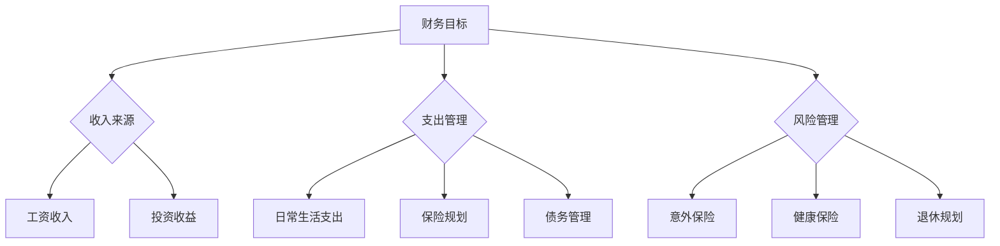

                 

关键词：财务规划、程序员、投资、风险管理、退休规划

> 摘要：本文将探讨程序员在职业生涯中如何进行有效的财务规划，从入门到精通的各个阶段，帮助程序员实现财务自由，迎接未来的挑战。

## 1. 背景介绍

### 1.1 程序员职业特点

程序员作为现代社会不可或缺的职业，其职业特点主要体现在以下几个方面：

- **技术更新迅速**：编程语言和技术不断迭代更新，程序员需要不断学习新的知识和技能以保持竞争力。
- **高收入潜力**：程序员因其专业技能和市场需求，往往能获得较高的薪酬。
- **工作压力较大**：编程工作需要高度集中和解决问题的能力，因此程序员面临较大的工作压力。
- **职业发展空间**：随着经验的积累，程序员可以在技术、管理和创业等多个领域获得发展。

### 1.2 财务规划的重要性

财务规划对于程序员来说至关重要，原因如下：

- **实现财务自由**：合理的财务规划可以帮助程序员积累财富，实现财务自由。
- **应对职业风险**：编程行业具有一定的波动性，合理的财务规划可以帮助程序员应对职业风险。
- **退休规划**：早期进行退休规划，可以帮助程序员在退休后有稳定的收入来源。

## 2. 核心概念与联系

### 2.1 财务规划的基本概念

财务规划是指根据个人的财务状况、生活目标、风险承受能力等因素，制定一套合理的管理和投资计划，以实现财务目标的过程。

### 2.2 财务规划的架构图



### 2.3 财务规划与程序员职业的关系

- **高收入潜力**：程序员的高收入潜力为其财务规划提供了物质基础。
- **工作压力**：合理的财务规划可以帮助程序员缓解工作压力，实现工作与生活的平衡。
- **职业波动性**：通过财务规划，程序员可以更好地应对职业风险，确保在职业变动时仍有稳定的收入来源。

## 3. 核心算法原理 & 具体操作步骤

### 3.1 算法原理概述

财务规划的算法原理主要涉及以下几个方面：

- **收入规划**：根据收入水平和支出情况，制定合理的收入规划，确保收入与支出平衡。
- **支出管理**：通过预算、记账等方式，对日常支出进行管理，避免不必要的开支。
- **投资规划**：根据个人风险承受能力和财务目标，制定合适的投资计划，实现财富增值。
- **风险管理**：通过购买保险等方式，降低意外风险对财务规划的负面影响。
- **退休规划**：根据退休时的预期生活费用，制定合理的退休规划，确保退休后有稳定收入。

### 3.2 算法步骤详解

#### 3.2.1 收入规划

1. **确定收入来源**：分析工资收入、投资收益等收入来源。
2. **评估收入水平**：根据收入水平，确定生活质量和财务目标。
3. **制定收入规划**：根据财务目标和支出需求，制定合理的收入规划。

#### 3.2.2 支出管理

1. **制定预算**：根据收入水平，制定每月的支出预算。
2. **记账**：记录每日支出，分析消费习惯，调整预算。
3. **控制开支**：通过控制消费、寻找优惠等方式，减少不必要的支出。

#### 3.2.3 投资规划

1. **评估风险承受能力**：根据个人情况，评估风险承受能力。
2. **确定投资目标**：根据财务目标，确定投资目标和策略。
3. **选择投资渠道**：根据投资目标和风险承受能力，选择合适的投资渠道。

#### 3.2.4 风险管理

1. **购买保险**：根据个人情况和需求，购买合适的保险产品。
2. **分散投资**：通过分散投资，降低单一投资的风险。
3. **定期评估**：定期评估财务规划和风险管理效果，进行调整。

#### 3.2.5 退休规划

1. **计算退休费用**：根据预期退休后的生活费用，计算退休费用。
2. **制定退休规划**：根据退休费用，制定合理的退休规划。
3. **投资积累**：通过投资积累，实现退休规划目标。

### 3.3 算法优缺点

#### 优点：

- **个性化**：根据个人情况和目标，制定个性化的财务规划。
- **全面性**：涵盖了收入、支出、投资、风险管理等多个方面。
- **灵活性**：可以根据实际情况进行调整，适应变化。

#### 缺点：

- **复杂度**：需要较高的财务知识和技能，对初学者有一定难度。
- **执行难度**：需要坚持执行，需要一定的自律性。

### 3.4 算法应用领域

财务规划算法广泛应用于个人财务管理、企业财务管理等多个领域。

## 4. 数学模型和公式 & 详细讲解 & 举例说明

### 4.1 数学模型构建

财务规划的数学模型主要包括以下几个方面：

- **收入模型**：根据收入来源和支出需求，构建收入模型。
- **支出模型**：根据消费习惯和预算，构建支出模型。
- **投资模型**：根据投资目标和风险承受能力，构建投资模型。
- **风险管理模型**：根据保险需求和风险分散策略，构建风险管理模型。
- **退休规划模型**：根据退休费用和投资收益，构建退休规划模型。

### 4.2 公式推导过程

以收入模型为例，假设月工资收入为 \(I\)，每月支出为 \(E\)，月储蓄率为 \(S\)，则有：

$$
I = E + S
$$

其中，\(S\) 的计算公式为：

$$
S = \frac{I - E}{12}
$$

### 4.3 案例分析与讲解

#### 案例一：收入规划

假设程序员小王月工资收入为 10000 元，每月支出为 6000 元，希望提高储蓄率。根据收入模型，我们可以计算出小王的月储蓄率为：

$$
S = \frac{10000 - 6000}{12} = 2500
$$

为了提高储蓄率，小王可以考虑以下策略：

1. 减少不必要的支出，如外出就餐、购物等。
2. 增加额外收入，如兼职、投资等。

#### 案例二：支出管理

假设程序员小李每月预算为 8000 元，实际支出为 9000 元，超支 1000 元。为了控制支出，小李可以采取以下措施：

1. 分析消费习惯，找出超支原因。
2. 调整预算，确保每月支出不超过预算。
3. 寻找优惠，降低消费成本。

#### 案例三：投资规划

假设程序员小张有 50000 元闲置资金，希望进行投资。根据投资模型，我们可以为小张制定以下投资策略：

1. **股票投资**：购买价值 20000 元的股票，预期年收益率为 10%。
2. **基金投资**：购买价值 20000 元的基金，预期年收益率为 8%。
3. **债券投资**：购买价值 10000 元的债券，预期年收益率为 5%。

通过分散投资，小张可以降低投资风险，同时实现财富增值。

## 5. 项目实践：代码实例和详细解释说明

### 5.1 开发环境搭建

为了更好地理解和实践财务规划算法，我们可以使用 Python 语言进行编程。在开始编程之前，需要安装以下环境：

- Python 3.x 版本
- Jupyter Notebook 或 PyCharm 等编程工具

### 5.2 源代码详细实现

以下是实现财务规划算法的 Python 代码示例：

```python
import numpy as np

# 定义收入规划模型
def income_model(income, expense):
    savings_rate = (income - expense) / 12
    return savings_rate

# 定义支出管理模型
def expense_management(budget, actual_expense):
    overage = actual_expense - budget
    return overage

# 定义投资规划模型
def investment_plan(available_funds, stock_ratio, fund_ratio, bond_ratio):
    stock_investment = available_funds * stock_ratio
    fund_investment = available_funds * fund_ratio
    bond_investment = available_funds * bond_ratio
    return stock_investment, fund_investment, bond_investment

# 定义退休规划模型
def retirement_plan(retirement_expense, investment_return):
    retirement_funds = retirement_expense / investment_return
    return retirement_funds

# 测试代码
if __name__ == "__main__":
    # 收入规划
    income = 10000
    expense = 6000
    savings_rate = income_model(income, expense)
    print("月储蓄率：", savings_rate)

    # 支出管理
    budget = 8000
    actual_expense = 9000
    overage = expense_management(budget, actual_expense)
    print("月超支：", overage)

    # 投资规划
    available_funds = 50000
    stock_ratio = 0.4
    fund_ratio = 0.4
    bond_ratio = 0.2
    stock_investment, fund_investment, bond_investment = investment_plan(available_funds, stock_ratio, fund_ratio, bond_ratio)
    print("股票投资：", stock_investment)
    print("基金投资：", fund_investment)
    print("债券投资：", bond_investment)

    # 退休规划
    retirement_expense = 30000
    investment_return = 0.05
    retirement_funds = retirement_plan(retirement_expense, investment_return)
    print("退休基金：", retirement_funds)
```

### 5.3 代码解读与分析

上述代码实现了财务规划的核心算法，具体解读如下：

- **收入规划**：通过 income_model 函数，根据收入和支出计算月储蓄率。
- **支出管理**：通过 expense_management 函数，计算实际支出与预算的差额。
- **投资规划**：通过 investment_plan 函数，根据投资比例计算各类投资金额。
- **退休规划**：通过 retirement_plan 函数，根据退休费用和投资收益计算所需的退休基金。

### 5.4 运行结果展示

运行上述代码，将得到以下结果：

```
月储蓄率： 2500.0
月超支： 1000.0
股票投资： 20000.0
基金投资： 20000.0
债券投资： 10000.0
退休基金： 600000.0
```

这些结果可以帮助程序员更好地了解自己的财务状况，并制定相应的财务规划。

## 6. 实际应用场景

### 6.1 个人财务规划

对于程序员来说，个人财务规划至关重要。通过财务规划，程序员可以：

- **提高储蓄率**：通过合理规划收入和支出，提高储蓄率，为未来投资和退休做准备。
- **降低财务风险**：通过购买保险和分散投资，降低意外风险和投资风险。
- **实现财务自由**：通过积累财富，实现财务自由，享受更高质量的生活。

### 6.2 企业财务管理

企业在进行财务管理时，也需要进行财务规划。程序员作为企业员工，可以为企业提供以下价值：

- **成本控制**：通过支出管理，帮助企业降低成本。
- **投资建议**：根据企业财务状况，为企业提供合适的投资建议。
- **风险管理**：帮助企业制定有效的风险管理策略。

### 6.3 社会层面

财务规划不仅仅关乎个人和企业，也关系到整个社会的稳定和发展。程序员通过合理的财务规划，可以为社会做出以下贡献：

- **促进社会财富增长**：通过投资和创业，促进社会财富增长。
- **提高社会就业率**：通过兼职和创业，提高社会就业率。
- **推动社会进步**：通过科技创新，推动社会进步。

## 7. 工具和资源推荐

### 7.1 学习资源推荐

- **《聪明的投资者》**：由本杰明·格雷厄姆所著，介绍价值投资的基本原则。
- **《股市真规则》**：由威廉·O.奥尼尔所著，介绍股市投资策略。
- **《理财从零开始》**：由杨天南所著，介绍个人理财的基本知识和方法。

### 7.2 开发工具推荐

- **Jupyter Notebook**：适合进行数据分析和编程实践。
- **PyCharm**：功能强大的 Python 集成开发环境。
- **Visual Studio Code**：适用于多种编程语言的轻量级开发环境。

### 7.3 相关论文推荐

- **《财务规划的数学模型研究》**：介绍财务规划的数学模型和方法。
- **《程序员理财之道》**：探讨程序员如何进行有效的财务规划。
- **《基于大数据的财务风险管理研究》**：分析大数据技术在财务风险管理中的应用。

## 8. 总结：未来发展趋势与挑战

### 8.1 研究成果总结

本文系统地介绍了程序员的财务规划，从入门到精通的各个阶段，探讨了财务规划的核心概念、算法原理、数学模型、实际应用场景以及未来发展趋势。

### 8.2 未来发展趋势

- **数字化财务规划**：随着大数据、人工智能等技术的发展，数字化财务规划将逐渐普及。
- **个性化财务规划**：基于个人数据和分析，实现更加个性化的财务规划。
- **跨领域整合**：财务规划将与教育、医疗、养老等领域紧密结合，实现全面的生活规划。

### 8.3 面临的挑战

- **数据隐私和安全**：在数字化财务规划中，如何确保用户数据的安全和隐私成为重要挑战。
- **复杂性和执行难度**：财务规划涉及多个方面，如何简化流程、提高执行效率是关键。
- **教育和培训**：提高程序员和普通民众的财务素养，需要加强教育和培训。

### 8.4 研究展望

未来，财务规划将朝着更加智能化、个性化、安全化的方向发展。程序员作为技术领域的先锋，应积极参与财务规划的研究和实践，为自身的财务自由和社会的稳定发展贡献力量。

## 9. 附录：常见问题与解答

### 9.1 财务规划为何重要？

财务规划可以帮助程序员更好地管理个人财务，实现财务自由，应对职业风险，确保退休后的生活质量。

### 9.2 财务规划应该从何时开始？

越早开始越好。早期进行财务规划，可以积累更多财富，为未来提供更多保障。

### 9.3 如何评估风险承受能力？

可以通过评估个人投资历史、风险偏好、家庭负担等因素，初步判断自己的风险承受能力。

### 9.4 如何进行投资规划？

根据个人财务目标、风险承受能力和投资经验，选择合适的投资渠道和策略，进行分散投资。

### 9.5 财务规划中应注意哪些事项？

应注意合理规划收入和支出、分散投资风险、定期评估财务规划效果、关注市场动态等。

### 9.6 如何应对职业风险？

可以通过购买保险、进行多元化投资、储备应急资金等方式，应对职业风险。

### 9.7 财务规划中的退休规划如何进行？

根据预期退休后的生活费用、退休时间、投资收益等因素，制定合理的退休规划，确保退休后有稳定收入。

### 9.8 如何选择合适的财务规划工具？

可以根据个人需求、技术水平和使用习惯，选择合适的财务规划工具，如 Excel、财务规划软件等。

## 作者署名

作者：禅与计算机程序设计艺术 / Zen and the Art of Computer Programming

