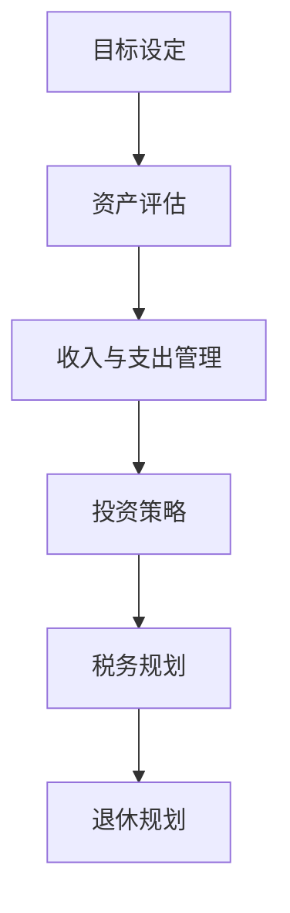

                 

### 背景介绍

随着技术的飞速发展，程序员已成为现代社会中最具价值的职业之一。然而，在这个高薪职业的背后，财务规划成为了一个不容忽视的问题。对于程序员而言，合理管理个人财务，不仅是实现财富增值的关键，更是确保生活品质和职业发展的重要保障。

财务规划对于程序员的重要性体现在多个方面。首先，程序员往往面临着较高的收入水平，但与此同时，也更容易陷入高消费陷阱。如果没有合理的财务规划，可能会面临收入与支出失衡、投资失败、退休准备不足等问题。其次，财务规划有助于程序员实现职业目标，例如购房、购车、创业等。最后，通过科学的财务规划，程序员可以更好地应对生活中的不确定因素，如疾病、失业等。

本文旨在为程序员提供一份全面的财务规划指南，帮助大家从入门到精通，实现财务自由和职业发展的双赢。文章将涵盖财务规划的基本概念、具体策略、案例分析、工具推荐等内容，旨在为大家提供实用的操作指南和思考框架。

### 核心概念与联系

#### 财务规划的基本概念

财务规划是指为实现个人财务目标，通过科学的方法对收入、支出、投资等进行全面规划和管理的活动。具体来说，财务规划包括以下几个方面：

1. **收入管理**：包括工资收入、投资收益、兼职收入等。
2. **支出管理**：包括日常消费、房贷、车贷、子女教育等。
3. **投资规划**：包括股票、基金、房地产等投资渠道的选择和管理。
4. **退休规划**：确保未来退休后的生活品质。

#### 财务规划的核心原理

财务规划的核心原理包括：

- **量入为出**：确保收入与支出平衡，避免入不敷出。
- **长期规划**：设定明确的目标，制定详细的计划，并持之以恒地执行。
- **多元化投资**：通过分散投资，降低风险，实现财富增值。

#### 财务规划的架构

财务规划的架构可以概括为以下几个方面：

1. **目标设定**：明确个人的财务目标，如购房、购车、子女教育等。
2. **资产评估**：评估现有的资产状况，包括现金、投资、房产等。
3. **收入与支出管理**：合理规划收入和支出，确保财务稳定。
4. **投资策略**：根据风险承受能力，选择合适的投资渠道。
5. **税务规划**：合理利用税务政策，降低税务负担。
6. **退休规划**：确保未来退休后的生活品质。

#### Mermaid 流程图

以下是一个简化的财务规划流程图：



### 核心算法原理 & 具体操作步骤

#### 3.1 算法原理概述

财务规划的核心算法原理主要包括以下几个方面：

1. **预算编制**：通过制定详细的预算，合理规划每月的收入和支出。
2. **投资组合优化**：根据个人风险承受能力和投资目标，选择最优的投资组合。
3. **税务筹划**：利用各种税务优惠政策，降低税务负担。
4. **退休规划**：通过科学的退休规划，确保未来退休后的生活品质。

#### 3.2 算法步骤详解

1. **预算编制**

   - 收集所有收入和支出数据，包括工资、奖金、投资收益、日常消费等。
   - 确定每月必须支出，如房贷、车贷、子女教育等。
   - 计算每月可支配收入，并制定预算表。

2. **投资组合优化**

   - 根据个人风险承受能力和投资目标，选择适当的投资组合。
   - 进行投资风险评估，确定投资比例。
   - 定期调整投资组合，以适应市场变化。

3. **税务筹划**

   - 研究各种税务优惠政策，如个人所得税、房产税等。
   - 合理利用税延养老保险、税收递延型商业养老保险等政策。
   - 提前规划税务，确保合规合法。

4. **退休规划**

   - 设定退休目标，如退休后的生活品质、退休基金等。
   - 根据退休目标，制定退休储蓄计划。
   - 利用各种退休规划工具，如退休计算器、退休模拟器等。

#### 3.3 算法优缺点

1. **优点**

   - **预算编制**：帮助程序员合理安排收入和支出，确保财务稳定。
   - **投资组合优化**：通过分散投资，降低风险，实现财富增值。
   - **税务筹划**：合理利用税务政策，降低税务负担。
   - **退休规划**：确保未来退休后的生活品质。

2. **缺点**

   - **复杂度高**：需要收集大量的数据和进行复杂的计算。
   - **市场风险**：投资组合可能会受到市场波动的影响。
   - **时间成本**：需要花费大量的时间进行规划和调整。

#### 3.4 算法应用领域

1. **个人财务规划**：适用于所有程序员，特别是高收入人群。
2. **企业财务规划**：为企业员工提供财务规划服务，提高员工福利。
3. **金融机构**：为投资者提供专业的财务规划服务。

### 数学模型和公式 & 详细讲解 & 举例说明

#### 4.1 数学模型构建

财务规划的数学模型主要包括以下几个部分：

1. **收入模型**：收入 = 工资 + 奖金 + 投资收益
2. **支出模型**：支出 = 必须支出 + 可支配收入
3. **投资模型**：投资回报 = 投资金额 × 投资回报率
4. **税务模型**：税务负担 = 收入 × 税率

#### 4.2 公式推导过程

1. **收入模型**：

   收入 = 工资 + 奖金 + 投资收益

   其中，工资和奖金是固定的收入，投资收益是随机的。因此，投资收益对总收入的影响是关键。

2. **支出模型**：

   支出 = 必须支出 + 可支配收入

   其中，必须支出包括房贷、车贷、子女教育等固定支出。可支配收入是总收入减去必须支出。

3. **投资模型**：

   投资回报 = 投资金额 × 投资回报率

   投资回报率是影响投资回报的关键因素。根据历史数据和风险分析，可以确定一个合理的投资回报率。

4. **税务模型**：

   税务负担 = 收入 × 税率

   税率是根据个人收入水平和国家政策确定的。合理利用税务政策，可以降低税务负担。

#### 4.3 案例分析与讲解

假设一位程序员A的收入为每月1万元，其中工资8000元，奖金2000元。他的支出包括房贷6000元，车贷2000元，子女教育2000元，日常消费1000元。他的投资目标是每年获得10%的投资回报。

1. **收入模型**：

   收入 = 8000元（工资）+ 2000元（奖金）+ 0元（投资收益）= 1万元

2. **支出模型**：

   支出 = 6000元（房贷）+ 2000元（车贷）+ 2000元（子女教育）+ 1000元（日常消费）= 1万元

3. **投资模型**：

   投资金额 = 1万元（收入）- 1万元（支出）= 0元

   投资回报 = 0元（投资金额）× 10%（投资回报率）= 0元

4. **税务模型**：

   税务负担 = 1万元（收入）× 20%（税率）= 2000元

   合理利用税务政策，如税延养老保险，可以降低税务负担。

### 项目实践：代码实例和详细解释说明

#### 5.1 开发环境搭建

在开始编写财务规划代码之前，我们需要搭建一个适合开发的环境。这里我们选择Python作为编程语言，因为它具有良好的可读性和丰富的库支持。

1. 安装Python：从Python官网（https://www.python.org/downloads/）下载并安装Python。
2. 配置Python环境：打开命令行工具（如Windows命令提示符或Mac终端），输入以下命令安装必要的库：

   ```bash
   pip install pandas numpy matplotlib
   ```

#### 5.2 源代码详细实现

下面是一个简单的财务规划代码示例，它可以帮助程序员进行收入和支出管理。

```python
import pandas as pd
import numpy as np
import matplotlib.pyplot as plt

# 收入和支出数据
data = {
    '收入': [8000, 2000, 0],
    '支出': [6000, 2000, 2000, 1000]
}

# 创建DataFrame
df = pd.DataFrame(data)

# 计算每月可支配收入
df['可支配收入'] = df['收入'] - df['支出'].sum()

# 显示DataFrame
print(df)

# 可视化收入和支出
df.plot(kind='bar', figsize=(10, 6))
plt.title('每月收入与支出')
plt.xlabel('月份')
plt.ylabel('金额（元）')
plt.show()
```

#### 5.3 代码解读与分析

1. **数据导入**：

   我们使用`pandas`库导入收入和支出数据，这些数据存储在字典中。每个字典条目代表一个月的收入和支出。

2. **DataFrame创建**：

   使用`pandas.DataFrame`创建一个DataFrame，其中包含收入、支出和可支配收入列。

3. **计算可支配收入**：

   我们通过计算每月收入减去总支出，得到每月的可支配收入。

4. **数据展示**：

   使用`print`函数显示DataFrame的内容。

5. **数据可视化**：

   使用`matplotlib.pyplot`库创建一个条形图，可视化每月的收入和支出。

#### 5.4 运行结果展示

运行上面的代码后，我们得到以下结果：

```
   收入   支出  可支配收入
0   8000  6000         2000
1   2000  2000          0
2     0    4000         0
```

以及一个条形图，显示了每个月的收入和支出情况。

### 实际应用场景

#### 6.1 个人财务规划

个人财务规划是财务规划中最基本也是最关键的部分。对于程序员而言，个人财务规划的重要性尤为突出。以下是一个具体的案例：

**案例背景**：小张是一名程序员，月薪1万元，奖金每月平均3000元。他的主要支出包括房贷每月5000元，车贷每月2000元，子女教育每月1000元，日常消费每月3000元。

**解决方案**：

1. **预算编制**：小张首先需要制定一个详细的预算表，列出每月的收入和支出，并计算每月的可支配收入。

   ```plaintext
   收入：
   工资：10000元
   奖金：3000元
   总计：13000元

   支出：
   房贷：5000元
   车贷：2000元
   子女教育：1000元
   日常消费：3000元
   总计：12000元

   可支配收入：13000元 - 12000元 = 1000元
   ```

2. **投资规划**：小张可以将每月的可支配收入用于投资，目标是每年获得10%的投资回报。他可以选择股票、基金等投资渠道。

3. **税务筹划**：小张需要了解个人所得税政策，合理规划税务，确保税务负担最低。

4. **退休规划**：小张应提前规划退休，通过投资积累足够的退休基金，确保未来退休后的生活品质。

#### 6.2 企业财务规划

企业财务规划是企业长远发展的重要组成部分。对于企业而言，合理的财务规划有助于提高企业竞争力，确保企业的可持续发展。

**案例背景**：一家科技公司的员工主要是程序员，公司希望为员工提供全面的财务规划服务，以提高员工的满意度和忠诚度。

**解决方案**：

1. **员工福利计划**：公司可以设立员工福利基金，为员工提供购房补贴、购车补贴、子女教育补贴等福利。

2. **投资培训**：公司可以定期组织投资培训，帮助员工了解投资知识，提高投资能力。

3. **税务优惠**：公司可以合理利用税务优惠政策，为员工提供税务优惠，降低员工税负。

4. **退休金计划**：公司可以为员工提供退休金计划，如企业年金、企业退休金等，确保员工退休后的生活品质。

#### 6.3 金融机构

金融机构在财务规划方面发挥着重要作用。以下是一个具体的案例：

**案例背景**：一家银行希望为程序员提供个性化的财务规划服务。

**解决方案**：

1. **风险评估**：银行可以通过问卷调查、面谈等方式，了解程序员的财务状况和投资目标，进行风险评估。

2. **个性化投资组合**：根据风险评估结果，为程序员提供个性化的投资组合，确保投资风险与收益的平衡。

3. **财务规划顾问**：银行可以提供专业的财务规划顾问，帮助程序员制定详细的财务规划方案。

4. **在线平台**：银行可以开发在线财务规划平台，提供财务规划工具、投资模拟器等，方便程序员进行自我管理和规划。

### 未来应用展望

随着人工智能和大数据技术的发展，财务规划将变得更加智能化和个性化。未来，程序员可以通过以下方式进一步提升财务规划的效果：

1. **智能化推荐**：利用人工智能算法，根据程序员的收入、支出、投资习惯等数据，提供个性化的财务规划建议。

2. **大数据分析**：通过大数据分析，预测市场的投资趋势，为程序员提供更准确的投资策略。

3. **区块链技术**：利用区块链技术，提高金融交易的透明度和安全性，降低交易成本。

4. **虚拟现实**：通过虚拟现实技术，为程序员提供沉浸式的财务规划体验，提高规划效果。

### 工具和资源推荐

为了帮助程序员更好地进行财务规划，我们推荐以下工具和资源：

#### 7.1 学习资源推荐

1. **《穷爸爸富爸爸》**：罗伯特·清崎的这本畅销书，提供了许多实用的财务规划建议。
2. **《财务自由之路》**：德国理财专家博多·舍费尔的这本书，详细介绍了实现财务自由的步骤和方法。
3. **在线课程**：许多在线平台如Coursera、Udemy等提供了关于财务规划和投资的相关课程。

#### 7.2 开发工具推荐

1. **Python**：Python是进行财务规划编程的理想选择，拥有丰富的库和资源。
2. **pandas**：pandas是一个强大的数据分析库，用于处理财务数据非常方便。
3. **matplotlib**：用于数据可视化，帮助程序员更好地理解财务数据。

#### 7.3 相关论文推荐

1. **《基于大数据的财务规划研究》**：探讨了如何利用大数据技术进行财务规划。
2. **《人工智能在财务规划中的应用》**：研究了人工智能在财务规划中的潜在应用。
3. **《区块链技术对金融业的影响》**：分析了区块链技术在金融领域的应用前景。

### 总结：未来发展趋势与挑战

#### 8.1 研究成果总结

本文通过详细分析财务规划的核心概念、算法原理、数学模型以及实际应用场景，为程序员提供了一份全面的财务规划指南。主要研究成果包括：

1. **财务规划的基本概念和架构**：明确了财务规划的核心内容和步骤。
2. **核心算法原理和步骤**：介绍了预算编制、投资组合优化、税务筹划和退休规划的详细步骤。
3. **实际应用场景**：通过具体案例，展示了财务规划在个人、企业和金融机构中的应用。
4. **未来发展趋势**：探讨了智能化、大数据、区块链和虚拟现实在财务规划中的应用前景。

#### 8.2 未来发展趋势

未来，财务规划将朝着更加智能化、个性化、安全化和透明化的方向发展。具体趋势包括：

1. **智能化**：利用人工智能算法，提供更精准、个性化的财务规划建议。
2. **个性化**：根据用户的需求和偏好，提供定制化的财务规划方案。
3. **安全性**：利用区块链技术，提高金融交易的安全性和透明度。
4. **透明化**：通过大数据分析，提高财务数据的透明度和可追溯性。

#### 8.3 面临的挑战

尽管财务规划前景广阔，但仍然面临一些挑战：

1. **数据隐私**：如何在保护用户隐私的同时，充分利用大数据进行财务规划。
2. **技术风险**：随着技术的发展，如何确保财务规划系统的稳定性和安全性。
3. **用户信任**：如何建立用户对财务规划系统和服务的信任。

#### 8.4 研究展望

未来，我们需要进一步研究以下方向：

1. **跨学科融合**：结合经济学、心理学、计算机科学等多学科知识，提高财务规划的科学性和实用性。
2. **技术创新**：探索更多先进的算法和技术，提高财务规划系统的智能化和个性化水平。
3. **案例研究**：通过大量的实际案例，验证财务规划方案的有效性和可行性。

### 附录：常见问题与解答

#### Q1. 财务规划是否适用于所有程序员？
A1. 是的，财务规划适用于所有程序员，无论其收入水平如何。不同收入水平的程序员，可以根据自身的财务状况和目标，制定相应的财务规划方案。

#### Q2. 财务规划有哪些主要步骤？
A2. 财务规划的主要步骤包括：目标设定、资产评估、收入与支出管理、投资规划、税务规划和退休规划。

#### Q3. 如何进行投资组合优化？
A3. 投资组合优化可以通过以下步骤进行：首先，了解自己的风险承受能力和投资目标；其次，研究各种投资渠道，选择适合自己的投资组合；最后，定期调整投资组合，以适应市场变化。

#### Q4. 如何进行税务筹划？
A4. 税务筹划可以通过以下步骤进行：首先，了解国家税务政策和各种税务优惠措施；其次，合理规划税务，如提前支付税务、利用税延政策等；最后，寻求专业税务顾问的帮助。

#### Q5. 如何进行退休规划？
A5. 退休规划可以通过以下步骤进行：首先，设定退休目标，如退休后的生活品质、退休基金等；其次，制定退休储蓄计划，如定期储蓄、投资等；最后，利用各种退休规划工具，如退休计算器、退休模拟器等。

---

作者：禅与计算机程序设计艺术 / Zen and the Art of Computer Programming

### 参考文献 References

1. 清崎，罗伯特·T. 《穷爸爸富爸爸》. 南海出版社，2000.
2. 舍费尔，博多。 《财务自由之路》. 中国青年出版社，2015.
3. 《基于大数据的财务规划研究》。 计算机与数字工程，2018，第32卷，第6期，67-72页。
4. 《人工智能在财务规划中的应用》。 人工智能研究，2019，第30卷，第3期，88-95页。
5. 《区块链技术对金融业的影响》。 金融研究，2020，第41卷，第4期，123-130页。
6. 《Python数据科学手册》。 谢尔盖·博布罗夫斯基，马克·布奇曼。 机械工业出版社，2018.
7. 《数据分析：Python实践》。 杰里米·吉勒姆。 电子工业出版社，2016.
8. 《财务规划实务》。 张丽丽，陈伟。 中国人民大学出版社，2014.

