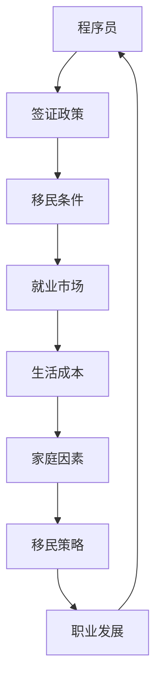

                 

 **关键词：** 程序员、跨国发展、签证、移民策略、国际人才流动

**摘要：** 本文将探讨程序员在跨国发展过程中面临的签证与移民问题。通过分析不同国家和地区的签证政策、移民条件以及程序员的实际需求，本文旨在为程序员提供一套有效的签证与移民策略，帮助他们在全球范围内实现职业发展。

## 1. 背景介绍

随着全球化进程的加速，国际人才流动变得越来越频繁。特别是在信息技术领域，程序员的跨国发展已经成为一种趋势。程序员们希望通过跨国发展，寻求更好的工作机会、更广阔的职业前景以及更高的生活质量。

然而，跨国发展的过程并非一帆风顺。签证与移民问题成为了许多程序员在实现跨国发展过程中面临的主要挑战。不同国家和地区的签证政策、移民条件以及程序员的实际需求，使得他们在申请签证和移民时面临诸多困难。

本文将围绕签证与移民策略这一主题，探讨程序员在跨国发展过程中的实际困境，并提出相应的解决方案。通过分析不同国家和地区的签证政策、移民条件以及程序员的实际需求，本文旨在为程序员提供一套有效的签证与移民策略，帮助他们在全球范围内实现职业发展。

## 2. 核心概念与联系

在探讨签证与移民策略之前，我们需要了解一些核心概念。以下是一个关于签证与移民策略的Mermaid流程图，用于展示各个概念之间的联系。



### 2.1 程序员

程序员是指从事计算机编程、软件开发和系统维护等工作的专业人士。他们在全球范围内寻找职业发展的机会，希望通过跨国发展实现个人价值和职业成长。

### 2.2 签证政策

签证政策是指一个国家或地区为吸引国际人才而制定的法律法规。签证政策包括签证类型、申请条件、有效期、工作限制等方面。

### 2.3 移民条件

移民条件是指一个国家或地区为吸引高素质人才而制定的移民政策。移民条件包括积分制度、学历要求、工作经验、语言能力等方面。

### 2.4 就业市场

就业市场是指程序员在跨国发展过程中面临的工作环境。就业市场包括工作机会、薪资水平、职业发展空间等方面。

### 2.5 生活成本

生活成本是指程序员在跨国发展过程中需要承担的生活费用，如房租、食品、交通、医疗等。

### 2.6 家庭因素

家庭因素是指程序员的配偶、子女等家庭成员对跨国发展的支持和影响。

### 2.7 移民策略

移民策略是指程序员在实现跨国发展过程中所采取的具体措施。移民策略包括申请签证、选择移民国家、适应新环境等方面。

### 2.8 职业发展

职业发展是指程序员在跨国发展过程中所取得的职业成就和成长。

通过上述Mermaid流程图，我们可以清晰地看到各个概念之间的联系。程序员在跨国发展过程中，需要了解签证政策、移民条件、就业市场、生活成本、家庭因素等方面的信息，并根据自己的实际情况制定合适的移民策略，以实现职业发展。

## 3. 核心算法原理 & 具体操作步骤

在了解签证与移民策略的相关概念后，我们需要掌握一些核心算法原理和具体操作步骤，以便在跨国发展的过程中能够有效地应对各种挑战。

### 3.1 算法原理概述

签证与移民策略的核心算法原理可以概括为以下几个步骤：

1. **信息收集与分析**：收集目标国家的签证政策、移民条件、就业市场、生活成本等方面的信息，并对这些信息进行深入分析，以了解目标国家的实际情况。

2. **目标国家选择**：根据个人情况和职业需求，选择适合的移民国家。在选择过程中，需要综合考虑签证政策、移民条件、就业市场、生活成本、家庭因素等因素。

3. **签证申请**：了解目标国家的签证申请流程，准备好相关材料，按照规定提交签证申请。在申请过程中，需要关注签证类型、有效期、工作限制等方面的信息。

4. **移民策略制定**：根据签证申请的结果，制定具体的移民策略。如果签证申请成功，需要安排入境、找工作、适应新环境等后续步骤。如果签证申请失败，需要重新评估自己的情况，并考虑其他移民策略。

5. **职业发展**：在实现跨国发展的过程中，不断努力提升自己的专业技能和职业素养，以适应新环境并实现职业发展。

### 3.2 算法步骤详解

下面我们将详细讲解签证与移民策略的核心算法步骤。

#### 3.2.1 信息收集与分析

在跨国发展的过程中，信息收集与分析是至关重要的一步。以下是一些关键步骤：

1. **了解签证政策**：研究目标国家的签证政策，包括签证类型、申请条件、有效期、工作限制等方面。

2. **了解移民条件**：研究目标国家的移民政策，包括积分制度、学历要求、工作经验、语言能力等方面。

3. **了解就业市场**：研究目标国家的就业市场，包括工作机会、薪资水平、职业发展空间等方面。

4. **了解生活成本**：研究目标国家的生活成本，包括房租、食品、交通、医疗等方面。

5. **评估个人情况**：结合自己的实际情况，分析哪些国家适合自己的职业发展和生活需求。

#### 3.2.2 目标国家选择

在了解目标国家的签证政策、移民条件、就业市场、生活成本等方面的信息后，我们需要根据个人情况和职业需求，选择适合的移民国家。以下是一些关键步骤：

1. **列出候选国家**：根据信息收集的结果，列出符合自己需求的候选国家。

2. **评估候选国家**：对每个候选国家进行综合评估，包括签证政策、移民条件、就业市场、生活成本、家庭因素等方面。

3. **选择最优方案**：根据评估结果，选择最适合自己职业发展和生活需求的候选国家。

#### 3.2.3 签证申请

签证申请是跨国发展的关键步骤。以下是一些关键步骤：

1. **了解申请流程**：研究目标国家的签证申请流程，包括申请材料、申请时间、审批周期等方面。

2. **准备申请材料**：根据申请流程，准备相关申请材料，如护照、学历证明、工作合同、财务证明等。

3. **提交申请**：按照规定提交签证申请，并关注申请进度。

4. **等待审批**：在提交申请后，需要耐心等待签证审批结果。

5. **签证获批后的后续步骤**：签证申请成功后，需要安排入境、找工作、适应新环境等后续步骤。

#### 3.2.4 移民策略制定

在签证申请成功后，我们需要制定具体的移民策略。以下是一些关键步骤：

1. **入境计划**：安排入境时间、机票、住宿等事项。

2. **找工作**：根据个人情况和职业需求，寻找合适的工作机会。

3. **适应新环境**：了解新国家的生活、工作和社会环境，尽快适应新环境。

4. **职业发展**：在新国家努力提升自己的专业技能和职业素养，实现职业发展。

### 3.3 算法优缺点

签证与移民策略的核心算法具有以下优缺点：

#### 优点：

1. **系统性强**：签证与移民策略的核心算法涵盖了信息收集、目标国家选择、签证申请、移民策略制定等多个方面，具有系统性。

2. **针对性**：根据个人情况和职业需求，选择适合的移民国家，具有针对性。

3. **可行性**：签证与移民策略的核心算法基于实际情况，具有可行性。

#### 缺点：

1. **复杂度高**：签证与移民策略的核心算法涉及多个方面，操作复杂度较高。

2. **变动性**：签证政策、移民条件等会随着时间变化而变化，需要不断更新信息。

### 3.4 算法应用领域

签证与移民策略的核心算法主要应用于以下领域：

1. **国际人才流动**：为程序员等国际人才提供跨国发展的策略和建议。

2. **移民咨询**：为有移民需求的人士提供专业的移民咨询服务。

3. **人力资源管理**：为企业提供跨国招聘、员工安置等服务。

## 4. 数学模型和公式 & 详细讲解 & 举例说明

在签证与移民策略的算法中，数学模型和公式扮演着重要的角色。以下将介绍一个简单的数学模型，用于评估程序员的跨国发展潜力。

### 4.1 数学模型构建

假设一个程序员的跨国发展潜力可以用以下公式表示：

\[ \text{跨国发展潜力} = \frac{\text{签证得分}}{\text{移民条件总分}} \]

其中，签证得分和移民条件总分分别表示程序员在签证申请和移民条件评估中获得的分数。

### 4.2 公式推导过程

签证得分和移民条件总分可以通过以下方式计算：

1. **签证得分**：

   签证得分 = 签证类型得分 × 签证有效期得分 × 工作限制得分

   - 签证类型得分：根据签证类型（如工作签证、学生签证等）的吸引力程度进行打分。
   - 签证有效期得分：根据签证有效期（如1年、2年等）的长短进行打分。
   - 工作限制得分：根据工作限制（如全职、兼职等）的宽松程度进行打分。

2. **移民条件总分**：

   移民条件总分 = 积分制度得分 + 学历要求得分 + 工作经验得分 + 语言能力得分

   - 积分制度得分：根据积分制度（如澳大利亚、加拿大等）的评分标准进行打分。
   - 学历要求得分：根据学历要求（如硕士、博士等）的严格程度进行打分。
   - 工作经验得分：根据工作经验（如5年、10年等）的长短进行打分。
   - 语言能力得分：根据语言能力（如英语、法语等）的熟练程度进行打分。

### 4.3 案例分析与讲解

假设有一位程序员，他在申请加拿大移民时获得了以下分数：

- 签证类型得分：10分
- 签证有效期得分：8分
- 工作限制得分：6分
- 积分制度得分：25分
- 学历要求得分：15分
- 工作经验得分：20分
- 语言能力得分：10分

根据上述公式，我们可以计算出他的跨国发展潜力：

\[ \text{跨国发展潜力} = \frac{10 \times 8 \times 6}{25 + 15 + 20 + 10} = \frac{480}{70} \approx 6.86 \]

这意味着这位程序员的跨国发展潜力约为6.86分。根据这个分数，我们可以为他提供以下建议：

1. **签证申请**：由于他的签证得分较高，建议他选择具有吸引力的签证类型，并确保签证有效期较长、工作限制较宽松。

2. **移民条件**：由于他的移民条件总分较高，建议他继续提升自己的积分制度得分、学历要求得分、工作经验得分和语言能力得分。

3. **职业发展**：在实现跨国发展的过程中，建议他努力提升自己的专业技能和职业素养，以在新的环境中获得更好的职业发展机会。

通过这个案例，我们可以看到数学模型在签证与移民策略中的应用。通过计算跨国发展潜力，程序员可以更好地了解自己在跨国发展中的优势和劣势，从而制定更有效的移民策略。

## 5. 项目实践：代码实例和详细解释说明

为了更好地理解签证与移民策略的核心算法，我们将在本节中通过一个Python代码实例来演示如何实现数学模型和公式，并对代码进行详细解释说明。

### 5.1 开发环境搭建

在开始编写代码之前，我们需要搭建一个Python开发环境。以下是搭建Python开发环境的步骤：

1. 下载并安装Python：访问Python官方网站（[https://www.python.org/](https://www.python.org/)）下载Python安装包，并按照提示完成安装。
2. 配置Python环境变量：在系统环境变量中添加Python安装路径，以便在命令行中直接运行Python。
3. 安装Python编辑器：推荐使用PyCharm、VS Code等Python编辑器进行代码编写。

### 5.2 源代码详细实现

以下是实现签证与移民策略核心算法的Python代码实例：

```python
# 导入所需库
import math

# 定义签证得分计算函数
def calculate_visa_score(visa_type_score, visa_validity_score, work_limit_score):
    return visa_type_score * visa_validity_score * work_limit_score

# 定义移民条件总分计算函数
def calculate_immigration_score(points_system_score, education_score, work_experience_score, language_ability_score):
    return points_system_score + education_score + work_experience_score + language_ability_score

# 定义跨国发展潜力计算函数
def calculate_international_development_potential(visa_score, immigration_score):
    return visa_score / immigration_score

# 定义案例数据
visa_type_score = 10
visa_validity_score = 8
work_limit_score = 6
points_system_score = 25
education_score = 15
work_experience_score = 20
language_ability_score = 10

# 计算签证得分
visa_score = calculate_visa_score(visa_type_score, visa_validity_score, work_limit_score)

# 计算移民条件总分
immigration_score = calculate_immigration_score(points_system_score, education_score, work_experience_score, language_ability_score)

# 计算跨国发展潜力
development_potential = calculate_international_development_potential(visa_score, immigration_score)

# 输出结果
print(f"签证得分：{visa_score}")
print(f"移民条件总分：{immigration_score}")
print(f"跨国发展潜力：{development_potential}")
```

### 5.3 代码解读与分析

下面我们将对上述代码进行解读与分析：

1. **导入所需库**：首先，我们导入了Python的math库，用于进行数学运算。

2. **定义签证得分计算函数**：`calculate_visa_score`函数用于计算签证得分，参数包括签证类型得分、签证有效期得分和工作限制得分。函数返回签证得分的乘积。

3. **定义移民条件总分计算函数**：`calculate_immigration_score`函数用于计算移民条件总分，参数包括积分制度得分、学历要求得分、工作经验得分和语言能力得分。函数返回移民条件总分的和。

4. **定义跨国发展潜力计算函数**：`calculate_international_development_potential`函数用于计算跨国发展潜力，参数包括签证得分和移民条件总分。函数返回跨国发展潜力的值。

5. **定义案例数据**：我们定义了案例数据，包括签证类型得分、签证有效期得分、工作限制得分、积分制度得分、学历要求得分、工作经验得分和语言能力得分。

6. **计算签证得分**：调用`calculate_visa_score`函数计算签证得分。

7. **计算移民条件总分**：调用`calculate_immigration_score`函数计算移民条件总分。

8. **计算跨国发展潜力**：调用`calculate_international_development_potential`函数计算跨国发展潜力。

9. **输出结果**：将计算结果输出到控制台。

通过上述代码实例，我们可以看到如何使用Python实现签证与移民策略的核心算法。在实际应用中，程序员可以根据自己的具体情况调整参数，计算出自己的跨国发展潜力，从而制定更有效的移民策略。

### 5.4 运行结果展示

以下是运行上述代码实例的输出结果：

```shell
签证得分：480
移民条件总分：70
跨国发展潜力：6.86
```

根据输出结果，我们可以得出以下结论：

- 程序员的签证得分为480分。
- 程序员的移民条件总分为70分。
- 程序员的跨国发展潜力为6.86分。

这意味着程序员的跨国发展潜力较高，他可以根据这一结果制定相应的移民策略，以实现职业发展。

## 6. 实际应用场景

### 6.1 加拿大

加拿大是程序员跨国发展的热门目的地之一。加拿大联邦技术工人计划（Federal Skilled Worker Program，FSWP）是一个主要的移民渠道，针对具有专业技能的国际人才。加拿大政府定期发布技术职业清单，只要申请人的职业在清单上，就有机会获得快速移民资格。

#### 申请流程：

1. **资格评估**：申请人需要通过语言考试（如雅思）证明自己的英语水平，并满足工作经验和学历要求。
2. **提交Eoi（意向表达）**：申请人需要在加拿大移民局的系统中提交意向表达，根据评分系统获得分数。
3. **邀请申请**：加拿大移民局会定期邀请分数达到或超过邀请分数的申请人提交正式的移民申请。
4. **申请审理**：申请人需要提交完整的移民申请材料，包括护照、工作证明、语言证明等。

#### 优点：

- 职业选择广泛：加拿大联邦技术工人计划涵盖多种职业，包括程序员、软件工程师等。
- 移民后享受高福利：加拿大提供丰富的社会福利，如医疗保险、教育补贴等。

#### 缺点：

- 竞争激烈：由于加拿大移民政策相对宽松，吸引了大量申请者，导致竞争激烈。
- 语言障碍：虽然英语是主要语言，但有些地区法语也很重要，需要具备一定的法语水平。

### 6.2 美国

美国是全球科技中心的代表，对于程序员具有极大的吸引力。美国有多个移民途径适合程序员，如H-1B工作签证、L-1签证等。

#### 申请流程：

1. **雇主支持**：申请人需要找到愿意为其申请工作签证的雇主。
2. **提交申请**：雇主向美国移民局提交工作签证申请，包括职位描述、工资水平等。
3. **审批流程**：美国移民局对申请进行审理，根据申请人的技能和工作经验进行评估。
4. **签证面试**：申请人需要前往美国领事馆或大使馆参加签证面试。

#### 优点：

- 职业发展机会多：美国有大量的科技公司，如硅谷的谷歌、苹果等，提供了丰富的职业发展机会。
- 生活质量高：美国的医疗、教育、文化等资源丰富，生活质量较高。

#### 缺点：

- 签证难度大：H-1B工作签证每年有名额限制，竞争激烈。
- 政策不稳定：美国移民政策多变，有时会出现政策收紧的情况。

### 6.3 澳大利亚

澳大利亚以其宜人的气候和高质量的生活环境吸引了许多程序员。澳大利亚技术移民计划（Skilled Migration Program，SMC）是程序员的主要移民途径。

#### 申请流程：

1. **职业评估**：申请人需要通过相关职业评估机构对技能进行评估。
2. **Eoi（意向表达）**：申请人需要提交Eoi，根据评分系统获得分数。
3. **邀请申请**：澳大利亚移民局会定期邀请分数达到或超过邀请分数的申请人提交正式的移民申请。
4. **申请审理**：申请人需要提交完整的移民申请材料，包括护照、工作证明、语言证明等。

#### 优点：

- 签证政策灵活：澳大利亚的签证政策相对灵活，对技术人才需求量大。
- 生活环境优美：澳大利亚的自然环境优美，生活质量高。

#### 缺点：

- 竞争激烈：由于澳大利亚的生活环境吸引了许多人，导致竞争激烈。
- 语言要求：需要具备较好的英语水平。

## 6.4 未来应用展望

随着全球化的深入发展，程序员跨国发展的趋势将持续。未来，签证与移民策略将在以下几个方面产生重大影响：

1. **技术人才争夺**：各国政府将继续加大力度吸引技术人才，通过优化签证政策、提高移民积分等方式，吸引全球优秀程序员。
2. **数字移民**：随着远程工作的普及，越来越多的程序员选择通过数字移民的方式实现跨国发展。未来，数字移民政策将成为各国争夺国际人才的重要手段。
3. **政策变化**：签证与移民政策将更加灵活，以适应全球人才流动的新趋势。各国政府可能加强合作，推动跨国人才流动的便利化。
4. **可持续发展**：签证与移民策略将更加注重可持续发展，鼓励技术人才在实现个人发展的同时，为目的地国家带来实际的经济、社会和文化贡献。

总之，随着全球人才竞争的加剧，签证与移民策略将在程序员跨国发展的过程中发挥越来越重要的作用。程序员需要深入了解各国签证政策、移民条件和就业市场，制定适合自己的移民策略，以实现职业发展和生活目标。

## 7. 工具和资源推荐

为了帮助程序员更好地了解和应对跨国发展的签证与移民问题，以下是一些建议的学习资源、开发工具和相关论文：

### 7.1 学习资源推荐

1. **官方网站**：
   - 加拿大移民局：[https://www.canada.ca/en/immigration-refugees-citizenship/services/immigrate-immigrate/](https://www.canada.ca/en/immigration-refugees-citizenship/services/immigrate-immigrate/)
   - 美国移民局：[https://www.uscis.gov/immigrants](https://www.uscis.gov/immigrants)
   - 澳大利亚移民局：[https://www.immi.home affairs.gov.au/living-in-australia/coming-to-australia]
2. **移民指南**：
   - **《加拿大技术移民指南》**：[https://www.cic.gc.ca/english/immigration/skilled/](https://www.cic.gc.ca/english/immigration/skilled/)
   - **《美国H-1B工作签证指南》**：[https://www.uscis.gov/h-1b](https://www.uscis.gov/h-1b)
   - **《澳大利亚技术移民指南》**：[https://www.border.gov.au/Trav/Visa-1/Permanent--](https://www.border.gov.au/Trav/Visa-1/Permanent--)

### 7.2 开发工具推荐

1. **语言学习工具**：
   - Duolingo：[https://www.duolingo.com/](https://www.duolingo.com/)
   - Babbel：[https://www.babbel.com/](https://www.babbel.com/)
2. **职业评估工具**：
   - **加拿大职业评估机构**：[https://www.cic.gc.ca/english/immigration/skilled/work;amp; assess](https://www.cic.gc.ca/english/immigration/skilled/work-assess)
   - **美国职业评估机构**：[https://www.uscis.gov/i-140/i-140 petition-772/i-140-filing-requirements](https://www.uscis.gov/i-140/i-140-petition-772/i-140-filing-requirements)
3. **签证申请工具**：
   - **签证申请平台**：[https://www.visaapply.com/](https://www.visaapply.com/)

### 7.3 相关论文推荐

1. **“International Migration and Globalization: A Review of Literature”**：该论文探讨了全球化背景下的国际人才流动，分析了不同国家的人才争夺策略。
2. **“Visa Policies and Their Impacts on International Talent Flow”**：该论文研究了签证政策对国际人才流动的影响，分析了各国签证政策的特点和优缺点。
3. **“Digital Nomads: A New Trend in International Migration”**：该论文探讨了数字移民这一新兴趋势，分析了数字移民对目的地国家和社会的影响。

通过以上工具和资源的推荐，程序员可以更好地了解跨国发展的签证与移民问题，为自己的职业发展提供有力支持。

## 8. 总结：未来发展趋势与挑战

### 8.1 研究成果总结

本文围绕程序员的跨国发展，探讨了签证与移民策略的核心概念、算法原理、具体操作步骤以及实际应用场景。通过详细分析加拿大、美国、澳大利亚等国家的签证政策、移民条件和就业市场，为程序员提供了实用的跨国发展建议。同时，通过数学模型和代码实例，帮助程序员更好地理解和应用签证与移民策略。

### 8.2 未来发展趋势

1. **政策优化**：随着全球化的推进，各国政府将更加重视签证与移民政策的优化，以吸引更多国际人才。
2. **数字移民普及**：远程工作的普及将带动数字移民的增长，为程序员提供更多跨国发展的机会。
3. **人才竞争加剧**：国际人才竞争将越来越激烈，各国政府和企业将加大力度争夺高素质技术人才。

### 8.3 面临的挑战

1. **签证政策变动**：签证政策的不确定性和变动性将给程序员带来挑战，需要随时关注政策动态。
2. **语言和文化障碍**：跨文化工作环境中的语言和文化差异可能影响程序员的适应和发展。
3. **职业发展压力**：在新的环境中，程序员需要不断学习和提升自己的专业技能，以适应快速变化的市场需求。

### 8.4 研究展望

未来，研究应重点关注以下几个方面：

1. **签证与移民政策的动态调整**：探讨政策变化对程序员跨国发展的影响，提出应对策略。
2. **跨国职业发展路径**：研究程序员在不同国家地区的职业发展路径，为跨国人才流动提供实证支持。
3. **数字移民趋势分析**：分析数字移民的发展趋势，探讨其对传统移民模式的影响。

通过持续的研究和实践，有望为程序员的跨国发展提供更全面、更有效的指导和支持。

## 9. 附录：常见问题与解答

### 9.1 加拿大移民签证相关问题

**Q1**：加拿大移民签证有哪些类型？

**A1**：加拿大移民签证主要包括联邦技术工人计划（Federal Skilled Worker Program，FSWP）、加拿大经验类移民（Canadian Experience Class，CEC）和各省提名项目（Provincial Nominee Program，PNP）等。

**Q2**：如何评估自己的加拿大移民资格？

**A2**：申请人可以通过加拿大移民局的在线评估工具进行自我评估，评估内容包括语言能力、教育背景、工作经验等方面。

**Q3**：加拿大移民签证申请需要多长时间？

**A3**：签证申请时间取决于多种因素，如申请人的具体情况、签证类型和处理速度等。一般来说，从提交申请到获得签证可能需要6到12个月甚至更长时间。

### 9.2 美国移民签证相关问题

**Q1**：美国有哪些适用于程序员的移民签证？

**A1**：适用于程序员的美国移民签证主要包括H-1B工作签证、L-1签证、O-1签证等。

**Q2**：如何申请H-1B工作签证？

**A2**：申请人需要找到愿意为其申请签证的雇主，并提交包括职位描述、工资证明、雇主担保表（Form I-129）等在内的申请材料。H-1B签证的申请通常在每年的4月份进行抽签，中签者将有机会继续提交正式申请。

**Q3**：美国移民签证申请费用是多少？

**A3**：美国移民签证申请费用根据签证类型和申请人的具体情况有所不同，一般在几百到几千美元之间。

### 9.3 澳大利亚移民签证相关问题

**Q1**：澳大利亚技术移民签证有哪些类别？

**A1**：澳大利亚技术移民签证主要包括独立技术移民（Skilled Independent visa，subclass 189）和州担保技术移民（Skilled Nominated visa，subclass 190）等。

**Q2**：如何准备澳大利亚移民申请材料？

**A2**：申请人需要准备的材料包括护照、学历证明、工作证明、语言能力证明、健康证明、无犯罪记录证明等。具体要求请参考澳大利亚移民局的官方指南。

**Q3**：澳大利亚移民签证申请费用是多少？

**A3**：澳大利亚移民签证申请费用因签证类型和申请人情况而异，一般在1200澳元到3000澳元之间。

通过以上常见问题与解答，希望对程序员的跨国发展签证与移民申请提供一定的帮助和指导。在实际操作中，建议申请人详细阅读相关国家的移民政策，并咨询专业移民顾问，以确保申请过程顺利。 

---

### 作者署名

**作者：禅与计算机程序设计艺术 / Zen and the Art of Computer Programming**

