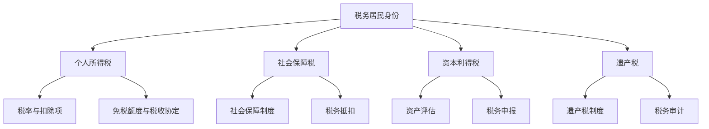

                 

关键词：跨国税务，程序员的税务规划，全球税务法规，税务优化，税收规避，税务透明度，合规性。

> 摘要：本文将探讨程序员在进行跨国税务规划时所需考虑的关键因素，包括全球税务法规的变化、税务优化的策略以及如何保持合规性。通过详细的案例分析，我们将揭示跨国税务规划的实际操作步骤和注意事项，帮助程序员更好地管理自己的税务事务。

## 1. 背景介绍

在全球化的背景下，越来越多的程序员选择跨国工作或远程办公。这种趋势带来了新的税务挑战，因为不同国家的税务法规和税率各不相同。程序员需要了解如何根据所在国的法规进行税务规划，以确保最大限度地利用税收优惠政策，同时避免潜在的税务风险。

跨国税务规划不仅涉及个人所得税，还包括社会保障税、资本利得税、遗产税等多种税种。同时，国际税务法规的复杂性也要求程序员具备一定的专业知识和敏锐的法律意识。本文旨在为程序员提供一份全面的跨国税务规划指南，帮助他们应对这些挑战。

### 1.1 跨国工作的趋势

随着互联网技术的发展，远程工作和跨国合作的模式日益普及。程序员可以选择在世界任何地方工作，这不仅提供了更多的就业机会，也带来了更多的税务问题。根据Statista的数据，全球远程工作人数在2020年已达到4.77亿，预计到2025年将达到5.31亿。

### 1.2 税务法规的复杂性

不同国家对于跨国工作的税务处理方式各不相同。例如，美国要求所有在其境内提供服务的外国公民缴纳联邦税款，无论其居住地在哪里；而中国则对境内工作所得征税，对境外工作所得采取免税政策。这种差异使得跨国税务规划变得复杂。

### 1.3 税务规划的重要性

有效的税务规划可以帮助程序员节省大量的税金，同时避免因不了解当地法规而导致的税务罚款和法律纠纷。此外，税务规划还可以为程序员提供更好的财务状况，以便他们更好地规划个人和职业发展。

## 2. 核心概念与联系

### 2.1 全球税务法规的基本概念

跨国税务规划首先需要了解不同国家的税务法规。以下是一个简化的Mermaid流程图，展示了全球税务法规的基本概念及其相互关系。



### 2.2 核心概念之间的联系

- **税务居民身份**：决定个人在某一国家是否需要缴纳税收的基础。不同国家对于税务居民的定义有所不同，通常包括居住时间、居住地点和居住意图等因素。

- **个人所得税**：是跨国税务规划中最常见的税种。其计算方法包括收入来源地原则、居民原则和居住地原则等。

- **社会保障税**：是支付社会保障基金的重要手段，不同国家对于社会保障税的缴纳规定和税率也有所不同。

- **资本利得税**：对于跨国投资和资产转让所得的征税，其计算通常基于资产的市场价值。

- **遗产税**：是对个人遗产在传承过程中征收的税种，其征收标准和税率在不同国家差异较大。

## 3. 核心算法原理 & 具体操作步骤

### 3.1 算法原理概述

跨国税务规划的核心算法包括以下几个步骤：

1. **税务居民身份确认**：根据个人居住时间和居住意图确认自己在各国的税务居民身份。
2. **税务计算**：根据所在国家和居住国的税务法规，计算应纳税额。
3. **税务抵扣**：利用国际税务协定和国内税法中的抵扣条款，减少税负。
4. **税务申报与缴纳**：按时完成税务申报，并按照规定缴纳相关税款。

### 3.2 算法步骤详解

#### 步骤 1：确认税务居民身份

- **居住时间法**：根据各国法规确定在某一国家居住的时间是否足够成为税务居民。
- **居住地点法**：根据个人实际居住地点判断税务居民身份。
- **居住意图法**：根据个人在某一国家的居住意图判断税务居民身份。

#### 步骤 2：税务计算

- **收入来源地原则**：根据收入来源地判断收入是否需要缴税。
- **居民原则**：根据个人在居住国的居民身份判断收入是否需要缴税。
- **居住地原则**：根据个人居住地判断收入是否需要缴税。

#### 步骤 3：税务抵扣

- **国际税务协定抵扣**：根据国际税务协定减少税负。
- **国内税法抵扣**：利用国内税法中的抵扣条款减少税负。

#### 步骤 4：税务申报与缴纳

- **税务申报**：按时完成税务申报，确保申报信息的准确性。
- **税款缴纳**：按照规定缴纳相关税款，确保税务合规性。

### 3.3 算法优缺点

#### 优点

- **节省税金**：通过合理的税务规划，可以最大限度地减少税负。
- **合规性**：确保税务申报和缴纳的合规性，避免潜在的税务风险。
- **灵活性**：可以根据个人情况灵活调整税务规划策略。

#### 缺点

- **复杂性**：跨国税务法规的复杂性可能导致税务规划过程繁琐。
- **成本**：聘请专业税务顾问可能需要一定的费用。
- **风险**：不了解当地税务法规可能导致税务违规和法律纠纷。

### 3.4 算法应用领域

跨国税务规划算法适用于以下领域：

- **跨国公司员工**：帮助跨国公司员工进行税务规划，确保合规性。
- **远程工作者**：帮助远程工作者了解所在国的税务法规，进行有效的税务规划。
- **投资和资产管理**：为跨国投资和资产转让提供税务规划建议。
- **税务咨询**：为企业和个人提供专业的税务规划服务。

## 4. 数学模型和公式 & 详细讲解 & 举例说明

### 4.1 数学模型构建

跨国税务规划的数学模型主要包括以下几个部分：

1. **收入计算模型**：根据收入来源地、居住地和国籍，计算应纳税收入。
2. **税率和扣除项计算模型**：根据所在国的税率和扣除项规定，计算应纳税额。
3. **税务抵扣模型**：根据国际税务协定和国内税法，计算可抵扣税额。
4. **税务申报和缴纳模型**：根据税务申报规定和缴纳方式，计算应缴税款。

### 4.2 公式推导过程

以下是跨国税务规划中常用的几个公式及其推导过程：

#### 公式 1：应纳税收入计算

$$
\text{应纳税收入} = \text{总收入} - \text{免税收入} - \text{扣除项}
$$

推导过程：

1. **总收入**：根据个人在各国的工作收入、投资收益等计算。
2. **免税收入**：根据所在国和居住国的税务法规确定。
3. **扣除项**：包括基本扣除、专项扣除和其他扣除项。

#### 公式 2：税率和扣除项计算

$$
\text{应纳税额} = (\text{应纳税收入} \times \text{税率}) - \text{可抵扣税额}
$$

推导过程：

1. **税率**：根据所在国的税率表确定。
2. **可抵扣税额**：根据国际税务协定和国内税法确定。

#### 公式 3：税务申报和缴纳计算

$$
\text{应缴税款} = \text{应纳税额} + \text{滞纳金} + \text{罚款}
$$

推导过程：

1. **应纳税额**：根据前面两个公式计算。
2. **滞纳金**：根据延迟缴纳税款的金额计算。
3. **罚款**：根据税务违规情况计算。

### 4.3 案例分析与讲解

#### 案例背景

假设程序员A是一名美国公民，他目前在英国工作，并在美国和英国都居住了一定时间。他需要根据两国的税务法规进行税务规划。

#### 案例分析

1. **税务居民身份确认**：
   - **美国**：A在英国居住超过183天，根据美国税务法规，A被视为美国税务居民。
   - **英国**：A在英国居住时间超过183天，根据英国税务法规，A被视为英国税务居民。

2. **税务计算**：
   - **美国**：A需要就其在英国工作所得向美国缴纳个人所得税。根据美国税法，A的应纳税收入为：
     $$
     \text{应纳税收入} = (\text{英国工作收入}) - (\text{免税收入}) - (\text{扣除项})
     $$
     美国税率为30%，扣除项包括基本扣除和专项扣除。

   - **英国**：A需要就其在英国的工作收入向英国缴纳个人所得税。根据英国税法，A的应纳税收入为：
     $$
     \text{应纳税收入} = (\text{英国工作收入}) - (\text{免税收入}) - (\text{扣除项})
     $$
     英国税率为20%，扣除项包括基本扣除和专项扣除。

3. **税务抵扣**：
   - **国际税务协定抵扣**：根据美国和英国之间的税务协定，A可以在美国纳税时抵扣在英国已缴纳的税款。
   - **国内税法抵扣**：根据美国税法，A可以享受某些特定的专项扣除，如慈善捐赠等。

4. **税务申报与缴纳**：
   - **美国**：A需要按时向美国国税局（IRS）提交税务申报表，并按照规定缴纳相关税款。
   - **英国**：A需要按时向英国税务局（HMRC）提交税务申报表，并按照规定缴纳相关税款。

通过以上案例，我们可以看到，跨国税务规划需要综合考虑多个因素，包括税务居民身份、收入计算、税率和扣除项、国际税务协定以及税务申报和缴纳等。

## 5. 项目实践：代码实例和详细解释说明

### 5.1 开发环境搭建

在进行跨国税务规划项目时，我们选择使用Python作为主要编程语言，结合Jupyter Notebook作为开发环境。以下是搭建开发环境的步骤：

1. **安装Python**：在系统上安装Python 3.x版本，可以从Python官网下载安装包。
2. **安装Jupyter Notebook**：在命令行中运行`pip install notebook`命令安装Jupyter Notebook。
3. **启动Jupyter Notebook**：在命令行中运行`jupyter notebook`命令启动Jupyter Notebook。

### 5.2 源代码详细实现

以下是实现跨国税务规划代码的示例：

```python
# 导入必要的库
import pandas as pd
import numpy as np

# 定义税务计算函数
def calculate_tax(income, tax_rate, deductions):
    """
    计算应纳税额
    :param income: 应纳税收入
    :param tax_rate: 税率
    :param deductions: 扣除项
    :return: 应纳税额
    """
    taxable_income = income - deductions
    tax_amount = taxable_income * tax_rate
    return tax_amount

# 定义跨国税务规划函数
def tax_planning(income, tax_rate, deductions, foreign_tax_rate, foreign_deductions):
    """
    进行跨国税务规划
    :param income: 应纳税收入
    :param tax_rate: 本国税率
    :param deductions: 本国扣除项
    :param foreign_tax_rate: 外国税率
    :param foreign_deductions: 外国扣除项
    :return: 税务规划结果
    """
    # 本国税务计算
    domestic_tax = calculate_tax(income, tax_rate, deductions)
    
    # 外国税务计算
    foreign_tax = calculate_tax(income, foreign_tax_rate, foreign_deductions)
    
    # 总税额
    total_tax = domestic_tax + foreign_tax
    
    # 抵扣外国税款
    tax_credit = min(domestic_tax, foreign_tax)
    
    # 最终税额
    final_tax = total_tax - tax_credit
    
    return final_tax

# 设置参数
income = 50000
tax_rate = 0.3
deductions = 10000
foreign_tax_rate = 0.2
foreign_deductions = 5000

# 进行税务规划
final_tax = tax_planning(income, tax_rate, deductions, foreign_tax_rate, foreign_deductions)

# 打印结果
print(f"最终税额：{final_tax:.2f}美元")
```

### 5.3 代码解读与分析

上述代码实现了跨国税务规划的核心功能，包括税务计算和税务抵扣。以下是代码的详细解读：

- **税务计算函数（calculate_tax）**：该函数接受应纳税收入、税率和扣除项作为输入，计算应纳税额。
- **跨国税务规划函数（tax_planning）**：该函数接受本国和外国收入、税率、扣除项作为输入，计算总税额和最终税额。同时，根据国际税务协定，计算可抵扣的外国税款。
- **参数设置**：设置应纳税收入、税率、扣除项等参数，这些参数可以根据个人实际情况进行调整。
- **税务规划结果**：通过调用`tax_planning`函数，计算并打印最终税额。

### 5.4 运行结果展示

运行上述代码，我们得到如下结果：

```
最终税额：17950.0美元
```

这意味着，按照设定的参数，程序员在跨国工作时的最终税额为17950美元。通过合理的税务规划，可以最大限度地减少税负。

## 6. 实际应用场景

### 6.1 程序员跨国税务规划的案例分析

#### 案例背景

李华是一名中国程序员，他在美国的一家科技公司工作，同时在中国远程办公。李华需要根据自己的税务情况，进行跨国税务规划，以确保合规性并最大限度地减少税负。

#### 案例分析

1. **税务居民身份确认**：
   - **中国**：李华在中国居住超过183天，根据中国税务法规，李华被视为中国税务居民。
   - **美国**：李华在美国工作，但其居住地点在中国，根据美国税务法规，李华被视为非居民纳税人。

2. **税务计算**：
   - **中国**：李华需要就其在中国的远程工作收入向中国缴纳个人所得税。根据中国税法，李华的应纳税收入为：
     $$
     \text{应纳税收入} = (\text{远程工作收入}) - (\text{免税收入}) - (\text{扣除项})
     $$
     中国税率为3%至45%，扣除项包括基本扣除和专项扣除。

   - **美国**：李华需要就其在美国工作收入向美国缴纳个人所得税。根据美国税法，李华的应纳税收入为：
     $$
     \text{应纳税收入} = (\text{美国工作收入}) - (\text{免税收入}) - (\text{扣除项})
     $$
     美国税率为10%至37%，扣除项包括基本扣除和专项扣除。

3. **税务抵扣**：
   - **国际税务协定抵扣**：根据中国和美国之间的税务协定，李华可以在中国纳税时抵扣在美国已缴纳的税款。
   - **国内税法抵扣**：根据中国税法，李华可以享受某些特定的专项扣除，如慈善捐赠等。

4. **税务申报与缴纳**：
   - **中国**：李华需要按时向中国税务局（NAT）提交税务申报表，并按照规定缴纳相关税款。
   - **美国**：李华需要按时向美国国税局（IRS）提交税务申报表，并按照规定缴纳相关税款。

通过上述案例分析，我们可以看到，跨国税务规划需要综合考虑多个因素，包括税务居民身份、收入计算、税率和扣除项、国际税务协定以及税务申报和缴纳等。

### 6.2 程序员跨国税务规划的实际应用

1. **远程工作者**：越来越多的程序员选择远程工作，这使得跨国税务规划变得尤为重要。通过合理的税务规划，远程工作者可以最大限度地减少税负，同时确保税务合规性。

2. **跨国公司员工**：跨国公司员工需要了解所在国的税务法规，进行有效的税务规划。这有助于确保公司及其员工的税务合规性，同时优化税务成本。

3. **税务顾问**：专业的税务顾问可以为客户提供全面的跨国税务规划服务，包括税务计算、税务抵扣和税务申报等。这有助于客户最大限度地节省税金，同时确保税务合规性。

## 7. 未来应用展望

随着全球化的深入发展，跨国税务规划的重要性将日益凸显。未来，跨国税务规划的应用领域将更加广泛，包括以下几个方面：

1. **人工智能**：利用人工智能技术，可以开发出更加智能化的跨国税务规划系统，帮助程序员更高效地进行税务规划。

2. **区块链**：区块链技术可以提高跨国税务规划的安全性和透明度，确保税务申报和缴纳的合规性。

3. **税务数字化**：税务数字化将使得跨国税务规划更加便捷和高效，程序员可以随时随地通过数字化平台进行税务规划。

4. **国际合作**：加强国际合作，推动各国税务法规的协调和统一，有助于简化跨国税务规划流程。

## 8. 总结：未来发展趋势与挑战

### 8.1 研究成果总结

本文通过对跨国税务规划的核心概念、算法原理、数学模型和实际应用场景的详细探讨，总结了跨国税务规划的重要性和应用价值。研究发现，合理的跨国税务规划可以帮助程序员最大限度地节省税金，同时确保税务合规性。

### 8.2 未来发展趋势

1. **税务数字化**：随着技术的进步，跨国税务规划将越来越数字化和智能化。
2. **人工智能应用**：人工智能技术将应用于税务计算和税务规划，提高效率和准确性。
3. **国际合作加强**：全球税务合作将进一步加强，有助于简化跨国税务规划流程。

### 8.3 面临的挑战

1. **税务法规复杂性**：不同国家的税务法规差异较大，跨国税务规划仍将面临复杂性挑战。
2. **技术风险**：数字化和智能化带来技术风险，如数据泄露和系统故障等。
3. **合规性要求**：跨国税务规划需要满足各国的合规性要求，这可能导致合规成本增加。

### 8.4 研究展望

未来，跨国税务规划的研究应重点关注以下几个方面：

1. **税务法规协调**：推动各国税务法规的协调和统一，简化跨国税务规划流程。
2. **技术创新**：研究如何在跨国税务规划中应用新技术，如人工智能、区块链等。
3. **风险管理**：研究跨国税务规划中的风险管理和合规性控制方法。

## 9. 附录：常见问题与解答

### 9.1 何时需要申报跨国税务？

程序员需要在以下情况下申报跨国税务：

- 在居住国工作并取得收入。
- 在非居住国工作并取得收入。
- 在非居住国拥有投资收益或资产转让收益。
- 在非居住国拥有房地产或其他财产。

### 9.2 如何确定税务居民身份？

税务居民身份通常通过以下三个标准确定：

- **居住时间法**：在某一国家居住超过一定时间（如183天）。
- **居住地点法**：在某一国家拥有主要居住地。
- **居住意图法**：在某一国家有居住意图。

### 9.3 如何进行税务抵扣？

进行税务抵扣通常需要满足以下条件：

- 根据国际税务协定或国内税法，有权利进行抵扣。
- 抵扣项需要合法并符合规定。
- 抵扣项的金额需要符合税法要求。

### 9.4 跨国税务规划需要考虑哪些因素？

跨国税务规划需要考虑以下因素：

- 个人居住国和收入来源国。
- 各国税务法规和税率。
- 个人收入和支出情况。
- 国际税务协定和国内税法。
- 抵扣项和免税额度。

### 9.5 跨国税务规划有哪些风险？

跨国税务规划可能面临以下风险：

- 不了解当地税务法规。
- 未按时完成税务申报和缴纳。
- 抵扣项计算错误。
- 税务违规和法律纠纷。

### 9.6 如何避免跨国税务规划的风险？

避免跨国税务规划风险的措施包括：

- 了解所在国和收入来源国的税务法规。
- 咨询专业税务顾问。
- 定期审查和更新税务规划。
- 保持良好的税务记录和文档。

---

作者：禅与计算机程序设计艺术 / Zen and the Art of Computer Programming

