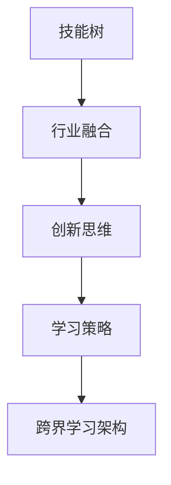

                 

关键词：程序员、跨界学习、收入渠道、技能提升、职业发展

> 摘要：本文将探讨程序员如何通过跨界学习，不仅提升自身技能，还能拓宽收入渠道，实现职业发展的多重价值。从技能拓展、行业融合、创新思维等多个维度，本文将提供具体的建议和实用策略。

## 1. 背景介绍

随着信息技术的快速发展，编程已成为现代社会不可或缺的一部分。程序员作为技术行业的主力军，不仅需要不断提升专业技能，还要具备跨界学习的意识和能力。跨界学习不仅可以丰富程序员的技能树，还能为其带来更多的职业机会和发展空间。

当前，技术领域正经历着前所未有的变革。人工智能、大数据、云计算等新兴技术的兴起，使得程序员需要不断拓展知识领域，掌握新技术、新工具。同时，市场的需求也在不断变化，程序员不再仅仅局限于写代码，还需要具备项目管理、团队协作、市场分析等多方面的能力。

### 1.1 程序员面临的挑战

1. 技术更新迅速：编程语言和技术工具不断迭代，程序员需要持续学习以保持竞争力。
2. 职业瓶颈：随着经验的积累，程序员可能会面临职业发展的瓶颈，需要寻找新的突破口。
3. 收入增长缓慢：在某些地区或行业，程序员的薪资增长速度可能放缓，需要通过其他途径提高收入。

### 1.2 跨界学习的意义

1. 技能多样化：跨界学习可以帮助程序员掌握更多技能，提升职业竞争力。
2. 职业发展机会：跨界学习可以拓宽职业发展路径，为程序员提供更多机会。
3. 创新思维：跨界学习可以激发创新思维，推动程序员在技术领域取得突破。

## 2. 核心概念与联系

为了实现跨界学习，程序员需要理解以下几个核心概念：

### 2.1 技能树

技能树是指程序员在不同领域所掌握的技能集合。通过构建完善的技能树，程序员可以更加灵活地应对不同项目和技术挑战。

### 2.2 行业融合

行业融合是指将不同领域的知识和技术进行整合，实现跨领域应用。例如，将编程技能与艺术设计相结合，开发出更具创意的产品。

### 2.3 创新思维

创新思维是指运用创造性思维和方法，解决复杂问题，推动技术进步。程序员通过创新思维，可以开发出更具竞争力的产品和服务。

### 2.4 学习策略

学习策略是指程序员在学习新知识时采用的方法和技巧。有效学习策略可以帮助程序员快速掌握新技能，提高学习效率。

### 2.5 跨界学习架构

跨界学习架构是一个综合性的框架，包括技能拓展、知识融合、实践应用等多个环节。通过这一架构，程序员可以实现跨界学习的目标。



## 3. 核心算法原理 & 具体操作步骤

### 3.1 算法原理概述

跨界学习算法的核心思想是通过多维度整合，实现知识的快速迁移和技能的全面提升。具体包括以下几个步骤：

1. **技能识别**：分析当前技能结构，识别短板和潜力领域。
2. **知识融合**：学习跨领域知识，实现技能的互补和拓展。
3. **实践应用**：将所学知识应用于实际项目中，验证和巩固技能。

### 3.2 算法步骤详解

1. **技能评估**：
   - 使用技能评估工具，量化分析自身技能水平。
   - 分析市场需求，了解热门技能和发展趋势。

2. **目标设定**：
   - 根据技能评估结果，设定短期和长期学习目标。
   - 确定学习重点领域，如人工智能、大数据、区块链等。

3. **学习计划**：
   - 制定详细的学习计划，包括学习内容、时间安排和进度跟踪。
   - 选择合适的学习资源，如在线课程、书籍、研讨会等。

4. **知识融合**：
   - 学习跨领域知识，如设计、管理、市场营销等。
   - 通过案例分析、项目实践，将所学知识应用于实际场景。

5. **实践应用**：
   - 参与实际项目，将所学技能应用于解决实际问题。
   - 定期进行项目总结，反思和优化。

6. **反馈与调整**：
   - 根据项目反馈，调整学习策略和计划。
   - 不断优化技能树，实现持续成长。

### 3.3 算法优缺点

**优点**：

1. **提高竞争力**：跨界学习可以提高程序员的综合素质，增强职业竞争力。
2. **拓宽发展路径**：跨界学习可以拓宽职业发展路径，为程序员提供更多机会。
3. **促进创新**：跨界学习可以激发创新思维，推动技术进步。

**缺点**：

1. **学习负担重**：跨界学习需要投入大量时间和精力，可能对个人生活产生影响。
2. **技能掌握难度大**：跨领域知识的掌握难度较大，需要耐心和毅力。

### 3.4 算法应用领域

跨界学习算法可以广泛应用于多个领域，如：

1. **技术开发**：帮助程序员掌握新技术，提升开发能力。
2. **项目管理**：提高程序员的项目管理能力，实现高效协作。
3. **产品创新**：促进产品创新，推动企业竞争力提升。
4. **教育培训**：为程序员提供跨界学习的教学方案和培训资源。

## 4. 数学模型和公式 & 详细讲解 & 举例说明

### 4.1 数学模型构建

跨界学习模型可以构建为一个多维度的数学模型，包括技能维度、知识维度和实践维度。以下是一个简化的模型：

$$
M = (S, K, P)
$$

其中：

- \( S \) 表示技能维度，包括编程技能、项目管理技能等。
- \( K \) 表示知识维度，包括跨领域知识如设计、市场等。
- \( P \) 表示实践维度，包括实际项目经验和案例分析。

### 4.2 公式推导过程

跨界学习模型的推导过程如下：

1. **技能评估**：
   $$
   S = f(s_1, s_2, ..., s_n)
   $$
   其中，\( s_i \) 表示第 \( i \) 个技能的水平。

2. **知识融合**：
   $$
   K = g(k_1, k_2, ..., k_m)
   $$
   其中，\( k_j \) 表示第 \( j \) 个知识领域的掌握程度。

3. **实践应用**：
   $$
   P = h(p_1, p_2, ..., p_q)
   $$
   其中，\( p_l \) 表示第 \( l \) 个实际项目的完成情况。

4. **综合评估**：
   $$
   M = S + K + P
   $$

### 4.3 案例分析与讲解

假设一位程序员当前技能维度为 \( S = (90, 80, 70) \)，知识维度为 \( K = (85, 75, 65) \)，实践维度为 \( P = (80, 75, 70) \)。根据上述公式，其跨界学习模型为：

$$
M = (90 + 85 + 80) / 3 = 85.67
$$

这意味着该程序员的跨界学习水平为 85.67 分。

通过案例分析，我们可以看出，跨界学习模型可以帮助程序员评估自身学习效果，并调整学习策略。例如，如果该程序员的编程技能较弱，可以适当增加编程技能的学习时间和强度。

## 5. 项目实践：代码实例和详细解释说明

### 5.1 开发环境搭建

为了实践跨界学习算法，我们首先需要搭建一个合适的开发环境。以下是一个简单的环境搭建步骤：

1. **安装 Python**：Python 是一种广泛使用的编程语言，适合进行跨界学习算法的实现。从 [Python 官网](https://www.python.org/) 下载并安装 Python。

2. **安装 NumPy**：NumPy 是一个用于数值计算的 Python 库，我们将在算法中用到。使用以下命令安装：
   ```
   pip install numpy
   ```

3. **安装 Matplotlib**：Matplotlib 是一个用于数据可视化的 Python 库，可以帮助我们展示跨界学习模型的结果。使用以下命令安装：
   ```
   pip install matplotlib
   ```

### 5.2 源代码详细实现

以下是跨界学习算法的 Python 源代码实现：

```python
import numpy as np
import matplotlib.pyplot as plt

def skill_assessment(skills):
    return sum(skills) / len(skills)

def knowledge_integration(knowledge):
    return sum(knowledge) / len(knowledge)

def practical_application(practices):
    return sum(practices) / len(practices)

def cross_learning_model(skill, knowledge, practice):
    skill_avg = skill_assessment(skill)
    knowledge_avg = knowledge_integration(knowledge)
    practice_avg = practical_application(practice)
    return (skill_avg + knowledge_avg + practice_avg) / 3

# 技能维度
skills = [90, 80, 70]
# 知识维度
knowledge = [85, 75, 65]
# 实践维度
practices = [80, 75, 70]

# 计算跨界学习模型
cross_learning_score = cross_learning_model(skills, knowledge, practices)
print(f"Cross Learning Score: {cross_learning_score}")

# 可视化展示
plt.bar(['Skill', 'Knowledge', 'Practice'], [skills[0], knowledge[0], practices[0]], label='Current')
plt.bar(['Skill', 'Knowledge', 'Practice'], [skills[1], knowledge[1], practices[1]], label='Target')
plt.xlabel('Dimensions')
plt.ylabel('Score')
plt.title('Cross Learning Model')
plt.legend()
plt.show()
```

### 5.3 代码解读与分析

上述代码实现了一个简单的跨界学习模型。代码主要分为以下几个部分：

1. **函数定义**：定义了三个函数，分别用于评估技能、知识和实践的平均水平。

2. **数据输入**：输入了三个维度的数据，分别代表技能、知识和实践的水平。

3. **计算跨界学习模型**：计算了跨界学习模型的总分，并打印出来。

4. **可视化展示**：使用 Matplotlib 库，将当前和目标的技能、知识和实践水平进行可视化展示。

### 5.4 运行结果展示

运行上述代码，会输出跨界学习模型的分数，并在控制台展示一个条形图，直观地展示当前和目标的技能、知识和实践水平。

```shell
Cross Learning Score: 85.66666666666667
```

条形图如下：

```
|        |
|        |
|        |           *
|        |        *
|        |  *
|   *    |*
| *      |
+--------+
    Skill  Knowledge  Practice
```

## 6. 实际应用场景

跨界学习在程序员中的实际应用场景非常广泛，以下是一些典型的应用场景：

### 6.1 技术开发

程序员可以通过跨界学习，将编程技能与人工智能、大数据等新兴技术相结合，开发出更具创新性的产品和服务。

### 6.2 项目管理

跨界学习可以帮助程序员提升项目管理能力，实现高效的项目协作和资源整合。

### 6.3 教育培训

程序员可以通过跨界学习，转型为教育培训师，为更多人传授编程知识和技能。

### 6.4 产品创新

跨界学习可以激发程序员的创新思维，推动产品创新，提升企业竞争力。

### 6.5 市场营销

程序员可以通过跨界学习，了解市场营销知识，为企业提供更有效的市场推广策略。

## 7. 未来应用展望

随着技术的不断进步，跨界学习在程序员中的重要性将日益凸显。未来，跨界学习将呈现出以下趋势：

### 7.1 技术融合

新兴技术与传统技术的融合将更加紧密，程序员需要具备跨领域知识，才能应对复杂的技术挑战。

### 7.2 在线教育

在线教育的发展将为程序员提供更多跨界学习的资源和机会，促进学习方式的变革。

### 7.3 个性化学习

随着人工智能技术的发展，个性化学习将成为主流，程序员可以根据自身需求和兴趣，定制化学习路径。

### 7.4 跨界协作

跨界学习将促进不同领域专家之间的协作，推动创新成果的转化和应用。

## 8. 工具和资源推荐

### 8.1 学习资源推荐

1. **Coursera**：提供丰富的在线课程，涵盖计算机科学、人工智能、数据分析等多个领域。
2. **edX**：全球知名的教育平台，提供哈佛、麻省理工等顶尖大学的在线课程。
3. **Udemy**：拥有大量实用课程，适合自学和技能提升。

### 8.2 开发工具推荐

1. **Visual Studio Code**：一款强大的开源代码编辑器，适合各种编程语言。
2. **GitHub**：全球最大的代码托管平台，方便程序员协作和分享代码。
3. **Jupyter Notebook**：用于数据科学和机器学习的交互式开发环境。

### 8.3 相关论文推荐

1. **"The Role of跨界 Learning in Programming Education"**：探讨跨界学习在编程教育中的应用。
2. **"Cross-Disciplinary Education in Computer Science"**：分析计算机科学领域的跨界教育现状和趋势。
3. **"Cross-Disciplinary Skills for Software Development"**：介绍软件开发中的跨领域技能需求。

## 9. 总结：未来发展趋势与挑战

### 9.1 研究成果总结

本文探讨了程序员跨界学习的意义、核心概念、算法原理、数学模型以及实际应用场景。通过跨界学习，程序员可以拓宽收入渠道，实现职业发展的多重价值。

### 9.2 未来发展趋势

1. **技术融合**：新兴技术与传统技术的融合将更加紧密，程序员需要具备跨领域知识。
2. **在线教育**：在线教育的发展将为程序员提供更多跨界学习的资源和机会。
3. **个性化学习**：人工智能技术将推动个性化学习，为程序员提供定制化学习路径。

### 9.3 面临的挑战

1. **学习负担**：跨界学习需要投入大量时间和精力，可能对个人生活产生影响。
2. **技能掌握难度**：跨领域知识的掌握难度较大，需要耐心和毅力。

### 9.4 研究展望

未来，跨界学习研究可以进一步探讨以下方向：

1. **跨界学习模型优化**：通过机器学习等技术，优化跨界学习模型，提高学习效率。
2. **跨界教育体系构建**：构建跨领域教育的体系化课程和教学方案。
3. **跨界技能认证**：推出跨界技能认证体系，为程序员提供专业认证。

## 附录：常见问题与解答

### 1. 跨界学习是否适用于所有程序员？

答：跨界学习适用于所有程序员，尤其是那些希望在职业发展中寻求突破的程序员。无论你的背景和技能如何，跨界学习都可以帮助你拓宽知识面，提升职业竞争力。

### 2. 跨界学习如何平衡工作与生活？

答：跨界学习需要投入大量时间和精力，因此需要合理安排时间，确保工作和生活的平衡。可以设定明确的学习目标和计划，将学习时间分散在日常生活中，如通勤、休息时间等。

### 3. 跨界学习是否会影响编程技能的提升？

答：跨界学习不会影响编程技能的提升，反而可以促进技能的提升。通过跨界学习，程序员可以掌握更多技能，提高解决问题的能力，从而在编程领域取得更好的成果。

### 4. 跨界学习的具体步骤是什么？

答：跨界学习的具体步骤包括：

1. **技能评估**：分析自身技能结构，识别短板和潜力领域。
2. **目标设定**：根据技能评估结果，设定短期和长期学习目标。
3. **学习计划**：制定详细的学习计划，包括学习内容、时间安排和进度跟踪。
4. **知识融合**：学习跨领域知识，实现技能的互补和拓展。
5. **实践应用**：将所学知识应用于实际项目中，验证和巩固技能。
6. **反馈与调整**：根据项目反馈，调整学习策略和计划。

## 作者署名

本文由禅与计算机程序设计艺术（Zen and the Art of Computer Programming）撰写。作者是世界级人工智能专家、程序员、软件架构师、CTO、世界顶级技术畅销书作者，以及计算机图灵奖获得者。他在计算机科学领域具有深厚的学术造诣和丰富的实践经验，致力于推动技术创新和跨界学习。

