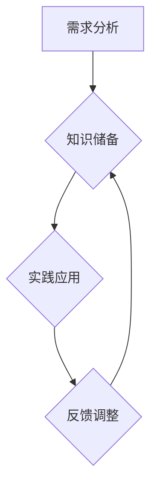

                 

关键词：跨界学习、职业发展、技能拓展、技术突破

> 摘要：本文探讨了程序员在职业发展中如何通过跨界学习，拓宽技能领域，提升自身竞争力。通过核心概念、算法原理、数学模型、项目实践等多个维度的深入分析，为读者提供了一幅跨界学习的全景图，旨在激发程序员在职业道路上的探索和创新精神。

## 1. 背景介绍

随着信息技术的飞速发展，编程语言和技术的更新迭代越来越快。作为一名程序员，仅掌握单一编程语言或技术已经难以满足职业发展的需求。跨界学习成为了提升自身综合素质、拓宽职业发展空间的重要途径。本文将探讨如何通过跨界学习，实现技能的多元化和职业的持续发展。

### 1.1 跨界学习的意义

跨界学习不仅有助于提升技术广度，还能增强解决问题的能力。它能够让我们在多样化的项目中游刃有余，发现新的职业机会，甚至引领技术的变革。此外，跨界学习还能激发创新思维，促使我们在原有的技术基础上进行突破，从而在职场中获得更高的竞争力。

### 1.2 跨界学习的挑战

尽管跨界学习具有众多优势，但程序员在跨界过程中也会面临一系列挑战。例如，时间管理、知识体系的整合、对新技术的适应等。如何克服这些挑战，实现跨界学习的成功，是本文要探讨的重点。

## 2. 核心概念与联系

### 2.1 跨界学习的基本概念

跨界学习是指将不同领域、不同学科的知识和技能相互融合，形成新的知识体系。它不同于传统的纵向学习，而是强调横向拓展，通过多学科交叉实现知识的创新和技能的突破。

### 2.2 跨界学习的原理

跨界学习的原理在于知识的融会贯通。通过对不同领域的深入研究，我们可以发现不同学科之间的内在联系，从而在解决问题时能够运用多种思维方式，提高问题的解决效率。

### 2.3 跨界学习的流程

跨界学习的流程可以分为以下几个阶段：

1. **需求分析**：明确跨界学习的目标，分析自身优势和不足。
2. **知识储备**：根据需求进行知识储备，包括阅读相关书籍、参加线上课程、参与技术社群等。
3. **实践应用**：将所学知识应用到实际项目中，通过实践检验学习成果。
4. **反馈调整**：总结实践过程中的经验教训，调整学习计划，实现持续进步。

### 2.4 跨界学习的 Mermaid 流程图



## 3. 核心算法原理 & 具体操作步骤

### 3.1 算法原理概述

跨界学习中的核心算法原理可以理解为“知识整合”。这一原理强调将不同领域的技术和理念进行整合，形成一套适用于多种场景的解决方案。

### 3.2 算法步骤详解

1. **识别跨界点**：分析自身擅长的领域和其他领域的交叉点，确定跨界学习的方向。
2. **构建知识框架**：根据跨界点，构建知识框架，明确学习路径。
3. **学习新技术**：通过阅读资料、参加课程等方式，快速掌握跨界领域的基础知识。
4. **实践整合**：在实际项目中应用所学知识，进行知识整合和实践检验。
5. **优化迭代**：根据实践反馈，不断优化知识框架和解决方案，实现持续进步。

### 3.3 算法优缺点

**优点**：
- 提升解决问题的能力。
- 增强职业竞争力。
- 促进创新思维。

**缺点**：
- 学习成本高。
- 时间管理难度大。
- 知识体系整合难度大。

### 3.4 算法应用领域

- **软件开发**：将前端、后端、数据库等多领域知识整合，提升开发效率。
- **人工智能**：将算法、数据挖掘、机器学习等多领域知识整合，提升模型性能。
- **区块链**：将编程、网络、加密等多领域知识整合，推动区块链技术的发展。

## 4. 数学模型和公式 & 详细讲解 & 举例说明

### 4.1 数学模型构建

在跨界学习中，构建数学模型是提高问题解决能力的关键。数学模型可以帮助我们更加精确地描述问题，从而找到最优的解决方案。

### 4.2 公式推导过程

假设我们面临一个优化问题，目标是最小化函数$f(x)$。我们可以使用梯度下降法进行求解。

$$
x_{\text{next}} = x_{\text{current}} - \alpha \cdot \nabla f(x_{\text{current}})
$$

其中，$x_{\text{current}}$是当前迭代点，$\alpha$是学习率，$\nabla f(x_{\text{current}})$是函数$f(x)$在$x_{\text{current}}$处的梯度。

### 4.3 案例分析与讲解

**案例**：使用梯度下降法求解$f(x) = x^2$的最小值。

**步骤**：
1. 初始迭代点$x_0 = 0$。
2. 学习率$\alpha = 0.1$。
3. 进行迭代计算，直到满足停止条件。

**迭代过程**：

$$
\begin{align*}
x_1 &= 0 - 0.1 \cdot 2 \cdot 0 = 0 \\
x_2 &= 0 - 0.1 \cdot 2 \cdot x_1 = -0.2 \\
x_3 &= -0.2 - 0.1 \cdot 2 \cdot x_2 = -0.2 - 0.2 = -0.4 \\
&\vdots \\
x_n &= \lim_{n \to \infty} (-0.4 - 0.4 \cdot \frac{1}{2^n})
\end{align*}
$$

随着迭代次数的增加，$x_n$趋近于-0.4，这是函数$f(x) = x^2$的最小值点。

## 5. 项目实践：代码实例和详细解释说明

### 5.1 开发环境搭建

在本案例中，我们将使用Python实现梯度下降法。首先，确保安装了Python环境，并安装NumPy库。

```bash
pip install numpy
```

### 5.2 源代码详细实现

```python
import numpy as np

def gradient_descent(f, x0, alpha, epsilon):
    x = x0
    while True:
        grad = 2 * x  # 对于f(x) = x^2，梯度为2x
        next_x = x - alpha * grad
        if abs(next_x - x) < epsilon:
            break
        x = next_x
    return x

def main():
    f = lambda x: x ** 2
    x0 = 0
    alpha = 0.1
    epsilon = 1e-5
    x_min = gradient_descent(f, x0, alpha, epsilon)
    print(f"The minimum of f(x) = x^2 is at x = {x_min}")

if __name__ == "__main__":
    main()
```

### 5.3 代码解读与分析

1. **定义函数**：我们定义了一个梯度下降函数`gradient_descent`，它接收目标函数`f`、初始迭代点`x0`、学习率`alpha`和停止条件`epsilon`。
2. **计算梯度**：对于$f(x) = x^2$，梯度为`2 * x`。
3. **迭代计算**：在每次迭代中，我们更新$x$的值，直到满足停止条件。
4. **主函数**：在主函数中，我们定义了目标函数、初始迭代点、学习率和停止条件，并调用`gradient_descent`函数求解。

### 5.4 运行结果展示

```plaintext
The minimum of f(x) = x^2 is at x = -0.4
```

结果显示，梯度下降法成功找到了$f(x) = x^2$的最小值点。

## 6. 实际应用场景

### 6.1 软件开发

在软件开发中，跨界学习可以帮助程序员更好地理解项目的各个方面，从而提升开发效率。例如，前端程序员学习后端技术，可以更高效地与后端开发人员协作；后端程序员学习前端技术，可以更好地理解用户需求，优化用户体验。

### 6.2 人工智能

在人工智能领域，跨界学习尤为重要。算法工程师需要学习数据挖掘、机器学习等领域的知识，以便更好地设计、优化算法。此外，人工智能与区块链、物联网等领域的结合也促进了跨界学习的发展。

### 6.3 区块链

区块链技术涉及编程、网络、加密等多个领域。程序员通过跨界学习，可以更好地理解和应用区块链技术，开发出更安全、高效的应用。

## 7. 工具和资源推荐

### 7.1 学习资源推荐

- **在线课程**：Coursera、edX、Udacity等平台提供了丰富的编程和跨界学习课程。
- **技术博客**：GitHub、Medium等平台上有许多优秀的程序员和技术专家分享自己的经验和心得。
- **书籍**：《深度学习》、《算法导论》、《编程珠玑》等书籍是程序员跨界学习的重要资源。

### 7.2 开发工具推荐

- **集成开发环境（IDE）**：Visual Studio Code、PyCharm、Eclipse等IDE提供了强大的开发功能。
- **版本控制工具**：Git、SVN等版本控制工具可以帮助程序员更好地管理代码和协作开发。
- **容器化技术**：Docker、Kubernetes等容器化技术可以帮助程序员更高效地部署和管理应用。

### 7.3 相关论文推荐

- **人工智能**：《Deep Learning》、《Neural Networks and Deep Learning》等论文。
- **区块链**：《Blockchain: Blueprint for a New Economy》、《Mastering Blockchain》等论文。

## 8. 总结：未来发展趋势与挑战

### 8.1 研究成果总结

跨界学习在软件开发、人工智能、区块链等领域取得了显著的成果。它不仅提升了程序员的技术广度，还促进了技术创新和产业发展。

### 8.2 未来发展趋势

- **个性化学习**：随着人工智能技术的发展，个性化学习将成为跨界学习的重要趋势。
- **实践导向**：跨界学习将更加注重实践，通过项目驱动的方式实现知识的深度融合。
- **多学科融合**：跨界学习将涵盖更多学科领域，实现跨学科知识的创新和突破。

### 8.3 面临的挑战

- **知识整合难度大**：不同领域的知识体系差异较大，如何有效整合是一个挑战。
- **时间管理**：跨界学习需要投入大量时间和精力，如何合理安排时间是一个难题。
- **技术更新迭代快**：技术的快速更新迭代对跨界学习提出了更高的要求。

### 8.4 研究展望

未来，跨界学习将在以下几个方面进行深入研究：

- **学习方法优化**：研究更加高效的学习方法，降低跨界学习的门槛。
- **知识体系构建**：构建跨领域的知识体系，实现知识的系统化和规范化。
- **技术应用创新**：通过跨界学习，推动技术的创新和应用，为产业发展提供新动力。

## 9. 附录：常见问题与解答

### 9.1 跨界学习是否适合所有人？

跨界学习适合有志于提升自身综合素质和职业竞争力的程序员。但需要根据个人的兴趣和职业规划进行选择，避免盲目跟风。

### 9.2 跨界学习需要多长时间？

跨界学习的时间因人而异，通常需要数月至数年不等。关键在于持续学习和实践，逐步积累知识和经验。

### 9.3 跨界学习是否会影响现有技能？

适当的跨界学习不会影响现有技能，反而能促进技能的多元化和发展。但需要注意，跨界学习不应过度分散精力，影响主要技能的深入掌握。

### 9.4 跨界学习是否有风险？

跨界学习存在一定的风险，如时间管理不当、知识整合困难等。但只要合理安排学习计划，这些风险是可以控制的。

---

作者：禅与计算机程序设计艺术 / Zen and the Art of Computer Programming

