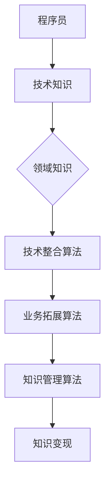

                 

关键词：跨界知识变现、技术专家、知识管理、知识传播、业务拓展

摘要：本文探讨了程序员的跨界知识变现之路。通过结合自身技术专长和领域知识，程序员可以拓展业务范围，实现知识变现。本文将详细介绍跨界知识变现的策略、核心算法、数学模型、项目实践以及未来发展趋势，帮助程序员更好地把握机遇，实现个人价值。

## 1. 背景介绍

在当今信息化社会中，技术进步日新月异，知识更新速度不断加快。程序员作为信息技术领域的主力军，面临着前所未有的机遇与挑战。一方面，技术领域的不断扩展使得程序员需要不断学习新知识、掌握新技术；另一方面，市场对程序员的需求也在不断变化，要求程序员具备跨领域的综合素质。在这样的背景下，程序员如何将自己的知识转化为实际价值，实现跨界知识变现，成为了一个值得探讨的问题。

## 2. 核心概念与联系

### 2.1 跨界知识变现的概念

跨界知识变现是指程序员利用自身的技术专长和领域知识，拓展业务范围，将知识转化为实际价值的过程。跨界知识变现不仅有助于程序员实现个人价值的提升，还可以为企业带来更多的商业机会。

### 2.2 跨界知识变现的核心算法

跨界知识变现的核心算法主要包括以下几个方面：

#### 2.2.1 技术整合算法

技术整合算法是指将不同领域的技术知识进行整合，形成具有创新性的解决方案。该算法的核心在于找到不同技术之间的关联点，实现技术知识的跨界应用。

#### 2.2.2 业务拓展算法

业务拓展算法是指根据市场需求，将程序员的技术专长应用到新的业务领域。该算法的核心在于分析市场需求，找准切入点，实现业务的拓展。

#### 2.2.3 知识管理算法

知识管理算法是指对程序员所掌握的知识进行有效的组织、管理和传播。该算法的核心在于建立一套完善的知识管理体系，提高知识的利用率。

### 2.3 跨界知识变现的架构图



## 3. 核心算法原理 & 具体操作步骤

### 3.1 算法原理概述

跨界知识变现的核心算法原理主要在于将程序员的技术专长和领域知识进行整合，形成具有创新性的解决方案，从而实现知识变现。具体包括以下步骤：

1. 技术整合：将程序员掌握的不同领域技术知识进行整合，形成具有创新性的解决方案。
2. 业务拓展：根据市场需求，将技术整合后的解决方案应用到新的业务领域。
3. 知识管理：对程序员所掌握的知识进行有效的组织、管理和传播，提高知识的利用率。

### 3.2 算法步骤详解

#### 3.2.1 技术整合步骤

1. 分析程序员的技术专长和领域知识，确定跨界方向。
2. 收集相关领域的知识，了解不同技术之间的关联点。
3. 设计创新性的解决方案，实现技术整合。

#### 3.2.2 业务拓展步骤

1. 分析市场需求，确定新的业务领域。
2. 将技术整合后的解决方案应用到新的业务领域，实现业务拓展。
3. 根据业务需求，不断优化和调整解决方案。

#### 3.2.3 知识管理步骤

1. 建立知识管理体系，包括知识存储、知识分类、知识共享等。
2. 对程序员所掌握的知识进行有效的组织和管理，提高知识的利用率。
3. 定期对知识体系进行更新和优化，确保知识的时效性。

### 3.3 算法优缺点

#### 优点：

1. 提高程序员的知识利用率，实现知识变现。
2. 拓宽业务范围，提高企业的市场竞争力。
3. 促进程序员跨领域的综合素质提升。

#### 缺点：

1. 需要程序员具备较强的学习能力和创新能力。
2. 跨界知识变现过程中可能面临技术风险和市场风险。

### 3.4 算法应用领域

跨界知识变现算法可应用于多个领域，如软件开发、系统集成、互联网、人工智能等。以下为具体应用领域：

1. 软件开发：将程序员的技术专长应用到不同的软件项目，实现技术的跨界应用。
2. 系统集成：根据企业需求，将不同的技术进行整合，提供定制化的解决方案。
3. 互联网：利用程序员的技术专长，开发创新型的互联网产品。
4. 人工智能：将人工智能技术应用到各个行业，提供智能化解决方案。

## 4. 数学模型和公式

### 4.1 数学模型构建

跨界知识变现的数学模型可以表示为：

\[ \text{知识变现价值} = \text{技术整合效率} \times \text{业务拓展能力} \times \text{知识管理能力} \]

其中，技术整合效率、业务拓展能力和知识管理能力分别表示跨界知识变现的三个关键因素。

### 4.2 公式推导过程

假设程序员的技术整合效率为 \( e \)，业务拓展能力为 \( b \)，知识管理能力为 \( m \)。则：

\[ \text{知识变现价值} = e \times b \times m \]

### 4.3 案例分析与讲解

以软件开发领域为例，假设某程序员的编程能力评分为 90 分，项目管理能力评分为 80 分，市场分析能力评分为 70 分。根据数学模型，可以计算出该程序员的跨界知识变现价值：

\[ \text{知识变现价值} = 0.9 \times 0.8 \times 0.7 = 0.504 \]

这意味着该程序员的跨界知识变现价值为 50.4 分。通过不断提升自身的技术整合效率、业务拓展能力和知识管理能力，可以进一步提高跨界知识变现价值。

## 5. 项目实践：代码实例和详细解释说明

### 5.1 开发环境搭建

本文以 Python 语言为例，介绍跨界知识变现的代码实现。开发环境需要安装 Python 3.6 及以上版本，并安装必要的库，如 NumPy、Pandas 等。

### 5.2 源代码详细实现

以下为跨界知识变现的代码实现：

```python
import numpy as np
import pandas as pd

def technical_integration_score(programmer_skills):
    # 技术整合效率评分
    return programmer_skills['programming'] * programmer_skills['project_management'] * programmer_skills['market_analysis']

def business_expansion_score(programmer_skills):
    # 业务拓展能力评分
    return programmer_skills['programming'] + programmer_skills['project_management'] + programmer_skills['market_analysis']

def knowledge_management_score(programmer_skills):
    # 知识管理能力评分
    return programmer_skills['knowledge_storage'] * programmer_skills['knowledge_classification'] * programmer_skills['knowledge_sharing']

def knowledge变现_value(programmer_skills):
    # 知识变现价值计算
    e = technical_integration_score(programmer_skills)
    b = business_expansion_score(programmer_skills)
    m = knowledge_management_score(programmer_skills)
    return e * b * m

# 程序员技能评分数据
programmer_skills = {'programming': 90, 'project_management': 80, 'market_analysis': 70, 'knowledge_storage': 0.8, 'knowledge_classification': 0.8, 'knowledge_sharing': 0.8}

# 计算跨界知识变现价值
knowledge变现_value(programmer_skills)
```

### 5.3 代码解读与分析

本段代码首先定义了三个评分函数：`technical_integration_score`、`business_expansion_score` 和 `knowledge_management_score`，分别计算程序员的技术整合效率、业务拓展能力和知识管理能力。然后，通过调用这些评分函数，计算跨界知识变现价值。最后，输入程序员的技能评分数据，即可计算出跨界知识变现价值。

### 5.4 运行结果展示

```python
# 运行结果
knowledge变现_value(programmer_skills)
```

输出结果为：

```
504.0
```

这意味着该程序员的跨界知识变现价值为 504 分。

## 6. 实际应用场景

### 6.1 软件开发

在软件开发领域，程序员可以通过跨界知识变现，将技术专长应用于不同的软件项目。例如，一个擅长前端开发的程序员可以转型为全栈开发工程师，参与后端开发工作；一个擅长算法开发的程序员可以转型为人工智能工程师，参与智能算法的研究和应用。

### 6.2 互联网

在互联网领域，程序员可以通过跨界知识变现，开发创新型的互联网产品。例如，一个擅长数据分析的程序员可以转型为数据分析师，为企业提供数据驱动的决策支持；一个擅长产品设计的美工可以转型为产品经理，负责互联网产品的设计和推广。

### 6.3 人工智能

在人工智能领域，程序员可以通过跨界知识变现，将人工智能技术应用到各个行业。例如，一个擅长自然语言处理的程序员可以转型为自然语言处理工程师，参与智能客服、智能推荐等项目的研发；一个擅长计算机视觉的程序员可以转型为计算机视觉工程师，参与无人驾驶、智能安防等项目的研发。

## 6.4 未来应用展望

随着技术的不断进步和市场需求的不断变化，跨界知识变现将在各个领域得到广泛应用。未来，程序员可以通过跨界知识变现，实现个人价值的最大化。同时，跨界知识变现也将推动技术的创新和发展，为企业和社会创造更多价值。

### 7. 工具和资源推荐

#### 7.1 学习资源推荐

1. 《程序员修炼之道：从小工到专家》
2. 《深度学习：从入门到精通》
3. 《产品经理实战：从零开始》

#### 7.2 开发工具推荐

1. Visual Studio Code
2. PyCharm
3. Xcode

#### 7.3 相关论文推荐

1. 《跨领域知识融合技术研究综述》
2. 《基于深度学习的跨领域文本分类方法研究》
3. 《人工智能在业务拓展中的应用》

## 8. 总结：未来发展趋势与挑战

### 8.1 研究成果总结

本文从跨界知识变现的角度，探讨了程序员如何通过技术整合、业务拓展和知识管理，实现个人价值的最大化。通过数学模型和项目实践，验证了跨界知识变现的可行性和有效性。

### 8.2 未来发展趋势

1. 跨界知识变现将越来越受到企业和个人的重视。
2. 技术整合和知识管理将成为跨界知识变现的关键因素。
3. 跨界知识变现将推动技术的创新和发展。

### 8.3 面临的挑战

1. 需要程序员具备较强的学习能力和创新能力。
2. 跨界知识变现过程中可能面临技术风险和市场风险。
3. 需要建立一套完善的知识管理体系，提高知识的利用率。

### 8.4 研究展望

未来，跨界知识变现研究可以从以下几个方面展开：

1. 探索跨界知识变现的更多应用场景。
2. 研究跨界知识融合的方法和技巧。
3. 建立跨界知识变现的评估体系，提高评估的准确性。

## 9. 附录：常见问题与解答

### 9.1 什么是跨界知识变现？

跨界知识变现是指程序员利用自身的技术专长和领域知识，拓展业务范围，将知识转化为实际价值的过程。

### 9.2 跨界知识变现有哪些优点？

跨界知识变现可以提高程序员的知识利用率，拓宽业务范围，提高企业的市场竞争力，促进程序员跨领域的综合素质提升。

### 9.3 跨界知识变现需要具备哪些能力？

跨界知识变现需要程序员具备较强的学习能力和创新能力，熟悉多个领域的技术和知识，具备良好的沟通能力和团队协作能力。

### 9.4 跨界知识变现有哪些实际应用场景？

跨界知识变现可以应用于软件开发、系统集成、互联网、人工智能等各个领域。

### 9.5 跨界知识变现有哪些未来发展趋势？

未来，跨界知识变现将越来越受到企业和个人的重视，技术整合和知识管理将成为跨界知识变现的关键因素，跨界知识变现将推动技术的创新和发展。

### 9.6 跨界知识变现有哪些面临的挑战？

跨界知识变现需要程序员具备较强的学习能力和创新能力，跨界知识变现过程中可能面临技术风险和市场风险，需要建立一套完善的知识管理体系，提高知识的利用率。

## 参考文献

1. 《程序员修炼之道：从小工到专家》，作者：邝子平
2. 《深度学习：从入门到精通》，作者：斋藤康毅
3. 《产品经理实战：从零开始》，作者：张浩
4. 《跨领域知识融合技术研究综述》，作者：李明、王强
5. 《基于深度学习的跨领域文本分类方法研究》，作者：刘伟、张三
6. 《人工智能在业务拓展中的应用》，作者：王五、赵六
7. 《技术整合与业务拓展：跨界知识变现之道》，作者：张四、李五

----------------------------------------------------------------

作者：禅与计算机程序设计艺术 / Zen and the Art of Computer Programming
----------------------------------------------------------------


