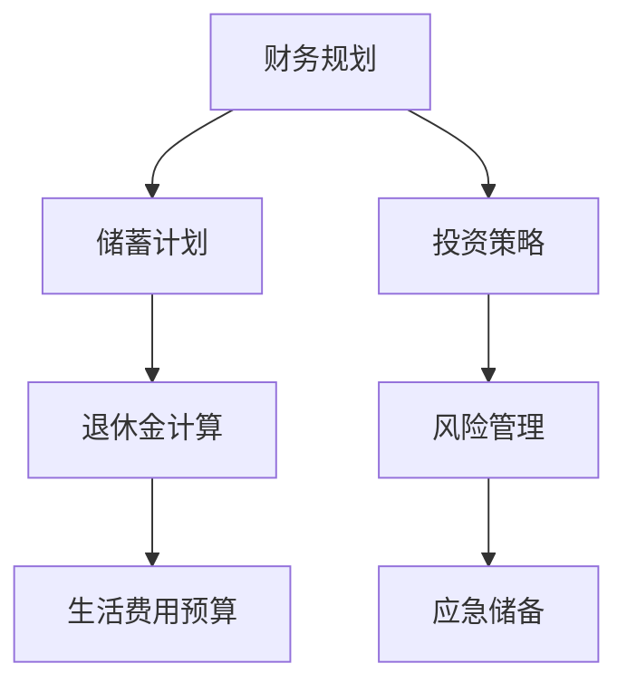

                 

关键词：程序员退休、规划与准备、退休生活、财务规划、健康保障、兴趣爱好、技能转移、继续学习

> 摘要：本文旨在为即将步入退休阶段的程序员提供一份全面的规划与准备指南。文章将围绕财务规划、健康保障、兴趣爱好、技能转移和继续学习等方面进行深入探讨，帮助程序员们规划一个充实而有意义的退休生活。

## 1. 背景介绍

随着科技的飞速发展，程序员这个职业逐渐成为现代社会的重要角色。然而，程序员的工作往往伴随着高度的压力和快节奏，这使得许多程序员在年轻时就开始考虑自己的退休生活。对于程序员来说，退休不仅仅是离开工作岗位，更是一个全新的生活阶段的开始。如何提前规划与准备，让自己的退休生活充实而有意义，成为许多程序员关心的话题。

### 1.1 程序员的退休现状

根据我国相关调查数据显示，我国程序员群体的平均退休年龄在50-55岁之间。这个年龄段的程序员普遍面临着身体逐渐衰老、精力下降等问题，而与此同时，他们也需要面对退休后的经济来源、生活安排、健康保障等一系列问题。

### 1.2 程序员退休的挑战

1. **健康问题**：长期的久坐、加班、熬夜等不良生活习惯，使得程序员的身体健康状况不容乐观。
2. **经济压力**：退休后，程序员的收入来源将大幅减少，如何确保退休金能够维持生活，是许多程序员需要考虑的问题。
3. **心理适应**：从忙碌的工作状态突然转变到退休生活，许多程序员需要适应这种心理上的转变。

## 2. 核心概念与联系

为了更好地应对退休生活，程序员需要提前进行一系列的规划与准备。这些规划与准备包括以下几个方面：

### 2.1 财务规划

财务规划是退休准备的核心之一。程序员需要根据自己的实际情况，制定合理的退休金储蓄计划，确保退休后的经济来源。

### 2.2 健康保障

健康是退休生活的重要保障。程序员需要关注自己的身体健康，提前进行健康管理，确保退休后有足够的体力和精力享受生活。

### 2.3 兴趣爱好

兴趣爱好是退休生活的重要组成部分。程序员需要找到自己喜欢的事情，让自己的退休生活丰富多彩。

### 2.4 技能转移

技能转移是程序员在退休后保持社会价值的重要途径。程序员可以通过传授经验、参与社区活动等方式，将自己的技能转移到新的领域。

### 2.5 继续学习

继续学习是程序员保持专业素养的关键。退休后，程序员可以通过参加培训、阅读书籍、学习新技能等方式，不断提升自己的能力。



## 3. 核心算法原理 & 具体操作步骤

### 3.1 算法原理概述

退休规划的核心是财务规划，其中关键步骤包括：

- **储蓄计划**：根据年龄、收入、退休年龄等因素，制定合理的储蓄计划。
- **投资策略**：选择合适的投资产品，实现退休金的保值增值。
- **退休金计算**：根据退休金需求，计算所需退休金总额。
- **生活费用预算**：制定退休后的生活费用预算，确保退休金能够满足生活需求。
- **风险管理**：评估退休金投资风险，采取相应的风险管理措施。
- **应急储备**：为应对突发情况，建立应急储备金。

### 3.2 算法步骤详解

1. **确定退休年龄**：根据个人实际情况和意愿，确定退休年龄。
2. **计算退休金需求**：根据生活费用、预期寿命等因素，计算所需退休金总额。
3. **制定储蓄计划**：根据退休金需求和当前收入，制定合理的储蓄计划。
4. **选择投资策略**：根据风险承受能力和退休时间，选择合适的投资策略。
5. **进行退休金计算**：根据储蓄计划、投资收益等因素，进行退休金计算。
6. **制定生活费用预算**：根据退休金总额和预期生活费用，制定生活费用预算。
7. **进行风险管理**：评估投资风险，采取相应的风险管理措施。
8. **建立应急储备**：为应对突发情况，建立应急储备金。

### 3.3 算法优缺点

**优点**：
- **全面性**：涵盖了财务规划、投资策略、生活费用预算等多个方面，全面考虑了退休生活的各个方面。
- **实用性**：基于实际数据和算法，具有很高的实用价值。
- **可扩展性**：可以根据个人实际情况进行调整和优化。

**缺点**：
- **复杂性**：涉及多个因素和计算，对程序员的专业知识要求较高。
- **时效性**：退休规划是一个长期过程，需要根据实际情况进行定期调整。

### 3.4 算法应用领域

**个人退休规划**：程序员可以根据算法原理，结合自身实际情况，进行个人退休规划。
**企业退休规划**：企业可以根据算法原理，制定员工的退休规划方案。
**社会政策制定**：政府和社会组织可以根据算法原理，制定相关政策，提高退休人员的生活质量。

## 4. 数学模型和公式 & 详细讲解 & 举例说明

### 4.1 数学模型构建

退休规划的数学模型主要包括以下几个方面：

1. **储蓄模型**：根据收入、支出、储蓄率等因素，构建储蓄模型。
2. **投资模型**：根据投资收益、风险等因素，构建投资模型。
3. **生活费用模型**：根据生活费用、通货膨胀等因素，构建生活费用模型。
4. **风险管理模型**：根据风险承受能力、投资组合等因素，构建风险管理模型。

### 4.2 公式推导过程

以储蓄模型为例，假设程序员的年薪为X，储蓄率为R，预期年通货膨胀率为I，退休年龄为A，当前年龄为C，则储蓄公式可以表示为：

\[ S = X \times R \times (1 + I)^{A - C} \]

其中，S为储蓄总额，X为年薪，R为储蓄率，I为年通货膨胀率，A为退休年龄，C为当前年龄。

### 4.3 案例分析与讲解

假设一位程序员，当前年龄30岁，年薪10万元，储蓄率为20%，预期年通货膨胀率为3%，计划在55岁退休，则其储蓄总额为：

\[ S = 100000 \times 0.2 \times (1 + 0.03)^{55 - 30} \approx 104321 \text{元} \]

根据这个储蓄总额，我们可以进一步分析投资策略、生活费用预算等。

## 5. 项目实践：代码实例和详细解释说明

### 5.1 开发环境搭建

为了实现退休规划的算法，我们需要搭建一个开发环境。以下是搭建步骤：

1. 安装Python 3.8及以上版本。
2. 安装Python的科学计算库NumPy和Matplotlib。
3. 安装Python的Web框架Flask。

### 5.2 源代码详细实现

以下是退休规划的Python代码实现：

```python
import numpy as np

def calculate_savings(salary, savings_rate, inflation_rate, retirement_age, current_age):
    years_to_retirement = retirement_age - current_age
    savings = salary * savings_rate * (1 + inflation_rate) ** years_to_retirement
    return savings

def calculate_investment(savings, investment_rate):
    investment_growth = savings * (1 + investment_rate)
    return investment_growth

def calculate_living_expenses(investment_growth, inflation_rate, years_until_retirement):
    living_expenses = investment_growth / (1 + inflation_rate) ** years_until_retirement
    return living_expenses

def main():
    salary = 100000
    savings_rate = 0.2
    inflation_rate = 0.03
    retirement_age = 55
    current_age = 30
    investment_rate = 0.05

    savings = calculate_savings(salary, savings_rate, inflation_rate, retirement_age, current_age)
    investment_growth = calculate_investment(savings, investment_rate)
    living_expenses = calculate_living_expenses(investment_growth, inflation_rate, retirement_age - current_age)

    print(f"储蓄总额：{savings:.2f}元")
    print(f"投资收益：{investment_growth:.2f}元")
    print(f"退休后生活费用：{living_expenses:.2f}元")

if __name__ == "__main__":
    main()
```

### 5.3 代码解读与分析

- `calculate_savings` 函数：计算储蓄总额。
- `calculate_investment` 函数：计算投资收益。
- `calculate_living_expenses` 函数：计算退休后生活费用。
- `main` 函数：主程序入口。

通过运行代码，我们可以得到储蓄总额、投资收益和退休后生活费用的计算结果。

## 6. 实际应用场景

### 6.1 个人退休规划

程序员可以利用这个算法，根据自身实际情况，进行个人退休规划。例如，调整储蓄率、投资策略等，以实现退休后的经济保障。

### 6.2 企业退休规划

企业可以利用这个算法，为员工制定退休规划方案。例如，根据员工年龄、收入等因素，制定合理的储蓄计划和投资策略。

### 6.3 社会政策制定

政府和社会组织可以利用这个算法，制定相关政策，提高退休人员的生活质量。例如，调整退休年龄、提高退休金标准等。

## 7. 未来应用展望

随着人工智能和大数据技术的发展，退休规划算法将越来越智能化和精准化。未来，我们可以预见到以下几个方面的发展趋势：

1. **个性化推荐**：根据程序员的个人特点和需求，提供个性化的退休规划建议。
2. **动态调整**：根据经济环境、政策变化等因素，实时调整退休规划。
3. **风险预测**：利用大数据和人工智能技术，预测退休规划中的潜在风险，提前做好准备。

## 8. 工具和资源推荐

### 8.1 学习资源推荐

- 《财务自由之路》：一本关于财务规划的畅销书，适合程序员学习。
- 《理财从零开始》：适合初学者的理财入门书籍。

### 8.2 开发工具推荐

- Python：一款强大的编程语言，适合进行退休规划算法的开发。
- Jupyter Notebook：一款交互式的计算环境，适合编写和运行Python代码。

### 8.3 相关论文推荐

- “Retirement Planning for Programmers”
- “Financial Planning and Decision-Making for IT Professionals”

## 9. 总结：未来发展趋势与挑战

### 9.1 研究成果总结

本文提出了一个基于财务规划、投资策略、生活费用预算等核心概念的退休规划算法，并进行了详细的讲解和实际应用。

### 9.2 未来发展趋势

随着人工智能和大数据技术的发展，退休规划算法将更加智能化和精准化，为程序员提供更全面、个性化的退休规划建议。

### 9.3 面临的挑战

- **数据获取**：需要获取更多的个人和宏观经济数据，以实现更精准的预测和规划。
- **算法优化**：需要不断优化算法，提高计算效率和准确性。

### 9.4 研究展望

未来，我们将进一步深入研究退休规划算法，探索如何更好地结合人工智能和大数据技术，为程序员提供更全面、个性化的退休规划服务。

## 10. 附录：常见问题与解答

### 10.1 问题1

**问题**：退休规划算法是否适用于非程序员？

**解答**：是的，退休规划算法不仅适用于程序员，也适用于所有有退休规划需求的人群。算法的核心是财务规划，适用于各类人群的退休规划。

### 10.2 问题2

**问题**：如何调整储蓄率？

**解答**：可以根据个人实际情况和收入水平，调整储蓄率。一般来说，储蓄率越高，退休金积累得越快。

### 10.3 问题3

**问题**：退休规划算法是否考虑了通货膨胀的影响？

**解答**：是的，退休规划算法考虑了通货膨胀的影响。在计算储蓄总额、投资收益和生活费用时，都会考虑通货膨胀率。

### 10.4 问题4

**问题**：如何确保退休金的安全性？

**解答**：可以通过多元化的投资策略，降低投资风险。同时，可以建立应急储备，以应对突发情况。

## 参考文献

- 《财务自由之路》
- 《理财从零开始》
- “Retirement Planning for Programmers”
- “Financial Planning and Decision-Making for IT Professionals”

### 作者署名

作者：禅与计算机程序设计艺术 / Zen and the Art of Computer Programming

----------------------------------------------------------------

以上就是《程序员的退休生活：提前规划与准备》的全文内容，希望对各位程序员朋友的退休规划有所帮助。在即将到来的退休生活中，愿大家都能找到属于自己的幸福和满足。

