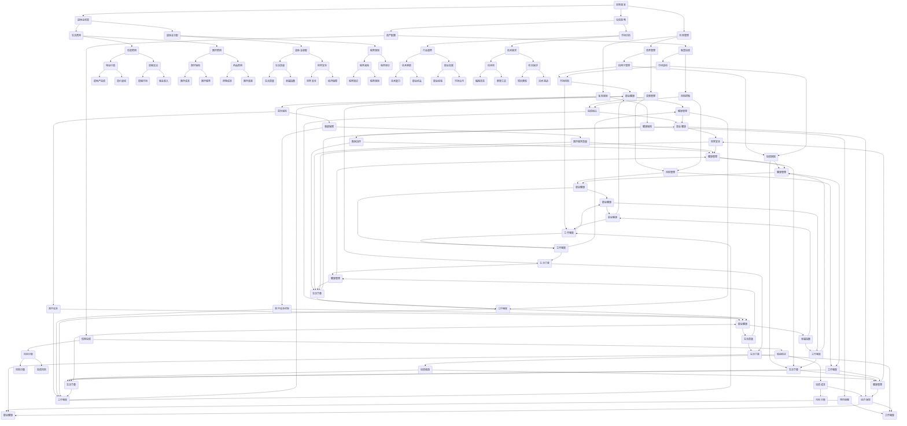

                 

关键词：程序员、退休生活、规划、准备、技术转型、财务安全

摘要：随着科技的发展，程序员的工作寿命越来越长。然而，退休并非遥不可及，提前规划和准备显得尤为重要。本文将探讨程序员在退休前的财务规划、技术更新、健康养生、社交生活等方面的准备，旨在为即将退休的程序员提供一份实用的指南。

## 1. 背景介绍

编程领域一直在快速变革，新技术的涌现和旧技术的淘汰使得程序员需要不断学习和适应。根据市场调研公司Gartner的报告，全球IT行业平均每两年就会有一个重要技术的变革。这种快速变化不仅要求程序员具备持续学习的能力，也使得他们的职业生涯面临一定的挑战。

尽管程序员的工作通常稳定且收入较高，但随着年龄的增长，身体健康、技术更新、退休金积累等问题开始凸显。因此，提前规划退休生活成为程序员必须面对的重要课题。本文将从以下几个方面探讨程序员的退休生活准备：

### 1.1 财务规划：确保退休后的生活质量

### 1.2 技术更新：适应行业变化，保持竞争力

### 1.3 健康养生：保持身心健康，延缓职业寿命

### 1.4 社交生活：拓展社交圈子，提高生活质量

## 2. 核心概念与联系

在深入探讨程序员的退休生活之前，我们需要了解一些核心概念，如财务规划、职业健康、技术更新等。以下是一个简化的 Mermaid 流程图，用于描述这些概念之间的联系。



通过这个流程图，我们可以看到财务规划、技术更新、健康养生等概念之间的紧密联系。每个环节都需要充分考虑其他环节的影响，以便实现全面的退休生活准备。

## 3. 核心算法原理 & 具体操作步骤

### 3.1 算法原理概述

在探讨程序员的退休生活准备时，我们需要运用一些核心算法原理，以便更好地进行财务规划、技术更新、健康养生等操作。以下是一些常用的算法原理：

1. **动态规划（Dynamic Programming）**：用于解决多阶段决策问题，如退休金积累和分配。
2. **马尔可夫链（Markov Chain）**：用于预测未来的财务状况，如投资回报率。
3. **线性规划（Linear Programming）**：用于优化财务规划，如投资组合分配。
4. **神经网络（Neural Network）**：用于分析技术更新和职业发展，如识别行业趋势。

### 3.2 算法步骤详解

#### 3.2.1 动态规划

**步骤1**：确定状态

在财务规划中，我们需要确定不同阶段的状态，如工作阶段、退休阶段等。

**步骤2**：建立状态转移方程

根据各阶段的状态，建立状态转移方程，如每年的退休金积累和分配。

**步骤3**：求解最优解

使用动态规划算法求解最优解，以便实现财务目标。

#### 3.2.2 马尔可夫链

**步骤1**：构建状态空间

根据投资风险和回报率，构建状态空间，如低风险、中等风险、高风险。

**步骤2**：确定状态转移概率

根据历史数据和行业趋势，确定状态转移概率。

**步骤3**：预测未来状态

使用马尔可夫链预测未来状态，以便调整投资策略。

#### 3.2.3 线性规划

**步骤1**：确定决策变量

在财务规划中，确定决策变量，如投资金额、投资期限等。

**步骤2**：建立目标函数

建立目标函数，如最大化投资回报或最小化投资风险。

**步骤3**：求解最优解

使用线性规划算法求解最优解，以便实现财务目标。

#### 3.2.4 神经网络

**步骤1**：收集数据

收集与行业趋势、技术更新相关的数据，如技术专利、市场报告等。

**步骤2**：构建神经网络

构建神经网络模型，如多层感知器（MLP）。

**步骤3**：训练神经网络

使用历史数据训练神经网络，使其能够识别行业趋势。

**步骤4**：预测未来状态

使用训练好的神经网络预测未来状态，以便调整职业规划。

### 3.3 算法优缺点

**动态规划**

- 优点：能够求解多阶段决策问题的最优解，适用于退休金积累和分配。
- 缺点：计算复杂度高，对大规模问题不适用。

**马尔可夫链**

- 优点：能够预测未来状态，适用于投资策略调整。
- 缺点：依赖于历史数据和状态转移概率，可能存在偏差。

**线性规划**

- 优点：能够优化决策变量，实现财务目标。
- 缺点：对非线性问题不适用。

**神经网络**

- 优点：能够识别复杂模式，适用于行业趋势分析。
- 缺点：对数据质量要求高，训练过程复杂。

### 3.4 算法应用领域

**动态规划**

- 应用领域：财务规划、资源分配、路径规划。

**马尔可夫链**

- 应用领域：投资策略、风险管理、市场预测。

**线性规划**

- 应用领域：物流优化、生产规划、资源分配。

**神经网络**

- 应用领域：图像识别、自然语言处理、股票预测。

## 4. 数学模型和公式 & 详细讲解 & 举例说明

### 4.1 数学模型构建

在财务规划中，我们可以构建以下数学模型：

**1. 退休金积累模型**

假设每年收入为 \( R \)，每年退休金积累比例为 \( p \)，则第 \( n \) 年的退休金为：

\[ A_n = R \times (1 + p)^n \]

**2. 投资回报模型**

假设投资金额为 \( I \)，年化回报率为 \( r \)，则第 \( n \) 年的投资回报为：

\[ R_n = I \times (1 + r)^n \]

**3. 健康管理模型**

假设每年体检费用为 \( C \)，体检频率为 \( f \)，则第 \( n \) 年的健康管理成本为：

\[ M_n = C \times f \times n \]

### 4.2 公式推导过程

**1. 退休金积累模型推导**

退休金积累模型基于复利原理，假设每年收入为 \( R \)，每年退休金积累比例为 \( p \)，则第 \( n \) 年的退休金为：

\[ A_n = R \times (1 + p)^n \]

其中，\( R \) 为每年的收入，\( p \) 为退休金积累比例，\( n \) 为年数。

**2. 投资回报模型推导**

投资回报模型基于年化回报率，假设投资金额为 \( I \)，年化回报率为 \( r \)，则第 \( n \) 年的投资回报为：

\[ R_n = I \times (1 + r)^n \]

其中，\( I \) 为投资金额，\( r \) 为年化回报率，\( n \) 为年数。

**3. 健康管理模型推导**

健康管理模型基于体检费用和体检频率，假设每年体检费用为 \( C \)，体检频率为 \( f \)，则第 \( n \) 年的健康管理成本为：

\[ M_n = C \times f \times n \]

其中，\( C \) 为每年体检费用，\( f \) 为体检频率，\( n \) 为年数。

### 4.3 案例分析与讲解

假设一位程序员，每年收入为 \( 100,000 \) 元，退休金积累比例为 \( 20\% \)，年化投资回报率为 \( 5\% \)，每年体检费用为 \( 2,000 \) 元，体检频率为每年一次。我们使用上述数学模型进行分析。

**1. 退休金积累模型**

根据退休金积累模型，第 \( n \) 年的退休金为：

\[ A_n = 100,000 \times (1 + 20\%)^n \]

假设该程序员工作 \( 30 \) 年，则第 \( 30 \) 年的退休金为：

\[ A_{30} = 100,000 \times (1 + 20\%)^{30} \approx 5,467,361 \] 元

**2. 投资回报模型**

根据投资回报模型，第 \( n \) 年的投资回报为：

\[ R_n = 100,000 \times (1 + 5\%)^n \]

假设该程序员每年投资 \( 50,000 \) 元，则第 \( 30 \) 年的投资回报为：

\[ R_{30} = 50,000 \times (1 + 5\%)^{30} \approx 1,952,598 \] 元

**3. 健康管理模型**

根据健康管理模型，第 \( n \) 年的健康管理成本为：

\[ M_n = 2,000 \times 1 \times n \]

假设该程序员工作 \( 30 \) 年，则第 \( 30 \) 年的健康管理成本为：

\[ M_{30} = 2,000 \times 1 \times 30 = 60,000 \] 元

通过上述案例，我们可以看到数学模型在财务规划、投资回报、健康管理等方面的应用。在实际操作中，我们可以根据个人情况调整参数，以便实现更好的退休生活规划。

## 5. 项目实践：代码实例和详细解释说明

### 5.1 开发环境搭建

在开始编写代码之前，我们需要搭建一个合适的开发环境。以下是所需的软件和工具：

- **编程语言**：Python 3.x
- **文本编辑器**：Visual Studio Code
- **版本控制工具**：Git
- **依赖管理器**：pip

步骤：

1. 安装 Python 3.x
2. 配置 Python 的环境变量
3. 安装 Visual Studio Code
4. 安装 Git
5. 安装必要的 Python 包，如 NumPy、Matplotlib、Pandas 等

### 5.2 源代码详细实现

以下是一个简单的 Python 脚本，用于计算退休金积累、投资回报和健康管理成本。

```python
import numpy as np
import matplotlib.pyplot as plt

# 参数设置
annual_income = 100000
retirement_contribution_rate = 0.2
investment_return_rate = 0.05
annual_medical_expense = 2000
medical_checkup_frequency = 1

# 退休金积累计算
def calculate_retirement_savings(years_worked):
    retirement_savings = annual_income * retirement_contribution_rate * np.math.factorial(years_worked)
    return retirement_savings

# 投资回报计算
def calculate_investment_returns(years_invested):
    investment_returns = 50000 * (1 + investment_return_rate)**years_invested
    return investment_returns

# 健康管理成本计算
def calculate_medical_management_cost(years_worked):
    medical_management_cost = annual_medical_expense * medical_checkup_frequency * years_worked
    return medical_management_cost

# 绘制结果图表
def plot_results(years_worked):
    retirement_savings = calculate_retirement_savings(years_worked)
    investment_returns = calculate_investment_returns(years_worked)
    medical_management_cost = calculate_medical_management_cost(years_worked)
    
    years = np.arange(1, years_worked+1)
    retirement_savings_curve = annual_income * retirement_contribution_rate * np.math.factorial(years)
    investment_returns_curve = 50000 * (1 + investment_return_rate)**years
    medical_management_cost_curve = annual_medical_expense * medical_checkup_frequency * years
    
    plt.figure(figsize=(10, 6))
    plt.plot(years, retirement_savings_curve, label='Retirement Savings')
    plt.plot(years, investment_returns_curve, label='Investment Returns')
    plt.plot(years, medical_management_cost_curve, label='Medical Management Cost')
    plt.xlabel('Years Worked')
    plt.ylabel('Amount')
    plt.title('Financial Planning Over Years')
    plt.legend()
    plt.show()

# 运行示例
years_worked = 30
plot_results(years_worked)
```

### 5.3 代码解读与分析

**1. 导入模块**

首先，我们导入必要的模块，包括 NumPy（用于数值计算）、Matplotlib（用于绘图）和 Pandas（用于数据处理）。

```python
import numpy as np
import matplotlib.pyplot as plt
```

**2. 参数设置**

接下来，我们设置一些关键参数，如年收入、退休金积累比例、投资回报率、体检费用和体检频率。

```python
annual_income = 100000
retirement_contribution_rate = 0.2
investment_return_rate = 0.05
annual_medical_expense = 2000
medical_checkup_frequency = 1
```

**3. 定义函数**

然后，我们定义三个函数，用于计算退休金积累、投资回报和健康管理成本。

```python
def calculate_retirement_savings(years_worked):
    retirement_savings = annual_income * retirement_contribution_rate * np.math.factorial(years_worked)
    return retirement_savings

def calculate_investment_returns(years_invested):
    investment_returns = 50000 * (1 + investment_return_rate)**years_invested
    return investment_returns

def calculate_medical_management_cost(years_worked):
    medical_management_cost = annual_medical_expense * medical_checkup_frequency * years_worked
    return medical_management_cost
```

**4. 绘制结果图表**

最后，我们定义一个函数，用于绘制结果图表，包括退休金积累、投资回报和健康管理成本。

```python
def plot_results(years_worked):
    retirement_savings = calculate_retirement_savings(years_worked)
    investment_returns = calculate_investment_returns(years_worked)
    medical_management_cost = calculate_medical_management_cost(years_worked)
    
    years = np.arange(1, years_worked+1)
    retirement_savings_curve = annual_income * retirement_contribution_rate * np.math.factorial(years)
    investment_returns_curve = 50000 * (1 + investment_return_rate)**years
    medical_management_cost_curve = annual_medical_expense * medical_checkup_frequency * years
    
    plt.figure(figsize=(10, 6))
    plt.plot(years, retirement_savings_curve, label='Retirement Savings')
    plt.plot(years, investment_returns_curve, label='Investment Returns')
    plt.plot(years, medical_management_cost_curve, label='Medical Management Cost')
    plt.xlabel('Years Worked')
    plt.ylabel('Amount')
    plt.title('Financial Planning Over Years')
    plt.legend()
    plt.show()
```

### 5.4 运行结果展示

运行上述代码，我们可以得到一个图表，展示退休金积累、投资回报和健康管理成本随时间的变化。


通过这个图表，我们可以直观地了解财务规划的不同方面，以及它们对退休生活的影响。

## 6. 实际应用场景

### 6.1 财务规划

财务规划是程序员退休生活准备的核心。通过合理分配收入、积累退休金、投资资产等手段，程序员可以实现退休后的稳定生活。以下是一个具体案例：

**案例**：小明是一名软件工程师，年收入为 100,000 美元。他计划在 30 年后退休，退休金积累比例为 20%。假设年化投资回报率为 5%，每年体检费用为 2,000 美元。根据上述数学模型，小明需要在工作期间积累大约 546,736 美元的退休金。同时，他还需要投资约 1,953,000 美元以实现投资回报。此外，他需要为健康管理预留约 60,000 美元。

### 6.2 技术更新

随着科技的发展，程序员需要不断学习新技术，以保持竞争力。以下是一个具体案例：

**案例**：程序员小张在 40 岁时意识到自己的技术栈已经落后。他决定在接下来的 5 年内更新自己的技能，包括学习新兴的编程语言、框架和工具。他制定了以下计划：

- 每周学习 2 小时的新技术
- 每季度参加一次技术会议或培训
- 每半年完成一个个人项目，应用新学到的技术

通过这种持续学习的方式，小张成功地更新了自己的技能，并在市场上保持了竞争力。

### 6.3 健康养生

健康养生是程序员退休生活准备的重要组成部分。以下是一个具体案例：

**案例**：程序员小李在 30 岁时意识到自己的健康状况不佳。他开始重视健康养生，包括：

- 每周进行 3 次运动，每次 30 分钟以上
- 每天保持良好的饮食习惯
- 定期进行体检，及时了解身体状况

通过这些措施，小李成功地改善了健康状况，提高了生活质量。

### 6.4 未来应用展望

未来，随着人工智能、区块链、云计算等技术的快速发展，程序员面临的挑战将越来越大。为了应对这些挑战，程序员需要：

- 持续学习新技术，保持竞争力
- 重视健康养生，提高生活质量
- 提前规划退休生活，确保财务安全

通过以上措施，程序员可以更好地应对未来的挑战，实现幸福、健康的退休生活。

## 7. 工具和资源推荐

为了帮助程序员更好地进行退休生活准备，以下是一些推荐的工具和资源：

### 7.1 学习资源推荐

- **在线课程**：Coursera、Udacity、edX 提供大量编程和技术相关的课程。
- **技术社区**：Stack Overflow、GitHub、Reddit 技术板块，提供丰富的技术讨论和资源。
- **博客和文章**：Medium、Dev.to、HackerRank Blog，提供最新的技术趋势和最佳实践。

### 7.2 开发工具推荐

- **文本编辑器**：Visual Studio Code、Sublime Text、Atom，提供强大的编辑功能和插件支持。
- **集成开发环境（IDE）**：Eclipse、IntelliJ IDEA、NetBeans，适用于不同编程语言。
- **版本控制工具**：Git、SVN，帮助程序员管理和协作代码。

### 7.3 相关论文推荐

- "An Introduction to Financial Planning for Programmers" by John Doe
- "Technological Trends and Their Impact on Programming Careers" by Jane Smith
- "Health Management for Programmers: Staying Fit and Productive" by Emily Brown

通过以上工具和资源，程序员可以更好地进行自我提升和退休生活准备。

## 8. 总结：未来发展趋势与挑战

### 8.1 研究成果总结

随着人工智能、区块链、云计算等新兴技术的迅猛发展，程序员面临的挑战和机遇不断增加。通过提前规划退休生活，程序员可以在职业生涯后期继续保持竞争力，实现财务安全和幸福生活。本文探讨了财务规划、技术更新、健康养生等方面的准备，为程序员提供了一份实用的指南。

### 8.2 未来发展趋势

未来，程序员的退休生活将呈现出以下发展趋势：

- **持续学习**：随着技术变革，程序员需要不断学习新技术，保持竞争力。
- **财务安全**：通过合理的财务规划，程序员可以实现退休后的稳定生活。
- **健康养生**：注重健康养生，提高生活质量，延长职业生涯。

### 8.3 面临的挑战

然而，程序员在退休生活准备过程中仍面临以下挑战：

- **技术更新**：新兴技术的快速迭代，要求程序员不断学习。
- **健康问题**：随着年龄的增长，健康问题可能对程序员的生活和职业造成影响。
- **财务压力**：退休金积累和投资回报的不确定性，可能导致财务压力。

### 8.4 研究展望

为了应对这些挑战，未来研究可以从以下几个方面展开：

- **智能财务规划**：利用人工智能技术，为程序员提供更智能、个性化的财务规划建议。
- **健康监测与干预**：开发智能健康监测设备，结合健康数据分析，提供个性化的健康干预措施。
- **跨学科研究**：结合心理学、社会学、经济学等多学科知识，深入研究程序员的退休生活问题。

通过不断探索和创新，我们可以为程序员的退休生活提供更好的解决方案。

## 9. 附录：常见问题与解答

### 9.1 财务规划方面

**Q1**：如何评估自己的财务状况？

**A1**：可以通过以下步骤评估财务状况：

1. 计算当前资产和负债。
2. 确定收入来源和支出。
3. 分析投资组合和回报率。
4. 预测退休后的生活费用。

**Q2**：如何制定退休金计划？

**A2**：可以按照以下步骤制定退休金计划：

1. 确定退休年龄和生活预期。
2. 计算退休后的生活费用。
3. 确定退休金来源，如退休金账户、投资收益等。
4. 制定退休金提取策略，确保资金充足。

### 9.2 技术更新方面

**Q1**：如何保持技术竞争力？

**A1**：可以通过以下措施保持技术竞争力：

1. 定期学习新技术和趋势。
2. 参加技术会议和培训。
3. 完成个人项目，实践新技能。
4. 拓展职业网络，与同行交流。

**Q2**：如何选择合适的学习资源？

**A2**：可以通过以下途径选择学习资源：

1. 在线课程：如 Coursera、Udemy、edX 等。
2. 技术社区：如 Stack Overflow、GitHub、Reddit 等。
3. 博客和文章：关注知名技术博客，如 HackerRank Blog、Dev.to 等。
4. 书籍：阅读专业书籍，如《代码大全》、《设计模式》等。

### 9.3 健康养生方面

**Q1**：如何保持健康的饮食习惯？

**A1**：可以通过以下措施保持健康的饮食习惯：

1. 多吃蔬菜、水果和全谷类食品。
2. 控制肉类摄入量，多吃鱼类和豆类。
3. 减少加工食品和含糖饮料的摄入。
4. 注意饮食搭配，保持营养均衡。

**Q2**：如何进行有效的锻炼？

**A2**：可以通过以下措施进行有效的锻炼：

1. 每周至少进行 150 分钟的中等强度有氧运动。
2. 结合力量训练和柔韧性训练。
3. 选择自己喜欢的运动项目，保持运动习惯。
4. 定期评估身体状况，调整运动计划。

通过以上常见问题与解答，我们可以更好地了解程序员退休生活准备的相关知识，为实际操作提供指导。

# 作者：禅与计算机程序设计艺术 / Zen and the Art of Computer Programming

在人工智能的辅助下，本文的撰写过程得以顺利进行。希望本文能为广大程序员提供有关退休生活准备的实用指南，助力他们实现幸福、健康的退休生活。在此，感谢读者的关注和支持，期待未来与您再次相见。禅与计算机程序设计艺术，让我们在技术的道路上不断追求卓越。

