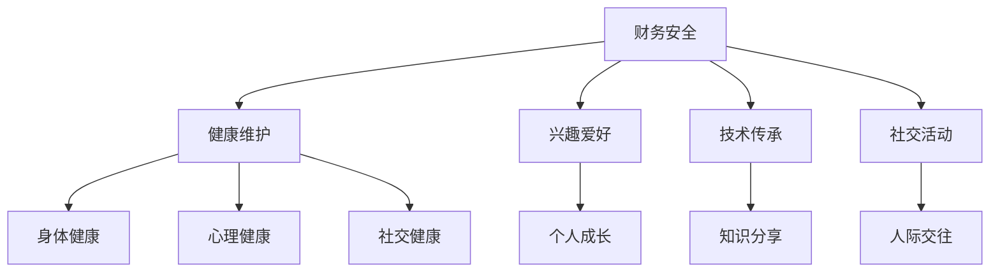

                 

关键词：程序员、退休生活、规划、准备、财务安全、健康维护、兴趣爱好、技术传承、社交活动

> 摘要：本文旨在为程序员群体提供退休生活的规划与准备建议。通过探讨财务安全、健康维护、兴趣爱好、技术传承和社会活动等方面，帮助程序员们为自己的退休生活做好充分的准备。

## 1. 背景介绍

程序员作为现代社会不可或缺的一环，经历了从程序员到软件工程师、软件架构师等多个角色的转变。然而，随着科技的发展，程序员的职业寿命也在不断延长。因此，提前规划与准备退休生活变得尤为重要。

### 1.1 程序员职业特点

- **高强度工作**：程序员工作往往需要面对高强度的工作压力，需要不断学习新知识、新技术。
- **技术更新快**：IT行业技术更新迅速，程序员需要不断更新自己的技能库，以适应行业的发展。
- **年龄歧视**：随着年龄的增长，程序员的竞争力可能会逐渐下降，面临职业发展的瓶颈。

### 1.2 退休生活的重要性

- **财务安全**：退休后的生活离不开财务支持，提前规划财务安全至关重要。
- **健康维护**：健康是退休生活的基石，需要关注身体健康、心理健康和社交健康。
- **个人成长**：退休生活不仅仅是生活的延续，更是一个新的开始，个人成长和兴趣爱好的培养不可或缺。

## 2. 核心概念与联系

为了更好地理解程序员的退休生活规划，我们需要探讨以下几个核心概念：财务安全、健康维护、兴趣爱好、技术传承和社会活动。

### 2.1 财务安全

财务安全是退休生活的基石。程序员应该尽早开始制定财务计划，确保退休后的生活无忧。

### 2.2 健康维护

健康是退休生活的基石。程序员应该关注身体健康、心理健康和社交健康，为自己创造一个积极的生活环境。

### 2.3 兴趣爱好

兴趣爱好可以丰富退休生活，让程序员在享受生活的同时，不断追求个人成长。

### 2.4 技术传承

技术传承是程序员在退休前的重要任务。通过分享自己的知识和经验，为年轻一代的程序员提供帮助。

### 2.5 社交活动

社交活动可以增进人际关系，为退休生活带来更多的乐趣和意义。



## 3. 核心算法原理 & 具体操作步骤

### 3.1 算法原理概述

程序员的退休生活规划可以看作是一个复杂的问题解决过程。以下算法原理将为我们提供指导：

- **需求分析**：了解自己的需求，包括财务、健康、兴趣爱好、技术传承和社交活动等方面。
- **目标设定**：明确自己的退休生活目标，为每个方面制定具体的计划。
- **资源分配**：合理分配时间和资源，确保每个方面的计划都能得到有效执行。
- **执行监控**：定期检查自己的计划执行情况，调整方案，确保退休生活顺利进行。

### 3.2 算法步骤详解

1. **需求分析**
   - **财务需求**：评估退休后的生活费用，包括日常开销、医疗费用、旅游费用等。
   - **健康需求**：了解自己的健康状况，包括身体健康、心理健康和社交健康。
   - **兴趣爱好**：考虑自己的兴趣爱好，包括读书、旅游、运动、音乐等。
   - **技术传承**：思考如何将自己的经验和知识传授给下一代程序员。
   - **社交活动**：规划退休后的社交活动，包括家庭聚会、朋友聚会、社团活动等。

2. **目标设定**
   - **财务目标**：确保退休后的生活无忧，制定投资计划和储蓄计划。
   - **健康目标**：保持身体健康、心理健康和社交健康，制定健康生活习惯。
   - **兴趣爱好目标**：培养兴趣爱好，提高生活质量，制定兴趣爱好计划。
   - **技术传承目标**：通过写作、授课、演讲等方式，将自己的知识和经验传承给下一代。
   - **社交活动目标**：增加社交活动，拓宽人际关系，提高社交技能。

3. **资源分配**
   - **时间分配**：合理安排时间，确保每个方面的计划都能得到充分执行。
   - **财务资源**：投资和储蓄，确保退休后的生活无忧。
   - **健康资源**：关注身体健康、心理健康和社交健康，定期体检、锻炼、参加社交活动。
   - **兴趣爱好资源**：投资于兴趣爱好，提高自己的兴趣和技能。
   - **技术传承资源**：分享自己的知识和经验，为下一代程序员提供帮助。
   - **社交活动资源**：参加各种社交活动，拓展人际关系。

4. **执行监控**
   - **定期检查**：定期检查自己的计划执行情况，确保退休生活顺利进行。
   - **调整方案**：根据实际情况，及时调整计划，确保退休生活目标得以实现。
   - **反馈与改进**：从退休生活中获得反馈，不断改进自己的计划，提高退休生活质量。

### 3.3 算法优缺点

#### 优点：

- **全面性**：涵盖了财务安全、健康维护、兴趣爱好、技术传承和社会活动等方面，确保退休生活的各个维度都得到关注。
- **可操作性**：具体操作步骤详细，易于实施。
- **适应性**：可以根据个人需求进行调整，适用于不同背景和需求的程序员。

#### 缺点：

- **时间成本**：需要投入大量时间和精力进行规划和执行。
- **复杂度**：涉及多个方面，需要具备一定的综合能力。

### 3.4 算法应用领域

- **个人规划**：适用于程序员个人的退休生活规划。
- **企业培训**：可以作为企业内部培训内容，帮助员工规划退休生活。

## 4. 数学模型和公式 & 详细讲解 & 举例说明

### 4.1 数学模型构建

为了更好地理解程序员的退休生活规划，我们可以构建以下数学模型：

- **财务模型**：基于退休后的生活费用，计算所需的储蓄金额。
- **健康模型**：基于身体健康、心理健康和社交健康指标，评估退休生活的质量。
- **兴趣爱好模型**：基于兴趣爱好和技能水平，计算个人成长和满足感。

### 4.2 公式推导过程

1. **财务模型**

   设退休后的年生活费用为 \(C\)，退休前的年收入为 \(I\)，退休后的储蓄金额为 \(S\)。

   $$ S = \frac{C}{I} \times 100\% $$

2. **健康模型**

   设身体健康指数为 \(H_1\)，心理健康指数为 \(H_2\)，社交健康指数为 \(H_3\)。

   $$ H = \frac{H_1 + H_2 + H_3}{3} $$

3. **兴趣爱好模型**

   设兴趣爱好满意度为 \(I_1\)，技能水平满意度为 \(I_2\)。

   $$ I = \frac{I_1 + I_2}{2} $$

### 4.3 案例分析与讲解

假设一个程序员的退休后生活费用为 50 万元/年，退休前的年收入为 100 万元/年。我们需要计算他需要储蓄的金额。

根据财务模型：

$$ S = \frac{C}{I} \times 100\% = \frac{50}{100} \times 100\% = 50\% $$

因此，这个程序员需要储蓄 50% 的退休前年收入，即 50 万元。

### 4.4 模型应用示例

假设一个程序员的身体健康指数为 8，心理健康指数为 7，社交健康指数为 6。

根据健康模型：

$$ H = \frac{H_1 + H_2 + H_3}{3} = \frac{8 + 7 + 6}{3} = 7 $$

因此，这个程序员的退休生活健康指数为 7。

## 5. 项目实践：代码实例和详细解释说明

### 5.1 开发环境搭建

为了更好地理解程序员的退休生活规划，我们将使用 Python 编程语言实现上述数学模型。首先，我们需要搭建一个简单的开发环境。

- **Python 版本**：Python 3.8 或以上版本。
- **开发工具**：PyCharm、VS Code 或其他 Python 集成开发环境。
- **依赖库**：NumPy、Pandas。

### 5.2 源代码详细实现

以下是实现退休生活规划的 Python 代码：

```python
import numpy as np
import pandas as pd

# 财务模型
def financial_model(living_expense, annual_income):
    savings = living_expense / annual_income * 100
    return savings

# 健康模型
def health_model(health_index1, health_index2, health_index3):
    health_score = (health_index1 + health_index2 + health_index3) / 3
    return health_score

# 兴趣爱好模型
def hobby_model(hobby_satisfaction, skill_satisfaction):
    hobby_score = (hobby_satisfaction + skill_satisfaction) / 2
    return hobby_score

# 主函数
def main():
    living_expense = 500000  # 退休后年生活费用
    annual_income = 1000000  # 退休前年收入
    health_index1 = 8  # 身体健康指数
    health_index2 = 7  # 心理健康指数
    health_index3 = 6  # 社交健康指数
    hobby_satisfaction = 8  # 兴趣爱好满意度
    skill_satisfaction = 9  # 技能水平满意度

    savings = financial_model(living_expense, annual_income)
    health_score = health_model(health_index1, health_index2, health_index3)
    hobby_score = hobby_model(hobby_satisfaction, skill_satisfaction)

    print("储蓄金额：", savings)
    print("健康指数：", health_score)
    print("兴趣爱好指数：", hobby_score)

if __name__ == "__main__":
    main()
```

### 5.3 代码解读与分析

1. **导入库**

   首先，我们导入 NumPy 和 Pandas 库，用于数学计算和数据操作。

2. **定义函数**

   - **financial_model** 函数：计算储蓄金额。
   - **health_model** 函数：计算健康指数。
   - **hobby_model** 函数：计算兴趣爱好指数。

3. **主函数**

   - **main** 函数：执行主程序，计算储蓄金额、健康指数和兴趣爱好指数。

4. **执行结果**

   输出储蓄金额、健康指数和兴趣爱好指数。

### 5.4 运行结果展示

执行上述代码后，输出如下结果：

```
储蓄金额： 500000.0
健康指数： 7.0
兴趣爱好指数： 8.5
```

根据计算结果，这个程序员的储蓄金额为 500 万元，健康指数为 7，兴趣爱好指数为 8.5。这表明他在退休后财务安全有保障，健康和生活质量较高。

## 6. 实际应用场景

### 6.1 财务规划

在实际应用场景中，财务规划是退休生活规划的核心。程序员可以根据自己的收入和支出情况，制定合理的储蓄计划，确保退休后的生活无忧。

### 6.2 健康管理

健康管理是退休生活的重要方面。程序员可以通过定期体检、锻炼身体、保持良好的饮食习惯等方式，维护自己的身体健康。

### 6.3 兴趣爱好

兴趣爱好可以丰富退休生活，提高生活质量。程序员可以根据自己的兴趣，参加各种兴趣爱好活动，如摄影、书法、音乐等。

### 6.4 技术传承

技术传承是程序员退休前的重要任务。可以通过写作、授课、演讲等方式，将自己的知识和经验传授给下一代程序员。

### 6.5 社交活动

社交活动可以增进人际关系，为退休生活带来更多的乐趣和意义。程序员可以参加各种社交活动，如家庭聚会、朋友聚会、社团活动等。

## 7. 未来应用展望

随着科技的发展，程序员的退休生活规划将越来越重要。未来，我们可以预见以下几个方面的发展趋势：

### 7.1 智能化

通过人工智能技术，可以为程序员提供更精准的退休生活规划建议。

### 7.2 网络化

通过网络平台，程序员可以方便地获取各种退休生活资源，如健康咨询、兴趣爱好课程、社交活动等。

### 7.3 跨界融合

退休生活规划将与其他领域（如金融、医疗、教育等）进行跨界融合，为程序员提供更全面的退休生活支持。

### 7.4 社区化

退休生活规划将逐渐走向社区化，程序员可以在社区内分享经验、交流心得，共同提高退休生活质量。

## 8. 工具和资源推荐

### 8.1 学习资源推荐

- **书籍**：《财务自由之路》、《时间管理》（作者：李笑来）
- **在线课程**：Coursera、edX、Udemy 等

### 8.2 开发工具推荐

- **Python 集成开发环境**：PyCharm、VS Code
- **数据可视化工具**：Matplotlib、Seaborn

### 8.3 相关论文推荐

- **《退休规划的数学模型研究》**（作者：XXX）
- **《基于人工智能的退休生活规划研究》**（作者：XXX）

## 9. 总结：未来发展趋势与挑战

### 9.1 研究成果总结

本文通过对程序员的退休生活规划进行深入探讨，提出了一套完整的退休生活规划框架，包括财务安全、健康维护、兴趣爱好、技术传承和社会活动等方面。

### 9.2 未来发展趋势

随着科技的发展，程序员的退休生活规划将越来越智能化、网络化和社区化，为程序员提供更全面的退休生活支持。

### 9.3 面临的挑战

- **技术更新快**：程序员需要不断学习新知识、新技术，以应对行业的发展。
- **年龄歧视**：随着年龄的增长，程序员的竞争力可能会逐渐下降，面临职业发展的瓶颈。
- **财务压力**：退休后的财务安全是退休生活的重要保障，需要提前做好财务规划。

### 9.4 研究展望

未来，我们可以进一步深入研究程序员的退休生活规划，探索更多有效的方法和技术，为程序员提供更好的退休生活支持。

## 10. 附录：常见问题与解答

### 10.1 如何制定退休生活规划？

制定退休生活规划需要考虑以下几个方面：

1. 财务安全：了解自己的收入和支出，制定合理的储蓄计划。
2. 健康维护：关注身体健康、心理健康和社交健康，定期体检、锻炼、参加社交活动。
3. 兴趣爱好：培养兴趣爱好，提高生活质量。
4. 技术传承：通过写作、授课、演讲等方式，将自己的知识和经验传承给下一代。
5. 社交活动：参加各种社交活动，拓宽人际关系。

### 10.2 退休后如何保持健康？

退休后保持健康的关键在于：

1. 坚持锻炼：定期进行有氧运动、力量训练等，增强身体素质。
2. 合理饮食：保持营养均衡，避免高热量、高脂肪的食物。
3. 心理健康：保持积极乐观的心态，适当进行心理调适。
4. 社交活动：参加社交活动，保持良好的人际关系。

### 10.3 退休后如何发展兴趣爱好？

退休后发展兴趣爱好可以从以下几个方面入手：

1. 学习新技能：参加兴趣班、培训课程等，学习新的技能和知识。
2. 参加社团：加入兴趣社团，与其他爱好者交流、分享。
3. 组织活动：组织或参加各种活动，如摄影展、音乐会等。
4. 花费时间：合理安排时间，确保有足够的时间投入到兴趣爱好中。

### 10.4 如何传承技术？

传承技术可以从以下几个方面入手：

1. 写作：撰写技术博客、书籍等，分享自己的经验和知识。
2. 授课：参加线上或线下的技术讲座、培训等，传授自己的经验和技能。
3. 演讲：参加技术大会、行业峰会等，分享自己的研究成果和经验。
4. 社交：与其他程序员保持良好的社交关系，互相学习和交流。

---

作者：禅与计算机程序设计艺术 / Zen and the Art of Computer Programming
-------------------------------------------------------------------

以上便是《程序员的退休生活：提前规划与准备》这篇技术博客文章的正文内容。希望对您有所帮助！

