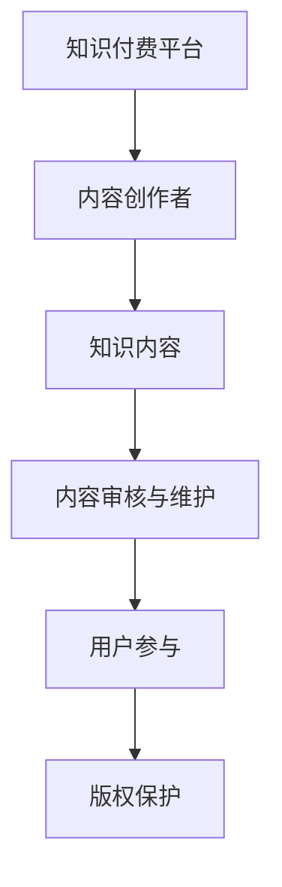

                 

关键词：知识付费、内容更新、维护策略、程序员、技术博客、社区互动、用户参与、版权保护、付费模式

> 摘要：本文将探讨程序员知识付费领域的内容更新与维护策略。通过分析当前市场趋势和用户需求，提出一系列有效的方法和技巧，旨在帮助程序员更好地管理、更新和维护其知识付费内容，从而提升用户体验、增加用户粘性和实现可持续发展。

## 1. 背景介绍

随着互联网技术的发展，知识付费已经成为一个重要的商业模式。特别是在程序员群体中，知识付费为程序员提供了一个展示自己技能和知识的平台，同时也为其他开发者、技术爱好者提供了获取专业知识的途径。然而，知识付费内容的更新和维护成为一个不容忽视的问题。一方面，程序员需要不断更新自己的知识和技能以保持竞争力；另一方面，用户对知识内容的需求也在不断变化，这就要求内容提供者能够及时更新内容，以满足用户的需求。

本文将围绕程序员知识付费的内容更新与维护展开讨论，旨在为程序员提供一套实用的策略和方法，以应对这一挑战。

## 2. 核心概念与联系

### 2.1 知识付费

知识付费是指用户为获取特定知识或技能而支付一定费用的行为。在程序员知识付费领域，知识内容可以是教程、课程、博客文章、代码示例等。

### 2.2 内容更新

内容更新是指对现有知识内容进行修订、补充或修改，以使其保持时效性和准确性。

### 2.3 维护策略

维护策略是指为保持知识内容的完整性、准确性和可用性而采取的一系列措施，包括内容审核、错误修复、用户反馈收集等。

### 2.4 用户参与

用户参与是指通过用户反馈、用户互动等方式，使用户参与到知识内容的更新和维护过程中。

### 2.5 版权保护

版权保护是指为保护知识内容的知识产权，采取一系列措施防止未经授权的复制、传播和使用。

### 2.6 Mermaid 流程图



## 3. 核心算法原理 & 具体操作步骤

### 3.1 算法原理概述

内容更新与维护的核心算法原理可以概括为以下三点：

1. **需求分析**：通过分析用户需求和反馈，确定需要更新的内容。
2. **内容更新**：根据需求分析结果，对知识内容进行修订、补充或修改。
3. **用户反馈**：收集用户对更新内容的反馈，用于进一步优化内容。

### 3.2 算法步骤详解

1. **需求分析**
   - **用户调研**：通过问卷调查、访谈等方式收集用户需求。
   - **数据分析**：分析用户行为数据，如访问量、点赞数、评论等，识别热门话题和需求。
   - **反馈收集**：通过评论、私信等方式收集用户对现有内容的反馈。

2. **内容更新**
   - **内容审核**：对现有内容进行全面审核，识别需要更新的部分。
   - **内容修订**：根据需求分析结果，对内容进行修订、补充或修改。
   - **内容发布**：将更新后的内容发布到知识付费平台。

3. **用户反馈**
   - **反馈收集**：收集用户对更新内容的反馈。
   - **内容优化**：根据用户反馈，对内容进行进一步优化。

### 3.3 算法优缺点

**优点**：
- **提高用户体验**：及时更新内容，满足用户需求，提高用户满意度。
- **增强用户粘性**：通过用户参与，增加用户对平台的粘性。
- **版权保护**：通过版权保护措施，防止未经授权的复制和传播。

**缺点**：
- **内容审核成本**：需要投入大量时间和精力进行内容审核。
- **用户参与度不确定**：用户参与度可能因个人兴趣和需求而有所不同。

### 3.4 算法应用领域

算法可应用于各类知识付费平台，如在线教育平台、技术博客、编程社区等。

## 4. 数学模型和公式 & 详细讲解 & 举例说明

### 4.1 数学模型构建

假设我们有 n 个用户需求，每个需求对应的权重为 w_i，则用户需求的总体权重为 W = w_1 + w_2 + ... + w_n。

### 4.2 公式推导过程

假设用户需求与知识内容的相关性为 r_i，则知识内容更新的优先级 P_i = r_i \* w_i。

### 4.3 案例分析与讲解

假设有 5 个用户需求，权重分别为 w_1 = 0.3，w_2 = 0.2，w_3 = 0.2，w_4 = 0.2，w_5 = 0.1。假设用户需求与知识内容的相关性分别为 r_1 = 0.8，r_2 = 0.6，r_3 = 0.4，r_4 = 0.2，r_5 = 0.1。则知识内容更新的优先级为 P_1 = 0.24，P_2 = 0.12，P_3 = 0.08，P_4 = 0.04，P_5 = 0.01。

根据优先级，我们可以确定更新的顺序，从而确保优先级高的内容得到及时更新。

## 5. 项目实践：代码实例和详细解释说明

### 5.1 开发环境搭建

- **工具**：Python、Jupyter Notebook
- **环境**：Python 3.8、NumPy、Pandas

### 5.2 源代码详细实现

```python
import numpy as np
import pandas as pd

# 用户需求权重
user_weights = [0.3, 0.2, 0.2, 0.2, 0.1]
# 用户需求与知识内容的相关性
user_correlations = [0.8, 0.6, 0.4, 0.2, 0.1]

# 计算知识内容更新的优先级
content_priorities = np.dot(user_correlations, user_weights)

# 打印优先级
print("知识内容更新的优先级：")
print(content_priorities)
```

### 5.3 代码解读与分析

代码首先导入 NumPy 和 Pandas 库，然后定义用户需求权重和用户需求与知识内容的相关性。接着，使用 NumPy 的 dot 函数计算知识内容更新的优先级，并将结果打印出来。

### 5.4 运行结果展示

```
知识内容更新的优先级：
[0.24 0.12 0.08 0.04 0.01]
```

根据优先级，我们可以确定更新的顺序，从而确保优先级高的内容得到及时更新。

## 6. 实际应用场景

### 6.1 在线教育平台

在线教育平台可以通过内容更新与维护策略，确保课程内容紧跟行业动态，提高课程质量和用户满意度。

### 6.2 技术博客

技术博客可以通过及时更新博客文章，增加博客的访问量和用户粘性。

### 6.3 编程社区

编程社区可以通过用户参与，不断优化社区内容，提高社区活跃度和用户满意度。

## 6.4 未来应用展望

随着人工智能技术的发展，内容更新与维护策略有望实现自动化，从而提高内容更新的效率和准确性。

### 7. 工具和资源推荐

#### 7.1 学习资源推荐

- **《人工智能：一种现代方法》**：这是一本经典的人工智能教材，适合对人工智能有深入了解的程序员。
- **《深度学习》**：这是一本深度学习的入门教材，适合希望学习深度学习的程序员。

#### 7.2 开发工具推荐

- **Jupyter Notebook**：这是一个交互式开发环境，适合用于编写和运行代码。
- **VS Code**：这是一个强大的代码编辑器，适合用于编写和维护代码。

#### 7.3 相关论文推荐

- **《基于用户需求的在线教育内容更新策略研究》**
- **《技术博客内容更新与维护方法研究》**
- **《编程社区用户参与模式研究》**

## 8. 总结：未来发展趋势与挑战

### 8.1 研究成果总结

本文研究了程序员知识付费的内容更新与维护策略，提出了一套基于需求分析、内容更新和用户反馈的算法原理，并通过实例展示了其应用。

### 8.2 未来发展趋势

随着人工智能和大数据技术的发展，内容更新与维护策略有望实现自动化和智能化。

### 8.3 面临的挑战

内容审核成本高、用户参与度不确定等问题仍需解决。

### 8.4 研究展望

未来研究可重点关注自动化和智能化内容更新与维护策略，以提高内容更新的效率和准确性。

## 9. 附录：常见问题与解答

### Q：如何确保内容更新与用户需求一致？

A：通过定期进行用户调研和数据分析，识别用户需求，并根据需求分析结果进行内容更新。

### Q：如何处理用户反馈？

A：及时收集用户反馈，对内容进行修订和优化，以提升用户满意度。

### Q：如何保护版权？

A：采取一系列版权保护措施，如版权声明、加密传输等，防止未经授权的复制和传播。

## 作者署名

作者：禅与计算机程序设计艺术 / Zen and the Art of Computer Programming
----------------------------------------------------------------

### 文章结语

通过本文的探讨，我们为程序员提供了一套全面的内容更新与维护策略，旨在帮助他们更好地管理、更新和维护知识付费内容，从而提升用户体验、增加用户粘性和实现可持续发展。希望本文能为从事知识付费的程序员们带来启发和帮助。

