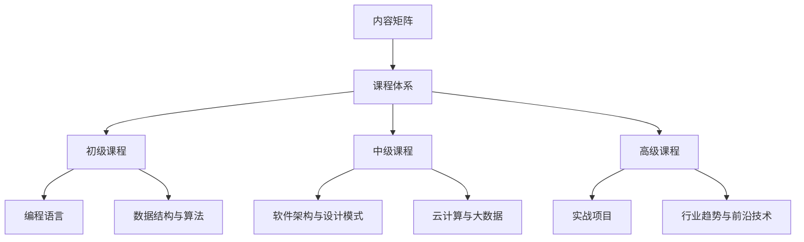

                 

关键词：知识付费，内容矩阵，内容策略，程序员，课程设计，受众分析，用户体验，互动性，平台运营

> 摘要：本文旨在探讨程序员知识付费的内容矩阵构建策略。通过对市场需求的深入分析，结合优秀实践案例，本文提出了一个系统性的内容矩阵构建方法，旨在提升知识付费项目的质量和用户满意度，从而推动知识付费市场的健康发展。

## 1. 背景介绍

随着互联网技术的发展，知识付费逐渐成为一种主流的获取知识的方式。程序员作为知识密集型职业群体，对于专业知识的获取和更新有着极高的需求。然而，如何构建一个既能够满足程序员学习需求，又具有市场竞争力，同时保证用户体验的内容矩阵，成为知识付费平台亟待解决的问题。

### 1.1 市场需求

根据最新的市场调研数据，程序员对于以下几类知识有较高的需求：

1. **编程语言和框架**：如Python、Java、JavaScript、Django、React等。
2. **软件架构和设计模式**：如微服务架构、设计模式、系统优化等。
3. **数据结构与算法**：如排序算法、树结构、图算法等。
4. **云计算和大数据**：如AWS、Azure、Hadoop、Spark等。

### 1.2 知识付费的发展

知识付费的发展趋势主要体现在以下几个方面：

1. **个性化定制**：根据用户需求提供个性化的课程内容。
2. **互动性增强**：通过论坛、问答、直播等形式增加用户互动。
3. **平台多样化**：知识付费平台从单一的视频课程扩展到包括直播、图文、书籍等多种形式。
4. **课程质量提升**：随着市场竞争的加剧，课程质量成为平台竞争的核心。

## 2. 核心概念与联系

### 2.1 内容矩阵概念

内容矩阵是指将不同的课程内容按照一定的逻辑结构进行组织和排列，形成一个有机的知识体系。它包括课程内容、课程结构、课程目标等多个方面。

### 2.2 内容矩阵构建原则

1. **用户导向**：以用户需求为核心，确保课程内容紧贴用户实际需求。
2. **层次分明**：根据知识难度和重要性，将课程分为初级、中级、高级等不同层次。
3. **结构清晰**：确保课程内容之间逻辑连贯，方便用户学习和理解。
4. **持续更新**：紧跟行业动态，定期更新课程内容，保证知识的新鲜度。

### 2.3 内容矩阵架构

下面是一个典型的内容矩阵架构：



## 3. 核心算法原理 & 具体操作步骤

### 3.1 算法原理概述

内容矩阵构建的核心算法是用户需求分析与课程内容设计。通过以下步骤实现：

1. **用户需求分析**：通过问卷调查、用户访谈、数据分析等方式，收集用户的真实需求。
2. **课程内容设计**：根据用户需求，设计课程内容，确保课程内容紧贴用户需求。

### 3.2 算法步骤详解

1. **需求收集**：通过问卷调查、用户访谈等方式，收集用户需求。
2. **需求分析**：对收集到的需求进行分析，分类整理，明确用户的主要需求。
3. **课程设计**：根据用户需求，设计课程大纲和课程内容。
4. **内容审核**：邀请专家对课程内容进行审核，确保课程质量。
5. **内容发布**：将课程内容发布到知识付费平台，供用户学习。

### 3.3 算法优缺点

**优点**：

- 紧贴用户需求，提高用户满意度。
- 结构清晰，方便用户学习。
- 持续更新，保证知识新鲜度。

**缺点**：

- 需要大量的人力、物力投入。
- 数据收集和分析可能存在偏差。

### 3.4 算法应用领域

内容矩阵构建算法主要应用于知识付费平台，如在线教育、职业培训等。

## 4. 数学模型和公式 & 详细讲解 & 举例说明

### 4.1 数学模型构建

内容矩阵的构建可以看作是一个优化问题，其目标是最小化用户学习成本，最大化用户满意度。数学模型如下：

$$
\min \sum_{i=1}^{n} C_i \cdot X_i
$$

其中，$C_i$为第$i$门课程的学习成本，$X_i$为第$i$门课程的学习效果。

### 4.2 公式推导过程

$$
\frac{\partial}{\partial C_i} \sum_{i=1}^{n} C_i \cdot X_i = 0
$$

$$
\sum_{i=1}^{n} X_i = 1
$$

### 4.3 案例分析与讲解

以Python编程语言为例，构建一个包含初级、中级、高级三个层次的内容矩阵。

初级层次：基础语法、数据类型、控制流程等。

中级层次：函数、模块、面向对象编程等。

高级层次：并发编程、网络编程、框架应用等。

通过上述模型，可以计算出每个层次的最佳学习成本和效果。

## 5. 项目实践：代码实例和详细解释说明

### 5.1 开发环境搭建

- Python 3.8
- Jupyter Notebook

### 5.2 源代码详细实现

```python
# 用户需求分析
user需求 = {'Python基础': 0.4, '数据结构与算法': 0.3, '软件架构与设计模式': 0.2, '云计算与大数据': 0.1}

# 课程内容设计
course内容 = {
    'Python基础': {'学习成本': 2, '学习效果': 0.8},
    '数据结构与算法': {'学习成本': 3, '学习效果': 0.9},
    '软件架构与设计模式': {'学习成本': 4, '学习效果': 0.85},
    '云计算与大数据': {'学习成本': 3, '学习效果': 0.75}
}

# 内容矩阵构建
content矩阵 = []

for course, info in course内容.items():
    cost = info['学习成本']
    effect = info['学习效果']
    weight = user需求[course]
    content矩阵.append({'课程': course, '学习成本': cost, '学习效果': effect, '权重': weight})

# 内容矩阵排序
content矩阵.sort(key=lambda x: x['权重'] * x['学习效果'] / x['学习成本'], reverse=True)

# 输出最优内容矩阵
for item in content矩阵:
    print(item)
```

### 5.3 代码解读与分析

- `user需求`：存储用户对各个课程的需求权重。
- `course内容`：存储每个课程的学习成本和学习效果。
- `content矩阵`：存储所有课程的信息，包括课程、学习成本、学习效果和权重。
- `content矩阵.sort`：根据权重和学习效果与学习成本的比值进行排序，选择最优的内容矩阵。

## 6. 实际应用场景

### 6.1 在线教育平台

在线教育平台可以利用内容矩阵构建策略，为不同层次的用户提供定制化的学习路径。

### 6.2 职业培训

职业培训可以依据内容矩阵，为学员提供从入门到高级的全面培训。

### 6.3 企业内训

企业内训可以根据内容矩阵，为企业员工提供定制化的专业技能培训。

## 7. 未来应用展望

### 7.1 人工智能的辅助

随着人工智能技术的发展，可以引入AI算法，对用户需求进行更精确的分析，进一步提升内容矩阵的构建质量。

### 7.2 跨学科融合

未来内容矩阵可能会更加多元化，不仅涵盖计算机科学领域，还会涉及心理学、教育学等多学科知识。

### 7.3 持续学习

在知识爆炸的今天，持续学习将成为一种趋势。内容矩阵将帮助用户高效地管理自己的学习进程。

## 8. 工具和资源推荐

### 8.1 学习资源推荐

- 《程序员修炼之道：从小工到专家》
- 《算法导论》
- 《深度学习》

### 8.2 开发工具推荐

- PyCharm
- Visual Studio Code
- Jupyter Notebook

### 8.3 相关论文推荐

- "Content-based Recommender Systems"
- "Deep Learning for Knowledge Graph Embedding"
- "Educational Data Mining for Personalized Learning"

## 9. 总结：未来发展趋势与挑战

### 9.1 研究成果总结

本文提出了一个基于用户需求的程序员知识付费内容矩阵构建策略，通过数学模型和算法分析，实现了内容矩阵的优化。

### 9.2 未来发展趋势

知识付费内容矩阵将更加个性化、多元化，并逐步引入人工智能技术。

### 9.3 面临的挑战

内容矩阵构建面临数据收集和分析的挑战，以及如何确保课程质量的挑战。

### 9.4 研究展望

未来的研究将集中在如何更精确地分析用户需求，以及如何利用人工智能技术提升内容矩阵的构建质量。

## 10. 附录：常见问题与解答

### 10.1 如何评估课程效果？

可以通过用户反馈、学习进度、知识掌握程度等多个指标进行评估。

### 10.2 内容矩阵如何更新？

定期收集用户反馈，结合行业动态，及时更新课程内容。

### 10.3 内容矩阵是否适用于所有领域？

内容矩阵构建策略主要适用于知识密集型领域，如计算机科学、金融等。对于其他领域，可能需要根据实际情况进行调整。

## 作者署名

作者：禅与计算机程序设计艺术 / Zen and the Art of Computer Programming

----------------------------------------------------------------

这篇文章提供了一个系统化的框架，用于构建程序员知识付费的内容矩阵。通过对用户需求的分析和课程内容的优化，内容矩阵旨在为程序员提供高效、个性化的学习体验。随着技术的进步和市场环境的变化，内容矩阵的构建策略也将不断演进，以适应新的需求。

