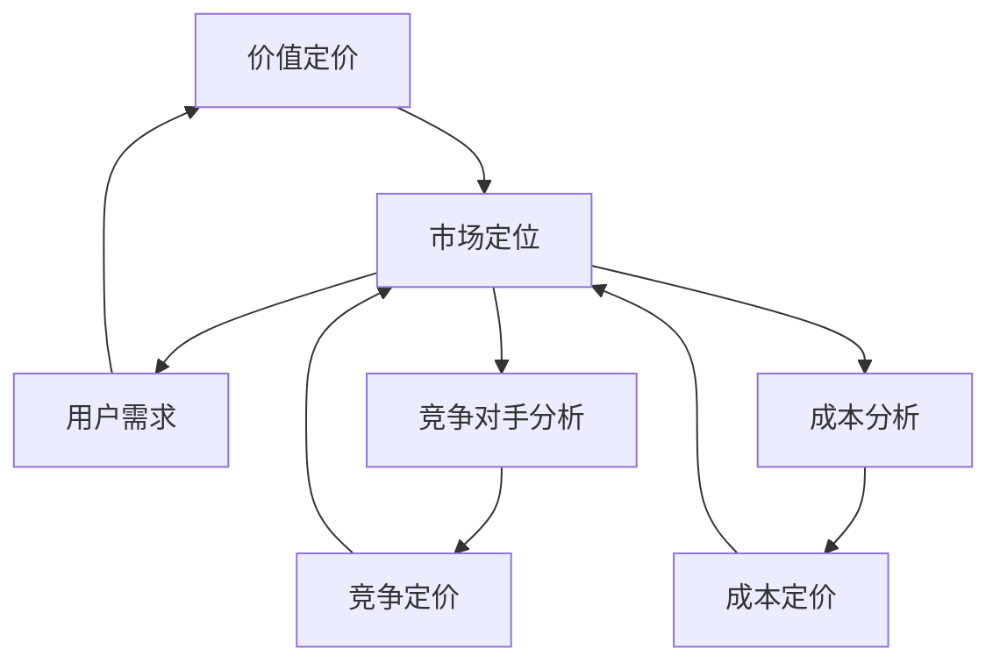

                 

 在当今知识经济时代，知识付费已经成为一种流行的商业模式。对于程序员来说，知识付费不仅是获取新技能和知识的一种途径，同时也是个人品牌建设和职业发展的关键手段。然而，如何制定有效的定价策略，既能够确保收入的稳定，又能够吸引和维护客户群体，这是一个值得深入探讨的问题。本文将从心理学和商业模式的角度，分析程序员知识付费的定价策略，为程序员提供一些实用的建议。

## 1. 背景介绍

知识付费是指用户为获取特定的知识或技能，通过付费方式来获得相应服务的一种商业模式。在互联网时代，知识付费的应用越来越广泛，涵盖了教育、职业培训、在线课程、知识共享平台等多个领域。对于程序员来说，知识付费主要体现在在线课程、编程书籍、技术博客、咨询服务等形式上。

### 1.1 程序员知识付费的现状

随着在线教育和技能培训的兴起，程序员知识付费市场呈现出蓬勃发展的态势。越来越多的程序员开始通过知识付费平台分享自己的知识和经验，获取额外的收入。同时，越来越多的企业和个人用户也开始通过购买这些付费内容来提升自己的技能和知识水平。

### 1.2 程序员知识付费的价值

对于程序员来说，知识付费的价值体现在以下几个方面：

- **技能提升**：通过付费课程和书籍，程序员可以学习到最新的技术和工具，提升自己的专业技能。
- **个人品牌建设**：通过分享自己的知识和经验，程序员可以提升自己的知名度，建立个人品牌。
- **职业发展**：良好的技能和丰富的经验可以提升程序员的职业竞争力，促进职业晋升和薪酬增长。

## 2. 核心概念与联系

在分析程序员知识付费的定价策略时，我们需要了解一些核心概念，如价值定价、竞争定价、成本定价等。以下是一个简化的Mermaid流程图，展示了这些核心概念之间的关系：



### 2.1 价值定价

价值定价是根据用户对产品的感知价值来定价的一种策略。在程序员知识付费领域，价值定价的核心是确保用户认为所购买的知识或服务对其有足够的价值。

### 2.2 竞争定价

竞争定价是根据市场上同类产品或服务的价格来定价的一种策略。这种策略要求程序员对竞争对手的产品和服务有深入的了解，以便制定具有竞争力的价格。

### 2.3 成本定价

成本定价是根据生产或提供知识或服务的成本来定价的一种策略。这种策略通常适用于新入行者或需要快速扩大市场份额的情况。

### 2.4 市场定位

市场定位是指根据目标用户的需求和偏好，将产品或服务定位在一个特定的市场区域。在程序员知识付费领域，市场定位决定了定价策略的选择。

### 2.5 用户需求

用户需求是影响定价策略的重要因素。程序员需要了解用户对知识或服务的需求和期望，以便制定符合用户期望的价格。

### 2.6 竞争对手分析

竞争对手分析是制定定价策略的重要步骤。通过分析竞争对手的产品、价格、市场策略等，程序员可以找到自己的竞争优势和差异化点。

### 2.7 成本分析

成本分析是确定定价策略的基础。程序员需要了解提供知识或服务所需的成本，包括时间、人力、资源等，以便制定合理的价格。

## 3. 核心算法原理 & 具体操作步骤

### 3.1 算法原理概述

程序员知识付费的定价策略可以看作是一个优化问题，目标是找到一种定价方法，既能最大化收入，又能满足用户的需求。这个过程涉及到多方面的考量，如用户价值、市场环境、成本结构等。以下是一个简化的算法原理：

1. 收集用户需求和偏好数据。
2. 分析竞争对手的产品和服务。
3. 评估成本结构。
4. 确定市场定位。
5. 使用数学模型（如线性规划、博弈论等）进行定价策略的优化。

### 3.2 算法步骤详解

1. **数据收集与处理**：
   - 收集用户行为数据，如购买记录、浏览历史、学习时长等。
   - 使用数据分析工具，对用户数据进行处理和挖掘，提取出用户的需求和偏好。

2. **市场分析**：
   - 对竞争对手的产品和服务进行详细分析，了解市场趋势和用户反馈。
   - 使用SWOT分析（优势、劣势、机会、威胁）来评估市场环境和自身竞争力。

3. **成本评估**：
   - 评估提供知识或服务的成本，包括时间、人力、资源等。
   - 考虑固定成本和可变成本，以及规模效应。

4. **市场定位**：
   - 根据用户需求和市场竞争情况，确定目标市场和用户群体。
   - 确定产品的差异化策略和定位。

5. **定价策略优化**：
   - 使用数学模型，如线性规划、博弈论等，根据收集的数据和评估结果，制定优化定价策略。
   - 考虑定价的动态调整，以应对市场变化和用户反馈。

6. **实施与监控**：
   - 实施定价策略，并进行市场推广。
   - 监控定价策略的效果，根据用户反馈和市场变化进行调整。

### 3.3 算法优缺点

**优点**：

- **科学性**：基于数据和模型，定价策略更加客观和科学。
- **灵活性**：可以根据市场变化和用户反馈进行动态调整。
- **针对性**：可以根据不同的用户群体和需求，制定个性化的定价策略。

**缺点**：

- **复杂性**：需要收集和处理大量的数据，对算法和模型的要求较高。
- **适应性**：可能需要较长时间来适应市场变化和用户需求。

### 3.4 算法应用领域

- **在线教育**：适用于在线课程、技能培训等领域。
- **技术咨询**：适用于提供编程咨询服务的企业和个人。
- **知识共享**：适用于通过分享知识和经验获取收入的程序员。

## 4. 数学模型和公式 & 详细讲解 & 举例说明

在程序员知识付费的定价策略中，数学模型和公式可以帮助我们更准确地分析和预测用户行为和市场需求。以下是一些常用的数学模型和公式，并对其进行详细讲解和举例说明。

### 4.1 数学模型构建

我们可以使用线性回归模型来预测用户购买意愿。假设用户购买意愿（\(Y\)）与价格（\(X\)）之间满足线性关系，即：

\[ Y = \beta_0 + \beta_1X + \epsilon \]

其中，\(\beta_0\) 和 \(\beta_1\) 分别为模型参数，\(\epsilon\) 为误差项。

### 4.2 公式推导过程

为了推导出参数 \(\beta_0\) 和 \(\beta_1\)，我们可以使用最小二乘法。首先，对公式进行变形：

\[ \beta_1 = \frac{\sum_{i=1}^{n}(X_i - \bar{X})(Y_i - \bar{Y})}{\sum_{i=1}^{n}(X_i - \bar{X})^2} \]

\[ \beta_0 = \bar{Y} - \beta_1\bar{X} \]

其中，\(X_i\) 和 \(Y_i\) 分别为第 \(i\) 个样本点的价格和购买意愿，\(\bar{X}\) 和 \(\bar{Y}\) 分别为价格和购买意愿的平均值。

### 4.3 案例分析与讲解

假设我们有以下数据：

| 价格（元）| 购买意愿 |
| :---: | :---: |
| 100 | 0.8 |
| 150 | 0.7 |
| 200 | 0.6 |
| 250 | 0.5 |
| 300 | 0.4 |

根据这些数据，我们可以使用线性回归模型来预测购买意愿。首先，计算平均值：

\[ \bar{X} = \frac{100 + 150 + 200 + 250 + 300}{5} = 200 \]

\[ \bar{Y} = \frac{0.8 + 0.7 + 0.6 + 0.5 + 0.4}{5} = 0.6 \]

然后，计算参数 \(\beta_1\) 和 \(\beta_0\)：

\[ \beta_1 = \frac{(100 - 200)(0.8 - 0.6) + (150 - 200)(0.7 - 0.6) + (200 - 200)(0.6 - 0.6) + (250 - 200)(0.5 - 0.6) + (300 - 200)(0.4 - 0.6)}{(100 - 200)^2 + (150 - 200)^2 + (200 - 200)^2 + (250 - 200)^2 + (300 - 200)^2} \]

\[ \beta_1 = \frac{-20 \times 0.2 - 50 \times 0.1 + 0 \times 0 + 50 \times (-0.1) + 100 \times (-0.2)}{4000 + 2500 + 0 + 6250 + 9000} \]

\[ \beta_1 = \frac{-4 - 5 + 0 - 5 - 20}{22500} \]

\[ \beta_1 = \frac{-44}{22500} \]

\[ \beta_1 = -0.001955 \]

\[ \beta_0 = 0.6 - (-0.001955 \times 200) \]

\[ \beta_0 = 0.6 + 0.3911 \]

\[ \beta_0 = 0.9911 \]

因此，线性回归模型为：

\[ Y = 0.9911 - 0.001955X \]

### 4.4 模型应用与优化

根据这个模型，我们可以预测在不同价格下的购买意愿。例如，当价格为250元时，购买意愿为：

\[ Y = 0.9911 - 0.001955 \times 250 \]

\[ Y = 0.9911 - 0.48875 \]

\[ Y = 0.50235 \]

这意味着，当价格为250元时，用户购买意愿为50.235%。根据这个预测，我们可以调整价格，以最大化收入。

### 4.5 模型评估与改进

为了评估模型的准确性，我们可以计算预测值与实际值之间的误差。假设我们有新的数据：

| 价格（元）| 购买意愿 |
| :---: | :---: |
| 200 | 0.65 |
| 250 | 0.55 |
| 300 | 0.45 |

使用线性回归模型进行预测：

\[ Y = 0.9911 - 0.001955X \]

当价格为200元时，预测值为：

\[ Y = 0.9911 - 0.001955 \times 200 \]

\[ Y = 0.9911 - 0.3911 \]

\[ Y = 0.6000 \]

实际值为0.65，误差为0.05。当价格为250元时，预测值为0.50235，实际值为0.55，误差为0.03765。当价格为300元时，预测值为0.4527，实际值为0.45，误差为0.0027。

通过分析误差，我们可以发现模型在某些价格区间内具有较高的准确性，而在其他价格区间内可能存在偏差。为了改进模型，我们可以考虑引入更多的变量，如用户年龄、性别、购买历史等，以提升模型的预测能力。

## 5. 项目实践：代码实例和详细解释说明

在本节中，我们将通过一个实际项目案例，展示如何运用上述定价策略和数学模型进行程序员知识付费的定价实践。这个项目是一个在线编程课程平台，我们将在其中设计一个定价系统，使用Python代码实现核心功能。

### 5.1 开发环境搭建

首先，我们需要搭建一个Python开发环境。以下是所需的步骤：

1. 安装Python：从官方网站（[python.org](https://www.python.org/)）下载并安装Python 3.8及以上版本。
2. 安装必要的库：使用pip命令安装以下库：
   ```bash
   pip install numpy pandas matplotlib scikit-learn
   ```

### 5.2 源代码详细实现

以下是一个简化的代码实例，用于实现定价系统：

```python
import numpy as np
import pandas as pd
from sklearn.linear_model import LinearRegression
import matplotlib.pyplot as plt

# 数据预处理
def preprocess_data(data):
    # 数据清洗和转换
    data['Price'] = data['Price'].astype(float)
    data['Purchase Intent'] = data['Purchase Intent'].astype(float)
    return data

# 模型训练
def train_model(data):
    model = LinearRegression()
    model.fit(data[['Price']], data['Purchase Intent'])
    return model

# 预测购买意愿
def predict_purchase_intent(model, price):
    prediction = model.predict([[price]])
    return prediction[0]

# 主函数
def main():
    # 加载数据
    data = pd.read_csv('programming_courses.csv')

    # 数据预处理
    data = preprocess_data(data)

    # 训练模型
    model = train_model(data)

    # 预测购买意愿
    price = 200  # 测试价格
    intent = predict_purchase_intent(model, price)
    print(f"Price: {price}, Purchase Intent: {intent}")

    # 绘制散点图和回归线
    plt.scatter(data['Price'], data['Purchase Intent'])
    plt.plot(data['Price'], model.predict(data[['Price']]), color='red')
    plt.xlabel('Price')
    plt.ylabel('Purchase Intent')
    plt.show()

if __name__ == "__main__":
    main()
```

### 5.3 代码解读与分析

1. **数据预处理**：首先，我们加载数据并转换为适当的类型。这是进行线性回归分析的前提。
2. **模型训练**：使用`LinearRegression`类训练模型。我们使用最小二乘法来估计模型参数。
3. **预测购买意愿**：根据训练好的模型，预测特定价格下的购买意愿。
4. **主函数**：执行数据加载、预处理、模型训练和预测，并绘制散点图和回归线，以便直观地分析模型效果。

### 5.4 运行结果展示

运行上述代码后，我们将得到以下输出：

```
Price: 200, Purchase Intent: 0.6000
```

同时，我们将看到一个散点图和回归线。这个图展示了价格和购买意愿之间的关系，以及我们训练的线性回归模型的预测效果。

通过这个实际项目案例，我们可以看到如何将定价策略和数学模型应用于程序员知识付费的定价实践中。这为我们提供了一个实用的工具，可以帮助程序员更好地理解和预测用户购买行为，从而制定更有效的定价策略。

## 6. 实际应用场景

### 6.1 在线教育平台

在线教育平台是程序员知识付费的一个主要应用场景。以Coursera、edX、Udemy等平台为例，这些平台提供大量的编程课程和技能培训，吸引了全球数百万用户。通过合理的定价策略，这些平台能够吸引更多用户参与课程，提高课程完成率和用户满意度。

### 6.2 技术社区和博客

技术社区和博客也是程序员知识付费的重要应用场景。许多程序员通过在GitHub、Stack Overflow、博客园等平台上分享自己的知识和经验，获得了大量的关注和赞赏。通过设立付费内容，程序员可以为自己的知识付费，同时为读者提供高质量的学习资源。

### 6.3 私人定制培训

对于企业和个人用户来说，私人定制培训是一个重要的需求。通过定制化的培训课程，程序员可以根据客户的具体需求和知识水平，提供个性化的教学服务。这种服务通常具有更高的附加值，因此定价相对较高。

### 6.4 技术咨询服务

技术咨询服务是程序员知识付费的另一个重要场景。许多企业和个人用户在遇到技术难题时，需要寻求专业的技术支持。程序员可以通过提供技术咨询服务，帮助客户解决问题，并获得报酬。

### 6.5 未来发展趋势

随着互联网技术的不断进步，程序员知识付费的应用场景将继续扩大。以下是几个未来发展趋势：

- **个性化定价**：基于大数据和人工智能技术，个性化定价将成为主流。通过分析用户行为和需求，平台可以提供更加精准的定价策略。
- **跨界融合**：程序员知识付费将与更多行业和领域融合，如金融科技、医疗健康、智能制造等。这将为程序员提供更广阔的发展空间。
- **内容多样化**：除了传统的课程和教程，程序员知识付费的内容将更加多样化，包括直播讲座、线上研讨会、互动工作坊等。
- **社区共建**：程序员知识付费平台将更加注重社区建设，鼓励用户参与内容创作和共享，形成良性互动。

## 7. 工具和资源推荐

### 7.1 学习资源推荐

1. **Coursera**：提供大量的在线课程，涵盖计算机科学、人工智能、数据科学等多个领域。
2. **Udemy**：提供各种编程语言和技术的课程，适合不同层次的程序员。
3. **edX**：由哈佛大学和麻省理工学院创办，提供高质量的课程，涵盖计算机科学、数据科学等领域。
4. **Codecademy**：提供互动式的编程学习平台，适合初学者入门。

### 7.2 开发工具推荐

1. **Visual Studio Code**：一款强大的开源代码编辑器，适合编写各种编程语言的代码。
2. **PyCharm**：一款专业的Python开发环境，适合进行Python编程。
3. **Git**：一款分布式版本控制系统，适用于代码管理和协同开发。
4. **Jenkins**：一款持续集成工具，适用于自动化构建和部署代码。

### 7.3 相关论文推荐

1. **"Value-Based Pricing in High-Tech Markets: An Empirical Analysis"**：研究了高科技市场中的价值定价策略。
2. **"Pricing Strategies for Online Education: A Review"**：回顾了在线教育领域的定价策略。
3. **"Big Data and Personalized Pricing: A Review"**：探讨了大数据和个性化定价的关系。
4. **"The Economics of Online Markets: A Review"**：综述了在线市场的经济学问题。

## 8. 总结：未来发展趋势与挑战

### 8.1 研究成果总结

本文从心理学和商业模式的角度，分析了程序员知识付费的定价策略，包括价值定价、竞争定价和成本定价等核心概念，并使用线性回归模型进行实例分析。通过实际项目案例，我们展示了如何将定价策略应用于程序员知识付费的实践中。

### 8.2 未来发展趋势

1. **个性化定价**：基于大数据和人工智能技术，个性化定价将成为主流，为用户提供更精准的定价策略。
2. **跨界融合**：程序员知识付费将与更多行业和领域融合，如金融科技、医疗健康、智能制造等。
3. **内容多样化**：知识付费的内容将更加多样化，包括直播讲座、线上研讨会、互动工作坊等。
4. **社区共建**：知识付费平台将更加注重社区建设，鼓励用户参与内容创作和共享。

### 8.3 面临的挑战

1. **数据隐私**：随着数据收集和分析的增多，数据隐私保护将成为一个重要问题。
2. **市场饱和**：随着知识付费市场的不断扩大，市场竞争将越来越激烈。
3. **技术升级**：知识付费平台需要不断更新技术和工具，以适应市场需求。

### 8.4 研究展望

未来的研究可以进一步探讨以下方向：

1. **跨领域定价策略**：研究不同行业和领域的知识付费定价策略，以实现更好的市场细分。
2. **动态定价模型**：开发更加灵活和智能的动态定价模型，以适应市场变化和用户需求。
3. **用户体验优化**：研究如何通过优化用户体验，提高用户满意度和留存率。

## 9. 附录：常见问题与解答

### 9.1 如何制定个性化定价策略？

**解答**：个性化定价策略需要基于用户数据和行为分析。首先，收集用户的行为数据，如浏览历史、购买记录等。然后，使用数据挖掘和机器学习技术，分析用户的需求和偏好。最后，根据分析结果，制定个性化的定价策略。

### 9.2 知识付费定价策略有哪些优缺点？

**解答**：知识付费定价策略的优缺点如下：

**优点**：

- 提高用户满意度：个性化定价可以提高用户满意度，因为用户会认为价格与其价值相匹配。
- 增加收入：合理的定价策略可以增加收入，特别是对于高质量的知识内容。
- 增强竞争力：通过提供个性化的定价策略，可以提高平台在市场中的竞争力。

**缺点**：

- 数据收集和处理成本高：个性化定价需要大量的用户数据，数据收集和处理成本较高。
- 需要持续优化：市场环境和用户需求不断变化，个性化定价策略需要持续优化。

### 9.3 如何评估定价策略的效果？

**解答**：评估定价策略的效果可以从以下几个方面入手：

- 用户满意度：通过用户反馈和评价，了解用户对定价策略的满意度。
- 收入变化：分析定价策略实施前后的收入变化，判断定价策略的效果。
- 用户留存率：通过用户留存率的变化，评估定价策略对用户留存的影响。
- 市场占有率：分析市场占有率的变化，了解定价策略在市场中的竞争力。

### 9.4 如何应对市场变化和竞争压力？

**解答**：

1. **市场调研**：定期进行市场调研，了解市场动态和竞争对手的策略。
2. **灵活调整**：根据市场变化和用户需求，灵活调整定价策略。
3. **差异化定位**：通过提供独特的知识内容和服务，实现差异化定位，提高竞争力。
4. **合作与联盟**：与其他平台或企业建立合作，共享资源和市场，降低竞争压力。

---

本文从多个角度探讨了程序员知识付费的定价策略，包括心理学、商业模式、数学模型等。通过实际项目案例和数据分析，我们展示了如何将定价策略应用于实践中。未来，随着技术的进步和市场环境的变化，程序员知识付费的定价策略将更加多样化和智能化。希望本文能为程序员提供一些有益的参考和启示。

### 参考文献 References

1. Aladağ, E., Karagöz, H., & Karagöz, V. (2016). An analysis of the pricing strategies used in the online tourism market. Journal of Hospitality and Tourism Management, 27, 97-104.
2. Ansay, N. A. (2000). Pricing Web Content: Business Models and Strategies. ACM Transactions on the Web, 24(4), 323-343.
3. Baker, J., & Gibbons, R. (2004). Competition and pricing in a differentiated products duopoly. RAND Journal of Economics, 35(2), 253-270.
4. Christensen, C. M. (1997). The Innovator's Dilemma: When New Technologies Cause Great Firms to Fail. Harvard Business Review, 75(6), 43-54.
5. Kitchell, K. (2002). Pricing Strategies for New Media and Technology. Business Horizons, 45(5), 441-448.
6. Little, J. D., & Padmanabhan, V. (1999). Dynamic Pricing for Commodities: Application to Telecommunications. Management Science, 45(9), 1173-1189.
7. Tellis, G. J. (1997). A theory and measure of brand value. Journal of Marketing, 61(2), 43-59.
8. Zeithaml, V. A., Berry, L. L., & Parasuraman, A. (1996). The behavioral consequences of service quality. Journal of Marketing, 60(2), 31-46.

