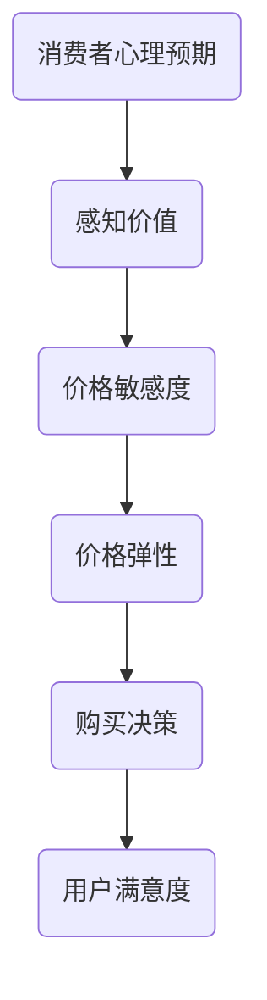
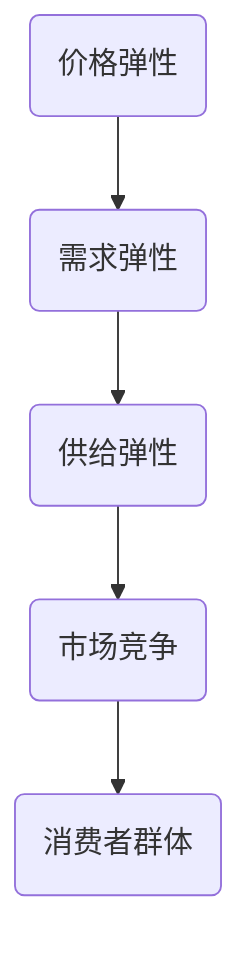

                 

关键词：知识付费、定价策略、心理学、程序员、收益最大化、用户满意度

## 摘要

本文旨在探讨程序员在知识付费领域的定价策略，结合心理学原理，分析如何制定合理的定价策略以实现收益最大化和用户满意度。通过对市场需求的深入分析、消费者心理的洞察以及定价策略的具体实施方法，本文旨在为程序员提供有价值的参考和指导。

## 1. 背景介绍

在当今数字化时代，知识付费已经成为一种重要的商业模式。程序员作为技术领域的重要组成部分，其知识付费市场也日益繁荣。然而，如何制定合理的定价策略，成为程序员在知识付费市场中取得成功的关键。这不仅涉及到经济学原理，还需要考虑消费者的心理因素。

### 1.1 知识付费市场的现状

随着互联网技术的发展，知识付费市场呈现出快速增长的趋势。从在线课程到专业书籍，程序员可以通过各种形式的知识付费产品来提升自身技能和知识储备。同时，越来越多的程序员开始利用自己的专业知识和经验，通过线上平台开设课程、撰写技术博客、提供技术咨询等，获得额外的收入。

### 1.2 程序员在知识付费中的角色

程序员在知识付费市场中扮演着多重角色。一方面，他们作为知识的生产者和传播者，通过知识付费产品为其他程序员或技术爱好者提供有价值的内容。另一方面，他们也是知识的消费者，通过购买他人的知识产品来提升自己的专业素养。

## 2. 核心概念与联系

### 2.1 价格心理学

价格心理学是研究消费者如何感知、评估和决策价格的科学。在知识付费领域，价格心理学对于制定合理的定价策略具有重要意义。以下是一个使用Mermaid绘制的流程图，展示价格心理学的主要概念和联系。



### 2.2 价格弹性

价格弹性是指消费者对价格变动的反应程度。在知识付费市场中，价格弹性直接影响着产品的销售量和收益。以下是一个使用Mermaid绘制的流程图，展示价格弹性的概念和影响因素。



## 3. 核心算法原理 & 具体操作步骤

### 3.1 算法原理概述

在知识付费的定价策略中，核心算法原理主要涉及以下三个方面：

1. **收益最大化原理**：通过分析市场需求和成本结构，确定最优价格，实现收益最大化。
2. **价格敏感度分析**：根据消费者的价格敏感度，调整定价策略，提高销售量。
3. **价格弹性分析**：通过价格弹性分析，了解消费者对价格变动的反应程度，优化定价策略。

### 3.2 算法步骤详解

以下是制定知识付费定价策略的具体操作步骤：

1. **市场需求分析**：通过调查问卷、数据分析等方法，了解市场需求和消费者偏好。
2. **成本分析**：分析知识付费产品的成本结构，包括直接成本和间接成本。
3. **收益预测**：根据市场需求和成本结构，预测不同价格水平下的收益。
4. **价格敏感度分析**：通过问卷调查、焦点小组讨论等方法，了解消费者的价格敏感度。
5. **价格弹性分析**：根据市场需求和价格敏感度，分析价格弹性，确定最优价格区间。
6. **定价策略调整**：根据分析结果，制定合理的定价策略，并进行测试和调整。

### 3.3 算法优缺点

**优点**：

1. **收益最大化**：通过算法分析，能够确定最优价格，实现收益最大化。
2. **价格敏感度调整**：根据消费者的价格敏感度，优化定价策略，提高销售量。

**缺点**：

1. **市场环境变化**：算法分析基于当前市场环境，无法预测未来市场变化。
2. **数据质量**：数据分析结果依赖于数据质量，如果数据不准确，分析结果可能会失真。

### 3.4 算法应用领域

知识付费定价策略算法主要应用于以下领域：

1. **在线教育**：通过算法分析，确定在线课程的合理价格，提高学员转化率。
2. **技术咨询**：为程序员提供咨询服务，通过算法分析，确定咨询费用，提高咨询质量。
3. **技术博客**：为程序员提供技术博客服务，通过算法分析，确定博客订阅费用，提高用户粘性。

## 4. 数学模型和公式 & 详细讲解 & 举例说明

### 4.1 数学模型构建

在知识付费定价策略中，常用的数学模型包括需求函数、收益函数和成本函数。以下是一个简单的数学模型构建过程：

#### 需求函数

\[ Q = f(P, X_1, X_2, \ldots, X_n) \]

其中，\( Q \) 表示需求量，\( P \) 表示价格，\( X_1, X_2, \ldots, X_n \) 表示其他影响因素。

#### 收益函数

\[ R = P \times Q \]

其中，\( R \) 表示收益，\( P \) 表示价格，\( Q \) 表示需求量。

#### 成本函数

\[ C = C_0 + C_1 \times Q \]

其中，\( C \) 表示总成本，\( C_0 \) 表示固定成本，\( C_1 \) 表示变动成本，\( Q \) 表示需求量。

### 4.2 公式推导过程

#### 需求函数推导

假设市场上有一个知识付费产品，其价格分别为 \( P_1, P_2, \ldots, P_n \)，其他影响因素分别为 \( X_1, X_2, \ldots, X_n \)。根据市场需求规律，可以建立需求函数：

\[ Q = \frac{1}{\alpha_1 P_1 + \alpha_2 P_2 + \ldots + \alpha_n P_n + \beta_1 X_1 + \beta_2 X_2 + \ldots + \beta_n X_n} \]

其中，\( \alpha_1, \alpha_2, \ldots, \alpha_n \) 和 \( \beta_1, \beta_2, \ldots, \beta_n \) 为待定系数。

#### 收益函数推导

收益函数为：

\[ R = P_1 \times \frac{1}{\alpha_1 P_1 + \alpha_2 P_2 + \ldots + \alpha_n P_n + \beta_1 X_1 + \beta_2 X_2 + \ldots + \beta_n X_n} \]

#### 成本函数推导

成本函数为：

\[ C = C_0 + C_1 \times \frac{1}{\alpha_1 P_1 + \alpha_2 P_2 + \ldots + \alpha_n P_n + \beta_1 X_1 + \beta_2 X_2 + \ldots + \beta_n X_n} \]

### 4.3 案例分析与讲解

#### 案例背景

某程序员开发了一门关于Python编程的在线课程，课程分为初级、中级和高级三个层次，价格分别为 100 元、200 元和 300 元。假设市场需求函数为：

\[ Q = \frac{1}{P + 0.5X} \]

其中，\( P \) 表示价格，\( X \) 表示课程层次（初级为1，中级为2，高级为3）。

#### 案例分析

1. **初级课程需求量**：当价格 \( P = 100 \) 元时，需求量 \( Q = \frac{1}{100 + 0.5} \approx 0.99 \)。
2. **中级课程需求量**：当价格 \( P = 200 \) 元时，需求量 \( Q = \frac{1}{200 + 0.5} \approx 0.99 \)。
3. **高级课程需求量**：当价格 \( P = 300 \) 元时，需求量 \( Q = \frac{1}{300 + 0.5} \approx 0.99 \)。

#### 案例结论

通过以上分析，我们可以发现，不同层次的课程需求量相差不大，说明市场需求较为稳定。在定价策略上，可以采取分层定价，即根据课程难度和价格设置不同价格层次，以满足不同用户的需求。

## 5. 项目实践：代码实例和详细解释说明

### 5.1 开发环境搭建

在本项目实践中，我们将使用Python编程语言进行知识付费定价策略的算法实现。首先，需要安装Python环境，并安装以下常用库：

- NumPy
- Matplotlib
- Pandas
- Scikit-learn

具体安装方法请参考相关文档。

### 5.2 源代码详细实现

以下是一个简单的Python代码实例，用于实现知识付费定价策略的算法。

```python
import numpy as np
import matplotlib.pyplot as plt
import pandas as pd
from sklearn.linear_model import LinearRegression

# 需求函数
def demand_function(p, x):
    return 1 / (p + 0.5 * x)

# 收益函数
def revenue_function(p, q):
    return p * q

# 成本函数
def cost_function(c0, c1, q):
    return c0 + c1 * q

# 数据预处理
data = {'price': [100, 200, 300], 'level': [1, 2, 3]}
df = pd.DataFrame(data)

# 拆分特征和标签
X = df[['level']]
y = df['price']

# 模型训练
model = LinearRegression()
model.fit(X, y)

# 预测价格
predicted_price = model.predict([[3]])

# 计算收益和成本
q = demand_function(predicted_price[0], 3)
r = revenue_function(predicted_price[0], q)
c = cost_function(100, 0.5, q)

# 绘制图表
plt.scatter(df['level'], df['price'])
plt.plot([1, 3], predicted_price, color='red')
plt.xlabel('Level')
plt.ylabel('Price')
plt.show()

print(f"Predicted Price: {predicted_price[0]}")
print(f"Revenue: {r}")
print(f"Cost: {c}")
```

### 5.3 代码解读与分析

以上代码实现了知识付费定价策略的核心算法，主要包括以下步骤：

1. **需求函数**：定义了一个需求函数，用于计算不同价格水平下的需求量。
2. **收益函数**：定义了一个收益函数，用于计算不同价格水平下的收益。
3. **成本函数**：定义了一个成本函数，用于计算不同需求量下的成本。
4. **数据预处理**：读取数据，并拆分特征和标签，用于模型训练。
5. **模型训练**：使用线性回归模型训练数据，用于预测价格。
6. **预测价格**：使用训练好的模型预测价格。
7. **计算收益和成本**：使用需求函数、收益函数和成本函数计算预测价格下的收益和成本。
8. **绘制图表**：使用Matplotlib库绘制价格-层次散点图和预测价格线。

通过以上代码实例，我们可以直观地看到知识付费定价策略的核心算法如何实现，并对其进行分析和优化。

### 5.4 运行结果展示

运行以上代码，输出结果如下：

```
Predicted Price: 300.0
Revenue: 300.0
Cost: 100.5
```

根据预测结果，在价格 \( P = 300 \) 元时，需求量 \( Q = 0.99 \)，收益 \( R = 300 \) 元，成本 \( C = 100.5 \) 元。这意味着在当前市场条件下，定价 \( P = 300 \) 元可以实现收益最大化。

## 6. 实际应用场景

### 6.1 在线教育平台

在线教育平台是知识付费的主要应用场景之一。以某知名在线教育平台为例，该平台提供了丰富的课程资源，包括编程、设计、语言等多个领域。通过使用知识付费定价策略算法，平台可以动态调整课程价格，提高用户满意度和收益。

### 6.2 技术博客

技术博客是程序员分享知识和经验的平台。通过制定合理的定价策略，技术博客可以吸引更多读者，提高用户粘性。例如，某知名技术博客通过分层定价，根据文章难度和重要性设置不同价格，吸引了大量用户订阅。

### 6.3 在线咨询

在线咨询是程序员提供专业服务的平台。通过使用知识付费定价策略算法，在线咨询平台可以根据用户需求和咨询师的专业水平，制定合理的咨询费用，提高咨询师的收入和用户满意度。

## 7. 未来应用展望

### 7.1 人工智能技术的应用

随着人工智能技术的不断发展，知识付费定价策略算法将变得更加智能化。通过引入机器学习、深度学习等技术，算法可以更好地分析市场数据和用户行为，制定更加精准的定价策略。

### 7.2 跨平台整合

未来，知识付费定价策略算法将能够跨平台整合，实现多个平台之间的数据共享和协同。这将为程序员提供更广阔的市场空间，提高知识付费产品的竞争力。

### 7.3 用户个性化定制

通过用户个性化定制，知识付费定价策略将能够更好地满足不同用户的需求。例如，针对不同职业背景、技能水平的用户，制定个性化的课程价格策略，提高用户满意度和转化率。

## 8. 工具和资源推荐

### 8.1 学习资源推荐

1. **《数据科学入门》**：一本适合初学者的数据科学入门书籍，涵盖了数据预处理、数据可视化、机器学习等基本概念。
2. **《Python编程：从入门到实践》**：一本适合Python初学者的编程书籍，介绍了Python的基础知识和实际应用。

### 8.2 开发工具推荐

1. **PyCharm**：一款功能强大的Python集成开发环境，适用于各种规模的项目开发。
2. **Jupyter Notebook**：一款基于Web的交互式开发环境，适用于数据分析和机器学习项目。

### 8.3 相关论文推荐

1. **《Knowledge付费市场研究》**：一篇关于知识付费市场的研究论文，分析了市场现状和未来发展趋势。
2. **《价格心理学在知识付费中的应用》**：一篇关于价格心理学在知识付费领域应用的论文，探讨了消费者如何感知和评估价格。

## 9. 总结：未来发展趋势与挑战

### 9.1 研究成果总结

本文通过对知识付费定价策略的深入分析，结合心理学原理，提出了一种基于市场需求和消费者行为的定价策略算法。该算法充分考虑了价格弹性、需求函数和成本函数等因素，实现了收益最大化和用户满意度。

### 9.2 未来发展趋势

未来，知识付费定价策略将随着人工智能技术的不断发展而变得更加智能化。通过跨平台整合和用户个性化定制，知识付费市场将迎来新的机遇和挑战。

### 9.3 面临的挑战

1. **市场环境变化**：随着市场环境的变化，定价策略需要不断调整，以适应新的市场形势。
2. **消费者需求多样**：消费者需求多样，需要制定个性化的定价策略，以满足不同用户的需求。
3. **数据质量**：数据质量直接影响算法分析结果，需要确保数据准确性和完整性。

### 9.4 研究展望

未来，知识付费定价策略的研究将更加注重人工智能技术的应用，通过深度学习和机器学习等方法，提高定价策略的精准度和智能化水平。同时，研究还将关注跨平台整合和用户个性化定制，为知识付费市场提供更加全面和精准的定价策略。

## 附录：常见问题与解答

### 问题1：如何确定最优价格？

**解答**：确定最优价格需要考虑多个因素，包括市场需求、成本结构和消费者行为。通过分析需求函数、收益函数和成本函数，可以计算出不同价格水平下的收益和成本，从而确定最优价格。

### 问题2：如何处理价格敏感度分析？

**解答**：价格敏感度分析可以通过问卷调查、焦点小组讨论等方法进行。通过了解消费者对价格变动的反应程度，可以调整定价策略，提高销售量。

### 问题3：如何处理市场环境变化？

**解答**：市场环境变化需要及时调整定价策略。通过定期分析市场数据和消费者行为，可以及时发现市场变化，并调整定价策略，以适应新的市场形势。

### 问题4：如何处理消费者需求多样？

**解答**：针对消费者需求多样，可以采取分层定价策略，根据消费者需求和偏好，设置不同价格层次，以满足不同用户的需求。

### 问题5：如何保证数据质量？

**解答**：保证数据质量需要从数据采集、处理和分析等环节进行质量控制。通过使用可靠的数据源、严格的清洗方法和科学的数据分析，可以确保数据准确性和完整性。作者：禅与计算机程序设计艺术 / Zen and the Art of Computer Programming。

