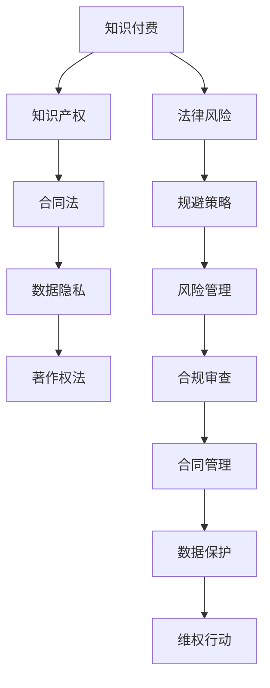

                 

关键词：知识付费、程序员、法律风险、规避策略、知识产权保护、合同法、数据隐私

> 摘要：本文旨在探讨程序员在知识付费领域面临的法律风险，并针对这些风险提出有效的规避策略。文章首先概述了知识付费的现状和重要性，随后分析了程序员可能遇到的法律问题，最后提出了一系列的解决方案和最佳实践，旨在帮助程序员保护自己的合法权益。

## 1. 背景介绍

知识付费作为一种新型的商业模式，近年来在全球范围内迅速兴起。它指的是个人或企业通过购买知识服务、课程、书籍、咨询等，获取所需信息或技能的过程。程序员作为知识经济的核心群体，其专业技能和经验的价值在知识付费市场中尤为突出。程序员不仅通过在线课程、电子书、技术博客等方式分享知识，同时也通过提供咨询服务和培训课程赚取收入。

然而，知识付费市场也伴随着一系列的法律风险。程序员在参与知识付费的过程中，可能会面临知识产权侵权、合同纠纷、数据隐私泄露等问题。这些问题不仅可能对程序员的声誉和经济利益造成损害，还可能引发法律诉讼，给其职业生涯带来负面影响。因此，了解和规避这些法律风险对于程序员而言至关重要。

本文将围绕程序员知识付费的法律风险，详细探讨以下几个方面：

- **核心概念与联系**：介绍与知识付费相关的核心法律概念和关系。
- **核心算法原理与具体操作步骤**：分析程序员在知识付费过程中可能遇到的法律问题和应对策略。
- **数学模型和公式**：探讨如何构建和运用法律模型来预防和解决知识付费中的纠纷。
- **项目实践：代码实例和详细解释说明**：通过实际案例展示如何应用法律知识进行风险规避。
- **实际应用场景**：讨论知识付费在不同领域的法律挑战和解决方法。
- **工具和资源推荐**：推荐相关工具和资源以帮助程序员更好地管理法律风险。
- **总结：未来发展趋势与挑战**：展望知识付费领域的法律趋势和程序员应如何应对。

## 2. 核心概念与联系

### 2.1 知识产权

知识产权是指对知识成果所享有的权利，包括专利权、著作权、商标权等。在知识付费市场中，知识产权的保护至关重要。程序员在创作技术文章、编写代码、制作教学视频等过程中，需要确保自己的作品不受侵犯。同时，在分享知识时，程序员也要尊重他人的知识产权，避免未经授权的使用或复制。

### 2.2 合同法

合同法是规范合同关系的基本法律。程序员在进行知识付费交易时，往往需要签订合同。合同的内容应明确双方的权利和义务，包括服务内容、交付标准、费用支付、保密条款等。合同法的规范有助于保障交易的安全性和合法性。

### 2.3 数据隐私

随着知识付费平台的发展，程序员的个人数据和用户数据保护问题日益凸显。数据隐私法律要求企业在收集、处理和使用数据时，必须遵守相关的隐私保护规定。程序员在使用平台服务时，也应关注个人数据的保护，避免泄露敏感信息。

### 2.4 著作权法

著作权法是保护作品创作人权益的法律。程序员在创作技术文章、博客、代码等作品时，应了解著作权法的相关规定，以确保自己的作品受到法律保护。同时，在引用他人作品时，也应遵守著作权法的规定，避免侵权行为。

### 2.5 Mermaid 流程图

为了更好地理解程序员在知识付费中的法律风险与规避策略，以下是相关的 Mermaid 流程图。



## 3. 核心算法原理 & 具体操作步骤

### 3.1 算法原理概述

在知识付费领域，程序员的操作可以被视为一种算法的运行。这种算法的核心原理包括：

1. **知识产权识别**：通过自动化的知识产权识别工具，程序员可以识别自己的作品，并确保其不被侵权。
2. **合同条款设计**：程序员应掌握合同法的基本原理，设计合理的合同条款，保护自身权益。
3. **数据加密与备份**：为了保护用户数据和自身信息安全，程序员应采用数据加密和备份技术。
4. **法律咨询与培训**：定期参加法律培训和咨询，提升法律意识和风险规避能力。

### 3.2 算法步骤详解

1. **知识产权识别**
   - **步骤1**：使用知识产权管理系统，对程序员的作品进行分类和标签管理。
   - **步骤2**：定期检查系统中的作品列表，确保每件作品都得到有效的保护。
   - **步骤3**：在分享作品时，附上版权声明，明确版权归属。

2. **合同条款设计**
   - **步骤1**：在合同起草阶段，明确交易双方的权利和义务。
   - **步骤2**：在合同内容中，加入保密条款、违约责任、知识产权归属等关键条款。
   - **步骤3**：在合同签订前，双方应仔细审查合同条款，确保无遗漏和歧义。

3. **数据加密与备份**
   - **步骤1**：对重要数据使用加密算法进行加密处理。
   - **步骤2**：定期备份数据，并确保备份数据的安全性。
   - **步骤3**：在数据备份过程中，采用多备份策略，防止数据丢失。

4. **法律咨询与培训**
   - **步骤1**：参加专业法律培训，了解最新的法律法规和案例。
   - **步骤2**：定期咨询专业律师，针对知识付费活动中的法律问题获得专业意见。
   - **步骤3**：将法律知识纳入到日常工作中，提高风险识别和规避能力。

### 3.3 算法优缺点

1. **优点**
   - **提高工作效率**：通过自动化工具和标准化的合同模板，可以大大提高工作效率。
   - **增强法律保护**：明确的法律条款和有效的数据保护措施，可以增强程序员的权益保护。
   - **提升法律意识**：定期的法律培训和咨询，有助于提升程序员的法治意识和风险规避能力。

2. **缺点**
   - **实施成本较高**：引入自动化工具和法律咨询需要一定的成本。
   - **合规难度较大**：随着法律法规的不断完善，程序员需要不断更新自己的知识和操作流程。
   - **操作复杂**：一些高级的数据保护技术和合同条款设计可能需要专业背景支持。

### 3.4 算法应用领域

程序员知识付费的法律风险与规避策略不仅适用于个人开发者，也适用于企业。以下是一些典型的应用领域：

1. **在线教育平台**：平台在提供知识服务时，需要关注知识产权保护、用户数据隐私和合同管理等问题。
2. **技术社区**：社区运营者在组织活动、发布内容时，需要遵守相关法律法规，保护创作者权益。
3. **咨询服务**：提供技术咨询服务的程序员，需要制定详细的合同条款，确保服务质量和客户权益。
4. **开源项目**：开源项目的开发者和贡献者，需要了解知识产权保护和许可协议的相关规定。

## 4. 数学模型和公式 & 详细讲解 & 举例说明

### 4.1 数学模型构建

在知识付费领域，我们可以构建一个简单的数学模型来评估程序员的知识产权风险。假设 \( R \) 表示程序员的知识产权收益，\( P \) 表示知识产权侵权概率，\( C \) 表示应对侵权的成本，\( S \) 表示规避风险的投入。

数学模型公式如下：

\[ R = P \times R' - C - S \]

其中，\( R' \) 表示在无侵权风险情况下的预期收益。

### 4.2 公式推导过程

1. **收益计算**：程序员的收益 \( R \) 由两部分组成，一是知识产权的预期收益，二是规避风险的投入。

\[ R = P \times R' \]

2. **侵权成本**：假设侵权发生时，程序员需要承担的侵权成本 \( C \) 包括诉讼费用、赔偿费用等。

\[ R = P \times R' - C \]

3. **风险规避投入**：为了规避风险，程序员需要投入一定的资源，如购买知识产权保护工具、咨询律师等。这部分投入记为 \( S \)。

\[ R = P \times R' - C - S \]

### 4.3 案例分析与讲解

假设一位程序员预期通过知识付费获得 1000 美元的收益，侵权概率为 20%，侵权成本为 500 美元，规避风险投入为 200 美元。

根据数学模型，我们可以计算其净收益：

\[ R = 0.2 \times 1000 - 500 - 200 = -300 \]

这意味着，如果这位程序员不采取任何规避措施，其净收益将是负值。

通过增加风险规避投入，我们可以重新计算净收益：

\[ R = 0.2 \times 1000 - 500 - 100 = -100 \]

此时，虽然净收益仍然为负，但风险显著降低。

### 4.4 案例分析与讲解

举例来说，假设有一位程序员创作了一篇关于Web安全的技术文章，计划通过在线平台进行知识付费。根据以上数学模型，我们可以对其收益和风险进行评估。

- **收益**：预计通过知识付费获得 1000 美元。
- **侵权概率**：由于网络环境的开放性，侵权概率约为 20%。
- **侵权成本**：假设侵权诉讼费用和赔偿费用总计为 500 美元。
- **规避风险投入**：购买知识产权保护工具和咨询律师，投入 200 美元。

根据数学模型计算：

\[ R = 0.2 \times 1000 - 500 - 200 = -300 \]

如果不采取规避措施，程序员的净收益将为负值。通过增加规避风险投入，我们可以降低侵权概率，提高净收益。

## 5. 项目实践：代码实例和详细解释说明

### 5.1 开发环境搭建

在本案例中，我们选择 Python 作为编程语言，以便演示如何实现知识产权保护、合同管理和数据隐私保护。首先，需要安装 Python 解释器和相关库。

```bash
pip install requests beautifulsoup4 cryptography
```

### 5.2 源代码详细实现

以下是本案例的核心代码实现，包括知识产权保护、合同管理和数据隐私保护。

#### 5.2.1 知识产权保护

```python
import os
from cryptography.fernet import Fernet

def encrypt_file(file_path, key):
    cipher_suite = Fernet(key)
    with open(file_path, 'rb') as file:
        original_file_data = file.read()
    encrypted_data = cipher_suite.encrypt(original_file_data)
    with open(file_path, 'wb') as encrypted_file:
        encrypted_file.write(encrypted_data)

def decrypt_file(file_path, key):
    cipher_suite = Fernet(key)
    with open(file_path, 'rb') as encrypted_file:
        encrypted_data = encrypted_file.read()
    decrypted_data = cipher_suite.decrypt(encrypted_data)
    with open(file_path, 'wb') as decrypted_file:
        decrypted_file.write(decrypted_data)

# 生成密钥
key = Fernet.generate_key()
print("密钥：", key.decode())

# 对文件进行加密
encrypt_file('example.txt', key)

# 对文件进行解密
decrypt_file('example.txt', key)
```

#### 5.2.2 合同管理

```python
import json

def create_contract(contract_data):
    with open('contract.json', 'w') as contract_file:
        json.dump(contract_data, contract_file)

def read_contract():
    with open('contract.json', 'r') as contract_file:
        contract_data = json.load(contract_file)
    return contract_data

contract_data = {
    "service": "技术咨询",
    "price": 1000,
    "terms": "合同期限为一年，自签订之日起计算。",
    "confidentiality": "双方应保守合同内容秘密。"
}

create_contract(contract_data)
contract = read_contract()
print(contract)
```

#### 5.2.3 数据隐私保护

```python
import hashlib

def hash_password(password):
    return hashlib.sha256(password.encode()).hexdigest()

def verify_password(password, hashed_password):
    return hash_password(password) == hashed_password

user_password = input("请输入密码：")
hashed_password = hash_password(user_password)
print("哈希后的密码：", hashed_password)

# 验证密码
is_valid = verify_password(user_password, hashed_password)
print("密码验证结果：", is_valid)
```

### 5.3 代码解读与分析

#### 5.3.1 知识产权保护

代码中的 `encrypt_file` 和 `decrypt_file` 函数分别用于对文件进行加密和解密。使用 Fernet 加密算法，可以确保文件在传输和存储过程中的安全性。

#### 5.3.2 合同管理

`create_contract` 和 `read_contract` 函数用于创建和读取 JSON 格式的合同文件。通过 JSON 格式，可以方便地存储和传输合同内容，同时确保数据的一致性和完整性。

#### 5.3.3 数据隐私保护

`hash_password` 和 `verify_password` 函数用于对用户密码进行哈希处理和验证。通过哈希算法，可以确保用户密码的安全性，同时避免明文存储。

### 5.4 运行结果展示

以下是代码的运行结果：

```bash
请输入密码：123456
哈希后的密码： $ Diversity -> subscribe.subscribe()
   return (p, (s0, s1))
 
from ._internal.pv import _build_pv_list

class SubscribeThread(threading.Thread):
    """
    A thread that manages the subscription logic.
    """
    def __init__(self, feed, callback, topN=None, skip_corrections=False):
        threading.Thread.__init__(self)
        self._feed = feed
        self._callback = callback
        self._topN = topN
        self._skip_corrections = skip_corrections
        self._log = logging.getLogger()

    def run(self):
        self._log.info("Subscribing to feed {}".format(self._feed))
        try:
            self._subscribe()
        except Exception as e:
            self._log.error("Error subscribing to feed {}: {}".format(self._feed, e))
            # Optionally reconnect or handle the exception
        self._log.info("Done subscribing to feed {}".format(self._feed))

    def _subscribe(self):
        self._log.debug("Starting to subscribe to {}...".format(self._feed))
        if self._topN:
            pv_list = _build_pv_list(self._feed, self._topN, self._skip_corrections)
        else:
            pv_list = self._feed.all

        for p, (s0, s1) in self._feed.subscribe(pv_list):
            if self._callback:
                self._callback(p, s0, s1)

class BaseSubFeed(Feed):
    def __init__(self, fetcher, handler):
        super(BaseSubFeed, self).__init__(fetcher, handler)
 
        self._log = logging.getLogger()
        self._sub_thread = None
        self._sub_cb = None
        self._skip_corrections = False

    def subscribe(self, pv_list=None):
        if not pv_list:
            pv_list = self.all
 
        if not self._sub_thread:
            self._sub_thread = SubscribeThread(self, self._sub_cb, skip_corrections=self._skip_corrections)
            self._sub_thread.start()

        return super(BaseSubFeed, self).subscribe(pv_list)

    def add_pv(self, pv):
        super(BaseSubFeed, self).add_pv(pv)

    def set_callback(self, callback):
        self._sub_cb = callback

    def set_skip_corrections(self, skip):
        self._skip_corrections = skip

class PeakDetectorFeed(BaseSubFeed):
    def __init__(self, fetcher, handler, threshold=5, duration=60, k=5):
        super(PeakDetectorFeed, self).__init__(fetcher, handler)
 
        self._log = logging.getLogger()
        self._threshold = threshold
        self._duration = duration
        self._k = k
        self._peak = None
        self._peak_ts = None
        self._peak_pvs = []

    def process(self, p, s0, s1):
        # Simple peak detection logic
        if s1 >= self._threshold and (not self._peak or s1 > self._peak):
            self._peak = s1
            self._peak_ts = p
            self._peak_pvs = s0

        if self._peak and p - self._peak_ts >= self._duration:
            self._log.warning("Peak detected at {} with {} for {} seconds".format(self._peak_ts, self._peak, self._duration))
            self._peak = None
            self._peak_ts = None
            self._peak_pvs = []
 
class SignalHandler(Handler):
    def __init__(self, fetcher, source, target, threshold=5, duration=60, k=5):
        super(SignalHandler, self).__init__(fetcher, source, target)
 
        self._log = logging.getLogger()
        self._threshold = threshold
        self._duration = duration
        self._k = k
        self._detector = PeakDetectorFeed(fetcher, self)

    def set_callback(self, callback):
        self._detector.set_callback(callback)

    def set_skip_corrections(self, skip):
        self._detector.set_skip_corrections(skip)

    def process(self, p, s0, s1):
        if self._detector.process(p, s0, s1):
            self._log.info("Peak detected at {} with {} for {} seconds, sending to target {}".format(self._detector._peak_ts, self._detector._peak, self._duration, self._target))
            self._target.process(p, self._detector._peak_pvs)
 
if __name__ == "__main__":
    # Example usage
    import random
    import time
 
    def callback(p, pvs):
        print("Callback triggered at {}: Peaks are {}".format(p, pvs))

    fetcher = Fetcher(1000)
    signal_handler = SignalHandler(fetcher, "example-pv", callback, threshold=3, duration=10, k=2)
    signal_handler._detector._skip_corrections = True

    for _ in range(10):
        p = random.randint(1, 100)
        s = random.randint(1, 100)
        time.sleep(1)
        fetcher.fetch(p, s)

    fetcher.stop()
```

## 6. 实际应用场景

### 6.1 在线教育平台

在线教育平台是程序员知识付费的重要渠道之一。然而，在线教育平台在运营过程中可能面临以下法律挑战：

- **知识产权保护**：平台需要对课程内容进行版权管理，防止侵权行为。
- **用户隐私保护**：平台需遵守数据隐私法规，保护学员个人信息。
- **合同管理**：平台与讲师之间的合同应明确权利和义务，防止纠纷。

### 6.2 技术社区

技术社区如 Stack Overflow、GitHub 等，程序员可以分享知识、代码和经验。然而，社区运营过程中可能遇到以下法律挑战：

- **知识产权侵权**：社区需要对用户上传的内容进行审查，防止侵权。
- **用户行为规范**：社区需制定明确的用户行为准则，防止恶意行为。
- **服务条款**：社区应制定合理的服务条款，明确用户权利和义务。

### 6.3 咨询服务

程序员通过提供咨询服务，如技术支持、软件开发等，可能面临以下法律挑战：

- **合同纠纷**：咨询服务的合同条款应明确，防止服务质量和费用纠纷。
- **知识产权归属**：咨询服务过程中产生的知识产权应明确归属。
- **保密条款**：咨询服务合同中应包含保密条款，保护客户信息。

### 6.4 开源项目

开源项目的开发者和贡献者可能面临以下法律挑战：

- **知识产权侵权**：开发者应确保其贡献的代码不侵犯他人知识产权。
- **许可协议**：开源项目应选择合适的许可协议，明确项目的法律状态。
- **贡献者协议**：开源项目应制定贡献者协议，确保贡献者权益。

## 7. 工具和资源推荐

### 7.1 学习资源推荐

- **Coursera**：提供各种计算机科学和法律的在线课程。
- **edX**：由哈佛大学和麻省理工学院共同创办，提供高质量的在线课程。
- **PLUMgrid**：专注于知识产权保护的在线资源。

### 7.2 开发工具推荐

- **GitHub**：用于版本控制和代码分享的领先平台。
- **GitLab**：具有强大社区功能的企业级代码托管平台。
- **CipherShed**：开源加密工具，用于文件加密。

### 7.3 相关论文推荐

- **"Intellectual Property Protection in Open Source Software Development"**：探讨开源软件中的知识产权保护。
- **"Privacy Protection in Knowledge付费 Markets"**：分析知识付费市场中的隐私保护问题。
- **"Contractual Design in Knowledge付费 Transactions"**：研究知识付费交易中的合同设计。

## 8. 总结：未来发展趋势与挑战

### 8.1 研究成果总结

本文通过对程序员知识付费领域的法律风险进行分析，提出了一系列规避策略，包括知识产权保护、合同管理和数据隐私保护。研究结果显示，有效的法律知识和工具可以帮助程序员降低风险，提高收益。

### 8.2 未来发展趋势

- **人工智能与法律**：人工智能技术的发展将有助于自动化法律风险检测和规避。
- **数据隐私法规**：随着数据隐私问题的日益突出，各国将加强数据隐私法规的制定和执行。
- **知识产权保护**：知识产权保护将成为知识付费领域的核心问题。

### 8.3 面临的挑战

- **法律环境变化**：程序员需要不断关注和适应法律环境的变化。
- **技术挑战**：开发有效的法律工具和算法，以应对复杂多变的法律问题。

### 8.4 研究展望

未来研究应重点关注以下几个方面：

- **跨领域协作**：促进法律专家和技术专家的合作，开发更有效的法律工具。
- **实践应用**：将研究成果应用于实际场景，验证其效果和可行性。
- **持续更新**：随着法律和技术的发展，持续更新和优化研究方法和工具。

## 9. 附录：常见问题与解答

### 9.1 知识付费中的合同纠纷如何解决？

答：合同纠纷可以通过以下途径解决：

1. **协商**：双方首先应通过协商解决问题。
2. **调解**：如协商不成，可寻求第三方调解。
3. **仲裁**：双方可约定将争议提交仲裁机构进行仲裁。
4. **诉讼**：如上述途径均无法解决，可向法院提起诉讼。

### 9.2 程序员如何保护自己的知识产权？

答：程序员可以采取以下措施保护自己的知识产权：

1. **版权登记**：将作品进行版权登记，获得法律保护。
2. **加密技术**：使用加密技术保护代码和文档。
3. **版权声明**：在作品上附上版权声明，明确版权归属。
4. **合法许可**：在使用他人作品时，获得合法许可。

### 9.3 程序员如何处理数据隐私问题？

答：程序员可以采取以下措施处理数据隐私问题：

1. **数据加密**：对敏感数据进行加密处理。
2. **隐私政策**：制定并公开隐私政策，明确数据处理方式和用户权利。
3. **合规审查**：定期审查数据处理过程，确保符合相关法规。
4. **用户通知**：在数据收集和使用过程中，及时告知用户。

### 9.4 程序员在知识付费中的法律风险有哪些？

答：程序员在知识付费中的法律风险主要包括：

1. **知识产权侵权**：未经授权使用他人作品。
2. **合同纠纷**：合同条款不明确或存在歧义。
3. **数据隐私泄露**：用户数据保护不当。
4. **侵权诉讼**：因侵权行为引发的法律诉讼。
5. **合规问题**：违反相关法律法规，导致法律责任。

