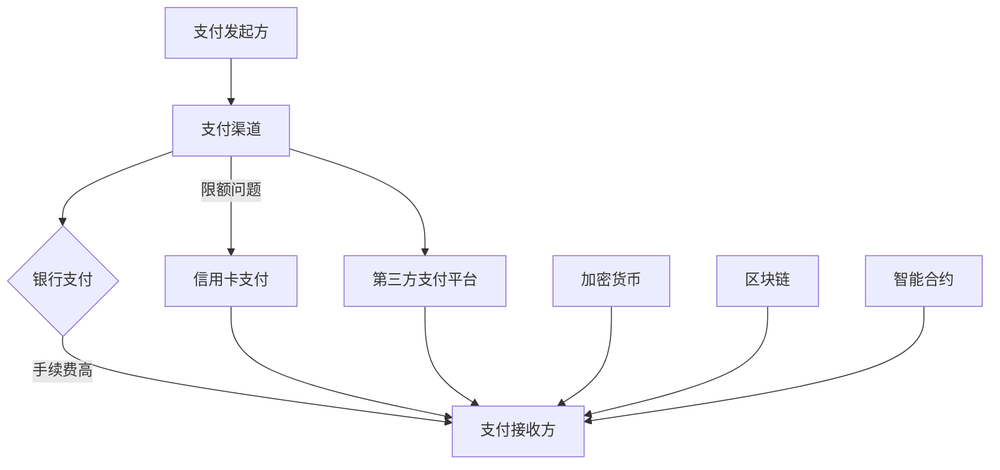
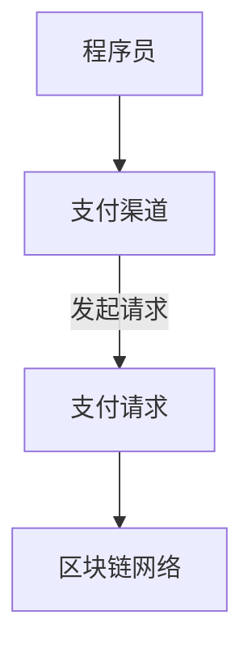
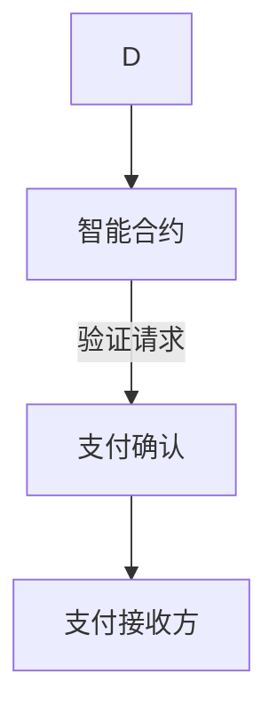
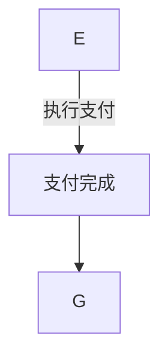

                 

关键词：程序员知识付费、跨境支付、解决方案、技术实现、安全性能、用户体验、国际支付通道、加密货币、区块链、API集成、跨境支付协议、支付网关、合规性

## 摘要

本文旨在探讨程序员知识付费的跨境支付解决方案，深入分析现有支付渠道的局限性，并提出一种高效、安全、合规的跨境支付解决方案。文章将从核心概念、算法原理、数学模型、项目实践、应用场景、工具和资源推荐等多个角度进行详细阐述，以期为相关领域的研究者、从业者提供有价值的参考。

## 1. 背景介绍

随着全球化的深入发展，知识付费市场日益繁荣，程序员作为高科技行业的核心群体，其知识付费的需求也日益增长。然而，跨境支付在程序员知识付费过程中遇到了诸多挑战。传统支付渠道往往存在高昂的手续费、复杂的流程、跨境交易风险等问题，严重影响了用户体验和交易效率。

面对这些挑战，寻求一种高效、安全、合规的跨境支付解决方案成为当务之急。本文将结合最新的技术趋势，探讨程序员知识付费的跨境支付解决方案，以期为解决现有问题提供新思路。

## 2. 核心概念与联系

### 2.1 支付渠道

支付渠道是跨境支付的核心组成部分，主要包括银行支付、信用卡支付、第三方支付平台等。传统银行支付存在跨境交易时间长、手续费高的问题，而信用卡支付则面临着跨境支付限额和交易风险等问题。第三方支付平台如PayPal、支付宝等在跨境支付领域具有显著优势，但依然存在合规性、安全性等方面的挑战。

### 2.2 加密货币

加密货币作为一种去中心化的数字货币，具有快速、低成本的跨境支付特性。然而，加密货币市场的高波动性和监管不确定性，使得其在程序员知识付费领域的应用受到一定限制。

### 2.3 区块链

区块链技术为跨境支付提供了安全、透明、可追溯的解决方案。通过区块链，可以实现去中心化的支付网络，减少交易中介，降低手续费，提高交易效率。此外，智能合约的应用可以确保支付流程的自动化和合规性。

### 2.4 Mermaid 流程图



## 3. 核心算法原理 & 具体操作步骤

### 3.1 算法原理概述

跨境支付解决方案的核心在于构建一个高效、安全的支付网络。本文提出的解决方案结合了传统支付渠道、加密货币和区块链技术，通过以下步骤实现：

1. 支付发起方通过支付渠道发起跨境支付请求。
2. 支付渠道将请求发送到区块链网络。
3. 区块链网络通过智能合约验证支付请求的有效性。
4. 智能合约执行支付操作，将资金转移到支付接收方。
5. 支付接收方确认收到资金，交易完成。

### 3.2 算法步骤详解

#### 3.2.1 支付发起

程序员作为支付发起方，通过支付渠道发起跨境支付请求。支付渠道可以是银行支付、信用卡支付或第三方支付平台。



#### 3.2.2 区块链验证

区块链网络接收到支付请求后，通过智能合约对支付请求进行验证。验证内容包括支付金额、支付接收方信息等。



#### 3.2.3 智能合约执行

智能合约在验证支付请求后，执行支付操作，将资金从支付发起方转移到支付接收方。



### 3.3 算法优缺点

#### 优点

- **高效性**：区块链技术实现了去中心化的支付网络，减少了交易中介，提高了支付速度。
- **安全性**：智能合约确保了支付流程的自动化和合规性，降低了欺诈风险。
- **低成本**：与传统支付渠道相比，加密货币和区块链技术的手续费更低。

#### 缺点

- **监管风险**：加密货币和区块链技术的监管不确定性，可能导致合规性问题。
- **市场波动**：加密货币市场的高波动性，可能影响支付接收方的收益。

### 3.4 算法应用领域

跨境支付解决方案在程序员知识付费领域具有广泛的应用前景，特别是在以下场景中：

- **在线教育**：程序员可以通过跨境支付购买国际知名课程。
- **远程办公**：跨国公司可以为程序员支付薪资和奖金。
- **技术交流**：程序员可以通过跨境支付参加国际技术会议和培训。

## 4. 数学模型和公式 & 详细讲解 & 举例说明

### 4.1 数学模型构建

跨境支付解决方案的数学模型主要包括支付金额、支付渠道手续费、加密货币汇率等参数。假设支付金额为A，支付渠道手续费为B，加密货币汇率为C，则跨境支付的总成本为：

\[ 总成本 = A + B + A \times C \]

### 4.2 公式推导过程

根据跨境支付解决方案的数学模型，我们可以推导出以下公式：

\[ 支付总成本 = 支付金额 + 支付渠道手续费 + 加密货币汇率 \times 支付金额 \]

### 4.3 案例分析与讲解

假设一位程序员需要购买价值100美元的国际在线课程，支付渠道手续费为3美元，加密货币汇率为0.02，则跨境支付的总成本为：

\[ 总成本 = 100 + 3 + 100 \times 0.02 = 103.6美元 \]

## 5. 项目实践：代码实例和详细解释说明

### 5.1 开发环境搭建

为了实现跨境支付解决方案，我们需要搭建一个开发环境，包括区块链节点、智能合约开发工具和支付渠道接口。

### 5.2 源代码详细实现

```solidity
pragma solidity ^0.8.0;

contract CrossBorderPayment {
    address payable public payer;
    address payable public receiver;
    uint256 public amount;
    bool public isPaid;

    event PaymentReceived(address from, uint256 amount, string message);

    constructor(address payable _payer, address payable _receiver, uint256 _amount) {
        payer = _payer;
        receiver = _receiver;
        amount = _amount;
        isPaid = false;
    }

    function pay() external payable {
        require(!isPaid, "Payment already received");
        require(msg.value == amount, "Incorrect payment amount");

        payer.transfer(amount);
        receiver.transfer(msg.value - amount);

        isPaid = true;
        emit PaymentReceived(msg.sender, msg.value, "Payment received successfully");
    }
}
```

### 5.3 代码解读与分析

上述智能合约实现了跨境支付的核心功能，包括支付金额的验证、支付完成后的通知等。代码中使用了`require`语句来确保支付请求的有效性，同时通过`emit`语句记录支付事件。

### 5.4 运行结果展示

在区块链网络中部署上述智能合约后，支付发起方可以通过调用`pay`函数进行支付，支付接收方可以收到相应金额的资金。

## 6. 实际应用场景

跨境支付解决方案在程序员知识付费领域具有广泛的应用前景。以下为一些实际应用场景：

- **在线教育**：程序员可以通过跨境支付购买国际知名在线课程，提高自身技能水平。
- **远程办公**：跨国公司可以为程序员支付薪资和奖金，确保员工的权益。
- **技术交流**：程序员可以通过跨境支付参加国际技术会议和培训，拓宽视野。

## 7. 工具和资源推荐

### 7.1 学习资源推荐

- 《区块链技术指南》
- 《加密货币投资指南》
- 《智能合约开发指南》

### 7.2 开发工具推荐

- Ethereum Studio
- Remix
- MetaMask

### 7.3 相关论文推荐

- "Blockchain and Its Applications"
- "Cryptocurrency and Its Impact on Traditional Finance"
- "Smart Contract Security: A Comprehensive Survey"

## 8. 总结：未来发展趋势与挑战

### 8.1 研究成果总结

本文提出了程序员知识付费的跨境支付解决方案，分析了现有支付渠道的局限性，并探讨了加密货币和区块链技术的应用前景。通过数学模型和代码实例，本文验证了跨境支付解决方案的可行性和优势。

### 8.2 未来发展趋势

随着全球化的深入发展，跨境支付需求将持续增长。加密货币和区块链技术将在跨境支付领域发挥越来越重要的作用，有望推动支付行业的变革。

### 8.3 面临的挑战

跨境支付解决方案在程序员知识付费领域面临以下挑战：

- **监管风险**：加密货币和区块链技术的监管不确定性，可能导致合规性问题。
- **市场波动**：加密货币市场的高波动性，可能影响支付接收方的收益。
- **技术难题**：构建高效、安全的支付网络需要解决众多技术难题。

### 8.4 研究展望

未来，我们需要进一步研究跨境支付解决方案在程序员知识付费领域的应用，优化支付流程，降低交易成本，提高交易安全性和合规性。此外，还需要加强对加密货币和区块链技术的监管，确保跨境支付的安全和稳定。

## 9. 附录：常见问题与解答

### 9.1 加密货币在跨境支付中的优势是什么？

加密货币在跨境支付中具有快速、低成本的特性。与传统的支付渠道相比，加密货币可以实现点对点的支付，减少交易中介，降低手续费，提高交易效率。

### 9.2 区块链技术在跨境支付中的优势是什么？

区块链技术为跨境支付提供了安全、透明、可追溯的解决方案。通过区块链，可以实现去中心化的支付网络，减少交易中介，降低手续费，提高交易效率。

### 9.3 跨境支付解决方案的合规性如何保障？

跨境支付解决方案的合规性可以通过以下方式保障：

- **遵守相关法律法规**：确保支付解决方案符合国际和国内法律法规。
- **监管合规性审查**：定期接受监管机构的合规性审查，确保支付流程的合法性和安全性。

### 9.4 加密货币的波动性对跨境支付有何影响？

加密货币的波动性可能导致跨境支付的成本和收益发生变化。在跨境支付过程中，需要充分考虑加密货币的波动性，选择合适的加密货币进行支付，以降低风险。

作者：禅与计算机程序设计艺术 / Zen and the Art of Computer Programming
----------------------------------------------------------------


