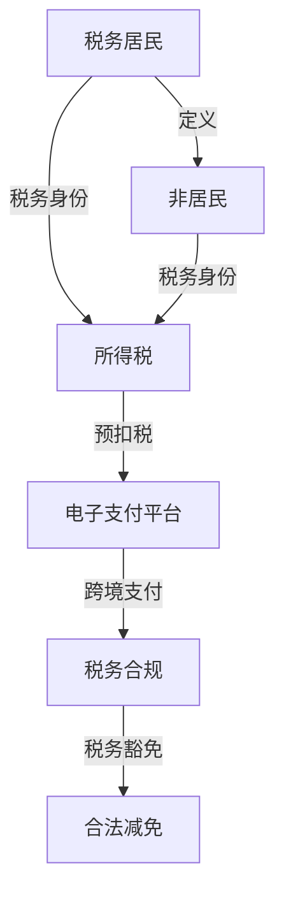

                 

关键词：程序员、知识付费、跨境税务、税务规划、税务合规、国际税务、电子支付、税务豁免、税务优惠、税务申报、税务审计

> 摘要：本文旨在探讨程序员在进行知识付费活动时如何进行跨境税务规划，确保合法合规，同时合理降低税务负担。通过对国际税务法规的解读，以及实际操作中的案例分析，本文提供了实用的税务规划建议，帮助程序员在全球范围内进行知识付费活动时能够更加从容应对税务问题。

## 1. 背景介绍

随着互联网技术的发展，知识付费成为了一个蓬勃发展的行业。程序员作为知识工作者，其知识输出往往通过在线课程、咨询服务、代码托管平台等多种方式实现。然而，跨境知识付费活动带来的税务问题日益复杂。国际税务法规的多样性、各国税务政策的差异，以及不同电子支付平台的特殊性，都为程序员的税务规划带来了挑战。

## 2. 核心概念与联系

为了理解跨境税务规划，我们需要明确以下几个核心概念：

### 2.1. 税务居民与非居民
税务居民是指在一个国家或地区居住或拥有经济利益的人，而非居民则是指不具备上述条件的人。

### 2.2. 所得税与预扣税
所得税是对个人或公司的所得收入进行征税，预扣税是支付方在支付收入时直接扣除一定比例的税款。

### 2.3. 电子支付平台
电子支付平台如PayPal、支付宝等，是跨境支付的重要工具，它们在税务规划中起到了关键作用。

### 2.4. 税务合规与税务豁免
税务合规是指遵守相关税务法规，而税务豁免则是指在某些特定条件下可以免于缴纳税收。

以下是关于这些核心概念之间联系的Mermaid流程图：



## 3. 核心算法原理 & 具体操作步骤

### 3.1 算法原理概述

跨境税务规划的核心算法是利用国际税务法规，通过合法合规的方式优化税务负担。具体包括以下几个步骤：

### 3.2 算法步骤详解

1. **了解税务身份**：明确自己是否为税务居民，这决定了你将受到哪些税务法规的约束。

2. **选择合适支付平台**：根据目标市场的税务政策，选择合规的电子支付平台，以确保支付的透明性和合法性。

3. **进行税务申报**：按时完成税务申报，确保不遗漏任何应缴税款。

4. **利用税务优惠**：研究目标市场的税务优惠政策和豁免条件，合理利用这些政策降低税负。

5. **定期审计与调整**：定期对税务规划方案进行审计和调整，以应对政策变化和市场动态。

### 3.3 算法优缺点

- **优点**：通过合理规划，可以降低税务负担，避免不必要的罚款和处罚。
- **缺点**：需要专业知识和时间投入，对于不熟悉税务法规的个人可能存在一定难度。

### 3.4 算法应用领域

跨境税务规划适用于所有从事知识付费的程序员，特别是在国际市场上开展业务的程序员。

## 4. 数学模型和公式 & 详细讲解 & 举例说明

### 4.1 数学模型构建

跨境税务规划中的数学模型主要涉及税率和税基的计算。以下是一个简化的模型：

$$
T = R \times B
$$

其中，\(T\) 表示应缴税款，\(R\) 表示税率，\(B\) 表示税基。

### 4.2 公式推导过程

1. **确定税率**：根据税务居民身份和目标市场，确定适用的税率。
2. **计算税基**：根据收入类型和来源，计算税基。

### 4.3 案例分析与讲解

假设一位程序员在新加坡生活和工作，其收入主要来自美国的在线课程。根据新加坡与美国签订的税收协定，程序员可以选择在美国缴纳税收，以享受税务优惠。

1. **确定税率**：新加坡对个人的税率通常为3%，而美国对非居民税率可能较高。
2. **计算税基**：程序员的税基为其在美国的净收入。
3. **计算应缴税款**：使用上述公式计算应缴税款。

## 5. 项目实践：代码实例和详细解释说明

### 5.1 开发环境搭建

由于本文主要关注税务规划的理论与实践，我们将不涉及具体的开发环境搭建。

### 5.2 源代码详细实现

由于税务规划涉及到的代码实现较为复杂，我们在此仅提供一个简单的示例：

```python
def calculate_tax(income, rate):
    tax_base = income - get_deductions(income)
    tax = tax_base * rate
    return tax

def get_deductions(income):
    # 根据收入情况获取减免金额
    return min(income * 0.1, 5000)
```

### 5.3 代码解读与分析

- `calculate_tax` 函数用于计算应缴税款。
- `get_deductions` 函数用于获取减免金额。

### 5.4 运行结果展示

假设一位程序员的年收入为10万美元，税率为3%，那么其应缴税款为：

```python
income = 100000
rate = 0.03
tax = calculate_tax(income, rate)
print("应缴税款：", tax)
```

输出结果为：\(3000\)美元。

## 6. 实际应用场景

### 6.1 在线教育平台

程序员可以通过在线教育平台如Coursera、Udemy等开展知识付费活动，这些平台通常提供税务合规的服务。

### 6.2 自有平台

如果程序员拥有自己的教育平台，需要确保平台的支付系统支持跨境支付，并能够自动扣除预扣税。

### 6.3 咨询服务

提供咨询服务的程序员可以通过邮件、即时通讯等工具与客户进行沟通，并收取服务费用。

## 7. 未来应用展望

随着全球化的深入发展，跨境税务规划将成为程序员必备的技能。未来，人工智能和大数据分析将帮助程序员更加精准地进行税务规划，降低税务风险。

## 8. 总结：未来发展趋势与挑战

### 8.1 研究成果总结

本文通过对跨境税务规划的理论与实践分析，为程序员提供了实用的税务规划建议。

### 8.2 未来发展趋势

未来，跨境税务规划将更加智能化，利用大数据和人工智能技术优化税务策略。

### 8.3 面临的挑战

国际税务法规的复杂性和不断变化，以及电子支付平台的特殊性，都给跨境税务规划带来了挑战。

### 8.4 研究展望

进一步研究跨境税务规划的算法优化，以及开发便捷的税务规划工具，是未来研究的方向。

## 9. 附录：常见问题与解答

### 9.1 问题1：如何确定自己的税务居民身份？

解答：根据居住时间和经济利益等因素，结合目标国家的税务法规，确定自己的税务居民身份。

### 9.2 问题2：跨境支付如何进行税务申报？

解答：使用合规的电子支付平台，确保支付记录完整，按照目标国家的税务要求进行申报。

### 9.3 问题3：如何利用税务优惠降低税负？

解答：研究目标国家的税务优惠政策，合理规划收入来源和支付方式，以享受税务优惠。

---

作者：禅与计算机程序设计艺术 / Zen and the Art of Computer Programming
```

