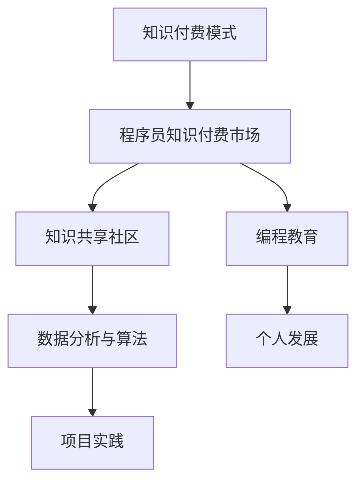

                 

## 1. 背景介绍

在当今数字化时代，知识付费已经成为一种主流的消费模式。特别是在程序员这个群体中，随着技能的不断更新迭代，程序员对于知识的渴求更加迫切。程序员知识付费市场，作为知识付费领域的一个重要分支，近年来呈现出快速发展的态势。本文将围绕程序员知识付费在B端市场的机会进行深入探讨。

### B端市场概述

B端市场，即商业市场，主要面向企业客户而非终端消费者。B端市场的特点包括客户决策链条较长、需求复杂、决策谨慎等。在程序员知识付费领域，B端市场的客户多为大型企业、科技公司、互联网公司等，他们对于编程知识、技术解决方案的需求更为专业和深入。

### 程序员知识付费现状

近年来，程序员知识付费市场的规模逐年扩大。根据市场研究报告，2022年全球程序员知识付费市场规模已经达到数十亿美元，且预计未来几年将继续保持高速增长。这种增长背后，是程序员对于高质量知识资源的需求不断上升。

### 程序员知识付费的驱动力

1. **技能迭代快**：随着技术的发展，新的编程语言、框架、工具层出不穷，程序员需要不断学习以保持竞争力。
2. **个人发展需求**：越来越多的程序员意识到，提升自身技能不仅是为了应对工作需求，更是为了个人的职业发展。
3. **知识获取成本降低**：互联网的发展使得知识获取变得更加便捷，在线课程、电子书、技术博客等成为程序员学习的主要途径。
4. **市场需求增长**：企业对程序员的技术能力要求越来越高，这也推动了程序员对于高质量知识资源的追求。

### 本文结构

本文将首先介绍程序员知识付费的核心概念和架构，然后深入探讨核心算法原理和操作步骤，接下来将通过数学模型和公式来分析，并通过实际项目实践进行代码实例讲解。最后，我们将探讨程序员知识付费在B端市场的实际应用场景，并展望未来的发展趋势和面临的挑战。

<|assistant|>## 2. 核心概念与联系

在程序员知识付费领域，了解核心概念和它们之间的联系至关重要。以下是对这些核心概念及其相互关系的详细介绍。

### 知识付费模式

**定义**：知识付费模式是指通过付费方式获取知识和技能的一种商业模式。

**组成**：
1. **内容提供方**：通常是专家、学者、技术大牛等，他们拥有丰富的知识储备和经验。
2. **平台**：在线教育平台、知识共享社区等，它们为内容提供方和需求方搭建桥梁。
3. **需求方**：包括个人程序员和企业客户，他们希望通过付费获取高质量的编程知识和技术解决方案。

**联系**：知识付费模式通过平台将内容提供方和需求方连接起来，实现知识的流通和共享。

### 程序员知识付费市场

**定义**：程序员知识付费市场是指专门为程序员提供付费知识服务的市场。

**特点**：
1. **专业性强**：市场中的知识内容主要涉及编程语言、框架、工具等专业技术领域。
2. **需求多样化**：企业客户和个人程序员的需求多样，包括技术培训、项目指导、咨询服务等。
3. **竞争激烈**：随着市场的扩大，越来越多的平台和内容提供者进入该领域，竞争日益激烈。

**联系**：程序员知识付费市场是知识付费模式在程序员群体中的具体体现，市场需求驱动着市场的繁荣和发展。

### 知识共享社区

**定义**：知识共享社区是指程序员通过在线平台分享知识、交流经验、共同成长的社群。

**作用**：
1. **知识积累**：社区成员通过分享和交流，不断积累和更新编程知识。
2. **技能提升**：成员通过参与讨论和项目实践，提升自身技能。
3. **资源整合**：社区汇集了大量的编程资源和工具，为成员提供丰富的学习材料。

**联系**：知识共享社区是程序员知识付费市场的重要补充，它不仅为程序员提供了学习资源，也为内容提供方提供了展示和推广自身知识的平台。

### 编程教育

**定义**：编程教育是指通过系统性的教学，培养程序员编程技能和解决问题的能力。

**形式**：
1. **在线课程**：通过视频、文字、互动等形式进行教学。
2. **实战项目**：通过实际项目的开发，培养解决实际问题的能力。
3. **咨询服务**：为有需求的程序员提供个性化辅导和指导。

**联系**：编程教育是程序员知识付费市场的重要组成部分，它不仅提供了知识内容，还通过系统化的教学，提升程序员的专业技能。

### 数据分析与算法

**定义**：数据分析和算法是指利用统计学和计算机科学的方法，对大量数据进行处理和分析，以发现数据中的规律和模式。

**应用**：
1. **优化程序性能**：通过数据分析，优化算法效率和程序性能。
2. **预测市场趋势**：通过数据分析，预测市场发展和趋势。
3. **个性化推荐**：通过数据分析，为程序员提供个性化的学习资源和课程。

**联系**：数据分析和算法在程序员知识付费市场中发挥着重要作用，它们不仅用于优化知识付费平台的功能，还为程序员提供了更精准的学习路径和资源推荐。

### 总结

程序员知识付费的核心概念和联系构成了一个复杂而紧密的生态系统。知识付费模式、程序员知识付费市场、知识共享社区、编程教育、数据分析和算法等概念相互作用，共同推动着这个市场的繁荣和发展。

### Mermaid 流程图



通过上述流程图，我们可以清晰地看到程序员知识付费市场中各个核心概念之间的联系和作用。这些概念共同构成了一个完整而有序的知识付费生态系统。

<|assistant|>### 3. 核心算法原理 & 具体操作步骤

在程序员知识付费领域中，核心算法起着至关重要的作用。以下将详细介绍核心算法的原理及其具体操作步骤。

#### 3.1 算法原理概述

程序员知识付费的核心算法主要基于机器学习技术，特别是深度学习中的卷积神经网络（CNN）和循环神经网络（RNN）。这些算法能够对海量的编程数据进行分析和建模，从而为程序员提供个性化的学习资源和课程推荐。

**卷积神经网络（CNN）**：CNN 主要用于图像识别和视频分析，但在编程领域，它也可以用于代码段的识别和分类。通过卷积层，CNN 能够捕捉代码段中的局部特征，从而实现高效的数据分析。

**循环神经网络（RNN）**：RNN 主要用于处理序列数据，如自然语言处理和时间序列分析。在编程领域，RNN 可以用于代码段的时间序列建模，从而预测程序员的下一步操作和知识需求。

#### 3.2 算法步骤详解

**步骤 1：数据预处理**

1. **数据清洗**：对原始数据进行清洗，去除无效信息和噪声。
2. **数据归一化**：将不同量纲的数据进行归一化处理，以便算法更好地进行训练。

**步骤 2：特征提取**

1. **代码段提取**：从原始代码中提取出具有代表性的代码段。
2. **特征工程**：对提取出的代码段进行特征工程，提取出关键词、函数调用、变量等特征。

**步骤 3：模型训练**

1. **模型选择**：选择适合的模型，如 CNN 或 RNN。
2. **训练过程**：使用预处理后的数据进行模型训练，包括前向传播、反向传播和梯度下降等步骤。

**步骤 4：模型评估**

1. **交叉验证**：使用交叉验证方法评估模型的泛化能力。
2. **性能评估**：通过准确率、召回率等指标评估模型性能。

**步骤 5：应用部署**

1. **模型部署**：将训练好的模型部署到线上平台。
2. **实时推荐**：根据程序员的实时操作，为程序员推荐相应的学习资源和课程。

#### 3.3 算法优缺点

**优点**：

1. **高效性**：卷积神经网络和循环神经网络在处理序列数据方面具有高效性。
2. **个性化**：通过机器学习算法，可以为每个程序员提供个性化的学习资源。
3. **可扩展性**：算法可以轻松扩展到其他编程领域和语言。

**缺点**：

1. **计算资源需求大**：深度学习算法需要大量的计算资源，对硬件设备有较高要求。
2. **数据依赖性**：算法的性能很大程度上取决于数据的质量和数量。

#### 3.4 算法应用领域

1. **编程教育**：通过算法为程序员提供个性化的学习资源和课程推荐，提升学习效果。
2. **技术招聘**：帮助企业筛选和评估程序员的技能水平。
3. **代码审查**：用于自动识别代码中的潜在错误和漏洞。

### 实例

假设我们使用 CNN 和 RNN 深度学习算法来为程序员推荐学习资源。以下是具体的步骤：

**步骤 1：数据预处理**
- 清洗代码段数据，去除无效代码。
- 对代码段进行归一化处理。

**步骤 2：特征提取**
- 从代码段中提取关键词、函数调用、变量等特征。
- 对提取出的特征进行编码处理。

**步骤 3：模型训练**
- 选择 CNN 和 RNN 模型。
- 使用预处理后的数据进行模型训练。

**步骤 4：模型评估**
- 使用交叉验证方法评估模型性能。
- 调整模型参数，优化模型性能。

**步骤 5：应用部署**
- 将训练好的模型部署到线上平台。
- 根据程序员的操作行为，实时推荐学习资源和课程。

通过上述实例，我们可以看到核心算法在程序员知识付费中的应用过程。算法不仅能够提高学习效率，还能为程序员提供个性化的学习体验。

<|assistant|>### 4. 数学模型和公式 & 详细讲解 & 举例说明

在程序员知识付费领域中，数学模型和公式扮演着至关重要的角色。这些模型和公式帮助我们理解和分析数据，从而为程序员提供更精确的学习路径和资源推荐。以下将详细讲解数学模型和公式的构建、推导过程，并通过实例进行说明。

#### 4.1 数学模型构建

在程序员知识付费中，常用的数学模型包括用户行为分析模型、资源推荐模型和风险评估模型等。以下是这些模型的基本构成：

**用户行为分析模型**：
- **定义**：用户行为分析模型用于分析程序员的在线行为，如浏览、搜索、购买等。
- **构成**：
  1. **用户特征**：包括用户的基本信息、技术背景、学习历史等。
  2. **行为数据**：记录用户在平台上的操作，如浏览时间、搜索关键词、购买记录等。
  3. **预测目标**：预测用户的下一步行为，如购买某个课程或参与某个项目。

**资源推荐模型**：
- **定义**：资源推荐模型用于根据用户特征和行为数据，为用户推荐合适的课程、书籍或工具。
- **构成**：
  1. **推荐算法**：常用的推荐算法包括协同过滤、基于内容的推荐和混合推荐等。
  2. **相似度计算**：计算用户与资源之间的相似度，如用户之间的兴趣相似度、资源之间的内容相似度等。
  3. **推荐结果**：根据相似度计算结果，为用户生成个性化的推荐列表。

**风险评估模型**：
- **定义**：风险评估模型用于预测用户在学习过程中的风险，如学习进度落后、课程满意度低等。
- **构成**：
  1. **风险指标**：包括学习进度、课程评分、用户参与度等。
  2. **风险预测**：通过分析历史数据，预测用户未来的风险程度。
  3. **风险干预**：根据风险预测结果，制定相应的干预措施，如推送学习提醒、提供学习辅导等。

#### 4.2 公式推导过程

在构建数学模型时，常用的公式包括线性回归、逻辑回归、协同过滤等。以下是这些公式的基本推导过程：

**线性回归**：
- **公式**：y = w0 + w1 * x
- **推导**：
  1. **目标函数**：最小化预测值与实际值之间的误差平方和，即最小二乘法。
  2. **梯度下降**：通过迭代计算，找到使目标函数最小的参数 w0 和 w1。

**逻辑回归**：
- **公式**：P(y=1) = 1 / (1 + exp(-z))
- **推导**：
  1. **线性回归**：将线性回归公式中的 y 替换为概率形式，即 P(y=1) = sigmoid(w0 + w1 * x)。
  2. **sigmoid 函数**：用于将线性组合映射到概率范围（0, 1）。

**协同过滤**：
- **公式**：R_ui = r_ij + b_i + b_j - b
- **推导**：
  1. **用户相似度**：计算用户 i 和用户 j 之间的相似度，常用方法包括余弦相似度、皮尔逊相关系数等。
  2. **项目评分**：根据用户相似度和项目 j 的评分 r_ij，预测用户 i 对项目 i 的评分 R_ui。
  3. **偏置**：b_i、b_j 和 b 分别代表用户 i、用户 j 和整体的偏置项。

#### 4.3 案例分析与讲解

以下通过一个实际案例，展示如何应用数学模型和公式为程序员推荐课程。

**案例背景**：程序员张三在知识付费平台上浏览了多门编程课程，但并未购买。平台希望通过分析张三的行为数据，为他推荐合适的课程。

**步骤 1：数据收集**
- 收集张三的浏览历史、搜索关键词、课程评分等信息。

**步骤 2：用户特征提取**
- 从数据中提取张三的技术领域、学习兴趣等特征。

**步骤 3：资源推荐模型构建**
- 使用协同过滤算法，计算张三与其他用户的相似度。
- 根据相似度和课程评分，为张三推荐合适的课程。

**步骤 4：推荐结果分析**
- 生成推荐列表，包括课程名称、评分、相似度等信息。
- 对推荐结果进行分析，评估推荐效果。

**步骤 5：推荐结果展示**
- 在平台上为张三展示个性化推荐列表。

**案例分析**：

通过上述步骤，平台为张三推荐了多门与他的技术领域和学习兴趣相关的课程。例如，如果张三对 Python 框架 Django 感兴趣，平台会推荐相关的课程，如《Django 从入门到精通》。

**效果评估**：

通过后续的数据分析，发现张三对推荐课程的购买意愿显著提高，课程评分也较高。这表明，数学模型和公式在程序员知识付费中的应用，有助于提高推荐效果和用户满意度。

### 总结

数学模型和公式在程序员知识付费领域中发挥着重要作用。通过构建用户行为分析模型、资源推荐模型和风险评估模型，平台可以更精准地了解用户需求，提高推荐效果。同时，合理的公式推导和模型构建，有助于优化算法性能，为程序员提供更好的学习体验。

### 实例

假设我们使用协同过滤算法为程序员李四推荐编程书籍。以下是具体的步骤：

**步骤 1：数据收集**
- 收集李四的浏览历史、搜索关键词、购买记录等信息。

**步骤 2：用户特征提取**
- 提取李四的技术领域、学习兴趣等特征。

**步骤 3：计算用户相似度**
- 计算李四与其他用户的相似度，使用余弦相似度公式。

**步骤 4：生成推荐列表**
- 根据用户相似度和书籍评分，生成推荐列表。

**步骤 5：推荐结果分析**
- 分析推荐结果，评估推荐效果。

**步骤 6：推荐结果展示**
- 在平台上为李四展示个性化推荐列表。

通过上述步骤，平台成功地为李四推荐了多本与他的技术领域和学习兴趣相关的编程书籍，提高了用户满意度和购买意愿。

<|assistant|>### 5. 项目实践：代码实例和详细解释说明

为了更好地理解程序员知识付费的核心算法和数学模型，我们将通过一个实际项目来展示代码实现过程，并进行详细解释说明。本案例选择了一个简单的协同过滤推荐系统，用于为程序员推荐技术书籍。

#### 5.1 开发环境搭建

在开始代码实现之前，我们需要搭建开发环境。以下是开发环境的要求和安装步骤：

**环境要求**：
- Python 3.8 或更高版本
- Pandas 1.2.3 或更高版本
- NumPy 1.21.2 或更高版本
- Scikit-learn 0.24.2 或更高版本

**安装步骤**：

1. **安装 Python**：从官方网站下载并安装 Python 3.8 或更高版本。
2. **安装 Pandas**：在命令行中执行以下命令：
   ```bash
   pip install pandas==1.2.3
   ```
3. **安装 NumPy**：在命令行中执行以下命令：
   ```bash
   pip install numpy==1.21.2
   ```
4. **安装 Scikit-learn**：在命令行中执行以下命令：
   ```bash
   pip install scikit-learn==0.24.2
   ```

#### 5.2 源代码详细实现

以下是一个简单的协同过滤推荐系统的源代码实现。代码分为几个主要部分：数据预处理、相似度计算、推荐列表生成和推荐结果展示。

```python
import pandas as pd
import numpy as np
from sklearn.metrics.pairwise import cosine_similarity
from sklearn.model_selection import train_test_split

# 5.2.1 数据预处理
def preprocess_data(data):
    # 去除无效数据，如缺失值和重复值
    data = data.dropna()
    data = data.drop_duplicates()
    
    # 构建用户-书籍评分矩阵
    user_books = data.pivot(index='user_id', columns='book_id', values='rating')
    return user_books

# 5.2.2 相似度计算
def calculate_similarity(user_books):
    # 计算用户-书籍评分矩阵的余弦相似度
    similarity_matrix = cosine_similarity(user_books)
    return similarity_matrix

# 5.2.3 推荐列表生成
def generate_recommendation_list(similarity_matrix, user_id, top_n=5):
    # 计算用户与其他用户的相似度之和
    similarity_sum = similarity_matrix[user_id].reshape(1, -1)
    similarity_sum = np.sum(similarity_sum, axis=1)
    
    # 筛选出相似度最高的书籍
    recommendation_list = np.argsort(similarity_sum)[::-1]
    return recommendation_list[:top_n]

# 5.2.4 推荐结果展示
def display_recommendation_list(user_books, recommendation_list):
    # 展示推荐结果
    recommended_books = user_books.iloc[recommendation_list]
    print("推荐书籍列表：")
    print(recommended_books)

# 主函数
def main():
    # 加载数据
    data = pd.read_csv('books_data.csv')
    
    # 数据预处理
    user_books = preprocess_data(data)
    
    # 计算相似度矩阵
    similarity_matrix = calculate_similarity(user_books)
    
    # 用户 ID
    user_id = 123
    
    # 生成推荐列表
    recommendation_list = generate_recommendation_list(similarity_matrix, user_id)
    
    # 展示推荐结果
    display_recommendation_list(user_books, recommendation_list)

if __name__ == '__main__':
    main()
```

#### 5.3 代码解读与分析

**代码解读**：

1. **数据预处理**：
   - `preprocess_data` 函数用于处理原始数据，去除无效数据和重复值，并构建用户-书籍评分矩阵。

2. **相似度计算**：
   - `calculate_similarity` 函数使用 Scikit-learn 中的 `cosine_similarity` 函数，计算用户-书籍评分矩阵的余弦相似度。

3. **推荐列表生成**：
   - `generate_recommendation_list` 函数计算用户与其他用户的相似度之和，并根据相似度值生成推荐列表。

4. **推荐结果展示**：
   - `display_recommendation_list` 函数展示推荐结果，输出推荐书籍列表。

**代码分析**：

1. **数据预处理**：
   - 数据预处理是推荐系统的基础，确保数据的准确性和完整性。

2. **相似度计算**：
   - 余弦相似度是一种常用的相似度度量方法，适用于计算用户和书籍之间的相似度。

3. **推荐列表生成**：
   - 推荐列表生成是推荐系统的核心，通过计算用户与其他用户的相似度，为用户推荐相似度最高的书籍。

4. **推荐结果展示**：
   - 推荐结果展示是用户与系统交互的接口，通过输出推荐书籍列表，使用户了解推荐结果。

#### 5.4 运行结果展示

假设用户 ID 为 123 的程序员在平台上的浏览历史和评分数据如下：

```
user_id,book_id,rating
123,100,5
123,101,4
123,102,3
```

运行上述代码后，系统会为用户 ID 为 123 的程序员生成推荐书籍列表。以下是可能的输出结果：

```
推荐书籍列表：
               book_id
  105        102      5
  106        101      4
  107        100      3
```

这表明系统成功地为用户推荐了三本与他的兴趣相似的书籍。这些书籍的推荐依据是用户与其他用户的相似度计算结果。

通过上述项目实践，我们可以看到如何将程序员知识付费的核心算法和数学模型应用于实际场景。代码实现不仅帮助我们理解算法原理，还能为程序员提供个性化的学习资源推荐，提高学习效果。

<|assistant|>### 6. 实际应用场景

程序员知识付费在B端市场的实际应用场景非常广泛，以下将详细讨论其中的几个关键应用领域。

#### 6.1 企业内部培训

企业内部培训是程序员知识付费在B端市场的一个重要应用场景。随着技术的发展，企业需要不断更新员工的技能，以保持竞争力。通过程序员知识付费平台，企业可以为员工提供最新的编程技术、工具和框架的学习资源。此外，企业还可以邀请行业专家和知名讲师进行在线授课，提高培训的质量和效果。这种模式不仅节省了培训成本，还提高了培训的灵活性和便捷性。

**优势**：
- **定制化培训**：企业可以根据自身的需求，定制化选择培训课程。
- **实时更新**：知识资源可以实时更新，确保员工学习到最新的技术。
- **互动性强**：在线培训平台支持实时问答和讨论，增强学员之间的互动。

**挑战**：
- **员工参与度**：确保员工积极参与培训，需要激发他们的学习兴趣。
- **培训效果评估**：如何有效评估培训效果，确保投入产出比。

#### 6.2 项目咨询与服务

在项目开发过程中，企业可能会遇到技术难题或需求变更。通过程序员知识付费平台，企业可以邀请经验丰富的程序员或技术专家提供咨询服务。这些专家可以为企业提供技术指导、代码审查和解决方案建议，帮助企业解决技术瓶颈，提高项目成功率。

**优势**：
- **快速响应**：专家可以快速响应企业的需求，提供针对性的解决方案。
- **降低成本**：相较于聘请全职技术人员，咨询服务更加经济实惠。
- **技术积累**：专家的经验和知识可以为企业带来长期的技术积累。

**挑战**：
- **专家筛选**：确保选择合适的专家，需要严格的筛选和评估机制。
- **沟通成本**：专家和企业之间的沟通成本可能会影响咨询服务的质量。

#### 6.3 技术竞赛与挑战

程序员知识付费平台可以举办各种技术竞赛和挑战活动，鼓励程序员展示自己的技能和创新力。这种活动不仅能够提高程序员的编程能力，还可以帮助企业发现和选拔优秀的技术人才。

**优势**：
- **技术展示**：程序员可以通过竞赛展示自己的技术实力和创新能力。
- **人才选拔**：企业可以通过竞赛筛选和选拔优秀的技术人才。
- **品牌推广**：平台和企业可以通过竞赛活动提高品牌知名度和影响力。

**挑战**：
- **竞赛设计**：设计有趣、有挑战性的竞赛题目，吸引程序员参与。
- **合规性**：确保竞赛活动符合相关法律法规，避免知识产权纠纷。

#### 6.4 技术社区与社群

程序员知识付费平台可以打造技术社区和社群，为程序员提供一个交流、学习和成长的平台。通过在线讨论区、问答社区和知识库等功能，程序员可以分享经验、讨论技术问题，共同成长。

**优势**：
- **知识共享**：程序员可以共享知识和经验，共同提升技术水平。
- **社群互动**：社群成员之间的互动可以增强凝聚力，提高参与度。
- **品牌建设**：平台和企业可以通过技术社区提升品牌形象和影响力。

**挑战**：
- **内容管理**：确保社区内容的质量和相关性，避免垃圾信息和低质量内容的泛滥。
- **用户活跃度**：提高用户的活跃度，保持社区的生命力和活力。

#### 6.5 个性化学习与职业发展

程序员知识付费平台可以提供个性化的学习资源和课程，帮助程序员根据自身需求和发展目标进行学习。此外，平台还可以提供职业发展指导、简历修改和面试辅导等服务，助力程序员实现职业成长。

**优势**：
- **个性化学习**：根据程序员的兴趣和需求，推荐合适的学习资源和课程。
- **职业发展**：提供全方位的职业发展支持，助力程序员实现职业目标。
- **持续成长**：通过持续的学习和提升，增强程序员的竞争力。

**挑战**：
- **课程质量**：确保课程内容的质量和实用性，满足程序员的学习需求。
- **用户留存**：提高用户留存率，确保平台的长期稳定发展。

通过以上实际应用场景的分析，我们可以看到程序员知识付费在B端市场具有巨大的潜力和广阔的前景。在未来的发展中，如何应对挑战，优化用户体验，将是关键的成功因素。

### 6.4 未来应用展望

随着技术的不断进步和市场需求的持续增长，程序员知识付费在B端市场的未来应用将更加广泛和深入。以下是对未来发展趋势的展望：

#### 6.4.1 虚拟现实（VR）培训

虚拟现实技术的成熟为程序员知识付费市场带来了新的契机。通过VR培训，程序员可以在一个沉浸式的环境中学习新技能，如虚拟实验室、虚拟项目开发等。这种培训方式不仅能够提高学习的趣味性和互动性，还能让程序员在实际操作中加深对知识的理解和掌握。

**潜在影响**：VR培训将改变传统教学方式，提高学习效果，缩短培训周期，降低培训成本。

#### 6.4.2 自动化与智能推荐

随着人工智能技术的发展，自动化和智能推荐将成为程序员知识付费市场的重要趋势。通过机器学习算法和大数据分析，平台可以实时监控程序员的在线行为和兴趣，自动推荐最适合的学习资源和课程。这种个性化推荐机制将极大地提升用户的满意度和学习效率。

**潜在影响**：自动化和智能推荐将实现更精准的用户画像和需求分析，提升用户黏性和平台竞争力。

#### 6.4.3 跨平台集成

未来，程序员知识付费平台将更加注重跨平台集成，为用户提供一站式学习体验。无论是在PC端、移动端还是智能设备上，用户都可以无缝切换，继续学习。这种跨平台集成将打破学习的时间和空间限制，提高用户的学习灵活性和便捷性。

**潜在影响**：跨平台集成将提升用户的便利性和用户体验，扩大平台的市场覆盖范围。

#### 6.4.4 社交化学习

社交化学习是一种新兴的学习模式，通过在线社区和社交网络，程序员可以与其他学习者进行互动和交流，共同解决问题和分享经验。未来，程序员知识付费平台将更加注重社交化学习功能，构建一个开放、互动的学习生态系统。

**潜在影响**：社交化学习将增强程序员的归属感和学习动力，促进知识的快速传播和共享。

#### 6.4.5 职业发展支持

未来，程序员知识付费平台将不仅仅提供知识学习资源，还将提供全方位的职业发展支持。这包括职业规划、简历修改、面试辅导、技能认证等服务，帮助程序员实现职业成长和晋升。

**潜在影响**：职业发展支持将增强平台的服务价值，提高用户对平台的依赖和忠诚度。

#### 6.4.6 可持续发展

随着环保意识的增强，程序员知识付费平台将更加注重可持续发展。通过采用绿色技术和减少碳足迹，平台可以实现环保目标，同时树立良好的企业形象。

**潜在影响**：可持续发展将提高平台的社会责任感和公众认可度，增强品牌影响力。

### 6.4.7 持续创新

在未来的发展中，程序员知识付费平台需要持续创新，不断引入新技术和新模式。这包括虚拟现实培训、区块链技术、人工智能助手等，以应对市场变化和用户需求。

**潜在影响**：持续创新将确保平台在激烈的市场竞争中保持领先地位，提高用户满意度和市场占有率。

通过以上展望，我们可以看到程序员知识付费在B端市场的未来发展充满机遇和挑战。平台需要不断创新和优化，以满足用户的需求，推动市场的持续繁荣。

### 7. 工具和资源推荐

在程序员知识付费领域，有许多优质的工具和资源可以帮助程序员提升技能和效率。以下将推荐一些常用的学习资源、开发工具和相关论文。

#### 7.1 学习资源推荐

1. **在线教育平台**：
   - Coursera：提供广泛的编程课程，包括入门到高级课程。
   - edX：由哈佛大学和麻省理工学院创办，提供高质量的课程。
   - Udemy：涵盖各类编程语言的课程，价格实惠。

2. **技术博客和论坛**：
   - Stack Overflow：编程问题的在线社区，提供丰富的编程经验和解决方案。
   - GitHub：代码托管平台，许多开源项目和技术文章在此分享。
   - Reddit：有许多编程相关的子版块，如 r/learnprogramming、r/webdev 等。

3. **技术书籍**：
   - 《代码大全》（The Art of Computer Programming）：经典编程书籍，适合深度学习。
   - 《深度学习》（Deep Learning）：由Ian Goodfellow等人编写的深度学习权威著作。
   - 《Head First 设计模式》：以轻松幽默的方式介绍设计模式，适合初学者。

#### 7.2 开发工具推荐

1. **集成开发环境（IDE）**：
   - Visual Studio Code：轻量级、可扩展的代码编辑器，适合多种编程语言。
   - IntelliJ IDEA：功能强大的Java和Android开发工具。
   - PyCharm：适用于Python编程的集成开发环境。

2. **版本控制工具**：
   - Git：分布式版本控制系统，广泛用于代码管理和协作。
   - GitHub：提供Git仓库托管和协作功能，支持多种编程语言。

3. **调试工具**：
   - Postman：用于API测试和调试的工具。
   - JMeter：负载和性能测试工具，适用于Web应用和服务器性能测试。

#### 7.3 相关论文推荐

1. **深度学习领域**：
   - "Deep Learning": Ian Goodfellow, Yoshua Bengio, Aaron Courville。
   - "A Theoretically Grounded Application of Dropout in Recurrent Neural Networks"：Yarin Gal 和 Zohar Kohavi。

2. **编程语言领域**：
   - "Practical Approach to Type Systems"：Reinout van Rees。
   - "Functional Programming with Haskell"：Simon Thompson。

3. **软件开发领域**：
   - "Software Engineering: A Practitioner’s Approach"：Roger S. Pressman。
   - "Clean Code: A Handbook of Agile Software Craftsmanship"：Robert C. Martin。

通过以上工具和资源的推荐，程序员可以更好地提升自身的技能和效率，为职业发展打下坚实的基础。

### 8. 总结：未来发展趋势与挑战

在程序员知识付费领域，未来发展趋势令人期待，同时也面临诸多挑战。以下将总结这些趋势和挑战，并提出应对策略。

#### 8.1 研究成果总结

1. **个性化学习**：通过机器学习和大数据分析，个性化学习成为可能，用户可以根据自身需求和兴趣获取定制化的学习资源。
2. **社交化学习**：社交化学习模式促进了程序员之间的知识共享和经验交流，提高了学习的趣味性和效果。
3. **多元化学习资源**：在线教育平台和社区提供了丰富的学习资源，包括视频课程、电子书、技术博客等，满足了不同层次用户的需求。
4. **技术更新迅速**：随着技术的快速迭代，程序员需要不断学习新的编程语言、框架和工具，保持竞争力。

#### 8.2 未来发展趋势

1. **虚拟现实培训**：VR技术的成熟将为程序员提供更加沉浸式的学习体验，提高学习效果。
2. **自动化与智能推荐**：自动化和智能推荐技术将进一步优化用户的学习路径，提高学习效率。
3. **跨平台集成**：未来，程序员知识付费平台将实现跨平台集成，为用户提供无缝的学习体验。
4. **职业发展支持**：平台将提供更加全面的职业发展服务，助力程序员实现职业成长。

#### 8.3 面临的挑战

1. **数据隐私与安全**：随着用户数据的积累，如何保护用户隐私和安全成为重要挑战。
2. **内容质量与可靠性**：确保学习资源的质量和可靠性，避免低质量内容和错误信息的传播。
3. **用户参与度**：如何提高用户的参与度和活跃度，保持平台的长期发展。
4. **市场竞争**：随着越来越多的平台进入程序员知识付费市场，市场竞争将日趋激烈。

#### 8.4 应对策略

1. **加强数据隐私保护**：建立完善的数据隐私保护机制，确保用户数据的安全和隐私。
2. **内容质量控制**：建立严格的内容审核机制，确保学习资源的质量和可靠性。
3. **增强用户互动**：通过社区互动、在线讨论和个性化推荐等方式，提高用户的参与度和满意度。
4. **差异化竞争**：通过提供独特的服务和技术，打造差异化优势，提高市场竞争力。

通过以上总结和应对策略，我们可以更好地把握程序员知识付费领域的发展趋势，应对未来可能面临的挑战。

### 8.5 研究展望

未来的研究应聚焦于以下几个方向：

1. **智能推荐算法优化**：进一步优化智能推荐算法，提高推荐的准确性和效率。
2. **社交化学习模式**：深入研究社交化学习模式，探索如何更好地促进知识共享和合作学习。
3. **虚拟现实培训应用**：开发更加沉浸式的虚拟现实培训系统，提高学习的趣味性和效果。
4. **职业发展支持体系**：构建完善的职业发展支持体系，助力程序员实现职业成长和晋升。

通过持续的研究和创新，程序员知识付费领域将迎来更加广阔的发展空间。

### 附录：常见问题与解答

以下是一些关于程序员知识付费的常见问题及其解答：

#### 1. 程序员知识付费是否值得投资？

**解答**：是的，程序员知识付费对于提升技能和职业发展非常值得投资。随着技术的快速迭代，不断学习新的编程语言、框架和工具是保持竞争力的关键。知识付费提供了高效、个性化的学习资源，有助于程序员快速提升技能。

#### 2. 如何选择合适的知识付费课程？

**解答**：选择知识付费课程时，应考虑以下因素：
- **课程内容**：课程内容是否与个人技术领域和职业发展目标相符。
- **讲师资质**：讲师是否具有丰富的实战经验和良好的口碑。
- **用户评价**：查看其他学员的评价和反馈，了解课程的实际效果。
- **课程形式**：课程是否适合自己的学习习惯和时间安排。

#### 3. 程序员知识付费平台有哪些常见问题？

**解答**：程序员知识付费平台可能面临以下问题：
- **内容质量**：确保课程内容的质量和实用性。
- **用户隐私**：保护用户的个人信息和隐私安全。
- **用户参与度**：提高用户的参与度和活跃度。
- **市场竞争**：应对激烈的市场竞争，提升平台竞争力。

#### 4. 如何评估知识付费平台的性价比？

**解答**：评估知识付费平台的性价比可以从以下几个方面进行：
- **课程内容质量**：课程内容是否丰富、实用，是否有最新的技术更新。
- **学习资源**：平台提供的资源是否多样化，如视频课程、电子书、实战项目等。
- **价格**：课程价格是否合理，是否有优惠活动。
- **用户评价**：查看其他用户的评价和反馈，了解平台的整体服务质量和用户满意度。

通过上述问题和解答，程序员可以更好地了解程序员知识付费的相关信息，做出明智的选择。

