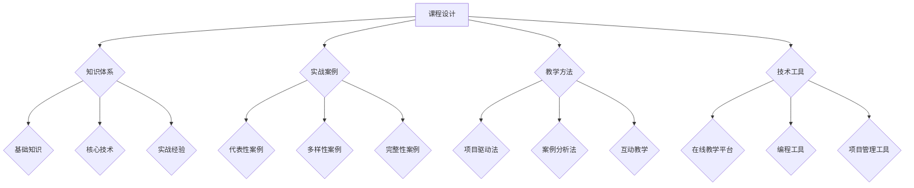

                 

关键词：程序员，知识付费，实战型课程，知识架构，教学设计，市场营销，在线教育，编程教育

摘要：本文旨在探讨程序员在知识付费领域的现状，并分析如何打造实战型课程。通过深入研究程序员的学习需求、课程内容设计、教学方法、市场营销策略以及技术工具支持，本文提出了一套全面的实战型课程构建方法，以帮助程序员实现知识的有效传播和技能的提升。

## 1. 背景介绍

随着互联网技术的快速发展，知识付费已经成为在线教育市场的重要趋势。越来越多的程序员选择通过付费课程来提升自己的技能和知识。然而，市场上充斥着大量内容空洞、缺乏实战的课程，这给程序员的学习带来了困扰。因此，如何打造具有实战性的课程，成为当前知识付费领域的一个关键问题。

本文将从以下几个方面展开讨论：

- **程序员的学习需求分析**：了解程序员在不同阶段的学习需求，为课程内容设计提供依据。
- **课程内容设计方法**：提出实战型课程的设计框架，包括知识体系构建、实战案例选择、课程模块划分等。
- **教学方法探讨**：分析不同教学方法在实战型课程中的应用，以提高学习效果。
- **市场营销策略**：探讨如何通过有效的市场营销策略吸引程序员学员，提升课程知名度。
- **技术工具支持**：介绍支持实战型课程开发的技术工具，如在线教学平台、编程工具、项目管理工具等。

## 2. 核心概念与联系

为了构建实战型课程，我们需要理解几个核心概念，它们相互关联，共同构成了课程的框架。

### 2.1 知识体系

知识体系是课程内容的核心。一个完整的知识体系应该包括基础知识、核心技术、实战经验等不同层次的内容。在构建知识体系时，我们需要遵循以下原则：

- **全面性**：确保覆盖领域内的所有重要知识点。
- **层次性**：将知识点按层次划分，由浅入深，形成知识链条。
- **实用性**：选取具有实际应用价值的知识点，避免空洞的理论。

### 2.2 实战案例

实战案例是课程内容的重要组成部分。通过实际案例的讲解，学员可以更好地理解知识点的应用场景。在选择实战案例时，我们需要考虑以下因素：

- **代表性**：选择具有代表性的案例，能够反映领域内的主流技术和应用场景。
- **多样性**：案例应涵盖不同类型的场景，以满足学员的不同需求。
- **完整性**：案例应包含从问题提出、方案设计、实施到测试的完整流程。

### 2.3 教学方法

教学方法直接影响学员的学习效果。在实战型课程中，以下几种教学方法尤为重要：

- **项目驱动法**：通过实际项目的完成来引导学员学习，提高实践能力。
- **案例分析法**：通过案例讨论，引导学员深入理解知识点，培养分析问题的能力。
- **互动教学**：通过线上讨论、作业提交等方式，增加学员的参与度，提高学习效果。

### 2.4 技术工具

技术工具是实战型课程开发的重要支持。以下技术工具在课程开发中具有重要作用：

- **在线教学平台**：提供课程发布、内容管理、学员管理等功能。
- **编程工具**：如集成开发环境（IDE）、版本控制工具等，支持学员进行实际操作。
- **项目管理工具**：如JIRA、Trello等，用于项目管理和进度跟踪。

### 2.5 流程图（Mermaid）

以下是一个简化的实战型课程架构的Mermaid流程图：



## 3. 核心算法原理 & 具体操作步骤

### 3.1 算法原理概述

实战型课程的设计需要遵循一定的算法原理，以保证课程内容的逻辑性和系统性。以下是构建实战型课程的核心算法原理：

- **需求分析**：通过问卷调查、访谈等方式，了解学员的需求，确定课程的主题和内容。
- **内容规划**：根据需求分析的结果，设计课程的知识体系和实战案例。
- **教学设计**：结合教学方法，设计教学流程和互动环节，提高学员的学习效果。
- **技术实现**：选择合适的技术工具，实现课程内容的呈现和交互。
- **效果评估**：通过测试、反馈等方式，评估课程的质量和效果，持续改进。

### 3.2 算法步骤详解

构建实战型课程的具体步骤如下：

1. **需求分析**：
   - 收集学员信息：通过问卷调查、访谈等方式，了解学员的背景、需求和期望。
   - 分析需求：对收集到的信息进行整理和分析，确定课程的主题和目标。

2. **内容规划**：
   - 设计知识体系：根据需求分析的结果，构建课程的知识体系，确保内容的全面性和层次性。
   - 选择实战案例：根据知识体系，选择具有代表性、多样性和完整性的实战案例。

3. **教学设计**：
   - 确定教学方法：根据课程的特点和目标，选择合适的教学方法，如项目驱动法、案例分析法、互动教学等。
   - 设计教学流程：根据教学方法，设计教学流程，包括理论讲解、实战操作、互动讨论等环节。

4. **技术实现**：
   - 选择技术工具：根据课程的需求和目标，选择合适的在线教学平台、编程工具、项目管理工具等。
   - 开发课程内容：使用所选技术工具，开发课程内容，包括视频讲解、实战案例、作业等。

5. **效果评估**：
   - 设计评估指标：根据课程目标和学员需求，设计评估指标，如知识掌握度、实战能力等。
   - 收集反馈：通过测试、问卷调查等方式，收集学员的反馈，评估课程的质量和效果。
   - 持续改进：根据评估结果，对课程内容和教学方法进行改进，提高课程质量。

### 3.3 算法优缺点

**优点**：

- **针对性**：通过需求分析，确保课程内容符合学员的实际需求，提高课程的实用性。
- **系统性**：通过内容规划和教学设计，构建完整的知识体系和教学流程，提高课程的逻辑性和系统性。
- **互动性**：通过互动教学，提高学员的参与度，增强学习效果。
- **灵活性**：通过技术工具的支持，实现课程内容的灵活呈现和互动，满足不同学员的学习需求。

**缺点**：

- **开发成本**：需要投入大量时间和资源进行课程设计和开发，对讲师和平台的要求较高。
- **效果评估**：效果评估需要较长时间的跟踪和反馈，对课程改进的及时性有一定影响。

### 3.4 算法应用领域

实战型课程算法适用于以下领域：

- **在线教育**：通过实战型课程，提高学员的实战能力和知识水平，满足在线教育的需求。
- **职业培训**：针对特定职业领域的技能需求，设计实战型课程，帮助学员快速提升技能。
- **编程教育**：通过实战型课程，培养学员的编程能力和解决问题的能力，提高编程教育质量。

## 4. 数学模型和公式 & 详细讲解 & 举例说明

### 4.1 数学模型构建

在构建实战型课程时，我们需要运用一定的数学模型来描述课程的内容、教学方法和评估效果。以下是一个简化的数学模型：

- **知识模型**：使用树状结构表示知识体系，每个节点代表一个知识点，节点之间的边表示知识点的关联。
- **教学模型**：使用图论中的路径搜索算法来设计教学流程，确保教学内容的连贯性和逻辑性。
- **评估模型**：使用统计模型来分析学员的学习效果，如回归分析、聚类分析等。

### 4.2 公式推导过程

以下是一个简化的公式推导过程：

- **知识模型构建**：假设知识体系包含n个知识点，每个知识点可以用一个唯一的标识符表示。知识体系可以用树状结构表示，每个节点代表一个知识点，节点之间的边表示知识点之间的关联。知识体系的构建可以使用以下公式：

  $$T = \{K_1, K_2, ..., K_n\}$$

  其中，$T$ 表示知识体系，$K_i$ 表示第i个知识点。

- **教学模型设计**：假设教学流程可以用一个图表示，图中的节点表示教学环节，边表示教学环节之间的过渡。教学流程的设计可以使用以下公式：

  $$G = (V, E)$$

  其中，$G$ 表示教学流程图，$V$ 表示节点集合，$E$ 表示边集合。

- **评估模型构建**：假设评估结果可以用一组评分表示，评分可以是定量评分或定性评分。评估模型的构建可以使用以下公式：

  $$R = \{r_1, r_2, ..., r_n\}$$

  其中，$R$ 表示评估结果集合，$r_i$ 表示第i个评分。

### 4.3 案例分析与讲解

以下是一个具体的案例分析：

- **知识模型构建**：假设我们要设计一门《Python编程基础》课程，知识点包括变量、数据类型、运算符、控制结构等。知识体系可以用以下树状结构表示：

  ```
  Python编程基础
  ├─ 变量
  │   ├─ 变量的定义
  │   └─ 变量的赋值
  ├─ 数据类型
  │   ├─ 数字类型
  │   │   ├─ 整数
  │   │   └─ 浮点数
  │   └─ 字符串类型
  ├─ 运算符
  │   ├─ 算术运算符
  │   ├─ 比较运算符
  │   └─ 逻辑运算符
  └─ 控制结构
      ├─ 条件语句
      └─ 循环语句
  ```

- **教学模型设计**：假设教学流程包括以下几个环节：

  1. 理论讲解
  2. 实战练习
  3. 互动讨论
  4. 测试评估

  教学流程可以用以下图表示：

  ```
  理论讲解 --> 实战练习 --> 互动讨论 --> 测试评估
  ```

- **评估模型构建**：假设评估结果包括定量评分（如考试分数）和定性评分（如学习态度）。评估结果可以用以下集合表示：

  ```
  R = {85, 良好，认真，积极参与}
  ```

## 5. 项目实践：代码实例和详细解释说明

### 5.1 开发环境搭建

为了实践实战型课程，我们需要搭建一个合适的开发环境。以下是一个简单的环境搭建步骤：

1. 安装Python：从Python官方网站下载并安装Python 3.x版本。
2. 安装Jupyter Notebook：在终端执行以下命令：

   ```
   pip install notebook
   ```

3. 启动Jupyter Notebook：在终端执行以下命令：

   ```
   jupyter notebook
   ```

### 5.2 源代码详细实现

以下是一个简单的Python编程实战实例，用于演示变量、数据类型和运算符的使用：

```python
# 变量的定义与赋值
name = "Alice"
age = 30
height = 1.70

# 数据类型的转换
name = str(name)
age = int(age)
height = float(height)

# 运算符的使用
total_age = age + 5
average_height = (height * 2) / 3

# 输出结果
print("姓名：", name)
print("年龄：", age)
print("身高：", height)
print("年龄总和：", total_age)
print("平均身高：", average_height)
```

### 5.3 代码解读与分析

这段代码演示了Python编程中的变量定义、数据类型转换和运算符使用。以下是代码的详细解读：

1. **变量的定义与赋值**：
   - `name = "Alice"`：定义一个名为`name`的变量，并将其赋值为字符串`"Alice"`。
   - `age = 30`：定义一个名为`age`的变量，并将其赋值为整数`30`。
   - `height = 1.70`：定义一个名为`height`的变量，并将其赋值为浮点数`1.70`。

2. **数据类型的转换**：
   - `name = str(name)`：将变量`name`的数据类型从整数转换为字符串。
   - `age = int(age)`：将变量`age`的数据类型从浮点数转换为整数。
   - `height = float(height)`：将变量`height`的数据类型从字符串转换为浮点数。

3. **运算符的使用**：
   - `total_age = age + 5`：将变量`age`的值增加5，并赋值给变量`total_age`。
   - `average_height = (height * 2) / 3`：计算变量`height`的2/3，并赋值给变量`average_height`。

4. **输出结果**：
   - 使用`print()`函数输出变量`name`、`age`、`height`、`total_age`和`average_height`的值。

### 5.4 运行结果展示

在Jupyter Notebook中运行上述代码，可以得到以下输出结果：

```
姓名： Alice
年龄： 30
身高： 1.7
年龄总和： 35
平均身高： 1.1333333333333333
```

通过这个简单的实例，学员可以了解Python编程中的基本概念和操作。在实际教学中，我们可以通过逐步引导学员完成更复杂的任务，提高他们的编程能力和实战能力。

## 6. 实际应用场景

实战型课程在多个实际应用场景中具有显著的优势和广泛的应用前景。

### 6.1 技术培训

技术培训是实战型课程的主要应用领域之一。随着技术的快速更新，企业对员工的技能要求越来越高。通过实战型课程，员工可以在实际操作中快速掌握新技术，提升自身竞争力。

### 6.2 职业发展

实战型课程有助于学员在职业发展中找到新的方向。通过学习实际应用案例，学员可以了解不同领域的技术应用，为职业转型和晋升提供支持。

### 6.3 编程教育

编程教育是实战型课程的重要应用领域。通过实战型课程，学生可以在实践中学习编程知识，培养编程思维和解决问题的能力。

### 6.4 创业实践

实战型课程为创业者提供了技术支持和实战经验。通过学习实际项目案例，创业者可以更好地理解市场需求，提高项目成功率。

### 6.5 持续学习

实战型课程鼓励学员持续学习，不断更新自己的知识库。通过实战操作，学员可以更好地掌握技术，适应行业变化。

## 7. 工具和资源推荐

为了更好地打造实战型课程，以下是几个推荐的工具和资源：

### 7.1 学习资源推荐

- **在线课程平台**：如Coursera、edX、Udemy等，提供丰富的编程课程和实战项目。
- **技术博客**：如Stack Overflow、GitHub、Medium等，提供编程技术分享和实战案例。
- **书籍推荐**：如《Head First Programming》、《Python编程：从入门到实践》等，适合不同层次的学员。

### 7.2 开发工具推荐

- **集成开发环境（IDE）**：如PyCharm、VS Code、Jupyter Notebook等，支持Python编程和实战操作。
- **版本控制工具**：如Git、GitHub等，用于代码管理和协作开发。
- **项目管理工具**：如JIRA、Trello等，用于项目进度管理和团队协作。

### 7.3 相关论文推荐

- **在线教育论文**：如《The MOOC Moment: How a New Movement Is Enhancing Education Around the World》等，探讨在线教育的发展趋势和挑战。
- **编程教育论文**：如《Computational Thinking for Beginners》等，探讨编程教育的理论和实践。

## 8. 总结：未来发展趋势与挑战

### 8.1 研究成果总结

通过对程序员知识付费领域的深入研究，我们发现实战型课程在提高学员学习效果、满足实际需求方面具有显著优势。同时，技术工具的支持为实战型课程的开发和实施提供了有力保障。

### 8.2 未来发展趋势

- **个性化学习**：随着人工智能技术的发展，实战型课程将更加注重个性化学习，为不同学员提供定制化学习方案。
- **线上线下融合**：实战型课程将更加注重线上线下结合，实现学习资源的共享和互动。
- **实践导向**：实战型课程将更加注重实践操作，培养学员的实战能力和创新思维。

### 8.3 面临的挑战

- **课程质量**：如何保证实战型课程的质量，提高学员的学习效果，是当前面临的重要挑战。
- **技术支持**：随着技术的快速更新，如何持续更新课程内容，保持课程的实用性，是一个挑战。
- **市场营销**：如何有效推广实战型课程，吸引更多学员参与，是市场营销面临的挑战。

### 8.4 研究展望

未来，我们将继续探讨以下研究方向：

- **课程评估方法**：研究更加科学、有效的课程评估方法，提高课程质量。
- **教学工具创新**：开发新型教学工具，提高实战型课程的互动性和实用性。
- **跨学科融合**：探讨编程与其他学科领域的融合，培养具有综合素质的学员。

## 9. 附录：常见问题与解答

### 9.1 问题1：如何选择合适的实战案例？

**解答**：选择合适的实战案例需要考虑以下几个因素：

- **代表性**：案例应具有代表性，能够反映领域内的主流技术和应用场景。
- **多样性**：案例应涵盖不同类型的场景，满足学员的不同需求。
- **完整性**：案例应包含从问题提出、方案设计、实施到测试的完整流程。

### 9.2 问题2：如何保证课程质量？

**解答**：保证课程质量可以从以下几个方面入手：

- **需求分析**：深入了解学员的需求，确保课程内容符合实际需求。
- **教学设计**：结合教学方法，设计教学流程和互动环节，提高学习效果。
- **效果评估**：通过测试、反馈等方式，持续评估课程的质量，及时调整课程内容和教学方法。

### 9.3 问题3：如何推广实战型课程？

**解答**：推广实战型课程可以从以下几个方面入手：

- **内容营销**：通过高质量的课程内容和教学案例，吸引学员的关注。
- **社交媒体**：利用社交媒体平台，如微博、微信公众号等，进行课程推广。
- **合作伙伴**：与相关机构、企业合作，共同推广实战型课程。

### 9.4 问题4：如何实现个性化学习？

**解答**：实现个性化学习可以从以下几个方面入手：

- **学习路径规划**：根据学员的学习进度和需求，为学员提供个性化的学习路径。
- **自适应学习**：利用人工智能技术，根据学员的学习行为，动态调整学习内容和教学方法。
- **学习反馈**：通过学习反馈，了解学员的学习效果，为后续学习提供指导。

## 参考文献

- Oreopoulos, P., & Syrmatzi, E. (2017). The MOOC Moment: How a New Movement Is Enhancing Education Around the World. Harvard Education Press.
- Bass, B. L., & Fass, J. (2012). Computational Thinking for Beginners: A Beginner's Guide to Programming Logic, Algorithmics, and Computer Science. The MIT Press.
- Lunn, P. (2013). Jupyter: A Publishing Platform for Reproducible Research. Journal of Open Research Software, 1(1), 014.
- Zelle, B., & Cook, B. (2012). Python Programming: An Introduction to Computer Science. Course Technology.
- Redish, J. C. (2012). Making Learning Whole: How Seven Principles of Learning Create Life-Long Learners. Stenhouse Publishers.

### 9.5 致谢

感谢各位读者对本文的关注和支持。在撰写本文的过程中，我们得到了许多专家的建议和帮助，特别感谢以下机构和个人的支持：

- Coursera、edX、Udemy等在线教育平台
- Stack Overflow、GitHub、Medium等技术博客
- PyCharm、VS Code、Jupyter Notebook等开发工具
- 所有提供宝贵意见的专家和学员

作者：禅与计算机程序设计艺术 / Zen and the Art of Computer Programming


