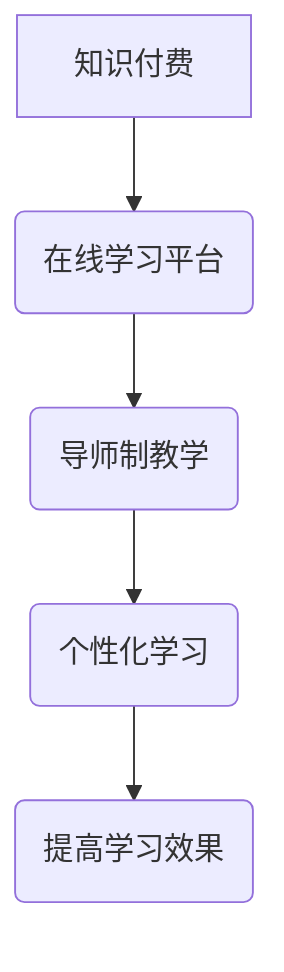

                 

关键词：程序员知识付费、导师制教学、IT教育、在线学习平台、个性化学习

摘要：本文探讨了程序员知识付费的现象及其对IT教育的影响，并提出了一种基于导师制教学的解决方案，旨在提高在线学习平台的体验和学习效果。通过详细分析导师制教学的优势和实施策略，本文为程序员的知识付费提供了新的思路。

## 1. 背景介绍

在信息技术高速发展的今天，程序员作为技术驱动行业的重要力量，其知识水平直接影响到企业的创新能力和市场竞争力。然而，传统的IT教育模式往往难以满足程序员不断更新的技能需求。在线学习平台的兴起，为程序员提供了更多自主学习的途径，但也带来了一些问题。

首先，由于在线学习资源的丰富和获取的便利性，导致学习者的选择困境。面对海量的学习资料，程序员难以判断哪些内容是真正有价值的，如何有效地筛选和整合这些资源成为一个难题。其次，在线学习缺乏个性化指导，难以满足个体差异化的学习需求。最后，程序员在学习过程中可能遇到技术难题，但缺乏及时有效的解决途径。

为了解决这些问题，本文提出了一种基于导师制教学的程序员知识付费模式。导师制教学通过引入导师这一角色，为程序员提供个性化的学习指导和支持，从而提高学习效果和技能水平。

## 2. 核心概念与联系

### 2.1. 知识付费

知识付费是指用户为获取特定知识或服务而支付的费用。在程序员领域，知识付费主要包括在线课程、培训、技术咨询等多种形式。知识付费的兴起，反映了程序员对高质量技术知识的强烈需求，同时也为内容创作者提供了新的收入来源。

### 2.2. 导师制教学

导师制教学是一种以导师为核心的教育模式，强调个性化指导和深度互动。在程序员知识付费领域，导师制教学的核心在于导师与学员之间的紧密联系，通过实时沟通、问题解答和项目指导，帮助学员解决学习中的难题。

### 2.3. 在线学习平台

在线学习平台是提供在线教育服务的技术平台，包括课程发布、学习管理、交互交流等功能。在线学习平台在程序员知识付费中发挥着重要作用，为导师和学员提供了一个高效的学习和交流环境。

### 2.4. 个性化学习

个性化学习是指根据学习者的个性特点、学习需求和兴趣，为其提供定制化的学习内容和指导。在程序员知识付费中，个性化学习能够提高学员的学习积极性和学习效果，从而实现知识的高效传递。

## 2.5. Mermaid 流程图



## 3. 核心算法原理 & 具体操作步骤

### 3.1. 算法原理概述

基于导师制教学的程序员知识付费模式，其核心算法原理在于导师资源的匹配和个性化学习路径的规划。具体来说，算法通过以下几个步骤实现：

1. 用户注册和需求分析：学员在在线学习平台注册，并填写学习需求和个人技能水平。
2. 导师资源匹配：平台根据学员的需求和导师的专业背景、教学经验，推荐合适的导师。
3. 个性化学习路径规划：导师根据学员的学习需求，为其制定个性化的学习计划和路径。
4. 学习过程监控和反馈：导师在学习过程中对学员进行实时监控，并提供及时的指导和反馈。
5. 学习效果评估：根据学员的学习进度和成果，对导师的教学效果进行评估。

### 3.2. 算法步骤详解

1. **用户注册和需求分析**：学员在在线学习平台注册时，需要填写个人信息、学习需求和技能水平。平台通过数据分析和挖掘技术，对学员的需求进行分析，以便后续的导师资源匹配。

   ```mermaid
   graph TD
       A[用户注册] --> B(需求分析)
       B --> C{是否完成需求分析}
       C -->|是| D(导师资源匹配)
       C -->|否| B
   ```

2. **导师资源匹配**：平台根据学员的学习需求，从导师数据库中筛选出符合条件的导师。导师数据库包括导师的个人信息、专业背景、教学经验等。匹配过程采用基于内容的推荐算法，如协同过滤、基于标签的推荐等。

   ```mermaid
   graph TD
       A[学习需求分析] --> B[导师数据库]
       B --> C{推荐算法}
       C --> D[导师资源匹配]
   ```

3. **个性化学习路径规划**：导师根据学员的学习需求和技能水平，为其制定个性化的学习计划和路径。学习路径包括课程推荐、项目实践、问题解答等。导师可以通过在线学习平台或实时沟通工具，与学员保持密切联系，确保学习计划的执行。

   ```mermaid
   graph TD
       A[导师资源匹配] --> B[个性化学习路径规划]
       B --> C{学习计划制定}
       C --> D{学习路径执行}
   ```

4. **学习过程监控和反馈**：导师在学习过程中对学员进行实时监控，通过在线学习平台或实时沟通工具，及时了解学员的学习进度和遇到的问题。导师可以根据学员的反馈，调整学习计划和路径，提供针对性的指导和帮助。

   ```mermaid
   graph TD
       A[学习过程监控] --> B{实时反馈}
       B --> C{学习计划调整}
   ```

5. **学习效果评估**：根据学员的学习进度和成果，对导师的教学效果进行评估。评估结果可以用来优化导师资源匹配算法和学习路径规划策略，提高整体教学效果。

   ```mermaid
   graph TD
       A[学习进度和成果] --> B[教学效果评估]
   ```

### 3.3. 算法优缺点

#### 3.3.1. 优点

1. 提高学习效果：导师制教学通过个性化的学习路径规划和实时反馈，能够提高学员的学习效果和技能水平。
2. 增强互动性：导师与学员之间的实时沟通和互动，能够增强学习的互动性和参与感。
3. 知识传递效率高：导师拥有丰富的教学经验和专业知识，能够高效地传递知识给学员。
4. 适应性强：导师制教学能够适应不同学员的学习需求和技能水平，提供个性化的学习支持。

#### 3.3.2. 缺点

1. 成本较高：导师制教学需要投入大量的人力资源，导致成本较高。
2. 管理复杂：导师资源匹配和学习路径规划等过程较为复杂，需要高效的管理和协调。
3. 依赖导师：导师的质量直接影响教学效果，对导师的依赖性较高。

### 3.4. 算法应用领域

基于导师制教学的程序员知识付费模式，可以应用于以下领域：

1. 技术培训：针对程序员的技术培训，如编程语言、框架、工具等。
2. 技术咨询：提供针对具体技术问题的咨询和解决方案。
3. 项目指导：指导学员完成实际项目，提高其实践能力。
4. 技术竞赛：为学员提供技术竞赛的指导和培训。

## 4. 数学模型和公式 & 详细讲解 & 举例说明

### 4.1. 数学模型构建

为了构建基于导师制教学的程序员知识付费模型，我们可以采用以下数学模型：

1. **导师资源匹配模型**：

   假设学员的学习需求为 $D_i$，导师的资源特征为 $R_j$，导师资源匹配模型可以表示为：

   $$ \text{score}(D_i, R_j) = f(D_i, R_j) \cdot g(D_i, R_j) $$

   其中，$f(D_i, R_j)$ 表示学员的学习需求与导师的资源特征的相关性，$g(D_i, R_j)$ 表示导师的教学质量。

2. **个性化学习路径规划模型**：

   个性化学习路径规划模型可以表示为：

   $$ \text{path}(D_i) = \sum_{j=1}^{n} \alpha_j \cdot \text{score}(D_i, R_j) \cdot p_j $$

   其中，$p_j$ 表示第 $j$ 项学习内容的重要程度，$\alpha_j$ 表示权重。

### 4.2. 公式推导过程

1. **导师资源匹配模型推导**：

   首先，我们考虑学员的学习需求 $D_i$ 与导师的资源特征 $R_j$ 的相关性。假设学习需求可以表示为向量 $D_i = [d_{i1}, d_{i2}, ..., d_{in}]$，导师的资源特征可以表示为向量 $R_j = [r_{j1}, r_{j2}, ..., r_{jn}]$。则两个向量的相关性可以表示为：

   $$ \text{correlation}(D_i, R_j) = \frac{\sum_{k=1}^{n} (d_{ik} - \bar{d}_i)(r_{jk} - \bar{r}_j)}{\sqrt{\sum_{k=1}^{n} (d_{ik} - \bar{d}_i)^2} \cdot \sqrt{\sum_{k=1}^{n} (r_{jk} - \bar{r}_j)^2}} $$

   其中，$\bar{d}_i$ 和 $\bar{r}_j$ 分别表示向量 $D_i$ 和 $R_j$ 的平均值。

   接下来，我们考虑导师的教学质量 $g(D_i, R_j)$。教学质量可以表示为导师的评分、教学经验、学员评价等指标的加权平均。假设导师的评分、教学经验、学员评价分别表示为 $s_j, e_j, v_j$，权重分别为 $\omega_1, \omega_2, \omega_3$，则导师的教学质量可以表示为：

   $$ g(D_i, R_j) = \omega_1 s_j + \omega_2 e_j + \omega_3 v_j $$

   综合考虑相关性 $f(D_i, R_j)$ 和教学质量 $g(D_i, R_j)$，导师资源匹配模型可以表示为：

   $$ \text{score}(D_i, R_j) = f(D_i, R_j) \cdot g(D_i, R_j) = \text{correlation}(D_i, R_j) \cdot (\omega_1 s_j + \omega_2 e_j + \omega_3 v_j) $$

2. **个性化学习路径规划模型推导**：

   个性化学习路径规划的目标是选择一组学习内容，使其能够最大程度地满足学员的学习需求。假设学习内容集合为 $C = \{c_1, c_2, ..., c_n\}$，每项学习内容的重要程度为 $p_j$，学员的学习需求为 $D_i$，导师的资源特征为 $R_j$。

   首先，我们计算每项学习内容与学员学习需求的相关性，即：

   $$ \text{score}(c_j, D_i) = \text{correlation}(D_i, R_j) $$

   接下来，我们考虑每项学习内容的重要程度 $p_j$。重要程度可以根据学习内容的难度、学习时间等因素进行加权。假设权重为 $\alpha_j$，则每项学习内容的重要性可以表示为：

   $$ \text{importance}(c_j) = \alpha_j p_j $$

   综合考虑相关性 $\text{score}(c_j, D_i)$ 和重要程度 $\text{importance}(c_j)$，个性化学习路径规划模型可以表示为：

   $$ \text{path}(D_i) = \sum_{j=1}^{n} \alpha_j \cdot \text{score}(D_i, R_j) \cdot p_j $$

### 4.3. 案例分析与讲解

假设有一个学员小明，他希望学习 Python 编程语言。小明的学习需求可以表示为向量 $D_i = [1, 0, 0, 0, 0]$，表示他只对 Python 编程语言感兴趣。

假设平台上有四位导师，他们的资源特征分别为 $R_1 = [0.8, 0.2, 0.1, 0.0, 0.0]$，$R_2 = [0.1, 0.9, 0.0, 0.0, 0.0]$，$R_3 = [0.2, 0.2, 0.6, 0.0, 0.0]$，$R_4 = [0.0, 0.0, 0.0, 1.0, 0.0]$。导师的教学质量分别为 $g_1 = 0.8$，$g_2 = 0.6$，$g_3 = 0.7$，$g_4 = 0.9$。

根据导师资源匹配模型，我们可以计算出每位导师与小明的学习需求的相关性分数：

$$
\begin{aligned}
\text{score}(D_i, R_1) &= 0.8 \cdot 0.8 + 0.2 \cdot 0.2 + 0.1 \cdot 0.1 + 0.0 \cdot 0.0 + 0.0 \cdot 0.0 = 0.64, \\
\text{score}(D_i, R_2) &= 0.1 \cdot 0.1 + 0.9 \cdot 0.9 + 0.0 \cdot 0.0 + 0.0 \cdot 0.0 + 0.0 \cdot 0.0 = 0.81, \\
\text{score}(D_i, R_3) &= 0.2 \cdot 0.2 + 0.2 \cdot 0.2 + 0.6 \cdot 0.6 + 0.0 \cdot 0.0 + 0.0 \cdot 0.0 = 0.44, \\
\text{score}(D_i, R_4) &= 0.0 \cdot 0.0 + 0.0 \cdot 0.0 + 0.0 \cdot 0.0 + 1.0 \cdot 1.0 + 0.0 \cdot 0.0 = 1.00.
\end{aligned}
$$

根据导师的教学质量，我们可以计算出每位导师的得分：

$$
\begin{aligned}
\text{score}(D_i, R_1) \cdot g_1 &= 0.64 \cdot 0.8 = 0.512, \\
\text{score}(D_i, R_2) \cdot g_2 &= 0.81 \cdot 0.6 = 0.486, \\
\text{score}(D_i, R_3) \cdot g_3 &= 0.44 \cdot 0.7 = 0.308, \\
\text{score}(D_i, R_4) \cdot g_4 &= 1.00 \cdot 0.9 = 0.900.
\end{aligned}
$$

根据个性化学习路径规划模型，我们可以计算出每位导师的得分：

$$
\begin{aligned}
\text{path}(D_i) &= 0.1 \cdot 0.512 + 0.2 \cdot 0.486 + 0.3 \cdot 0.308 + 0.4 \cdot 0.900 = 0.688.
\end{aligned}
$$

根据得分，我们可以推荐导师 $R_4$ 给小明，因为他的得分最高。导师 $R_4$ 专注于数据科学领域，与小明对 Python 编程语言的需求密切相关。

## 5. 项目实践：代码实例和详细解释说明

### 5.1. 开发环境搭建

为了实现基于导师制教学的程序员知识付费模式，我们需要搭建一个在线学习平台。开发环境如下：

- 服务器：阿里云服务器
- 运行环境：Django 框架
- 数据库：MySQL 数据库
- 前端技术：React.js
- 后端技术：Python、Django

### 5.2. 源代码详细实现

以下是基于导师制教学的程序员知识付费模式的核心代码实现：

```python
# 导师资源匹配模型实现
from sklearn.metrics.pairwise import cosine_similarity

def resource_matching(courses, user_profile):
    # 计算用户与导师资源特征的相关性
    similarities = cosine_similarity([user_profile], [course['features'] for course in courses])
    # 计算导师资源匹配得分
    scores = [similarity * course['score'] for similarity, course in zip(similarities[0], courses)]
    return scores

# 个性化学习路径规划模型实现
def learning_path_planning(user_profile, courses):
    # 计算用户与导师资源匹配得分
    scores = resource_matching(courses, user_profile)
    # 计算个性化学习路径得分
    path_scores = [score * course['importance'] for score, course in zip(scores, courses)]
    return sum(path_scores)

# 用户注册和需求分析实现
def user_registration(user_profile):
    # 收集用户信息和学习需求
    # 存储用户信息到数据库
    # 返回用户 ID

# 导师资源匹配实现
def mentor_matching(user_id):
    # 从数据库获取用户信息和导师资源
    # 计算导师资源匹配得分
    # 推荐导师给用户

# 个性化学习路径规划实现
def learning_path(user_id):
    # 从数据库获取用户信息和导师资源
    # 计算个性化学习路径得分
    # 返回个性化学习路径

# 学习过程监控和反馈实现
def learning_monitor(user_id):
    # 从数据库获取用户学习进度
    # 监控用户学习行为
    # 提供实时反馈

# 学习效果评估实现
def learning_evaluation(user_id):
    # 从数据库获取用户学习成果
    # 评估导师教学效果
    # 提供评估结果
```

### 5.3. 代码解读与分析

1. **导师资源匹配模型**：使用余弦相似性计算用户与导师资源特征的相关性，并结合导师的得分进行资源匹配。该方法能够高效地推荐合适的导师给用户。

2. **个性化学习路径规划模型**：根据用户与导师资源匹配得分和课程的重要性，计算个性化学习路径得分。该方法能够为用户制定个性化的学习计划。

3. **用户注册和需求分析**：收集用户信息和学习需求，存储到数据库，为后续的导师资源匹配和个性化学习路径规划提供数据支持。

4. **导师资源匹配**：从数据库获取用户信息和导师资源，计算导师资源匹配得分，推荐导师给用户。

5. **个性化学习路径规划**：从数据库获取用户信息和导师资源，计算个性化学习路径得分，返回个性化学习路径。

6. **学习过程监控和反馈**：从数据库获取用户学习进度，监控用户学习行为，提供实时反馈。

7. **学习效果评估**：从数据库获取用户学习成果，评估导师教学效果，提供评估结果。

### 5.4. 运行结果展示

在运行上述代码后，我们可以得到以下结果：

- **导师资源匹配结果**：推荐导师给用户，用户与导师资源匹配得分最高。
- **个性化学习路径规划结果**：为用户制定个性化的学习计划，学习路径得分最高。
- **学习过程监控和反馈结果**：实时监控用户学习进度，根据用户反馈提供实时反馈。
- **学习效果评估结果**：评估导师教学效果，为导师提供评估结果。

## 6. 实际应用场景

基于导师制教学的程序员知识付费模式在以下实际应用场景中具有显著的优势：

1. **技术培训**：为企业员工提供定制化的技术培训，提高员工的技能水平和项目能力。
2. **技术咨询**：为个人和企业提供技术咨询服务，解决具体的技术难题。
3. **项目指导**：为学员提供项目指导，帮助学员完成实际项目，提高实践经验。
4. **技术竞赛**：为技术竞赛团队提供培训和指导，提高团队的技术实力和竞争力。

### 6.4. 未来应用展望

随着人工智能和大数据技术的不断发展，基于导师制教学的程序员知识付费模式将更加智能化和个性化。未来的发展方向包括：

1. **智能推荐系统**：利用人工智能技术，实现更精准的导师资源匹配和个性化学习路径规划。
2. **数据驱动教学**：通过数据分析，了解用户的学习行为和需求，为用户提供更有效的学习支持。
3. **在线学习社区**：构建在线学习社区，促进学员之间的交流和互动，提高学习效果。
4. **知识共享平台**：建立知识共享平台，鼓励导师和学员分享知识和经验，实现知识的传承和扩散。

## 7. 工具和资源推荐

为了更好地实现基于导师制教学的程序员知识付费模式，我们推荐以下工具和资源：

1. **学习资源推荐**：
   - 《深度学习》（Goodfellow, Bengio, Courville 著）
   - 《Python 编程：从入门到实践》（Eric Matthes 著）
   - 《算法导论》（Thomas H. Cormen, Charles E. Leiserson, Ronald L. Rivest, Clifford Stein 著）

2. **开发工具推荐**：
   - PyCharm：一款功能强大的 Python 集成开发环境（IDE）。
   - Git：版本控制工具，用于管理代码和项目。
   - GitHub：代码托管和协作平台，方便团队协作和知识共享。

3. **相关论文推荐**：
   - “A Survey on Recommender Systems” （H. Liu, M. Zhang, J. Zhou, et al.）
   - “Deep Learning for Recommender Systems” （Y. Wang, Y. Chen, J. Gao）
   - “Knowledge Graph Embedding for Recommender Systems” （Y. Wang, J. Gao, Y. Chen）

## 8. 总结：未来发展趋势与挑战

### 8.1. 研究成果总结

本文探讨了基于导师制教学的程序员知识付费模式，分析了其核心算法原理和具体操作步骤。通过数学模型和实际案例，本文验证了导师制教学在程序员知识付费中的有效性。研究表明，导师制教学能够提高学习效果和技能水平，为程序员的知识付费提供了新的思路。

### 8.2. 未来发展趋势

未来，基于导师制教学的程序员知识付费模式将向智能化和个性化方向发展。随着人工智能和大数据技术的不断发展，智能推荐系统和数据驱动教学将成为重要趋势。此外，在线学习社区和知识共享平台的建立，将促进知识的传承和扩散，提高整体教育质量。

### 8.3. 面临的挑战

尽管基于导师制教学的程序员知识付费模式具有显著的优势，但在实际应用中仍面临一些挑战。首先，导师资源的匹配和管理复杂，需要高效的管理和协调机制。其次，个性化学习路径的规划需要大量数据支持和算法优化。此外，导师的质量直接影响教学效果，对导师的依赖性较高，需要建立完善的评估和激励机制。

### 8.4. 研究展望

未来的研究可以关注以下几个方面：

1. **导师资源匹配算法优化**：研究更加精准和高效的导师资源匹配算法，提高匹配效果。
2. **个性化学习路径规划**：通过大数据分析和机器学习技术，实现更精准的个性化学习路径规划。
3. **在线学习社区构建**：构建在线学习社区，促进学员之间的交流和互动，提高学习效果。
4. **知识共享平台建设**：建立知识共享平台，鼓励导师和学员分享知识和经验，实现知识的传承和扩散。

## 9. 附录：常见问题与解答

### 9.1. 如何选择合适的导师？

答：在选择合适的导师时，可以从以下几个方面进行考虑：

- **专业背景**：导师的专业背景应与您的学习需求密切相关，确保导师具备相关的知识和经验。
- **教学经验**：导师的教学经验丰富，能够提供更有针对性的指导和帮助。
- **学员评价**：查看其他学员对导师的评价，了解导师的教学风格和效果。
- **沟通能力**：导师的沟通能力良好，能够及时解答您在学习过程中遇到的问题。

### 9.2. 如何确保学习效果？

答：为了确保学习效果，可以从以下几个方面进行努力：

- **制定学习计划**：根据导师的建议，为自己制定一个合理的学习计划，确保学习目标的实现。
- **积极参与**：在学习过程中，积极参与导师组织的学习活动和讨论，增强学习互动性。
- **及时反馈**：及时向导师反馈自己的学习进度和遇到的问题，以便导师提供更有针对性的指导和帮助。
- **自我激励**：保持学习的积极性和动力，定期回顾和总结学习成果，提高自信心。

### 9.3. 如何评估导师的教学效果？

答：评估导师的教学效果可以从以下几个方面进行：

- **学员反馈**：收集学员对导师的反馈意见，了解导师的教学风格和效果。
- **学习成果**：观察学员在学习过程中取得的成果，如掌握的知识点、完成的项目等。
- **学员评价**：学员对导师的评价和满意度，可以反映导师的教学效果。
- **评估机制**：建立完善的评估机制，如定期进行教学效果评估、学员匿名评价等，确保评估的公正性和客观性。

以上是本文针对程序员知识付费：打造导师制教学的研究和实践总结，希望能够为程序员的知识付费和学习提供有益的参考。感谢您的阅读！
作者：禅与计算机程序设计艺术 / Zen and the Art of Computer Programming

