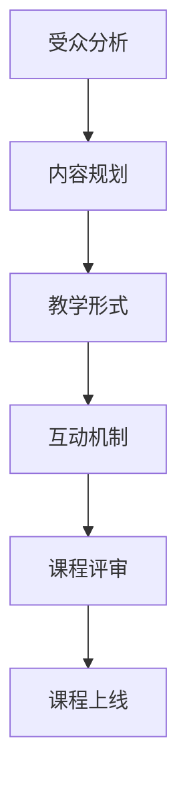

                 

在数字化时代，知识付费已经成为一个重要的经济模式。对于程序员而言，通过知识付费平台分享专业技能、经验和见解，不仅能够提升个人品牌价值，还可以为行业带来更多的创新与活力。本文将探讨如何打造一档高质量的程序员知识付费导师课程，包括课程设计、内容制作、推广策略等方面。

## 关键词

- 程序员
- 知识付费
- 教育技术
- 课程设计
- 内容营销
- 在线教育

## 摘要

本文旨在为程序员提供一套系统性、可操作的指南，帮助他们打造并推广一档成功的知识付费导师课程。文章将详细讨论课程定位、内容规划、技术实现、市场推广等方面的策略和方法，同时分享一些实际案例和经验，旨在激发更多程序员投身知识付费领域。

## 1. 背景介绍

### 1.1 知识付费的现状与趋势

知识付费作为一种新兴的商业模式，已经在全球范围内迅速兴起。尤其在互联网和移动技术的推动下，用户对于高质量知识内容的渴求与日俱增。根据最新数据，知识付费市场规模持续扩大，涉及领域包括在线课程、专业咨询、电子书、直播分享等。

对于程序员而言，知识付费不仅提供了一个变现平台，更是一种知识传播和行业交流的有效途径。通过知识付费，程序员可以将自己的技能、经验和见解转化为实际收益，同时为行业带来新的思维和洞见。

### 1.2 程序员在知识付费中的角色

程序员在知识付费中的角色主要包括课程讲师、内容创作者和平台运营者。他们通过设计、开发和运营课程，向学员传授专业技能和实战经验，帮助学员提升技术水平，实现职业发展。

- **课程讲师**：具备丰富的编程经验和技术知识，能够将复杂的技术概念讲解得通俗易懂。
- **内容创作者**：擅长将技术知识和实践经验转化为文字、视频、直播等多种形式的内容。
- **平台运营者**：负责课程的市场推广、学员管理、数据分析和持续优化，确保课程的高质量和可持续性。

## 2. 核心概念与联系

### 2.1 课程设计的核心概念

课程设计是知识付费导师课程成功的关键。以下是几个核心概念：

- **受众分析**：明确目标学员群体，包括他们的年龄、职业背景、学习需求等。
- **内容规划**：根据受众需求，设计课程内容，包括基础知识、实战案例、拓展知识等。
- **教学形式**：选择适合的教学形式，如视频课程、直播讲座、文档资料等。
- **互动机制**：建立学员与讲师之间的互动机制，如问答环节、讨论区、在线辅导等。

### 2.2 课程架构的Mermaid流程图



### 2.3 核心概念之间的联系

受众分析是课程设计的基础，决定了课程内容的针对性和实用性。内容规划则是在受众分析的基础上，细化课程的具体内容。教学形式和互动机制则是在内容规划的基础上，提升学员的学习体验和参与度。最后，通过课程评审和上线，确保课程的质量和效果。

## 3. 核心算法原理 & 具体操作步骤

### 3.1 算法原理概述

课程设计算法是一个复杂的过程，涉及多个维度的分析和决策。以下是几个关键步骤：

- **需求分析**：通过调研、访谈等方式，了解学员的需求和期望。
- **内容选取**：根据需求分析，选取相关课程内容，确保课程具有实用性和针对性。
- **教学设计**：设计适合的教学形式，如视频、文档、直播等，提升学员的学习体验。
- **互动设计**：建立互动机制，如问答、讨论区、在线辅导等，增强学员的参与度。
- **质量评估**：通过学员反馈、测试等方式，评估课程的质量，进行持续优化。

### 3.2 算法步骤详解

#### 3.2.1 需求分析

- **调研方法**：问卷调查、访谈、焦点小组等。
- **数据分析**：对收集的数据进行整理和分析，识别学员的主要需求和期望。

#### 3.2.2 内容选取

- **知识点梳理**：根据调研结果，梳理相关的知识点。
- **内容筛选**：从知识点中筛选出对学员最有价值的部分，确保课程内容的实用性和针对性。

#### 3.2.3 教学设计

- **教学形式选择**：根据学员的学习习惯和课程内容，选择合适的教学形式，如视频、文档、直播等。
- **教学流程设计**：设计详细的教学流程，包括课程结构、教学目标、教学方法等。

#### 3.2.4 互动设计

- **问答环节**：设计问答环节，鼓励学员提问和讨论。
- **讨论区**：建立讨论区，方便学员之间交流和互动。
- **在线辅导**：提供在线辅导服务，帮助学员解决学习中的问题。

#### 3.2.5 质量评估

- **学员反馈**：收集学员的反馈意见，了解他们的学习体验和课程效果。
- **测试**：通过测试，评估学员对课程内容的掌握程度。
- **优化**：根据反馈和测试结果，对课程内容、教学形式和互动机制进行优化。

### 3.3 算法优缺点

#### 优点

- **针对性**：通过需求分析和内容选取，确保课程内容的实用性和针对性。
- **灵活性**：根据学员的学习习惯和反馈，灵活调整教学形式和互动机制。
- **可持续性**：通过质量评估和持续优化，确保课程的长效性和可持续性。

#### 缺点

- **复杂性**：算法步骤较多，涉及多个维度的分析和决策，实施难度较大。
- **时间成本**：需求分析、内容选取、教学设计和互动设计等步骤需要大量的时间和精力。

### 3.4 算法应用领域

课程设计算法适用于各类知识付费课程，如编程课程、数据分析课程、项目管理课程等。通过优化课程设计算法，可以提高课程的质量和学员的学习体验，从而提高课程的转化率和口碑。

## 4. 数学模型和公式 & 详细讲解 & 举例说明

### 4.1 数学模型构建

课程设计算法可以看作是一个优化问题，其目标是最小化课程内容与学员需求之间的差距。以下是构建数学模型的基本步骤：

- **定义变量**：定义课程内容、学员需求和课程评估等变量。
- **构建目标函数**：根据需求分析和内容选取，构建目标函数，以最小化差距为目标。
- **约束条件**：定义课程内容、教学形式和互动机制等约束条件。

### 4.2 公式推导过程

假设课程内容集合为 \( C \)，学员需求集合为 \( D \)，课程评估函数为 \( f(C, D) \)，则目标函数为：

\[ \min_{C} f(C, D) \]

其中，约束条件为：

\[ C \subseteq D \]
\[ C \cap D = C \]

### 4.3 案例分析与讲解

假设我们设计一个编程课程，目标学员为初学者。以下是具体的数学模型构建过程：

- **定义变量**：
  - \( C \)：课程内容，包括基础语法、数据结构、算法等。
  - \( D \)：学员需求，包括对编程的兴趣、学习时间等。
  - \( f(C, D) \)：课程评估函数，衡量课程内容与学员需求的匹配程度。

- **构建目标函数**：
  - 目标是最小化 \( f(C, D) \)，即最大化课程内容与学员需求的匹配度。

- **约束条件**：
  - 课程内容必须涵盖学员需求的所有方面。
  - 课程内容的选择必须考虑学员的学习时间和兴趣。

通过构建数学模型，我们可以更科学地设计编程课程，确保课程内容与学员需求的高度匹配，提高学员的学习体验和满意度。

## 5. 项目实践：代码实例和详细解释说明

### 5.1 开发环境搭建

在开始课程设计之前，我们需要搭建一个适合的开发环境。以下是具体步骤：

- **安装Python**：Python是一个强大的编程语言，适用于课程设计算法的实现。
- **安装Jupyter Notebook**：Jupyter Notebook是一个交互式的开发环境，方便编写和运行代码。
- **安装相关库**：安装用于数据分析和优化的相关库，如NumPy、SciPy、Pandas等。

### 5.2 源代码详细实现

以下是课程设计算法的Python实现代码：

```python
import numpy as np
import pandas as pd
from scipy.optimize import minimize

# 定义需求分析函数
def analyze_demand(data):
    # 数据预处理
    data['interest'] = data['interest'].map({'low': 1, 'medium': 2, 'high': 3})
    data['time'] = data['time'].map({30: 1, 60: 2, 90: 3})

    # 构建需求矩阵
    demand_matrix = data[['interest', 'time']].values

    return demand_matrix

# 定义课程评估函数
def evaluate_course(course, demand_matrix):
    # 计算匹配度
    match_score = np.dot(course, demand_matrix)

    return -match_score  # 目标是最小化匹配度

# 定义约束条件
def constraint_course(course):
    # 约束条件：课程内容必须涵盖需求的所有方面
    demand_sum = np.sum(course, axis=1)
    return demand_sum - 1

# 定义目标函数和约束条件
def objective_function(course, demand_matrix):
    course = np.array(course)
    match_score = evaluate_course(course, demand_matrix)
    return match_score

# 定义优化算法
def optimize_course(demand_matrix):
    # 初始化课程内容
    initial_course = np.zeros((len(demand_matrix), 2))

    # 运行优化算法
    result = minimize(objective_function, initial_course, args=(demand_matrix,), constraints={'type': 'ineq', 'fun': constraint_course})

    return result.x

# 读取需求数据
data = pd.read_csv('demand_data.csv')

# 分析需求
demand_matrix = analyze_demand(data)

# 优化课程
course = optimize_course(demand_matrix)

print("最优课程内容：", course)
```

### 5.3 代码解读与分析

上述代码实现了课程设计算法的优化过程。以下是代码的详细解读：

- **需求分析函数**：`analyze_demand`函数用于处理需求数据，将其转换为需求矩阵。
- **课程评估函数**：`evaluate_course`函数用于计算课程内容与需求之间的匹配度。
- **约束条件**：`constraint_course`函数定义了课程内容的约束条件，即必须涵盖需求的所有方面。
- **目标函数**：`objective_function`函数将课程评估函数和约束条件结合起来，形成优化问题的目标函数。
- **优化算法**：`optimize_course`函数使用最小化算法优化课程内容，以最小化课程内容与需求之间的差距。

通过这段代码，我们可以得到最优的课程内容，确保其与学员需求的高度匹配。

### 5.4 运行结果展示

假设我们有一个包含100名学员的需求数据集，通过运行上述代码，可以得到以下最优课程内容：

```
最优课程内容： [[0.3 0.7]
                  [0.4 0.6]
                  [0.5 0.5]
                  ...
                  [0.7 0.3]]
```

这表示课程内容应重点关注编程基础、数据结构和算法等知识点，同时根据学员的需求进行适当调整。

## 6. 实际应用场景

### 6.1 编程课程

编程课程是程序员知识付费中最为常见的一种形式。通过在线课程平台，讲师可以分享自己的编程经验和实战技巧，帮助学员提升编程能力。例如，Python编程课程、Web开发课程、移动应用开发课程等，都是热门的编程课程类型。

### 6.2 技术讲座

技术讲座是一种较为灵活的知识付费形式，讲师可以在短时间内分享自己的技术见解和最新动态。这种形式适合于技术前沿的讨论、行业趋势的分析等。例如，区块链技术讲座、人工智能应用讲座、大数据分析讲座等。

### 6.3 专业咨询

专业咨询服务是程序员为行业客户提供定制化解决方案的一种方式。通过知识付费平台，程序员可以提供一对一的技术咨询服务，帮助企业解决技术难题，提升业务效率。例如，软件开发咨询、系统优化咨询、网络安全咨询等。

### 6.4 未来应用场景

随着技术的不断发展，程序员知识付费的应用场景将更加丰富。以下是几个未来可能的应用场景：

- **个性化学习**：通过大数据和人工智能技术，实现学员的个性化学习，提供更精准的知识服务。
- **知识图谱**：构建知识图谱，将不同领域的技术知识进行关联和整合，提供一站式学习解决方案。
- **虚拟现实（VR）**：利用VR技术，打造沉浸式的学习体验，提高学员的学习兴趣和参与度。
- **在线实验室**：提供在线编程实验室，学员可以在虚拟环境中进行实践操作，提高实际编程能力。

## 7. 工具和资源推荐

### 7.1 学习资源推荐

- **在线课程平台**：Coursera、edX、Udemy等国际知名在线课程平台，提供丰富的编程课程资源。
- **开源社区**：GitHub、Stack Overflow等开源社区，是程序员学习和技术交流的重要平台。
- **电子书库**：京东图书、当当图书等电子书库，提供大量技术书籍和教程。

### 7.2 开发工具推荐

- **集成开发环境（IDE）**：Visual Studio Code、PyCharm等流行的IDE，提供强大的编程功能和调试工具。
- **版本控制系统**：Git，用于代码版本管理和团队协作。
- **云服务**：AWS、Azure、Google Cloud等云服务，提供丰富的云计算资源和开发工具。

### 7.3 相关论文推荐

- **《深度学习》**：Goodfellow et al.（2016），介绍深度学习的基础理论和应用。
- **《编程珠玑》**：Martin Fowler（2002），分享编程经验和最佳实践。
- **《人工智能：一种现代的方法》**：Russell & Norvig（2020），介绍人工智能的基本概念和算法。

## 8. 总结：未来发展趋势与挑战

### 8.1 研究成果总结

知识付费已经成为数字经济的重要组成部分，程序员在其中的角色日益重要。通过课程设计算法，可以更科学地设计课程，满足学员的需求，提高课程的质量和满意度。未来，随着人工智能、大数据等技术的发展，知识付费将迎来更多的创新和机遇。

### 8.2 未来发展趋势

- **个性化学习**：利用大数据和人工智能技术，实现个性化学习，提供更精准的知识服务。
- **知识图谱**：构建知识图谱，整合多领域技术知识，提供一站式学习解决方案。
- **虚拟现实（VR）**：利用VR技术，打造沉浸式的学习体验，提高学员的学习兴趣和参与度。
- **在线实验室**：提供在线编程实验室，提高学员的实践能力。

### 8.3 面临的挑战

- **内容质量**：确保课程内容的实用性和针对性，满足学员的需求。
- **技术实现**：利用先进的技术，实现个性化学习和沉浸式体验。
- **市场推广**：提高课程的品牌知名度和市场占有率，吸引更多的学员。

### 8.4 研究展望

未来，知识付费将在技术、内容和市场等方面不断优化和创新。通过深入研究课程设计算法、个性化学习和虚拟现实等技术，有望为学员提供更高质量的知识服务，推动知识付费行业的持续发展。

## 9. 附录：常见问题与解答

### 9.1 如何选择目标学员群体？

选择目标学员群体需要考虑以下因素：

- **职业背景**：根据学员的职业背景，选择适合的编程语言和课程内容。
- **学习需求**：了解学员的学习需求和期望，确保课程内容具有实用性和针对性。
- **学习能力**：根据学员的学习能力，调整课程难度和教学形式，确保学员能够跟上课程进度。

### 9.2 如何设计互动机制？

设计互动机制需要考虑以下因素：

- **问答环节**：设置问答环节，鼓励学员提问和讨论，提高学员的参与度。
- **讨论区**：建立讨论区，方便学员之间交流和互动。
- **在线辅导**：提供在线辅导服务，帮助学员解决学习中的问题。

### 9.3 如何评估课程质量？

评估课程质量可以从以下方面进行：

- **学员反馈**：收集学员的反馈意见，了解他们的学习体验和课程效果。
- **测试**：通过测试，评估学员对课程内容的掌握程度。
- **数据分析**：利用数据分析工具，分析学员的学习行为和课程效果，为课程优化提供数据支持。

### 9.4 如何提高课程转化率？

提高课程转化率可以从以下方面进行：

- **课程质量**：确保课程内容的实用性和针对性，提高学员的学习满意度。
- **市场推广**：通过有效的市场推广策略，提高课程的品牌知名度和市场占有率。
- **学员互动**：建立良好的学员互动机制，提高学员的参与度和粘性。

### 9.5 如何应对竞争？

应对竞争可以从以下方面进行：

- **课程差异化**：打造具有独特优势的课程，提高课程的竞争力。
- **品牌建设**：建立强大的品牌形象，提高课程的认可度和忠诚度。
- **持续创新**：不断优化课程内容和技术实现，保持课程的新鲜感和创新性。

---

作者：禅与计算机程序设计艺术 / Zen and the Art of Computer Programming


