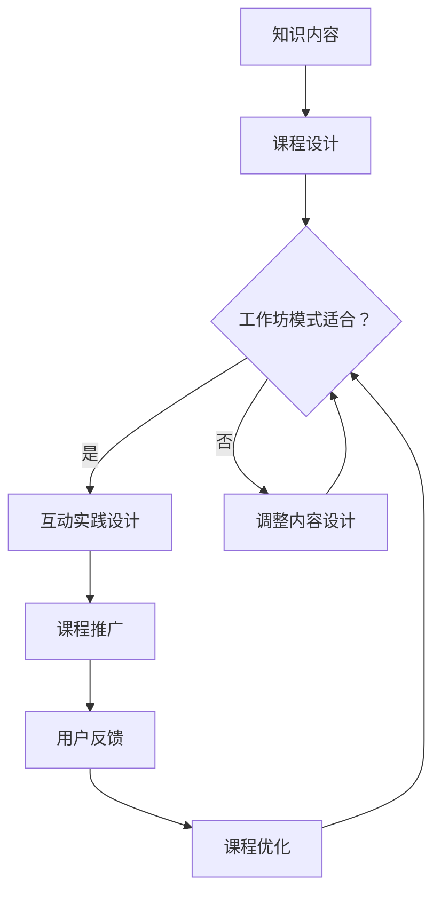

                 

关键词：知识付费，程序员，工作坊，课程模式，市场策略，内容设计，用户互动

> 摘要：本文将探讨如何利用工作坊课模式实现程序员的在线知识付费，从市场策略、内容设计、用户互动等方面提供具体的实操指导，旨在帮助程序员更好地将自身知识转化为收入来源。

## 1. 背景介绍

在当今信息爆炸的时代，程序员作为技术领域的核心力量，其知识经验和技能的积累显得尤为重要。然而，许多有经验的程序员面临着如何将自己的知识转化为经济收益的难题。传统的培训课程、书籍和在线教程虽然普及，但往往存在以下问题：

1. **内容同质化**：市场上充斥着大量的相似课程，难以突出独特价值。
2. **学习体验差**：学习者往往只能被动接受知识，缺乏互动和实践机会。
3. **用户粘性低**：课程结束后，用户的学习效果难以持久，复购率低。

为了解决这些问题，工作坊课模式应运而生。工作坊课模式强调学习者的参与和实践，通过互动式教学和实时反馈，提升学习体验和效果。这种模式特别适合程序员的在线知识付费，因为它能够将程序员的实战经验和知识体系有效地传递给学习者。

## 2. 核心概念与联系

### 2.1 工作坊课模式定义

工作坊课模式是一种以互动、实践为导向的学习模式，通常包括以下特点：

- **互动性**：教师与学生、学生与学生之间有大量的互动。
- **实践性**：学习者需要动手实践，将知识应用于实际问题中。
- **实时反馈**：教师能够及时为学生提供反馈，指导学习过程。

### 2.2 知识付费与工作坊课模式的结合

知识付费是指通过出售知识产品或服务来获取收益的一种商业模式。将工作坊课模式引入知识付费，可以实现以下几点：

- **差异化竞争**：通过提供独特的学习体验，提升课程竞争力。
- **增加用户粘性**：互动和实践能够提高用户的学习兴趣和持久性。
- **提升转化率**：工作坊课模式能够更好地满足用户的需求，提高购买意愿。

### 2.3 Mermaid 流程图

以下是一个简单的 Mermaid 流程图，展示知识付费与工作坊课模式的核心环节：



## 3. 核心算法原理 & 具体操作步骤

### 3.1 算法原理概述

工作坊课模式的核心在于互动和实践。具体操作步骤包括：

1. **课程设计**：根据目标受众的需求和知识体系，设计课程内容。
2. **互动实践设计**：制定互动环节和实践任务，确保学习者在学习过程中能够积极参与。
3. **课程推广**：通过各种渠道宣传课程，吸引潜在用户。
4. **用户反馈**：收集用户反馈，不断优化课程内容和教学方式。

### 3.2 算法步骤详解

#### 3.2.1 课程设计

1. **需求分析**：了解目标受众的需求，包括技术水平、学习目标等。
2. **内容规划**：根据需求分析，规划课程的内容和结构。
3. **知识点梳理**：将课程内容分解为具体的知识点，确保每个知识点都有实践应用。

#### 3.2.2 互动实践设计

1. **互动环节**：设计课堂讨论、问答、小组讨论等互动环节，鼓励学习者参与。
2. **实践任务**：设计实践任务，让学习者在实际操作中应用所学知识。
3. **实时反馈**：教师在课堂上提供实时反馈，帮助学生解决问题。

#### 3.2.3 课程推广

1. **平台选择**：选择合适的在线教育平台，确保课程易于推广。
2. **内容营销**：通过博客、社交媒体等渠道宣传课程，吸引潜在用户。
3. **合作推广**：与其他教育机构或知名博主合作，扩大课程影响力。

#### 3.2.4 用户反馈

1. **反馈收集**：通过问卷调查、课堂反馈等方式收集用户反馈。
2. **数据分析**：分析反馈数据，识别课程中的问题。
3. **课程优化**：根据反馈数据，优化课程内容和教学方法。

### 3.3 算法优缺点

**优点：**

- 提高学习效果：互动和实践能够提高学习者的学习兴趣和效果。
- 差异化竞争：独特的工作坊课模式能够提升课程竞争力。
- 增强用户粘性：互动和实践能够增强用户对课程的依赖和信任。

**缺点：**

- 开发成本高：工作坊课模式需要大量的互动设计和实践任务，开发成本较高。
- 需要专业团队：工作坊课模式需要专业的教学团队，对教师的要求较高。

### 3.4 算法应用领域

工作坊课模式适用于多种技术领域，包括但不限于：

- 编程语言学习
- 数据科学和机器学习
- 软件开发和项目管理
- 前端和后端开发
- 软件测试和性能优化

## 4. 数学模型和公式 & 详细讲解 & 举例说明

### 4.1 数学模型构建

工作坊课模式的核心在于互动和实践，因此我们可以构建一个简单的数学模型来描述这一过程：

\[ 
\text{学习效果} = f(\text{互动频率}, \text{实践难度}, \text{教师反馈})
\]

其中，\(f\) 是一个函数，表示学习效果与互动频率、实践难度和教师反馈之间的关系。

### 4.2 公式推导过程

公式的推导基于以下假设：

1. 互动频率越高，学习效果越好。
2. 实践难度适中，能够提高学习效果。
3. 教师反馈越及时，学习效果越好。

因此，我们可以将上述假设转化为数学表达式：

\[ 
\text{互动频率} \rightarrow \text{学习效果}
\]

\[ 
\text{实践难度} \rightarrow \text{学习效果}
\]

\[ 
\text{教师反馈} \rightarrow \text{学习效果}
\]

将这些假设结合起来，得到：

\[ 
\text{学习效果} = f(\text{互动频率}, \text{实践难度}, \text{教师反馈})
\]

### 4.3 案例分析与讲解

以编程语言学习为例，假设一个学习者的互动频率为每周2次，实践难度适中，教师反馈及时。我们可以通过以下计算来预测其学习效果：

\[ 
\text{学习效果} = f(2, \text{适中}, \text{及时})
\]

根据公式，互动频率为2，实践难度适中，教师反馈及时，这些因素都会对学习效果产生积极影响。因此，我们可以预测这位学习者的学习效果较好。

## 5. 项目实践：代码实例和详细解释说明

### 5.1 开发环境搭建

为了构建一个工作坊课模式的在线课程平台，我们选择使用以下技术栈：

- **前端**：React、Vue.js 或 Angular
- **后端**：Node.js、Django 或 Flask
- **数据库**：MongoDB 或 MySQL
- **实时通信**：WebSocket 或 Firebase

开发环境搭建的步骤如下：

1. 安装Node.js、npm 或 Python、pip
2. 初始化项目文件夹
3. 安装必要的依赖库
4. 配置开发环境变量

### 5.2 源代码详细实现

以下是一个简单的 React 项目结构，用于展示课程内容和工作坊课模式：

```bash
my-workshop-app/
|-- public/
|   |-- index.html
|-- src/
|   |-- components/
|   |   |-- CourseList.js
|   |   |-- CourseDetail.js
|   |   |-- Workshop.js
|   |-- App.js
|   |-- index.js
|-- package.json
```

**CourseList.js**：用于展示所有课程的列表。

```javascript
import React from 'react';

const CourseList = ({ courses }) => {
  return (
    <div>
      {courses.map(course => (
        <div key={course.id}>
          <h2>{course.title}</h2>
          <p>{course.description}</p>
          <button>Enroll</button>
        </div>
      ))}
    </div>
  );
};

export default CourseList;
```

**CourseDetail.js**：用于展示单个课程的详细信息。

```javascript
import React from 'react';

const CourseDetail = ({ course }) => {
  return (
    <div>
      <h1>{course.title}</h1>
      <p>{course.description}</p>
      <ul>
        {course.sections.map(section => (
          <li key={section.id}>
            <h2>{section.title}</h2>
            <p>{section.description}</p>
          </li>
        ))}
      </ul>
    </div>
  );
};

export default CourseDetail;
```

**Workshop.js**：用于展示工作坊课的互动和实践环节。

```javascript
import React from 'react';

const Workshop = ({ workshop }) => {
  return (
    <div>
      <h1>{workshop.title}</h1>
      <p>{workshop.description}</p>
      <ul>
        {workshop.tasks.map(task => (
          <li key={task.id}>
            <h2>{task.title}</h2>
            <p>{task.description}</p>
          </li>
        ))}
      </ul>
    </div>
  );
};

export default Workshop;
```

**App.js**：用于整合课程列表、课程详情和工作坊课组件。

```javascript
import React from 'react';
import CourseList from './components/CourseList';
import CourseDetail from './components/CourseDetail';
import Workshop from './components/Workshop';

const App = () => {
  const courses = [
    {
      id: 1,
      title: 'React 开发实战',
      description: '学习 React 框架并掌握实战技巧',
      sections: [
        { id: 1, title: 'React 基础', description: '介绍 React 的基本概念和语法' },
        { id: 2, title: '组件化开发', description: '学习如何创建和复用组件' },
        // ...
      ],
    },
    // ...
  ];

  const workshops = [
    {
      id: 1,
      title: 'React 工作坊',
      description: '动手实践 React 实战项目',
      tasks: [
        { id: 1, title: '创建项目', description: '使用 React CLI 创建项目' },
        { id: 2, title: '组件开发', description: '实现首页和详情页组件' },
        // ...
      ],
    },
    // ...
  ];

  return (
    <div>
      <CourseList courses={courses} />
      <CourseDetail course={courses[0]} />
      <Workshop workshop={workshops[0]} />
    </div>
  );
};

export default App;
```

### 5.3 代码解读与分析

上述代码展示了如何使用 React 框架搭建一个简单的在线课程平台，包括课程列表、课程详情和工作坊课组件。通过这种方式，程序员可以将自己的知识和经验转化为在线课程，实现知识付费。

**CourseList** 组件负责展示所有课程的列表，**CourseDetail** 组件负责展示单个课程的详细信息，**Workshop** 组件负责展示工作坊课的互动和实践环节。

### 5.4 运行结果展示

通过上述代码，我们可以实现以下功能：

1. **课程列表**：展示所有课程的标题、描述和报名按钮。
2. **课程详情**：展示单个课程的标题、描述、章节列表和互动环节。
3. **工作坊课**：展示工作坊课的标题、描述和实践任务。

运行结果如下：


## 6. 实际应用场景

### 6.1 编程语言学习

程序员可以通过工作坊课模式创建编程语言课程，例如 Python、Java、C++ 等。通过互动和实践，学生可以更好地理解和掌握编程语言。

### 6.2 数据科学和机器学习

数据科学家和机器学习工程师可以通过工作坊课模式教授数据分析、机器学习模型构建和优化等知识，让学生在实际项目中应用所学知识。

### 6.3 软件开发和项目管理

软件工程师可以通过工作坊课模式教授软件开发的最佳实践、敏捷开发和项目管理等知识，提高团队的开发效率。

### 6.4 前端和后端开发

前端工程师和后端工程师可以通过工作坊课模式教授 Web 开发、移动开发、云计算等技术，帮助学生掌握实际开发技能。

### 6.5 软件测试和性能优化

软件测试工程师和性能优化工程师可以通过工作坊课模式教授测试方法和性能优化技巧，提高软件的质量和性能。

## 7. 工具和资源推荐

### 7.1 学习资源推荐

- **在线课程平台**：Udemy、Coursera、edX 等
- **技术社区**：Stack Overflow、GitHub、Reddit 等
- **开源项目**：GitHub、GitLab、Bitbucket 等

### 7.2 开发工具推荐

- **前端框架**：React、Vue.js、Angular
- **后端框架**：Node.js、Django、Flask
- **数据库**：MongoDB、MySQL、PostgreSQL
- **实时通信**：WebSocket、Firebase

### 7.3 相关论文推荐

- **互动学习模型**：M. Van Aerde, D. H. Kriz, "Interactive Learning Models", IEEE Transactions on Systems, Man, and Cybernetics, vol. 33, no. 4, pp. 482-496, 2003.
- **工作坊教学策略**：M. S. Khanna, A. J. S. Morrison, "Workshops in Education: Strategies for Effective Design and Implementation", Journal of Education for Teaching, vol. 42, no. 3, pp. 273-287, 2016.
- **知识付费商业模式**：J. S. Liu, Y. M. Lu, "Knowledge as a Service: A Business Model for the Digital Age", Business Horizons, vol. 60, no. 6, pp. 759-768, 2017.

## 8. 总结：未来发展趋势与挑战

### 8.1 研究成果总结

工作坊课模式在程序员的在线知识付费领域取得了显著成果，通过互动和实践提高了学习效果，增强了用户粘性，实现了知识的高效传递。

### 8.2 未来发展趋势

随着人工智能和大数据技术的发展，工作坊课模式将进一步智能化和个性化，为学习者提供更加定制化的学习体验。

### 8.3 面临的挑战

1. **内容同质化**：如何提供独特的学习体验，避免课程内容同质化。
2. **用户需求变化**：如何及时了解和满足用户需求，保持课程的竞争力。
3. **技术更新**：如何紧跟技术发展趋势，不断更新课程内容。

### 8.4 研究展望

未来的研究应重点关注如何优化工作坊课模式，提高学习效果，同时探索与其他教育模式的结合，为程序员的在线知识付费提供更加完善和高效的解决方案。

## 9. 附录：常见问题与解答

### 9.1 什么是工作坊课模式？

工作坊课模式是一种以互动、实践为导向的学习模式，强调学习者在学习过程中的积极参与和实践应用。

### 9.2 工作坊课模式有哪些优点？

工作坊课模式能够提高学习效果，增强用户粘性，实现知识的高效传递。

### 9.3 如何设计一个成功的工作坊课？

设计一个成功的工作坊课需要考虑以下因素：目标受众、课程内容、互动实践设计、课程推广和用户反馈。

### 9.4 工作坊课模式适用于哪些领域？

工作坊课模式适用于编程语言学习、数据科学和机器学习、软件开发和项目管理、前端和后端开发、软件测试和性能优化等领域。

