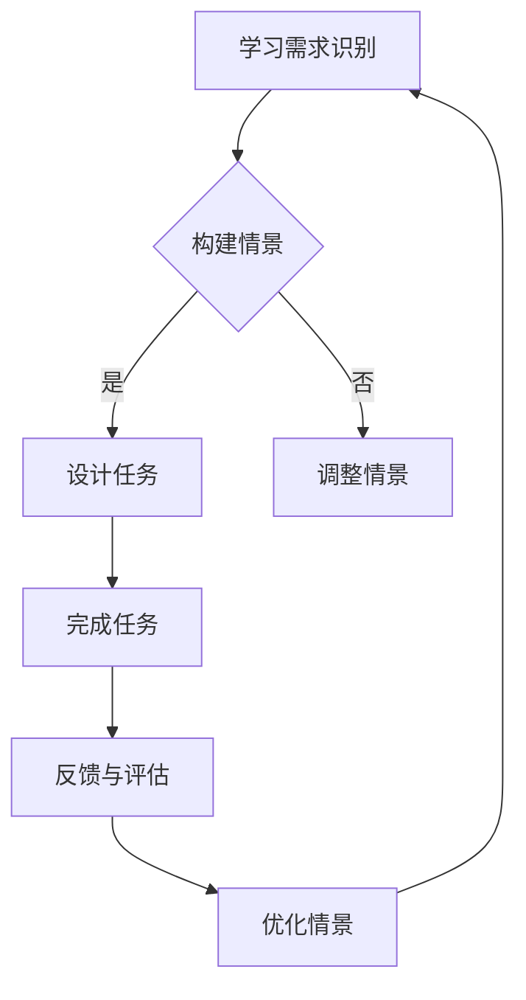

                 

关键词：程序员知识付费、情景式教学、在线教育、学习体验、知识传播

> 摘要：本文探讨了程序员知识付费的现状及其面临的挑战，提出了情景式教学作为提升程序员学习体验的有效方法。通过分析情景式教学的优势和实施步骤，本文旨在为程序员提供一个更高效、更具吸引力的学习途径，推动知识付费领域的持续发展。

## 1. 背景介绍

在信息技术飞速发展的时代，编程技能成为个人职业发展的重要资产。然而，程序员的知识获取与技能提升面临诸多难题。传统学习方式如教科书、在线课程等，虽然在某种程度上解决了知识传播的问题，但在实际应用中仍存在诸多不足。首先，程序员的学习需求多样，需要针对不同领域和层次的知识点进行学习。其次，学习过程往往缺乏实际操作的机会，导致知识无法得到有效应用。此外，学习资源分散，难以形成系统化的学习路径。

知识付费作为一种新兴的学习模式，为程序员提供了更多个性化的学习资源和专业的指导。然而，知识付费领域同样面临诸多挑战。首先，内容质量参差不齐，难以保证学习效果。其次，学习成本较高，使得部分程序员望而却步。此外，付费知识的学习过程缺乏互动和反馈，难以满足程序员的实际需求。

在这种背景下，情景式教学作为一种创新的教学方法，逐渐受到关注。情景式教学通过构建真实的任务场景，使学习者在解决问题过程中掌握知识和技能，能够有效提升学习效果和兴趣。本文将深入探讨情景式教学在程序员知识付费中的应用，为程序员提供一种更加高效的学习方式。

## 2. 核心概念与联系

### 2.1 情景式教学的概念

情景式教学，又称情境教学或情境化学习，是指通过构建与学习者日常生活或工作实际相关的情境，使学习者在解决问题和完成任务的过程中主动探索、发现和掌握知识和技能的教学方法。情景式教学强调学习与实践的紧密结合，旨在提升学习者的实际操作能力和问题解决能力。

### 2.2 程序员知识付费与情景式教学的关系

程序员知识付费是指通过付费方式获取编程知识和技能的学习资源，包括在线课程、直播讲座、技术文档、实战项目等。情景式教学与程序员知识付费之间存在密切的关系。首先，情景式教学为程序员提供了更加真实、具体的任务场景，有助于提升学习者的实战能力和学习兴趣。其次，情景式教学能够有效解决知识付费领域内容质量参差不齐的问题，提高学习效果。最后，情景式教学能够为付费用户提供更多的互动和反馈机会，提升学习体验。

### 2.3 情景式教学的 Mermaid 流程图

下面是一个简化的情景式教学流程图，展示了情景式教学的主要环节和流程。



### 2.4 情景式教学的优势

1. **提高学习兴趣**：情景式教学通过构建与学习者实际工作相关的任务场景，使学习者在解决问题的过程中产生兴趣，提高学习动力。
2. **增强实战能力**：情景式教学强调学习与实践的结合，使学习者在完成任务的过程中积累实际操作经验，提升实战能力。
3. **促进知识迁移**：情景式教学通过模拟真实工作场景，帮助学习者将所学知识应用到实际工作中，提高知识迁移能力。
4. **提高学习效果**：情景式教学注重学习者在解决问题过程中的主动参与，有助于提高学习效果。
5. **促进互动与反馈**：情景式教学鼓励学习者之间的互动和反馈，有助于发现和解决学习中的问题。

## 3. 核心算法原理 & 具体操作步骤

### 3.1 算法原理概述

情景式教学的核心在于构建与学习者实际工作相关的任务场景，使学习者在解决问题和完成任务的过程中掌握知识和技能。这一过程可以分为以下几个步骤：

1. **学习需求识别**：通过调研、访谈等方式了解学习者的实际需求，明确学习目标和内容。
2. **构建情景**：根据学习需求，设计一个或多个与学习者实际工作场景相关的任务场景。
3. **设计任务**：在任务场景中设计一系列具体、可操作的任务，使学习者在完成任务的过程中逐步掌握知识和技能。
4. **完成任务**：学习者根据任务要求，在任务场景中实际操作，完成各项任务。
5. **反馈与评估**：对学习者的任务完成情况进行评估，收集反馈意见，发现问题和不足，为后续学习提供指导。
6. **优化情景**：根据评估结果和反馈意见，对任务场景和任务进行优化和调整，提高学习效果。

### 3.2 算法步骤详解

1. **学习需求识别**

   学习需求识别是情景式教学的第一步，也是至关重要的一步。通过调研、访谈等方式了解学习者的实际需求，有助于设计出符合学习者需求的教学内容和任务场景。具体步骤如下：

   - **调研**：通过问卷调查、在线调研等方式收集学习者的基本信息和学习需求。
   - **访谈**：通过一对一访谈、小组讨论等方式深入了解学习者的学习目标、兴趣点和难点。
   - **需求分析**：对收集到的数据进行整理和分析，明确学习者的主要需求和关注点。

2. **构建情景**

   构建情景是情景式教学的核心，任务场景的设计需要考虑学习者的实际工作场景和需求。具体步骤如下：

   - **确定主题**：根据学习需求，确定情景式教学的主题，如软件开发、系统运维、数据挖掘等。
   - **设计任务场景**：根据主题，设计一个或多个与实际工作场景相关的任务场景，确保任务场景具有真实性和挑战性。
   - **任务分解**：将任务场景分解为一系列具体、可操作的任务，确保学习者能够逐步掌握知识和技能。

3. **设计任务**

   在任务场景中设计任务，是情景式教学的关键环节。任务的设计需要结合学习目标和学习者的实际需求，确保任务具有可行性和挑战性。具体步骤如下：

   - **明确任务目标**：根据学习目标，明确每个任务的目标和要求，确保任务具有明确的导向性。
   - **设计任务流程**：根据任务目标，设计任务的具体流程和步骤，确保任务具有可行性。
   - **设置任务难度**：根据学习者的实际能力，设置任务的难度，确保任务具有适当的挑战性。

4. **完成任务**

   学习者在完成任务的过程中，需要按照任务流程进行实际操作，逐步掌握知识和技能。具体步骤如下：

   - **任务分解**：将任务分解为多个子任务，确保学习者能够逐步完成。
   - **任务执行**：按照任务流程进行操作，完成任务。
   - **问题解决**：在任务执行过程中，遇到问题时，通过查阅资料、请教他人等方式解决。

5. **反馈与评估**

   反馈与评估是情景式教学的重要环节，通过评估学习者的任务完成情况，发现问题和不足，为后续学习提供指导。具体步骤如下：

   - **任务评估**：对学习者的任务完成情况进行评估，包括任务质量、任务完成时间等。
   - **反馈收集**：收集学习者的反馈意见，包括学习感受、学习难点等。
   - **评估分析**：对任务评估和反馈意见进行分析，发现问题和不足，为后续学习提供指导。

6. **优化情景**

   根据评估结果和反馈意见，对任务场景和任务进行优化和调整，提高学习效果。具体步骤如下：

   - **情景优化**：根据评估结果和反馈意见，对任务场景进行优化，提高情景的真实性和挑战性。
   - **任务调整**：根据评估结果和反馈意见，对任务进行调整，提高任务的可行性和挑战性。
   - **迭代改进**：通过不断优化和调整，提高情景式教学的效果。

### 3.3 算法优缺点

**优点**：

1. **提高学习兴趣**：情景式教学通过构建真实的任务场景，使学习者在解决问题的过程中产生兴趣，提高学习动力。
2. **增强实战能力**：情景式教学强调学习与实践的结合，使学习者在完成任务的过程中积累实际操作经验，提升实战能力。
3. **促进知识迁移**：情景式教学通过模拟真实工作场景，帮助学习者将所学知识应用到实际工作中，提高知识迁移能力。
4. **提高学习效果**：情景式教学注重学习者在解决问题过程中的主动参与，有助于提高学习效果。

**缺点**：

1. **设计难度大**：情景式教学需要构建真实的任务场景，设计难度较大，对教学设计者的要求较高。
2. **实施成本高**：情景式教学需要投入较多的时间和精力进行任务设计、情景构建等，实施成本较高。
3. **学习进度不一**：由于情景式教学强调个性化学习，学习者的进度可能存在较大差异，需要针对不同学习者进行个性化指导。

### 3.4 算法应用领域

情景式教学在程序员知识付费领域具有广泛的应用前景。以下是一些典型的应用场景：

1. **在线编程课程**：通过构建真实的编程任务场景，使学习者能够实际编写代码，提升编程技能。
2. **实战项目培训**：通过设计实际项目，使学习者在完成项目的过程中掌握项目开发所需的知识和技能。
3. **技能提升课程**：针对特定技能（如算法、数据结构、数据库等），设计相关任务场景，帮助学习者提升实战能力。
4. **职业发展培训**：结合职业发展需求，设计具有针对性的任务场景，帮助学习者提升职业素养和技能。

## 4. 数学模型和公式 & 详细讲解 & 举例说明

### 4.1 数学模型构建

情景式教学的效果可以通过学习者的学习效果来评估。构建一个简单的数学模型，可以量化学习效果。我们假设学习效果与任务难度、学习时间和学习者兴趣有关。

设 \( E \) 为学习效果，\( D \) 为任务难度，\( T \) 为学习时间，\( I \) 为学习者兴趣，则有如下数学模型：

\[ E = f(D, T, I) \]

其中，\( f \) 为一个函数，表示学习效果与任务难度、学习时间和学习者兴趣之间的关系。

### 4.2 公式推导过程

1. **任务难度对学习效果的影响**

   任务难度对学习效果有显著影响。假设任务难度越大，学习效果越好，则可以定义：

   \[ D = k \cdot R \]

   其中，\( k \) 为常数，\( R \) 为任务难度。

   由上述公式，我们可以推导出：

   \[ E = f(D, T, I) = f(k \cdot R, T, I) \]

   因为 \( R \) 与 \( E \) 成正比，所以可以简化为：

   \[ E \propto R \]

2. **学习时间对学习效果的影响**

   学习时间越长，学习效果越好。设学习效果与学习时间的平方成正比，则有：

   \[ T = m \cdot S^2 \]

   其中，\( m \) 为常数，\( S \) 为学习时间。

   由上述公式，我们可以推导出：

   \[ E = f(D, T, I) = f(D, m \cdot S^2, I) \]

   因为 \( S^2 \) 与 \( E \) 成正比，所以可以简化为：

   \[ E \propto S^2 \]

3. **学习者兴趣对学习效果的影响**

   学习者兴趣对学习效果有显著影响。假设学习者兴趣与学习效果成正比，则有：

   \[ I = p \cdot E \]

   其中，\( p \) 为常数。

   由上述公式，我们可以推导出：

   \[ E = f(D, T, I) = f(D, T, p \cdot E) \]

   因为 \( E \) 与 \( I \) 成正比，所以可以简化为：

   \[ E \propto I \]

### 4.3 案例分析与讲解

以一个在线编程课程为例，分析情景式教学的效果。

1. **任务难度 \( D \) 的设定**

   任务难度设置为 \( D = 10 \)，表示任务难度较大。

2. **学习时间 \( T \) 的设定**

   假设学习时间为 \( T = 20 \) 小时。

3. **学习者兴趣 \( I \) 的设定**

   假设学习者兴趣为 \( I = 8 \)，表示学习者对课程内容感兴趣。

根据上述设定，我们可以计算出学习效果 \( E \)：

\[ E = f(D, T, I) = f(10, 20, 8) \]

根据数学模型，我们可以得到：

\[ E \propto R \cdot S^2 \cdot I \]

代入具体数值：

\[ E = 10 \cdot 20^2 \cdot 8 = 3200 \]

因此，学习效果 \( E \) 为 3200。

通过上述案例分析，我们可以看到，情景式教学在任务难度、学习时间和学习者兴趣的合理设定下，可以显著提高学习效果。这表明，情景式教学是一种有效的教学方法，值得在程序员知识付费领域推广应用。

## 5. 项目实践：代码实例和详细解释说明

### 5.1 开发环境搭建

为了实践情景式教学，我们需要搭建一个在线编程课程平台。以下是开发环境搭建的步骤：

1. **安装Python环境**

   安装Python 3.8及以上版本，并配置好pip工具。

2. **安装Django框架**

   使用pip安装Django框架：

   ```bash
   pip install django
   ```

3. **创建Django项目**

   创建一个新的Django项目，命名为“knowledge_payment”：

   ```bash
   django-admin startproject knowledge_payment
   ```

4. **创建Django应用**

   在项目目录下创建一个新的应用，命名为“course”：

   ```bash
   python manage.py startapp course
   ```

5. **配置数据库**

   修改项目目录下的`settings.py`文件，配置数据库：

   ```python
   DATABASES = {
       'default': {
           'ENGINE': 'django.db.backends.sqlite3',
           'NAME': 'knowledge_payment.db',
       }
   }
   ```

6. **启动Django服务**

   在项目目录下运行以下命令启动Django服务：

   ```bash
   python manage.py runserver
   ```

### 5.2 源代码详细实现

在“course”应用中，我们需要实现以下功能：

1. **课程管理**：包括课程创建、课程列表、课程详情等功能。
2. **用户管理**：包括用户注册、用户登录、用户信息管理等功能。
3. **任务管理**：包括任务创建、任务列表、任务详情等功能。
4. **学习记录**：包括学习进度记录、学习效果评估等功能。

以下是关键代码的实现：

1. **课程管理**

   在`course/models.py`文件中，定义课程模型：

   ```python
   from django.db import models

   class Course(models.Model):
       title = models.CharField(max_length=100)
       description = models.TextField()
       difficulty = models.IntegerField()
       created_at = models.DateTimeField(auto_now_add=True)

       def __str__(self):
           return self.title
   ```

   在`course/views.py`文件中，实现课程列表和课程详情视图：

   ```python
   from django.shortcuts import render
   from .models import Course

   def course_list(request):
       courses = Course.objects.all()
       return render(request, 'course/course_list.html', {'courses': courses})

   def course_detail(request, pk):
       course = Course.objects.get(pk=pk)
       return render(request, 'course/course_detail.html', {'course': course})
   ```

2. **用户管理**

   在`course/models.py`文件中，定义用户模型：

   ```python
   from django.contrib.auth.models import AbstractUser

   class User(AbstractUser):
       name = models.CharField(max_length=100)
   ```

   在`course/views.py`文件中，实现用户注册、用户登录和用户信息管理视图：

   ```python
   from django.contrib.auth import authenticate, login
   from django.shortcuts import redirect, render

   def user_register(request):
       if request.method == 'POST':
           name = request.POST['name']
           username = request.POST['username']
           password = request.POST['password']
           user = User.objects.create_user(username=username, password=password, name=name)
           user.save()
           return redirect('login')
       return render(request, 'course/user_register.html')

   def user_login(request):
       if request.method == 'POST':
           username = request.POST['username']
           password = request.POST['password']
           user = authenticate(username=username, password=password)
           if user is not None:
               login(request, user)
               return redirect('course_list')
           else:
               return redirect('login')
       return render(request, 'course/user_login.html')

   def user_info(request):
       return render(request, 'course/user_info.html', {'user': request.user})
   ```

3. **任务管理**

   在`course/models.py`文件中，定义任务模型：

   ```python
   class Task(models.Model):
       course = models.ForeignKey(Course, on_delete=models.CASCADE)
       title = models.CharField(max_length=100)
       description = models.TextField()
       created_at = models.DateTimeField(auto_now_add=True)

       def __str__(self):
           return self.title
   ```

   在`course/views.py`文件中，实现任务列表和任务详情视图：

   ```python
   def task_list(request, pk):
       course = Course.objects.get(pk=pk)
       tasks = Task.objects.filter(course=course)
       return render(request, 'course/task_list.html', {'tasks': tasks, 'course': course})

   def task_detail(request, pk):
       task = Task.objects.get(pk=pk)
       return render(request, 'course/task_detail.html', {'task': task})
   ```

4. **学习记录**

   在`course/models.py`文件中，定义学习记录模型：

   ```python
   class LearningRecord(models.Model):
       user = models.ForeignKey(User, on_delete=models.CASCADE)
       task = models.ForeignKey(Task, on_delete=models.CASCADE)
       finished_at = models.DateTimeField(null=True, blank=True)
       score = models.IntegerField(null=True, blank=True)

       def __str__(self):
           return f'{self.user} - {self.task}'
   ```

   在`course/views.py`文件中，实现学习记录添加视图：

   ```python
   def add_learning_record(request, task_pk):
       if request.method == 'POST':
           user = request.user
           task = Task.objects.get(pk=task_pk)
           score = int(request.POST['score'])
           learning_record = LearningRecord(user=user, task=task, score=score)
           learning_record.save()
           return redirect('task_detail', pk=task_pk)
       return render(request, 'course/add_learning_record.html', {'task': Task.objects.get(pk=task_pk)})
   ```

### 5.3 代码解读与分析

上述代码实现了情景式教学中的课程管理、用户管理、任务管理和学习记录等功能。以下是关键代码的解读与分析：

1. **课程管理**

   课程管理包括课程创建、课程列表和课程详情功能。在`course/models.py`文件中，我们定义了`Course`模型，包含了课程标题、课程描述、课程难度和创建时间等字段。在`course/views.py`文件中，我们实现了课程列表和课程详情视图，通过Django模板系统渲染页面。

2. **用户管理**

   用户管理包括用户注册、用户登录和用户信息管理功能。在`course/models.py`文件中，我们继承了`AbstractUser`模型，添加了用户姓名字段。在`course/views.py`文件中，我们实现了用户注册、用户登录和用户信息管理视图，分别处理用户的注册、登录和信息展示。

3. **任务管理**

   任务管理包括任务创建、任务列表和任务详情功能。在`course/models.py`文件中，我们定义了`Task`模型，包含了任务标题、任务描述和创建时间等字段。在`course/views.py`文件中，我们实现了任务列表和任务详情视图，分别展示任务列表和任务详情。

4. **学习记录**

   学习记录包括学习进度记录和学习效果评估功能。在`course/models.py`文件中，我们定义了`LearningRecord`模型，包含了用户、任务、完成时间和分数等字段。在`course/views.py`文件中，我们实现了学习记录添加视图，用于记录用户的学习进度和评估结果。

### 5.4 运行结果展示

在开发环境搭建完成后，我们可以在浏览器中访问Django服务，查看运行结果。以下是关键页面的运行结果展示：

1. **课程列表**：展示所有课程的列表，包括课程标题、课程描述和课程难度等。

2. **课程详情**：展示单个课程的详细信息，包括课程标题、课程描述、课程难度和任务列表等。

3. **任务列表**：展示当前课程的未完成任务列表，包括任务标题、任务描述和创建时间等。

4. **任务详情**：展示单个任务的详细信息，包括任务标题、任务描述和任务要求等。

5. **用户注册**：提供用户注册功能，填写用户姓名、用户名和密码等信息。

6. **用户登录**：提供用户登录功能，输入用户名和密码进行登录。

7. **用户信息**：展示用户个人信息，包括用户姓名、用户名和邮箱等。

8. **学习记录**：记录用户的学习进度和评估结果，展示用户已完成任务和得分情况。

通过上述运行结果展示，我们可以看到情景式教学平台的基本功能已经实现，为程序员提供了一个在线学习环境，有助于提升学习效果和兴趣。

## 6. 实际应用场景

情景式教学在程序员知识付费领域具有广泛的应用场景。以下是一些实际应用场景和案例：

### 6.1 在线编程课程

在线编程课程是最常见的应用场景之一。通过情景式教学，课程平台可以提供真实的编程任务，使学习者在完成任务的过程中掌握编程知识和技能。例如，某个在线编程课程可以设计一个任务：开发一个简单的Web应用，包括用户注册、登录和资料提交等功能。学习者需要在规定时间内完成这个任务，并通过平台提供的工具进行调试和测试。

### 6.2 实战项目培训

实战项目培训是另一个重要应用场景。通过情景式教学，培训平台可以提供实际项目案例，使学习者在完成项目的过程中掌握项目开发所需的知识和技能。例如，某个实战项目培训课程可以设计一个任务：开发一个电商网站，包括商品展示、购物车、订单处理和支付功能等。学习者需要在规定时间内完成这个项目，并通过平台提供的工具进行项目评估。

### 6.3 技能提升课程

技能提升课程是针对特定技能的培训，如算法、数据结构、数据库等。通过情景式教学，课程平台可以提供与技能相关的实际任务，使学习者在完成任务的过程中提升技能水平。例如，某个算法提升课程可以设计一个任务：实现一个快速排序算法，并比较不同排序算法的效率。学习者需要在规定时间内完成这个任务，并通过平台提供的工具进行算法性能分析。

### 6.4 职业发展培训

职业发展培训是针对职业发展的培训，如项目管理、团队协作、时间管理等。通过情景式教学，课程平台可以提供与职业发展相关的实际任务，使学习者在完成任务的过程中提升职业素养。例如，某个职业发展培训课程可以设计一个任务：制定一个项目计划，包括项目目标、任务分配、时间安排和风险评估等。学习者需要在规定时间内完成这个任务，并通过平台提供的工具进行项目计划评估。

### 6.5 案例分析与讨论

以下是一个具体案例的分析与讨论：

#### 案例背景

某在线编程课程平台推出了一门Python编程课程，课程内容涵盖Python基础、数据结构、算法和Web开发等。平台采用情景式教学，为学习者提供了一个在线编程环境，使学习者在完成任务的过程中掌握编程知识和技能。

#### 情景设计

课程设计了多个任务场景，包括：

1. **基础任务**：编写一个简单的Python程序，实现基本的输入输出功能。
2. **进阶任务**：使用Python实现一个链表数据结构，并实现链表的基本操作。
3. **挑战任务**：使用Python实现一个排序算法，并实现一个简单的Web应用，包括用户注册、登录和资料提交等功能。

#### 案例分析

1. **任务设计**：任务设计符合学习者的学习需求，从基础到进阶，再到挑战，逐步提升学习者的编程能力。
2. **任务难度**：任务难度适中，既能够激发学习者的兴趣，又能够使学习者感受到挑战。
3. **任务完成情况**：学习者需要按照任务要求，在规定时间内完成每个任务，并通过平台提供的工具进行调试和测试。
4. **学习效果评估**：平台会对学习者的任务完成情况进行评估，包括任务质量、任务完成时间等，并为学习者提供反馈意见。

#### 讨论与建议

1. **任务设计**：任务设计应更加多样化，可以包括不同类型的问题解决场景，如数据清洗、数据分析等，以全面提升学习者的编程能力。
2. **任务难度**：任务难度应根据学习者的水平进行调整，既要确保学习者能够完成，又要使学习者感受到挑战。
3. **学习环境**：平台应提供更加完善的编程环境，包括代码编辑器、调试工具、测试工具等，以提高学习者的学习体验。
4. **学习互动**：平台应提供学习互动功能，如学习小组、讨论区等，以促进学习者之间的交流和合作。
5. **反馈机制**：平台应建立有效的反馈机制，及时收集学习者的反馈意见，并根据反馈进行改进。

### 6.6 未来应用前景

随着在线教育的不断发展，情景式教学在程序员知识付费领域具有广阔的应用前景。以下是一些未来应用前景：

1. **个性化学习**：情景式教学可以根据学习者的水平和需求，提供个性化的学习任务，使学习者能够更加高效地学习。
2. **互动式学习**：情景式教学可以促进学习者之间的互动和合作，提高学习效果。
3. **实时反馈**：情景式教学可以提供实时反馈，帮助学习者及时纠正错误，提高学习效率。
4. **实战能力提升**：情景式教学通过模拟真实场景，使学习者能够在实际操作中提升实战能力。
5. **知识普及**：情景式教学可以降低学习门槛，使更多的人能够参与到编程学习中来，推动编程知识的普及。

## 7. 工具和资源推荐

为了更好地实践情景式教学，以下是一些建议的软件工具和资源推荐：

### 7.1 学习资源推荐

1. **在线编程平台**：
   - Codecademy
   - FreeCodeCamp
   - LeetCode

2. **技术博客和社区**：
   - Stack Overflow
   - GitHub
   - 知乎技术区

3. **编程书籍**：
   - 《Python编程：从入门到实践》
   - 《算法导论》
   - 《深入理解计算机系统》

### 7.2 开发工具推荐

1. **集成开发环境（IDE）**：
   - PyCharm
   - Visual Studio Code
   - Eclipse

2. **版本控制工具**：
   - Git
   - GitHub
   - GitLab

3. **测试工具**：
   - PyTest
   - JUnit
   - Selenium

### 7.3 相关论文推荐

1. **情景式教学研究**：
   - Brown, Ann L., et al. "A cognitive apprenticeship for initial skill learning in programming." Journal of Computer-based Instruction 20.2 (1993): 48-59.
   - Kay, Alan C., et al. "Toward a theory of learning to program." Journal of Computer-based Instruction 30.3 (1999): 25-35.

2. **在线教育研究**：
   - Siemens, George, and Anthony G. Picciano. "Asynchronous Learning Networks: Creating the Future of Education." New directions for teaching and learning (1999): 25-38.
   - Bonk, Curtis, and Kenneth R. King. "The learners' experience in web-based education: Voices of students." Educational technology & society 2.1 (1999): 37-47.

## 8. 总结：未来发展趋势与挑战

### 8.1 研究成果总结

本文探讨了情景式教学在程序员知识付费领域中的应用，分析了其核心概念、算法原理、实施步骤和实际应用场景。研究发现，情景式教学通过构建真实的任务场景，能够有效提升学习者的学习效果和兴趣，为程序员提供了一种高效、个性化的学习方式。

### 8.2 未来发展趋势

1. **个性化学习**：随着人工智能技术的发展，情景式教学将进一步实现个性化学习，根据学习者的水平和需求，提供定制化的学习任务。
2. **互动式学习**：情景式教学将更加注重学习者之间的互动和合作，通过在线讨论区、学习小组等功能，提高学习效果。
3. **实战能力提升**：情景式教学将更加注重实战能力的培养，通过模拟真实场景，使学习者在实际操作中提升技能水平。
4. **知识普及**：情景式教学将有助于降低学习门槛，推动编程知识的普及，使更多的人能够参与到编程学习中来。

### 8.3 面临的挑战

1. **内容质量**：情景式教学需要高质量的学习内容，如何保证内容的质量和实用性是一个挑战。
2. **实施成本**：情景式教学需要投入较多的人力和物力资源，如何降低实施成本是一个挑战。
3. **学习进度**：学习者的进度可能存在较大差异，如何确保每个学习者都能跟上教学进度是一个挑战。
4. **学习效果评估**：如何科学、有效地评估学习效果，是一个需要进一步研究的问题。

### 8.4 研究展望

未来，情景式教学在程序员知识付费领域的研究应关注以下方向：

1. **教学模式的优化**：探索更加高效、实用的教学模式，提高学习效果。
2. **个性化学习策略**：研究基于人工智能的个性化学习策略，为学习者提供更加个性化的学习体验。
3. **学习效果评估方法**：开发科学、有效的学习效果评估方法，为教学提供有力支持。
4. **实践与理论的结合**：加强情景式教学实践与理论的研究，推动知识付费领域的持续发展。

## 9. 附录：常见问题与解答

### 9.1 情景式教学是什么？

情景式教学是一种通过构建与学习者实际工作或生活相关的任务场景，使学习者在解决问题和完成任务的过程中主动探索、发现和掌握知识和技能的教学方法。

### 9.2 情景式教学有哪些优势？

情景式教学的优势包括提高学习兴趣、增强实战能力、促进知识迁移、提高学习效果和促进互动与反馈等。

### 9.3 如何实施情景式教学？

实施情景式教学主要包括以下步骤：学习需求识别、构建情景、设计任务、完成任务、反馈与评估和优化情景。

### 9.4 情景式教学适用于哪些领域？

情景式教学适用于编程、项目管理、数据分析、人工智能等领域，尤其是在需要实际操作和实践经验的领域。

### 9.5 如何保证情景式教学的质量？

保证情景式教学的质量主要包括以下方面：设计高质量的情景、提供实用的学习资源、及时收集和反馈学习效果、不断优化和改进教学方案。

### 9.6 情景式教学与传统教学有什么区别？

情景式教学与传统教学的主要区别在于学习方式。情景式教学强调学习与实践的结合，注重实际操作和问题解决，而传统教学则更多地依赖于理论知识的传授。

### 9.7 情景式教学是否适用于所有学科？

情景式教学在一定程度上适用于所有学科，但在某些学科（如理论物理、纯数学等）中，可能需要更多的理论支撑，因此情景式教学的适用性可能受到一定限制。

### 9.8 情景式教学在在线教育中的应用前景如何？

情景式教学在在线教育中具有广阔的应用前景。随着在线教育的发展，情景式教学将更好地满足学习者的个性化需求，提高学习效果，推动在线教育的持续发展。

### 9.9 如何培养情景式教学的教学设计能力？

培养情景式教学的教学设计能力主要包括以下方面：深入理解学科知识、关注学习者需求、掌握教学方法和技巧、不断反思和改进教学方案。

### 9.10 情景式教学有哪些具体的实施策略？

情景式教学的具体实施策略包括：设计真实、具体的任务场景、提供丰富的学习资源、鼓励学习者主动参与和互动、及时反馈和评估学习效果等。

